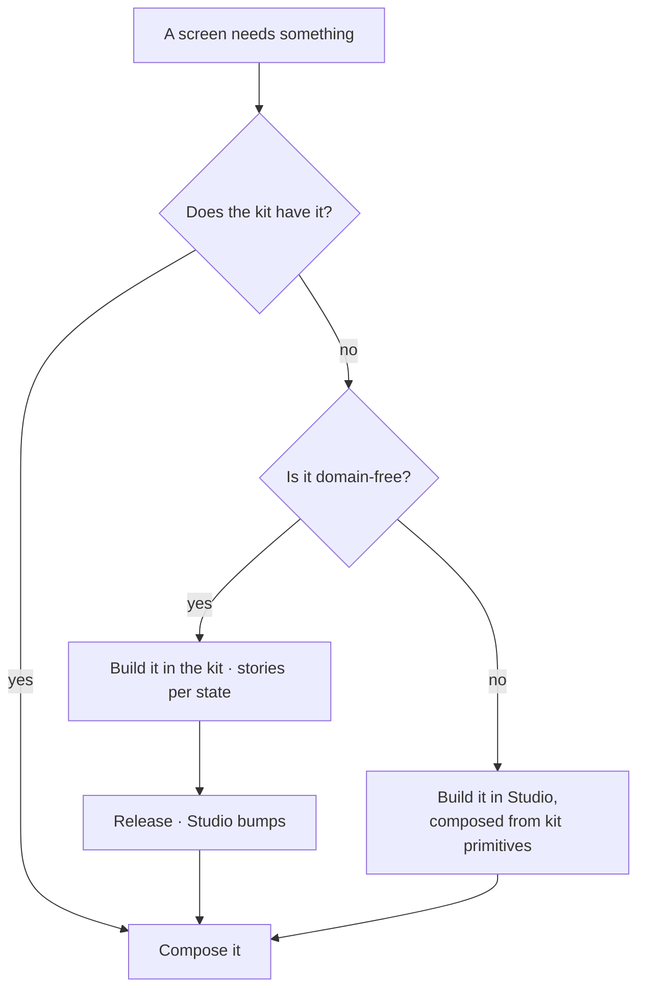

# Design system

Studio builds from the shared component packages, never beside them. A gap is filled in the kit, so
every surface inherits the fix.

| | |
|---|---|
| Index | [13.1](../../../README.md#13--platform) |
| Module | [Platform](../spec.md) |
| API / CLI / Studio | — / — / 🟡 |
| Related | [theming](theming.md) |

> **As** someone building a screen, **I want** the panel, the table and the form to already exist and
> already match, **so that** I am composing a surface rather than inventing one.

## Capabilities

| # | Capability | Notes |
|---|---|---|
| C1 | Components come from the kit | UI, forms, tables, themes, styling, and the graph renderer |
| C2 | A missing component is added upstream | Not rebuilt locally |
| C3 | Domain types never reach a component prop | If they must, it belongs in Studio |
| C4 | Release before consume | The kit ships; Studio bumps |
| C5 | A story per state | Empty · loading · streaming · error · dense |
| C6 | Panel composition is a rule | Shell from the UI package, fields from the forms package |
| C7 | Answer-surface components live in the kit | The inventory below; drawn on the four Ask artboards ([Ask §7a](../../ask/spec.md)) |
| C8 | One shell skeleton, shared | Rail, panel bands, canvas tab bar, status lines — built once and reused, never re-grown per surface ([Platform §2b](../spec.md)) |

## Panel composition

| Region | Comes from | Rule |
|---|---|---|
| Shell — tab strip, header actions, pinned footer | UI package | One tab strip per panel; tabs are the panel's views |
| Stacked sections with their own collapse | UI package | A lone section needs no header |
| A field block | Forms package | Flattened inside the shell, and carrying no title of its own |
| Creating | Header | An icon with a tooltip |
| A footer bar | Only two jobs | A decision on what the panel shows, or a commit in an editor |
| Row actions | On the row | Or in the header of the panel showing that row's detail |

## The inventory

What the hi-fi asks for, against what already exists. Most of the shell is built: `PanelChrome`
gives every work panel its filter band, action bar and status line, and the thread already renders
steps, a diagnosis and a windowed table. A component that carries a domain type stays in Studio
(DS2); only a domain-free gap goes to the kit, which is its own repository (DS3).

### Shell and panels

| Component | Today |
|---|---|
| Tabbed panel · panel stack · panel content · toolbar · tree view · nav rails · search input · rich select · table · tabs · badge · tooltip · sheet · skeleton · spinner | `@invana/ui` |
| Icon rail | `useGraphLeftNav` on the kit's vertical nav |
| Filter chip band · action bar · panel status line | `work/PanelChrome.tsx` — **retiring** into `FilterBar` + `SectionHeader` + `AppStatusBar` (DS17) |
| Work row | `work/WorkRow.tsx` — **retiring** into `Item size="xs"` + `StatusDot` + `Badge tone` (DS17) |
| Canvas tab bar · canvas legend and footer cards | `explorer/CanvasTabsBar.tsx` — **retiring** into `TabbedPanel variant="strip"` (DS17) · `work/WorkCanvasChrome.tsx` |
| Graph status bar | `graphs/components/GraphStatusBar.tsx` — **retiring** into `AppStatusBar` (DS17) |

Nothing here is rebuilt. A shell change is a change to the file that already owns it — and for the five
rows marked **retiring**, that file is now in the kit (DS17).

### The answer surface

Drawn on *Explorer · one answer, five kinds*, *… another projection*, *… Understand asks back*
and *Four ways a run ends*.

| Component | Shape | Today |
|---|---|---|
| Step list | a row per step: the step, its result, its timing; a repair or retry noted on the step that did it | `SessionSteps.StepList` |
| Todo fold | `Todo for 6.4s · 7 of 7 steps · 6 emissions · Verify: served` | `SessionSteps.StepsSummary` — the emission count is not in it |
| Diagnosis card | an error tint: `step · code`, the sentence, a `what was tried` block, then `Open the trace` and `Retry` | `SessionSteps.DiagnosisBlock` |
| Question card | the question, the declared options with their counts, and the line that nothing here was generated | `SessionSteps.OptionRow` — the card around it, and `Answer`, are missing |
| Message bubble | the person's question, muted, asymmetric radius | `SessionTurn.PromptTurn` |
| Table block | a 26px head row, 11px head type, 12px cells, rules between rows only | `ResultsTable`, windowed, now inside the emission card |
| Subgraph | a strip saying what landed — `9 nodes · 12 edges added to the canvas — nothing replaced` | `emissions/EmissionBodies.tsx`; the offer before it lands stays on the reply line |
| Emission card and its header | a 24px header — `kind` · `template@version` · `cite · N records` — over the body, one border, 6px radius | `emissions/EmissionCard.tsx` — **retiring** into the kit's `EmissionCard` + `EmissionHeader` (DS17) |
| Metric | the value at scale with its label beside it, and a comparison line beneath | `emissions/EmissionBodies.tsx` — no producer yet |
| Chart | horizontal bars carrying their own label and value; a caption above | `emissions/EmissionBodies.tsx` — no producer yet |
| Prose | cited sentences, with markers that resolve to records | `emissions/EmissionBodies.tsx` — no producer yet |
| Empty result | the same header at `0 records`, and one sentence naming what the graph does not hold | `emissions/EmissionBodies.tsx` |
| Cannot-answer card | dashed, no citation strip, and what would change that | `emissions/NotAnAnswer.tsx` — **retiring** into the kit's `CannotAnswerCard` · `DiagnosisCard` · `RepairNote` · `RetryNote` (DS8, DS17) |
| Projection picker | hangs off the emission header behind `switch ▾`: each template with its kind, `in use`, or why it is refused — and the line that the query does not run again | `emissions/TemplatesPanel.tsx` — **retiring** into the kit's `TemplatePicker` (DS17) |

The whole surface is built on both sides now: Studio shipped it at S9b–S9f, and the kit shipped its
own set at `0.0.23` (`EmissionCard` · `CannotAnswerCard` · `DiagnosisCard` · `RepairNote` ·
`RetryNote` · `ClarifyCard` · `TemplatePicker` · `ProposalCard` · `RatingControl` · `CitationList`).
That is one surface with two implementations, which DS1 forbids — so every **retiring** row above is
a deletion at the call site, not a rewrite. It is the first work of the screen-first pass, because
forty-two screens built on the Studio copy would make the copy permanent.

## Journey

## Seams

| Seam | What the developer sees |
|---|---|
| Studio pinned behind | Named in the index; features that need newer components are blocked, not worked around |
| A kit change not yet released | Studio still resolves npm, so the build stays green for everyone. To see it, point `INVANA_DESIGN_KIT` at the checkout (DS10); to ship it, release and bump. An import of an export npm lacks is a broken clone, so it waits behind a `TODO` naming the version |
| A canvas change not yet released | The same, through `INVANA_CANVAS` (DS11). It matters more here: the canvas packages release in lockstep across a whole repo, so seeing one unreleased engine change otherwise means publishing every package |
| A component that needs a domain type | The signal that it belongs in Studio |
| A one-off variant | A prop on the kit component, or it is not a variant |

## Decisions

| # | Decision |
|---|---|
| DS1 | Studio has no parallel component layer. |
| DS2 | A component whose props need a domain type belongs in Studio. |
| DS3 | Release before consume; no local links in a committed manifest. |
| DS4 | Every component ships stories for its real states. |
| DS5 | Panel composition is a rule, not a per-screen choice. |
| DS6 | A kit component takes a kind, a template name and rows — never a domain object. |
| DS7 | The emission header is one component wherever an emission appears — thread, task result, scheduled answer ([Ask K8](../../ask/spec.md)). |
| DS8 | The four run outcomes are four components. Retry, repair, cannot-answer and diagnosis never share a card with a variant prop. |
| DS9 | An emission renders through the emission card. A kind is a body inside it, never a block of its own. |
| DS10 | A developer works against a local kit checkout through an **opt-in build alias**, never a manifest edit. `INVANA_DESIGN_KIT=<path> pnpm dev` points Studio's Vite resolve at that checkout; unset — a fresh clone, CI, anyone who has never cloned the kit — everything comes from npm. That is what makes DS3 liveable: you can see a component before it ships without a link that could be committed by accident. |
| DS11 | The same hatch covers the canvas checkout: `INVANA_CANVAS=<path> pnpm dev` aliases `@invana/canvas`, `canvas-core`, `canvas-store`, `canvas-react`, `graph`, `renderer-pixijs` and both layout packages to their local builds. Same contract as DS10 — opt-in, off by default, aliased to each package's **build** so what runs is what npm would ship. The two are independent; either, both or neither. While it is open, `pixi.js` and `pixi-viewport` are pinned to Studio's copies, because the canvas checkout carries its own and `resolve.dedupe` does not reach outside this app's `node_modules`. |
| DS12 | **Studio drives the shell's regions; it builds no layout of its own.** `AppLayoutV2` takes `leftSection` · `mainSection` · `rightSection` · `bottomSection` · `footer`, and every graph-scoped page fills them. The shell keeps the main region mounted at a stable position with each side region as a conditional sibling, so opening a panel never remounts the canvas — that is a property of the shell, not something a page re-implements to protect itself. |
| DS13 | **Studio declares no type ladder, and no colour tokens.** It imports `@invana/styling` as source, so the kit's `@theme` block is the one ladder — `text-base` 1rem and `text-meta` 0.923rem as ratios of the root, `lg` and up on Tailwind's heading defaults — and the same block registers every `--color-*` token, which is what a local `@theme inline` colour map used to do. A ladder of Studio's own is not a preference, it is a second source of truth: the six-rung absolute scale that stood here was authored against a 16px root, never re-checked when `html` went to 13px, and rendered every step ~19% under its own comment. New code names `text-meta` when it means subordinate and nothing at all when it means body. |
| DS14 | **Every artboard becomes a Studio screen, ahead of its engine.** The 42 artboards in `.design/hi-fi-finance/` are the Studio backlog, not a reference for later: each is built as a real route composed from `@invana/*`, whether or not its `API` column is ✅. This reverses the old sequencing rule that a Studio surface is drawn at its own slice — the kit is complete enough that the screen is now the cheap half, and building them together is what stops forty-two screens inventing forty-two shells. |
| DS15 | **A screen ahead of its engine is wired to nothing, and says so.** It renders `EmptyState` naming the endpoint that unlocks it. It never fabricates rows, counts or timings — a screen that lies about having data is worse than no screen, because it cannot be told apart from a broken one. It carries **🖼** in the index's Studio column, never ✅; a feature still ships only when every column it needs is ✅. |
| DS16 | **One shell, and `mainSection` is `BoardPagesViewPanel`.** The reference is `canvas-ui/apps/AppLayoutV2` in the canvas Storybook; the design-kit's `Themes/AppV2 › ExplorerShell` still fixes what the side regions hold. Main is not a screen — it is the open pages, a tab strip and their bodies as one component, `keepMounted` so an inactive page keeps its camera, scroll and selection instead of being destroyed. `content` is any node, so every screen is a page and there is one main region with one mechanism. The tab strip is what is **open**; the URL names what is **active** — they do not compete. Panel toggles ride on the strip's `headerActions`, because a control belongs to the thing it opens. Story-only bits are never copied: mock data, `storageKey={null}`, `mainClassName` heights. A gap shows up as an `!`-override, and an override ported into Studio is permanent — so it is closed in the kit instead. See [the shell](../../../building-studio/the-shell.md). |
| DS17 | **The shell components Studio grew before the kit had them are deleted, not kept beside it.** `work/PanelChrome.tsx`, `work/WorkRow.tsx`, `explorer/CanvasTabsBar.tsx`, `graphs/components/GraphStatusBar.tsx` and `explorer/components/emissions/EmissionCard.tsx` each now have a kit equivalent (`SectionHeader` + `FilterBar`, `Item size="xs"`, `TabbedPanel variant="strip"`, `AppStatusBar`, `EmissionCard` + `EmissionHeader`). Each goes at its call sites before the screens that would multiply it. DS1 with dates on it. |
| DS18 | **A form is described, not written.** Studio declares a `FieldConfig[]` and renders it through `@invana/forms`' `ObjectField`; it does not hand-write fields, labels and error state per screen. `react-hook-form` is the kit's implementation detail and its peer dependency — Studio imports form *types* from `@invana/forms`, never from `react-hook-form`, and once the kit re-exports `useForm` it imports nothing from it at all. The gate on converting the eleven hand-written forms is validation: `FieldConfig` carries no `required`/`rules` today, so the one converted form validates by calling `setError` at submit. That is a kit gap to close (C2), not a pattern to copy eleven more times. |

## Not building

| Not building | Because |
|---|---|
| A Studio-only component library | two libraries diverge within a month |
| Per-screen style overrides | a variant belongs on the component |
| A plugin API for third-party UI | the kit is the extension point |
| A Studio form library, or a validation schema layer beside the kit's | a second way to describe a form is a second source of truth for what a field *is* — the rules belong on `FieldConfig`, in the kit |
