# Logging

One call at startup and every module's logger works. Standard library only, so nothing already written
as `getLogger(__name__)` has to change.

| | |
|---|---|
| Index | [13.4](../../../README.md#13--platform) · Slice **S1** |
| Module | [Platform](../spec.md) |
| API / CLI / Studio | ✅ / — / — |
| Related | [telemetry](telemetry.md) · [command-line](command-line.md) |

> **As** whoever is debugging this at two in the morning, **I want** log output that exists and is
> parseable, **so that** the first step is reading rather than adding print statements.

## Capabilities

| # | Capability | Notes |
|---|---|---|
| C1 | Configured by one call | At startup, with defaults that need no arguments |
| C2 | Standard library only | No framework replaces the logger already in use everywhere |
| C3 | Two formatters | A plain line for a terminal, one JSON object per line for a collector |
| C4 | Full override | A deployment or an integration passes its own configuration dictionary |
| C5 | Exceptions carry their traceback | In the JSON formatter as a field, not smeared across lines |
| C6 | Per-logger levels | The engine's own modules and noisy dependencies are set separately |
| C7 | Ties to a request | A request id in the line, so a log and a trace are the same story |

## Journey

```mermaid
flowchart LR
    A[Startup] --> B[configure logging · once]
    B --> C{Where is this running?}
    C -->|a terminal| D[Plain formatter]
    C -->|a collector| E[JSON per line]
    C -->|special| F[The deployment's own dict]
    D --> G[Every getLogger&#40;__name__&#41; works]
    E --> G
    F --> G
```

## Seams

| Seam | What you see |
|---|---|
| Not configured | The default applies — never silence |
| Configured twice | The last call wins, and says so |
| A noisy dependency | Its level is set independently of the engine's |
| Structured field in a plain formatter | Rendered inline rather than dropped |

## Engine

| Thing | Shape |
|---|---|
| Configuration | one default dictionary, overridable whole |
| Formatters | plain and JSON — timestamp, level, logger, module, function, line, message, exception |
| Entry point | called once by the server and by the CLI |

## Decisions

| # | Decision |
|---|---|
| LO1 | Standard library logging; nothing replaces the module logger. |
| LO2 | Configured once at startup, never at import time. |
| LO3 | Defaults work with no arguments; the whole configuration is overridable. |
| LO4 | JSON output is one object per line. |

## Not building

| Not building | Because |
|---|---|
| A logging framework dependency | it breaks every `getLogger(__name__)` already written |
| Environment-driven logging settings | a constant plus an override covers it without a settings model |
| Log shipping | that belongs to the platform running the engine |
