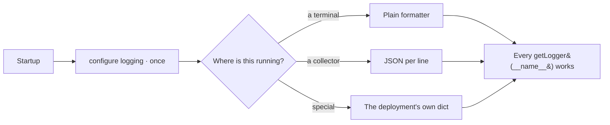

# Logging

One call at startup and every module's logger works. Standard library only, so nothing already written
as `getLogger(__name__)` has to change.

| | |
|---|---|
| Index | [13.4](../../../README.md#13--platform) · Slice **S1** |
| Module | [Platform](../spec.md) |
| API / CLI / Studio | 🟡 / 🔵 / — |
| Related | [telemetry](telemetry.md) · [command-line](command-line.md) |

> **As** whoever is debugging this at two in the morning, **I want** log output that exists and is
> parseable, **so that** the first step is reading rather than adding print statements.

## Capabilities

| # | Capability | Notes |
|---|---|---|
| C1 | Configured by one call | At startup, with defaults that need no arguments |
| C2 | Standard library only | No framework replaces the logger already in use everywhere |
| C3 | Two formatters | A plain line for a terminal, one JSON object per line for a collector |
| C4 | Full override | A deployment or an integration passes its own configuration dictionary |
| C5 | Exceptions carry their traceback | In the JSON formatter as a field, not smeared across lines |
| C6 | Per-logger levels | The engine's own modules and noisy dependencies are set separately |
| C7 | Ties to a trace | `trace_id` and `span_id` in every line — plain, JSON and OTLP — so a log and a trace are the same story |
| C8 | Lifecycle, not chatter | a run's start and end, a loop's failure, startup — the facts an operator reads; per-request noise stays at debug |
| C9 | Redacted at write | the same field-name and type rule as events |
| C10 | Structured context | `principal` · `origin` · `graph` as fields when the code knows them |

## Journey

```mermaid
flowchart LR
    A[Startup] --> B[configure logging · once]
    B --> C{Where is this running?}
    C -->|a terminal| D[Plain formatter]
    C -->|a collector| E[JSON per line]
    C -->|special| F[The deployment's own dict]
    D --> G[Every getLogger&#40;__name__&#41; works]
    E --> G
    F --> G
```

## Seams

| Seam | What you see |
|---|---|
| Not configured | The default applies — never silence |
| Configured twice | The last call wins, and says so |
| A noisy dependency | Its level is set independently of the engine's |
| Structured field in a plain formatter | Rendered inline rather than dropped |

## Engine

| Thing | Shape |
|---|---|
| Configuration | one default dictionary, overridable whole |
| Formatters | plain and JSON — timestamp, level, logger, module, function, line, message, exception, `trace_id`, `span_id`, `principal`, `origin`, `graph_id`; plain shows `[trace_id span_id]` only inside a span and the fields inline (`principal=user origin=studio`) only when bound |
| Trace ids | read from the current span by a filter on the console and OTLP handlers; without the telemetry extra they are empty |
| Structured context | `principal` · `origin` · `graph_id` from a context variable the span helpers bind (`core/logging/context.py`); present without the telemetry extra |
| Redaction | a filter on every handler drops sensitive `extra=` fields and redacts mapping arguments by the events rule (`core/redaction.py`) |
| Access log | uvicorn's access log has `token` stripped from the path |
| Levels | the lifecycle logs of [telemetry](telemetry.md) § Logs |
| Entry point | called once, when `invana` is imported — the server and the CLI alike; the CLI then lowers the level to INFO with `set_level`, in place |

## Decisions

| # | Decision |
|---|---|
| LO1 | Standard library logging; nothing replaces the module logger. |
| LO2 | Configured once at startup, never at import time. |
| LO3 | Defaults work with no arguments; the whole configuration is overridable. |
| LO4 | JSON output is one object per line. |
| LO5 | Every log line carries `trace_id` and `span_id` — in the plain and JSON formatters, not only in OTLP. |
| LO6 | What is logged is set by [telemetry](telemetry.md) § Logs: lifecycle and failures at info and above, everything else at debug. |
| LO7 | A log never carries record contents, prompts, answers or credentials; redaction is at write, as for events. |
| LO8 | Structured context is bound, never passed: code logs `log.info(..., extra={...})` with its own ids, and who, from where and which Graph arrive from the context the span helpers bound. |
| LO9 | Redaction is a filter on each handler, not on a logger — a logger's filter never sees the records its children propagate. |
| LO10 | After startup, a level changes in place (`set_level`); the configuration is never rebuilt, because rebuilding closes every handler — telemetry's OTLP handler with them. |

## Not building

| Not building | Because |
|---|---|
| A logging framework dependency | it breaks every `getLogger(__name__)` already written |
| Environment-driven logging settings | a constant plus an override covers it without a settings model |
| Log shipping from files | OTLP export is [telemetry](telemetry.md)'s; tailing files belongs to the platform running the engine |
