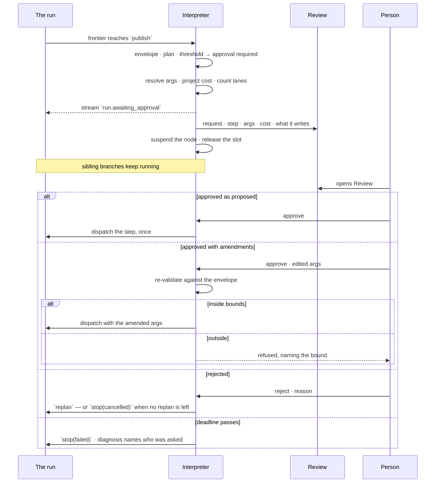

# The runtime

**One module runs every plan in the product.** It plans, dispatches, fans out, branches, loops when a
Task says to loop, and stops for a person when a Task may not proceed alone — recording all of it as
one run with one vocabulary, whether the plan came from a question, an import, a stitch, a Todo or a
workflow.

> ⚠ **Rewritten for [orchestration § 0](../../../orchestration.md#0-the-records).** A plan is a
> `TaskPlan`, its nodes are `Task` rows, and a run is a `TaskRun`. **The word *step* survives as a
> role** — a Task in the position of a child, which is what the authoring format writes as `steps:`.
> What used to be called a *Task* here is a **Todo**. Migration:
> [task-model-migration.md](../../../building-engine/task-model-migration.md).

Two properties are not features of this module. They are what it is for:

| | |
|---|---|
| **Observability** | At every moment: what is running, how far it got, what it has spent, what it is waiting on |
| **Auditability** | Afterwards: who decided what, on whose behalf, with which arguments, against which bound — reconstructable from the record, never from inference |

| | |
|---|---|
| Index | [13.8](../../../README.md#13--platform) · Slice **S15** |
| Module | [Platform](../spec.md) — the workhorse layer, like [logging](logging.md) and [telemetry](telemetry.md). `todos` · `task_plans` · `tasks` · `task_runs` are owned elsewhere; the runtime is what walks them |
| API / CLI / Studio | 🟡 / — / — |
| State | Built and shipped; this document is the shape it is being moved into. Its one user-facing half — deciding on an approval — is a row kind in [Review](../../work/features/review.md), and that Studio column is Review's |
| Related | [runtime-and-adapters](../../ask/features/runtime-and-adapters.md) · [envelope-and-budget](../../agents/features/envelope-and-budget.md) · [plan-selection](../../workflows/features/plan-selection.md) · [clarifying-questions](../../ask/features/clarifying-questions.md) · [delegation](../../agents/features/delegation.md) · [review](../../work/features/review.md) · [projects-and-tasks](../../work/features/projects-and-tasks.md) · [schedules](../../operate/features/schedules.md) · [audit-and-activity](../../operate/features/audit-and-activity.md) · [observability](../../operate/features/observability.md) |

> **As** someone building a deep agent flow, **I want** fan-out, branching, retries, timeouts and a
> human gate in the middle, **so that** I can express a real pipeline without leaving the product —
> and account for every step of it afterwards.

---

## 1. What this is, and what it is not

| It is | It is not |
|---|---|
| A **plan interpreter** — it walks a validated plan graph, holds a frontier, honours the signals steps return | A job scheduler. It does not backfill or distribute across machines |
| Closed to the **step catalogue** | A plugin host. Nothing third-party registers a step |
| A **policy engine** — its abstractions exist to refuse, not to permit | A framework. There is no second implementation of anything, and it is not a package |

The word for the module is **runtime**. [terminology §8](../../../terminology.md) retires
*orchestrator* unqualified — *agent orchestrator* stays the name for what Invana is as a product.

**Why not an external orchestrator.** Every one of them takes a plan written ahead of time, as code.
This runtime takes a plan **generated at runtime, as data, validated against an agent's envelope
before anything executes**. Handing that to a general executor means putting this interpreter inside
one of its tasks — full infrastructure cost, nothing back.

## 2. The parts

| Part | Answers | Today |
|---|---|---|
| **Planner** | which plan runs — selected by intent, generated when nothing fits, expanded, then validated against the envelope | `planning.py` |
| **Interpreter** | what happens next — the frontier, the control signals, suspend and resume | `runtime.py` `_loop` |
| **Catalogue** | what a step *is* — the closed set of callables, each with a declared input schema | `tasks.py` |
| **Executor** | *where* a step runs. One protocol, one implementation: in-process asyncio | `runtime.py` dispatch |
| **State** | the run, its lanes and its attempts, durably | `models.py` · `services.py` |
| **Artifacts** | what a step produced that is too big for a row | — |
| **Stream** | what the reader sees, in order | `stream.py` |

The executor stays one function behind one protocol. It grows a registry the day someone actually
swaps it, and not before.

## 3. Todo, plan, run

```
Todo                       what someone wants done · assignee · definition of done
└── TaskPlan               the flow that carries it out · authored, generated or reused
    └── TaskRun            one execution · plan_snapshot · lens_snapshot · agent · outcome
        ├── run of Task  translate    a callable from the catalogue
        ├── run of Task  execute      attempt 1 failed · attempt 2 succeeded — two rows, never one mutated
        ├── run of Task  enrich       200 lanes, 8 at a time — one row per lane
        └── run of Task  delegate ──▶ child TaskRun
                                       └── …
```

**A *step* is a Task in the role of a child** — the word survives as a role, and the authoring format
still writes `steps:`. What it never is, is a second record.

| Rule | Detail |
|---|---|
| Assigning a Todo opens exactly one **root run** | `triggered_by = task`, `todo_id` set. A retry is a **new run**, never a mutated one |
| A workflow is the **plan**, not a kind of run | A reusable `TaskPlan`, selected from the library by intent, recorded as `plan_origin = reused:<id>` |
| **A Task never becomes a Todo** | A Task that needs an owner is `form: human`, or raises a Todo in [Work](../../work/spec.md); that child is a Todo or a run of its own |
| The plan that ran is frozen on the run | `plan_snapshot` — the trace replays even after the plan or the agent's envelope changes |
| **So is the world it ran against** | `lens_snapshot` — the model versions and stitches it resolved ([orchestration § 0.9](../../../orchestration.md#09-grounding-a-run--the-lens)) |
| A run's **`role`** says what it is for | `execute` · `plan` · `evaluate`. Planning and evaluating are ordinary runs, not a second mechanism |

### 3.1 Every kind runs here

**"One module runs every plan" is the claim this section has to keep.** A kind is a unit of intent;
the runtime is indifferent to which one it is walking. What differs between kinds is the plan and the
catalogue entries in it — never the interpreter, the frontier, the child-run rows, the logs, the events or
the journal.

| Kind | Its plan | Opened by | Through the interpreter |
|---|---|---|---|
| `ask` | selected by intent, generated when nothing fits | the composer · a Todo · a schedule | ✅ |
| `import` | `dataset-import@1` — `validate_records · write_graph · stitch · snapshot_model` | `invana records import` · `POST …/datasets/{id}/imports` | ❌ **hand-written rows** |
| `bulk` | `bulk-load@1` — one step, `bulk_write` | `invana loader --graph` | ❌ **no run row at all** |
| `stitch` | `stitch-apply@1` | `invana stitches apply` | ❌ |
| `enrich` | authored or promoted | a plan step · a schedule | 🔵 not built |

Three of the five do not run here today, and the cost is not theoretical:

| Duplicate | Where | What it costs |
|---|---|---|
| A second run table | `import_jobs` — its own status enum, its own lifecycle, `run_id` pointing sideways at the real run | one load, two records that can disagree |
| A second interpreter | `apps/datasets/run.py` writes `RunStep` rows by hand — `start` · `finish` · `fail` | retries, timeouts, cancellation, signals and approvals are absent from imports, and adding one means writing it twice |
| A second log store | `import_jobs.logs` jsonb, against `run_logs` for everything else (§17) | level filtering is queryable for a question and not for a load |
| A second event vocabulary | `import.started · progressed · completed · failed · cancelled`, against the closed `run.*` set (§13) | an automation watching runs does not see imports |
| A plan outside the library | `dataset-import@1` is a constant in `apps/datasets/`; `WORKFLOWS` in `runtime/workflows.py` holds three more | `plan_origin` names a version the library cannot resolve, so the trace cannot show the plan that ran |

**The fold is the fix, and it runs one way.** `import_jobs` folds into `todos` · `task_runs` ·
`task_runs`; its `logs` become `run_logs`; its events become the `run.*` set; its four steps
become catalogue entries the interpreter dispatches; and its plan becomes a **builtin workflow
version** in the library like any other ([§7 F9](../../workflows/spec.md)).

| Rule | Detail |
|---|---|
| A kind is a property of the **todo**, never of the machinery | `runs.kind` selects a plan. Nothing downstream of that branches on it |
| Every run has a plan, including the trivial ones | A bulk load is a one-step plan, not an exception. Its weaker guarantees — no per-record validation, no provenance — are properties of `bulk_write`, not of the run |
| Kind-specific detail is a **read-time** concern | An import's Reported and What landed blocks are how [Runs](../../operate/features/see-what-ran.md) C7 renders one kind. They are not a second write path |
| No surface may hold a run the journal does not | A load with `--graph` omitted records nothing and says so; there is no third place it could land instead |

### 3.2 A multi-stage load is an ordinary workflow

The shape a real ingestion wants — *load three datasets, stitch them, enrich what landed, and stop if
validation fails* — has no object today. One `invana records import` is one dataset; the bundle that
`stitches.json` already describes has no run of its own.

**It does not need a new concept. It is a workflow, and its stages are steps.**

```yaml
# bundle-import@1
steps:
  - id: check                                     # the preflight LD12 already ships
  - id: load        depends_on: [check]
                    map_over: ${steps.check.datasets}      # one lane per dataset
                    max_parallel: 4
                    on_lane_failure: continue
                    uses: workflow:dataset-import@1        # the single-dataset plan, inlined
  - id: stitch      depends_on: [load]
  - id: enrich      depends_on: [stitch]
                    when: ${steps.load.written} > 0
  - id: triage      depends_on: [{step: load, on: failure}]
                    step: create_task                      # a person owns the broken source
```

| Question | Answer |
|---|---|
| What is a stage? | A **step**. The plan grammar of §4 already carries every part: `depends_on` for order, `on: failure` for the unhappy branch, `when` for a conditional stage, `map_over` for per-dataset fan-out, `approval` for a gated write |
| Is a stage a Todo? | **No.** A Todo has a definition of done; a plan node has neither an owner beyond the run nor an acceptance, and nobody accepts a load. [Work W6](../../work/spec.md) already says this — this is the same rule at the ingestion altitude |
| Where does the fan-out collection come from? | The bundle manifest. `stitches.json` names the datasets and the rules between them, so the declaration a person already writes is the collection the plan maps over |
| How does it ask a person for something? | Two ways, and they are the two pauses of §10: `approval: required` on a node when it may not proceed alone, and a `form: human` Task when someone must go and *do* something. **A plan produces Todos; it is never made of them** |
| How does it recur? | **One kind of schedule** — it names the TaskPlan and opens a run ([10.1 SC6](../../operate/features/schedules.md)). It raises no Todo nobody accepts, because the plan it names raises none |
| What holds the stages together as one thing? | The run. One run, one trace, one cost roll-up, one row in [Runs](../../operate/features/see-what-ran.md) with its lanes and its delegated children under it |

**This is the flow the deferrals were waiting for.** §21 defers the frontier, lanes and `uses` until
"one real flow needs a branch or a fan-out". `bundle-import@1` needs all three — a failure branch, a
lane per dataset, and the single-dataset plan inlined rather than copied — against a collection that
is already declared and already checked offline. It is the right flow to build them against, because
every part of it exists except the walking.


## 4. The plan is a graph

A plan is **data**: a list of nodes with declared edges. Never code, never a hand-drawn diagram.

```yaml
steps:
  - id: understand
  - id: plan         depends_on: [understand]
  - id: translate    depends_on: [plan]
  - id: validate     depends_on: [translate]
  - id: execute_a    depends_on: [validate]          # these two
  - id: execute_b    depends_on: [validate]          # run in parallel
  - id: merge        depends_on: [execute_a, execute_b]
  - id: enrich       depends_on: [merge]
                     map_over: ${steps.merge.rows}
                     max_parallel: 8
                     on_lane_failure: continue
  - id: report       depends_on: [enrich]
                     uses: workflow:publisher-report@v3
  - id: recover      depends_on: [{step: execute_a, on: failure}]
  - id: publish      depends_on: [report]
                     when: ${steps.enrich.written} > 0
                     approval: required
                     timeout_s: 120
```

| Field | Does |
|---|---|
| `id` | the node's name. What `${steps.<id>.<key>}` binds to, and what every record references |
| `depends_on` | its upstream edges. A bare id means `on: success` |
| `when` | a predicate over prior outputs. False ⇒ the step is **skipped**, and skipping propagates |
| `map_over` | fan out over a collection — one **lane** per element |
| `loop` | repeat this node until a predicate holds — one **iteration** per pass. The predicate may be satisfied by a person, see §4.1 |
| `max_parallel` | the lane ceiling for this step |
| `on_lane_failure` | `fail` · `fail_fast` · `continue` |
| `uses` | inline another workflow version's steps here |
| `approval` | this step may not be dispatched without a person |
| `timeout_s` | this step's own deadline |
| `retry` | attempts, backoff, and which failure classes retry |

| Rule | Detail |
|---|---|
| Cycles are rejected at validation | Named, with the loop shown — the same way `todo_dependencies` rejects one. **This bans declared cycles, not repetition** — see §4.1 |
| `uses` expands **before** validation | The envelope checks the whole expanded graph, so a composed plan can never smuggle a step past it. Expansion depth is bounded |
| Args are schema-checked at validation | Each catalogue entry declares its input shape. A bad argument is refused with the plan, not at dispatch |
| A generated plan obeys the same grammar | An LLM emits this structure; it is validated identically to a template. Nothing skips the check because of where it came from |

### 4.1 The plan is acyclic. The execution is not.

These are two different claims, and holding both is deliberate.

| | Cyclic? | Bounded by |
|---|---|---|
| The plan's declared `depends_on` edges | ❌ never | — |
| `repeat` — a failure retried | ✅ | `retry.max_attempts` |
| `back(id)` — a mistake repaired | ✅ | repair budget, once |
| `replan` — a plan that did not serve | ✅ | `task_runs.replans` |
| `loop` — deliberate iteration | ✅ | `max_iterations`, and a deadline when it waits on a person |

**A declared back-edge has no termination argument of its own.** A bounded repetition does. So
cycles are allowed exactly where a counter can bound them, and nowhere else — which is why they live
on nodes and in signals, never on edges.

The three signals above are all **exception paths**: retry a failure, repair a mistake, throw away a
plan. None of them iterates on success, and that is the gap `loop` closes.

#### `loop` — a node that re-dispatches itself

Repetition is a property of a node, exactly as `map_over` already is. Fan-out is parallel repetition;
a loop is serial repetition. **Neither is an edge**, so the DAG check never changes.

```yaml
- id: research
  depends_on: [understand]
  uses: workflow:evidence-gather@v2     # the body — itself a DAG
  loop:
    until: ${steps.research.confidence} >= 0.8
    max_iterations: 5
    on_exhausted: continue              # or: fail
    accumulate: rows                    # optional — else the last pass wins
```

The node stays `running` on the frontier while it iterates. Downstream nodes are simply not ready
yet, which is what already happens during any long step:

```
running: ["research"]
  ├── research  iteration 1  →  confidence 0.4    false, 1 < 5  → dispatch again
  ├── research  iteration 2  →  confidence 0.6    false, 2 < 5  → dispatch again
  └── research  iteration 3  →  confidence 0.9    TRUE          → settle succeeded
done: [… "research"]                              → `assess` becomes ready
```

| Rule | Detail |
|---|---|
| **The model influences termination; the interpreter decides it** | A step returns a *value* — `confidence`, `done`, `rows_found`. `until` is a predicate over bound values in the same expression language as `when`: data, validated at plan time, and it cannot hang |
| `max_iterations` is required | Refused at validation if it exceeds the envelope's ceiling. A model that never says *done* costs you the bound, not your budget |
| The body may be a subgraph | `loop` composes with `uses`. The body expands **before** validation, so the envelope sees every step in it; the expansion is one copy and the repetition is runtime |
| The binding surface does not change | Downstream sees one output — the last pass, or every pass under `accumulate`. Inside the body, `${self.previous}` is what the last pass produced |
| Cost is projected as `per-iteration × max_iterations` | Checked at validation, the same way a fan-out's size is |
| Repetition nests | *for each of 200 entities (**lane**), research until confident (**iteration**), retrying on 429 (**attempt**)* is one real flow, and each pass is its own row |

#### A loop may wait for a person — the **verdict** pause

`until` as described is a predicate over data, and that is deliberate: *it cannot hang*. But the flow
this exists for is often **draft → judge → refine**, where the judge is a person and the thing being
judged is what the iteration just produced.

```yaml
- id: draft
  depends_on: [gather]
  uses: workflow:compose-summary@v2
  loop:
    until: ${self.verdict} == 'accepted'
    max_iterations: 5
    on_exhausted: fail
    verdict:
      ask: "Good enough to publish?"
      options: [accepted, revise]
      deadline_s: 86400
```

| Rule | Detail |
|---|---|
| The verdict is asked **after** the pass produced output | This is what separates it from an approval. An approval is asked *before* dispatch, so nothing is spent; a verdict is asked when the work already exists, and the question is whether to pay for another pass |
| **Two bounds, because there are two actors** | `max_iterations` bounds how often the *agent* may redo it; `deadline_s` bounds how long the *person* may take. Neither substitutes for the other, and both are envelope-capped |
| The note is bound into the next pass | A verdict carries a choice **and an optional note**, bound as `${self.feedback}` beside `${self.previous}`. Without it the loop is a retry, not a refinement — the agent would redo the same work with the same inputs |
| Only a `user` gives a verdict | An *agent* judging output is a `verify` step with an `until` predicate. That path already exists, costs no pause and no deadline, and is the right tool when the check is mechanical |
| **Never auto-accept** | A deadline that passes is `stop(failed)` with a diagnosis naming who was asked — never a silent acceptance. A rule that accepts on the agent's behalf is the switch this pause exists to replace (§22) |
| Exhausting the iterations **fails by default** | Five *revise* verdicts and no acceptance means the person never accepted. `on_exhausted: continue` is an explicit opt-in — *take the best of five* — not the default |
| The person sees the cost | The pass's emissions, the iteration number, how many remain, and what has been spent — so *"accept, it will not get better"* is an informed call rather than a shrug |
| It asks once per iteration, not per lane | A fanned-out body asks one verdict and states the lane count, exactly as an approval does (RP15) |
| A suspended verdict releases the slot | RP17. A run waiting overnight on a person holds no concurrency |

**Three pauses, three nouns.** They are not interchangeable, and §10 keeps them apart:

| Pause | Asks for | Its answer is a |
|---|---|---|
| Clarification | information the step lacks | **answer** |
| Approval | permission, before dispatch | **decision** — approve · reject |
| Verdict | judgement on output, after dispatch | **verdict** — accept · revise |

**Why not the alternatives.**

| Design | Why not |
|---|---|
| Declared back-edges | legible, but the bound becomes a global recursion limit that does not know which loop it is bounding |
| A child run per iteration | nesting and lineage come free, but it costs a plan, a stream and an await per pass. Right for *delegation*, far too heavy for *iteration* |
| `replan` as the loop | regenerates the whole plan through the model every pass, and loses the structure being iterated on |

## 5. The cursor is a frontier

```json
{"done": ["understand","plan","translate","validate"],
 "running": ["execute_a","execute_b"],
 "settled": {"execute_a": "succeeded"},
 "lanes": {"enrich": {"done": 140, "failed": 2, "total": 200}}}
```

| Rule | Detail |
|---|---|
| A step is **ready** when every `depends_on` edge is satisfied and its `when` holds | Satisfaction is per-edge: `on: success` needs the upstream succeeded; `on: failure` needs it failed; `on: any_outcome` needs it settled |
| The interpreter dispatches **every ready step**, up to the run's parallelism ceiling | Not one step at a time |
| A skipped step settles as `skipped` | Downstream `on: success` edges are unsatisfied; `on: any_outcome` edges are satisfied |
| The run ends when no step is ready and none is running | Outcome is derived: any required step failed ⇒ `failed`; all settled ⇒ `answered` or `cannot_answer` |
| **On resume, a `running` step is closed as `interrupted`** | It re-dispatches as a new attempt if its retry budget allows, and fails the run with a diagnosis if it does not. A half-finished step is never assumed to have completed |

The edge vocabulary is the same `success · failure · any_outcome` that
[`todo_dependencies`](../../work/spec.md) already uses. One word for one idea, at both altitudes.

## 6. Fan-out

| | |
|---|---|
| One lane is one row | `task_runs` carries `lane`; the key is `(run_id, step_id, lane, attempt)` |
| Lanes retry independently | Lane 37's transient failure does not re-run lane 36 |
| The step settles when every lane settles | `fail` ⇒ any lane failing fails the step · `fail_fast` ⇒ the first failure cancels the rest · `continue` ⇒ the step succeeds and the failures are reported |
| Bounded twice | `max_parallel` on the step, and the run's own ceiling. The lower wins |
| The collection is bounded | A `map_over` exceeding the envelope's fan-out ceiling is refused at validation, naming the ceiling and the size |
| Emissions merge in lane order | Not completion order, so the same plan over the same rows reads the same way twice |

## 7. Control signals

**Every cycle in this product is a signal plus a budget.** Loops are not a special case in the
interpreter; they are what a step returns, or a bound a node declares (§4.1).

| Signal | Frontier | Bounded by | Raised when |
|---|---|---|---|
| `next` | the node settles `succeeded` | — | the step did its job |
| `repeat` | the node re-dispatches | `retry.max_attempts` | a transient failure |
| `back(id)` | `id` and everything downstream of it re-open | repair budget — **once** | `validate` can name a fix for `translate` |
| `replan` | the whole graph is replaced | `task_runs.replans` | `verify` says the plan did not serve |
| `ask` | the node suspends | `task_runs.clarifications` | the step cannot proceed without a human answer |
| `approve` | the node suspends **before dispatch** | a deadline, not a counter | the step may not proceed without permission |
| `judge` | the node suspends **after the pass**, holding its output | `max_iterations` **and** a deadline | a `loop` declares a `verdict` and the pass has produced something to judge (§4.1) |
| `skip` | the node settles `skipped` | — | `when` was false |
| `stop(outcome)` | the run ends | — | `answered` · `cannot_answer` · `failed` · `cancelled` |

| Rule | Detail |
|---|---|
| The envelope owns every budget | The counter lives on the run; the ceiling lives on the agent. A signal that would exceed one becomes `stop(failed)`, naming the bound |
| A signal is data a step returns | Exceptions are for faults. `NeedsInput` and `CannotAnswer` become signals |
| Every signal is streamed | `step.retrying`, `plan.revised`, `run.awaiting_input`, `run.awaiting_approval`, `run.awaiting_verdict`, `step.skipped` |
| A suspended run releases its slot | Concurrency ceilings are for work in flight; a run waiting on a person holds nothing |

## 8. Bounds

Eight ceilings, each with an owner and a stated behaviour at the limit.

| Bound | Set on | At the limit |
|---|---|---|
| **Step timeout** `timeout_s` | the plan step, defaulted per catalogue entry | the step is cancelled and settles `failed`, classified `timeout` |
| **Run deadline** | the envelope | `stop(failed)` with a diagnosis naming what was still running |
| **Approval deadline** | the envelope | `stop(failed)`; the diagnosis says nobody decided, and who was asked |
| **Verdict deadline** | the plan step, capped by the envelope | `stop(failed)`; the diagnosis says nobody judged it, who was asked, and what the last pass produced. **Never an acceptance** |
| **Iterations** `max_iterations` | the plan step, capped by the envelope | `on_exhausted` — `fail` by default for a verdict loop, because the person never accepted |
| **Parallelism** | the run, and `max_parallel` per step | ready steps stay `queued`; the lower ceiling wins |
| **Graph concurrency** `max_concurrent_runs` | Graph settings | queue or refuse, per policy ([5.7](../../agents/features/concurrency-and-contention.md)) |
| **Workflow concurrency** `max_concurrent_runs` | the workflow | a further run of *that* workflow queues; other workflows are unaffected |
| **Agent concurrency** `max_concurrent_steps` | the **envelope** | the agent's next step queues. A junior agent set to 1 can never fan out, whatever its plan says |
| **Pool** `pool_slots` | a named pool | the step waits for a slot, holding none |

**Provider rate limits are backpressure, not failure.** Any real fan-out will meet them.

| Rule | Detail |
|---|---|
| Per provider, RPM and TPM | A step that would exceed the bucket **waits before dispatch**, staying `queued`, holding no slot |
| A 429 from the provider is `transient` | It retries with backoff and jitter, like any transient class |
| Waiting is visible | The step row says it is rate-limited and by which provider — never an unexplained pause |

**Priority** decides who gets a slot first: a person's run outranks a Todo's, which outranks a
schedule's or an automation's. A delegated child inherits its parent's. The queue orders by priority,
then by `queued_at`, and the position is readable.

### Pools — the ceiling that stops one workflow starving the rest

A per-workflow cap does not prevent starvation. Fifty workflows each capped at ten still exhaust the
same provider. **The ceiling belongs on the contended resource, not on the thing producing the
demand.**

A **pool** is named capacity. A step declares which pool it draws from and how many slots it takes;
it is not dispatched until the pool can give them.

```yaml
pools:
  llm:      {slots: 20}     # every provider call in the Graph
  graphdb:  {slots: 50}     # connection-bound steps
  heavy:    {slots: 4}      # graph algorithms — CPU and memory bound

steps:
  - id: enrich   map_over: ${steps.merge.rows}   max_parallel: 8
                 pool: llm                        # each lane takes one slot
  - id: centrality  pool: heavy   pool_slots: 2   # this one is worth two
```

| Rule | Detail |
|---|---|
| Pools are Graph-scoped and named | Defaults ship for `llm`, `graphdb` and `heavy`; a deployment sizes them to its machine |
| A step declares its pool and weight | `pool_slots` defaults to 1. A step that costs more takes more |
| Waiting on a pool is not running | The step stays `queued`, holds no run slot, and costs nothing |
| **Fair share within a pool** | Slots are granted round-robin across *runs*, then by priority. One run fanning out to 200 lanes cannot take every slot while another run waits with one |
| A lane takes a slot, not the step | A fan-out of 200 against a 20-slot pool runs 20 at a time, whatever `max_parallel` says. The lower ceiling always wins |
| Starvation is visible | The step row says which pool it waits on, its position, and how many slots are free |
| A pool cannot be exceeded by delegation | A child run draws from the same pools as its parent. Spawning agents never manufactures capacity |
| The agent ceiling is per agent, not per run | An agent working three runs at once is bounded across all three. It is authored in the envelope beside the budgets, because it is the same kind of statement: *what this agent may do* |
| Undersized pools fail loudly | A step needing more slots than its pool *has* is refused at plan validation, naming the pool and its size — never queued forever |

## 9. Cancellation

| Rule | Detail |
|---|---|
| Cooperative | Every step receives a cancel token and is expected to honour it at its own await points |
| Enforced by the timeout | A step that ignores the token is cancelled at its `timeout_s`; ignoring it is a failed catalogue entry, not a feature |
| Checked at the frontier | No new step is dispatched once a run is cancelling |
| Propagates **down** | Cancelling a run cancels every descendant run, each recorded in its own right |
| Does not propagate **up** | A cancelled child settles as `cancelled`; the parent applies its edge rule — `on: failure` fires, `on: success` does not |
| Cancelled is a terminal outcome | Not a failure. The diagnosis says who cancelled it and when |

## 10. Three kinds of pause — and they are not the same

This is the distinction the product turns on. Each stops a run for a person, and each stops it for a
different reason, at a different moment, with a different bound.

| | **Clarification** | **Approval** | **Verdict** |
|---|---|---|---|
| Means | *the agent does not know something* | *the agent knows, and may not proceed alone* | *the agent produced something and may not judge it* |
| Comes from | inside a step | **before** a step is dispatched | **after** a pass produced output (§4.1) |
| Asks for | an answer, with options | permission, with the exact call named | a judgement, with the output shown |
| Its answer is a | **answer** | **decision** — approve · reject | **verdict** — accept · revise |
| Has anything been spent? | the step is mid-flight | **nothing** | **the pass is already paid for** |
| On resume | the step runs again with the answer | the gated step runs, once | the loop iterates again with the note, or settles |
| Bounded by | `task_runs.clarifications` | a deadline | **both** — `max_iterations` *and* a deadline |
| Today | ✅ `awaiting_input` · `NeedsInput` | 🔵 | 🔵 |

**The middle row is why there are three and not two.** An approval is asked before dispatch precisely
so that refusing costs nothing; a verdict can only be asked once the work exists, so refusing costs
another pass. That difference is what sets the bound: an approval needs only a deadline, a verdict
needs a deadline *and* a ceiling on how many more times it may ask.

| Rule | Detail |
|---|---|
| A plan that needs five approvals needs five | Counting them down the way replans are counted would punish exactly the caution the feature exists to reward |
| A verdict **is** counted | Because each *revise* buys another pass at the agent's expense. The counter bounds the spend, the deadline bounds the wait, and neither is optional |
| Only a `user` gives a decision or a verdict | An agent judging output is a `verify` step with an `until` predicate — mechanical, free, and already built |
| None of the three auto-resolves | A deadline that passes is `stop(failed)` naming who was asked. Auto-approval and auto-acceptance are both the switch these pauses exist to replace (§22) |

**A budget exhaustion is an approval, not a failure.** The Runtime raises it rather than the plan
declaring it, and it is the one pause with no deadline: it parks until a person decides, because the
work is already done and paid for. It gates **dispatch**, so lanes in flight finish and the final cost
overshoots the ceiling by at most that set ([orchestration § 0.10](../../../orchestration.md#010-budget--the-ceiling-that-pauses-instead-of-failing)).

**A verdict is not a Todo acceptance.** A Todo is accepted by a person writing `closed_at` — that is the
governance seam at the *work* altitude ([Work §3](../../work/spec.md)). A verdict is a *step* pausing
mid-run. They read alike and are not the same thing: one closes work somebody owns, the other decides
whether a loop goes round again. Both land in [Review](../../work/features/review.md), which is the
one queue for everything waiting on a person.

## 11. What requires approval

Three sources, evaluated before dispatch. Any one of them gates the step.

| Source | Shape | Example |
|---|---|---|
| **The envelope** | `requires_approval: [step_key, …]` on the agent | every `delegate`, for a junior agent |
| **The plan** | `approval: required` on one step | this particular write, in this workflow version |
| **A threshold** | projected cost, fan-out size or write volume over a ceiling | an enrich touching more than 10,000 nodes |

| Rule | Detail |
|---|---|
| Evaluated **before** dispatch | Nothing is spent by a step waiting for approval |
| The request names the call | Step, resolved arguments, what it reads, what it writes, what it will cost — never "the agent wants to continue" |
| Membership is the permission | Any member of the Graph may decide. There are no roles |
| An agent never approves | Not its own step, not another agent's. The approver is always `principal_kind = user` |
| A fanned-out step asks once | One approval covers the step and all its lanes, and the request states the lane count |
| Amending is bounded | A person may edit the arguments; the amended call is **re-validated against the envelope** before it runs, and refused the same way a plan is |
| The verdict is a record | `approved_by` · `approved_at` · `args_before` · `args_after` on the step row it gated, plus an event. Never a synthetic step |
| Review is the queue | An approval is a row kind in the one Review queue, not a new surface |

## 12. The approval journey



## 13. Starting a run

| Trigger | `triggered_by` | Opened by |
|---|---|---|
| A person asks, or runs a workflow | `user` | the composer, or the library's own start ([7.5](../../workflows/features/run-a-workflow.md)) |
| A Todo is assigned | `task` | the assignment |
| A schedule fires | `schedule` | [10.1](../../operate/features/schedules.md) |
| An automation fires | `automation` | an **automation** whose action opens a run |
| A parent delegates | `delegation` | a `delegate` step |

### What the runtime emits, and what starts a run from outside

The runtime **emits a closed set of events** and **accepts a request to open a run**. What happens
between those two — matching, filtering, alerting, notifying — belongs to the
[alerting](#) module (13.10), not here.

| Event kind | Emitted when |
|---|---|
| `run.queued` · `run.started` · `run.succeeded` · `run.failed` · `run.cancelled` | a run changes terminal or dispatch state |
| `run.awaiting_input` · `run.awaiting_approval` | a run suspends, with what it waits on |
| `step.failed` · `step.retrying` · `step.skipped` | a node settles or re-dispatches |
| `plan.refused` | the envelope refused a plan, with the bound |
| `pool.saturated` | a pool has had no free slot for a stated interval |
| `budget.exceeded` | an agent reached a ceiling |

| Rule | Detail |
|---|---|
| Emitted into `events` | The same append-only record everything else reads. There is no parallel event bus, and the runtime publishes nowhere else |
| A closed set | Event kinds are the runtime's public contract. Not arbitrary, and never user-supplied |
| Opening a run is an ordinary call | Whatever decides to open one uses the same API a person does. The runtime does not know or care what matched |
| Attributable | `triggered_by = automation`, with the automation and the originating event recorded on the run |
| Depth-bounded | A run opened this way is subject to the envelope's chain depth like any other. The runtime refuses one that would exceed it, whoever asked |
| Cycles are the caller's problem to declare, and the runtime's to refuse | Depth is enforced here regardless of what the automation author intended |

**Idempotency.** A todo carries an optional `idem_key`, unique per Graph. Submitting the same key
twice returns the existing run instead of opening a second one — so a retried CLI invocation, a
re-delivered event and a double-clicked button all mean once.

## 14. Caching

One cache, in one place.

| | |
|---|---|
| What | the provider call, and only that |
| Key | hash of provider, model, prompt, and the call's parameters |
| Scope | the Graph |
| Expiry | a configured TTL |
| Recorded | the step row says the response was cached, so a cached run is never mistaken for a cheap one |
| Never cached | query results. The graph moves, and a stale answer is worse than a slow one |

## 15. Observability

One moment in a run produces **six outputs**, and conflating any two of them is how observability
rots. Each has one consumer.

| Output | Is | For | Where | Lifetime |
|---|---|---|---|---|
| **Step row** | what the step *did* — status, timings, tokens, attempt, lane | the product | `task_runs` | run + retention |
| **Event** | a fact about a write, with its principal | audit | `events` | retention windows |
| **Stream frame** | what the reader sees, in order | the reader | `task_stream` | replay |
| **Log line** | what the step *saw* — diagnostic prose | whoever is debugging | `run_logs` + stdout | capped per run |
| **Metric** | a number to aggregate | whoever operates the server | OTLP | short, external |
| **Artifact** | the raw payload behind a digest | evidence | blob store | TTL |

**The discipline that keeps them apart:** a log line never carries a number the metrics need, a metric
never carries an id the log has, and the step row is the only one the product reads.

### The runtime's half of it

The runtime **produces** the six outputs above and guarantees they are correlated. Transport,
formatters, metric instruments, cardinality policy, sampling, retention and dashboards belong to the
[logging, metrics and traces](#) module.

| The runtime guarantees | Detail |
|---|---|
| Every log line is correlated | `graph_id` · `run_id` · `step_id` · `lane` · `attempt`, so a stdout tail and a queryable row are the same line. This is [13.4](logging.md) C7's request id, one altitude down |
| A line is written once | One call site. Where it lands, in what format, and how long it is kept are not this module's decisions |
| A log line says what the step *saw* | The step row already says what it did. Restating status, duration or token counts is duplication, not diagnosis |
| Raw payloads are never log lines | A prompt, a response or a generated file is an **artifact** the line cites |
| Redacted at write | By field name and by type, the same rule events follow — because redaction cannot be a downstream concern |
| Facts, not instruments | The runtime records durations, attempts, lanes, outcomes, pool waits and refusals as **facts on the record**. Turning them into counters and histograms is the observability module's job |

| Rule | Detail |
|---|---|
| **No product surface reads telemetry** | Cost, duration and outcome in Studio come from `task_runs`. Traces and metrics serve the person operating the server, never the person reading an answer |
| Metrics are derived, never authoritative | Every operational number is derivable from the record. If the two disagree, the record is right |
| Telemetry is optional | Runs, steps, logs, events and artifacts work with no collector configured. Nothing in the product degrades when it is off |

## 16. Auditability

**Everything below is answerable by query, not by inference.**

| An auditor asks | Answered by |
|---|---|
| What ran, in what order, and what ran beside it? | `task_runs` plus the frozen plan's edges |
| What failed before it succeeded? | earlier `attempt` rows — never overwritten |
| Which lane failed, out of how many? | `lane` on the row; the step's lane tallies |
| Which branch was not taken, and why? | `skipped` rows carry the `when` that was false |
| Which plan ran, where did it come from, was it revised? | `plan` frozen on the run · `plan_origin` · `plan_version` |
| What was composed into it? | the expansion is in the frozen plan — `uses` leaves a trace of which version was inlined |
| Who asked for this, and who started it? | `author_kind/id` · `on_behalf_of_user_id` · `triggered_by` · the opening event |
| Which agent ran it, in which version? | `agent_id` · `agent_version` — a retired agent still resolves |
| What was it allowed to do? | the envelope at dispatch, and the bound that refused anything |
| Who approved this step, and did they change it? | `approved_by` · `approved_at` · `args_before` · `args_after` |
| Was this answer served from a cache? | the flag on the step row |
| What did it read, and what did it write? | the query on the step; provenance on every element written |
| Who spawned whom? | `parent_run_id` · `delegated_by_step_id` ↓ and `child_run_id` ↑ |

| Guarantee | Detail |
|---|---|
| Append-only | Events, attempts and stream frames are never edited and never individually deleted |
| Attempts and lanes are rows | `UNIQUE(run_id, step_id, lane, attempt)`. A failed attempt is never overwritten by the one that succeeded |
| A principal on every line | `user · agent · system · external · anonymous`, with `on_behalf_of` when they differ |
| Nothing inferred from timestamps | Chain membership and graph edges are explicit columns and frozen data |
| Redaction at write | Credentials never enter the record, not even encrypted |
| Retention removes windows | Never selected rows. The run keeps its counts and says the detail was purged |

`GET …/task_runs/{id}/chain` walks every link above and returns one tree: runs, steps, lanes,
attempts, approvals, child runs, and the principal on each.

## 17. Artifacts and logs

| Term | Is | Reader sees it |
|---|---|---|
| **Emission** | a rendered thing in an answer — subgraph, table, metric, chart, prose | ✅ |
| **Artifact** | a file or blob a run produced — logs, a generated file, a raw model response | only through a step or emission that cites it |

The word is **artifact**, after GitHub Actions, GitLab CI, Argo and MLflow. Not *asset* — Dagster's
Asset means a materialised data table, and the collision misleads.

| Rule | Detail |
|---|---|
| Content-addressed | Stored by hash; the same bytes written twice are one artifact |
| Cited, never inlined | A step or emission holds `artifact_id`, never the payload |
| Retention is its own window | Artifacts expire before the run does; the run keeps its counts and says the blob is gone |
| Local by default | Filesystem in a single-node deployment, object storage where one is configured. One interface, chosen at deploy |

**Logs are two tiers.** `run_logs` rows (`ts · level · step_id · lane · message`, capped per run)
because level filtering is server-side and must be queryable; raw prompts, responses and generated
files as artifacts, because unbounded content does not belong in a row and a TTL is cheaper on a blob.
`import_jobs.logs` is the same thing built once for imports, and folds into these.

## 18. Seams

| Seam | What the user sees |
|---|---|
| A branch skipped | The node renders as skipped with the predicate that was false — not as missing |
| 2 lanes of 200 failed | The step succeeded under `continue`; the failures are reported with their lane indices and grouped by reason |
| A fan-out larger than the ceiling | Refused at validation, naming the ceiling and the size. Nothing is dispatched |
| Rate-limited mid-fan-out | Lanes queue; the step says which provider is throttling and roughly for how long |
| The engine restarts mid-run | `running` nodes close as `interrupted` and re-dispatch as new attempts; the frontier resumes from the database |
| Nobody approves, ever | The deadline passes; the run fails with a diagnosis saying nobody decided, and naming who was asked |
| Nobody judges a draft, ever | The verdict deadline passes; the run fails naming who was asked and what the last pass produced. The output is kept as an artifact — it is not accepted, and it is not thrown away |
| Five *revise* verdicts and no acceptance | The iterations are exhausted and the run fails by default, with every pass on the record and each note attached to the pass it produced |
| A person accepts on iteration 2 of 5 | The node settles `succeeded` immediately; iterations 3–5 never run and nothing is spent on them |
| The approver is the only member | Still asked. A Graph of one is not an exemption — it is one click |
| Approved, then the envelope tightened | The amended call is re-validated at resume. A bound that changed in between refuses it and says so |
| A rejected step mid-graph | Its `on: failure` siblings run; the parent replans if it has replans left, otherwise the chain stops and every descendant is cancelled, named |
| Two people decide at once | First verdict wins; the second sees the run has moved, and by whom |
| A pool saturated for an hour | Every waiting step names the pool, its queue position, and free slots. `pool.saturated` is an event an automation can alert on |
| One run fanning out against a small pool | Slots are granted round-robin across runs, so a second run gets served before the first finishes its 200 lanes |
| A step needing more slots than its pool holds | Refused at plan validation, naming the pool and its size — never queued forever |
| An agent capped at one step | Its plan still validates; its fan-out runs one lane at a time and the step says which ceiling is binding |
| A run opened past the depth bound | Refused, naming the bound and the automation that asked. The refusal is an event like any other |
| A purged window | The run and its counts stay; the detail says it was purged, and the purge is itself an event |

## 19. Engine

| Thing | Shape |
|---|---|
| `task_runs.cursor` | the frontier — `done[]` · `running[]` · `settled{}` · `lanes{}` |
| `task_runs` gains | `priority` · `deadline_at` · `opened_by_event_id?` |
| `task_runs` gains | `pool` · `pool_slots` · `lane` · `iteration` · `approval_state (none\|pending\|approved\|rejected)` · `approved_by_id` · `approved_at` · `args_before` · `cached` · `verdict_state (none\|pending\|accepted\|revise)` · `verdict_by_id` · `verdict_at` · `verdict_note` |
| `task_runs` key becomes | `UNIQUE(run_id, step_id, lane, iteration, attempt)` — three kinds of repetition, because they nest |
| `StepStatus` gains | `skipped` · `interrupted` |
| `RunStatus` gains | `awaiting_approval` · `awaiting_verdict` |
| `TriggeredBy` gains | `automation` |
| `todos` gains | `idem_key` — unique per Graph |
| `run_logs` | `run_id` · `ts` · `level` · `step_id` · `lane` · `attempt` · `message`. The runtime writes it; the observability module owns its transport, caps and retention |
| `artifacts` | `id` (content hash) · `graph_id` · `run_id` · `kind` · `bytes` · `media_type` · `expires_at` |
| `pools` | `graph_id` · `name` · `slots` |
| `pool_waits` | which step waits on which pool, with its position — read, not stored twice |
| `task_plans` gains | `max_concurrent_runs` |
| Envelope gains | `requires_approval: [step_key]` · `max_concurrent_steps` · fan-out ceiling · run deadline · approval deadline · **verdict deadline and `max_iterations` ceiling** · threshold ceilings |
| Catalogue entry gains | a declared input schema, and a default pool |
| Signals | one returned enum, not seven exception types |
| Routes | `POST …/task_runs/{id}/steps/{step_id}/approve` · `…/reject` · `…/verdict` (choice + note) · `GET …/reviews?kind=approval\|verdict` · `GET …/task_runs/{id}/chain` · `GET …/task_runs/{id}/logs` · `GET …/artifacts/{id}` |

Already correct and unchanged: `task_stream.idem_key`, `plan_version`, `attempt`, and both lineage
directions.

## 20. Decisions

| # | Decision |
|---|---|
| RP1 | The module is the **runtime** — a plan interpreter and a policy engine. Never a job scheduler, never a framework. |
| RP2 | A plan is a **graph of nodes with declared edges**, expressed as data. Declared cycles are rejected at validation, naming the loop. |
| RP2a | **The plan is acyclic; the execution is not.** A cycle is allowed exactly where a counter can bound it — on a node (`loop`) or in a signal (`repeat` · `back` · `replan`), never on an edge. |
| RP2b | Repetition is a property of a **node**, never an edge. `map_over` is parallel repetition, `loop` is serial repetition, and the DAG check is unchanged by either. |
| RP2c | In a loop, the model returns a **value** and the interpreter evaluates the predicate. `max_iterations` is required and envelope-capped, so a model that never stops costs the bound and nothing more. |
| RP2d | **A loop's `until` may be satisfied by a person.** A `verdict` block suspends the node after a pass and binds the answer as `${self.verdict}`; the loop is otherwise unchanged. Waiting for a person is a pause, never a spin loop (§22). |
| RP2e | **A verdict carries a note, and the note is bound into the next pass** as `${self.feedback}`. Without it the loop repeats identical work — a retry wearing a refinement's name. |
| RP2f | A verdict loop **fails when its iterations are exhausted**. Five *revise* verdicts mean nobody accepted; `on_exhausted: continue` is an explicit *take the best of five*, never the default. |
| RP2g | **No pause ever auto-resolves.** An expired verdict deadline is `stop(failed)` naming who was asked — auto-acceptance is the same defect as auto-approval. |
| RP3 | The cursor is a **frontier**, not an index. Every ready node dispatches, up to the parallelism ceiling. |
| RP4 | Edge conditions are `success · failure · any_outcome` — the same three `todo_dependencies` uses. One word for one idea at both altitudes. |
| RP5 | Fan-out is a **lane per element**, one row each, retried and reported independently. |
| RP6 | `uses` expands **before** envelope validation, so a composed plan can never smuggle a step past the check. |
| RP7 | Step arguments are schema-checked at plan validation, not at dispatch. A bad plan costs nothing. |
| RP8 | Every cycle is a control signal plus a budget. The interpreter has no loop special-cases. |
| RP9 | A signal is data a step returns. Exceptions are for faults. |
| RP10 | On resume, a `running` node is closed as **interrupted** and re-dispatched as a new attempt. A half-finished step is never assumed complete. |
| RP11 | **There are three pauses, and they are not interchangeable.** Clarification is *I do not know*; approval is *I may not proceed*; verdict is *I may not judge what I just made*. |
| RP11a | The discriminator is **when, relative to dispatch**: an approval is asked before it (nothing spent, so a deadline suffices), a verdict after it (a pass is already paid for, so it needs a deadline **and** `max_iterations`). |
| RP11b | Three pauses, three nouns for their answers: an **answer**, a **decision**, a **verdict**. Never one word for two of them. |
| RP12 | Approval is evaluated **before** dispatch, from the envelope, the plan or a threshold. Nothing is spent waiting. |
| RP13 | Only a `user` principal approves. An agent never approves anything, including its own step. |
| RP14 | Approvals are bounded by a deadline, not a count. A counter would punish caution. |
| RP15 | A fanned-out step asks for approval once, and the request states the lane count. |
| RP15a | A fanned-out loop body asks for **one verdict per iteration**, stating the lane count — the same rule. |
| RP16 | Amended arguments are re-validated against the envelope at resume. |
| RP17 | A suspended run releases its concurrency slot. |
| RP18 | Provider rate limits are **backpressure before dispatch**, not failure. A 429 is a transient class. |
| RP19 | Cancellation is cooperative, enforced by the step timeout, propagates down and never up. |
| RP20 | The runtime **emits a closed set of event kinds into `events`** and publishes nowhere else. Matching, filtering, alerting and notifying belong to the automations and alerting module. |
| RP20a | Opening a run from outside is an ordinary call. The runtime does not know what matched, and enforces chain depth regardless of who asked. |
| RP21 | A todo's `idem_key` makes a resubmission return the existing run. |
| RP21a | Capacity is bounded on the **contended resource**, not on the thing producing demand. A **pool** is named capacity; a step declares its pool and its weight. Per-workflow caps alone do not prevent starvation. |
| RP21b | Pool slots are granted **fair-share across runs**, then by priority. One run's fan-out can never take every slot. |
| RP21c | A lane takes a slot, not the step. The lowest of pool · step `max_parallel` · run · agent · workflow · Graph always wins. |
| RP21d | A step needing more slots than its pool holds is refused at plan validation, never queued forever. |
| RP21e | Per-agent concurrency lives on the **envelope**, beside the budgets — it is the same kind of statement about what an agent may do. |
| RP22 | One cache, on the provider call, keyed by content hash. Query results are never cached. |
| RP23 | Five records, one question each. Where a number appears twice, one is derived and this document names which. |
| RP24 | No product surface reads telemetry. Metrics are derived from the record; where they disagree, the record is right. |
| RP24a | One moment produces six outputs — step row, event, stream frame, log line, metric, artifact — each with one consumer. A log line carries no number the metrics need; a metric carries no id the log has. |
| RP24b | The runtime **records facts and correlates them**. Instruments, formatters, transport, cardinality policy, sampling and retention are the observability module's. |
| RP24c | Redaction happens at write, in the runtime. It cannot be a downstream concern. |
| RP24d | Telemetry is optional. Nothing in the product degrades with no collector configured. |
| RP25 | A step row holds digests; raw payloads are **artifacts** it cites. The word is *artifact*, never *asset*. |
| RP26 | Attempts and lanes are rows. A failed attempt is never overwritten. |
| RP27 | The executor is one protocol and one implementation. It grows a registry when someone swaps it, not in anticipation. |
| RP28 | The catalogue is closed. Nothing third-party registers a step. |
| RP29 | **Every kind runs here.** `ask` · `import` · `bulk` · `stitch` · `enrich` are units of intent that select a plan. The interpreter, the frontier, the step rows, the logs, the events and the journal are the same for all of them. |
| RP29a | **Every run has a plan, including the trivial ones.** A bulk load is a one-step plan, not an exception. Weaker guarantees are properties of a step, never of the run machinery. |
| RP29b | `import_jobs` folds into `todos` · `task_runs` · `task_runs`. Its `logs` become `run_logs`, its `import.*` events become the closed `run.*` set, and its four stages become catalogue entries the interpreter dispatches. **No feature writes step rows by hand.** |
| RP29c | A builtin plan lives in the **library**, seeded as a published, read-only workflow version. A `plan_origin` the library cannot resolve is a trace that cannot show what ran. |
| RP30 | **A multi-stage load is an ordinary workflow, and its stages are steps.** The plan grammar of §4 already carries order, failure branches, conditions, fan-out and gates; ingestion needs no second grammar. |
| RP31 | **An interactive run is awaited, not queued.** `TaskRuntime.run_inline` runs a committed run inside the caller's request — same plan, lens, stream and trace as `submit`, and admission still happens inside, so a Graph at its ceiling queues it like any other. It is what a canvas expansion, a stitch commit and a stitch removal use, because a person is waiting on the answer. `TriggeredBy` carries `canvas` and `system` beside `user · schedule · task · delegation`, so the journal can keep interactive runs out of its default view ([GC7](../../explore/features/graph-canvas.md)). Under contention a `canvas` run waits with a `user` run's precedence — a person is waiting on both — and a `system` run with a schedule's. |
| RP30a | **A plan produces Todos; it is never made of them.** A node that needs a person is either an `approval` on it or a `form: human` Task. Nobody accepts a load, so no node is a Todo. |
| RP30b | The **bundle manifest is the fan-out collection.** `stitches.json` already names the datasets; `bundle-import@1` maps over them rather than asking for a second declaration. |
| RP30c | A workflow recurs through **the one kind of schedule**, which names its TaskPlan. Whether a firing creates work a person accepts is a property of the plan, not of the schedule. |

## 21. How this lands

`attempt` rows, `idem_key` on the stream, `plan_version` and both lineage directions already exist and
do not change.

**Not all of this is scheduled.** The shipped pipeline is seven linear steps with no branch and no
fan-out, so the frontier, lanes, loops and pools were designed here and **deferred** until a real flow
needed them — building the graph before one exists means designing the wrong graph. Four of those
triggers have now fired: [2.3](../../bring-data-in/features/load-a-bundle.md) needs a branch, a
fan-out and a composition, and a draft-judge-refine flow needs an iteration that waits on a person
(§4.1). Pools and automations are still waiting. The split, and the trigger that unblocks each, is
[building-engine §17](../../../building-engine/migration-plan.md#17-order-of-the-band-work).

| # | Change | Risk |
|---|---|---|
| 1 | Rename only — `task_key` → `step_key`, `TaskContext` → `StepContext`, `TaskFailure` → `StepFailure` | none — large diff, trivial review, done alone |
| 2 | Move files into `runtime/` submodules, no edits inside them | none |
| 3 | Split `tasks.py` (48 KB) into `catalogue/`, one file per step group; add the input schemas | low |
| 3.5 | **Green the run test suite** | precondition for 4 and 5 |
| 4 | Signals — `_loop` returns and honours one enum instead of seven exception types, still linear | real, isolated |
| 5 | Step timeout, run deadline, cancellation contract, provider rate limits | medium, independent |
| 6 | Approval — columns, routes, the Review row kind, the threshold checks | low, additive |
| 6b | **Verdict** — the columns, the route, the Review row kind, and `${self.feedback}` binding into the next pass (§4.1 · §10). Lands with `loop` | low, additive — but needs `iteration` in the step key first |
| 7 | `run_logs` with its correlation fields · `artifacts` · the lineage resolver | low, additive |
| 8 | The emitted event set · `opened_by_event_id` · run `idem_key` | low |
| 9 | Fold `import_jobs` into task_runs; its `logs` become the general ones | medium — touches shipped import surfaces |

Step 4 is the only behaviour change here, and it is not safe without a green suite. It restates
branching that already exists in `_loop`; it does not add any.

### Deferred

| Deferred | Unblocked when |
|---|---|
| **The frontier** — plan edges, readiness, parallel dispatch, `skipped`, `interrupted` (§4 · §5) | **unblocked** — `bundle-import@1` branches on a failed lane (§3.2) |
| **Lanes** — `map_over`, the key change, per-lane retry (§6) | **unblocked** — `bundle-import@1` fans out over the bundle's datasets (§3.2) |
| `uses` composition (§4) | **unblocked** — `bundle-import@1` inlines `dataset-import@1` rather than copying it (§3.2) |
| **`loop`** — node-internal iteration, including the `verdict` pause (§4.1) | **unblocked** — a draft-judge-refine flow iterates on success and waits on a person to say it is good enough. Same key change as lanes, so they land together |
| **Pools** and the other ceilings (§8) | something starves. One Graph-wide ceiling ships today and has not been hit |
| automations · the provider cache (§13 · §14) | something outside a run needs to open one, or a repeated call needs to be cheap |

The frontier is the largest change in the module and it rewrites the subtlest code in it — `cursor`,
`_pending_rows`, `_drop_pending`, and `message_id` carried on steps so a resumed run keeps its earlier
question's rows. That is a good reason to do it once, against a flow that actually exercises it. **That flow now
exists**: the first three rows above were deferred for want of one, and [2.3 Load a
bundle](../../bring-data-in/features/load-a-bundle.md) is it — declared in a manifest a person already
writes, checked offline before anything runs, and needing a branch, a fan-out and a composition each
for a stated reason rather than in anticipation.

The fold of `import_jobs` (RP29b) is step 9 of the table above and does **not** wait on the frontier:
an import's four stages are linear, so they become catalogue entries the shipped interpreter can walk
today. Only the *bundle* needs the deferred machinery.

## 22. Not building

| Not built | Because |
|---|---|
| A second executor | one protocol, one implementation. The seam is designed; scaffolding it before a swap is the framework mistake |
| A plugin-registerable catalogue | the closed set *is* the policy |
| Arbitrary user callbacks (`on_failure` hooks) | events are the extension point, and a notification rule reads them. Running user code inside the interpreter reopens everything the envelope closed |
| A memory backend interface | memory is the graph. `recall_by_query` is a step that queries it and cites records |
| A cache with pluggable strategies | one cache, one key, one TTL |
| Sensors that poll external systems | a run waits on a person or on an event, never on a spin loop |
| Backfill and catchup | a schedule's missed firing is recorded as missed, not replayed. History is not re-derived |
| Approval roles, quorums, escalation chains | membership is binary; anything finer is unproven complexity |
| Auto-approval rules | a rule that approves on the agent's behalf is the switch this feature exists to replace |
| Auto-acceptance on a verdict timeout | the same defect one altitude down. An unjudged draft is a failed run, not an accepted one |
| An agent giving a verdict on output | a mechanical judgement is a `verify` step with an `until` predicate — no pause, no deadline, no queue. A verdict exists for the judgements a predicate cannot make |
| A workflow authoring UI | a plan is data validated against an envelope, never a hand-drawn graph of steps |
| Distributed workers | the runtime is in-process. Scale-out is a deployment question nobody has asked yet |
| An external orchestrator adapter | none has been written, and the plan-as-data model gives a general executor nothing to do |
| Alerting — in-app notifications, email, webhooks | a **separate module**. The runtime emits events; what watches them and tells someone is not its concern |
| Log transport, metric instruments, traces, dashboards | a **separate module**. The runtime records correlated facts; shaping and shipping them is not its concern |
| Per-step CPU and memory limits | the runtime is in-process; a pool is how a heavy step is rationed. Real resource isolation is a container's job, not an interpreter's |
| Pools shared across Graphs | a Graph is the reasoning boundary; capacity never crosses one |

---

The engine layout this module sits in — the layers, the import rule and how it is enforced —
is [building-engine/migration-plan.md](../../../building-engine/migration-plan.md).
