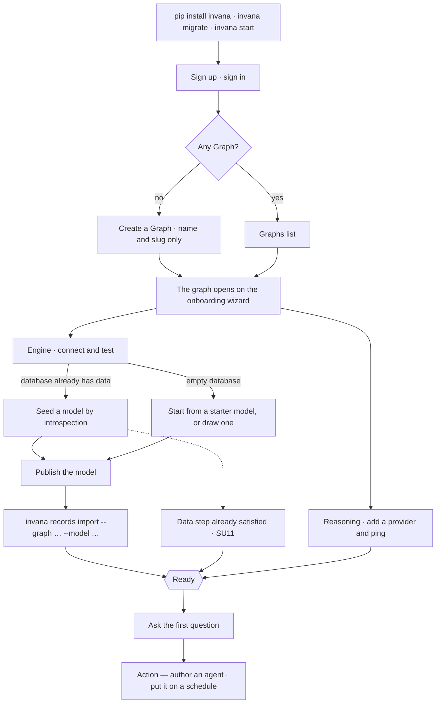

# Setup

The sequence a Graph walks from created to answering. It is **derived from facts, never ticked** — a
step is done because the thing it asks for exists, whoever made it exist and from wherever.

| | |
|---|---|
| Index | [13.7](../../../README.md#13--platform) · Slice **S13** |
| Module | [Platform](../spec.md) |
| API / CLI / Studio | 🟡 / — / 🟡 |
| Related | [Connect a database](../../connect-and-model/features/connect-a-database.md) · [Author a model](../../connect-and-model/features/domain-models.md) · [Bring data in](../../bring-data-in/features/load-data.md) · [Providers and models](../../agents/features/providers-and-models.md) · [Author an agent](../../agents/features/author-an-agent.md) · [Save a plan for reuse](../../workflows/features/the-library.md) · [Schedules](../../operate/features/schedules.md) · [Command line](command-line.md) |

> **As** someone who just made a Graph, **I want** to see what still stands between me and an answer —
> and to understand what each step is *for*, **so that** I can go and do it, or hand it to a teammate
> or a terminal, without guessing.

## 1. What setup is, and is not

| | |
|---|---|
| It is | four required facts about a Graph, each one a surface that already exists, grouped into the four things a Graph is |
| It is also | where the product explains itself. Each group is a clause of one sentence, and each required step teaches the one idea it depends on ([SU22](#decisions) · [SU17](#decisions)) |
| It is not | a **modal** wizard. It walks and it teaches, but nothing is walked modally, nothing is dismissed, nothing is asked twice, and every step stays selectable in any order |
| It ends | at the **first answer**. What comes after it is offered, never owed ([SU4](#decisions)) |
| It belongs to | the **Graph**, not the person. A second member joining a ready Graph has no setup |

## 2. The four features

Setup is one sentence, and the sentence is the product:

> it **runs on** a graph engine · it **knows** a curated context · it **decides** by reasoning over it
> · it **acts** within a bound.

Each clause is a **top-level user feature** with sub-features under it. The four are not categories
invented for a rail — **Curated Context** is [CLAUDE.md](../../../../../CLAUDE.md) feature 1 verbatim,
*binds to* is [terminology](../../../terminology.md)'s word for the engine, and *offered* versus *run*
is the [agents spec](../../agents/spec.md)'s own line ([SU22](#decisions)).

| | Feature | The question it answers | Required step | Optional steps |
|---|---|---|---|---|
| runs on | **Engine** | Where does it live? | Connect a graph database | — |
| knows | **Curated Context** | What does it know? | Author a model · Bring data in | Stitch a second model |
| decides | **Reasoning** | How does it decide? | Add an LLM provider | Write the instructions · Offer it skills · Build a workflow |
| acts | **Action** | Who acts, and when? | — | Author an agent · Schedule it |

Four required steps in all. Progress counts those and nothing else ([SU15](#decisions)).

### The lineage

What each feature is built out of, and what has to land before what. Every node is a row in
[the index](../../../README.md); every arrow is a dependency one of the specs states.

```mermaid
flowchart TD
    subgraph ENG["1 · ENGINE — it runs on a graph engine"]
        F121["12.1 · Connector contract"]
        F11["1.1 · Connect a database<br/><b>required</b>"]
        F121 --> F11
    end

    subgraph CTX["2 · CURATED CONTEXT — it knows a curated context"]
        F12["1.2 · Introspect"]
        F17["1.7 · Starter models"]
        F14["1.4 · Model editor"]
        F13["1.3 · Author a model<br/><b>required</b>"]
        F15["1.5 · Share a model"]
        F16["1.6 · Stitch models<br/><i>optional</i>"]
        F21["2.1 · Bring data in<br/><b>required</b>"]
        F22["2.2 · Inspect what landed"]
        F12 --> F13
        F17 --> F13
        F14 --> F13
        F13 --> F15
        F13 --> F16
        F13 --> F21
        F21 --> F22
    end

    subgraph RSN["3 · REASONING — it decides by reasoning over it"]
        F51["5.1 · Providers and models<br/><b>required</b>"]
        INS["13.7 · Instructions<br/><i>optional</i>"]
        F61["6.1 · Authoring a skill<br/><i>optional</i>"]
        F62["6.2 · Offer it to an agent"]
        F64["6.4 · Rules"]
        F71["7.1 · Save a plan<br/><i>optional</i>"]
        F72["7.2 · Pick a plan"]
        MEM["8.1–8.4 · Memory"]
        F61 --> F62
        F71 --> F72
    end

    subgraph ACT["4 · ACTION — it acts within a bound"]
        F52["5.2 · Author an agent<br/><i>optional</i>"]
        F53["5.3 · Set what it may run"]
        F73["7.3 · Check a plan"]
        F57["5.7 · How many run at once"]
        F54["5.4 · Delegation"]
        F91["9.1 · Projects and tasks"]
        F101["10.1 · Schedules<br/><i>optional</i>"]
        F52 --> F53
        F53 --> F73
        F53 --> F54
        F52 --> F91
        F52 --> F101
        F52 --> F57
    end

    F11 --> F12
    F11 -.->|introspection satisfies it| F21
    F13 --> ASK
    F21 --> ASK
    F51 --> ASK
    F62 --> F52
    F72 --> F73
    ASK["3.2 · Ask in natural language<br/>the first answer"]
    ASK --> F37["3.7 · Reasoning trace<br/>3.8 · When it cannot answer"]
    ASK --> MEM
    F11 -.->|unlocks now| F41["4.1 · Graph canvas · 3.1 · Write queries"]
```



Three things the lineage says that a list cannot:

| | |
|---|---|
| **Engine is a root, and a root of one** | nothing precedes it and nothing else sits in it. `12.1` is the contract its connector implements, not a step ([SU25](#decisions)) |
| **Curated Context is a chain; Reasoning is a set** | `1.3 → 2.1` is a hard order — `--model` names a published model. Reasoning's four have no order at all: a provider, instructions, skills and a workflow are each authored alone |
| **Action depends on Reasoning, never the reverse** | `6.2 → 5.2` and `7.2 → 7.3`: a skill is bound to an agent, a plan is checked against one. Nothing in Reasoning waits on anything in Action, which is why Action can owe nothing ([SU23](#decisions)) |

### A feature is a chapter. A gate is a lock.

They are not the same object and they do not line up one to one ([SU3](#decisions)). A feature says
which clause a step belongs to; a gate is a thing that is actually shut until a step lands.
**Curated Context holds two gates. Action holds none.**

| Gate | Open when | Unlocks |
|---|---|---|
| **connected** | the connection's last test passed | 4.1 Graph canvas · 3.1 Write queries · 1.2 Introspect · model authoring |
| **modelled** | a published model version exists | 2.1 Load data · 1.6 Stitch models · types an agent can plan against |
| **grounded** | the database holds records | data on the canvas · answers that cite a record |
| **answering** | the default provider's last ping passed | 3.2 Ask · 3.10 The assistant · every agent run |

Knowing and deciding are **independent tracks**: a provider can be added before a database is ever
connected, and the order between them is a preference, not a constraint. A Graph is **ready** when
the four required steps are done.

## 3. The four features, expanded

Each table is the feature's whole surface — what is a setup step, and what is reachable from the
lesson but never owed. **Setup names only the four required steps and the six optional ones**; the
rest is what the lesson links to when it explains why the step matters.

### 1 · Engine — *it runs on a graph engine*

> One Graph binds to exactly one graph database. The curated context is the same whichever engine you
> pick — this is the substrate, not the knowledge ([SU25](#decisions)).

| Sub-feature | Index | In setup |
|---|---|---|
| [Connect a database](../../connect-and-model/features/connect-a-database.md) | 1.1 | **required step** — the test gates the save, so the row *is* a passed test |
| [The connector contract](../../graph-connectors/features/the-connector-contract.md) | 12.1 | the package behind the connector choice; picked inside 1.1, never configured |
| [Languages](../../graph-connectors/features/languages.md) · [Capabilities](../../graph-connectors/features/capabilities.md) | 12.2 · 12.3 | what this engine can hold and speak — enforced at authoring, taught nowhere |

### 2 · Curated Context — *it knows a curated context*

> Connectors ingest from heterogeneous sources; stitching binds them under a shared ontology. What
> comes out is the graph an agent reasons over — [CLAUDE.md](../../../../../CLAUDE.md) feature 1.

| Sub-feature | Index | In setup |
|---|---|---|
| [Author a model](../../connect-and-model/features/domain-models.md) | 1.3 | **required step** — *Author a model*. Done on a published version of a non-introspected model |
| [Introspect a database](../../connect-and-model/features/introspect-a-database.md) | 1.2 | one way to do it — seeds a draft from what is already there |
| [Starter models](../../connect-and-model/features/starter-models.md) | 1.7 | another — offered, never applied ([SU9](#decisions)) |
| [Model editor](../../connect-and-model/features/model-editor.md) | 1.4 | where it is authored; the panel the step opens |
| [Share a model](../../connect-and-model/features/share-a-model.md) | 1.5 | export, import, upgrade — a third way to arrive at a published version |
| [Stitch models](../../connect-and-model/features/stitch-models.md) | 1.6 | **optional step** — done on a *committed* stitch; a staged one is a draft |
| [Bring data in](../../bring-data-in/features/load-data.md) | 2.1 | **required step** — *Bring data in*. No Studio write path, so the lesson carries the command ([SU6](#decisions)) |
| [Inspect what landed](../../bring-data-in/features/inspect-what-landed.md) | 2.2 | the proof — the run reads *succeeded*, which is what `looksRight` points at |

### 3 · Reasoning — *it decides by reasoning over it*

> The library. All of it is graph-level, authored once and reusable by any number of agents — and
> none of it does anything on its own ([SU23](#decisions)).

| Sub-feature | Index | In setup |
|---|---|---|
| [Providers and models](../../agents/features/providers-and-models.md) | 5.1 | **required step** — the Graph's *default* provider, and its ping. Saving stores it, the ping proves it |
| Instructions | 13.7 · a Basic field | **optional step** — standing guidance every agent reads before it plans. Not its own index row; it is one field on the Graph |
| [Authoring a skill](../../skills/features/authoring-a-skill.md) | 6.1 | **optional step** — *Offer it skills*. A named playbook with a *when to use* |
| [Offer a skill to an agent](../../skills/features/bindings.md) | 6.2 | which agent may be offered which skill — the join into Action |
| [Rules](../../skills/features/rules.md) | 6.4 | statements that are always true, offered alongside skills |
| [Save a plan for reuse](../../workflows/features/the-library.md) | 7.1 | **optional step** — *Build a workflow*. A named, versioned plan |
| [Pick a plan, or write one](../../workflows/features/plan-selection.md) | 7.2 | a template by intent; generation only when none fits |
| [Memory](../../memory/spec.md) | 8.1–8.4 | what it learns from its own runs — reasoning that improves itself. No step: nothing is authored, it is proposed and reviewed |

### 4 · Action — *it acts within a bound*

> Every action is an agent run — there is no other actor. A workflow is validated against the running
> agent's bounds, a schedule carries an assignee, a task has one too ([SU23](#decisions)).

| Sub-feature | Index | In setup |
|---|---|---|
| [Author an agent](../../agents/features/author-an-agent.md) | 5.2 | **optional step** — *Author an agent*. The seeded four do not count ([SU9](#decisions)) |
| [Set what an agent may run](../../agents/features/envelope-and-budget.md) | 5.3 | the bound itself — what it may run, with what arguments, at what cost |
| [Check a plan against the bound](../../workflows/features/envelope-validation.md) | 7.3 | the valve — a shared plan checked against one actor's bounds **before dispatch** |
| [Delegation](../../agents/features/delegation.md) · [Pause, resume, retire](../../agents/features/lifecycle.md) · [Who spawned whom](../../agents/features/lineage.md) | 5.4–5.6 | bounds that nest, and the record of who spawned whom |
| [How many run at once](../../agents/features/concurrency-and-contention.md) | 5.7 | the Graph's ceiling — how many run at once, and what happens at it |
| [Projects and tasks](../../work/features/projects-and-tasks.md) | 9.1 | work assigned to a person or an agent |
| [Schedules](../../operate/features/schedules.md) | 10.1 | **optional step** — *Schedule it*. Done when a firing exists, not when a schedule is saved ([SU24](#decisions)) |

### What sits in none of the four

| | Index | Why it is not a group |
|---|---|---|
| **Ask** · the answer surface · streaming · clarifying | 3.1–3.6 · 3.9 · 3.10 | it is the **payoff**, not a step. Setup ends at the first answer ([SU4](#decisions)) |
| **Reasoning trace** · **When it cannot answer** | 3.7 · 3.8 | Explainability — a property of every answer, not a thing to set up. It is what the *Bring data in* concept promises ([6](#6-the-lesson)) |
| **Explore** — canvas, canvases, selection, console | 4.1–4.4 | opened by the **connected** gate, taught by no step. A person explores long before setup is finished |
| **Identity · Operate · Platform** | 10.2–10.4 · 11 · 13 | the Graph has them or it does not; nothing here is per-Graph configuration a person walks |

## 4. Journey



### The unhappy paths

| Path | What happens |
|---|---|
| The test fails | The gate stays shut, the connector's own message is shown, nothing downstream pretends to work |
| The import is run before a model exists | The CLI refuses (`--model` names no model) and the step reads `blocked`, naming step 2 |
| The provider pings red | The **answering** gate stays shut. **Query and Explorer keep working** — the page says so, rather than reading as if the Graph is broken |
| The user leaves mid-setup | Nothing is held in the page. Every step's state is derived on the next load, including steps finished from a terminal or by someone else |
| A member without setup rights | The same wizard and the same lessons, read-only, with no primary actions |
| No `?step=` | The first required step that is not done is selected |
| A step lands while you are on it | The state re-derives and selection advances to the next outstanding step |
| The cap is used on a **ready** Graph | The wizard opens over the identity card and carries a close control, because there is something to go back to. While a step is outstanding there is nothing to close *to* — the wizard **is** the page — so no close is offered |
| Everything optional is skipped | The wizard steps aside for the identity card. The cap in `header.right` brings it back |

## 5. Surfaces

Setup owns **no forms** ([SU2](#decisions)). Every action routes to the panel that already owns that
field, with its tab named ([G24](../../../building-studio/graph-detail-page.md)), so there is one form
per fact in the whole product.

| Surface | Where | Shape |
|---|---|---|
| **The onboarding wizard** | `mainSection` — the graph page, titled **Setup** in the page strip while it is on it | An **island**: one `Card` centred on the board with the board visible around it, max 1060px. Inside it, a stepper on the left and the selected step's lesson on the right ([SU16](#decisions)) |
| **The cap** | `header.right` | A graduation-cap `ButtonWithTooltip` between `GitHubStars` and `ThemeMenu`, on graph-scoped routes only. It reopens the wizard at any time, including after the Graph is ready ([SU19](#decisions)) |
| **The setup band** | `leftSection` → Info panel | The compact echo — `TimelineList variant="rail"`. Disappears the moment the required steps are done ([G20 · G21](../../../building-studio/graph-detail-page.md)) |
| **The locks** | every surface a gate shuts | `EmptyState locks` naming the gate that opens it, and the step that opens the gate — *"Explorer opens when a database is connected"* ([SU13](#decisions)) |
| **The footer** | `footer` | `GraphStatusBar` already carries the connection's live state; setup never restates it |

### The island, region by region

| Region | Holds | Composed from |
|---|---|---|
| The island | the whole wizard, floating on the board. The margin is what says the graph page is still underneath | `Card` on `bg-background` |
| Head | the graph's name · `Progress` · one sentence of standing, written out of the four clauses — *"It runs on a graph engine and knows a curated context. It cannot decide yet."* | `Progress` · `text-*` ladder |
| Stepper | the four group headings, one row per step, a check or a `StatusDot` per row ([SU21](#decisions)), the selected row marked. It closes with **What next**, which carries no dot ([SU20](#decisions)) | `Eyebrow` · `StatusDot` |
| Lesson | the group and its clause · the step · its `concept` · why · how · the actions · the terminal line · what proves it | `Eyebrow` · `Item` · `Button` · `Terminal` |
| Foot of the lesson | *Previous* · *Next step* — **navigation, not a gate** | `ButtonGroup` |
| What next | the offers, no status dots, selectable from the first visit | `Eyebrow` · `ItemGroup` |

Below ~900px of `mainSection` the two panes stack inside the island into the gate-card board: the
groups as cards, each step one row, the selected step's lesson expanded in place. Same content, same
URL, one column. The island keeps its margin — it narrows before it touches the edges.

```
┌ header · Graphs › ravi-merugu › stock-market-graph › Setup     🎓 ☀ ⛶ ────────┐
├──┬─ Info panel ────────┬─ mainSection · the board ───────────────────────────┤
│▣ │ Stock Market Graph  │   ┌─ the island ───────────────────────────────┐    │
│  │ neo4j · connected   │   │ Stock Market Graph   ▓▓▓▓▓░░░  2 of 4      │    │
│  │                     │   │ It runs on a graph engine and knows a      │    │
│  │ Setup   2 of 4      │   │ curated context. It cannot decide yet.     │    │
│  │ ● Connect a database│   ├─ stepper ────────┬─ the lesson ────────────┤    │
│  │ ● Author a model    │   │ ENGINE           │ CURATED CONTEXT ·       │    │
│  │ ○ Bring data in next│   │  ✓ Connect a db  │ IT KNOWS      step 3/4  │    │
│  │ ○ Add a provider    │   │ CURATED CONTEXT  │ Bring data in           │    │
│  │ ○ Instructions  skip│   │  ✓ Author a model│ ✦ Answers are grounded, │    │
│  │ ○ Skills        skip│   │  ○ Stitch    opt │   or they are refused   │    │
│  │                     │   │ ▸◐ Bring data in │ WHY IT MATTERS …        │    │
│  │ Recent sessions     │   │ REASONING        │ HOW 1 · pick a dataset  │    │
│  │ …                   │   │  ○ LLM provider  │     2 · map its columns │    │
│  │                     │   │  ○ Instructions  │     3 · run the import  │    │
│  │                     │   │  ○ Skills        │ [ Open Imports ] Skip   │    │
│  │                     │   │  ○ Workflow      │ ⌨ invana records …   ⧉ │    │
│  │                     │   │ ACTION           │ YOU'LL KNOW IT WORKED … │    │
│  │                     │   │  ○ An agent      │    ‹ Previous   Next ›  │    │
│  │                     │   │  ○ Schedule it   │                         │    │
│  │                     │   │ AFTER SETUP      │                         │    │
│  │                     │   │    What next     │                         │    │
│  │                     │   └──────────────────┴─────────────────────────┘    │
└──┴─────────────────────┴─────────────────────────────────────────────────────┘
```

## 6. The lesson

Every step carries the same six fields. They live next to the step's derivation, so a step's
teaching cannot drift from its `done` rule.

| Field | Shape | Example — *Bring data in* |
|---|---|---|
| `title` | the step's name | Bring data in |
| `why` | one sentence, what the Graph gains | Until records exist, the model is a shape with nothing in it — Explorer draws an empty canvas and every answer is *I don't know*. |
| `unlocks` | the gate's payoff, in surfaces | data on the canvas · answers that cite a record |
| `how` | 2–3 numbered moves, each naming a surface that already exists | 1 · pick a dataset · 2 · map its columns onto a published model · 3 · run the import |
| `terminal` | the exact command, pre-filled ([SU6](#decisions)) | `invana records import --graph … --model …` |
| `looksRight` | the fact that proves it landed | Explorer draws nodes; the import run reads *succeeded* |

**Nothing here is a new form** ([SU2](#decisions)) — the lesson explains and links; the panel still
owns the fields.

### The concepts

Each **required** step also carries a `concept`: the one Invana idea that step depends on, taught
where it is about to be used ([SU17](#decisions)). Four in total, and no lesson exists without a step.

| Step | Concept | What it says |
|---|---|---|
| Connect a graph database | **A Graph is a mission, not a database** | One database can back many Graphs. A Graph is the question you are trying to answer and everything gathered to answer it. Invana reads the database where it lives — it never copies it |
| Author a model | **The model is the shared vocabulary** | Ontology, not schema. Agents, queries and stitches all speak the types you publish — which is why two databases can be joined under one set of words |
| Bring data in | **Answers are grounded, or they are refused** | Every answer traces LLM → query → record → dataset. Nothing is invented to fill a gap — when the graph cannot answer, Invana says so |
| Add an LLM provider | **Your key, your provider** | Invana sends the question and the schema, never the database. The provider writes a query; the engine runs it against your records |

## 7. Engine

Setup stores almost nothing. Everything except a skip is read off the facts at serialize time
([CM8](../../connect-and-model/spec.md)).

| Thing | Shape |
|---|---|
| `graphs.setup_state` | JSON, one key per step: `graph_info · model · stitches · datasets · providers · instructions · skills · workflows · agents · schedules`. Only `skipped_at` is stored; `done` and `completed_at` are derived. `graph_info` keeps its name — it is a persisted key, and a rename is a migration that buys a word |
| Per-step payload | `done` · `completed_at?` · `skipped_at?` · `required` · `group` · `gate?` · `blocked_by?` · `broken?` with its message |
| Routes | `GET …/graphs/{slug}` carries `setup_state` · `POST …/graphs/{slug}/setup/{section}` takes `skip` · `reset` |
| Who composes a read | `SetupManager.graph_read` / `.graph_reads` — the **only** way a `GraphRead` is built ([SU26](#decisions)). `GraphManager.serialize` takes `setup_state` as a required argument and `GraphManager`'s create · list · update return rows, not reads |
| Derivations — existence | the connection row · published versions on a non-introspected model · committed stitches · succeeded import runs **or** node types on the introspected mirror · the default provider's `last_ping_ok` · `instructions` non-empty · skill count · published workflow templates · member-authored agents |
| Derivations — occurrence | `schedules` is done when a firing exists, not when a schedule is saved ([SU24](#decisions)) |
| Gates as dependencies | `require_graph_connected` · `require_graph_modelled` · `require_graph_grounded` · `require_graph_answering`. Explorer and the schema route wait on **connected**; the import routes wait on **modelled**; the canvas data route waits on **grounded**; sessions wait on **answering** |
| Events | none of its own. Setup has no verbs — `connection.tested`, `model.published`, `dataset.imported`, `provider.pinged`, `workflow.published`, `schedule.fired` are the record |

### What changes from what ships today

| Today | Becomes | Why |
|---|---|---|
| Three gates: `connected · grounded · answering` | Four groups and four gates, with `modelled` split out of `grounded` | `grounded` meant *model **and** records*, so an import waited on the records the import is what produces. `require_graph_grounded` has no consumers, which is that fault showing as disuse |
| Six sections | Ten — `stitches`, `workflows`, `agents`, `schedules` join | They are the steps that make an answer good, and they were offers with no state |
| Every step derives from an existence | Action steps derive from an **occurrence** | An action that has never run is an intention, not a capability ([SU24](#decisions)) |
| A step belongs to a gate | A step belongs to a **group**, and *may* belong to a gate | Action gates nothing; Curated Context gates twice ([SU3](#decisions)) |

## Decisions

| # | Decision |
|---|---|
| SU1 | **Setup is derived, never ticked.** A step is done because the thing it asks for exists — [CM8](../../connect-and-model/spec.md). A step finished from the CLI, from the API, or by another member is done without anyone telling setup |
| SU2 | **Setup owns no forms.** Every step's action opens the panel that already owns that field, with its tab named (`?panel=` · `?tab=`, G24). A second copy of a form is a second thing to keep true |
| SU3 | **A group is a chapter; a gate is a lock, and they do not line up.** A step is grouped by which clause of the sentence it belongs to, and gated — if at all — by what it actually shuts. Curated Context holds two gates, Action holds none, and a surface waits on the one gate it needs rather than on the whole sequence |
| SU4 | **Setup ends at the first answer.** What comes after it appears under **What next** as offers with no status — a product that opens with nine unfinished obligations reads as homework |
| SU5 | **Instructions are optional and asked for late.** They are a Basic field ([G23](../../../building-studio/graph-detail-page.md)) and they leave the create form ([SU10](#decisions)). Requiring prose before anything works is the onboarding funnel [accounts](../../identity-and-access/features/accounts.md) refuses |
| SU6 | **A step is satisfiable from the terminal, and the lesson says how.** Importing has no Studio write path ([2.1](../../bring-data-in/features/load-data.md)), so its lesson carries the exact command with the graph and model pre-filled. The page notices the run landing through the same derivation — there is no *I've done it* button |
| SU7 | **The wizard is a page, not a modal — and it is the page the Graph already has.** It is the content of the graph page while anything is outstanding ([G26](../../../building-studio/graph-detail-page.md)), which is the page a new Graph lands on, cannot be closed and cannot be lost. A modal cannot show the thing it is configuring, and setup is resumable, partly delegated and never linear |
| SU8 | **The Info panel keeps the compact echo, and it disappears when it is finished** ([G20 · G21](../../../building-studio/graph-detail-page.md)). One sequence, two renderings — the wizard for doing it, the band for remembering it |
| SU9 | **Nothing is seeded that a user must then undo.** Explorer, Query, Modeller and the Coordinator are seeded on create, so the Graph answers without anyone authoring an agent — which is why *Author an agent* is an **optional** step and never a required one. A model is **not** seeded: a starter is offered ([1.7](../../connect-and-model/features/starter-models.md)), never applied |
| SU10 | **Creating a Graph asks for a name and a slug.** The connection needs a connector choice and a passing test ([CD2](../../connect-and-model/features/connect-a-database.md)); a failure there must not cost the user the Graph. The create form is the shortest thing that can produce a URL |
| SU11 | **Records already in the database count.** The data step is satisfied by a succeeded import run *or* by introspection finding nodes. A Graph pointed at a populated database is grounded on arrival |
| SU12 | **A blocked step names what unblocks it.** *Bring data in* is blocked by *Author a model*, because `--model` is required and names a published model. Blocked is a distinct state from todo, and it is not clickable into a form that will refuse it |
| SU13 | **Every gated surface says which gate opens it.** `EmptyState locks` — *"Ask opens when an LLM provider is configured"* — names the gate and the step that opens it |
| SU14 | **Setup belongs to the Graph, not the person.** There is no per-user checklist, no dismiss-forever flag and no first-run cookie. A member joining a ready Graph lands on Explorer and never sees it |
| SU15 | **Progress counts required steps only.** `2 of 4`, never `2 of 10`. An optional step that drags the number down turns an offer into a debt |
| SU16 | **The wizard is an island, and it teaches the step it is on.** One card centred on the board with the board visible around it — never a region filled edge to edge, because the margin is what says the graph page is still underneath. A stepper on the left, that step's lesson on the right, selection carried in the URL (`?step=`) so a step can be handed to a teammate. *Previous* and *Next step* are navigation, not a gate — every step stays selectable in any order, which is what keeps this a page and not the wizard [SU7](#decisions) refuses. It reflows against **its own width, in px** ([SU27](#decisions)) |
| SU17 | **One concept per required step, and no lesson without a step.** Each required step teaches the one Invana idea it depends on (6). There is no primer screen ahead of step 1, no glossary and no tour: a concept is taught where it is about to be used, or not at all |
| SU18 | **The wizard is the board — there is no second surface.** The graph page shows the stepper while anything is outstanding and the identity card when nothing is. It is not a first-run overlay on top of a board, which would be two renderings to keep true and would reintroduce the per-user first-run state [SU14](#decisions) refuses |
| SU19 | **The wizard has a door that never closes.** A graduation cap sits in `header.right`, between `GitHubStars` and `ThemeMenu`, on graph-scoped routes only. It opens the wizard at the first outstanding step, or at the step last looked at once every required step is done. It does **not** disappear when the Graph is ready: undoing a skip, reading why a step went `broken`, and re-reading a concept all live there. *Graduation* is the icon's metaphor only — the state a Graph reaches is **ready**, and no surface says otherwise |
| SU20 | **The rail ends in *What next*, and it carries no dot.** The offers select into the lesson column like a step, because the rail has one meaning — clicking a row changes what the pane shows, and never does anything. They have no status and none is owed ([SU4](#decisions)); a dot is the thing that would say otherwise. It is reachable from the first visit: someone weighing up four steps should be able to see what the steps are for |
| SU21 | **A done step is a check; every other state is a dot.** Done is a fact that exists ([SU1](#decisions)) — a green dot beside it says only *green*, which at a glance is the `running` tone of every other list in the product. One marker component across the stepper, the band and the board, because they are one sequence in three renderings ([G27](../../../building-studio/graph-detail-page.md)) |
| SU22 | **The groups are one sentence, and the sentence is the product.** *It runs on a graph engine · it knows a curated context · it decides by reasoning over it · it acts within a bound.* Each clause names something the product already is, so the rail is the shortest true description of Invana in the order it works — and the person who finishes setup has been told what it is, because the steps and the story are one object. The head band's standing sentence is written out of the same four clauses, so it says *which* part is missing in the words the rail uses |
| SU23 | **Reasoning is shared and inert; Action is owned and runs.** The provider, the instructions, the skills and the workflows are graph-level: one copy, authored once, usable by any number of agents, and none of them does anything on its own. The agent, its envelope and budget, and what sets it off are per-actor. A workflow containing action steps is still Reasoning — it is a *plan*, *"validated against the running agent's bounds before anything is dispatched"* ([workflows](../../workflows/spec.md)), and a recipe is not a meal. The [envelope](../../agents/features/envelope-and-budget.md) is the valve between the two |
| SU24 | **An Action step is done when it has run, not when it is saved.** A schedule that has never fired is an intention, not a capability — so Action derives from an **occurrence** where every step before it derives from an existence. It is [C3](../../agents/features/providers-and-models.md)'s rule generalised: saving stores it, the run proves it |
| SU25 | **The connection is substrate, not knowledge.** *Connect a graph database* asks which engine runs underneath; the curated context is the same whichever answer you give. That is why it is its own group and not the first step of Curated Context, and why a group of one is worth the heading |
| SU26 | **Every Graph read derives; there is no fallback to the stored column.** `GraphManager.serialize` takes `setup_state` as a **required** argument, and create · list · detail · update all compose through `SetupManager.graph_read`. A default that fell back to `graphs.setup_state` served a column holding only skips and the instructions stamp, so every derived section came back absent — and a client cannot tell an absent section from a false one, which is how a Graph with a pinged provider kept being asked for one. `graphs` still never imports `setup` ([migration-plan §14.1](../../../building-engine/migration-plan.md)); the composition is `setup`'s, which is why the read lives there |
| SU27 | **The island reflows against its own width, and every threshold is in px.** Three of them: the island is at most **1060px**; below **640px** of island the stepper and the lesson stack into the board — the same rows, one column; and inside the lesson, *Why · How* sits beside *You'll know it worked* only once **the lesson pane itself** is past **600px**, with the side column at 240px. Two rules make it hold. The lesson pane is its own container — querying the island instead measured 248px of stepper it does not have, which split the columns at a 430px pane and squeezed *Why it matters* to three words a line whenever a side panel was open. And the widths are px, not `@2xl`/`@3xl`: the root font dial is **13px** ([design-kit `styling`](../../../building-studio/design-kit-coverage.md)), so every rem breakpoint fires ~19% narrower than its name reads — which is also why `max-w-5xl` was an 832px island, not the 1060px this decision asks for. And **both** directions of every reflow are variants — never a base utility plus one variant: the kit's stylesheet is concatenated after Studio's, so a base `flex-col` or `hidden` re-declared there wins on source order and the container rule never fires. Measured: island 1060 → lesson pane 810 → *Why* 512px; with both side panels open, island 735 → pane 485 → *Why* 446px, one column |

## Not building

| Not built | Because |
|---|---|
| A modal wizard, a tour overlay, a coach mark | setup is resumable and partly done from a terminal; a modal owns the screen and can show none of it |
| A setup page of its own | the graph page is already pinned, uncloseable, and where a new Graph lands (G26) |
| A product primer, a glossary, or a concept tour ahead of the steps | a concept is taught at the step that needs it ([SU17](#decisions)); a primer is read before any of it means anything |
| A first-run overlay over the board | [SU18](#decisions) |
| A dismiss-forever flag | the band disappears on completion ([G20](../../../building-studio/graph-detail-page.md)), and the cap reopens the wizard |
| A *watch it* or *monitor it* step | there is no such feature. [Schedules](../../operate/features/schedules.md) is the one Action step that exists beyond authoring an agent, and setup never invents a destination |
| Sample or demo data seeding | a Graph seeded with fiction answers questions about fiction |
| Per-user onboarding | setup is the Graph's state, not a person's ([SU14](#decisions)) |
| A "setup complete" celebration screen | the first answer is the celebration |
| Setup as a CLI command (`invana setup`) | the steps already have commands; a wrapper would be a second sequence to keep true |
| Progress that counts optional steps | [SU15](#decisions) |
