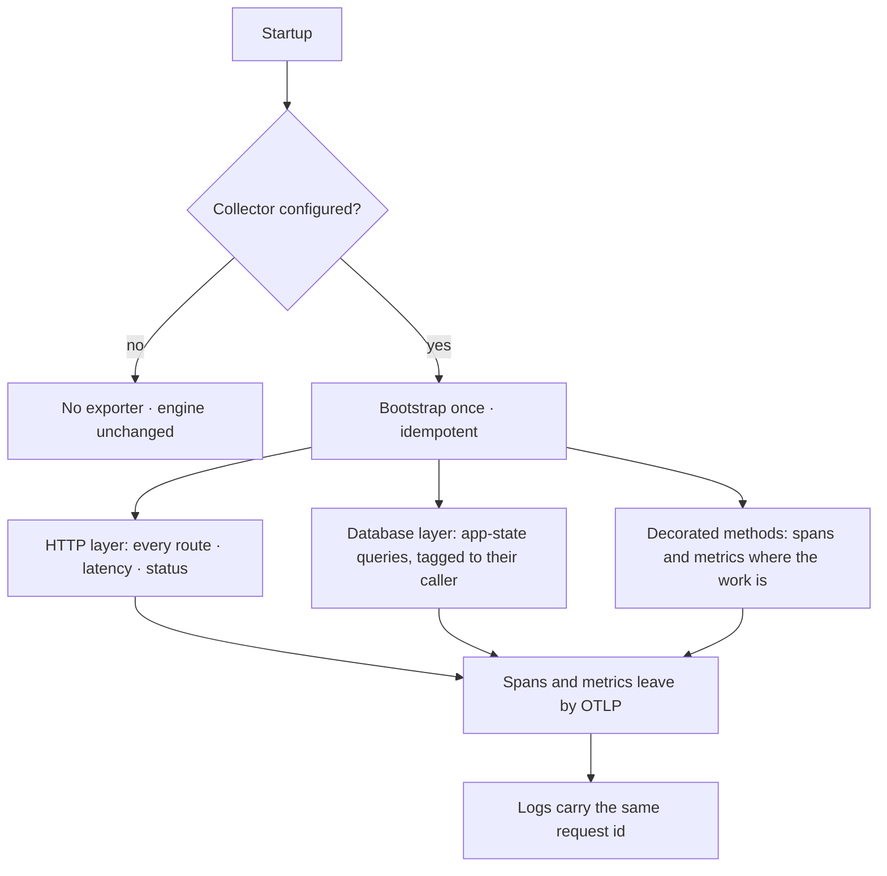

# Telemetry

Traces, metrics and log correlation over OTLP — instrumented in three layers so nothing has to be
wired per route, and entirely optional: with no collector configured the engine behaves identically.

| | |
|---|---|
| Index | [13.5](../../../README.md#13--platform) · Slice **S1** |
| Module | [Platform](../spec.md) |
| API / CLI / Studio | ✅ / — / — |
| Related | [logging](logging.md) · [observability](../../operate/features/observability.md) |

> **As** whoever operates this, **I want** the engine to emit traces into the collector we already
> run, **so that** a slow request is a span and not a guess.

## Capabilities

| # | Capability | Notes |
|---|---|---|
| C1 | OTLP over gRPC | The transport a collector already speaks |
| C2 | Three instrumentation layers | HTTP, database, and decorated service methods |
| C3 | Pure ASGI middleware | Not the wrapping kind, which breaks streaming and background work |
| C4 | Metrics namespaced by domain | API · graph query · app-state query · model operations · generic methods |
| C5 | Logs correlate to traces | The same request id in both |
| C6 | Idempotent bootstrap | Calling it twice does nothing the second time |
| C7 | Optional | No endpoint configured means no exporter, no overhead, no error |
| C8 | Two decorators | One records a span, one records a metric — applied where the work happens |

## Journey

## Seams

| Seam | What you see |
|---|---|
| Collector unreachable | The engine keeps serving; export failures do not surface as request errors |
| Bootstrapped twice | The second call is a no-op |
| A streaming response | The pure-ASGI middleware measures it without buffering it |
| Sampling on | Stated in the resource attributes, so a missing span is explainable |
| Engine telemetry off, studio's still on | The browser-span proxy answers 202 and drops the batch — the studio's console stays clean |

## Engine

| Thing | Shape |
|---|---|
| Transport | OTLP over gRPC, with endpoint, sampling and resource attributes configurable |
| HTTP | ASGI middleware plus framework instrumentation |
| Database | app-state instrumentation with statement commenting, so a query names its caller |
| Decorators | one for spans, one for metrics |
| Domains | `api` · graph query · app-state query · model operations · methods |

## Decisions

| # | Decision |
|---|---|
| TE1 | Telemetry is optional; the engine runs identically without a collector. |
| TE2 | Bootstrap is idempotent. |
| TE3 | Middleware is pure ASGI, so streaming and background work are not broken. |
| TE4 | Metrics are namespaced by domain. |
| TE5 | This is engine telemetry. Product metrics a user reads come from the record — [observability](../../operate/features/observability.md). |
| TE6 | The browser-span proxy (`POST /api/v1/telemetry/traces`) is always mounted. The studio exports on its own gate (`VITE_TELEMETRY_ENABLED`), so a route that comes and goes with the engine's gate answers every batch with a 404 the browser reports as an error. With engine telemetry off the route accepts the batch and drops it. |

## Not building

| Not building | Because |
|---|---|
| A vendor-specific exporter | OTLP reaches every collector worth using |
| Telemetry as a hard dependency | the engine must run with none of it present |
| Tracing user data | spans carry shape and timing, never record contents |
