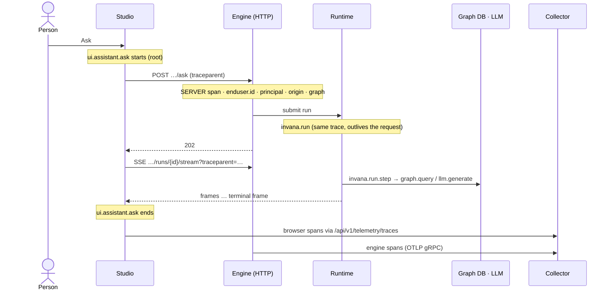
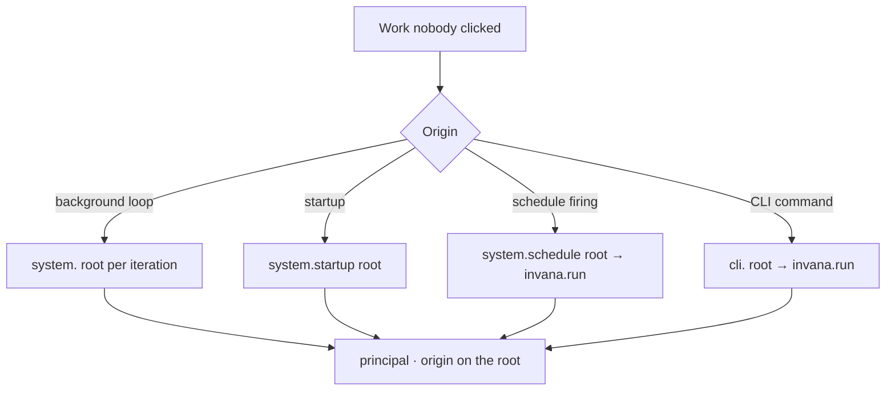

# Telemetry

Traces, metrics and logs for everything a person or the system does, in Studio and the engine. One
trace per action, from the click to every query, model call and record it caused; metrics that link
back to it; logs that carry it. Over OTLP, entirely optional: with no collector configured Studio and
the engine behave identically.

| | |
|---|---|
| Index | [13.5](../../../README.md#13--platform) · Slice **S1** |
| Module | [Platform](../spec.md) |
| API / CLI / Studio | 🟡 / 🔵 / 🔵 |
| Related | [logging](logging.md) · [observability](../../operate/features/observability.md) · [audit-and-activity](../../operate/features/audit-and-activity.md) · [runtime](runtime.md) |

> **As** whoever operates this, **I want** one trace to follow a person's action from Studio through
> the engine, the runs it starts and the records it writes, **so that** a slow or failed action is a
> trace I open, not a guess I make across three tools.

## Capabilities

| # | Capability | Notes |
|---|---|---|
| C1 | OTLP | gRPC from the engine; HTTP from Studio through the engine's proxy |
| C2 | Instrumentation layers | HTTP · app-state SQL · graph queries · model calls · runs and their steps · outbound HTTP |
| C3 | Pure ASGI middleware | not the wrapping kind, which breaks streaming and background work |
| C4 | Metrics namespaced by domain | API · graph query · app-state query · model operations · methods |
| C5 | Logs carry the trace id | console, JSON and OTLP logs alike |
| C6 | Idempotent bootstrap | calling it twice does nothing the second time |
| C7 | Optional | no endpoint configured means no exporter, no overhead, no error |
| C8 | One trace per user action | rooted in Studio, named for the action, ended when its outcome arrives |
| C9 | Streams stay in the trace | the SSE connections that deliver an answer or the event tail join the action's trace |
| C10 | Runs stay in the trace | a run, each of its Tasks and every delegated child run are spans of the action that started them |
| C11 | Who and from where | every root and request span says which principal acted, on whose behalf, from which origin, in which Graph |
| C12 | A record opens its trace | a TaskRun and an event carry the trace they were written in |
| C13 | The system's own work is traced | background loops, startup, schedules and CLI commands each open their own root |
| C14 | Sampling is stated | one ratio, parent-based, recorded on the resource |
| C15 | Metrics for everything that repeats | requests, runs, steps, tokens and cost, graph queries, streams, events, loops, pools — and in Studio, Web Vitals, actions, requests and errors |
| C16 | A metric opens a trace | exemplars on every histogram point at a sampled trace |
| C17 | Logs for discrete facts | run lifecycle, loop failures, startup, errors — each with its trace and span id |
| C18 | Studio sends its errors | uncaught errors, unhandled rejections, error boundaries and failed queries, as OTLP logs |
| C19 | One privacy rule for all three | ids, shapes and timings; never record contents, prompts, answers or credentials |

## Journey

```mermaid
sequenceDiagram
    actor P as Person
    participant S as Studio
    participant E as Engine (HTTP)
    participant R as Runtime
    participant X as Graph DB · LLM
    participant C as Collector
    P->>S: Ask
    Note over S: ui.assistant.ask starts (root)
    S->>E: POST …/ask  (traceparent)
    Note over E: SERVER span · enduser.id · principal · origin · graph
    E->>R: submit run
    Note over R: invana.run (same trace, outlives the request)
    E-->>S: 202
    S->>E: SSE …/runs/{id}/stream?traceparent=…
    R->>X: invana.run.step → graph.query / llm.generate
    R-->>S: frames … terminal frame
    Note over S: ui.assistant.ask ends
    S->>C: browser spans via /api/v1/telemetry/traces
    E->>C: engine spans (OTLP gRPC)
```

```mermaid
flowchart TD
    A[Work nobody clicked] --> B{Origin}
    B -->|background loop| C[system.<loop> root per iteration]
    B -->|startup| D[system.startup root]
    B -->|schedule firing| E[system.schedule root → invana.run]
    B -->|CLI command| F[cli.<command> root → invana.run]
    C --> G[principal · origin on the root]
    D --> G
    E --> G
    F --> G
```

## Seams

| Seam | What you see |
|---|---|
| Collector unreachable | Studio and the engine keep serving; export failures never surface as request errors |
| Bootstrapped twice | the second call is a no-op |
| A streaming response | the middleware measures it without buffering it |
| An SSE connection | `EventSource` cannot send headers, so Studio puts `traceparent` in the URL and the middleware reads it there when the header is absent |
| A run outlives its request | the run span is a child of the request span and ends when the run ends; the request span ends at 202 |
| A delegated child run | a child span of the parent run, with a Link to it |
| A call with no action open | it starts its own root, so no engine span is ever an orphan |
| Sampling on | parent-based: a sampled action keeps its whole trace, runs and streams included; the ratio is on the resource, so a missing trace is explainable |
| Engine telemetry off, Studio's on | the browser-span proxy answers 202 and drops the batch — the console stays clean |
| An access token in a URL | stripped before the URL is recorded — no span attribute or access-log line ever holds a credential |

## Surfaces

| Surface | Shape |
|---|---|
| Studio action spans | `ui.<module>.<action>` — the module names of [module-structure.md](../../../module-structure.md) §2: `ui.assistant.ask` · `ui.assistant.rerun` · `ui.explorer.load` · `ui.runs.cancel` · `ui.plans.promote` · `ui.events.subscribe`; `ui.boards.open` lands with the Boards view panel |
| HyperDX | one service map and one trace view across `invana-studio` and `invana-engine` |
| A run's page | its trace id, opening the trace in the collector's UI |

## Engine

| Thing | Shape |
|---|---|
| Transport | OTLP gRPC; `INVANA_TELEMETRY_OTLP_ENDPOINT` · `INVANA_TELEMETRY_SAMPLE_RATIO` (0–1, default 1.0) · resource attributes from settings |
| HTTP | pure ASGI middleware; `traceparent` (and `tracestate`) from the header, else from the query parameters of the same name — the header wins; query string recorded with `token` removed; every `/api/v1/telemetry/` proxy path not traced; the only source of request spans |
| Attributes | `enduser.id` · `invana.principal` (`user · agent · system · external · anonymous`) · `invana.on_behalf_of` · `invana.origin` (`studio · api · cli · schedule · startup · daemon`) · `invana.graph` · `invana.run_id` |
| Runs | `invana.run` per TaskRun (`run_id` · `agent_id` · `role` · `kind`), `invana.run.step` per Task (`task_key` · `step_key`); queue wait as a span event |
| Graph · model · SQL | `graph.query.*` · `llm.generate` · SQLAlchemy spans, nested under the step that caused them |
| Records | `task_runs.trace_id` · `task_runs.root_span_id`; `events.trace_id` (filled by default in `emit`) · `events.span_id` |
| Roots nobody clicked | `system.<loop>` per iteration · `system.startup` · `system.schedule` · `cli.<command>` — each a new trace (`context=Context()`), never a child of whatever scheduled it |
| Queues | a producer's span context rides the item; the consumer's span Links to it |
| Logs | a logging filter sets `trace_id` / `span_id` on every record — plain shows `[trace_id span_id]` inside a span, JSON adds both fields; uvicorn's access log has `token` stripped |

## Studio

| Thing | Shape |
|---|---|
| Providers | traces (`WebTracerProvider`, parent-based sampler on `VITE_TELEMETRY_SAMPLE_RATIO`), metrics and logs — service `invana-studio`, exported through `/api/v1/telemetry/{traces,metrics,logs}` |
| Web Vitals | the `web-vitals` package, recorded as `ui.web_vitals.*` |
| Errors | a global handler for uncaught errors and unhandled rejections, an error boundary per region, and the query client's error hook — each an OTLP log with the active trace id |
| Actions | `startAction(module, action)` opens a new root; the handle's `end(outcome)` / `fail(err)` ends it once, recording `invana.outcome` — the terminal stream frame for an ask or a re-run (`run.done` · `run.cancelled` · `clarification.requested`; a lost stream is an error), the response for a write |
| Requests | every API call is a client span, parented explicitly by the action passed in the request config — never by a shared "current action" slot |
| Streams | `traceparent` appended to every `EventSource` URL — a run's tail carries its action's; the events tail, which nobody clicked, opens a `ui.events.subscribe` root that ends when the connection opens or fails |
| Attributes | `enduser.id` · `invana.graph` (`user/graph`) · `invana.session_id` · `invana.run_id` · `invana.outcome` on action spans; never record contents |
| Tests | Vitest in Node (`pnpm test`), spans captured by an in-memory exporter |

## Metrics

Names follow the modules and, for HTTP and databases, the OpenTelemetry semantic conventions.
Attributes are bounded: a metric never carries a user id, a run id or a Graph id — those are on spans
and logs, and per-Graph product numbers come from the record ([observability](../../operate/features/observability.md) OB1).

| Metric | Kind | Attributes |
|---|---|---|
| `http.server.request.duration` | histogram | `http.request.method` · `http.route` · `http.response.status_code` |
| `http.server.active_requests` | up-down counter | `http.request.method` · `http.route` |
| `invana.runs.duration` · `invana.runs.queue_wait` | histogram | `kind` · `role` · `outcome` · `origin` |
| `invana.runs.count` · `invana.runs.active` | counter · up-down counter | `kind` · `role` · `outcome` · `origin` |
| `invana.runs.step.duration` | histogram | `step_key` · `outcome` |
| `invana.llms.request.duration` · `invana.llms.request.count` | histogram · counter | `provider` · `model` · `role` · `outcome` |
| `invana.llms.tokens` · `invana.llms.cost` | counter | `provider` · `model` · `direction` (`input · output`) |
| `invana.graph_connectors.query.duration` · `.count` · `.result_size` | histogram · counter | `connector` · `language` · `operation` · `outcome` |
| `invana.assistant.streams.active` | up-down counter | `stream` (`run · events`) |
| `invana.events.emitted` | counter | `action` |
| `invana.system.loop.duration` · `.failures` | histogram · counter | `loop` |
| `invana.graphs.pool.connections` | observable gauge | `state` (`healthy · backoff · down`) |
| `ui.action.duration` | histogram | `module` · `action` · `outcome` |
| `ui.request.duration` | histogram | `http.route` · `outcome` |
| `ui.web_vitals.{lcp,inp,cls,ttfb}` | histogram | `module` |
| `ui.stream.reconnects` · `ui.errors` | counter | `stream` · `module` |
| `ui.canvas.layout.duration` · `ui.canvas.render.duration` | histogram | `layout` · `size_bucket` |

## Logs

| Source | What is logged | Level |
|---|---|---|
| Engine, every record | `trace_id` · `span_id` in console, JSON and OTLP; `principal` · `origin` · `graph` as fields when known | — |
| Run lifecycle | started · finished · failed (with failure kind) · cancelled · paused for a person | info · error |
| System work | a loop iteration that failed; startup and its sweep; a graph pool going down or coming back | warning · error · info |
| Requests | a 5xx, with its route and trace — never the body | error |
| Studio | uncaught errors, unhandled rejections, React error boundaries, failed queries — through `POST /api/v1/telemetry/logs` | error |

Redaction happens at write, by field name and type, the same rule as events ([audit-and-activity](../../operate/features/audit-and-activity.md) AA4).

## Decisions

| # | Decision |
|---|---|
| TE1 | Telemetry is optional; Studio and the engine run identically without a collector. |
| TE2 | Bootstrap is idempotent. |
| TE3 | Middleware is pure ASGI, so streaming and background work are not broken. |
| TE4 | Metrics are namespaced by domain. |
| TE5 | This is operator telemetry. Product metrics a user reads come from the record — [observability](../../operate/features/observability.md). |
| TE6 | The browser-span proxy (`POST /api/v1/telemetry/traces`) is always mounted. Studio exports on its own gate (`VITE_TELEMETRY_ENABLED`); with engine telemetry off the route accepts the batch and drops it. |
| TE7 | One user action is one trace, rooted in Studio and named `ui.<module>.<action>`. It ends when the action's outcome arrives, not when its first request returns. |
| TE8 | Every Studio API call is a span with an explicit parent; with no action open it is its own root. |
| TE9 | A stream joins its action's trace through a `traceparent` query parameter, read by the middleware only when the header is absent. |
| TE10 | A run is a child span of the request that started it and may outlive it; each Task is a child of its run; a delegated child run is a child span with a Link to its parent run. |
| TE11 | Who acted is recorded, never what they sent: principal, on-behalf-of, origin, Graph and ids are attributes; record contents, prompts and answers are not. |
| TE12 | Work nobody clicked starts its own trace, rooted per loop iteration, per startup, per schedule firing and per CLI command, with `invana.origin` saying which. |
| TE13 | A TaskRun stores its trace id and root span id; an event stores its trace id and span id, filled by default at emit. |
| TE14 | No credential reaches a span or a log: `token` is stripped from recorded URLs and from the access log. |
| TE15 | Sampling is parent-based on one ratio from settings — 1.0 in dev and compose — and the ratio is on the resource as `invana.telemetry.sample_ratio`. |
| TE16 | The compose stack points both services at the bundled collector; service names are `invana-studio` and `invana-engine`. |
| TE17 | Three signals, one job each: traces say what happened to one action, metrics say how often and how slow across all, logs record discrete facts. The trace id joins them — exemplars on metrics, fields on logs. |
| TE18 | Metric names follow the modules (`invana.<module>.*`, `ui.*`) and OpenTelemetry semantic conventions for HTTP and databases. The per-status counters collapse into one counter with a status attribute; gremlin folds into graph-connector metrics with `connector` as an attribute; `session_*` becomes `invana.assistant.*`. |
| TE19 | A metric's attributes are bounded. User id, run id and Graph id are never metric attributes. |
| TE20 | Studio measures Web Vitals with the `web-vitals` package. |
| TE21 | Studio sends errors only — uncaught errors, unhandled rejections, error boundaries, failed queries. Warnings and console output stay in the browser. |
| TE22 | The proxy has three routes — traces, metrics, logs — always mounted, each accepting and dropping when engine telemetry is off (TE6). |
| TE23 | The CLI emits the same three signals under `cli.<command>` and flushes them before it exits. |
| TE24 | The seeded HyperDX dashboards are grouped like the modules — API · Runs · LLMs · Graph queries · System · Studio — with one cross-service trace view. |

## Not building

| Not building | Because |
|---|---|
| A vendor-specific exporter | OTLP reaches every collector worth using |
| Telemetry as a hard dependency | Studio and the engine must run with none of it present |
| Tracing user data | spans carry shape, timing and ids, never record contents |
| Session replay or click heatmaps | an action is traced; a person is not recorded |
| Automatic instrumentation of every DOM event | a span is named for an action a person means, not for each click |
| Alerting and paging | the collector's job, as observability says |
| Browser console mirroring | noise; Studio sends errors only |
