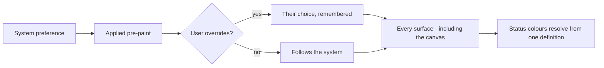

# Theming

Light and dark as equals, across every surface, at every density the app uses. Colour carries meaning
once, defined in one place.

| | |
|---|---|
| Index | [13.2](../../../README.md#13--platform) |
| Module | [Platform](../spec.md) |
| API / CLI / Studio | — / — / ✅ |
| Related | [design-system](design-system.md) · [graph-canvas](../../explore/features/graph-canvas.md) |

> **As** someone who works in this all day, **I want** it to look right in my theme and stay legible
> at the density I use, **so that** the tool is comfortable rather than merely functional.

## Capabilities

| # | Capability | Notes |
|---|---|---|
| C1 | Light and dark | Neither is an aftertodo; both checked before a component ships |
| C2 | Theme variants | Palettes beyond the default two |
| C3 | Density | Dense inspectors and airy forms use the same components at different sizes |
| C4 | Structure square, controls slightly round | One control radius token; zero elsewhere |
| C5 | Status colour defined once | Reused everywhere, never re-picked per screen |
| C6 | The canvas follows | Node and edge colour resolve against the active theme |
| C7 | The viewer's choice persists | Per person, across sessions |

## Journey

## Seams

| Seam | What the user sees |
|---|---|
| Switching mid-session | Everything switches together, no per-component shimmer |
| A canvas mid-render | Colours resolve on the next frame; nothing redraws from scratch |
| A theme variant missing a token | Falls back to the default's token rather than rendering unstyled |
| Print or export | Light palette, whatever the screen is set to |

## Decisions

| # | Decision |
|---|---|
| TH1 | Light and dark are equal; both are verified before a component ships. |
| TH2 | One radius token for controls; structure is square. |
| TH3 | Status colour is defined once and reused. |
| TH4 | The canvas resolves colour from the active theme, not from stored per-element colour. |
| TH5 | Theme choice is per person and persists. |

## Not building

| Not building | Because |
|---|---|
| A theme editor for end users | themes are shipped and versioned |
| Per-Graph branding | one product, one look |
| Per-element saved colours | colour-by-type keeps meaning consistent |
