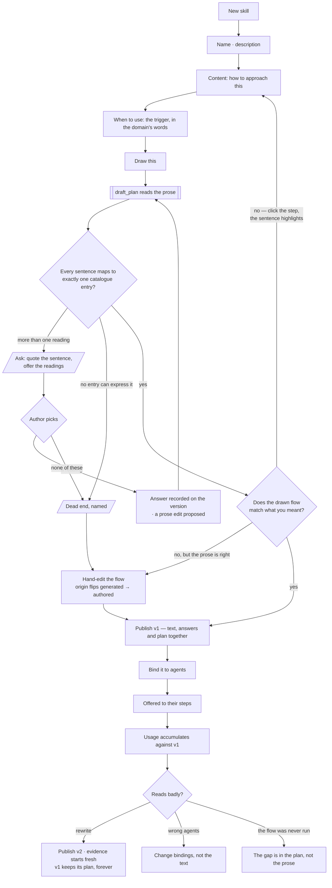

# Authoring a skill

A skill is a playbook with a name, a body, and — the part that matters — a **when to use**. It is
offered to a step, never forced on one.

| | |
|---|---|
| Index | [6.1](../../../README.md#6--skills) · Slice **S5** |
| Module | [Skills](../spec.md) |
| API / CLI / Studio | ✅ / — / 🟡 |
| Related | [bindings](bindings.md) · [usage](usage.md) · [proposals](../../memory/features/proposals.md) |

> **As** someone who knows how this work should be done, **I want** to write it down once, **so that**
> every agent doing it is offered the same approach.

## Capabilities

| # | Capability | Notes |
|---|---|---|
| C1 | Name, description, content, when-to-use | Four fields; the last is what makes it selectable |
| C2 | Unique name per Graph | A duplicate is refused, naming the existing one |
| C3 | Versioned | Editing publishes the next version; the previous keeps resolving |
| C4 | A step is offered a **version** | Traces record which, so evidence is per version |
| C5 | Markdown body | Written for a model to read and a person to review |
| C6 | Usage is visible from the skill | Where it was offered, and where it was applied |
| C7 | Deactivation, not deletion | A skill in use stays resolvable |
| C8 | **The playbook is drawn as a flow** | While the draft is edited, a `role=plan` run redraws it. The picture is a comprehension check on the prose — if the flow reads wrong, the prose is ambiguous |
| C9 | **One version, exactly one plan** | `plan_id` is `NOT NULL` — never *may have a flow*. The draft plan exists from the first draw and publishes with the version, as one act |
| C10 | **An ambiguous sentence stops and asks** | `draft_plan` never guesses a reading. It raises a `TaskPrompt kind=clarification` quoting the sentence and offering the readings — no plan is written until it is answered |
| C11 | **Every step traces to its sentence** | `Task.source_span`. Click a step, the prose highlights; a sentence that produced no step is shown as unmapped |

## Journey

## Seams

| Seam | What the user sees |
|---|---|
| Duplicate name | Refused, with a link to the existing skill |
| Empty when-to-use | Refused — a skill that never says when is never selected well |
| Editing while runs are in flight | Those runs keep v1; the next one is offered v2 |
| A skill nothing applies | Usage shows the gap, and a proposal may follow |
| The draft is being redrawn | The flow is shown dimmed with the previous drawing beneath it — never an empty canvas |
| Nothing in the catalogue fits a sentence | It becomes a `form: human` step — a person does it. **A catalogue gap never blocks publishing**, which is what makes *every version has a plan* safe |
| The playbook has no steps at all | It is not a skill. The draft says so and offers to move it to [rules](rules.md) — *prefer supplier names over ids* was always a rule |
| The flow was hand-edited, then the prose changed | Redrawing is **offered, not automatic** — and it names what the hand-edit will discard |
| The planner is waiting on an answer | The question sits **against the sentence in the editor**, not in a separate queue. The flow area says what it is waiting for |
| Nothing in the catalogue can express a sentence | Named as a dead end — *no entry matches this*. Rewriting is **not** offered, because rewriting cannot work; cutting the sentence, filing the gap and hand-authoring are |
| The planner has asked its third question | The cap is reached; hand-authoring the flow is offered instead of a fourth |
| A sentence produced no step | Shown unmapped in the prose — the diagnosis, without the author hunting for it |
| The plan names a step the binding agent may not call | Refused **at bind time**, with the bound named ([agents/spec.md](../../agents/spec.md)) |

## Surfaces

| Surface | Shape |
|---|---|
| Skills list | One per Graph; `+` in the header |
| Skill panel | The four fields; version bar with what changed |
| Usage tab | Agents offered it, steps that applied it, the gap |
| Flow tab | The drawn plan — **reuses the plan canvas** (`WorkflowStepHiFi`, screen 34), not a new screen |
| Clarification | Asked inline against the highlighted sentence — readings as options, each naming the step it would produce. Never a free-text box |
| Prose ↔ flow selection | Two-way: select a step, the span highlights; select a span, the step does |

## Engine

| Thing | Shape |
|---|---|
| `skills` | `graph_id` · `name` · `current_version_id` |
| `skill_versions` | `description` · `content` · `when_to_use` · **`plan_id` (NOT NULL, UNIQUE)** · `published_at`, immutable |
| `skill_version_clarifications` | `skill_version_id` · `span` · `question` · `options` · `answer` · `answered_by` — recorded, so a redraw never re-asks |
| Routes | `…/skills*` · `POST …/skills/{id}/versions` |
| Events | `skill.created · published · deactivated · plan_drafted` |

## Surfaces, as drawn

On [Govern, Agents and Skills](https://claude.ai/artifact/VrdrR5iKGfqsjhCouQDTbc) — reconciled into this file before any of it is built.

| Surface | Shape | Artboard |
|---|---|---|
| The drawer | `Skills` list: name, version, the whole `when_to_use` sentence, offered/applied, how many agents. A draft says so | `SkillsPanel` |
| The detail | The **drilled-in drawer** ([SK17](#decisions)) — header `‹ SKILLS / <name>`, four tabs, footer `Bind to an agent` · `New version` | every `Skill*` |
| **Playbook** tab | The prose, one sentence per line, each showing the step it produced; a sentence with no step is marked | `SkillAuthor` |
| **Flow** tab | The plan in its six layers ([SK16](#decisions)); the drawer lists the layers it declares, which is the bind check read in advance | `SkillFlow` |
| Composition | `uses: workflow:<key>@<v>` inlined, with the arguments this skill tunes ([SK18](#decisions)) | `SkillUsesPlan` |
| Versions | Reached from the Playbook footer: the version list, and the prose-and-plan diff against the one before | `SkillVersions` |
| The clarification | A card on the draft canvas quoting the sentence and offering the readings; the node it would write is a ghost until answered | `SkillAuthor` |

## Decisions

| # | Decision |
|---|---|
| SK1 | A skill must state when to use it. |
| SK2 | Skills are versioned; a published version is immutable. |
| SK3 | A step records the version it was offered. |
| SK4 | Deactivate rather than delete. |
| SK5 | **A skill's plan hangs off the version, not the skill.** A version is immutable, so a plan can never be stale against the prose it was drawn from — there is no `stale` flag and no reconciliation job. |
| SK6 | **It is drafted automatically and published deliberately.** The same principle as *Not building → auto-generated skills*: it proposes, a person publishes. Editing prose never silently changes what executes. |
| SK7 | **A hand-edit flips `origin` to `authored`.** Regenerating from prose after that is offered, never automatic, and says what it discards. |
| SK13 | **A skill version is drawn as exactly one `TaskPlan`** — `plan_id` is `NOT NULL`. No surface branches on *does this skill have a flow*, and the Flow tab is always there. |
| SK14 | **If it cannot be drawn as a flow, it is not a skill — it is a rule.** The 1:1 turns the Skill/Rule boundary from the author's judgement into something the product holds. |
| SK16 | **The Flow tab draws the plan in the six layers it will touch, and that is the only flow view a skill has.** One view, not two: a node graph beside a layer strip would be two drawings of one plan to keep in step, and the layer strip answers the question the skill surface is actually asked — *what will this playbook engage?* It is the same six bands as the run dashboard ([D5](../../../governance.md)), read in the other tense: **declared** here, **touched** there. The dependency shape of the plan — branches, gates, `depends_on` — is read on the plan's own canvas in the Library ([G34](../../../building-studio/graph-detail-page.md)), which every TaskPlan already has. Drawn as `SkillFlow` on [Govern, Agents and Skills](https://claude.ai/artifact/VrdrR5iKGfqsjhCouQDTbc). |
| SK17 | **The skill's detail lives in the drilled-in drawer, with four tabs** — `Playbook` · `Flow` · `Bindings` · `Usage` — and `mainSection` holds what the active tab opens. It is [G33](../../../building-studio/graph-detail-page.md)'s drill-in applied unchanged: the drawer header becomes `‹ SKILLS / Escalate a late supplier` and the Rules drawer keeps its place underneath. The tabs are never a strip inside `mainSection`. |
| SK18 | **The Flow tab creates and tunes; it does not author library plans.** What a person does here is narrow on purpose: draw the playbook from its prose, inline a standalone plan with `uses` ([LB18](../../workflows/features/the-library.md)), and **set the arguments that make it fit this skill** ([LB19](../../workflows/features/the-library.md)). Authoring a reusable plan is **Library › Plans**' surface ([7.7](../../workflows/features/draft-a-plan.md)), and it is a different act with a different audience — a skill is written for one job, a library plan for every job that resembles it. Keeping them apart is what stops the Flow tab growing into a second plan editor. |
| SK15 | **`form: human` is the universal fallback**, which is what makes SK13 safe: anything the catalogue cannot express, a person can, so a catalogue gap never blocks publishing a playbook. |
| SK9 | **The planner asks rather than guesses.** An ambiguous span raises a clarification and writes no plan. Drawing a guess moves a question the planner could ask into a picture a person has to decode. |
| SK10 | **Ambiguity is a declared condition, not a feeling** — a span matching more than one catalogue entry, or none. Both are checkable, so this never becomes a planner that asks whenever it is unsure. |
| SK11 | **An answer repairs the playbook.** It is recorded on the version so a redraw never re-asks, **and** it proposes the prose edit that would have avoided the question. Otherwise every future version re-asks and the prose never learns. |
| SK12 | **A redraw is a revision, not a fresh draft.** The previous plan goes back to `draft_plan` and the result is shown as a diff, so a moved box is the author's edit and not the model's sampling. |
| SK8 | **It is a `TaskPlan`, not a `SkillPlan`.** Same record, same Runtime, same `plan_snapshot`. The skill is provenance — `source_skill_version_ids[]` — and provenance is a column, not a type ([orchestration § 0.8](../../../orchestration.md#08-a-skill-drawn-as-a-flow)). |

## Not building

| Not building | Because |
|---|---|
| Skill categories or tags | the Graph's set is small enough to read |
| Auto-generated skills from traces | consolidation proposes; a person writes |
| Priority between skills | offering is not ranking |
| A plan that auto-publishes when the prose changes | editing a playbook would silently change what runs |
| A bespoke flow editor for skills | the plan canvas already draws a `TaskPlan`; a second editor would drift |
| A free-text answer to a clarification | it is a second way to write the playbook, in a box that is not the playbook |
| Redrawing on every keystroke | half a sentence is not an instruction; a flow drawn from one is misleading feedback |
| Generating prose from a hand-edited flow | two generators pointing at each other is a drift machine |
