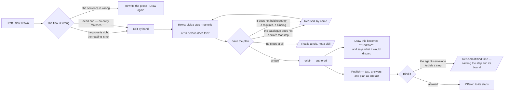
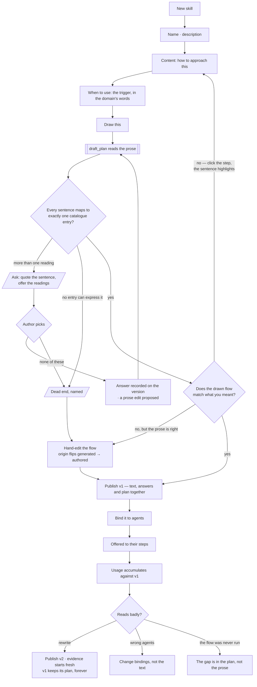

# Authoring a skill

A skill is a playbook with a name, a body, and — the part that matters — a **when to use**. It is
offered to a step, never forced on one.

| | |
|---|---|
| Index | [6.1](../../../README.md#6--skills) · Slice **S5** |
| Module | [Skills](../spec.md) |
| API / CLI / Studio | ✅ / — / ✅ |
| Related | [bindings](bindings.md) · [usage](usage.md) · [proposals](../../memory/features/proposals.md) |

> **As** someone who knows how this work should be done, **I want** to write it down once, **so that**
> every agent doing it is offered the same approach.

## Capabilities

| # | Capability | Notes |
|---|---|---|
| C1 | Name, description, content, when-to-use | Four fields; the last is what makes it selectable |
| C2 | Unique name per Graph | A duplicate is refused, naming the existing one |
| C3 | Versioned | Editing publishes the next version; the previous keeps resolving |
| C4 | A step is offered a **version** | Traces record which, so evidence is per version |
| C5 | Markdown body | Written for a model to read and a person to review |
| C6 | Usage is visible from the skill | Where it was offered, and where it was applied |
| C7 | A published version is immutable | A trace that named one keeps resolving. There is no deactivation — the act that keeps a skill out of a run is **not publishing it** ([SK21](#decisions) · [BN14](bindings.md#decisions)) |
| C8 | **The playbook is drawn as a flow** | While the draft is edited, a `role=plan` run redraws it. The picture is a comprehension check on the prose — if the flow reads wrong, the prose is ambiguous |
| C9 | **One version, exactly one plan** | `plan_id` is `NOT NULL` — never *may have a flow*. The draft plan exists from the first draw and publishes with the version, as one act |
| C10 | **An ambiguous sentence stops and asks** | `draft_plan` never guesses a reading. It raises a `TaskPrompt kind=clarification` quoting the sentence and offering the readings — no plan is written until it is answered |
| C11 | **Every step traces to its sentence** | `Task.source_span`. Click a step, the prose highlights; a sentence that produced no step is shown as unmapped |

## Journey

### The hand-edit, and what it costs

## Seams

| Seam | What the user sees |
|---|---|
| Duplicate name | Refused, with a link to the existing skill |
| Empty when-to-use | Refused — a skill that never says when is never selected well |
| Editing while runs are in flight | Those runs keep v1; the next one is offered v2 |
| A skill nothing applies | Usage shows the gap, and a proposal may follow |
| The draft is being redrawn | The flow is shown dimmed with the previous drawing beneath it — never an empty canvas |
| The library plan it inlined has a newer version | Said on the rows — *nl-single@2 exists* — and nothing moves. The copy is what this version publishes ([SK32](#decisions)); re-inlining is an act, and it replaces the rows it wrote |
| A tuned argument is not one the plan declares | Refused by name at save, beside the names it does declare — an argument nothing declares is a typo |
| Nothing in the catalogue fits a sentence | It becomes a `form: human` step — a person does it. **A catalogue gap never blocks publishing**, which is what makes *every version has a plan* safe |
| The playbook has no steps at all | It is not a skill. The draft says so and offers to move it to [rules](rules.md) — *prefer supplier names over ids* was always a rule |
| The flow was hand-edited, then the prose changed | Redrawing is **offered, not automatic** — and it names what the hand-edit will discard |
| The planner is waiting on an answer | The question sits **against the sentence in the editor**, not in a separate queue. The flow area says what it is waiting for |
| The author answers a question | The next draw opens on the answer — the flow area stays in *Drawing…* rather than handing the act back ([SK30](#decisions)). If the plan has been hand-edited, the draw is offered instead, naming what it would discard |
| Nothing has been drawn yet | The action reads *Draw this* and costs no confirmation: the one `form: human` node a draft is born with is nobody's work ([SK29](#decisions)). It reads *Redraw* once a node carries a `source_span` |
| Nothing in the catalogue can express a sentence | Named as a dead end — *no entry matches this*. Rewriting is **not** offered, because rewriting cannot work; cutting the sentence, filing the gap and hand-authoring are |
| The planner has asked its third question | The cap is reached; hand-authoring the flow is offered instead of a fourth |
| The drawn plan does not hold together | The draw **settles** having written nothing, and says why against the flow area — the step, and what it wanted ([SK31](#decisions)). The plan that was there is untouched. *Run it against the graph* with no sentence that checks it first is the common one: `execute_graph_query` requires `validate_query`, and the catalogue is where that is declared |
| A sentence produced no step | Shown unmapped in the prose — the diagnosis, without the author hunting for it |
| The plan names a step the binding agent may not call | Refused **at bind time**, with the bound named ([agents/spec.md](../../agents/spec.md)) |

## Surfaces

| Surface | Shape |
|---|---|
| Skills list | One per Graph; `+` in the header |
| Skill panel | The four fields; version bar with what changed |
| Usage tab | Agents offered it, steps that applied it, the gap |
| Flow tab | The drawn plan — **reuses the plan canvas** (`WorkflowStepHiFi`, screen 34), not a new screen |
| Clarification | Asked inline against the highlighted sentence — readings as options, each naming the step it would produce. Never a free-text box |
| Prose ↔ flow selection | Two-way: select a step, the span highlights; select a span, the step does |
| **Hand-edit** | *Edit by hand* on the draft's flow section (`SkillPlanEditor`): one row per step — a picker over the catalogue, the row's title, its band, and *a person does this*. It never draws an edge ([SK18](#decisions)). The choices come from the draft read's `vocabulary`, so Studio never carries a copy of a closed set it cannot see ([SK28](#decisions)) |
| **Redraw after a hand-edit** | *Draw this* becomes **Redraw**, and the first click names what it would discard before the second one does it ([SK7](#decisions)) |
| **A refused bind** | Drawn against the agent's row on the Bindings tab, never as a toast above the list: it names the check, the step, its bound, and the grounds it did **not** read ([BN5 · BN7](bindings.md)) |
| **The whole skill** | `More`, drilled in, opens a `kind = skill` declared board in `mainSection`: the tiles, the trigger, the playbook, the flow, what it composed, its bindings and its versions — the drawer staying where it was ([SK36](#decisions) · [skills-dashboards.md](../../../building-studio/skills-dashboards.md)) |

## Engine

| Thing | Shape |
|---|---|
| `skills` | `graph_id` · `name` · `current_version_id` |
| `skill_versions` | `skill_id` · `version` · `description` · `content` · `when_to_use` · **`plan_id` (NOT NULL, UNIQUE)** · `published_at`, immutable. `plan_id` arrives with [M8](../../../building-engine/task-model-migration.md) — the column is added `NOT NULL` there, over a backfill, never nullable first ([SK13](#decisions)) |
| `skill_version_clarifications` | `skill_version_id` · `span` · `question` · `options` · `answer` · `answered_by` — recorded, so a redraw never re-asks |
| Routes | `…/skills*` · `POST …/skills/{id}/versions` · `PATCH …/skills/{id}/draft/tasks` — the hand-edit, which replaces the draft's rows wholesale and flips `task_plans.origin` to `authored` ([SK7](#decisions) · [SK28](#decisions)) |
| Events | `skill.create` · `skill.update` · `skill.publish` · `skill.delete` |

## Surfaces, as drawn

On [Govern, Agents and Skills](https://claude.ai/artifact/VrdrR5iKGfqsjhCouQDTbc) — reconciled into this file before any of it is built.

| Surface | Shape | Artboard |
|---|---|---|
| The drawer | `Skills` list: name, version, the whole `when_to_use` sentence, offered/applied, how many agents. A draft says so | `SkillsPanel` |
| The detail | The **drilled-in drawer** ([SK17](#decisions)) — header `‹ SKILLS / <name>`, four tabs, footer `Bind to an agent` · `New version` | every `Skill*` |
| **Playbook** tab | The prose, one sentence per line, each showing the step it produced; a sentence with no step is marked | `SkillAuthor` |
| **Flow** tab | The plan in its six layers ([SK16](#decisions)); the drawer lists the layers it declares, which is the bind check read in advance. A step inlined from a library plan is an ordinary row in its own band, drawn as a **dashed** chip, and **Composed** under the strip names each plan once — its step count, what this skill tuned, and *vN exists* when the library has published past it ([SK34](#decisions)) | `SkillFlow` · `SkillUsesPlan` |
| Composition ✅ | `uses: <key>@<v>` inlined **at composition**, flat, each row naming the plan it came from, with the arguments this skill tunes ([SK18](#decisions) · [SK32](#decisions) · [SK33](#decisions)). The picker and its argument controls are the hand-edit's own rows — `GET …/skills/inlinable` offers the plans, `PATCH …/draft/tasks` takes a `uses` row | `SkillUsesPlan` |
| Versions | Reached from the Playbook footer: the version list, and the prose-and-plan diff against the one before | `SkillVersions` |
| The clarification | A card on the draft canvas quoting the sentence and offering the readings; the node it would write is a ghost until answered | `SkillAuthor` |

## Decisions

| # | Decision |
|---|---|
| SK1 | A skill must state when to use it. |
| SK2 | Skills are versioned; a published version is immutable. |
| SK3 | A step records the version it was offered. |
| SK19 | **Every existing skill becomes its own immutable v1, and the steps that were offered it are rewritten to name it.** `published_at` is the skill's `created_at`; `task_runs.skills_offered` and `.skills_applied` are migrated from bare skill ids to that v1's id, so one id shape means one thing everywhere and no reader carries a *before versions* branch. The claim v1 makes is narrow and stated on the usage surface: *this is the text as it stands, and these steps were offered this skill* — not that the wording never changed before versions existed. |
| SK4 | Deactivate rather than delete. |
| SK5 | **A skill's plan hangs off the version, not the skill.** A version is immutable, so a plan can never be stale against the prose it was drawn from — there is no `stale` flag and no reconciliation job. |
| SK6 | **It is drafted automatically and published deliberately.** The same principle as *Not building → auto-generated skills*: it proposes, a person publishes. Editing prose never silently changes what executes. |
| SK7 | **A hand-edit flips `origin` to `authored`.** Regenerating from prose after that is offered, never automatic, and says what it discards. |
| SK13 | **A skill version is drawn as exactly one `TaskPlan`** — `plan_id` is `NOT NULL`. No surface branches on *does this skill have a flow*, and the Flow tab is always there. |
| SK14 | **If it cannot be drawn as a flow, it is not a skill — it is a rule.** The 1:1 turns the Skill/Rule boundary from the author's judgement into something the product holds. |
| SK16 | **The Flow tab draws the plan in the six layers it will touch, and that is the only flow view a skill has.** One view, not two: a node graph beside a layer strip would be two drawings of one plan to keep in step, and the layer strip answers the question the skill surface is actually asked — *what will this playbook engage?* It is the same six bands as the run dashboard ([D5](../../../governance.md)), read in the other tense: **declared** here, **touched** there — and the same axis, which is **time**: a step is a bar on the row of the participant it spends, placed on the plan's own order here and on the wall clock there ([D20](../../../governance.md)). The dependency shape of the plan — branches, gates, `depends_on` — is read on the plan's own canvas in the Library ([G34](../../../building-studio/graph-detail-page.md)), which every TaskPlan already has. Drawn as `SkillFlow` on [Govern, Agents and Skills](https://claude.ai/artifact/VrdrR5iKGfqsjhCouQDTbc). |
| SK17 | **The skill's detail lives in the drilled-in drawer, with four tabs** — `Playbook` · `Flow` · `Bindings` · `Usage` — and `mainSection` holds what the active tab opens. It is [G33](../../../building-studio/graph-detail-page.md)'s drill-in applied unchanged: the drawer header becomes `‹ SKILLS / Escalate a late supplier` and the Rules drawer keeps its place underneath. The tabs are never a strip inside `mainSection`. |
| SK18 | **The Flow tab creates and tunes; it does not author library plans.** What a person does here is narrow on purpose: draw the playbook from its prose, inline a standalone plan with `uses` ([LB18](../../workflows/features/the-library.md)), and **set the arguments that make it fit this skill** ([LB19](../../workflows/features/the-library.md)). Authoring a reusable plan is **Library › Plans**' surface ([7.7](../../workflows/features/draft-a-plan.md)), and it is a different act with a different audience — a skill is written for one job, a library plan for every job that resembles it. Keeping them apart is what stops the Flow tab growing into a second plan editor. |
| SK15 | **`form: human` is the universal fallback**, which is what makes SK13 safe: anything the catalogue cannot express, a person can, so a catalogue gap never blocks publishing a playbook. **A plan every row of which is a person's is one of those plans, not an empty one.** Such a plan reaches the envelope with nothing to validate, and the validator reads an empty step list as *the plan has no steps* — so the hand-edit route skips it rather than passing it a list the check would misread. The genuinely empty plan is already refused a line earlier, in its own sentence ([SK14](#decisions)), and it is the plan a draft is born with ([SK22](#decisions)) that makes this the ordinary case rather than a corner. |
| SK9 | **The planner asks rather than guesses.** An ambiguous span raises a clarification and writes no plan. Drawing a guess moves a question the planner could ask into a picture a person has to decode. |
| SK10 | **Ambiguity is a declared condition, not a feeling** — a span matching more than one catalogue entry, or none. Both are checkable, so this never becomes a planner that asks whenever it is unsure. |
| SK11 | **An answer repairs the playbook.** It is recorded on the version so a redraw never re-asks, **and** it proposes the prose edit that would have avoided the question. Otherwise every future version re-asks and the prose never learns. |
| SK12 | **A redraw is a revision, not a fresh draft.** The previous plan goes back to `draft_plan` and the result is shown as a diff, so a moved box is the author's edit and not the model's sampling. |
| SK8 | **It is a `TaskPlan`, not a `SkillPlan`.** Same record, same Runtime, same `plan_snapshot`. The skill is provenance — `source_skill_version_ids[]` — and provenance is a column, not a type ([orchestration § 0.8](../../../orchestration.md#08-a-skill-drawn-as-a-flow)). |
| SK20 | **A draft is a `skill_versions` row with `published_at IS NULL`** — the only mutable version row there will ever be. Publishing stamps `published_at` and moves `skills.current_version_id`; from then on it is immutable ([SK2](#decisions)). A skill has at most one draft, and its `version` number is assigned when the draft is created, so the plan, the clarifications and the answers hang off the id the published version keeps. *Text, answers and plan publish as one act* is then one `UPDATE`, not a copy. |
| SK21 | **`skills.current_version_id` is null while a skill has only a draft**, and the read says `is_draft`. Nothing is ever offered a draft — assembly reads the current version, which does not exist yet — and the drawer draws it as what it is. |
| SK22 | **The plan exists from the first draw, never before it.** `plan_id` is `NOT NULL`, so a draft is written together with a plan: one `form: human` node carrying the skill's name ([SK15](#decisions)). A catalogue gap, an unrun planner and a half-written playbook are then the same shape — *a person does this step* — instead of three empty states. |
| SK23 | **Drawing is a `role=plan` TaskRun** ([C8](#capabilities)), and it is the first thing in the product to open one. The exchange is recorded, the clarification is an ordinary `TaskPrompt`, answering resumes from the cursor, and what the planner did opens in Runs like any other run — none of which is worth reimplementing inside a skill. |
| SK24 | **The three ambiguity cases are counted, not judged** ([SK10](#decisions)). `draft_plan` asks the model for **candidates per sentence**: exactly one → a `callable` task; **two or more → a clarification** quoting the sentence and offering the readings, each naming the step it would write; none → a `form: human` task. A sentence the model marks as not an instruction produces no task and is shown unmapped. |
| SK25 | **The product's own playbook is a seeded skill, and it stays editable.** *Answer in natural language* is written into every Graph with `origin = builtin` — the four tasks the runtime has always walked, with a `source_span` on each — re-seeded idempotently by name, never deleted, and a person may publish v2 over it. A capability the product ships and a capability a person writes are then the same record, which is the only way the surface can be honest about either. |
| SK26 | **The draft's question is a row on the version, not a prompt on the run.** `draft_plan` records the clarification against the sentence and the run **settles** having written nothing — it does not suspend. Three reasons, and they agree: the question belongs *against the sentence in the editor* rather than in a queue (Seams); a run with no reply row is unattended, and the runtime turns an unattended question into *cannot answer* rather than leaving a run waiting on nobody; and an answer is part of what publishes, so it has to outlive the run that asked. Drawing again after an answer is another draw, which is also what makes a redraw a revision ([SK12](#decisions)). |
| SK28 | **A hand-edited plan is bounded by the catalogue, never by an agent's envelope.** A skill belongs to no agent — it is offered to whichever are bound to it — so authoring is checked against the closed set of steps that exist, and *may **this** agent call **this** step* is checked where the agent is known: at bind time ([BN5](bindings.md)). Validating here against some agent's envelope would let the Graph's default agent decide what every other agent's skills may say. Everything else the validator checks still runs, and it is the part a hand-edit needs: a duplicate key, a binding to a step that does not run first, a binding to an output its source does not declare, and a `requires` the catalogue declares. A step the catalogue does not declare is refused by name; a step a person does is always allowed ([SK15](#decisions)). |
| SK27 | **The drill-in is the drawer's header, and the act the drawer is for sits on its right.** A stack gives each drawer one header with one action area ([G33](../../../building-studio/graph-detail-page.md)), so `‹ SKILLS / <name>` is that header's title rather than a second bar inside the body, and `+ New skill` is a header action rather than a button floating above the list. The Rules drawer underneath follows the same rule — two drawers that drill in differently would be two ideas to learn for one gesture. **The trail is text, and going back is the header's action.** A `PanelStack` header *is* its collapse control, so a crumb that could be clicked would be a `<button>` inside a `<button>` — invalid, and it would steal the collapse click from the gesture that owns it. So `SKILLS / <name>` reads as the trail and `‹ Back to skills` takes the action area, which is free exactly when the drawer is drilled in and the act it is for is no longer *create*. [`TaskDrawer`](../../../building-studio/the-shell.md) drills in the same way. |
| SK29 | **`origin` names who wrote the rows, so the plan a draft is born with is `generated`.** The fallback plan is one `form: human` node nobody wrote ([SK22](#decisions)); calling it `authored` made `authored` mean two things at once — *a person corrected this* and *nothing has drawn this yet* — and the surface can only honour [SK7](#decisions) if it can tell them apart. So a draft's plan carries `generated` from the moment it exists, a draw leaves it `generated`, and **only a hand-edit flips it to `authored`**. *Redraw* is then read off the rows (a node with a `source_span` was drawn) and the *what it would discard* warning off `origin`, which is the only fact that claims someone's work is at stake. |
| SK30 | **Answering a question continues the drawing, and the surface is what opens the next draw.** The run that asked has already settled ([SK26](#decisions)) — resuming it would be a run waiting on nobody — so the loop the journey draws (*answer → `draft_plan` again*) is closed one band up: recording the answer returns the draft, and Studio opens the next draw with it. An answer is only ever given to get the flow drawn, so making the author press *Draw this* a second time is a step that asks them to restate what they just said. The engine's route records and nothing else, which is what keeps a redraw a revision ([SK12](#decisions)) and keeps the cap (`max_clarifications`) the only thing that ends the loop. A plan that has been hand-edited is the exception: there the next draw is **offered**, never opened, because it would discard rows a person wrote ([SK7](#decisions)). |
| SK31 | **A draw that cannot write the plan settles, exactly as one that must ask does.** `resolve_plan` refuses a drawn plan for four reasons — a step outside the envelope, a duplicate key, a binding to a step that does not run first, and a `requires` the catalogue declares and the prose never named. All four are the *author's* to answer, so the draw records them on its result and settles with `steps: 0`; it does not raise. Raising put the reasons in a failure payload no surface reads, left the draft silently undrawn, and named the agent's envelope for a refusal that was usually about a missing prerequisite — a refusal on grounds it did not check, which is the one thing a refusal may never be ([BN7](bindings.md)). The reasons are read back off that run, in the validator's words, and shown where the flow would have been; the next draw that writes rows is a newer run, so the refusal clears itself and needs no column. |
| SK32 | **A `uses` is an act, not a link — it expands when somebody composes it, and the copy is the skill's.** [LB18](../../workflows/features/the-library.md#decisions) says a skill *inlines* a library plan rather than sharing its row; this settles **when**. Resolving `uses` at run time, as [13.8 § 4](../../platform/features/runtime.md) sketches, would mean a library edit silently changes what every skill that named it does — and it would break [SK5](#decisions) outright, because the prose is frozen at publish and the steps would not be. So the rows are copied into the calling plan at the moment of composition, validated as one graph there, and the runtime learns nothing: it sees the steps it has always seen. *A newer version of that plan exists* is then something to **say** on the row, and acting on it is a re-inline somebody asks for. |
| SK33 | **The inlined steps are flat siblings, each naming the plan version it came from.** A `composite` parent would need an interpreter that walks one — which nothing has ever written — and it would buy a drawing, which `tasks.source_plan_key` gives for free: the Flow tab groups five rows under *nl-single@1* without a node that hides them. Flat also keeps one promise that nesting would quietly weaken — the envelope validates **every** step, because every step is a row at the same depth, so a composed plan cannot smuggle one past a bound ([LB18](../../workflows/features/the-library.md#decisions)). |
| SK34 | **A composed step is marked where it sits, and the composition is named once underneath.** [SK33](#decisions) makes an inlined row an ordinary row, so the Flow tab draws it in the band it belongs to — clustering five of them into one place would undo the drawing the layer strip exists to make, and a node that hid them is the composite [SK33](#decisions) refused. So the chip is **dashed** and a **Composed** block under the strip lists each plan version once, with the rows it wrote counted off `source_plan_key` rather than off the record, so the two can never disagree. The block is also where *a newer version exists* is said ([SK32](#decisions)): the plan read returns each composition's `latest_version` beside the one it inlined, and the surface states it and stops — re-inlining is an act somebody asks for, because the copy is what makes a published skill do tomorrow what it did today. |
| SK35 | **A skill is addressed by its name and its version; only a library plan carries a `key@version`.** `skills` has no `key` column and never gains one: a skill is written for one job in one Graph, and the thing that needs a stable address across installs is the *reusable plan* a skill inlines ([LB1](../../workflows/features/the-library.md#decisions)). So a surface says *Answer in natural language · v7*, and reserves `nl-single@2` for the plan — which is exactly the pair a composed row holds, `source_plan_key` naming the plan and nothing naming the skill, because the skill is the row's owner rather than its source ([SK33](#decisions)). A `skill:` namespace would make the two look interchangeable in every drawing, and they are not: one is identity inside a Graph, the other is a version anybody may inline. |
| SK36 | **`More` opens the skill as a declared board, and the drawer stays where it was.** The four tabs answer *which skill* in 420px, and every question that needs two numbers beside each other — the prose against the flow it drew, the versions against what each was applied — is a table a column cannot hold without becoming a dashboard in a drawer. So the whole skill is a `kind = skill` board bound to the skill's id, opened deliberately and never instead of the panel ([CV14](../../explore/features/boards.md)), composed as one `DashboardSpec` from the reads the drawer already makes. The board **reads**: publishing lives in the Playbook tab beside the prose being published ([SK6](#decisions)), because a reading surface carrying the one write that matters most is how a page stops being safe to open. Panel set and seams: [skills-dashboards.md](../../../building-studio/skills-dashboards.md). |

## Not building

| Not building | Because |
|---|---|
| Skill categories or tags | the Graph's set is small enough to read |
| Auto-generated skills from traces | consolidation proposes; a person writes |
| Priority between skills | offering is not ranking |
| A plan that auto-publishes when the prose changes | editing a playbook would silently change what runs |
| A bespoke flow editor for skills | the plan canvas already draws a `TaskPlan`; a second editor would drift |
| A free-text answer to a clarification | it is a second way to write the playbook, in a box that is not the playbook |
| Redrawing on every keystroke | half a sentence is not an instruction; a flow drawn from one is misleading feedback |
| Generating prose from a hand-edited flow | two generators pointing at each other is a drift machine |
