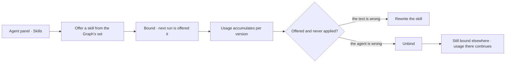

# Offer a skill to an agent

Which agent may be offered which skill. A skill nobody is bound to exists and is never seen; a binding
is how it reaches a run.

| | |
|---|---|
| Index | [6.2](../../../README.md#6--skills) · Slice **S12c** |
| Module | [Skills](../spec.md) |
| API / CLI / Studio | ✅ / — / 🟡 |
| Related | [authoring-a-skill](authoring-a-skill.md) · [the-roster](../../agents/features/the-roster.md) · [usage](usage.md) |

> **As** someone tuning an agent, **I want** to choose exactly what it is offered, **so that** its
> context is small and relevant rather than everything the Graph knows.

## Capabilities

| # | Capability | Notes |
|---|---|---|
| C1 | Bind and unbind, per agent | The set is explicit; nothing is implicit |
| C2 | A binding points at the skill | Not at a version — the agent gets the current one at run time |
| C3 | Bind from either side | From the agent's panel, or from the skill's usage view |
| C4 | Unbinding is immediate | The next run is not offered it; runs in flight are unaffected |
| C5 | Bindings are events | Who bound what, when, and why the roster changed |
| C6 | A spawned agent's bindings are set at spawn | Named by the spawning step, within the parent's envelope |
| C7 | Unbound skills are visible | The skills list shows what nothing is bound to |

## Journey

## Seams

| Seam | What the user sees |
|---|---|
| Skill deactivated while bound | Bindings stay, nothing is offered, and the agent panel says why |
| Binding everything | Allowed, and the panel says how large the context gets |
| A skill bound to no one | Listed as unbound, so it is not mistaken for working |
| Ephemeral child | Its bindings come from the spawn step and are shown on the child |

## Surfaces

| Surface | Shape |
|---|---|
| Agent panel → Skills | The bound set, with add and remove |
| Skill → Usage | Every agent bound, with its offered/applied counts |
| Roster row | Skill count as context |

## Engine

| Thing | Shape |
|---|---|
| `agent_skills` | `agent_id` · `skill_id` · `bound_by` · `bound_at` |
| Assembly | bound skills resolve to their current version at run time |
| Routes | `POST DELETE …/agents/{id}/skills/{skill_id}` |
| Events | `agent.skill_bound · skill_unbound` |

## Decisions

| # | Decision |
|---|---|
| BN1 | A skill reaches a step only through a binding. |
| BN2 | Bindings point at skills, not versions. |
| BN3 | Unbinding affects the next run, never one in flight. |
| BN4 | A spawned agent's bindings are named at spawn time. |
| BN5 | **A binding is checked against the agent's envelope *and* its lens, both at bind time.** The envelope check already refuses a skill whose plan names a `step_key` the agent may not call ([orchestration §0.7](../../../orchestration.md#07-agents-skills-and-plans--three-things-composed-at-run-time)); the same check reads the agent's lens and refuses a skill whose plan needs a participant the agent's guardrails deny — naming the rule, exactly as the envelope refusal names the bound. Binding *Escalate a late supplier* to an agent whose guardrail denies `third_party/**` must fail when someone binds it, not at 3am inside a run. **A narrower world at run time is not a binding error** — a Todo may always narrow further than the agent ([GV6](../../govern/spec.md)), and that produces *cannot answer — outside the lens*, which is recoverable by widening. |

## Not building

| Not building | Because |
|---|---|
| Automatic binding by relevance | who is offered what is a decision worth making explicitly |
| Binding a specific version | pinning defeats the point of publishing a better one |
| Skill groups bound as a set | the set per agent is small enough to choose |
