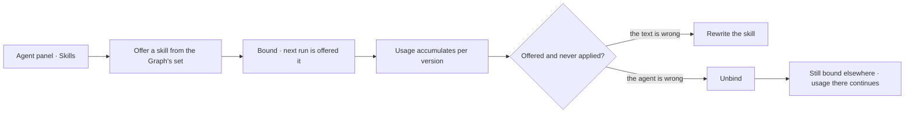

# Offer a skill to an agent

Which agent may be offered which skill. A skill nobody is bound to exists and is never seen; a binding
is how it reaches a run.

| | |
|---|---|
| Index | [6.2](../../../README.md#6--skills) · Slice **S12c** |
| Module | [Skills](../spec.md) |
| API / CLI / Studio | ✅ / — / ✅ |
| Both checks run | the **envelope** half ([BN5](#decisions)) and the **lens** half ([BN10](#decisions)); every refusal still carries `checked` and `not_checked` ([BN7](#decisions)) |
| Related | [authoring-a-skill](authoring-a-skill.md) · [author-an-agent](../../agents/features/author-an-agent.md) · [usage](usage.md) |

> **As** someone tuning an agent, **I want** to choose exactly what it is offered, **so that** its
> context is small and relevant rather than everything the Graph knows.

## Capabilities

| # | Capability | Notes |
|---|---|---|
| C1 | Bind and unbind, per agent | The set is explicit; nothing is implicit |
| C2 | A binding points at the skill | Not at a version — the agent gets the current one at run time |
| C3 | Bind from either side | From the agent's panel, or from the skill's usage view |
| C4 | Unbinding is immediate | The next run is not offered it; runs in flight are unaffected |
| C5 | Bindings are events | Who bound what, when, and why the bindings changed |
| C6 | A spawned agent's bindings are set at spawn | Named by the spawning step, within the parent's envelope |
| C7 | Unbound skills are visible | The skills list shows what nothing is bound to |

## Journey

## Seams

| Seam | What the user sees |
|---|---|
| A **draft** bound to an agent | Bindings stay, nothing is offered, and both pickers say why ([BN14](#decisions)) — a skill has no deactivation |
| Binding everything | Allowed, and the panel says how large the context gets — in characters, never in tokens ([BN15](#decisions)) |
| A skill bound to no one | Listed as unbound, so it is not mistaken for working |
| Ephemeral child | Its bindings come from the spawn step and are shown on the child |

## Surfaces

| Surface | Shape |
|---|---|
| Agent panel → Skills | The bound set, with add and remove, the refusal under the chip that raised it ([BN11](#decisions)), and what the bindings cost ([BN15](#decisions)) |
| Skill → Usage | Every agent bound, with its offered/applied counts |
| Agent row | Skill count as context |
| **A refusal** | Drawn **where the click was** — against the agent's row on the Bindings tab, and beneath the skill's chip on the agent's picker ([BN11](#decisions)) — never a toast above the list, which could not say which one it was about ([BN8](#decisions)). It names the check, the `step_key`, its bound, the plan's declared layers with the denied one struck ([BN13](#decisions)), and the grounds it did not read |
| The *refused* section | The agents this skill **cannot** be offered, each with the check that refused it and what it named — built now that both halves run ([BN10](#decisions)) |

## Engine

| Thing | Shape |
|---|---|
| `skill_bindings` | `skill_id` · `agent_id` · `bound_by_id` · `bound_at` — unique on `(skill_id, agent_id)`. **Owned by `apps/skills/`**, which imports no agent to write one ([BN6](#decisions)) |
| The agent's side | `Agent.bound_skills`, a **read-only** association over the same table. `agent.skill_ids` reads through it; nothing assigns to it ([BN8](#decisions)) |
| Assembly | bound skills resolve to their current version at run time |
| The check | `runtime/managers/skill_bind.py` — `check` runs both halves and raises a `409 skill_binding_refused`. The **envelope** half reads the current version's plan and the agent's envelope, naming `step_key · bound`; the **lens** half reads the Graph's and the agent's guardrails and the participant catalogue, naming `layer · reason · participant · rule` ([BN10](#decisions)). Both carry `check · skill_version_id · checked · not_checked`. It is handed to `SkillBindingManager.bind` as a callable, because `apps/skills` may not import `apps/task_plans` ([BN6](#decisions)) |
| The standing | `SkillAgentStanding` carries `world` — the name of the lens in `agents.lens_id`, absent when the agent carries none, which today is every agent ([BN12](#decisions)). Read once for the whole list, the way the plan and the catalogue are. Context beside the row, never a ground for one |
| The dry run | `SkillBindManager.standings` runs the same two checks per agent without binding, reading the plan and the catalogue once and the guardrails per agent. It is the checks themselves, never a second reading of the rules ([BN10](#decisions)) |
| Routes | `POST DELETE …/agents/{id}/skills/{skill_id}` · `GET …/skills/{id}/agents` — bound · refused · not bound, one read for the Bindings tab |
| Events | `agent.skill_bound` · `agent.skill_unbound` |

## Surfaces, as drawn

On [Govern, Agents and Skills](https://claude.ai/artifact/VrdrR5iKGfqsjhCouQDTbc) — reconciled into this file before any of it is built.

Six artboards — the page carries the whole feature.

| Surface | Shape | Artboard |
|---|---|---|
| **Bindings** tab | Three sections — bound, refused, not bound — each row naming the agent's **world**, not just its name | `SkillBindings` |
| The page | The agents table with a checkbox per agent, and the interesting legal case: a world that changes *which model decides* | `SkillBindings` |
| A refusal | A card naming **which** check failed — the envelope (a `step_key` it may not call) or the lens (a band its guardrails have shut), and the rule ([BN5](#decisions)). The payload carries `check`, `skill_version_id`, `agent_id`, the `layer`, the participant and the rule | `BindRefusals` |
| The layer strip | The plan's declared bands as chips **in the plan's own order**, the shut one struck, so the refusal says what the skill needed and not only what was closed ([BN13](#decisions)). An envelope refusal carries none | `BindRefusals` |
| The three readings | What makes a band shut — `denied_outright` · `closed_layer` · `every_participant_denied` — ordered by how legible the bound is ([BN10](#decisions)) | `BindRefusals` |
| Which checks ran | **Stated on the surface** from `checked` / `not_checked`: a bind is never refused on grounds it did not check ([BN7](#decisions)) | `BindRefusals` |
| The agent's side | Agent panel → its skills, with the Graph's set as a picker that **binds as you click** ([BN8](#decisions)); a spawned child's bindings shown as named at spawn ([BN4](#decisions)) and refused at neither end ([BN9](#decisions)); the routes, the row and the two events | `BindFromAgent` |
| The refusal, on this side | The same card from the same payload, drawn **beneath the chip that was clicked** ([BN11](#decisions)) — never a toast above the picker | `BindFromAgent` |
| What the bindings cost | *2 of 3 bound skills are offered — ~7,412 characters in every ask.* Characters, never tokens ([BN15](#decisions)), with the draft named apart | `BindFromAgent` |
| At run time | The context assembled in a fixed order as discrete items with ids, and what the record holds afterwards — `skills_offered` against `skills_applied` | `SkillOffer` |
| The seams | A **draft** bound to an agent · bound to nobody · binding everything, with its cost in characters · unbinding while a run is in flight · refused · read-only for a member who may not bind | `BindSeams` |
| The standing's world | The row as it draws **today** against the row the day an agent carries a world — the column, its readers, and the writer it does not have ([BN12](#decisions)) | `BindStanding` |

## Decisions

| # | Decision |
|---|---|
| BN1 | A skill reaches a step only through a binding. |
| BN2 | Bindings point at skills, not versions. |
| BN3 | Unbinding affects the next run, never one in flight. |
| BN4 | A spawned agent's bindings are named at spawn time. |
| BN5 | **A binding is checked against the agent's envelope *and* its lens, both at bind time.** The envelope check already refuses a skill whose plan names a `step_key` the agent may not call ([orchestration §0.7](../../../orchestration.md#07-agents-skills-and-plans--three-things-composed-at-run-time)); the same check reads the agent's lens and refuses a skill whose plan needs a participant the agent's guardrails deny — naming the rule, exactly as the envelope refusal names the bound. Binding *Escalate a late supplier* to an agent whose guardrail denies `third_party/**` must fail when someone binds it, not at 3am inside a run. **A narrower world at run time is not a binding error** — a Todo may always narrow further than the agent ([GV6](../../govern/spec.md)), and that produces *cannot answer — outside the lens*, which is recoverable by widening. |
| BN6 | **The binding is a row in `skill_bindings`, and the table belongs to Skills.** Skills is an independent module that agents bind to, so the table is named for what it binds — not `agent_skills`, and not a JSON array on the agent. The write path is what makes [BN5](#decisions) possible: a `PATCH` replacing a whole array has no single skill to refuse, no `bound_by`, and no place to raise the event. `agents.skill_ids` is migrated into rows and dropped; prompt assembly, delegation and usage read the table. The subject is a plain `agent_id` FK — binding anything other than an agent is not a thing the product does. |
| BN7 | **Each half of [BN5](#decisions) waits on what it reads; the write path does not wait on either.** The envelope half reads the **plan** a skill version draws, and runs now that [M8](../../../building-engine/skills-draw-as-plans.md) gives every version one. The lens half reads the agent's **guardrails**, which became readable outside a run when [lens-migration](../../../building-engine/lens-migration.md) landed `lenses` and pinned them by scope ([BN10](#decisions)); both halves now run. So `skill_bindings` and its two routes shipped first and the checks hang off them. A bind is **never refused on grounds it did not check**: every refusal carries `checked` and `not_checked`, and a half-built check that says which half ran beats one that silently passes. |
| BN9 | **A spawn is not a bind-time refusal.** A child's bindings is named at spawn ([BN4](#decisions)) — inside a run, by its parent, with nobody watching — so refusing there would manufacture the 3am failure [BN5](#decisions) exists to prevent, and there is no one to name the bound to. The child's narrowed envelope still refuses the **call** at dispatch, and a skill offered but never called costs a prompt, not an answer. The check therefore guards the two deliberate acts: `POST …/agents/{id}/skills/{skill_id}`, and the skills an `AgentCreate` starts with. |
| BN10 | **A plan names layers, a lens names participants — so the lens half refuses on a layer the guardrails close to the plan entirely.** A plan node declares the band it will touch ([SK16](authoring-a-skill.md)); *which* model, provider or person a run reaches is chosen inside the run, so no plan node carries a participant address and no bind-time check can invent one. What **is** knowable at bind time is whether a band is shut: a guardrail denying `third_party/**`, or a closed layer with nothing allowed inside it, or a Graph whose every participant in that layer is denied. Each of those means a run that reaches the band always refuses — the 3am failure [BN5](#decisions) exists to prevent. Anything narrower is left alone: one permitted participant is enough for the bind to stand, because refusing on *it might pick the denied one* would be refusing on grounds the check cannot read ([BN7](#decisions)), and a run that does pick it says *cannot answer — outside the lens*, which widening recovers ([GV6](../../govern/spec.md)). **It reads guardrails, never worlds.** A guardrail is always in force and a world is picked per question and may only narrow inside it, so a world that shuts a band is the run-time narrowing BN5 already excludes — including the one an agent carries by default in `agents.lens_id`. The refusal names `check: lens`, the `layer`, one denied `participant` it actually checked, and the `rule` that denied it; a layer with no participants and no rule about it is not checked and never refuses. |
| BN8 | **Binding is not a field of the agent.** `POST`/`DELETE …/agents/{id}/skills/{skill_id}` is the only way to change what an agent is bound to; `AgentUpdate` does not take `skill_ids` and `AgentRead` carries it read-only. `AgentCreate` still takes it, because the skills an agent starts with are part of creating it — the same act as a spawned agent's bindings being named at spawn ([BN4](#decisions)) — and those bind through the same manager. In Studio the picker binds as you click rather than staging into `Save`: a refusal that arrived alongside six other edits could not say which one it was about. |
| BN11 | **A refusal is drawn where the click was — on both sides.** The agent panel's picker binds as you click for the reason [BN8](#decisions) gives, and it swallowed the engine's `409`: the chip simply did not light, which is the unattributable failure BN8 exists to prevent, wearing the other surface. Both sides draw the **same card from the same payload** — beneath the chip on the agent's side, under the row on the skill's — each naming the one the click was about. Studio composes no sentence of its own for it: the card draws the engine's facts unflattened, so the two surfaces cannot drift into saying different things about one refusal. |
| BN12 | **A standing names the agent's world, and a world is never a ground.** Two agents differ by the world they carry and a world changes *which model decides*, so an agent row that gives only a name asks the reader to hold that mapping in their head while deciding what to offer. `SkillAgentStanding` carries `world`, the name of the lens in `agents.lens_id`, absent when the agent carries none. It is **context and nothing else**: the check reads guardrails and never worlds ([BN10](#decisions)), so the world is drawn *beside* a refusal and never inside one, and no bind is refused for the world an agent runs under. **Nothing writes `agents.lens_id` yet** — `AgentUpdate` does not take it and no manager assigns it — so every row names no world today and simply draws none. That is the absent-not-empty rule doing its job ([SR34](../../operate/features/see-what-ran.md)): the standing reports what is there, and the day an agent can be given a default world the row draws it with no further change. |
| BN13 | **A lens refusal draws the plan's declared layers, the denied one struck.** Naming only the shut layer says what was closed and not what the skill needed, so a plan touching four bands and refused on one reads the same as a plan that only ever wanted that band. The refusal carries `layers` — the bands the version's plan declares ([SK16](authoring-a-skill.md)), in the plan's own order — and the card draws them as a strip with the one `layer` names struck through. It is the reading the check already made, **returned rather than recomputed**, which is the same reason `refusal` is a dry run and not a prediction ([BN10](#decisions)). An envelope refusal carries no strip: it is about a `step_key`, and a layer strip beside it would suggest a ground it did not read ([BN7](#decisions)). |
| BN14 | **A draft bound to an agent is bound, and offered to nothing.** A skill has no deactivation — the act that keeps one out of a run is not publishing it ([SK21](authoring-a-skill.md)) — so the seam is a **draft**, not a deactivated skill. Its bindings stand and the panel counts it, because unbinding is not the fix and a binding silently dropped at publish time would be a bound set that changed itself. Both pickers say so on the chip and the row. The chip is **not** disabled: binding a draft is how a binding is prepared before the text is ready. |
| BN15 | **Binding everything is allowed, and the panel says what it costs in characters.** The cost of a large bound set is prose in every prompt, and a bound set that grew one chip at a time is exactly the one nobody is counting — so the picker states the count and the size of what is bound. It counts **characters**, a measurement of prose Studio already fetched. It never says tokens: the tokenizer is the model's, Studio does not own one, and an approximate token count is the kind of number that gets acted on as if it were exact. |

## Not building

| Not building | Because |
|---|---|
| Automatic binding by relevance | who is offered what is a decision worth making explicitly |
| Binding a specific version | pinning defeats the point of publishing a better one |
| Skill groups bound as a set | the set per agent is small enough to choose |
