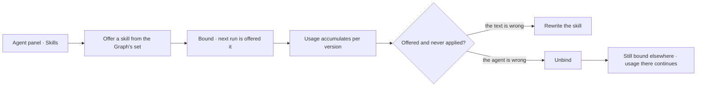

# Offer a skill to an agent

Which agent may be offered which skill. A skill nobody is bound to exists and is never seen; a binding
is how it reaches a run.

| | |
|---|---|
| Index | [6.2](../../../README.md#6--skills) · Slice **S12c** |
| Module | [Skills](../spec.md) |
| API / CLI / Studio | ✅ / — / 🟡 |
| Related | [authoring-a-skill](authoring-a-skill.md) · [the-roster](../../agents/features/the-roster.md) · [usage](usage.md) |

> **As** someone tuning an agent, **I want** to choose exactly what it is offered, **so that** its
> context is small and relevant rather than everything the Graph knows.

## Capabilities

| # | Capability | Notes |
|---|---|---|
| C1 | Bind and unbind, per agent | The set is explicit; nothing is implicit |
| C2 | A binding points at the skill | Not at a version — the agent gets the current one at run time |
| C3 | Bind from either side | From the agent's panel, or from the skill's usage view |
| C4 | Unbinding is immediate | The next run is not offered it; runs in flight are unaffected |
| C5 | Bindings are events | Who bound what, when, and why the roster changed |
| C6 | A spawned agent's bindings are set at spawn | Named by the spawning step, within the parent's envelope |
| C7 | Unbound skills are visible | The skills list shows what nothing is bound to |

## Journey

## Seams

| Seam | What the user sees |
|---|---|
| Skill deactivated while bound | Bindings stay, nothing is offered, and the agent panel says why |
| Binding everything | Allowed, and the panel says how large the context gets |
| A skill bound to no one | Listed as unbound, so it is not mistaken for working |
| Ephemeral child | Its bindings come from the spawn step and are shown on the child |

## Surfaces

| Surface | Shape |
|---|---|
| Agent panel → Skills | The bound set, with add and remove |
| Skill → Usage | Every agent bound, with its offered/applied counts |
| Roster row | Skill count as context |

## Engine

| Thing | Shape |
|---|---|
| `skill_bindings` | `skill_id` · `agent_id` · `bound_by_id` · `bound_at` — unique on `(skill_id, agent_id)`. **Owned by `apps/skills/`**, which imports no agent to write one ([BN6](#decisions)) |
| The agent's side | `Agent.bound_skills`, a **read-only** association over the same table. `agent.skill_ids` reads through it; nothing assigns to it ([BN8](#decisions)) |
| Assembly | bound skills resolve to their current version at run time |
| Routes | `POST DELETE …/agents/{id}/skills/{skill_id}` |
| Events | `agent.skill_bound · skill_unbound` |

## Surfaces, as drawn

On [Govern, Agents and Skills](https://claude.ai/artifact/VrdrR5iKGfqsjhCouQDTbc) — reconciled into this file before any of it is built.

| Surface | Shape | Artboard |
|---|---|---|
| **Bindings** tab | Three sections — bound, refused, not bound — each row naming the agent's **world**, not just its name | `SkillBindings` |
| The page | The agents table with a checkbox per agent, and the two refusals side by side | `SkillBindings` |
| A refusal | A card naming **which** check failed — the envelope (a `step_key` it may not call) or the lens (a participant its guardrail denies), and the rule ([BN5](#decisions)) | `SkillBindings` |
| The layer strip | The plan's declared layers as chips, the denied one struck — so the refusal is legible before it is read | `SkillBindings` |
| At run time | The context assembled in a fixed order as discrete items with ids, and what the step reported back | `SkillOffer` |

## Decisions

| # | Decision |
|---|---|
| BN1 | A skill reaches a step only through a binding. |
| BN2 | Bindings point at skills, not versions. |
| BN3 | Unbinding affects the next run, never one in flight. |
| BN4 | A spawned agent's bindings are named at spawn time. |
| BN5 | **A binding is checked against the agent's envelope *and* its lens, both at bind time.** The envelope check already refuses a skill whose plan names a `step_key` the agent may not call ([orchestration §0.7](../../../orchestration.md#07-agents-skills-and-plans--three-things-composed-at-run-time)); the same check reads the agent's lens and refuses a skill whose plan needs a participant the agent's guardrails deny — naming the rule, exactly as the envelope refusal names the bound. Binding *Escalate a late supplier* to an agent whose guardrail denies `third_party/**` must fail when someone binds it, not at 3am inside a run. **A narrower world at run time is not a binding error** — a Todo may always narrow further than the agent ([GV6](../../govern/spec.md)), and that produces *cannot answer — outside the lens*, which is recoverable by widening. |
| BN6 | **The binding is a row in `skill_bindings`, and the table belongs to Skills.** Skills is an independent module that agents bind to, so the table is named for what it binds — not `agent_skills`, and not a JSON array on the agent. The write path is what makes [BN5](#decisions) possible: a `PATCH` replacing a whole array has no single skill to refuse, no `bound_by`, and no place to raise the event. `agents.skill_ids` is migrated into rows and dropped; prompt assembly, delegation and usage read the table. The subject is a plain `agent_id` FK — binding anything other than an agent is not a thing the product does. |
| BN7 | **Both halves of [BN5](#decisions) wait on what they read; the write path does not wait on them.** The envelope half reads the **plan** a skill version draws, which arrives with [M8](../../../building-engine/task-model-migration.md); the lens half reads the agent's **lens**, which arrives with [lens-migration](../../../building-engine/lens-migration.md) — today a lens exists only on a run (`task_runs.lens_id` · `lens_snapshot`). So `skill_bindings` and its two routes ship first and the checks hang off them. Until each lands, a bind is **never refused on grounds it did not check**: a half-built check that says so beats one that silently passes. |
| BN8 | **Binding is not a field of the agent.** `POST`/`DELETE …/agents/{id}/skills/{skill_id}` is the only way to change a roster; `AgentUpdate` does not take `skill_ids` and `AgentRead` carries it read-only. `AgentCreate` still takes it, because the roster an agent starts with is part of creating it — the same act as a spawned agent's bindings being named at spawn ([BN4](#decisions)) — and those bind through the same manager. In Studio the picker binds as you click rather than staging into `Save`: a refusal that arrived alongside six other edits could not say which one it was about. |

## Not building

| Not building | Because |
|---|---|
| Automatic binding by relevance | who is offered what is a decision worth making explicitly |
| Binding a specific version | pinning defeats the point of publishing a better one |
| Skill groups bound as a set | the set per agent is small enough to choose |
