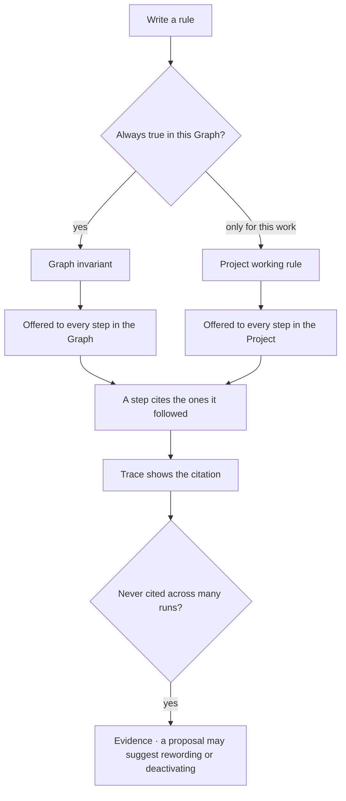

# Rules

One statement that is always true, offered to every step in its scope. **Invariants** belong to a
Graph; **working rules** belong to a Project.

| | |
|---|---|
| Index | [6.4](../../../README.md#6--skills) · Slice **S12b** |
| Module | [Skills](../spec.md) |
| API / CLI / Studio | 🔵 / — / 🔵 |
| Related | [authoring-a-skill](authoring-a-skill.md) · [objectives-and-criteria](../../work/features/objectives-and-criteria.md) |

> **As** someone whose domain has hard facts, **I want** them stated once and offered to every run,
> **so that** no agent has to be told twice that prices are in rupees.

## Capabilities

| # | Capability | Notes |
|---|---|---|
| C1 | One statement per rule | If it needs a paragraph, it is two rules |
| C2 | Two scopes | `invariant` on a Graph · `working` on a Project |
| C3 | A Project inherits its Graph's invariants | Read-only, shown as inherited |
| C4 | Offered discretely, with an id | So a step can cite the one it followed |
| C5 | Versioned | Editing publishes the next version; traces resolve to what was offered |
| C6 | Deactivate to stop | `active = false`; the versions and citations stay |
| C7 | Ordered | `order` decides the sequence in context, not importance |
| C8 | Cited, not enforced | A rule that must be enforced is an envelope bound or a criterion |

## Journey

## Seams

| Seam | What the user sees |
|---|---|
| A rule contradicting another | Not detected automatically — both are offered, and the trace shows which was cited |
| Deactivating a cited rule | Past citations resolve; nothing new is offered |
| A project with no rules | Inherits the Graph's invariants and says so |
| Long statement | Accepted, with a nudge that a rule reads better as one sentence |

## Surfaces

| Surface | Shape |
|---|---|
| Graph → Rules | One list, `+` in the header |
| Project panel → Working rules | A section, with inherited invariants above, greyed |
| Step row | The rules cited, linked to their statements |

## Engine

| Thing | Shape |
|---|---|
| `rules` | `scope` · `owner_id` · `kind` · `active` · `order` · `current_version_id` |
| `rule_versions` | `statement` · `published_at`, immutable |
| Assembly | graph invariants → project working rules, each with its id |
| Routes | `…/rules*` · `…/projects/{key}/rules*` |
| Events | `rule.created · published · activated · deactivated` |

## Surfaces, as drawn

On [Govern, Agents and Skills](https://claude.ai/artifact/VrdrR5iKGfqsjhCouQDTbc) — reconciled into this file before any of it is built.

| Surface | Shape | Artboard |
|---|---|---|
| The drawer | `Rules`, stacked under `Skills`: the statement itself is the row, with kind, scope and citation count under it | `RulesPanel` |
| An inactive rule | Dimmed in place with its past citations counted — deactivating is not deleting ([RU4](#decisions)) | `RulesPanel` |
| The page | The rule's fields, where it was cited, and **what is not a rule** — four statements, each placed where it belongs | `RulesPanel` |
| Scope | `invariant` on a Graph · `working` on a Project, with a Project's inherited invariants read-only | `RulesPanel` |

## Decisions

| # | Decision |
|---|---|
| RU1 | A rule is one statement. |
| RU2 | Scope is fixed: invariants on a Graph, working rules on a Project. |
| RU3 | Rules are offered discretely with ids, never concatenated. |
| RU4 | Rules are versioned; deactivation is not a version. |
| RU5 | A rule is offered and cited — never enforced. |

## Not building

| Not building | Because |
|---|---|
| Rules that execute or block | that is an envelope bound or a criterion |
| Contradiction detection | two rules in tension is a judgement, and the trace shows what was used |
| Rules on an agent | an agent carries bindings and bounds; rules describe the world |
