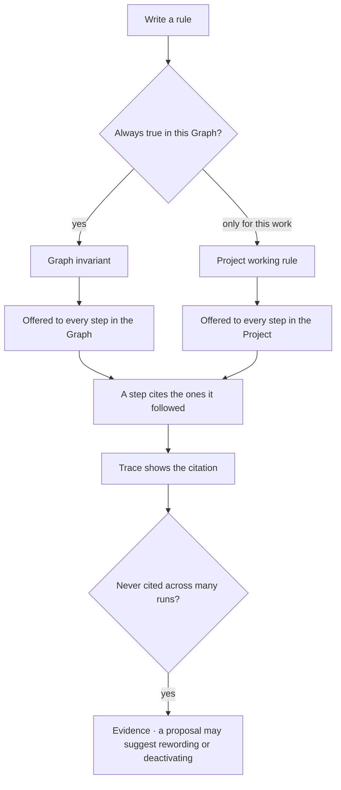

# Rules

One statement that is always true, offered to every step in its scope. **Invariants** belong to a
Graph; **working rules** belong to a Project.

| | |
|---|---|
| Index | [6.4](../../../README.md#6--skills) · Slice **S12b** |
| Module | [Skills](../spec.md) |
| API / CLI / Studio | ✅ / — / ✅ |
| Related | [authoring-a-skill](authoring-a-skill.md) · [objectives-and-criteria](../../work/features/objectives-and-criteria.md) |

> **As** someone whose domain has hard facts, **I want** them stated once and offered to every run,
> **so that** no agent has to be told twice that prices are in rupees.

## Capabilities

| # | Capability | Notes |
|---|---|---|
| C1 | One statement per rule | If it needs a paragraph, it is two rules |
| C2 | Two scopes | `invariant` on a Graph · `working` on a Project |
| C3 | A Project inherits its Graph's invariants | Read-only, shown as inherited |
| C4 | Offered discretely, with an id | So a step can cite the one it followed |
| C5 | Versioned | Editing publishes the next version; traces resolve to what was offered |
| C6 | Deactivate to stop | `active = false`; the versions and citations stay |
| C7 | Ordered | `order` decides the sequence in context, not importance |
| C8 | Cited, not enforced | A rule that must be enforced is an envelope bound or a criterion |

## Journey

## Seams

| Seam | What the user sees |
|---|---|
| A rule contradicting another | Not detected automatically — both are offered, and the trace shows which was cited |
| Deactivating a cited rule | Past citations resolve; nothing new is offered |
| A project with no rules | Inherits the Graph's invariants and says so |
| Long statement | Accepted, with a nudge that a rule reads better as one sentence |
| Clicking a statement in the **trace dialog** | The trace closes and the rule's board opens in its place ([RU13](#decisions)) — the citation chip reopens the trace where it was |
| A statement drawn where no board can open | It reads as text, not as a dead link ([RU13](#decisions)) |

## Surfaces

| Surface | Shape |
|---|---|
| Graph → Rules | One list, `+` in the header |
| Project panel → Working rules | A section of the project's **Details** tab, with the inherited invariants above it, greyed and read-only ([RU8](#decisions)) |
| Step row | The rules **offered**, each drawn as its statement, with the ones the step **cited** marked — the same two certainties as a skill ([RU12](#decisions)). A statement is the row, never an id, and clicking one opens that rule's board — beside the tree on the activity surface, in place of the dialog on the answer surface ([RU13](#decisions)). Drawn on the activity tree and in a step's trace detail |
| **The rule board** | `More`, drilled in, opens a `kind = rule` declared board: the statement, offered · cited · never cited, the row with its derived words, the versions with their own counts, and where each was cited ([RU11](#decisions)) |

## Engine

| Thing | Shape |
|---|---|
| `rules` | `graph_id` · `project_id?` · `active` · `order` · `current_version_id` — one axis ([RU6](#decisions)) |
| `rule_versions` | `rule_id` · `version` · `statement` · `published_at`, immutable |
| Derived | `scope` and `kind` are read off `project_id`, not stored |
| Assembly | graph invariants → project working rules, each with its id |
| Citations | `task_runs.rules_offered` · `rules_cited`, both `rule_version_id`s |
| A step's rules, read | `ActivityNode` and `TraceStep` each carry `rules_offered` · `rules_cited` as `{rule_id, statement}` — the version's wording, and the rule to open ([RU12](#decisions)) |
| Counts | `offered` · `total` over every version, and a `cited` count **per version**, all derived on read ([RU9](#decisions) · [RU10](#decisions)) |
| Routes | `…/rules*` · `…/projects/{key}/rules*` · `…/rules/{id}/citations` → `offered` · `total` · `versions` · `items` |
| Events | `rule.create` · `rule.publish` · `rule.activate` · `rule.deactivate` |

## Surfaces, as drawn

On [Govern, Agents and Skills](https://claude.ai/artifact/VrdrR5iKGfqsjhCouQDTbc) — reconciled into this file before any of it is built.

Four artboards — the page carries the whole feature.

| Surface | Shape | Artboard |
|---|---|---|
| The drawer | `Rules`, stacked under `Skills`: the statement itself is the row, with kind, scope, version and citation count under it | `RulesPanel` |
| An inactive rule | Dimmed in place with its past citations counted — deactivating is not deleting ([RU4](#decisions)) | `RulesPanel` |
| The page | The rule's fields, where it was cited, the row shape with `scope` and `kind` shown as **derived**, and **what is not a rule** — four statements, each placed where it belongs | `RulesPanel` |
| Authoring | One statement, the scope as a two-way choice, `order`, and the **nudge** that a long statement reads as two rules — accepted, never refused ([RU1](#decisions)) | `RuleAuthor` |
| Offered vs cited | `rules_offered` against `rules_cited` as four tiles — *never cited* is not *never offered* ([RU7](#decisions)) | `RuleCited` |
| Deactivating | The dialog says what stops (offering) and what stays (versions, citations) — one boolean, reversible | `RuleCited` |
| Scope | `invariant` on a Graph · `working` on a Project, with a Project's inherited invariants read-only, and the response's two lists | `RulesProject` |
| A project with none | Inherits its Graph's invariants and says so — an empty section is never an empty context | `RulesProject` |

## Decisions

| # | Decision |
|---|---|
| RU1 | A rule is one statement. |
| RU2 | Scope is fixed: invariants on a Graph, working rules on a Project. |
| RU3 | Rules are offered discretely with ids, never concatenated. |
| RU4 | Rules are versioned; deactivation is not a version. |
| RU5 | A rule is offered and cited — never enforced. |
| RU6 | **`project_id` is the only axis; `scope` and `kind` are derived from it.** [RU2](#decisions) fixes the pairing — an invariant is a Graph's, a working rule is a Project's — so storing `scope` *and* `kind` would be two columns that can disagree, and `scope='graph', kind='working'` would be representable and meaningless. A rule always belongs to a Graph (that is its cascade); a `project_id` is what makes it a working rule. Both words stay in the API and on the surface, read off the one column. |
| RU7 | **A step records what it was offered as well as what it cited.** `rules_offered` is a fact written by assembly; `rules_cited` is the model's own claim — the same two certainties as a skill, kept apart for the same reason. Without the first, *never cited* cannot be told from *never offered*, and the evidence loop in the journey has nothing to read. |
| RU8 | **A Project's working rules are a section of its Details tab, never a fifth tab.** The project drawer's four tabs each answer one question about the same todos — *what is there*, *what order*, *what happened*, *what it is* — and a rule that is always true of this work is part of what the project **is**, which is also where the project's own acts already live ([PT13](../../work/features/projects-and-tasks.md)). The section draws the response's two lists in **assembly order**: the Graph's invariants first, read-only and dimmed, then the project's own — because that is the order a step is given them in, and a section that ordered them any other way would be a third opinion about context nobody assembles. A project with no working rules still draws the inherited ones ([C3](#capabilities)): an empty section is never an empty context. |
| RU9 | **A rule says what it was offered, not only what cited it.** [RU7](#decisions) put the pair on the record and nothing ever read the first half: `task_runs.rules_offered` has been written since the statement migration and no response carried it, so *never cited* could not be told from *never offered* — which is the one distinction the evidence loop needs. The citations read now carries `offered` beside `total`, counted from the record on read like every other number here, and the surface draws **offered · cited · never cited**. Until a Graph has offers, the two derived tiles are **absent**: an absent tile says *we do not know*, and `0` would say *it was never offered*. |
| RU10 | **A citation count per version is counted by the engine; the surface adds nothing up.** The read returns a bounded, newest-first window of citing steps and a total over every version. Counting the per-version column off that window would be a total taken from a page wearing the label of a total over the record — the same mistake [usage](usage.md) names — and it would shrink every time somebody narrowed the window. So each version comes back with its own count beside its statement. Per-version *offers* are deliberately not sent: an offer is written against whatever version was current, so the split is a fact nothing on the surface asks for. |
| RU12 | **A step row draws the statements it was offered, marks the ones it cited, and links each to its rule.** [RU7](#decisions) put both halves on the record and only the second was ever read, so a step said *followed these two* and never *out of these six* — and a reader could not tell a rule that was ignored from one that was never in the prompt. The row draws **offered** and marks **cited**, exactly as a skill row draws offered and marks reported, because they are the same two certainties and a reader should not have to learn a second convention. Each item is the `rule_version_id`'s **statement** resolved by the engine — never an id, and never the rule's *current* wording, which would rewrite the trace the next time somebody edited the rule ([RU4](#decisions)) — carried beside the `rules.id` that `More` would open, since a board is bound to the rule and the statement belongs to one of its versions. A version whose rule is gone resolves to nothing and is dropped from the row rather than drawn as an id. |
| RU11 | **`More` opens the rule as a declared board, and the board reads.** The statement, the two counts, the versions and where each was cited are a page; the drawer stays the list of statements. Deactivating keeps its dialog in the drawer, because *what stops* and *what stays* is a consequence to read at the moment of the act ([RU4](#decisions)), and a reading surface that deactivated would put the module's only irreversible-looking gesture on the page people open to browse. Panel set: [skills-dashboards.md](../../../building-studio/skills-dashboards.md). |
| RU13 | **A statement links to its rule on every surface that draws one — and on the answer surface the act is *close the trace, then open the board*.** [RU12](#decisions) states the link without saying what it costs the surface it is drawn on, and the two surfaces differ: the activity tree is a panel and survives the act, the trace dialog is a modal and cannot — a board opened underneath it would be a page nobody can see. Dropping the link there instead would make the answer surface, the one place a reader is asking *why this answer*, the one place a rule cannot be reached, which is the opposite of what a trace is for. So the dialog dismisses itself and the rule's board opens in its place; the trace is one click away again on the same citation chip, and nothing was being edited to lose. **The host is reached through a context, not a prop**: the trace sits five components below anything that can open a page, and every one of them would be carrying a callback it has no use for — the same problem `Save report` already answers one level down ([B20](../../../building-engine/boards-migration.md#9-decisions)). The host publishes *open this board*; a surface that has one to open consumes it, and a surface mounted outside the host draws no link rather than a link that fails. |

## Not building

| Not building | Because |
|---|---|
| Rules that execute or block | that is an envelope bound or a criterion |
| Contradiction detection | two rules in tension is a judgement, and the trace shows what was used |
| Rules on an agent | an agent carries bindings and bounds; rules describe the world |
