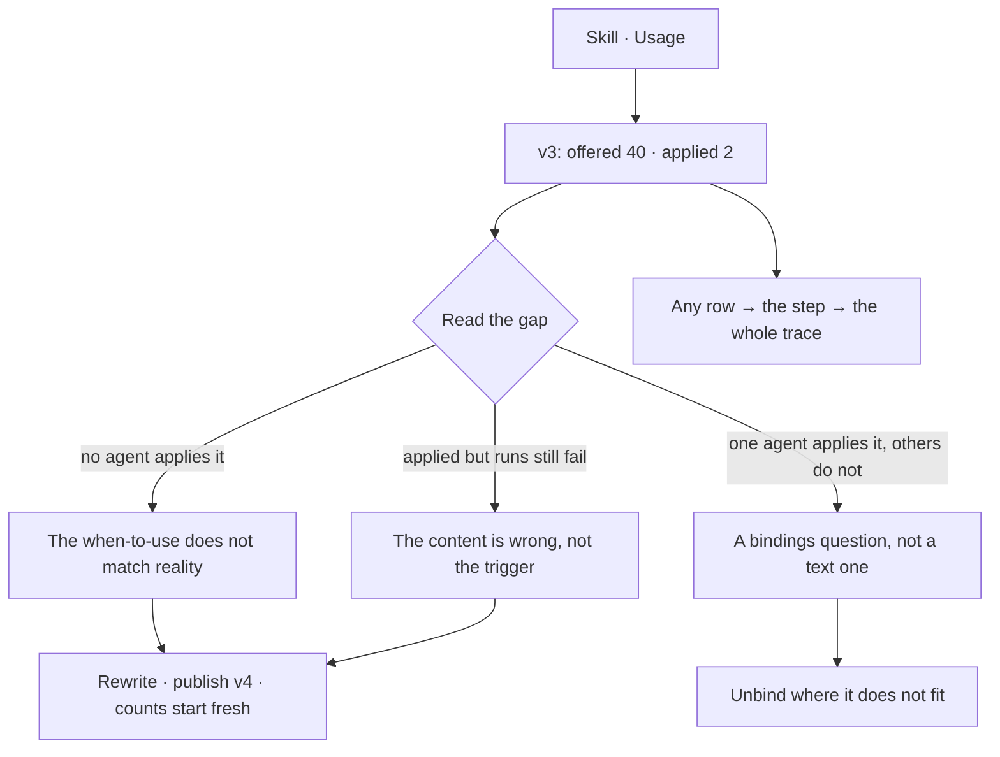

# Where a skill was used

Where a skill was **offered**, and where it was **reported applied**. The gap between the two is the
most useful number in the product.

| | |
|---|---|
| Index | [6.3](../../../README.md#6--skills) · Slice **S12c** |
| Module | [Skills](../spec.md) |
| API / CLI / Studio | ✅ / — / 🟡 |
| Related | [bindings](bindings.md) · [evidence](../../memory/features/evidence.md) · [proposals](../../memory/features/proposals.md) |

> **As** someone who wrote a skill, **I want** to know whether it is actually being used, **so that**
> I fix the ones that are ignored instead of writing more.

## Capabilities

| # | Capability | Notes |
|---|---|---|
| C1 | Offered count, per version | Every step that had it in context |
| C2 | Applied count, per version | Every step that reported using it |
| C3 | The gap, stated | Offered minus applied, as the headline |
| C4 | By agent | Which agents apply it and which never do |
| C5 | By outcome | Applied in runs that served, versus runs that did not |
| C6 | Down to the step | Every row links to the trace it came from |
| C7 | Feeds evidence | The same numbers a proposal cites |

## Journey

## Seams

| Seam | What the user sees |
|---|---|
| A new skill | No data yet, stated as such, not as a zero gap |
| A version just published | Counts start at zero for v4; v3's history stays |
| Purged window | Counts survive; the step links say the payload is gone |
| Applied but unciteable | Application is self-reported — the number is a claim, and the panel says so |

## Surfaces

| Surface | Shape |
|---|---|
| Skill → Usage | Offered · applied · gap, by version, then by agent |
| Step row | Skills offered and applied, in the trace |
| Evidence page | The same gaps across all skills, ranked |

## Engine

| Thing | Shape |
|---|---|
| Source | `task_runs.skills_offered` and `.skills_applied` — **`skill_version_id`s**, never bare skill ids ([US3](#decisions) · [SK19](authoring-a-skill.md#decisions)) |
| Derivation | counted on read from the record; no separate store |
| The counts | SQL over every step in the Graph, per version — not over the window the step list pages through. A total taken from a page is a different number wearing the same label |
| The step list | bounded, newest first, each row naming the version it read |
| Bindings | read from `skill_bindings` ([BN6](bindings.md#decisions)), not by scanning the roster |
| Routes | `GET …/skills/{id}/usage` |

## Surfaces, as drawn

On [Govern, Agents and Skills](https://claude.ai/artifact/VrdrR5iKGfqsjhCouQDTbc) — reconciled into this file before any of it is built.

| Surface | Shape | Artboard |
|---|---|---|
| **Usage** tab | `offered` · `applied` · the gap, for the current version, and how to read it | `SkillUsage` |
| The page | Four tiles, then per version, by agent, and by outcome — every row opening its runs | `SkillUsage` |
| Too few runs | Stated as *too few to read* in place of a percentage ([US3](#decisions)) | `SkillUsage` |
| Self-reported | Said on the surface, not implied away ([US4](#decisions)) | `SkillUsage` |

## Decisions

| # | Decision |
|---|---|
| US1 | Offered and applied are recorded separately on every step. |
| US2 | Usage is derived from the record, never accumulated in a counter. |
| US3 | Counts are per version. |
| US4 | Application is self-reported, and the surface says so. |
| US6 | **The engine sends counts and says whether they are readable; it never sends a percentage.** *Offered 3, applied 1* is not 33% — it is three runs. Every bucket carries `enough_to_read`, false below a floor the engine owns, so the API, the CLI and Studio all draw *too few to read* at the same point instead of each picking a threshold. A percentage computed on the surface would put that judgement in three places. |
| US5 | **Counts before versions existed are v1's.** The migration rewrites every historical step to name v1 ([SK19](authoring-a-skill.md#decisions)), so there is no unattributed bucket and no *before versions* row on the surface. |

## Not building

| Not building | Because |
|---|---|
| A quality score per skill | a score invites optimising the score |
| Verifying that a skill was really applied | the model's report is what exists; pretending otherwise is worse |
| Cross-Graph skill benchmarks | Graphs are not comparable |
