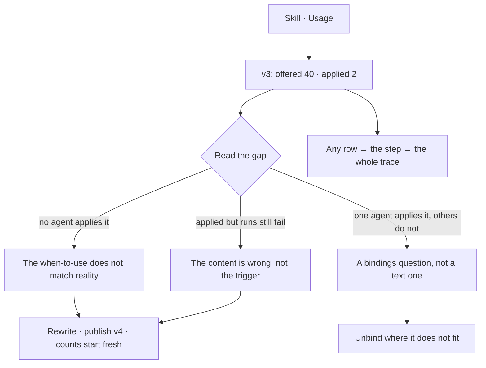

# Where a skill was used

Where a skill was **offered**, and where it was **reported applied**. The gap between the two is the
most useful number in the product.

| | |
|---|---|
| Index | [6.3](../../../README.md#6--skills) · Slice **S12c** |
| Module | [Skills](../spec.md) |
| API / CLI / Studio | ✅ / — / ✅ |
| Related | [bindings](bindings.md) · [evidence](../../memory/features/evidence.md) · [proposals](../../memory/features/proposals.md) |

> **As** someone who wrote a skill, **I want** to know whether it is actually being used, **so that**
> I fix the ones that are ignored instead of writing more.

## Capabilities

| # | Capability | Notes |
|---|---|---|
| C1 | Offered count, per version | Every step that had it in context |
| C2 | Applied count, per version | Every step that reported using it |
| C3 | The gap, stated | Offered minus applied, as the headline |
| C4 | By agent | Which agents apply it and which never do |
| C5 | By outcome | Applied in runs that served, versus runs that did not |
| C6 | Down to the step | Every row links to the trace it came from |
| C7 | Feeds evidence | The same numbers a proposal cites |

## Journey

## Seams

| Seam | What the user sees |
|---|---|
| A new skill | No data yet, stated as such, not as a zero gap |
| A version just published | Counts start at zero for v4; v3's history stays |
| Purged window | Counts survive; the step links say the payload is gone |
| Applied but unciteable | Application is self-reported — the number is a claim, and the panel says so |

## Surfaces

| Surface | Shape |
|---|---|
| Skill → Usage | Offered · applied · gap, by version, then by agent |
| Step row | Skills offered and applied, in the trace |
| Evidence page | The same gaps across all skills, ranked |
| **The Usage board** | `More` on the Usage tab opens a `kind = skill_usage` declared board: the tiles, per version, by agent, by outcome, the bounded step list, and the four readings of a gap ([US7](#decisions) · [US8](#decisions)) |

## Engine

| Thing | Shape |
|---|---|
| Source | `task_runs.skills_offered` and `.skills_applied` — **`skill_version_id`s**, never bare skill ids ([US3](#decisions) · [SK19](authoring-a-skill.md#decisions)) |
| Derivation | counted on read from the record; no separate store |
| The counts | SQL over every step in the Graph, per version — not over the window the step list pages through. A total taken from a page is a different number wearing the same label |
| The step list | bounded, newest first, each row naming the version it read |
| Bindings | read from `skill_bindings` ([BN6](bindings.md#decisions)), not by scanning the bindings |
| The floor | `MIN_OFFERS_TO_READ = 5` in `runtime/managers/skill_usage.py` — one constant behind every `enough_to_read` ([US6](#decisions)) |
| `by_outcome` | keyed by the **run's** outcome — `answered` · `cannot_answer` · `failed` · `cancelled` — for the current version only |
| Routes | `GET …/skills/{id}/usage` → `versions` · `by_agent` · `by_outcome` · `used_by` · `recent_steps` |

## Surfaces, as drawn

On [Govern, Agents and Skills](https://claude.ai/artifact/VrdrR5iKGfqsjhCouQDTbc) — reconciled into this file before any of it is built.

Four artboards — the page carries the whole feature.

| Surface | Shape | Artboard |
|---|---|---|
| **Usage** tab | `offered` · `applied` · the gap, for the current version, and how to read it | `SkillUsage` |
| The page | Four tiles, then per version, by agent, and by run outcome — every row opening its runs | `SkillUsage` |
| Per version | Every published version with `offered · applied · gap · enough_to_read`, and the publish dates that started each count | `UsageVersions` |
| The migration | `v1` carries every step from before versions existed, and there is no *before versions* bucket ([US5](#decisions)) | `UsageVersions` |
| The readings | By agent, the bounded step list, and the four readings — each naming the move it implies: unbind, rewrite `when_to_use`, rewrite the content, or leave it | `UsageReadings` |
| Too few runs | Stated as *too few to read* in place of a percentage ([US6](#decisions)) | `UsageSeams` |
| No data yet | A skill nothing has been offered reads `0 · 0 · —`, never a gap of zero | `UsageSeams` |
| Self-reported | Said on the surface, not implied away ([US4](#decisions)) | `UsageSeams` |

## Decisions

| # | Decision |
|---|---|
| US1 | Offered and applied are recorded separately on every step. |
| US2 | Usage is derived from the record, never accumulated in a counter. |
| US3 | Counts are per version. |
| US4 | Application is self-reported, and the surface says so. |
| US6 | **The engine sends counts and says whether they are readable; it never sends a percentage.** *Offered 3, applied 1* is not 33% — it is three runs. Every bucket carries `enough_to_read`, false below a floor the engine owns, so the API, the CLI and Studio all draw *too few to read* at the same point instead of each picking a threshold. A percentage computed on the surface would put that judgement in three places. |
| US5 | **Counts before versions existed are v1's.** The migration rewrites every historical step to name v1 ([SK19](authoring-a-skill.md#decisions)), so there is no unattributed bucket and no *before versions* row on the surface. |
| US7 | **The Usage board is addressed by the skill, and the version is a view on it.** One read returns every published version ([US3](#decisions)), and the page's whole job is reading one count against the next — so a board per version would be seven boards each holding a seventh of one reading, and moving between them would open a tab. `subject_id` is the skill's id; the version rides the spec's segmented action, and the tiles redraw. What the surface still may never do is add versions together: 2,786 offers across seven texts is a number drawn nowhere. |
| US8 | **The four readings of a gap are a band on the board, not help text.** A gap is only worth drawing if the reader knows which of four sentences it is — the wrong agent, the wrong trigger, the wrong content, or a playbook that fits — and each names a different move: unbind, rewrite `when_to_use`, rewrite the playbook, leave it alone. The table is the same on every skill, which is the argument *for* drawing it: a reading guide behind a hover is a guide nobody reads, and a number nobody can read is a number that invites a score. Panel set: [skills-dashboards.md](../../../building-studio/skills-dashboards.md). |
| US9 | **Both `—` states are drawn with their caption, and neither is ever `0`.** A skill nothing has been offered reads `0 · 0 · —` under *no data yet*; a bucket below the floor reads its counts with the gap as `—` under *too few to read*. They look alike on purpose — neither is a statistic — and the caption is the only thing that tells them apart, so it is never dropped for space. A gap of `0` would read as *applied every time*, which is the one claim an absent record must not make. |

## Not building

| Not building | Because |
|---|---|
| A quality score per skill | a score invites optimising the score |
| Verifying that a skill was really applied | the model's report is what exists; pretending otherwise is worse |
| Cross-Graph skill benchmarks | Graphs are not comparable |
