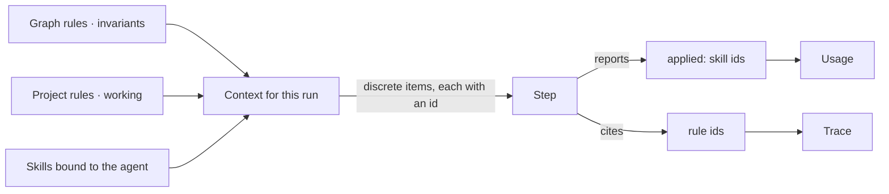
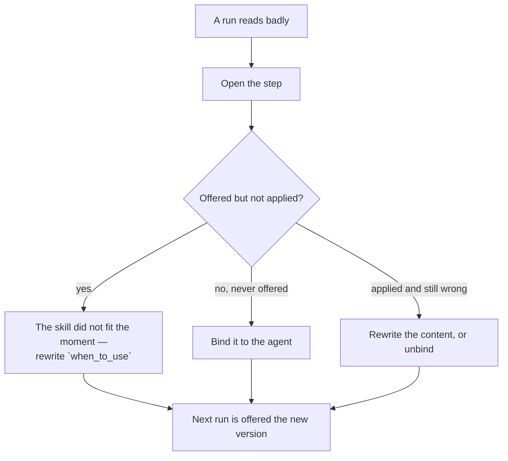

# Skills — module spec

What a run is **given** before it runs. Two kinds, one mechanism: a **skill** is a playbook that
may be offered, a **rule** is a statement that is always true. Both are authored once, reused
everywhere, and reach a step as discrete items with ids — so a step can report which it applied and a
trace can name them.

> ⚠ **Rewritten for [orchestration § 0](../../orchestration.md#0-the-records)** — `Todo` · `TaskPlan` ·
> `Task` · `TaskRun` · `Lens`. The words *Thought*, *Thinking* and *Step-as-a-record* are retired, and
> **`Task` now names a node inside a plan**, never a thing a user authored. Migration:
> [task-model-migration.md](../../building-engine/task-model-migration.md).

| | |
|---|---|
| Index | [§6 · Skills](../../README.md#6--skills) |
| Features | [authoring-a-skill](features/authoring-a-skill.md) · [bindings](features/bindings.md) · [usage](features/usage.md) · [rules](features/rules.md) |
| Depends on | — (authored against a Graph, before any agent exists) |
| Depended on by | [Agents](../agents/spec.md) (binds them) · [Ask](../ask/spec.md) (assembles them) · [Work](../work/spec.md) (project rules) |

## 1. Vocabulary

Product-wide words: [terminology.md](../../terminology.md). What this module adds:

| Noun | Is | Is not |
|---|---|---|
| **Skill** | a named playbook with a "when to use" — offered to a step | an instruction the agent must obey |
| **Rule** | a statement that is always true in its scope | a skill |
| **Offered** | present in the step's context, with an id | applied |
| **Applied** | the step reported using it | proof it was used well |
| **Binding** | which agent may be offered which skill | a permission |

## 2. Offered, not obeyed

The distinction the whole module rests on:

| | Skill | Rule |
|---|---|---|
| Shape | a playbook — how to approach something | one statement — what is true |
| Scope | bound to agents | `invariant` on a Graph · `working` on a Project |
| At run time | offered to a step, which may use it | offered to every step in scope |
| Recorded | offered / reported applied, per step | cited by the steps that used it |
| Authored by | a person | a person |

**Neither is enforced.** A skill the model ignores leaves a gap between *offered* and *applied*, and
that gap is the signal a person acts on — by rewriting the skill, or by unbinding it. A rule that must
be enforced is not a rule; it is an envelope bound ([Agents](../agents/spec.md)) or a criterion
([Work](../work/spec.md)).

## 3. What this module owns

| Owns | Shape |
|---|---|
| `skills` | `graph_id` · `name` (unique per Graph) · `current_version_id` |
| `skill_versions` | `skill_id` · `version` · `description` · `content` · `when_to_use` · `published_at` — immutable once published |
| `agent_skills` | `agent_id` · `skill_id` — the binding follows the current version |
| `rules` | `scope (graph\|project)` · `owner_id` · `kind (invariant\|working)` · `active` · `order` · `current_version_id` |
| `rule_versions` | `rule_id` · `version` · `statement` · `published_at` — immutable once published |
| Usage | derived: every step that was offered a skill *version*, and whether it reported applying it |

### Versions

**Version what is offered.** A skill and a rule both reach a step as context, and a trace has to say
what the step was given — not what the text says today.

| Rule | Detail |
|---|---|
| A published version is immutable | Editing publishes the next version; the previous one keeps resolving |
| A step records the version it was offered | `skill_version_id` · `rule_version_id`, never the bare id |
| A binding points at the skill, not a version | An agent gets the current version at run time — bindings do not pin |
| Evidence is per version | "Offered 40, applied 2" is a claim about v3, and v4 starts its own count |
| Deactivating is not a version | `active = false` stops a rule being offered; the versions stay |

## 4. How they reach a step

| Assembly rule | Detail |
|---|---|
| Order is fixed | graph rules → project rules → criteria in scope → the agent's skills |
| Nothing is concatenated | each arrives as its own item, so it can be cited, counted and diffed |
| A skill is offered only if bound | an unbound skill exists but never reaches a step |
| An inactive rule is not offered | deactivating is how a rule stops applying, without deleting the record |

## 5. Editing what an agent knows

The loop this module exists to serve:

Every edit is an event, so the change and its effect sit in the same history.

## 6. Cross-feature decisions

| # | Decision |
|---|---|
| S1 | Skills are offered, never forced. Application is self-reported and recorded per step. |
| S2 | Rules are discrete statements with ids, never a concatenated block. |
| S3 | A skill reaches a step only through a binding on the agent. |
| S4 | Rule scope is fixed: invariants on a Graph, working rules on a Project. Nothing else has rules. |
| S5 | Deactivate rather than delete — usage and traces must stay resolvable. |
| S6 | Neither skills nor rules are enforcement. Enforcement is an envelope bound or a criterion. |

## 7. Deliberately absent

| Not built | Because |
|---|---|
| Skill priority or ordering | a skill is offered or it is not; ranking implies enforcement |
| Automatic skill selection by embedding | `when_to_use` is written by a person and is auditable |
| Rules that execute | a rule is offered to a run; it does not fire |
| Agent memory that writes its own skills | edits stay human-reviewed, on evidence |
| Cross-Graph skill sharing | portability is a later question, and belongs with domain models |
