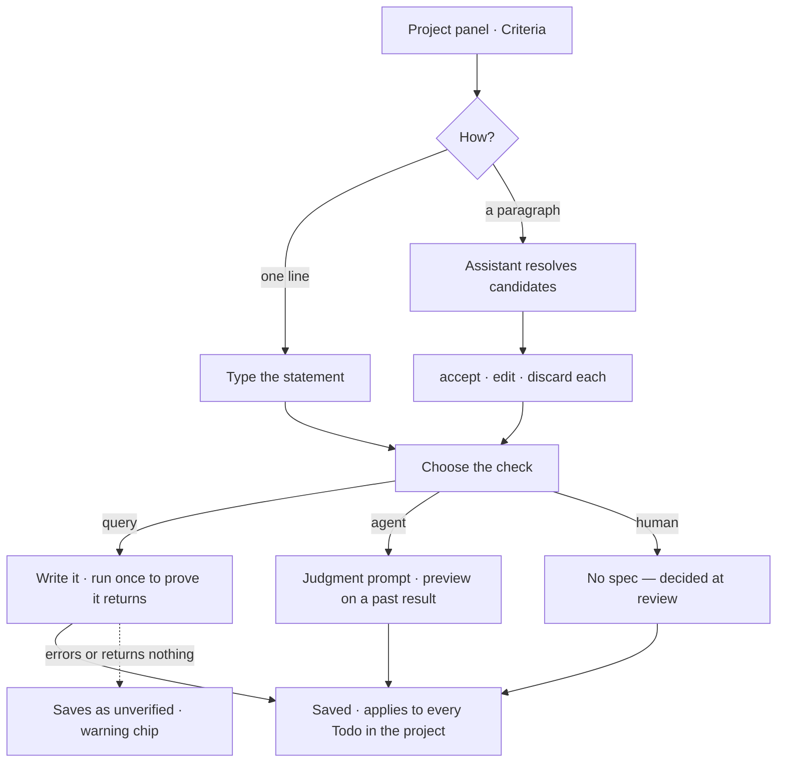
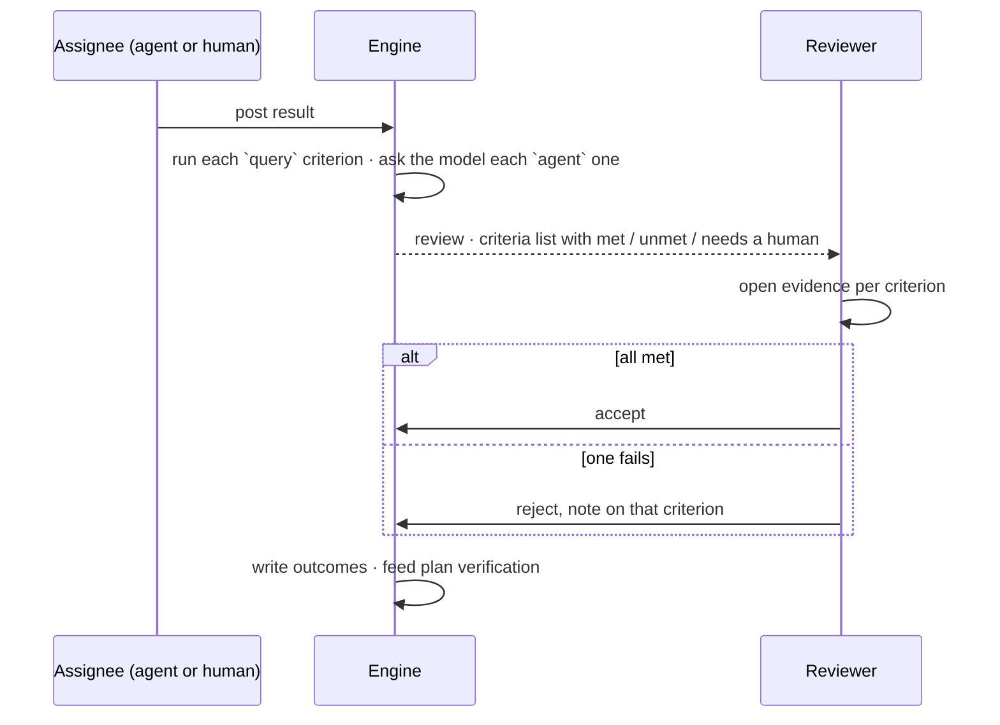
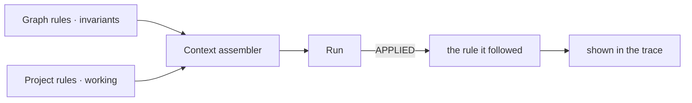

# Objectives and criteria

Goals and "done" as **nodes**, not paragraphs — so an agent can cite one, a check can prove one, and a
reviewer sees which one failed.

> ⚠ **Rewritten for [orchestration § 0](../../../orchestration.md#0-the-records)** — `Todo` · `TaskPlan` ·
> `Task` · `TaskRun` · `Lens`. The words *Thought*, *Thinking* and *Step-as-a-record* are retired, and
> **`Task` now names a node inside a plan**, never a thing a user authored. Migration:
> [task-model-migration.md](../../../building-engine/task-model-migration.md).

| | |
|---|---|
| Index | [9.2](../../../README.md#9--work) · Slice **S12b** |
| Module | [Work](../spec.md) |
| API / CLI / Studio | 🔵 / — / 🔵 |
| Depends on | [projects-and-tasks](projects-and-tasks.md) · [rules](../../skills/features/rules.md) |

> **As** the person accountable for a project, **I want** its goal and its "done" written as statements
> an agent can cite and a check can prove, **so that** accepting work is a judgement about named
> criteria — and a rejection says which one failed, instead of that something felt wrong.

## Capabilities

| # | Capability | Notes |
|---|---|---|
| C1 | An objective is one statement on a **Project** | No prose body — if it needs a paragraph it is two objectives |
| C2 | A criterion states **how it is checked** | `query` · `agent` · `human`; no check = refused at save |
| C3 | A criterion may measure an objective, or stand alone | `MEASURED_BY` is optional |
| C4 | A **Todo inherits** its project's criteria, read-only | By reference, never copied — editing the project's changes what open Todos are judged by |
| C5 | A Todo may add its own criteria | Narrowing is adding, never editing an inherited one |
| C6 | A Todo may have **none** | Criteria are optional; description-only Todos still work |
| C7 | Acceptance is per-criterion, with evidence | Row set · run · note; replaces the prose `acceptance` field |
| C8 | A rejection attaches to the criterion that failed | Turns "no" into a specific next instruction |
| C9 | Paste a paragraph → **candidate nodes** | The assistant resolves; the user accepts, edits or discards |
| C10 | Rules split by scope | Graph = invariants (always true) · Project = working rules |

## Journeys

### J1 — Give a project its criteria

### J2 — Accept a Todo against them

### J3 — A rule an agent can cite

## Seams

| Seam | What the user sees |
|---|---|
| A project with none | "No criteria yet — a Todo here is accepted by eye." Not an error |
| A check that never verified | An amber chip on the criterion. It still reaches review; a human decides it |
| A pasted paragraph that resolves to nothing | Said plainly, with the text left where it was |
| A `query` check that errors at review | The criterion reads **needs a human**, with the error under it — never *unmet* |
| An `agent` check the model will not judge | The same, with the prompt it was given, so the reviewer can see what was asked |
| A criterion edited while a Todo sits in review | Recorded outcomes keep the statement they judged; anything unjudged uses the new one |
| Every criterion met | Accept is still one deliberate action. Nothing is accepted automatically |
| A Todo with no criteria | Accept and reject stay available; the review says it is being taken on trust |
| A member without access | Reads criteria and outcomes; cannot add, edit or accept |

## Surfaces

| Surface | Route | Shape (the panel-composition rules) |
|---|---|---|
| Graph rules | `/u/:username/:graphSlug/rules` | one list · `+` in the header |
| Project objectives · criteria · rules | project panel | three `PanelStack` sections · `+ add` each |
| Todo criteria | Todo **Work** tab | *Inherited* (greyed) then *This Todo* |
| Acceptance | the review step | criterion · outcome · evidence |

## Engine

| Thing | Shape |
|---|---|
| `rules` | `scope (graph\|project)` · `owner_id` · `statement` · `kind` · `active` · `order` |
| `objectives` | `project_id` · `statement` · `status (open\|met\|dropped)` · `order` |
| `criteria` | `scope (project\|Todo)` · `owner_id` · `objective_id?` · `statement` · `check` · `check_spec` · `revision` |
| `criterion_outcomes` | `criterion_id` · `criterion_revision` · **`statement_at_check`** · `todo_id` · `state` · `evidence` · `checked_by_*` |
| Routes | `…/rules*` · `…/projects/{key}/{objectives,criteria,rules}` · `…/todos/{id}/{criteria,outcomes}` |
| Events | `rule.*` · `objective.*` · `criterion.*` · `criterion.evaluated` |
| Migration | Old prose lands as one node, `check = human`, `needs_split = true` — nothing dropped |

## Decisions

| # | Decision |
|---|---|
| D1 | Objectives and success criteria belong to a **Project**. A Graph is a bounded domain; it has no goals of its own — the `graphs.objectives` and `graphs.success_criteria` columns that predate this are dropped in migration `000000000036`, along with the two fields the settings form offered for them. `graphs.instructions` is not one of these: it is standing guidance the runtime hands to the LLM, and it lives on the Agents tab of the settings panel. |
| D2 | A Graph carries **rules** — domain invariants, true whatever runs. A Project inherits them. |
| D3 | A Project carries its own working rules, objectives and success criteria. |
| D4 | Every criterion declares how it is checked: `query` · `agent` · `human`. One without a check is refused at save. |
| D5 | A Todo inherits its project's criteria by reference, may add its own, and may have none. |
| D6 | Acceptance is per-criterion, with evidence. There is no prose acceptance field. |
| D7 | A rejection attaches to the criterion that failed, not to the Todo alone. |
| D8 | These are nodes in Invana's own store. Nothing is written into the connected database. |
| D9 | Prose is an input, not a storage shape: a pasted paragraph resolves into candidate nodes the user accepts or edits. |
| D10 | A criterion carries a `revision`, not a version chain; the outcome snapshots the statement it judged. |
| D11 | A check that cannot run is **needs a human**, never *unmet*. An unmet criterion is a finding about the work; a broken check is a finding about the check. |

## Constraints this puts on the rest of the product

| Constraint | Where it bites |
|---|---|
| The context assembler offers rules as **discrete items with ids** | a run can cite the rule it applied; a concatenated blob cannot |
| `accept` carries per-criterion outcomes | plan verification gets a specific signal, not a binary one |
| Criteria are optional | a Todo with a title and a body is still a Todo; nothing gates Todo creation |
| Editing a project criterion changes open Todos | inheritance is by reference — that is the intent, not a bug |

## Deliberately absent

| Not built | Because |
|---|---|
| Per-criterion waivers with a reason | a waiver is a policy decision; the product has no policy layer |
| Editing an inherited criterion inside a Todo | narrowing is adding a Todo-local criterion |
| Weights, scores, pass thresholds | a criterion is met or it is not |
| Criteria on a Graph | a Graph states invariants; goals live with work |
| Writing any of this into the connected database | the read-only promise for sources holds without exception |

## Open

| # | Question |
|---|---|
| Q1 | Does a `query` criterion re-run on every result, or on request? |
| Q2 | Is an objective closable by hand, or only derived from its criteria? |
| Q3 | Do rules need priority, or is `order` enough? |
| Q4 | ~~A project criterion changes while Todos sit in review~~ — settled: recorded outcomes keep their snapshot; unjudged Todos use the new statement. |
