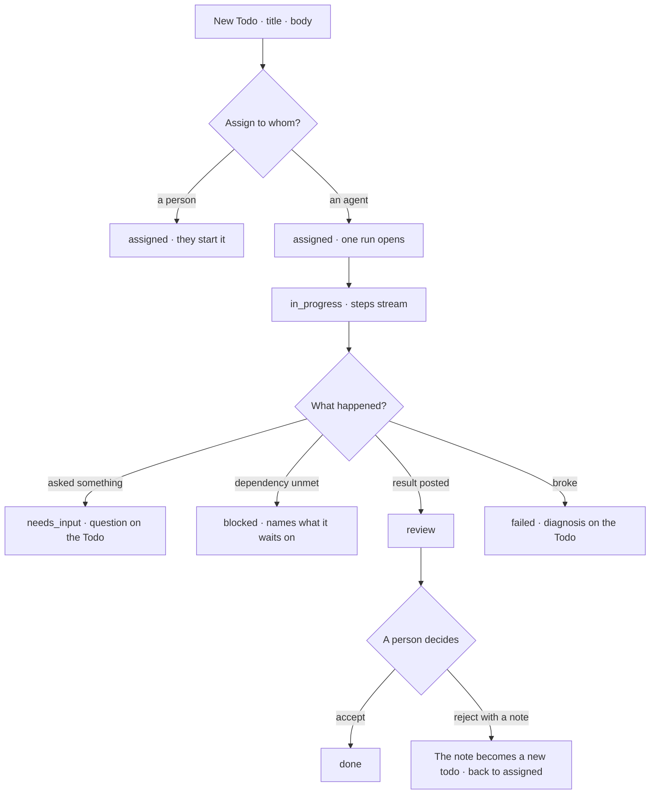
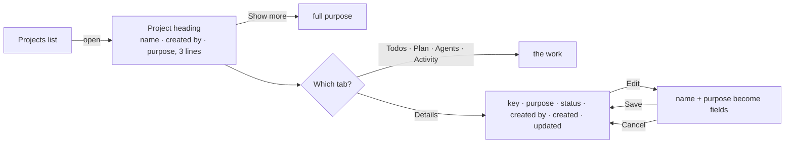

# Projects and Todos

> ⚠ **Rewritten for [orchestration § 0](../../../orchestration.md#0-the-records).** What this file
> used to call a *Task* is a **Todo**; `Task` now names a node inside a TaskPlan. A Todo has no
> `status` column — state derives from its runs. Migration:
> [task-model-migration.md](../../../building-engine/task-model-migration.md).

Write a Todo, assign it to a person or an agent, watch it run, accept the result. Dependencies give a
derived order — nobody maintains a plan by hand.

| | |
|---|---|
| Index | [9.1](../../../README.md#9--work) · Slice **S12b** |
| Module | [Work](../spec.md) |
| API / CLI / Studio | 🟡 / — / 🟡 |
| Related | [objectives-and-criteria](objectives-and-criteria.md) · [review](review.md) · [author-an-agent](../../agents/features/author-an-agent.md) |

> **As** someone with work to get done, **I want** to write it once and hand it to whoever should do
> it — person or agent — **so that** the same board tracks both.

## Capabilities

| # | Capability | Notes |
|---|---|---|
| C1 | A project is a folder of Todos in a Graph | A Todo may also live outside one |
| C2 | Assign to a person **or** an agent | The same field; principals, not two systems |
| C3 | Assignment opens exactly one root run | `triggered_by = task`, on behalf of the assigner |
| C4 | Sub-Todos nest | Bounded by the envelope, checked when a run opens — not by a fixed constant. An agent may create them for its own fan-out |
| C5 | Dependencies with a condition | `success · failure · any_outcome` |
| C6 | Derived order | Waves, `blocked_by[]`, critical path — computed, never typed |
| C7 | Cycles are refused | With the loop named |
| C8 | Staffing is a default, not a grant | It fills the assignee picker; membership is the permission |
| C9 | An agent never accepts its own work | It posts a result; a person accepts |
| C10 | A project states its own facts | Purpose, who wrote it, when — on the **Details** tab, in the detail's heading |
| C11 | Its name and purpose are editable in place | Key, creator and timestamps are facts, not fields |
| C12 | Archiving is reversible | **Unarchive** sits where **Archive** was; `project.unarchive` is its own event |

## Journey

## Seams

| Seam | What the user sees |
|---|---|
| Unassigned | `open`, and the picker explains staffing |
| The agent is paused | `blocked`, naming the agent, with reassign offered |
| A dependency fails | Dependents with `on: success` state why they will not run |
| Sub-Todos still open | The parent stays `in_progress`, listing them |
| Cancelled parent | Children cancel with it, and say so |
| No purpose written | The heading drops the paragraph; **Details** says *No purpose written yet* and offers Edit |
| Archived project | **Details** shows its fields read-only, and the footer offers **Unarchive** — archiving freezes the folder, it does not end it. The list row carries a muted `archived` badge beside the name |
| Creator deleted | `created by` falls back to *unknown*, never a bare id |

## Surfaces

| Surface | Shape |
|---|---|
| **Projects** panel | The one `leftNav` item for work a person wrote. List → detail, the detail being tabs — `Todos · Plan · Activity · Details`; creating in the header. The *No project* bucket is a row in the list, so an unfiled Todo is never unreachable |
| Project heading | The first band of the detail: the name as a heading, `created by · created`, then the purpose clamped to three lines with **Show more**. No second back-link — the panel breadcrumb is the way out |
| **Details** tab | Rightmost, and the only place a project is *acted on*: `key · purpose · status · created by · created · updated`, with `Edit` → `Save`/`Cancel` over name and purpose, and `Archive` / `Unarchive` under them |
| Staffed strip | Who is on the project, under the Todos it is derived from — chips, and an agent's chip opens that agent |
| Todo detail | Inside the Projects panel, behind the breadcrumb — tabs `Work · Activity · Runs`; the decision bar at the bottom. `Runs` is [10.5](../../operate/features/see-what-ran.md)'s journal filtered to one `todo_id` |
| Plan canvas | Cards in waves; drag card → card writes a dependency |

## Engine

| Thing | Shape |
|---|---|
| `projects` · `project_assignments` | key, name, description, status, `created_by_*`; staffing by principal |
| `ProjectRead.created_by_name` | Resolved from `created_by_id` in one query per list — the panel never asks per row |
| `PATCH …/projects/{key}` `status` | `archived` ⇄ `active`; emits `project.archive` one way and `project.unarchive` the other |
| `todos` | project, parent, title, body, assignee principal, due, `lens_id?`, `closed_at?`, `outcome?`. **No `status`** — it derives from the Todo's runs ([Work §3](../spec.md)) |
| `todo_dependencies` | `on (success\|failure\|any_outcome)`, cycles rejected |
| Derived | `wave` · `blocked_by[]` · `critical_path` |
| Routes | `…/projects*` · `…/todos*` · `/start · /result · /accept · /reject · /cancel` · `GET …/projects/{key}/plan` |
| Events | `Todo.created · assigned · started · result_posted · accepted · rejected · blocked` |

## Decisions

| # | Decision |
|---|---|
| PT1 | People and agents are both principals; one assignee field. |
| PT2 | One assignment opens exactly one root run. |
| PT3 | An agent never marks its own Todo done. |
| PT4 | Order is derived from dependencies, never maintained by hand. |
| PT5 | Cycles are refused, naming the loop. |
| PT6 | Staffing is a default; Graph membership is the permission. |
| PT7 | **Projects owns Todos; there is no Todos icon.** A Todo without its project is a to-do list, and the project is the thing it is for — so the list lives under Projects with a *No project* bucket, and the rail's **Tasks** icon is execution only ([G30](../../../building-studio/graph-detail-page.md)). The word *Tasks* in the rail therefore names `TaskRun`s, `TaskPlan`s and the catalogue, never Todos ([SR3](../../operate/features/see-what-ran.md)). |
| PT8 | **The detail leads with the project, not with the way back.** The name is a heading, the panel breadcrumb is the only *Projects* link, and the second `← Projects` row is gone — two back-links on one screen is one too many, and the row cost the title its place. |
| PT9 | **The purpose is clamped to three lines with *Show more*.** A project's purpose is the thing every agent plans from, so it sits above the tabs where it is always read; three lines is what a panel can spare before the Todos disappear. |
| PT10 | **Details is the only editing surface, and it edits in place.** Name and purpose are fields behind `Edit`; key, creator and timestamps are facts. A dialog over a 400px panel hides the thing being edited. |
| PT11 | **Archiving is reversible, and the two directions are separate events.** `Unarchive` occupies the footer slot `Archive` had, so the control that froze a project is the control that thaws it — the word is the one the Graph already uses, not a second one for the same act. The record says `project.archive` or `project.unarchive`, never a bare `project.update`: a folder of work being reopened is a fact someone will look for. |
| PT12 | **A project's state rides on its name, not in its meta line.** The list row carries a muted `archived` badge beside the title; the subtitle stays counts. A state folded into a sentence of counts is read last, and archived is the thing that changes what the row means. |
| PT13 | **The detail has no footer.** A row of buttons under every tab acted on four different things — a new Todo, a dependency, staffing, the project itself — none of which the tab above it was showing. Each moved to where its subject is: a Todo is written in the Todos panel, a dependency is drawn on the Plan canvas, and `Archive` / `Unarchive` sit in **Details** with the rest of the project's own state. |
| PT15 | **Projects is a stack of two drawers, `Projects` over `Todos` — the same shape Tasks takes ([G33](../../../building-studio/graph-detail-page.md)).** It is how PT7 is built: with no project drilled into, the Todos drawer is **every Todo in the Graph**, and that *is* the *No project* bucket — a Todo nobody filed is still work somebody wrote, so it needs no separate list and no pseudo-project to live in. Drill into a project and the drawer narrows to its Todos while the projects list keeps its place above, so reading a Todo against the project it serves costs a glance rather than a click back. A Todo's own detail replaces the **Todos** drawer's body, never the panel: `&todo=` is the drill-in key and `&project=` is the one above it ([G35](../../../building-studio/graph-detail-page.md)). |
| PT14 | **Agents is not a tab.** "Who is on this?" is answered by the Staffed strip under the Todos, where the assignments it is derived from are visible; a tab of its own restated the same list one click away and made the strip look like a summary of somewhere else. |

## Not building

| Not building | Because |
|---|---|
| Roles and per-project permissions | membership is binary |
| A swimlane board per assignee | the Plan canvas answers "what is next" better |
| Manual ordering that overrides dependencies | two sources of order is one too many |
| Time tracking and estimates | the record already holds what things actually cost |
