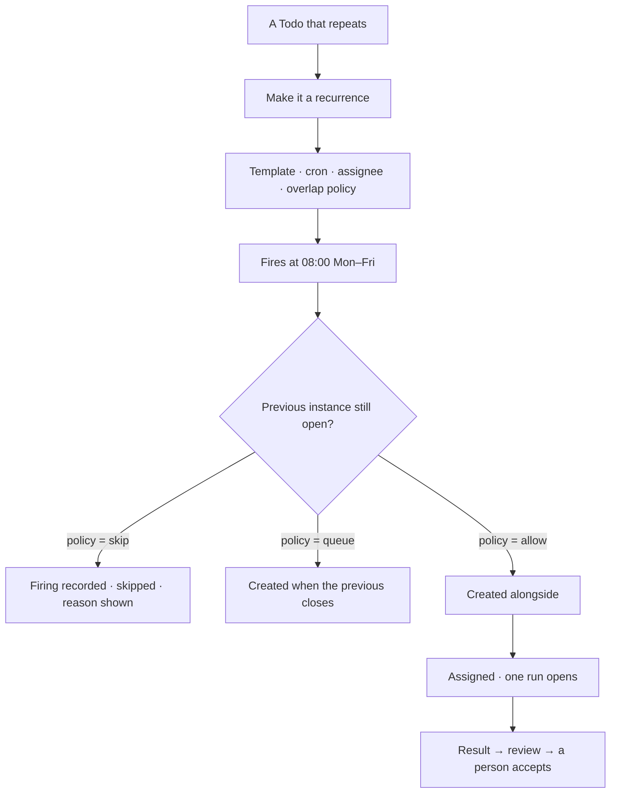
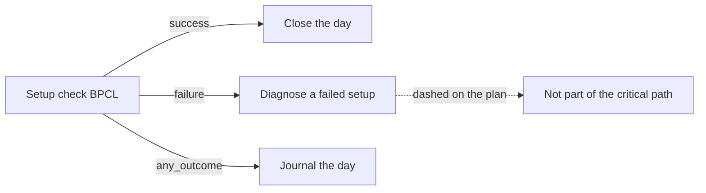

# Recurring Todos and conditions

A Todo template on a cron, and dependencies that fire on failure as well as success — so the work that
happens every day opens itself, and the work that only matters when something breaks has a way to say
so.

> ⚠ **Rewritten for [orchestration § 0](../../../orchestration.md#0-the-records)** — `Todo` · `TaskPlan` ·
> `Task` · `TaskRun` · `Lens`. The words *Thought*, *Thinking* and *Step-as-a-record* are retired, and
> **`Task` now names a node inside a plan**, never a thing a user authored. Migration:
> [task-model-migration.md](../../../building-engine/task-model-migration.md).

| | |
|---|---|
| Index | [9.4](../../../README.md#9--work) · Slice **S12e** |
| Module | [Work](../spec.md) |
| API / CLI / Studio | 🔵 / — / 🔵 |
| Related | [projects-and-tasks](projects-and-tasks.md) · [schedules](../../operate/features/schedules.md) |

> **As** someone whose day starts the same way every day, **I want** the Todo to be waiting for me,
> **so that** the routine part is not a thing I have to remember to type.

## Capabilities

| # | Capability | Notes |
|---|---|---|
| C1 | A Todo template plus a cron | Title pattern, body, project, assignee, criteria |
| C2 | Each firing creates a **new** Todo | Not a reopened one — history stays per occurrence |
| C3 | A person still accepts | Recurrence automates the creating, never the accepting |
| C4 | Overlap policy | `skip · queue · allow`, stated on the schedule |
| C5 | A skipped firing is recorded | With its reason; nothing vanishes |
| C6 | Placeholders in the title | `Trade day {date}` — resolved at firing |
| C7 | Conditional dependencies | `on: success · failure · any_outcome` |
| C8 | Failure edges do not inflate the critical path | They are contingency, not sequence |
| C9 | A dependent of a failed Todo gets a reason | Instead of sitting silently blocked |

## Journeys

### Recurrence

### Conditions

## Seams

| Seam | What the user sees |
|---|---|
| Instance still open at the next firing | The policy decides, and the firing is listed either way |
| A recurrence paused | Firings stop; existing instances are untouched |
| Template edited | Future instances use it; open ones keep what they were created with |
| A failure branch that never runs | Shown as never triggered, not as blocked |
| Cron that would fire in the past | Refused at save, with the next valid time shown |

## Surfaces

| Surface | Shape |
|---|---|
| Schedules | Recurrences beside question and workflow schedules, `kind` distinguishing the three ([10.1 C1](../../operate/features/schedules.md)) |
| Instances list | Every firing: created · skipped · its Todo |
| Plan canvas | Failure edges dashed; the critical path ignores them |

## Engine

| Thing | Shape |
|---|---|
| `schedules` (`kind = task`) | cron · template · overlap policy · assignee. **This kind creates work a person accepts** — a recurring *run* is `kind = workflow` ([SC6](../../operate/features/schedules.md)), not a Todo |
| `firings` | per occurrence: created Todo, or skipped with a reason |
| `todo_dependencies.on` | `success · failure · any_outcome` |
| Derived order | failure edges excluded from `critical_path` |
| Events | `schedule.fired · skipped` · `Todo.created` |

## Decisions

| # | Decision |
|---|---|
| RC1 | Each firing creates a new Todo; instances are never reopened. |
| RC2 | Recurrence automates creation, never acceptance. |
| RC3 | A skipped firing is recorded with its reason. |
| RC4 | Failure edges are contingency and never inflate the critical path. |
| RC5 | A dependent of a failed Todo states why it will not run. |

## Not building

| Not building | Because |
|---|---|
| Recurring *questions* creating Todos | question schedules stack answers; that separation is deliberate |
| Complex calendars — holidays, business days | a cron plus a skip policy covers the need without a calendar engine |
| Auto-retry of a failed instance | the next firing is the retry, and a failure branch is the escalation |
