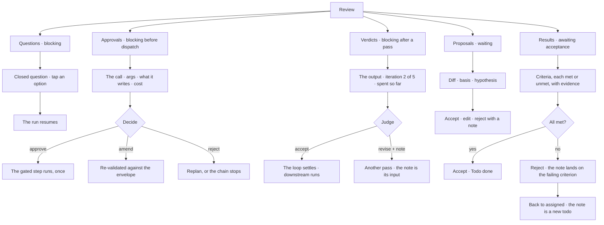

# Review

One queue for everything waiting on a person. Three of its kinds stop a run dead — a **question** the
agent cannot answer, an **approval** it may not proceed without, a **verdict** on what it just
produced. **Results** need accepting and **proposals** wait. Ordered by what is holding work up.

> ⚠ **Rewritten for [orchestration § 0](../../../orchestration.md#0-the-records)** — `Todo` · `TaskPlan` ·
> `Task` · `TaskRun` · `Lens`. The words *Thought*, *Thinking* and *Step-as-a-record* are retired, and
> **`Task` now names a node inside a plan**, never a thing a user authored. Migration:
> [task-model-migration.md](../../../building-engine/task-model-migration.md).

| | |
|---|---|
| Index | [9.3](../../../README.md#9--work) · Slice **S12b** |
| Module | [Work](../spec.md) |
| API / CLI / Studio | 🔵 / — / 🔵 |
| Related | [projects-and-tasks](projects-and-tasks.md) · [objectives-and-criteria](objectives-and-criteria.md) · [consolidation](../../memory/features/consolidation.md) · [the runtime](../../platform/features/runtime.md) (§10 — the three pauses this queue decides) |

> **As** the person everything waits on, **I want** one list of what needs me, **so that** nothing
> sits blocked because I did not know it was asking.

## Capabilities

| # | Capability | Notes |
|---|---|---|
| C1 | Five kinds, one queue | **Questions · approvals · verdicts** (a run is stopped on each) · **results** · **proposals** |
| C1a | The three run-blocking kinds come from the runtime | [13.8 §10](../../platform/features/runtime.md) — clarification, approval, verdict. Review is where all three are decided; the runtime owns none of the UI |
| C2 | Ordered by what blocks | The three pauses first — a run is stopped on each. Then results, then proposals |
| C3 | Results show criteria | Each with its outcome and evidence |
| C4 | Accept · reject with a note | On a **result**, the note attaches to the criterion that failed |
| C4a | A **verdict** is accept · revise, with a note | The note is bound into the loop's next pass as `${self.feedback}` ([RP2e](../../platform/features/runtime.md)) — it is the input to the refinement, not a comment on it |
| C4b | A verdict shows what it is judging | The pass's emissions, the iteration number, how many remain and what has been spent — so *"accept, it will not get better"* is an informed call |
| C4c | An **approval** shows the call it gates | Step, resolved arguments, what it reads, what it writes and its projected cost. A person may amend the arguments; the amended call is re-validated against the envelope |
| C5 | Answering resumes a run | The run continues where it parked |
| C6 | Proposals carry their diff and basis | Accepting publishes the next version |
| C7 | Filter by kind, agent, age | The queue stays readable |
| C8 | It lists work items, never graph rows | Something enters because an agent created a Todo, not because data looked odd |

## Journey

## Seams

| Seam | What the user sees |
|---|---|
| Empty queue | Nothing is waiting — stated as good news, not a blank page |
| A question nobody can answer | Stays; the Todo shows `needs_input` with its age |
| A verdict nobody gives | Stays until its deadline, then the run fails naming who was asked. The draft is kept as an artifact — never auto-accepted ([RP2g](../../platform/features/runtime.md)) |
| A verdict revised to exhaustion | Five *revise* verdicts and no acceptance: the run fails, and every pass with its note stays on the record |
| A result with no criteria | Accepted by eye, and the panel says there were none |
| A proposal raised on a stale base | Refused on accept, showing both versions |
| Items for another person | Visible; anyone with membership may act, and the record says who did |

## Surfaces

| Surface | Shape |
|---|---|
| Review panel | One list, grouped by kind — the three blocking pauses first, then results, then proposals |
| Item card | The subject, why it is here, and the actions it accepts |
| Main area | The item's detail — the Todo, the diff, the question in context, the gated call, or the pass being judged |

## Engine

| Thing | Shape |
|---|---|
| Queue | derived: parked clarifications, **steps `awaiting_approval`**, **steps `awaiting_verdict`**, open proposals, Todos in `review` |
| Actions | answer · accept · reject, each writing to its own subject |
| Routes | `GET …/review?kind=…` · the subject's own action routes — a verdict posts to `POST …/task_runs/{id}/steps/{step_id}/verdict` |
| Events | the subject's events; Review adds none of its own |

## Decisions

| # | Decision |
|---|---|
| RV1 | One queue for five kinds; the three runtime pauses rank first because a run is stopped on each. |
| RV2 | Review is derived — it owns no rows of its own. |
| RV3 | A rejection note attaches to the criterion that failed. |
| RV4 | The queue lists work items, never domain rows. |
| RV5 | Any member may act, and the record says who did. |
| RV6 | **Review is the surface for all three pauses.** The runtime suspends and records; it builds no UI of its own ([13.8 §10](../../platform/features/runtime.md)). |
| RV7 | **A verdict is not a result.** A result closes work somebody owns; a verdict decides whether a loop goes round again. They read alike, sit in one queue, and are different rows against different subjects. |
| RV8 | A verdict's note is **an input**, not a comment: it is bound into the loop's next pass. A rejection note on a result attaches to the criterion that failed (RV3). |

## Not building

| Not building | Because |
|---|---|
| Assigning review items to specific people | membership is binary; the queue is shared |
| A queue fed by domain conditions | an agent noticing is what creates work |
| Bulk accept | acceptance is per item, with its evidence |
