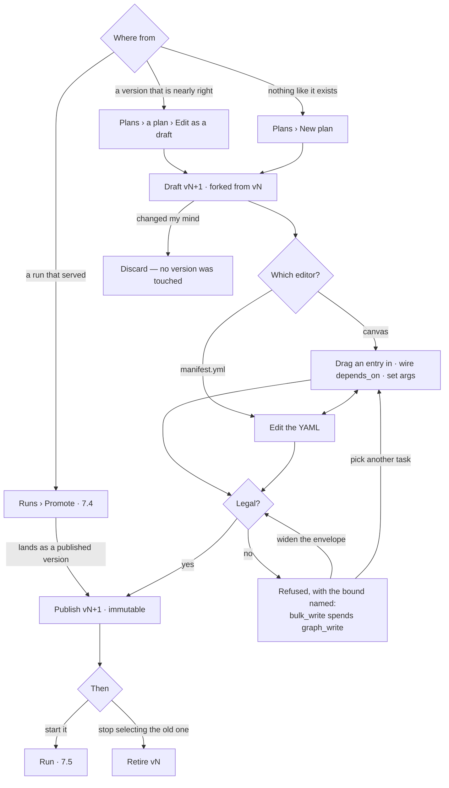

# Draft a plan

A published version is immutable, so a change is a **draft**: a fork of the version, edited on the
flow canvas or as `manifest.yml`, refused by the envelope while it is still a draft, and published as
the next version. Nothing selects a draft and nothing runs it.

| | |
|---|---|
| Index | [7.7](../../../README.md#7--workflows) · Slice **S15** |
| Module | [Workflows](../spec.md) |
| API / CLI / Studio | 🔵 / — / 🔵 |
| Related | [the-library](the-library.md) · [envelope-validation](envelope-validation.md) · [the-catalogue](the-catalogue.md) · [promote-a-plan](promote-a-plan.md) · [run-a-workflow](run-a-workflow.md) · [orchestration § 5](../../../orchestration.md#5-the-plan-is-data) |

> **As** someone whose agents keep doing the same job slightly wrong, **I want** to change the plan and
> publish it, **so that** the fix is the next version rather than a promotion I have to engineer by
> running something.

## Why this exists now

Promotion ([7.4](promote-a-plan.md)) made a plan that *served* into a template. It could not make a
plan that *nearly* served into a correct one — the only way to change a step was to run something
until the generated plan happened to come out right. That is authoring by coincidence.

## Capabilities

| # | Capability | Notes |
|---|---|---|
| C1 | `Edit as a draft` forks a published version | The draft carries `forked_from`; the version it came from is untouched |
| C2 | `New plan` starts an empty draft | Key, name, intent, kind — then tasks |
| C3 | Edit on the **flow canvas** | Add a task from the catalogue, wire `depends_on`, set args, delete |
| C4 | Edit as **`manifest.yml`** | The same document as YAML — the canvas draws this file, and the file is rewritten by the canvas |
| C5 | Switching editors never loses an edit | One document, two views; the switch is a render, not a save |
| C6 | Validated against the envelope as you type | Per-task, with the bound named ([7.3](envelope-validation.md)) — a refusal is a state of the task, not a modal |
| C7 | `Publish` mints the next immutable version | Refused while any task is refused; the published version is what runs |
| C8 | `Discard` throws the draft away | One draft per plan per person; discarding never touches a version |
| C9 | The draft says what changed since its parent | Added, removed, and what moved — the same shape as the version diff ([7.1](the-library.md) C4) |
| C10 | `Retire` a version, or the whole plan | Stops selection and starting; stops nothing that runs ([LB9](the-library.md)) |
| C11 | A draft is never startable | `Run` is absent, not disabled-with-a-tooltip — a draft has no version for a trace to name |
| C11e | A draft has **one reading** | Its switch is `Canvas ¦ manifest.yml` ([C4](#capabilities)), never `Overview ¦ Flow` — the `Overview` half is absent for C11's reason: a draft has never run, so there is nothing to report on ([LB24](the-library.md#decisions)) |
| C11a | **A task's parameters are a generated form** | One field per declared arg — name, type, required, default, straight from the catalogue entry ([7.6](the-catalogue.md)) |
| C11b | **Every field picks its source** | `literal` · `${binding}` · a plan `argument`. The source is a control, not a syntax a person has to know |
| C11c | Plan-level settings sit under the args | `map_over` · `depends_on` · `retry` · `when` · `approval` — the plan grammar, on the same form, below a rule |
| C11d | A task's parameters are editable **only in a draft** | Opening one on a published version offers `Edit as a draft`; the foot says *v4 is untouched until you publish* |
| C12 | The catalogue is the palette | Drafting is the only place the Catalogue drawer is a drag source rather than a reference |

## Journey

## Seams

| Seam | What the user sees |
|---|---|
| A draft already exists | Opening the plan lands on the draft, with *forked from v4, 2 days ago* and the choice to discard it |
| Someone published while you drafted | The draft says its parent moved; publishing offers to rebase onto the new version or publish as a branch of the old one — never a silent overwrite |
| A task the envelope refuses | The task is marked on the canvas and the line is marked in YAML; `Publish` is off and says how many tasks are refused |
| YAML that does not parse | The canvas keeps the last parsable state and says so; nothing is silently reshaped, and the editor does not switch away from an unparsable file |
| A task the catalogue does not have | Marked unknown, linking to the catalogue's *no such entry* — the same state a plan from a newer engine shows ([7.6](the-catalogue.md)) |
| A cycle in `depends_on` | Refused, naming the loop — the same refusal the runtime would give |
| Retiring the last published version | Says what loses its plan: the schedules and agents that named it |
| A member without write access | The canvas is read-only, `Edit as a draft` is absent, and the version history still reads |

## Surfaces

| Surface | Shape |
|---|---|
| Draft, in the **Plans** drawer | Behind the drawer's breadcrumb: `draft vN` badge, *forked from*, *changes since*, the validation result, then `Publish · Validate · Discard` |
| Parameters | **`bottomSection`**, `bottomSpan: "main"` ([DP11](#decisions)) — three columns for the selected task: the generated **form** · the **contract card** it was generated from ([7.6](the-catalogue.md)) · **live validation**. `Save to draft` · `Revert this task` in its header. It shortens the **canvas only**, so the Catalogue palette and the Assistant both keep full height |
| Canvas editor | `mainSection`. Palette (select · add · connect · delete), a selected task with handles, a status bar carrying `Publish` and `Discard`. **No floating properties card** — the canvas selects, `bottomSection` edits ([DP11](#decisions)) |
| The Assistant | **`rightSection`**, and it stays there ([DP12](#decisions)) — building the draft in natural language, and saying why a task is refused. It proposes **into the draft**, never to the graph, and never past the envelope |
| `manifest.yml` editor | `mainSection`, behind the pagehead's `Canvas ¦ manifest.yml` switch. CodeMirror, refused lines marked in the gutter, validation beside it |
| Catalogue drawer | The palette — drag an entry onto the canvas. A refused drop explains the bound |
| Retire | A confirm card over the canvas: what stops being selected, what keeps reading, and the schedules and agents affected |

## Engine

| Thing | Shape |
|---|---|
| `task_plans` | unchanged — a draft is a `plan_versions` row with `published_at IS NULL` |
| `plan_versions` | `steps` · `forked_from_version_id` · `created_by` · `published_at` (null while draft, immutable once set) |
| `GET/PUT …/plans/{id}/draft` | Read and write the working document. `PUT` takes the whole plan — canvas and YAML send the same body |
| `POST …/plans/{id}/draft/validate` | Per-task verdicts with the bound named; the same code path the dispatcher uses ([7.3](envelope-validation.md)) |
| `POST …/plans/{id}/draft/publish` | Refused unless every task validates; mints the next version |
| `DELETE …/plans/{id}/draft` · `POST …/plans/{id}/versions/{v}/retire` | Discard · retire |
| Events | `plan.drafted · plan.published · plan.retired` |

## Decisions

| # | Decision |
|---|---|
| DP1 | **A published version is immutable; editing forks a draft.** The runs that used a version have to stay readable, and a mutable version makes every trace a guess. |
| DP2 | **The canvas and `manifest.yml` are two editors over one document.** The plan is data; the canvas draws the data and writes it back. Neither converts to the other, because there is nothing to convert — there is one document and two renderings ([F18](../spec.md)). |
| DP3 | **The envelope is checked while drafting, not at dispatch.** The same validator, run on every edit — a refusal at 2am is the failure this feature exists to prevent. |
| DP4 | **A draft is not startable.** `plan_origin` has to name a version a trace can resolve; a run of something unpublished could not be read afterwards. |
| DP5 | **The catalogue is the only source of tasks.** A task is placed by dragging a catalogue entry; there is no free-text `run:` that the validator meets for the first time at publish. |
| DP6 | **Promotion stays.** A plan that served is still promotable ([7.4](promote-a-plan.md)) — drafting adds a door, it does not close that one. |
| DP8 | **The form is generated from the contract, never hand-written per task.** A field exists because the catalogue declares an arg; its type, requiredness and default come from the same declaration the validator reads ([CA2](the-catalogue.md)). A new catalogue entry gets an editor for free, and the two can never drift. |
| DP9 | **Binding is a choice of source, not a syntax to learn.** Each field is `literal` · `${binding}` · `argument`; picking *binding* offers what is in scope — earlier tasks' declared outputs, the lane, the plan's arguments. Typing `${…}` by hand still works, and resolves to the same thing. |
| DP10 | **A published version and its draft are two records, not two tabs of one.** `Edit as a draft` forks ([DP1](#decisions)), so the draft is its own `TaskPlan` row with its own key state, its own panel detail (*what changed since v2*) and its own board — `escalate-core@2` and `escalate-core · draft` are two pages in the strip, and closing one leaves the other open. A tab strip over the two would say they are readings of one thing, which is the exact claim [DP1](#decisions) exists to deny: switching tabs would read as *now I am editing v2*. The switch that **is** a tab is inside the draft — canvas ↔ `manifest.yml` ([DP2](#decisions)) — because that really is one document twice. |
| DP11 | **The canvas selects; `bottomSection` edits the selected task.** A drawing is not a form ([SP1](../../explore/features/selection-and-the-panel.md)), so the floating properties card is retired — the task's generated form, the catalogue contract it came from and its live validation are three columns of one bottom region. It is there and not in `rightSection` because of `bottomSpan: "main"` ([CO1](../../explore/features/the-console.md)): the bottom shortens the **canvas only**, leaving the Catalogue palette and the Assistant full height, which is exactly the geometry drafting wants. `bottomSection` is a **region**; the Console is one occupant of it and `parameters` is another ([the-shell.md](../../../building-studio/the-shell.md)) — a region is never owned by what is currently inside it. Drawn as `library.plans.detail.flow_canvas.edit` on [Govern, Agents and Skills](https://claude.ai/artifact/VrdrR5iKGfqsjhCouQDTbc). |
| DP12 | **On a draft board `rightSection` is the Assistant, and `?right=` defaults to it.** `rightSection` holds the Assistant **or** the Inspector, never both ([G5](../../../building-studio/graph-detail-page.md)) — so putting the task form there would evict the assistant at exactly the moment natural-language drafting needs it. The task's fields are in the bottom ([DP11](#decisions)), which leaves the Inspector with nothing to state that is not already on screen, so it is not the default here. What the assistant does on this board: **build** the draft in NL — its answers land where you are ([C4](../../ask/features/the-assistant.md)), and on a draft board that is the draft — and **diagnose**, with the selection attached ([C2](../../ask/features/the-assistant.md) · [SP5](../../explore/features/selection-and-the-panel.md)) and the bound named ([C6](#capabilities)). What it cannot do: write to the graph (an explicit non-goal), widen an envelope, or publish. A proposal is a **draft** write through the draft's own path, and `Publish` still runs the same validator ([DP3](#decisions)) — so a refused task the assistant proposed stays on the canvas, **refused**, rather than being dropped or quietly allowed. Drawn as `library.plans.detail.flow_canvas.edit.assistant`. |
| DP13 | **The Assistant takes its width from `mainSection`, and `leftSection` gives up nothing.** A draft board is 1440 like every other screen — a board drawn wider than the shell is a board nobody can build — so opening the Assistant is a **subtraction**, not a widening: `mainSection` goes from 974 to 613 and the 420px `leftSection` is untouched. It is untouched because it is the **Catalogue**, and the Catalogue is the palette you are dragging *from* ([DP5](#decisions)): a region that narrowed when another opened would move the thing your cursor was already on. The Assistant stays a **docked** 360 that pushes the canvas over rather than covering it ([DP12](#decisions)), so nothing the draft says is hidden behind it. Drawn as `library.plans.detail.flow_canvas.edit` (shut) and `…edit.assistant` (open). |
| DP14 | **At 613px the canvas pans and the editor stacks — scale is the user's, position is the app's.** `mainSection` narrowing is not a smaller drawing of the same screen; each part answers for itself. The **canvas** keeps its zoom and gives up its position: refitting on every panel toggle would move every node, and a draft that looked different depending on a side panel is a draft you cannot trust — so it pans, and what it pans to is the **selection** (or, with a proposal open, the proposed tasks), because the one thing that must never end up behind the new edge is what you were working on. The **`bottomSection` editor** stacks: below **720px** the two columns become one scrolling column, parameters first, contract under it. Nothing is dropped and nothing moves to another region — the editor is still the editor, read down instead of across ([DP11](#decisions)). The **pagehead** keeps what it is for — the record's name (truncated, never wrapped), the `Canvas ¦ manifest.yml` switch ([DP2](#decisions)) and `Publish` — and folds `Discard` into the `⋯`; the badges go, because the panel and the canvas already say *draft* and *2 tasks refused*. |
| DP7 | **Retire is not delete.** A retired version is not selected and not startable, and it still resolves for every run that used it. Nothing here deletes a plan. |

## Not building

| Not building | Because |
|---|---|
| Editing a published version | DP1 — the trace is why |
| Running a draft | DP4 |
| A free-form diagram — notes, swimlanes, arbitrary shapes | the canvas edits a plan, and the plan grammar is closed ([orchestration § 5](../../../orchestration.md#5-the-plan-is-data)) |
| Branching version lines | one line of versions per plan ([the-library](the-library.md) · Not building) |
| Importing a plan from a file | the YAML editor is the same document, not an import path; a file from elsewhere has no envelope to be checked against |
| Collaborative live editing of one draft | one draft per plan per person; two people on one document is a merge problem this feature does not need to have |
| Deleting a plan | retire is the exit ([DP7](#decisions)); a deleted plan is a trace that cannot be read |
