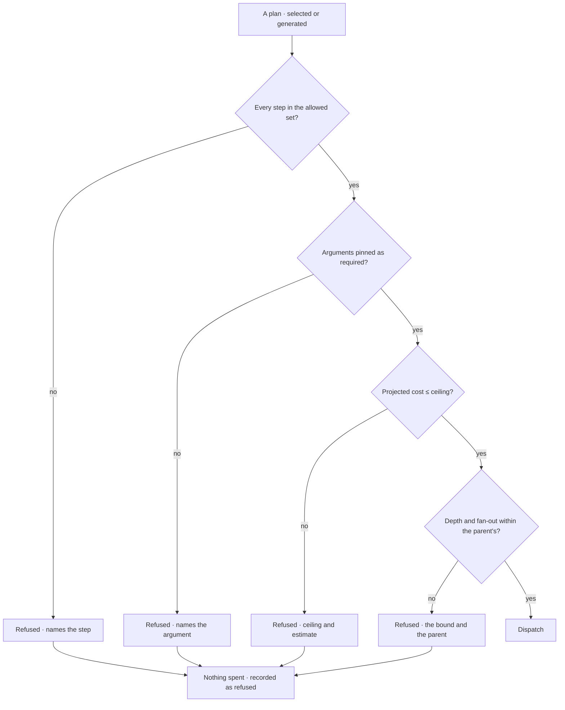

# Check a plan against the bound

Every plan is checked against the running agent's bounds **before** dispatch. A plan outside them costs
nothing and is refused with the bound named.

| | |
|---|---|
| Index | [7.3](../../../README.md#7--workflows) · Slice **S9d** |
| Module | [Workflows](../spec.md) |
| API / CLI / Studio | 🟡 / — / 🔵 |
| Related | [envelope-and-budget](../../agents/features/envelope-and-budget.md) (where bounds are authored) · [plan-selection](plan-selection.md) |

> **As** someone who let an agent run unattended, **I want** anything outside its limits stopped before
> it spends money, **so that** the bound is a fact and not a hope.

## Capabilities

| # | Capability | Notes |
|---|---|---|
| C1 | Checked before dispatch | Not during, not after the first step |
| C2 | Four checks | Step allowed · argument pinned · cost ceiling · depth and fan-out |
| C3 | The refusal names the bound | The step key, the argument, the ceiling, or the parent limit |
| C4 | A refusal is an outcome, not an error | The run reports it; the task shows why |
| C5 | Selected and generated plans are treated identically | Coming from the library is not a pass |
| C6 | Cost is projected, not guessed after | The estimate and the ceiling are both shown |
| C7 | Refusals are counted | Repeated ones are evidence, and may propose tightening or widening |

## Journey

## Seams

| Seam | What the user sees |
|---|---|
| Envelope changed mid-flight | Running steps finish; the next plan is checked against the new bounds |
| A template that used to pass | Refused, naming what changed — the template is not deleted |
| Repeated refusals of the same step | Evidence; a proposal may suggest allowing it, which a person decides |
| A task whose agent refuses everything | The task goes blocked, naming the agent and the bound |

## Surfaces

| Surface | Shape |
|---|---|
| Step row | "Plan · refused: `spawn_agent` not allowed" |
| Task | Blocked, with the bound as the reason |
| Envelope canvas | The bound that refused, highlighted |

## Engine

| Thing | Shape |
|---|---|
| Validation | pure function of plan × envelope; no side effects, no partial dispatch |
| Cost projection | per step kind, from recorded history |
| Refusal record | on the run: which check, which bound, what was proposed |
| Events | `plan.refused` with the bound |

## Decisions

| # | Decision |
|---|---|
| EV1 | Validation happens before dispatch. Always. |
| EV2 | A refusal names the specific bound. |
| EV3 | Library provenance grants no exemption. |
| EV4 | A refusal is a recorded outcome, not an exception. |

## Not building

| Not building | Because |
|---|---|
| Asking a person to approve an out-of-bounds plan mid-run | that turns a bound into a prompt |
| Partial dispatch of the allowed steps | half a plan is not a plan |
| Retrying with a trimmed plan automatically | the agent may propose it; the system does not decide it |
