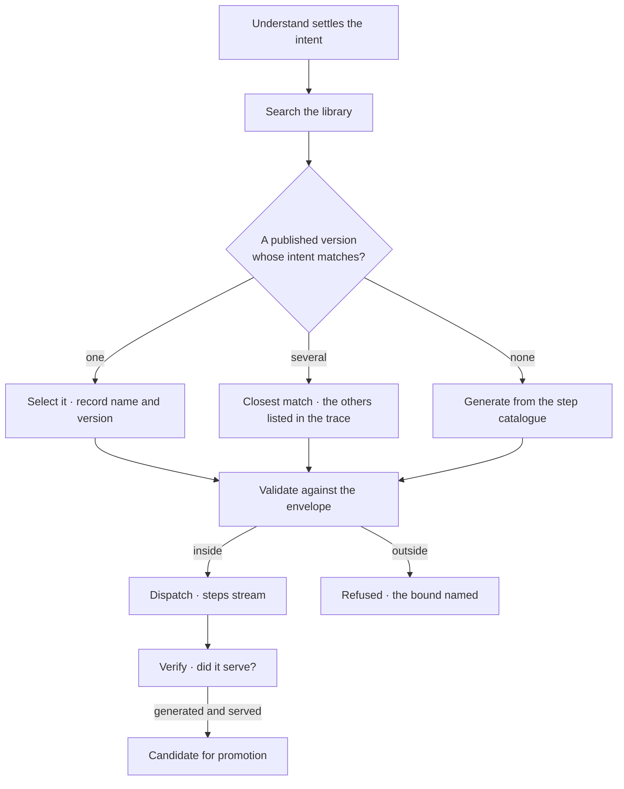

# Pick a plan, or write one

The *Plan* step picks a published template by intent. Generation is what happens when nothing fits —
the fallback, not the default.

> ⚠ **Rewritten for [orchestration § 0](../../../orchestration.md#0-the-records)** — `Todo` · `TaskPlan` ·
> `Task` · `TaskRun` · `Lens`. The words *Thought*, *Thinking* and *Step-as-a-record* are retired, and
> **`Task` now names a node inside a plan**, never a thing a user authored. Migration:
> [task-model-migration.md](../../../building-engine/task-model-migration.md).

| | |
|---|---|
| Index | [7.2](../../../README.md#7--workflows) · Slice **S9d** |
| Module | [Workflows](../spec.md) |
| API / CLI / Studio | 🟡 / — / 🟡 |
| Related | [the-library](the-library.md) · [envelope-validation](envelope-validation.md) · [promote-a-plan](promote-a-plan.md) |

> **As** someone paying for every run, **I want** the plan that already worked to be used again, **so
> that** the same question does not cost a fresh act of invention each time.

## Capabilities

| # | Capability | Notes |
|---|---|---|
| C1 | Select by intent | The intent *Understand* settled, matched against the library |
| C2 | Record which was selected | Template and version, in the trace |
| C3 | Generate when nothing fits | From the step catalogue, inside the envelope |
| C4 | Record that it generated, and why | "No template matched" is part of the trace |
| C5 | Never silently mix | A plan is selected or generated; there is no partial reuse |
| C6 | Validated either way | Selection does not exempt a plan from the envelope check |
| C7 | The plan is visible before dispatch | The user sees the steps it will run |

## Journey

## Seams

| Seam | What the user sees |
|---|---|
| Empty library | Generates, and says the library had nothing — not an error |
| Every template retired for that intent | Same as empty, with the retired ones named |
| Ambiguous match | The chosen one, plus the runners-up, in the trace |
| Generation refused by the envelope | The bound, before anything runs |
| The same intent generating repeatedly | Evidence, and a proposal to promote |

## Surfaces

| Surface | Shape |
|---|---|
| Step row | "Plan · selected setup-check@2" or "generated · no template matched" |
| Plan preview | The steps and their arguments, before dispatch |
| Trace | Why this template, and what else was considered |

## Engine

| Thing | Shape |
|---|---|
| Matching | intent similarity over published versions, deterministic and recorded |
| Plan record | on the run: steps, origin (`selected:<version>` or `generated`) |
| Routes | internal to the runtime; visible through the trace |
| Events | `plan.selected · generated` |

## Decisions

| # | Decision |
|---|---|
| PS1 | Selection is tried first; generation is the fallback. |
| PS2 | The origin of the plan is always recorded. |
| PS3 | A selected plan is validated exactly like a generated one. |
| PS4 | Partial reuse of a template is not a thing — select or generate. |

## Not building

| Not building | Because |
|---|---|
| Editing the plan before dispatch | validation is the gate; hand-editing bypasses the trace |
| Learning the matcher from feedback | matching is deterministic and inspectable, on purpose |
| Multiple plans raced against each other | cost and attribution both become unreadable |
