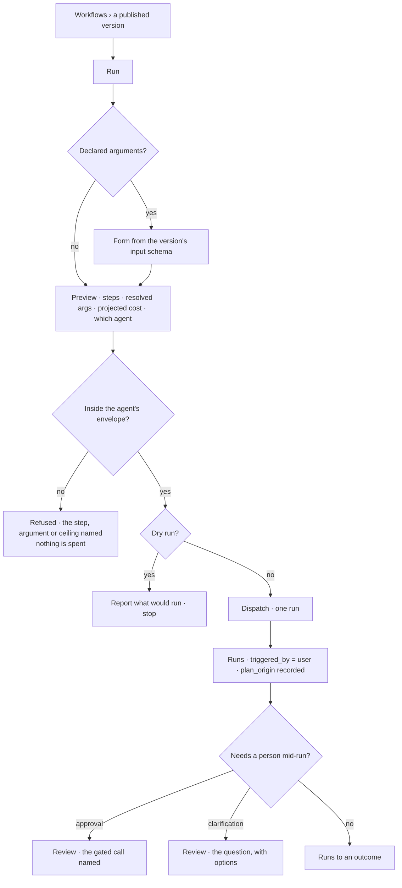

# Run a workflow

Start a plan from the library, with its arguments, as a run of its own. The front door the runtime
always assumed and the product never built.

> ⚠ **Rewritten for [orchestration § 0](../../../orchestration.md#0-the-records)** — `Todo` · `TaskPlan` ·
> `Task` · `TaskRun` · `Lens`. The words *Thought*, *Thinking* and *Step-as-a-record* are retired, and
> **`Task` now names a node inside a plan**, never a thing a user authored. Migration:
> [task-model-migration.md](../../../building-engine/task-model-migration.md).

| | |
|---|---|
| Index | [7.5](../../../README.md#7--workflows) · Slice **S15** |
| Module | [Workflows](../spec.md) |
| API / CLI / Studio | 🔵 / 🔵 / 🔵 |
| Related | [the-library](the-library.md) (what is startable) · [envelope-validation](envelope-validation.md) (the check before dispatch) · [the runtime](../../platform/features/runtime.md) (§13 — the trigger table) · [see-what-ran](../../operate/features/see-what-ran.md) (where it lands) · [schedules](../../operate/features/schedules.md) (the same start, on a cron) · [load-a-bundle](../../bring-data-in/features/load-a-bundle.md) |

> **As** someone with a plan that already works, **I want** to run it on demand with today's
> arguments, **so that** I do not have to phrase a question and hope the planner picks it.

## The gap this closes

[13.8 §13](../../platform/features/runtime.md) lists five triggers, and the first one reads *"a person
asks, **or runs a workflow**"*. Nothing implements the second half.

| Way in | Exists |
|---|---|
| Ask a question; `understand` settles an intent; `plan` searches the library and may select a template | ✅ [7.2](plan-selection.md) |
| A Task assignment opens a run | ✅ |
| A schedule fires | 🔵 [10.1](../../operate/features/schedules.md) |
| **A person picks a plan and runs it** | ❌ **this feature** |

So a library of named, versioned, proven plans can only be reached by asking a question phrased well
enough that the planner finds it. The consequences are concrete:

| Consequence | |
|---|---|
| A deterministic plan needs a non-deterministic doorway | `bundle-import@1` has nothing to decide, yet the only way in is an LLM deciding it matched |
| A schedule has no target it can name | `schedules.kind = workflow` ([SC6](../../operate/features/schedules.md)) needs a start-by-key call to fire; without one it cannot exist |
| Arguments have nowhere to go | A plan with inputs — *which bundle · which dataset · which threshold* — cannot receive them through a question |
| The library is a reference book | 7.1 lists what is startable and offers no way to start it |

## What "dynamic" means here, and what it does not

Both senses are already the runtime's, and this feature is the doorway to each.

| Sense | State |
|---|---|
| A plan **generated at runtime, as data**, when no template fits | ✅ designed — [F1](../spec.md), the documented fallback |
| A plan that **branches, fans out, loops, gates** | 🔵 designed, deferred — [13.8 §4](../../platform/features/runtime.md); unblocked by [2.3](../../bring-data-in/features/load-a-bundle.md) |
| A plan a person **composes in a UI** | ❌ **not building** — [§7](../spec.md). Promotion from a run that served is the authoring path |

Running a workflow does not make it editable. It makes it **startable**.

## Capabilities

| # | Capability | Notes |
|---|---|---|
| C1 | Start a published version by key | `workflow:<key>@<version>`. Omitting the version takes the current published one and **records which it resolved to** |
| C2 | Arguments, declared and checked | A version declares its inputs; a start supplies them and is refused with the field named when it does not |
| C3 | Validated against the envelope before dispatch | The same check a selected plan gets ([7.3](envelope-validation.md)). Starting by hand is not an exemption |
| C4 | It runs as the kind its intent is | `plan_origin = builtin:<key>@<v>` or `template:<key>@<v>`. **A workflow is not a kind of run** ([F7](../spec.md)) |
| C5 | It runs through an agent | The one named on the start, or the Graph default — so the envelope, the budget and the concurrency ceiling all have an owner |
| C6 | The plan is shown before it is dispatched | The steps, the resolved arguments and the projected cost. C7 of [7.2](plan-selection.md), at the doorway |
| C7 | One row in [Runs](../../operate/features/see-what-ran.md) | `triggered_by = user`, with the workflow and version on it. Filterable to *every run of this plan* |
| C8 | Idempotent on request | An `idem_key` makes a double-clicked button, a retried CLI call and a re-delivered webhook mean once ([13.8 §13](../../platform/features/runtime.md)) |
| C9 | Cancel where the runtime allows | The ordinary run control; this feature adds none of its own |
| C10 | A dry run | Validate, resolve arguments and project cost **without dispatching** — the same refusals, nothing spent |

## Journey

## Seams

| Seam | What the user sees |
|---|---|
| The version was retired between opening and clicking Run | Refused, naming the version and offering the current published one. A retired plan is never started fresh ([LB2](the-library.md)) |
| An argument is missing or the wrong type | Refused at validation with the field named, before anything is dispatched ([13.8 RP7](../../platform/features/runtime.md)) |
| The plan exceeds the agent's envelope | Refused naming the step, argument or ceiling. Picking it by hand does not widen the bound |
| No agent named and no Graph default set | Refused naming the setting, not started under an implicit identity |
| The Graph is at its concurrency ceiling | Queued or refused per policy; a person's run outranks a schedule's ([5.7](../../agents/features/concurrency-and-contention.md)) |
| Started twice by a double click | One run. The second returns the first, by `idem_key` |
| A builtin is started | Identical path. `dataset-import@1` from the library and `invana records import` open the same run ([F9](../spec.md)) |
| The same plan is also on a schedule | Both appear in Runs, distinguished by `triggered_by`, not by living on different surfaces |
| A member without Graph access opens the link | `EmptyStateLock`. Membership is the permission; there are no roles |

## Surfaces

| Surface | Shape |
|---|---|
| Workflows panel | `Run` on a published version's row and in its detail header — creating lives in the header ([Work §6](../../work/spec.md) panel rules) |
| Run dialog | The argument form, the step preview, the agent picker, the projected cost. `Dry run` beside `Run` |
| CLI | `invana workflows run <key>@<version> --arg k=v --agent <name> [--dry-run] [--wait]` — exit codes a scheduler can branch on |
| API | `POST …/workflows/{key}/runs` → a run id to poll or stream |
| Runs | Where it lands. This feature adds no journal of its own |

**It adds no panel.** The launcher belongs in the library because that is where a plan lives, and
[Runs](../../operate/features/see-what-ran.md) is deliberately read-only (C12) — a journal that
starts work is no longer a record of what happened.

## Engine

| Thing | Shape |
|---|---|
| `workflow_versions` gains | `inputs` jsonb — the declared argument schema, checked at start |
| The run | an ordinary `Todo` + `Run`. **No new tables** |
| Recorded on the run | `plan_origin` · `plan_version` · `triggered_by = user` · the resolved arguments |
| Routes | `POST …/workflows/{key}/runs` · `POST …/workflows/{key}/runs?dry_run=true` |
| CLI | `invana workflows run` · `invana workflows list` |
| Events | `run.queued · started` and the rest of the closed set. No start vocabulary of its own |

## Decisions

| # | Decision |
|---|---|
| RW1 | **Starting a workflow is an ordinary run.** It opens a run of whatever kind the plan's intent is, with `plan_origin` recorded. A workflow is still not a todo kind ([F7](../spec.md)). |
| RW2 | **Starting by hand is not an exemption.** The envelope check runs exactly as it does for a selected plan; a person choosing the plan widens no bound. |
| RW3 | A start names a **version**, or resolves the current published one and **records which**. A trace that cannot name the version cannot replay. |
| RW4 | A version declares its `inputs`; a start supplies them and is refused, with the field named, before dispatch. |
| RW5 | A start names an **agent** — given, or the Graph default. A run with no agent has no envelope, no budget and no owner, so it is refused rather than run unbounded. |
| RW6 | **The plan is shown before it is dispatched**, with resolved arguments and projected cost. Nothing about starting by hand should be less legible than being selected. |
| RW7 | A **dry run** validates, resolves and projects without dispatching — same refusals, nothing spent. |
| RW8 | `idem_key` makes a repeated start return the existing run. |
| RW9 | **This feature adds no surface of its own.** The launcher is in the library; the result is in Runs; a pause is in Review. |
| RW10 | Builtins start through the same door. `invana records import` and a library start of `dataset-import@1` open the same run — one path, however it was asked for. |
| RW11 | A schedule of `kind = workflow` ([SC6](../../operate/features/schedules.md)) is **this call on a cron**, not a second mechanism. |

## Not building

| Not built | Because |
|---|---|
| Composing or editing a plan in the UI | [§7](../spec.md) — promotion from a run that served is the authoring path. Startable is not editable |
| Re-running a past run from Runs | Runs is read-only (C12). A retry is a **new run**; start the plan again with the arguments you want |
| Starting a draft or retired version | only published versions run; that is what publishing means |
| A queue of pending starts | the Graph's concurrency ceiling and its queue already exist ([5.7](../../agents/features/concurrency-and-contention.md)) |
| Per-start envelope overrides | the envelope is authored on the agent. A start that could widen it would make the bound advisory |
| Passing a plan inline instead of a key | a plan that is not in the library is a plan no trace can resolve ([F9](../spec.md)) |
