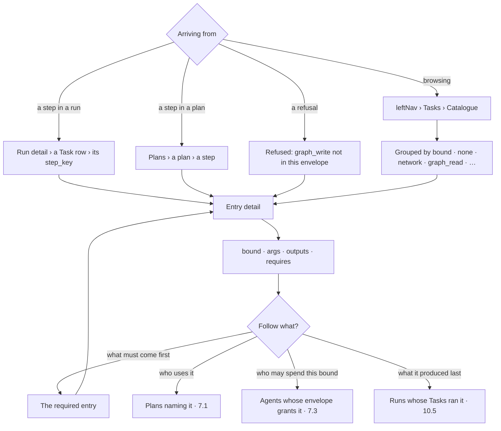

# Read the catalogue

The closed set of callables a plan may name, with what each one **spends**, **takes**, **produces**
and **must be ordered after**. It is the vocabulary every plan in the Graph is written in — so it is
the page you read when a plan step is unfamiliar, when a plan was refused, or when you want to know
what the system is able to do at all.

| | |
|---|---|
| Index | [7.6](../../../README.md#7--workflows) · Slice **S12c** |
| Module | [Workflows](../spec.md) |
| API / CLI / Studio | 🟡 / — / 🟡 — the list, search and the contract detail ship; *Used by* plans (C5) and *granted to* (C6) do not yet |
| Related | [the-library](the-library.md) · [envelope-validation](envelope-validation.md) · [plan-selection](plan-selection.md) · [the runtime](../../platform/features/runtime.md) · [orchestration § 0.6](../../../orchestration.md#06-the-catalogue--what-a-plan-may-name) |

> **As** someone reading a plan or a refused run, **I want** the contract of the step in front of me,
> **so that** I can tell what it was allowed to do without reading the engine.

## Why it is a surface at all

A catalogue entry is already an artifact with four readers — the planner, the validator, the
interpreter and every `${steps.x.y}` binding ([§ 0.6](../../../orchestration.md#06-the-catalogue--what-a-plan-may-name)).
This adds a fifth: **a person**. Three questions have no other answer today.

| Question | Where it is answered without this |
|---|---|
| *What does `validate_query` actually check, and what does it hand on?* | the engine source |
| *Why was this plan refused with `graph_write not in envelope`?* | the error string alone |
| *What can the system do — what is the whole vocabulary?* | nowhere |

## Capabilities

| # | Capability | Notes |
|---|---|---|
| C1 | Every entry, **grouped by the bound it spends** | The group is the thing the envelope ceilings — grouping is not cosmetic |
| C2 | An entry's contract: `bound` · `args` · `outputs` · `requires` | The declaration, rendered — never a second copy of it |
| C3 | An output row states its **lane roll-up** | `sum` · `concat` · *not exposed on a fan-out* — the type *is* the rule ([§ 5.1b](../../../orchestration.md)) |
| C4 | `requires` reads as an ordering statement | *"a plan naming this must already order `validate_query` before it"*, linking to that entry |
| C5 | **Used by** — which reusable plans name this entry | The reverse of a plan's step list; a plan row opens [7.1](the-library.md) |
| C6 | Which agents may spend this bound | From the envelopes — the bound is what an envelope grants ([7.3](envelope-validation.md)) |
| C7 | Read-only, and it says so | The set is closed and ships with the engine; nothing here adds, edits or disables an entry |
| C8 | Search across key, summary and bound | Twenty-odd entries — search is a convenience, not the navigation |
| C9 | **Each row says how many plans name it** | Which makes an unused callable visible, and the one five plans depend on too — the reverse of C5, on the list rather than in the detail |

## Journey

## Seams

| Seam | What the user sees |
|---|---|
| An entry no plan uses | *Used by* is empty and says so — a callable nobody composes is a fact, not an error |
| A plan naming an entry this engine version does not have | The plan's step row is marked unknown and links here to *no such entry*; the plan is unrunnable and the library row says why |
| An entry whose bound no agent in the Graph is granted | Stated on the entry: nothing here can run it until an envelope grants the bound |
| An output not exposed on a fan-out | The row says *per lane only — bind it inside the lane*, rather than omitting it |
| A member reading a bound they cannot spend | The whole catalogue is readable by every member; it is a contract, not a permission |

## Surfaces

| Surface | Shape |
|---|---|
| **Catalogue** drawer | The third drawer of the **Tasks** stack ([G33](../../../building-studio/graph-detail-page.md)). While a draft is open it is also the **palette** — drag an entry onto the canvas ([7.7](draft-a-plan.md)). Rows grouped under their bound, the group header carrying the bound and its count. A row is `step_key` (mono) · one-line summary · **how many plans name it**, or `unused`. The main column stays empty and says why an entry opens no page (CA6) |
| Entry detail | **In the drawer only** (CA6): the bound, then `args`, `outputs` (with roll-up), `requires`, *Used by*, *Agents granted this bound*. There is no dashboard page for an entry |
| The contract, where it is used | The same fields render as the **contract card** beside a task's parameter form ([7.7](draft-a-plan.md)) — the form is generated from them — and inside a refusal. That is where an entry is actually read |
| Deep links | A task on a run's canvas and a task on a plan's canvas both link to `?panel=library&drawer=catalogue&entry=<step_key>` — the refusal message links to the same place |

## Engine

The declaration already exists — `runtime/catalogue/registry.py`, twenty-four entries across seven bounds
today. This feature is a **read route over it**, and nothing else.

| Thing | Shape |
|---|---|
| Source | `invana.runtime.catalogue.registry` — the closed set, derived nowhere else |
| Entries this work adds | `test_connection` (`network`) · `expand_neighbours` (`graph_read`) · `import_dataset` · `check_bundle` · `validate_records` · `import_report` (`ingest`) · `apply_stitches` · `commit_stitches` · `bulk_write` (`graph_write`). Declared in the engine, not registered by the feature that needed them ([CA1](#decisions)) — folding a flow into the runtime means *declaring its callable*, never *opening the set* |
| `GET …/catalogue` | Every entry: `step_key · bound · summary · args · outputs (with rollup) · requires · used_by`, ordered by bound then key. Graph-scoped only so *used by* and *granted to* can be answered. `used_by` counts this Graph's reusable plan **keys**, not versions |
| `GET …/catalogue/{step_key}` | One entry, plus `used_by` (reusable plans naming it) and `granted_to` (agents whose envelope carries its bound) |
| Cache | The entry list is engine-static: it is versioned with the engine build and served from memory |

## Decisions

| # | Decision |
|---|---|
| CA1 | **The catalogue is read-only in the product.** The set is closed and ships with the engine — that closure is what makes an envelope a bound rather than a suggestion, and a UI that could add, edit or disable an entry would be the hole ([§ 0.6](../../../orchestration.md#06-the-catalogue--what-a-plan-may-name)). |
| CA2 | **It is rendered from the declaration, never re-described.** No prose copy of an entry's args lives in Studio or in docs; the route serves `registry.py`, and an entry that changes changes here first. |
| CA3 | **Grouped by bound, not alphabetically.** The bound is what the envelope ceilings and what a refusal names, so the group a person scans is the group the system enforces. |
| CA4 | **A drawer of Tasks, not an icon.** A run is an execution of a plan; a plan is a composition of catalogue entries — the catalogue is the bottom of that same sentence, and it is where *this run → the plan it ran → the callable that failed* ends ([G33](../../../building-studio/graph-detail-page.md)). |
| CA6 | **An entry gets a drawer detail, not a page.** Fourteen entries, five or six fields each, and nothing per-entry to chart: a dashboard would be a contract with whitespace around it. The two places an entry is genuinely read are the **parameter form it generates** and the **refusal that names its bound**, and both show the contract in place. Browsing all of them is the drawer's job. |
| CA7 | **An entry's summary is declared on the entry.** `Entry.summary` is one line in `registry.py`'s declaration, and the route serves it — not a docstring parsed at read time, and not a string in Studio. A golden test refuses an entry without one. |
| CA5 | **Control flow is not in the catalogue.** `if` · `loop` · `map` · `retry` · `stop` are plan grammar ([§ 5](../../../orchestration.md)); they are documented with the plan, and a person looking for them here is told where they live rather than shown an entry that does not exist. |

## Not building

| Not building | Because |
|---|---|
| Registering an entry from a plugin or an app | the set is closed; an app that could register one would make the envelope advisory ([the-runtime-package.md](../../../building-engine/the-runtime-package.md) §1) |
| Enabling / disabling an entry per Graph | the bound is the knob, and it is the envelope's ([7.3](envelope-validation.md)) — a second switch would have two answers to *may this run* |
| A playground that executes an entry | a callable runs inside a plan, under an envelope, with a run row behind it; a bare invoke is a write with no trace |
| Per-entry metrics | cost and duration belong to the run that spent them ([10.5](../../operate/features/see-what-ran.md)); an average over a callable answers nobody's question |
| Editing `requires` | it is part of the entry's contract, read by the planner while drafting — a Graph-level override would make a plan legal in one Graph and refused in the next |
