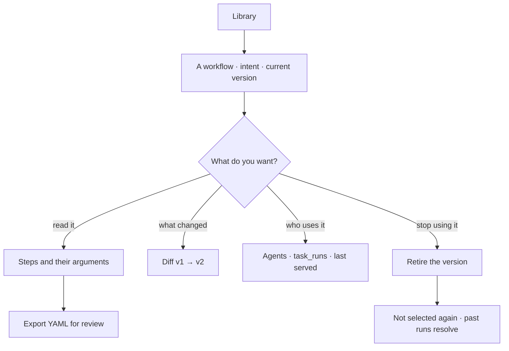

# Save a plan for reuse

Every workflow in the Graph, versioned, with what changed between versions and who uses each. A
published version is immutable, so the runs that used it stay readable.

> ⚠ **Rewritten for [orchestration § 0](../../../orchestration.md#0-the-records)** — `Todo` · `TaskPlan` ·
> `Task` · `TaskRun` · `Lens`. The words *Thought*, *Thinking* and *Step-as-a-record* are retired, and
> **`Task` now names a node inside a plan**, never a thing a user authored. Migration:
> [task-model-migration.md](../../../building-engine/task-model-migration.md).

| | |
|---|---|
| Index | [7.1](../../../README.md#7--workflows) · Slice **S12c** |
| Module | [Workflows](../spec.md) |
| API / CLI / Studio | 🟡 / — / 🟡 |
| Related | [plan-selection](plan-selection.md) · [promote-a-plan](promote-a-plan.md) · [run-a-workflow](run-a-workflow.md) |

> **As** someone whose agents keep doing the same job, **I want** the good version of that job saved
> and named, **so that** it is selected rather than reinvented every run.

## Capabilities

| # | Capability | Notes |
|---|---|---|
| C1 | Workflows listed with their intent | The intent is what selection matches on |
| C2 | Versions per workflow | Draft · published · retired |
| C3 | Immutable published versions | Changing publishes a new one |
| C4 | Diff against the previous version | Steps added, removed, reordered; argument changes |
| C5 | Usage | Which agents selected it, and which task_runs ran it |
| C6 | Retire a version | Not selected again; existing runs still resolve |
| C7 | Export as YAML | For review in a pull request, not as a second source of truth |
| C8 | Where it came from | Promoted from a run, or authored |
| C9 | Origin is shown | `builtin` · `authored` · `promoted`. Invana's own plans are listed here too ([F9](../spec.md)) |
| C10 | A published version is startable from its row | `Run` — the doorway is [7.5](run-a-workflow.md); this feature owns the list it sits on |

## Journey

## Seams

| Seam | What the user sees |
|---|---|
| A version in flight | Retiring it does not stop running task_runs |
| No usage | Listed as never selected, which is itself a signal |
| Two workflows with the same intent | Both listed; selection picks by closeness and records which |
| Retired everything | The intent falls back to generation, and the plan says so |

## Surfaces

| Surface | Shape |
|---|---|
| **Plans** drawer | The second drawer of the **Tasks** stack ([G33](../../../building-studio/graph-detail-page.md)), with its own search and filter. Name · intent · origin badge · version · used by · last served · `Run`. Filters: origin · kind |
| Plan detail | Behind the Plans drawer's breadcrumb: a `RecordHeader` naming the version it is — `nl-single@2` · `v2` · `published` — then four bands in this order ([LB22](#decisions)): **The plan** (`key` · `origin` · `tasks` as `5 · 4 callables, 1 human` · what it `matches` · `owner` · the agents that **may run** it) · **Layers it declares** (the same `LayerStrip` a run draws, on `scale="seq"` — all five governed bands, bands shut, [LB31](#decisions)) · **Used by** (the callers that inline it, each with what it tuned) · **How it has behaved** (until [the plan dashboard](#surfaces) ships). `Run` · `Edit as a draft` · `Retire` sit at its foot once [7.5](run-a-workflow.md) and [7.7](draft-a-plan.md) land; until then the drawer's status bar states the deferral |
| Library row | `key@version` · the origin badge · what it is for · **the bands it will engage** · then *used by N callers*, or how often it ran where nothing inlines it. The spine is not chipped: every plan is dispatched by the runtime |
| **The plan page** | One `mainSection` page, `board.kind = plan_runs` ([CV12](../../explore/features/boards.md)), carrying **both readings** behind the pagehead's `Overview ¦ Flow` switch ([LB24](#decisions)) |
|  — **Overview** | The default. The layer strip ([LB17](#decisions)) · how it has behaved — succeeded · p50/p95 · median hold · used by · cost per run · the plan's declared **Arguments** · the runs of this plan |
|  — **Flow** | The same plan as a canvas, read-only and carrying **medians, not statuses** — nothing ran *here*. A task opens its [catalogue](the-catalogue.md) entry in the drawer ([CA6](the-catalogue.md)) |
| The draft's board | `board.kind = workflow`, a **different record** — its own tab in the strip, reached by `Edit as a draft` ([DP10](draft-a-plan.md#decisions)). Its switch is `Canvas ¦ manifest.yml`, not `Overview ¦ Flow`: a draft has never run ([C11e](draft-a-plan.md)) |
| The acts, and the artboard each opens | `Overview ¦ Flow` → `…detail.overview` ¦ `…detail.flow_canvas` · `Edit as a draft` → `…flow_canvas.edit` · `Run…` → [7.5](run-a-workflow.md). `⋯` carries `Versions` → `…detail.versions` · `Arguments` → `…detail.arguments` · `Export YAML` → `…detail.export` · `Ceilings` → `…detail.ceilings`. The drawer's footer carries `Run…` · `Edit as a draft` · `Retire…` → `…detail.retire` ([LB25](#decisions)) |
| Main area | The steps drawn (`kind = workflow`), with the diff beside them |
| Version bar | Versions with what changed and how each fared |

## Engine

| Thing | Shape |
|---|---|
| `task_plans` | `graph_id` · `name` · `intent` · `origin (builtin\|authored\|promoted)` · `status` |
| `workflow_versions` | `steps` · `created_from_run_id?` · `published_at`, immutable |
| Routes | `…/workflows*` · `…/workflows/{id}/versions*` · `GET …/workflows/{id}/export`. The start route is [7.5](run-a-workflow.md)'s |
| A row read | `layers` (the bands it engages) · `caller_count`. A node carries its `form` and its `layer` |
| A detail read | plus `declared_layers` (`{layer, declared, steps, summary}` × 5) · `callers` (`{kind, name, skill_id, version, args}`) · `args_schema` |
| Where the band comes from | `runtime/layers.py` — one mapping from a catalogue `bound` to a governed `Layer` ([LB23](#decisions)) |
| Events | `workflow.published · retired · exported` |

## Decisions

| # | Decision |
|---|---|
| LB1 | A published version is immutable. |
| LB2 | Retiring stops future selection, never a running run. |
| LB3 | Every version records its origin: **builtin**, authored, or promoted from a run ([F9](../spec.md)). |
| LB4 | YAML export is for review, not for round-tripping edits. |
| LB5 | **The library is the reusable plans, and origin is a badge on the row.** `builtin` · `authored` · `promoted` are three ways a row got here, not three lists — filtering by origin is one chip. |
| LB6 | **A generated one-off plan is not listed.** It belongs to its Todo (`task_plans.todo_id`), and it is read from the run that ran it — browsing plans that can never be selected again would make the library a log. Promotion ([7.4](promote-a-plan.md)) is how one enters this list, and that is the only door. |
| LB8 | **A draft is a fork, never an edit in place.** `Edit as a draft` copies the published version into a draft that nothing selects and nothing runs; publishing it mints the next version and leaves the old one readable ([7.7](draft-a-plan.md)). |
| LB10 | **A plan's dashboard answers *how has it behaved*, not *what is it*.** What it is, is the flow; how it has behaved is the aggregate over its runs — succeeded 12 of 14, p50 4.9s against p95 31s, the median minute spent held on `announce`. Both live on one dashboard because choosing to run a plan needs both. |
| LB9 | **Retire is a version-level act with a plan-level shortcut.** Retiring a version stops it being selected and startable; retiring every version takes the plan out. Neither stops a run in flight, and both leave existing traces resolvable. |
| LB11 | **Seeded means populated, not present.** A plan *is* its rows, so a library row with no Tasks is not a plan anybody can read or run. `ensure_seeded` therefore matches on identity *and* on having nodes: a row carrying a builtin's key and version but no Tasks is re-exploded from the registry rather than skipped. This is what makes migration `000000000038` safe — it carries the library across and drops `spec`, and the rebuild it relies on can only happen if *exists* and *exists and is populated* are told apart. |
| LB12 | **The registry seeds; the rows execute.** `resolve_plan` reads `task_plans` + `tasks` for the Graph — it never calls `template_for`. The registry is the *seed source* for builtins and nothing else, and `ensure_seeded` ([LB11](#decisions)) is the only bridge between the two. This is what makes *a plan is its rows* one sentence instead of two: before it, the library was true for reading and false for running, `TaskRun.task_id` could not be populated from the runtime, and a `plan_snapshot` froze a copy of a dict rather than a copy of the plan anybody could open. |
| LB13 | **A builtin's rows are read-only because they are now live.** Once rows execute ([LB12](#decisions)), editing a builtin row edits execution. So the library renders `origin = builtin` versions as read-only — `Edit as a draft` ([LB8](#decisions)) forks them into an authored plan, which is the only way a person changes what a builtin does. Re-seeding overwrites a builtin's rows on a version bump and never merges; a hand-edit to one is lost on the next boot, by design. |
| LB14 | **Three builtin loads ship; one waits.** `model-import@1` (`kind: import`), `bulk-load@1` (`kind: bulk`) and `stitch-apply@1` (`kind: stitch`) are seeded — their steps are catalogue primitives and the plan is what orders them. `bulk-load@1` is one step, `bulk_write`, and that entry declares **no `requires`**: the fast path writes *without* validating, and `write_graph` requires `validate_records`, so borrowing it would have a bulk load claim a validation it never ran. The fast path gets its own entry rather than a relaxed version of somebody else's. `bundle-import@1` still needs `map_over`: written flat it is a single-model load with a manifest check on the front, and its stitch resolves over a partial graph instead of once over everything ([load-a-bundle C5](../../bring-data-in/features/load-a-bundle.md)). **It is not seeded half-built**, because a plan that exists is a plan something can select. |
| LB15 | **The opening is not part of the plan, so its two rows name no node.** *Understand* and *Plan* are written from the agent's envelope before a plan is selected — they are how the run *reaches* a plan, so they cannot be nodes of it, and their `task_id` is null by construction. A trace therefore reads: two rows with no plan node, then every row of `nl-single@1` naming its own. **This is not [the M3 trap](../../../building-engine/task-model-migration.md) recurring** — a null `task_id` there meant a read returning zero rows forever; here it means the row predates the plan. It stops being null when M5 makes planning an ordinary `role = plan` run of the `plan-a-todo` plan ([orchestration § 0.4](../../../orchestration.md#04-where-a-taskplan-comes-from)). |
| LB17 | **A plan's default drawing is the six layers it will touch, with time across and the participants it spends down.** The same picture serves three surfaces in three tenses — a **plan** declares what it will engage, a **skill's Flow tab** shows the same for its own plan ([SK16](../../skills/features/authoring-a-skill.md)), and a **run** shows what it did engage ([D5 · D20](../../../governance.md)). One drawing to learn, and *declared versus touched* becomes a comparison rather than two vocabularies. **A task is a bar on the row of the participant it spends**, not a column heading: a band says `llm`, its rows say `role: decide` and `model/Orders@v2`, and that list is what a world is checked against. The axis is the plan's own order (`step`); a run reads the same drawing on the wall clock (`elapsed`), which is why the Gantt is not a second view ([D20](../../../governance.md)). The node graph stays, as the **draft** view: wiring `depends_on` needs edges, reading what a plan costs you does not. Drawn as `library.plans.detail.overview` on [Govern, Agents and Skills](https://claude.ai/artifact/VrdrR5iKGfqsjhCouQDTbc). |
| LB20 | **A declared strip draws repetition as a bracket over a stretch of the axis; a run's strip unrolls it.** A layer strip has one axis and it is **time** ([LB17](#decisions)) — a run's is the wall clock, so iteration 2 is literally further right and needs nothing drawn. A **plan** has no clock, so its axis is `seq`, the plan's own order, and a bounded repetition is drawn as a **bracket** over the stretch of steps it spans, labelled with its condition and its ceiling: `loop · until: understood · max 3`. A bracket spans **steps, never tasks**: the bound is a property of a stretch of the order, and a task is a bar *inside* that stretch on the row of whatever it spends, so which participants a repetition re-spends is read down rather than guessed. **No arrow ever goes backwards** — the plan is acyclic and a cycle is a property of a node or a signal, never of an edge ([orchestration § 6.1](../../../orchestration.md#the-plan-is-acyclic-the-execution-is-not)), so what the strip draws is the bound. |
| LB21 | **The three repetitions get three marks, because they have three bounds.** `↻ iteration` is serial and bounded by `max_iterations`; `⟲ attempt` retries a *failure* and is bounded by `retry.max_attempts`; `⏸ ask` is a **pause**, not a repetition — the node suspends, holds no pool slot, and is bounded by `max_clarifications` on the envelope. A lane (`map_over`) is the fourth and draws as rows under its band, not as a mark. A bound that repeats **one step** rides that task's own bar — `⟲ retry 3 · on 429` sits on `fetch_filings`, because there is no column to hang it under and the step it bounds is the only thing it is about; a bound that spans a stretch of the axis is a bracket ([LB20](#decisions)). Collapsing them into one *×n* would hide the only thing a person needs: **which counter stops it**. Drawn as `SkillFlow` on [Govern, Agents and Skills](https://claude.ai/artifact/VrdrR5iKGfqsjhCouQDTbc). |
| LB18 | **A skill reuses a library plan through `uses`, never by sharing its row.** [LB16](#decisions) holds — a TaskPlan has exactly one owner — so *use this plan in my skill* inlines it as a step, the way `bundle-import@1` inlines `dataset-import@1`. `uses` expands **before** envelope validation ([13.8 § 4](../../platform/features/runtime.md)), so a composed plan cannot smuggle a step past a bound. Sharing the row instead would make a library edit silently change every skill that pointed at it, and break [SK5](../../skills/features/authoring-a-skill.md)'s guarantee that a version's plan can never be stale against its prose. |
| LB19 | **A plan declares arguments with defaults; a caller tunes them.** The plan is the reusable thing and the arguments are where a use case differs — so two skills may inline `escalate-core@2` with different `grace_days` and neither edits it, and neither is a fork. Tuning is therefore a **property of the call**, recorded on the calling plan, and *what this plan will do for me* is answerable without opening it. A caller that needs a different **shape**, not a different value, forks it — that is what `Edit as a draft` ([LB8](#decisions)) is for, and the split between the two is the whole reason arguments are declared. |
| LB27 | **An argument is declared on the plan and resolved at composition, so `${args.N}` never reaches the runtime.** `args_schema` is `{"<name>": {"type", "default", "label"}}` on a **reusable** plan, and its rows bind `${args.<name>}` the way they bind `${steps.X.y}`. The caller's tuned values — and the declared defaults for the names it leaves alone — are substituted into the copied rows when the plan is inlined ([SK32](../../skills/features/authoring-a-skill.md#decisions)), so the interpreter is handed literals and the binding grammar it already knows. `${args.N}` is legal only where `N` is declared, and a one-off plan declares none: nothing calls it, so nothing tunes it. A name that is not declared is refused **by name**, at save, beside the ones that are. |
| LB22 | **The plan panel names the version, then answers *what is it* in four bands, and *used by* means inlined.** It opens with the record — `key@version`, `v2`, `published` — because the drawer's trail carries the key alone and *which version am I reading* is the question every row under it is an answer to; a published version is immutable ([LB1](#decisions)), so the two are not interchangeable. A band is a **label over its rows**, never a bordered box and never ruled off: four cards stacked in a 420px column read as four containers inside a fifth, the drawer already has chrome, and a hairline under every band makes four boxes missing three sides. The bands are separated by air; the panel's one rule sits under the record line, and the only other rules in the drawer are between **list** rows. The bands are **The plan** · **Layers it declares** · **Used by** · **How it has behaved**. Two of them are the reason for the shape: *Layers it declares* draws all five governed bands whether or not the plan touches one — *this plan leaves the graph alone* is the fact a reader opening somebody else's plan is checking for, and a band that vanished when empty would be indistinguishable from one that failed to load, so an untouched band is dimmed and reads `—` rather than `0 steps`. And *Used by* is the **callers**: the skills that inline this plan through `uses` and the arguments each tuned ([LB19](#decisions)). An agent whose envelope lists the plan **may run** it and has not used it — that is a permission, it is a row in *The plan*, and answering the two in one list answered neither. The spine is not a band a plan declares: a plan does not engage the runtime, the runtime dispatches the plan, so the section says so in a line instead of drawing a sixth row. |
| LB23 | **The band a step sits in is derived from the catalogue, once, in the engine.** `runtime/layers.py` maps a catalogue entry's `bound` onto a governed `Layer` and every surface reads that one mapping — the skill's Flow tab, the bind check and the library. Deriving it in Studio would be a second copy of the catalogue written in a language that cannot see it, and the summary phrase (`2 steps` · `1 crossing` · `—`) is sent for the same reason. `cache` is the standing empty band: no catalogue entry spends it, so no plan can declare one. |
| LB24 | **A plan is one page with two readings, and the switch is in the header.** `plan_runs:<plan_id>` carries both: **Overview** — the layer strip and what the plan has cost ([LB17](#decisions)) — and **Flow** — the same plan as a canvas, read-only, carrying medians rather than statuses because nothing ran *there*. The switch is the segmented control on the right of the pagehead, the slot every dashboard already carries its `Dashboard ¦ spec.json` switch in ([SR37](../../operate/features/see-what-ran.md)). It is **not** a second page and **not** a second kind: [B10](../../../building-engine/boards-migration.md) settles that `plan` and `plan_runs` share a record rather than a renderer, and two panel sets on one kind is exactly what a declared board is ([CV12](../../explore/features/boards.md)). What is **not** behind this switch is the **draft** — a different record on `workflow:<plan_id>`, so it opens as its own tab and `Edit as a draft` is the act that gets you there ([DP10](draft-a-plan.md#decisions)). A draft's own switch is `Canvas ¦ manifest.yml` ([DP2](draft-a-plan.md#decisions)); its `Overview` half is absent, because it has never run ([C11e](draft-a-plan.md)). Drawn as `library.plans.detail.flow_canvas` on [Govern, Agents and Skills](https://claude.ai/artifact/VrdrR5iKGfqsjhCouQDTbc). |
| LB25 | **An artboard is named `module.feature.surface.variant`, and the name is the index.** `library.plans.list` · `library.plans.detail.overview` · `library.plans.detail.flow_canvas` · `library.plans.detail.flow_canvas.edit` · `library.plans.detail.flow_canvas.complex_variant1`. The file, the frame title and the row in [the-screens.md](../../../the-screens.md) are that one string, so a Surfaces row below and an artboard are reachable from each other without a lookup table. A variant is a **deeper name, not a new surface** — which is the rule that keeps the count down: two readings of one screen are `x` and `x.variant`, and if a drawing cannot be named this way it is a screen nobody has justified. The canvas lays out **one row per prefix**, parent leftmost. A board also carries **one line saying what it draws**, and that line is the same string in three places — the artboard's `<title>`, its frame title on the canvas, and its row in [the-screens.md](../../../the-screens.md) — so a reviewer never has to decide which description is current. The frame strip is canvas chrome, outside the 1440×900 drawing, so carrying it there is not a note on the artboard ([LB26](#decisions)). |
| LB28 | **A gate is a seam on the axis, and the side its label hangs on is what saying no costs.** Nothing is dispatched at a gate: it holds no pool slot, it has no form and it spends no participant, so it is not a bar — and it is not a row on the `human` band beside tasks that are all three. It stops every layer at once, which makes it a **moment**, and on a time axis a moment is a rule the bands are crossed by (`seams` on `LayerStrip`). There is no column for it to sit between, because task names are not the axis ([LB17](#decisions)). **Position is the price.** An **approval** sits at the leading edge of the step it gates and its label hangs to the right of the line — nothing has been spent, so declining is `stop(declined)` and costs $0.00. A **verdict** sits at the trailing edge of the pass and its label hangs to the left — the pass is already paid for, so declining buys the same pass again, and the `back(id)` stretch it re-opens is the bracket hanging off it ([LB20](#decisions)). A **clarification** is neither: it suspends one step mid-flight, so it is a mark on that task's own bar and never a seam. A person reads what declining costs from where the mark sits, before reading a word of it, which is how an approval and a verdict are told apart without a legend. Drawn as `library.plans.detail.flow_canvas.complex_variant2` and `…complex_variant3` on [Govern, Agents and Skills](https://claude.ai/artifact/VrdrR5iKGfqsjhCouQDTbc). |
| LB29 | **A gate that is not on the plan is dashed; one with no position runs the whole axis.** `requires_approval` lives on the **envelope** and its threshold is computed at dispatch, so the same plan is gated for a junior caller and open for a senior one ([runtime § 11](../../platform/features/runtime.md)). A strip that drew that solid would be lying for one of two callers, so a conditional gate is a **dashed** seam — *this may appear* — and the header says whose reading it is (`as seen by · declared — no agent`). A **budget exhaustion** is an approval the runtime raises rather than the plan declaring it, and it can come at any dispatch: it has **no position**, so it takes a dotted rule across the whole gates row and no vertical seam at all. Putting it on one moment would be a guess, and it is the one pause with no deadline. |
| LB30 | **The ceilings are read off the drawing where they bound a stretch, and off the panel where they do not.** A plan carries twenty-odd numbers and seventeen of them are `1`, a default, or both — a ceiling above one is the only kind worth a pixel. So a **spanning** bound is its bracket's own label (`⋔ map_over suppliers · ×200`), a **single-step** bound rides that task's bar ([LB21](#decisions)), and every per-band, per-call limit is one click away in the panel, where a number that *is* the default says so. The worst case is stated as a **product** — 200 lanes × 3 rounds × 3 attempts is 1,800 dispatches — because `max_parallel` bounds how many run at once and never how many run, and a readout showing only the pool would be quietly lying about the bill. Drawn as `library.plans.detail.ceilings`. |
| LB31 | **The drawer's Layers band is the run's strip in the plan tense, and it arrives shut.** One component, two tenses, one axis ([LB17](#decisions) · [D20](../../../governance.md)): `LayerStrip` on `scale="seq"` here, on `scale="elapsed"` for a run. A plan has no clock, so its axis is its own order and a node's `depth` **is** that order — two steps at the same depth wait on the same thing, not on each other, so they sit in the same slot rather than one after the other. A step is a bar on the row of the catalogue entry it spends, and those rows are derived from the plan's own nodes rather than sent beside them, because the nodes are what the canvas draws and a second list would be a second truth. A band the plan never engages is **muted, not dropped** ([D22](../../../governance.md)) — *this plan leaves the graph alone* is the fact a person opening a plan they did not write is checking for. The bands arrive **collapsed**: a 420px drawer cannot hold a column of mono addresses beside a track, and shut is not less information — the tasks drop onto their band's own line ([D21](../../../governance.md)), so five lines carry the whole plan and opening one is a click. The spine is not among them; it is stated in words underneath, because the runtime dispatches the plan and is never something the plan engages. `brackets` and `seams` are **not passed yet**: `/plans/{key}/versions/{v}` carries no repetition bound and no gate position, so drawing either would be a guess ([DS15](../../platform/features/design-system.md)) — [LB20](#decisions) and [LB28](#decisions) land with the payload that carries them. |
| LB32 | **A graph act is a one-callable builtin plan.** Each canvas or system act that reads or writes the graph ships as a `builtin` plan of one step — `stitch-commit@1` · `stitch-withdraw@1` today; `expand-neighbours@1` · `count-types@1` · `resolve-elements@1` · `test-connection@1` · `introspect-schema@1` as each lands. Read-only in the library, re-seeded at startup, and `ref:`-able from any flow like every reusable plan. |
| LB26 | **An artboard draws only what a user would see.** No annotation cards, no rationale panels, no decision ids on the drawing — a reviewer reads the artboard beside this file, and the argument lives here. Copy a user really reads is UI and stays: an empty state's instruction, a refusal's reason, a confirm card's consequences. So a **state is drawn as the UI shows it** — a struck row, a dimmed act, a task marked `unknown` — never as a table explaining the state. This replaced nine explainer cards on this page with four list rows and two panels, which is also the honest test: if removing the notes leaves an artboard empty, it was never drawing a screen. |
| LB16 | **The library lists `reusable: true` and nothing else, because a TaskPlan has exactly one owner** — see the table below. A library is a set of things you can *select*; a skill's plan is *granted by binding* and a Todo's is *drafted for one question*, so listing either would make *what can I run* unanswerable. A row does name the skill that owns it when one does, which is how the two stay legible without being merged. |

| Owner | How you tell | Reached from |
|---|---|---|
| **The library** | `reusable: true`, `key` set, no `todo_id` | the **Library › Plans** drawer |
| **A Todo** | `todo_id` set, `origin: generated` | the run that ran it — never browsable |
| **A skill version** | `skill_versions.plan_id` points at it | the skill's **Flow** tab ([LB7](#decisions)) |

| # | Decision |
|---|---|
| LB7 | **A skill's drawing is not listed here either.** Every published skill version *is* a TaskPlan ([orchestration § 0.8](../../../orchestration.md#08-a-skill-drawn-as-a-flow)), but it is edited, versioned and published as a skill — it is read under **Skills**, and this list would show the same row under a second name. |

## Not building

| Not building | Because |
|---|---|
| Importing a workflow from YAML | promotion from a run that served is the authoring path |
| Cross-Graph sharing | the Graph is the reasoning boundary |
| Branching versions | one line of versions per workflow is enough to reason about |
