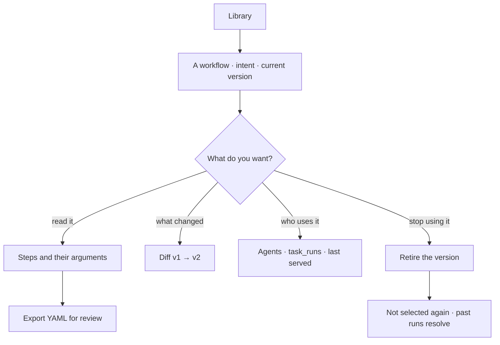

# Save a plan for reuse

Every workflow in the Graph, versioned, with what changed between versions and who uses each. A
published version is immutable, so the runs that used it stay readable.

> ⚠ **Rewritten for [orchestration § 0](../../../orchestration.md#0-the-records)** — `Todo` · `TaskPlan` ·
> `Task` · `TaskRun` · `Lens`. The words *Thought*, *Thinking* and *Step-as-a-record* are retired, and
> **`Task` now names a node inside a plan**, never a thing a user authored. Migration:
> [task-model-migration.md](../../../building-engine/task-model-migration.md).

| | |
|---|---|
| Index | [7.1](../../../README.md#7--workflows) · Slice **S12c** |
| Module | [Workflows](../spec.md) |
| API / CLI / Studio | 🟡 / — / 🟡 |
| Related | [plan-selection](plan-selection.md) · [promote-a-plan](promote-a-plan.md) · [run-a-workflow](run-a-workflow.md) |

> **As** someone whose agents keep doing the same job, **I want** the good version of that job saved
> and named, **so that** it is selected rather than reinvented every run.

## Capabilities

| # | Capability | Notes |
|---|---|---|
| C1 | Workflows listed with their intent | The intent is what selection matches on |
| C2 | Versions per workflow | Draft · published · retired |
| C3 | Immutable published versions | Changing publishes a new one |
| C4 | Diff against the previous version | Steps added, removed, reordered; argument changes |
| C5 | Usage | Which agents selected it, and which task_runs ran it |
| C6 | Retire a version | Not selected again; existing runs still resolve |
| C7 | Export as YAML | For review in a pull request, not as a second source of truth |
| C8 | Where it came from | Promoted from a run, or authored |
| C9 | Origin is shown | `builtin` · `authored` · `promoted`. Invana's own plans are listed here too ([F9](../spec.md)) |
| C10 | A published version is startable from its row | `Run` — the doorway is [7.5](run-a-workflow.md); this feature owns the list it sits on |

## Journey

## Seams

| Seam | What the user sees |
|---|---|
| A version in flight | Retiring it does not stop running task_runs |
| No usage | Listed as never selected, which is itself a signal |
| Two workflows with the same intent | Both listed; selection picks by closeness and records which |
| Retired everything | The intent falls back to generation, and the plan says so |

## Surfaces

| Surface | Shape |
|---|---|
| **Plans** drawer | The second drawer of the **Tasks** stack ([G33](../../../building-studio/graph-detail-page.md)), with its own search and filter. Name · intent · origin badge · version · used by · last served · `Run`. Filters: origin · kind |
| Plan detail | Behind the Plans drawer's breadcrumb: the versions, what changed, and who uses each. `Run` · `Edit as a draft` · `Retire` sit at its foot |
| **Plan dashboard** | `mainSection`, `board.kind = plan_runs` ([CV12](../../explore/features/boards.md)) — the same shell the run dashboard uses: version · served · succeeded · p50/p95 duration · cost per run · median hold; **the flow carrying per-task medians instead of statuses**; the plan's declared **Arguments**; and the runs of this plan |
| The flow | `mainSection` — the plan drawn as a canvas, read-only for a published version, editable for a draft ([7.7](draft-a-plan.md)). A task opens its [catalogue](the-catalogue.md) entry |
| Main area | The steps drawn (`kind = workflow`), with the diff beside them |
| Version bar | Versions with what changed and how each fared |

## Engine

| Thing | Shape |
|---|---|
| `task_plans` | `graph_id` · `name` · `intent` · `origin (builtin\|authored\|promoted)` · `status` |
| `workflow_versions` | `steps` · `created_from_run_id?` · `published_at`, immutable |
| Routes | `…/workflows*` · `…/workflows/{id}/versions*` · `GET …/workflows/{id}/export`. The start route is [7.5](run-a-workflow.md)'s |
| Events | `workflow.published · retired · exported` |

## Decisions

| # | Decision |
|---|---|
| LB1 | A published version is immutable. |
| LB2 | Retiring stops future selection, never a running run. |
| LB3 | Every version records its origin: **builtin**, authored, or promoted from a run ([F9](../spec.md)). |
| LB4 | YAML export is for review, not for round-tripping edits. |
| LB5 | **The library is the reusable plans, and origin is a badge on the row.** `builtin` · `authored` · `promoted` are three ways a row got here, not three lists — filtering by origin is one chip. |
| LB6 | **A generated one-off plan is not listed.** It belongs to its Todo (`task_plans.todo_id`), and it is read from the run that ran it — browsing plans that can never be selected again would make the library a log. Promotion ([7.4](promote-a-plan.md)) is how one enters this list, and that is the only door. |
| LB8 | **A draft is a fork, never an edit in place.** `Edit as a draft` copies the published version into a draft that nothing selects and nothing runs; publishing it mints the next version and leaves the old one readable ([7.7](draft-a-plan.md)). |
| LB10 | **A plan's dashboard answers *how has it behaved*, not *what is it*.** What it is, is the flow; how it has behaved is the aggregate over its runs — succeeded 12 of 14, p50 4.9s against p95 31s, the median minute spent held on `announce`. Both live on one dashboard because choosing to run a plan needs both. |
| LB9 | **Retire is a version-level act with a plan-level shortcut.** Retiring a version stops it being selected and startable; retiring every version takes the plan out. Neither stops a run in flight, and both leave existing traces resolvable. |
| LB11 | **Seeded means populated, not present.** A plan *is* its rows, so a library row with no Tasks is not a plan anybody can read or run. `ensure_seeded` therefore matches on identity *and* on having nodes: a row carrying a builtin's key and version but no Tasks is re-exploded from the registry rather than skipped. This is what makes migration `000000000038` safe — it carries the library across and drops `spec`, and the rebuild it relies on can only happen if *exists* and *exists and is populated* are told apart. |
| LB12 | **The registry seeds; the rows execute.** `resolve_plan` reads `task_plans` + `tasks` for the Graph — it never calls `template_for`. The registry is the *seed source* for builtins and nothing else, and `ensure_seeded` ([LB11](#decisions)) is the only bridge between the two. This is what makes *a plan is its rows* one sentence instead of two: before it, the library was true for reading and false for running, `TaskRun.task_id` could not be populated from the runtime, and a `plan_snapshot` froze a copy of a dict rather than a copy of the plan anybody could open. |
| LB13 | **A builtin's rows are read-only because they are now live.** Once rows execute ([LB12](#decisions)), editing a builtin row edits execution. So the library renders `origin = builtin` versions as read-only — `Edit as a draft` ([LB8](#decisions)) forks them into an authored plan, which is the only way a person changes what a builtin does. Re-seeding overwrites a builtin's rows on a version bump and never merges; a hand-edit to one is lost on the next boot, by design. |
| LB14 | **Three builtin loads ship; one waits.** `model-import@1` (`kind: import`), `bulk-load@1` (`kind: bulk`) and `stitch-apply@1` (`kind: stitch`) are seeded — their steps are catalogue primitives and the plan is what orders them. `bulk-load@1` is one step, `bulk_write`, and that entry declares **no `requires`**: the fast path writes *without* validating, and `write_graph` requires `validate_records`, so borrowing it would have a bulk load claim a validation it never ran. The fast path gets its own entry rather than a relaxed version of somebody else's. `bundle-import@1` still needs `map_over`: written flat it is a single-model load with a manifest check on the front, and its stitch resolves over a partial graph instead of once over everything ([load-a-bundle C5](../../bring-data-in/features/load-a-bundle.md)). **It is not seeded half-built**, because a plan that exists is a plan something can select. |
| LB15 | **The opening is not part of the plan, so its two rows name no node.** *Understand* and *Plan* are written from the agent's envelope before a plan is selected — they are how the run *reaches* a plan, so they cannot be nodes of it, and their `task_id` is null by construction. A trace therefore reads: two rows with no plan node, then every row of `nl-single@1` naming its own. **This is not [the M3 trap](../../../building-engine/task-model-migration.md) recurring** — a null `task_id` there meant a read returning zero rows forever; here it means the row predates the plan. It stops being null when M5 makes planning an ordinary `role = plan` run of the `plan-a-todo` plan ([orchestration § 0.4](../../../orchestration.md#04-where-a-taskplan-comes-from)). |
| LB16 | **The library lists `reusable: true` and nothing else, because a TaskPlan has exactly one owner** — see the table below. A library is a set of things you can *select*; a skill's plan is *granted by binding* and a Todo's is *drafted for one question*, so listing either would make *what can I run* unanswerable. A row does name the skill that owns it when one does, which is how the two stay legible without being merged. |

| Owner | How you tell | Reached from |
|---|---|---|
| **The library** | `reusable: true`, `key` set, no `todo_id` | the **Library › Plans** drawer |
| **A Todo** | `todo_id` set, `origin: generated` | the run that ran it — never browsable |
| **A skill version** | `skill_versions.plan_id` points at it | the skill's **Flow** tab ([LB7](#decisions)) |

| # | Decision |
|---|---|
| LB7 | **A skill's drawing is not listed here either.** Every published skill version *is* a TaskPlan ([orchestration § 0.8](../../../orchestration.md#08-a-skill-drawn-as-a-flow)), but it is edited, versioned and published as a skill — it is read under **Skills**, and this list would show the same row under a second name. |

## Not building

| Not building | Because |
|---|---|
| Importing a workflow from YAML | promotion from a run that served is the authoring path |
| Cross-Graph sharing | the Graph is the reasoning boundary |
| Branching versions | one line of versions per workflow is enough to reason about |
