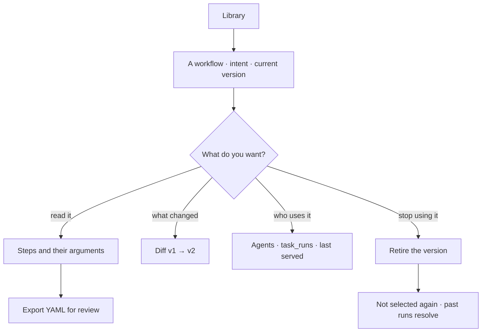

# Save a plan for reuse

Every workflow in the Graph, versioned, with what changed between versions and who uses each. A
published version is immutable, so the runs that used it stay readable.

> ⚠ **Rewritten for [orchestration § 0](../../../orchestration.md#0-the-records)** — `Todo` · `TaskPlan` ·
> `Task` · `TaskRun` · `Lens`. The words *Thought*, *Thinking* and *Step-as-a-record* are retired, and
> **`Task` now names a node inside a plan**, never a thing a user authored. Migration:
> [task-model-migration.md](../../../building-engine/task-model-migration.md).

| | |
|---|---|
| Index | [7.1](../../../README.md#7--workflows) · Slice **S12c** |
| Module | [Workflows](../spec.md) |
| API / CLI / Studio | 🟡 / — / 🟡 |
| Related | [plan-selection](plan-selection.md) · [promote-a-plan](promote-a-plan.md) · [run-a-workflow](run-a-workflow.md) |

> **As** someone whose agents keep doing the same job, **I want** the good version of that job saved
> and named, **so that** it is selected rather than reinvented every run.

## Capabilities

| # | Capability | Notes |
|---|---|---|
| C1 | Workflows listed with their intent | The intent is what selection matches on |
| C2 | Versions per workflow | Draft · published · retired |
| C3 | Immutable published versions | Changing publishes a new one |
| C4 | Diff against the previous version | Steps added, removed, reordered; argument changes |
| C5 | Usage | Which agents selected it, and which task_runs ran it |
| C6 | Retire a version | Not selected again; existing runs still resolve |
| C7 | Export as YAML | For review in a pull request, not as a second source of truth |
| C8 | Where it came from | Promoted from a run, or authored |
| C9 | Origin is shown | `builtin` · `authored` · `promoted`. Invana's own plans are listed here too ([F9](../spec.md)) |
| C10 | A published version is startable from its row | `Run` — the doorway is [7.5](run-a-workflow.md); this feature owns the list it sits on |

## Journey

```mermaid
flowchart TD
    A[Library] --> B[A workflow · intent · current version]
    B --> C{What do you want?}
    C -->|read it| D[Steps and their arguments]
    C -->|what changed| E[Diff v1 → v2]
    C -->|who uses it| F[Agents · task_runs · last served]
    C -->|stop using it| G[Retire the version]
    G --> H[Not selected again · past runs resolve]
    D --> I[Export YAML for review]
```

## Seams

| Seam | What the user sees |
|---|---|
| A version in flight | Retiring it does not stop running task_runs |
| No usage | Listed as never selected, which is itself a signal |
| Two workflows with the same intent | Both listed; selection picks by closeness and records which |
| Retired everything | The intent falls back to generation, and the plan says so |

## Surfaces

| Surface | Shape |
|---|---|
| **Plans** drawer | The second drawer of the **Tasks** stack ([G33](../../../building-studio/graph-detail-page.md)), with its own search and filter. Name · intent · origin badge · version · used by · last served · `Run`. Filters: origin · kind |
| Plan detail | Behind the Plans drawer's breadcrumb, it says what the plan **is**, and the page says how it behaves ([LB22](#decisions)). A `RecordHeader` naming the version — `nl-query@5` · `v5` · `published` — then four bands in this order: **The plan** (`key` · `origin` · `tasks` as `9 · 8 callables, 1 human` · what it `matches` · the bands it `engages`, as chips · `owner` · the agents that **may run** it) · **How it has behaved** (a 30-day runs sparkline, then `runs` · `served` · `p50` · `last run`, which links to that run) · **Used by** (the callers that inline it, each with what it tuned) · **Versions** (each version, what it changed, and its served rate). The footer holds `Run…` · `Edit as a draft` · `Retire…`. Drawn on every board of [The Plan Page](https://claude.ai/artifact/Pt7EHjT74GcDxpiQ3LDwy3) |
| Library row | `key@version` · the origin badge · what it is for · **the bands it will engage** · then *used by N callers*, or how often it ran where nothing inlines it. The spine is not chipped: every plan is dispatched by the runtime |
| **The plan page** | One `mainSection` page, `board.kind = plan_runs` ([CV12](../../explore/features/boards.md)). Under the pagehead: a tab strip, **Overview · Layers · Flow · Activity** ([LB24](#decisions)), with the `7 days ¦ 30 days ¦ 90 days` window on the right of the strip. Every number on the page is read over that window |
|  — **Overview** | The default ([LB33](#decisions)). Six tiles: runs · served · elapsed p50 · work p50 · cost per run · failed. Then **Runs a day** (served and failed, stacked), **Work p50, a day** (with each version's publish marked), **Each step, across N runs** (one row per step, and one per gate once the runtime has one: layer · ran in · p50 · p95 · failed · retried · cost/run · share of work), **Where it fails** and **Bounds it reaches**. Picking a step opens a card with its p50 · p95 · failed, where it is slow, and its slowest runs (`…overview.step`). A plan that has never run shows an empty state and the steps with nothing measured (`…overview.never_run`) |
|  — **Layers** | `LayerStrip` on `scale="seq"`: all five governed bands, bands open, each bar carrying its step's p50. Bounds are brackets and gates are seams ([LB17](#decisions) · [LB31](#decisions)) |
|  — **Flow** | [`TaskFlowCanvas`](../../../building-studio/task-flow-canvas.md), read-only. Each node carries its **medians, not a status**, because nothing ran *here* ([LB35](#decisions)). A node whose p95 is 4× its p50 or more is ringed; a step that runs in fewer than a quarter of runs is dim. Picking a node opens a card with its contract and how it has performed (`…flow.step`) |
|  — **Activity** | Every run that used this plan, newest first ([LB34](#decisions)): run · asked · called by · agent · status · elapsed · cost · when. Tiles above the table: running now · at a gate · called by · agents. Filters: status · called by · agent · version. A failed row names the step it failed at and why (`…activity.failed`). A row opens [the run page](../../operate/features/see-what-ran.md) |
| The draft's board | `board.kind = workflow`, a **different record** — its own tab in the strip, reached by `Edit as a draft` ([DP10](draft-a-plan.md#decisions)). Its switch is `Canvas ¦ manifest.yml`, not `Overview ¦ Flow`: a draft has never run ([C11e](draft-a-plan.md)) |
| The acts, and the artboard each opens | Tabs → `…detail.overview` · `…detail.layers` · `…detail.flow` · `…detail.activity` on [The Plan Page](https://claude.ai/artifact/Pt7EHjT74GcDxpiQ3LDwy3) · `Edit as a draft` → `…flow_canvas.edit` · `Run…` → [7.5](run-a-workflow.md). `⋯` on the plan page's header carries `Versions` → `…detail.versions` · `Arguments` → `…detail.arguments` · `Export YAML` → `…detail.export`, each opening its own page beside the plan's ([LB38](#decisions)). `Ceilings` → `…detail.ceilings` and the drawer's `Run…` · `Edit as a draft` · `Retire…` → `…detail.retire` are not drawn yet ([LB38](#decisions) · [LB25](#decisions)) |
| Main area | The steps drawn (`kind = workflow`), with the diff beside them |
| Version bar | Versions with what changed and how each fared |

## Engine

| Thing | Shape |
|---|---|
| `task_plans` | `graph_id` · `name` · `intent` · `origin (builtin\|authored\|promoted)` · `status` |
| `workflow_versions` | `steps` · `created_from_run_id?` · `published_at`, immutable |
| Routes | `…/workflows*` · `…/workflows/{id}/versions*` · `GET …/workflows/{id}/export`. The start route is [7.5](run-a-workflow.md)'s |
| A row read | `layers` (the bands it engages) · `caller_count`. A node carries its `form` and its `layer` |
| A detail read | plus `declared_layers` (`{layer, declared, steps, summary}` × 5) · `callers` (`{kind, name, skill_id, version, args}`) · `args_schema` |
| Where the band comes from | `runtime/layers.py` — one mapping from a catalogue `bound` to a governed `Layer` ([LB23](#decisions)) |
| A plan's runs | Root `task_runs` rows with `plan_origin = template:<key>@<v>`, plus the roots of skill runs whose plan inlined it, matched through `tasks.source_plan_key` ([LB36](#decisions)). Never `workflow_key`: that names the built-in flow that dispatched the run |
| `GET …/task-plans/{key}/performance` | Query: `window` (`7d` · `30d` · `90d`, default `30d`) · `version` (default: the one the header names). Returns `tiles` · `daily[]` · `publishes[]` · `steps[]` · `failures[]` · `bounds[]` · `slowest{step_key: run[3]}` — the shapes below. Feeds Overview, the Layers bars' p50 and the Flow nodes' medians |
| `GET …/task-plans/{key}/runs` | Query: `window` · `status` (a run-page word) · `called_by` (a `kind`) · `agent_id` · `version` · `cursor` · `limit` (50, ≤ 200). Returns `items[]` · `next_cursor` (an opaque offset; `null` on the last page) · `live` (`running` · `at_gate` · `called_by` · `agents`, over the whole window and unfiltered). Feeds Activity. A `window` other than `7d` · `30d` · `90d` is refused with a 422 |
| `GET …/task-plans/{key}/diff` | Query: `version` (default: the newest). This version against the one before it ([LB37](#decisions)). Returns `version` · `against_version` (`null` for v1) · `summary` · `added[]` · `removed[]` · `moved[]` · `changed[]` (`{step_key, fields[{field, before, after}]}`) · `unchanged[]` · `arguments[]` (`{name, change: added\|removed\|changed, before, after}`, each declaration whole). A version that does not exist is a 404 |
| Events | `workflow.published · retired · exported` |

**`performance`, field by field** ([LB33](#decisions) · [LB36](#decisions))

| Field | Shape | Read from |
|---|---|---|
| `tiles` | `{runs, served, elapsed_p50_ms, work_p50_ms, cost_per_run, failed}`, each `{value, prior}` — `prior` is the same measure over the window before | roots in the window |
| — `served` | `served / verified`, `null` when nothing was verified | the `verify_result` step's `output.served`, as `run_stats` reads it |
| — `elapsed_p50_ms` | `finished_at − queued_at` of a settled root | roots |
| — `work_p50_ms` | Σ `finished_at − started_at` over the root's step rows — time a step was running, never time it waited | step rows |
| — `cost_per_run` | mean Σ `cost_usd` over priced roots. A root is unpriced when a step row that spent tokens has no `cost_usd` (a row that spent none costs nothing); `null` when no root is priced | step rows |
| `daily[]` | `{date, served, failed, work_p50_ms}`, one row per day in the window, zeros included | roots, bucketed by `queued_at` (UTC) |
| `publishes[]` | `{version, published_at}` for the versions published inside the window | `task_plans` |
| `steps[]` | In plan order: `{step_key, layer, ran_in, p50_ms, p95_ms, failed, retried, cost_per_run, share_of_work}` | step rows whose `step_key` is a plan task's `key`. A row is a **reach** only once it has started: when a step fails the runtime closes the steps after it as failed without running them. Frame steps the plan does not carry (`understand` · `plan`) count toward a run's work and get no row |
| — `ran_in` | roots that reached the step ÷ roots | |
| — `retried` | share of the step's reaches where a failed attempt was followed by another. An attempt that answering a question added is not a retry | |
| — `share_of_work` | the step's Σ work ÷ all steps' Σ work | |
| `failures[]` | `{step_key, cause, count, last_run_id}`, largest first | a failed step row's `error.cause` — the last attempt only, so a retry that recovered is not a failure |
| `bounds[]` | `{step_key, bound, limit, used, exhausted}`. **`retry`** for each step whose limit is above 1 — the step's own `retry.max_attempts`, else the task's default (`runtime/workflows.py` `retry_limit`, the one the interpreter reads). **`max_clarifications`** for each step that recorded a limit — the agent's, so it is read off the rows (the largest seen). `loop` and `timeout_s` join when the runtime executes them | `retry`: `used` = reaches that retried; `exhausted` = reaches whose last attempt failed at the limit, not counting attempts a question added. `max_clarifications`: `used` = reaches that asked; `exhausted` = reaches whose last row names `output.bound = max_clarifications` |
| `slowest` | per step, its three slowest reaches: `{run_id, ms, when}` | step rows |

**`runs`, a row** ([LB34](#decisions))

| Field | Shape |
|---|---|
| `run_id` · `status` · `when` | `status` in the run page's words: `running` (queued or running) · `succeeded` · `failed` · `at a gate` (paused on a person — an approval or a question) · `cancelled` (stopped or cancelled) |
| `asked` | the Todo's text, else the root's `body` |
| `called_by` | `{kind, name, person?}`. `kind` is `skill` when a skill inlined the plan (named for the skill), else `session` when asked in one (named for its title), else what opened the run: `user` · `schedule` · `task` · `delegation`. `person` is the author's username |
| `agent` | `{id, name}` or `null` |
| `version` | the plan version the run executed — always the one asked for, since `version` selects which plan's runs are read |
| `elapsed_ms` · `cost` | as the tiles define them; `cost` `null` when unpriced |
| `failed_at` | `{step_key, cause, message}` on a failed row, else `null` |

## Decisions

| # | Decision |
|---|---|
| LB1 | A published version is immutable. |
| LB2 | Retiring stops future selection, never a running run. |
| LB3 | Every version records its origin: **builtin**, authored, or promoted from a run ([F9](../spec.md)). |
| LB4 | YAML export is for review, not for round-tripping edits. |
| LB5 | **The library is the reusable plans, and origin is a badge on the row.** `builtin` · `authored` · `promoted` are three ways a row got here, not three lists — filtering by origin is one chip. |
| LB6 | **A generated one-off plan is not listed.** It belongs to its Todo (`task_plans.todo_id`), and it is read from the run that ran it — browsing plans that can never be selected again would make the library a log. Promotion ([7.4](promote-a-plan.md)) is how one enters this list, and that is the only door. |
| LB8 | **A draft is a fork, never an edit in place.** `Edit as a draft` copies the published version into a draft that nothing selects and nothing runs; publishing it mints the next version and leaves the old one readable ([7.7](draft-a-plan.md)). |
| LB10 | **A plan's dashboard answers *how has it behaved*, not *what is it*.** What it is, is the flow; how it has behaved is the aggregate over its runs — succeeded 12 of 14, p50 4.9s against p95 31s, the median minute spent held on `announce`. Both live on one dashboard because choosing to run a plan needs both. |
| LB9 | **Retire is a version-level act with a plan-level shortcut.** Retiring a version stops it being selected and startable; retiring every version takes the plan out. Neither stops a run in flight, and both leave existing traces resolvable. |
| LB11 | **Seeded means populated, not present.** A plan *is* its rows, so a library row with no Tasks is not a plan anybody can read or run. `ensure_seeded` therefore matches on identity *and* on having nodes: a row carrying a builtin's key and version but no Tasks is re-exploded from the registry rather than skipped. This is what makes migration `000000000038` safe — it carries the library across and drops `spec`, and the rebuild it relies on can only happen if *exists* and *exists and is populated* are told apart. |
| LB12 | **The registry seeds; the rows execute.** `resolve_plan` reads `task_plans` + `tasks` for the Graph — it never calls `template_for`. The registry is the *seed source* for builtins and nothing else, and `ensure_seeded` ([LB11](#decisions)) is the only bridge between the two. This is what makes *a plan is its rows* one sentence instead of two: before it, the library was true for reading and false for running, `TaskRun.task_id` could not be populated from the runtime, and a `plan_snapshot` froze a copy of a dict rather than a copy of the plan anybody could open. |
| LB13 | **A builtin's rows are read-only because they are now live.** Once rows execute ([LB12](#decisions)), editing a builtin row edits execution. So the library renders `origin = builtin` versions as read-only — `Edit as a draft` ([LB8](#decisions)) forks them into an authored plan, which is the only way a person changes what a builtin does. Re-seeding overwrites a builtin's rows on a version bump and never merges; a hand-edit to one is lost on the next boot, by design. |
| LB14 | **Three builtin loads ship; one waits.** `model-import@1` (`kind: import`), `bulk-load@1` (`kind: bulk`) and `stitch-apply@1` (`kind: stitch`) are seeded — their steps are catalogue primitives and the plan is what orders them. `bulk-load@1` is one step, `bulk_write`, and that entry declares **no `requires`**: the fast path writes *without* validating, and `write_graph` requires `validate_records`, so borrowing it would have a bulk load claim a validation it never ran. The fast path gets its own entry rather than a relaxed version of somebody else's. `bundle-import@1` still needs `map_over`: written flat it is a single-model load with a manifest check on the front, and its stitch resolves over a partial graph instead of once over everything ([load-a-bundle C5](../../bring-data-in/features/load-a-bundle.md)). **It is not seeded half-built**, because a plan that exists is a plan something can select. |
| LB15 | **The opening is not part of the plan, so its two rows name no node.** *Understand* and *Plan* are written from the agent's envelope before a plan is selected — they are how the run *reaches* a plan, so they cannot be nodes of it, and their `task_id` is null by construction. A trace therefore reads: two rows with no plan node, then every row of `nl-single@1` naming its own. **This is not [the M3 trap](../../../building-engine/task-model-migration.md) recurring** — a null `task_id` there meant a read returning zero rows forever; here it means the row predates the plan. It stops being null when M5 makes planning an ordinary `role = plan` run of the `plan-a-todo` plan ([orchestration § 0.4](../../../orchestration.md#04-where-a-taskplan-comes-from)). |
| LB17 | **A plan's default drawing is the six layers it will touch, with time across and the participants it spends down.** The same picture serves two surfaces in two tenses — a **plan** declares what it will engage, and a **run**'s Layers tab shows what it did engage ([D5 · D20](../../../governance.md)). A skill's Flow tab and a run's Flow tab draw the plan's *shape* instead, on [`TaskFlowCanvas`](../../../building-studio/task-flow-canvas.md) ([SK16](../../skills/features/authoring-a-skill.md#decisions) · [SR32](../../operate/features/see-what-ran.md#decisions)). One drawing to learn, and *declared versus touched* becomes a comparison rather than two vocabularies. **A task is a bar on the row of the participant it spends**, not a column heading: a band says `llm`, its rows say `role: decide` and `model/Orders@v2`, and that list is what a world is checked against. The axis is the plan's own order (`step`); a run reads the same drawing on the wall clock (`elapsed`), which is why the Gantt is not a second view ([D20](../../../governance.md)). The node graph stays, as the **draft** view: wiring `depends_on` needs edges, reading what a plan costs you does not. Drawn as `library.plans.detail.overview` on [Govern, Agents and Skills](https://claude.ai/artifact/VrdrR5iKGfqsjhCouQDTbc). |
| LB20 | **A declared strip draws repetition as a bracket over a stretch of the axis; a run's strip unrolls it.** A layer strip has one axis and it is **time** ([LB17](#decisions)) — a run's is the wall clock, so iteration 2 is literally further right and needs nothing drawn. A **plan** has no clock, so its axis is `seq`, the plan's own order, and a bounded repetition is drawn as a **bracket** over the stretch of steps it spans, labelled with its condition and its ceiling: `loop · until: understood · max 3`. A bracket spans **steps, never tasks**: the bound is a property of a stretch of the order, and a task is a bar *inside* that stretch on the row of whatever it spends, so which participants a repetition re-spends is read down rather than guessed. **No arrow ever goes backwards** — the plan is acyclic and a cycle is a property of a node or a signal, never of an edge ([orchestration § 6.1](../../../orchestration.md#the-plan-is-acyclic-the-execution-is-not)), so what the strip draws is the bound. |
| LB21 | **The three repetitions get three marks, because they have three bounds.** `↻ iteration` is serial and bounded by `max_iterations`; `⟲ attempt` retries a *failure* and is bounded by `retry.max_attempts`; `⏸ ask` is a **pause**, not a repetition — the node suspends, holds no pool slot, and is bounded by `max_clarifications` on the envelope. A lane (`map_over`) is the fourth and draws as rows under its band, not as a mark. A bound that repeats **one step** rides that task's own bar — `⟲ retry 3 · on 429` sits on `fetch_filings`, because there is no column to hang it under and the step it bounds is the only thing it is about; a bound that spans a stretch of the axis is a bracket ([LB20](#decisions)). Collapsing them into one *×n* would hide the only thing a person needs: **which counter stops it**. Drawn as `SkillFlow` on [Govern, Agents and Skills](https://claude.ai/artifact/VrdrR5iKGfqsjhCouQDTbc). |
| LB18 | **A skill reuses a library plan through `uses`, never by sharing its row.** [LB16](#decisions) holds — a TaskPlan has exactly one owner — so *use this plan in my skill* inlines it as a step, the way `bundle-import@1` inlines `dataset-import@1`. `uses` expands **before** envelope validation ([13.8 § 4](../../platform/features/runtime.md)), so a composed plan cannot smuggle a step past a bound. Sharing the row instead would make a library edit silently change every skill that pointed at it, and break [SK5](../../skills/features/authoring-a-skill.md)'s guarantee that a version's plan can never be stale against its prose. |
| LB19 | **A plan declares arguments with defaults; a caller tunes them.** The plan is the reusable thing and the arguments are where a use case differs — so two skills may inline `escalate-core@2` with different `grace_days` and neither edits it, and neither is a fork. Tuning is therefore a **property of the call**, recorded on the calling plan, and *what this plan will do for me* is answerable without opening it. A caller that needs a different **shape**, not a different value, forks it — that is what `Edit as a draft` ([LB8](#decisions)) is for, and the split between the two is the whole reason arguments are declared. |
| LB27 | **An argument is declared on the plan and resolved at composition, so `${args.N}` never reaches the runtime.** `args_schema` is `{"<name>": {"type", "default", "label"}}` on a **reusable** plan, and its rows bind `${args.<name>}` the way they bind `${steps.X.y}`. The caller's tuned values — and the declared defaults for the names it leaves alone — are substituted into the copied rows when the plan is inlined ([SK32](../../skills/features/authoring-a-skill.md#decisions)), so the interpreter is handed literals and the binding grammar it already knows. `${args.N}` is legal only where `N` is declared, and a one-off plan declares none: nothing calls it, so nothing tunes it. A name that is not declared is refused **by name**, at save, beside the ones that are. |
| LB22 | **The plan panel names the version, then answers *what is it* in four bands, and *used by* means inlined.** It opens with the record — `key@version`, `v2`, `published` — because the drawer's trail carries the key alone and *which version am I reading* is the question every row under it is an answer to; a published version is immutable ([LB1](#decisions)), so the two are not interchangeable. A band is a **label over its rows**, never a bordered box and never ruled off: four cards stacked in a 420px column read as four containers inside a fifth, the drawer already has chrome, and a hairline under every band makes four boxes missing three sides. The bands are separated by air; the panel's one rule sits under the record line, and the only other rules in the drawer are between **list** rows. The bands are **The plan** · **How it has behaved** · **Used by** · **Versions**. The drawer says what the plan *is*; the page's tabs say how it behaves ([LB24](#decisions)), so the drawer keeps only a short *How it has behaved* summary, enough to answer *does this work?* without opening the page. The layer strip is not in the drawer; it is the page's **Layers** tab, where it has the width to be read. The bands the plan will engage are one `engages` row of chips in *The plan*. *Used by* is the **callers**: the skills that inline this plan through `uses` and the arguments each tuned ([LB19](#decisions)). An agent whose envelope lists the plan **may run** it and has not used it — that is a permission, it is a row in *The plan*, and answering the two in one list answered neither. The spine is not a band a plan declares: a plan does not engage the runtime, the runtime dispatches the plan, so the section says so in a line instead of drawing a sixth row. |
| LB23 | **The band a step sits in is derived from the catalogue, once, in the engine.** `runtime/layers.py` maps a catalogue entry's `bound` onto a governed `Layer` and every surface reads that one mapping — the skill's Flow tab, the bind check and the library. Deriving it in Studio would be a second copy of the catalogue written in a language that cannot see it, and the summary phrase (`2 steps` · `1 crossing` · `—`) is sent for the same reason. `cache` is the standing empty band: no catalogue entry spends it, so no plan can declare one. |
| LB24 | **A plan is one page with four tabs: Overview · Layers · Flow · Activity.** `plan_runs:<plan_id>` holds all four, and it reads the same way [the run page](../../operate/features/see-what-ran.md) does: a report header naming the record, a tab strip under it, and the tab's body under that. The run's tabs and the plan's tabs match where they can (Layers and Flow are the same components in the other tense), so going from a run to its plan changes the tense, not the layout. The tab is called **Flow**, not *Workflow*: a reusable plan *is* a workflow ([terminology](../../../terminology.md)), so a *Workflow* tab on a workflow's page would name the page, not the reading. The window (`7 · 30 · 90 days`) sits on the right of the tab strip and applies to every tab. It is **not** a second kind: [B10](../../../building-engine/boards-migration.md) settles that `plan` and `plan_runs` share a record rather than a renderer, and several panel sets on one kind is what a declared board is ([CV12](../../explore/features/boards.md)). Picking a plan in the Plans drawer opens this page for the key's newest version ([G42](../../../building-studio/graph-detail-page.md#1-decisions)); the header's `v1 ¦ v2` switch reads another version, and every tab follows it. The **draft** is not a tab. It is a different record on `workflow:<plan_id>`, opened as its own tab by `Edit as a draft` ([DP10](draft-a-plan.md#decisions)), and its switch stays `Canvas ¦ manifest.yml` ([DP2](draft-a-plan.md#decisions)). Drawn on [The Plan Page](https://claude.ai/artifact/Pt7EHjT74GcDxpiQ3LDwy3). |
| LB25 | **An artboard is named `module.feature.surface.variant`, and the name is the index.** `library.plans.list` · `library.plans.detail.overview` · `library.plans.detail.flow_canvas` · `library.plans.detail.flow_canvas.edit` · `library.plans.detail.flow_canvas.complex_variant1`. The file, the frame title and the row in [the-screens.md](../../../the-screens.md) are that one string, so a Surfaces row below and an artboard are reachable from each other without a lookup table. A variant is a **deeper name, not a new surface** — which is the rule that keeps the count down: two readings of one screen are `x` and `x.variant`, and if a drawing cannot be named this way it is a screen nobody has justified. The canvas lays out **one row per prefix**, parent leftmost. A board also carries **one line saying what it draws**, and that line is the same string in three places — the artboard's `<title>`, its frame title on the canvas, and its row in [the-screens.md](../../../the-screens.md) — so a reviewer never has to decide which description is current. The frame strip is canvas chrome, outside the 1440×900 drawing, so carrying it there is not a note on the artboard ([LB26](#decisions)). |
| LB28 | **A gate is a seam on the axis, and the side its label hangs on is what saying no costs.** Nothing is dispatched at a gate: it holds no pool slot, it has no form and it spends no participant, so it is not a bar — and it is not a row on the `human` band beside tasks that are all three. It stops every layer at once, which makes it a **moment**, and on a time axis a moment is a rule the bands are crossed by (`seams` on `LayerStrip`). There is no column for it to sit between, because task names are not the axis ([LB17](#decisions)). **Position is the price.** An **approval** sits at the leading edge of the step it gates and its label hangs to the right of the line — nothing has been spent, so declining costs $0.00 — the run replans, or stops `cancelled` when no replan is left ([runtime § 12](../../platform/features/runtime.md#12-the-approval-journey)). A **verdict** sits at the trailing edge of the pass and its label hangs to the left — the pass is already paid for, so declining buys the same pass again, and the `back(id)` stretch it re-opens is the bracket hanging off it ([LB20](#decisions)). A **clarification** is neither: it suspends one step mid-flight, so it is a mark on that task's own bar and never a seam. A person reads what declining costs from where the mark sits, before reading a word of it, which is how an approval and a verdict are told apart without a legend. Drawn as `library.plans.detail.flow_canvas.complex_variant2` and `…complex_variant3` on [Govern, Agents and Skills](https://claude.ai/artifact/VrdrR5iKGfqsjhCouQDTbc). |
| LB29 | **A gate that is not on the plan is dashed; one with no position runs the whole axis.** `requires_approval` lives on the **envelope** and its threshold is computed at dispatch, so the same plan is gated for a junior caller and open for a senior one ([runtime § 11](../../platform/features/runtime.md)). A strip that drew that solid would be lying for one of two callers, so a conditional gate is a **dashed** seam — *this may appear* — and the header says whose reading it is (`as seen by · declared — no agent`). A **budget exhaustion** is an approval the runtime raises rather than the plan declaring it, and it can come at any dispatch: it has **no position**, so it takes a dotted rule across the whole gates row and no vertical seam at all. Putting it on one moment would be a guess, and it is the one pause with no deadline. |
| LB30 | **The ceilings are read off the drawing where they bound a stretch, and off the panel where they do not.** A plan carries twenty-odd numbers and seventeen of them are `1`, a default, or both — a ceiling above one is the only kind worth a pixel. So a **spanning** bound is its bracket's own label (`⋔ map_over suppliers · ×200`), a **single-step** bound rides that task's bar ([LB21](#decisions)), and every per-band, per-call limit is one click away in the panel, where a number that *is* the default says so. The worst case is stated as a **product** — 200 lanes × 3 rounds × 3 attempts is 1,800 dispatches — because `max_parallel` bounds how many run at once and never how many run, and a readout showing only the pool would be quietly lying about the bill. Drawn as `library.plans.detail.ceilings`. |
| LB31 | **The Layers tab is the run's strip in the plan tense.** One component, two tenses, one axis ([LB17](#decisions) · [D20](../../../governance.md)): `LayerStrip` on `scale="seq"` here, on `scale="elapsed"` for a run. A plan has no clock, so its axis is its own order and a node's `depth` **is** that order. Two steps at the same depth wait on the same thing, not on each other, so they sit in the same slot. A step is a bar on the row of the catalogue entry it spends, and each bar carries that step's p50 over the window. Those rows are derived from the plan's own nodes rather than sent beside them, because the nodes are what the canvas draws and a second list would be a second truth. A band the plan never engages is **muted, not dropped** ([D22](../../../governance.md)): *this plan leaves the graph alone* is what someone opening a plan they did not write is checking for. The bands arrive **open**, because the tab has the width; `collapse all` folds each band's tasks onto its own line ([D21](../../../governance.md)). The spine is not a band; the legend says the runtime dispatches the rest. `brackets` and `seams` are left out rather than guessed ([DS15](../../platform/features/design-system.md)): a bracket waits on the runtime executing `tasks.loop`, which it stores and does not run, and a seam on the approval gate ([runtime § 11](../../platform/features/runtime.md), slice S15) — no plan declares either today ([LB20](#decisions) · [LB28](#decisions)). |
| LB32 | **A graph act is a one-callable builtin plan.** Each canvas or system act that reads or writes the graph ships as a `builtin` plan of one step — `stitch-commit@1` · `stitch-withdraw@1` today; `expand-neighbours@1` · `count-types@1` · `resolve-elements@1` · `test-connection@1` · `introspect-schema@1` as each lands. Read-only in the library, re-seeded at startup, and `ref:`-able from any flow like every reusable plan. |
| LB33 | **The Overview answers *how does this plan perform*, for the whole plan and for each step.** Six tiles: **runs** (a day, and the change on the window before) · **served** (of verified runs, never of all runs: *never asked* is not *asked and failed*) · **elapsed p50** · **work p50** · **cost per run** · **failed**. Elapsed and work are separate tiles because a plan with a person or a gate in it spends most of its elapsed time waiting, and one number would hide which part is slow. The charts obey one axis each: **Runs a day** stacks served and failed on a count axis, and **Work p50, a day** is a separate chart with each version's publish marked on it. They are never merged onto a dual axis. The **per-step table** is the reason the tab exists: one row per step, in plan order, with layer · ran in (the share of runs that reached it) · p50 · p95 · failed · retried · cost/run · share of work. A **gate** gets its own row between the steps it separates, with how often it was raised, how long it waited, and how often it was declined. Its share reads *waiting, not work*, because a gate spends nothing. A p95 at 4× its p50 or more is marked, since that spread is what makes a step unpredictable. The runtime has no approval gate yet — `tasks.approval` is stored and never read, and there is no `awaiting_approval` status — so gate rows are left out rather than drawn empty ([DS15](../../platform/features/design-system.md)); they arrive with the gate and its record ([runtime § 11](../../platform/features/runtime.md), slice S15). Picking a row opens a card with that step's numbers, where it is slow and its three slowest runs, each linking to its run page. **Where it fails** groups failures by step and reason; **Bounds it reaches** says how often each bound was used and how often it was exhausted, for the bounds the runtime honours today: `retry` per step, and `max_clarifications`, counted at the step that asked. A retry is a failed attempt followed by another; an attempt that answering a question added is not one. A step that asks records its round and the agent's limit on its row, and a step that ran out of rounds names the bound there, because an unattended run gives up with the same sentence and is not the bound. `loop` and `timeout_s` join when the runtime executes them. A **budget** is not listed: no money ceiling is enforced yet (`max_cost_usd_run` and `max_cost_usd_month` are drawn against, [EB13](../../agents/features/envelope-and-budget.md#decisions)), and when one is, its exhaustion is an approval ([orchestration § 0.10](../../../orchestration.md#010-budget--the-ceiling-that-pauses-instead-of-failing)) and joins with the gate rows. A plan that has never run shows no tiles and no charts, because a chart of zeros reads as a plan that failed. It lists the steps with every measure `—`, under an empty state offering `Run…`. |
| LB34 | **Activity is every run of this plan, and each row opens its run page.** The runs are the root `task_runs` that executed this plan ([LB36](#decisions)), newest first, over the page's window. A row says what was **asked** (the Todo's text), who it was **called by** (a session and its person, or the skill that inlined the plan), the **agent**, the status, elapsed, cost and when. Status wears the run page's words: `running` · `succeeded` · `failed` · `at a gate` · `cancelled`. A **failed** row adds a second line naming the step it failed at and why, so a list filtered to failures is a triage list without opening each run. Filters are status · called by · agent · version, and `version` is the one the header names. Status and called by are switches on the table's header; the agent is a picker beside them, because agents are named records and too many for a switch. It lists the agents that *may* run the plan and any agent seen running it in the rows loaded, shows each by name and filters by id (`agent_id`), and appears only when there is a choice to make. Four tiles above the table say what is live now (running · at a gate) and who the plan serves (called by · agents). The list pages with *Show 50 more* and does not scroll forever: the Overview's counts are the totals, and the list is for finding a run. No run yet: an empty state names who may run the plan and what would put a row there. |
| LB35 | **The Flow tab is `TaskFlowCanvas`, and the plan carries medians where a run carries statuses.** It is the same canvas and layout that a skill's Flow tab ([SK16](../../skills/features/authoring-a-skill.md#decisions)) and a run's Flow tab ([SR32](../../operate/features/see-what-ran.md#decisions)) use, so a plan, a skill that inlines it and a run of it all read as one drawing. The `workflow` kind renders on it and never on `WorkGraphCanvas`. A node's third line is its p50, plus the one fact worth a pixel: how often it runs if it is not every time, the failure rate if it is above zero, and p95 if its spread is wide. There is no status dot, because nothing ran *here*. The loop back is a dashed edge labelled with the share of runs that take it, the gate is a mark between the nodes it separates, and a branch few runs take is dim. `Circles ¦ Cards` is the canvas's own switch. Picking a node opens a card beside the canvas with its contract (task, after, feeds, args) and how it has performed. A step whose p95 is 4× its p50 or more is **ringed** in the warning tone (node state `wide`), and a step that runs in fewer than a quarter of runs is **dim**, with every edge into and out of it (state `rare`) — the canvas's own node and edge states, declared once in the taskflow `settings.json`, so a run's and a skill's Flow, which carry no states, are unchanged. The third line keeps its text as well: Circles draw only the icon and title, so the ring and the dimming are what they read, and Cards carry the numbers. It is read-only; `Edit as a draft` is the way to change it. |
| LB36 | **A plan's runs are the roots that executed it, whoever called it, and every number on its page is computed from their step rows.** A run names its library plan in `plan_origin` (`template:<key>@<v>`), never in `workflow_key`, which is the built-in flow that dispatched it. A skill that inlined the plan ran it too, so its roots count, matched through the copied rows' `tasks.source_plan_key` ([SK33](../../skills/features/authoring-a-skill.md#decisions)). They count toward the tiles, the daily charts and Activity (*called by* names the skill). They join the per-step table, the bounds and the slowest runs through `tasks.source_step_key`, the step each copied row came from, recorded when the skill copies the plan: a skill run's `nl_single_translate_thought` is this plan's `translate_thought` because the copy says so, never because the key ends that way. Only the rows copied from *this* plan join; the skill's own steps and another plan's do not. A skill whose copy has a row that names no source — copied before `source_step_key` existed — keeps its runs out of those three reads whole until the skill is saved again, which copies afresh: stripping the prefix would be the guess, and half a copy read step by step would say the other half was never reached. The tiles still read the skill run whole: whether a skill run's work p50 should count only this plan's steps is open. Percentiles are computed in the engine over the window's rows and not in SQL, because SQLite has no `percentile_cont` and a number that differs between dev and prod is two numbers. The page makes two reads: `performance` (everything Overview, Layers and Flow show, over one window and one version) and `runs` (Activity, paged by cursor). Activity is a list you find a run in, so it pages; the other three tabs are one answer, so they share one read. |
| LB37 | **A version says what changed against the one before it, step by step, matched by key.** A published version is immutable ([LB1](#decisions)), so *what changed* is a fact about two records and is computed once, in the engine, never in Studio. Steps match on their `key`: a step is **added**, **removed**, **moved** (its place in the plan order changed) or **changed**, and a change names each field — `task` · `form` · `after` (what it waits on) · one entry per argument, `before` and `after` — so `execute_graph_query.read_only` reads *was `true`, is now `${args.read_only}`*. A rename is a removal and an addition, because a library version is authored from a draft and a new key is a new step. The arguments the plan **declares** are compared too — one added, removed, or re-declared with a new type, default or label — because a caller tunes those ([LB19](#decisions)). v1 is compared against nothing, which is `against_version: null` and not an empty diff. The engine also writes the one-line `summary` the drawer's Versions band prints under each version (`+await_reply · send changed`, and `the first version` for v1), so the list and the board say the same thing; the full diff is the `⋯ Versions` board's. |
| LB38 | **`⋯` opens the readings that are not tabs, each as its own page.** The plan page keeps its four tabs ([LB24](#decisions)) because they are one question — *how does it behave* — read four ways. Versions, Arguments and Export YAML answer other questions — *what changed*, *what a caller may tune*, *what the engine holds* — so they sit behind `⋯` on the page's header and each opens a page tab beside the plan's (`plan_versions` · `plan_arguments` · `plan_export`, titled `nl-single@2 · versions`), the way a run row opens its run page. A page is a link and survives a reload; a fifth tab or a board inside the 420px drawer would be neither. **Versions** lists every version with what changed ([LB37](#decisions)) and how it fared, and picking one shows its diff against the one before, field by field. **Arguments** lists what the plan declares (name · type · default · what it decides) and who has tuned each, beside the plan's default and *a plan run on its own*, which reads the defaults ([LB19](#decisions)). **Export YAML** shows the version as `GET …/export` returns it, read-only, with `Copy` and `Download .yml`. None offers `Save report`: each is a record, not a reading over a window. **Not drawn yet**, rather than drawn disabled: `Run…` is [7.5](run-a-workflow.md) and `Edit as a draft` · `Retire…` are [7.7](draft-a-plan.md), both in slice S15, and a plan has no retired state for `Retire…` to write. `Ceilings` waits on a read that gathers them, and on the runtime honouring the ones it would list — `loop` and approvals are stored and not executed ([LB31](#decisions)). |
| LB26 | **An artboard draws only what a user would see.** No annotation cards, no rationale panels, no decision ids on the drawing — a reviewer reads the artboard beside this file, and the argument lives here. Copy a user really reads is UI and stays: an empty state's instruction, a refusal's reason, a confirm card's consequences. So a **state is drawn as the UI shows it** — a struck row, a dimmed act, a task marked `unknown` — never as a table explaining the state. This replaced nine explainer cards on this page with four list rows and two panels, which is also the honest test: if removing the notes leaves an artboard empty, it was never drawing a screen. |
| LB16 | **The library lists `reusable: true` and nothing else, because a TaskPlan has exactly one owner** — see the table below. A library is a set of things you can *select*; a skill's plan is *granted by binding* and a Todo's is *drafted for one question*, so listing either would make *what can I run* unanswerable. A row does name the skill that owns it when one does, which is how the two stay legible without being merged. |

| Owner | How you tell | Reached from |
|---|---|---|
| **The library** | `reusable: true`, `key` set, no `todo_id` | the **Library › Plans** drawer |
| **A Todo** | `todo_id` set, `origin: generated` | the run that ran it — never browsable |
| **A skill version** | `skill_versions.plan_id` points at it | the skill's **Flow** tab ([LB7](#decisions)) |

| # | Decision |
|---|---|
| LB7 | **A skill's drawing is not listed here either.** Every published skill version *is* a TaskPlan ([orchestration § 0.8](../../../orchestration.md#08-a-skill-drawn-as-a-flow)), but it is edited, versioned and published as a skill — it is read under **Skills**, and this list would show the same row under a second name. |

## Not building

| Not building | Because |
|---|---|
| Importing a workflow from YAML | promotion from a run that served is the authoring path |
| Cross-Graph sharing | the Graph is the reasoning boundary |
| Branching versions | one line of versions per workflow is enough to reason about |
