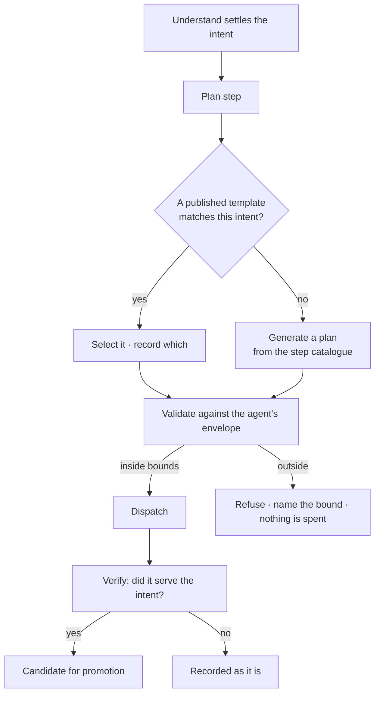

# Workflows — module spec

The plan a run executes. A **workflow** is a **reusable TaskPlan** — a named flow of Tasks; the
**plan** is the one chosen for this run. Plans are selected by intent, generated only when nothing
fits, validated against the running agent's bounds before anything is dispatched, and promoted back
into the library when they demonstrably served.

> ⚠ **Rewritten for [orchestration § 0](../../orchestration.md#0-the-records).** *Workflow* is now a
> **role**, not a record: it is a `TaskPlan` with `reusable = true`. `workflow_versions` is gone — a
> run freezes `plan_snapshot`, so a version table would record the same fact twice. Migration:
> [task-model-migration.md](../../building-engine/task-model-migration.md).

| | |
|---|---|
| Index | [§7 · Workflows](../../README.md#7--workflows) |
| Features | [the-library](features/the-library.md) · [plan-selection](features/plan-selection.md) · [envelope-validation](features/envelope-validation.md) · [promote-a-plan](features/promote-a-plan.md) · [run-a-workflow](features/run-a-workflow.md) · [the-catalogue](features/the-catalogue.md) · [draft-a-plan](features/draft-a-plan.md) |
| Depends on | [Agents](../agents/spec.md) (the envelope a plan is checked against) · [Ask](../ask/spec.md) (the step catalogue and the runtime) |
| Depended on by | [Ask](../ask/spec.md) (the `plan_queries` Task) · [Work](../work/spec.md) (a Todo runs a plan) · [Operate](../operate/features/schedules.md) (a schedule is a start on a cron) · [Bring data in](../bring-data-in/features/load-a-bundle.md) (a bundle load is one of these plans) |

## 1. Vocabulary

Product-wide words: [terminology.md](../../terminology.md). What this module adds:

| Noun | Is | Is not |
|---|---|---|
| **Workflow** | a `TaskPlan` with `reusable = true`, in the library | a record of its own · one run |
| **Template** | a reusable TaskPlan, selected by intent | a default |
| **Plan** | the `TaskPlan` this run executes — frozen onto it as `plan_snapshot` | a workflow |
| **Candidate** | a `generated` plan a Verify Task judged as serving | a template |
| **Catalogue** | the closed set of callables a plan may name by `step_key`, grouped by bound | a plugin registry |

**The plan's grammar is [orchestration § 5](../../orchestration.md#5-the-plan-is-data)'s, and this
module does not restate it.** A plan is a set of `Task` rows with declared `depends_on` edges, carrying
`when`, `map_over`, `loop`, `ref`, `approval`, `timeout_s` and `retry`. Branching and repetition are part of it: a
conditional stage is a `when`, an unhappy path is an `depends_on: [{step: x, on: failure}]`, and a cycle is
bounded on a node or in a signal, never on an edge. What this module owns is where a plan *comes
from* — the library, the selection, the validation and the promotion.

## 2. Where a plan comes from

| Rule | Detail |
|---|---|
| Selection beats generation | Generation is the fallback, not the default. A library that answers is cheaper and more predictable than one that regenerates. |
| Validation happens **before** dispatch | A plan outside the envelope costs nothing — it is refused with the step, argument or ceiling named. |
| The plan is recorded either way | Selected or generated, the plan and its origin sit in the trace. |
| Promotion needs a verdict | Only a Verify-passed plan is a candidate; a person still promotes it. |

## 3. What this module owns

| Owns | Shape |
|---|---|
| `task_plans` | `graph_id` · `key?` · `name` · `intent` · `kind` · `origin (authored\|generated\|promoted)` · `reusable` · `todo_id?` · `args_schema` · `source_skill_version_ids[]` |
| `tasks` | the plan's nodes — `task_plan_id` **NOT NULL** · `parent_id?` · `key` · `form` · `step_key?` · `depends_on[]` and the rest of the grammar |
| Plan record | on the run: `plan_snapshot` (frozen) and `plan_origin` (`authored:<id>` · `generated` · `reused:<id>`) |
| Validation result | which bound refused a plan, when one did |

**There are no plan versions.** A run freezes `plan_snapshot`, so editing a reusable plan reaches
every future run while past runs replay unchanged — which is exactly what a version table was for.
Builtins are the one exception to editing, below.

### The product's own plans are in here too

**Every plan the runtime walks resolves from this table — including the ones Invana ships.** A
builtin is seeded at migrate as a reusable plan the engine owns: `dataset-import`, `bundle-import`,
`bulk-load`, `stitch-apply`, the `ask` plans, and the two the planner itself needs — **`plan-a-todo`**
and **`check-criteria`** ([orchestration § 0.4](../../orchestration.md#04-where-a-taskplan-comes-from)). It is read-only in the
stronger sense — a person cannot edit it *or* publish a v2 of it, because the steps are bound to
catalogue entries the engine owns.

| Rule | Detail |
|---|---|
| A builtin is listed, not hidden | It appears in the library with its origin shown. Its diff and its usage read exactly like an authored one's |
| It is read-only | No editing, no retire. Reseeded on migrate; a deployment never diverges from the plan its engine implements |
| It is composable | `ref: task:dataset-import` inlines it. That is how a bundle load reuses a single-dataset load instead of copying its Tasks |
| It is promotable *from*, never *to* | A run that selected a builtin and served is not a promotion candidate — the plan is already in the library |
| Nothing else may hold a plan | A plan constant in a feature package is the defect [13.8 §3.1](../platform/features/runtime.md) names: `plan_origin` records a plan id, and one the library cannot resolve is a trace that cannot show what ran |

## 4. Versions and diff

| Surface | Shows |
|---|---|
| Library list | name · intent · kind · who uses it · last served |
| Diff | Tasks added, removed, reordered, and argument changes, against the plan as it was |
| Usage | every agent whose runs selected this plan, and every TaskRun that ran it |

## 5. Validation against the envelope

The join with [Agents](../agents/spec.md). The envelope is authored there; the check happens here.

| Refused when | The message names |
|---|---|
| A `step_key` is not in the agent's allowed set | the step key |
| An argument is not pinned as the envelope requires | the argument |
| The plan's projected cost exceeds the ceiling | the ceiling and the estimate |
| Depth or fan-out would exceed the parent's | the bound and the parent |
| The plan reads outside the agent's **lens** | the model version or stitch, and that it is *outside the lens* — not *cannot answer* |

A refusal is a first-class outcome, not an error: the run reports it, the Todo shows why, and nothing
is dispatched. **A generated plan is checked the same way** — that is the whole reason the catalogue
is closed ([orchestration § 0.6](../../orchestration.md#06-the-catalogue--what-a-plan-may-name)).

## 6. Cross-feature decisions

| # | Decision |
|---|---|
| F1 | A template is selected by intent; generation is the fallback. |
| F2 | Every plan is validated against the running agent's envelope before dispatch. |
| F3 | **There are no plan versions.** A run freezes `plan_snapshot`; editing a reusable plan reaches future runs and never rewrites past ones. |
| F4 | Only a Verify-passed plan is promotable, and a person promotes it. |
| F5 | The plan and its origin are part of the trace, always. |
| F6 | Workflows are Graph-scoped. Portability is a later question. |
| F7 | A workflow is **not** a kind. Running one produces a TaskRun whose `kind` is the plan's subject, recorded as `plan_origin = reused:<id>`. It appears in [Runs](../operate/features/see-what-ran.md) as one run, not as a category of its own. |
| F8 | A plan's nodes are **Tasks** — an LLM call, a query, a decision box, a graph algorithm. **None of them is a Todo**, none has a definition of done, and none gets its own top-level row in the journal. |
| F9 | **Every plan resolves from this library, including Invana's own** — `plan-a-todo` and `check-criteria` included. A builtin is a seeded, read-only plan, never a constant in a feature package. |
| F10 | A builtin is listed and composable but not editable: no edit, no retire, reseeded on migrate. Its Tasks are bound to catalogue entries the engine owns. |
| F11 | **A multi-stage load is an ordinary plan.** `bundle-import` inlines `dataset-import` per dataset with `ref`; ingestion gets no grammar of its own. [13.8 §3.2](../platform/features/runtime.md) |
| F14 | **A `TaskPlan` is one record, whatever drew it.** A plan drafted from a skill, generated for a Todo or authored by hand is the same table with a different `origin`. There is no `SkillPlan`: provenance is a column, not a type ([orchestration § 0.8](../../orchestration.md#08-a-skill-drawn-as-a-flow)). |
| F15 | **A skill version is drawn as exactly one plan** — `skill_versions.plan_id` is `NOT NULL`. If a playbook cannot be drawn as a flow, it is a [rule](../skills/features/rules.md), not a skill. |
| F16 | **A plan is a flow of Tasks, never of Todos.** Where one needs a person, that is a `form: human` Task — and if the person owns it beyond this run, the Task raises a Todo in [Work](../work/spec.md). |
| F12 | **A plan in the library is startable.** A person picks a published version, supplies its arguments and runs it ([7.5](features/run-a-workflow.md)). Reaching a deterministic plan only by asking a question the planner might match was the gap. |
| F13 | Starting by hand changes nothing downstream: the envelope check, the trace, the journal row and the pauses are the ones every other run gets. **A published version is still not editable** — editing forks a draft ([7.7](features/draft-a-plan.md) DP1). |
| F17 | **A plan is authored in Studio, by drafting.** A draft is a fork of a published version (or an empty plan), edited on the flow canvas or as `manifest.yml`, validated against the envelope, and published as the next immutable version ([7.7](features/draft-a-plan.md)). Promotion from a run that served ([7.4](features/promote-a-plan.md)) is still a door into the library — it is no longer the only one. |
| F18 | **The canvas and `manifest.yml` are two editors over one document.** The plan is data ([orchestration § 5](../../orchestration.md#5-the-plan-is-data)); the canvas draws that data and writes it back. Neither is the source of truth over the other, and there is no third representation to keep in sync. |

## 7. Deliberately absent

| Not built | Because |
|---|---|
| Editing a **published** version | a version is immutable, because the runs that used it have to stay readable. Editing forks a draft ([7.7](features/draft-a-plan.md)) |
| A free-form node editor — arbitrary shapes, notes, swimlanes | the canvas edits a plan, and a plan's grammar is closed ([orchestration § 5](../../orchestration.md#5-the-plan-is-data)). What cannot be expressed as a plan cannot be drawn on it |
| Running a draft | a draft has not passed publish, and `plan_origin` has to name a version a trace can resolve. Validate, publish, then run |
| A second plan grammar for ingestion | the plan graph of [13.8 §4](../platform/features/runtime.md) already carries order, failure branches, conditions, fan-out and gates (F11) |
| Auto-promotion on a passing verdict | promotion is a person's call; the verdict only makes it a candidate |
| Cross-Graph workflow sharing | the Graph is the reasoning boundary |
| Editing or versioning a builtin | its steps are bound to catalogue entries the engine implements; a divergent copy would name a plan the runtime cannot walk |
| Editing a published version in place | the runs that used it must stay resolvable |
