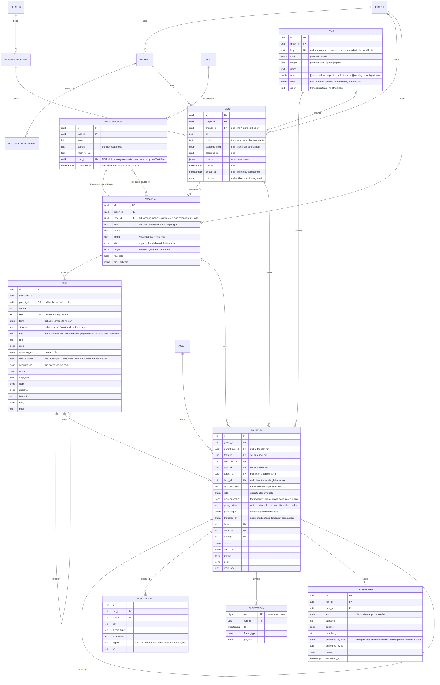
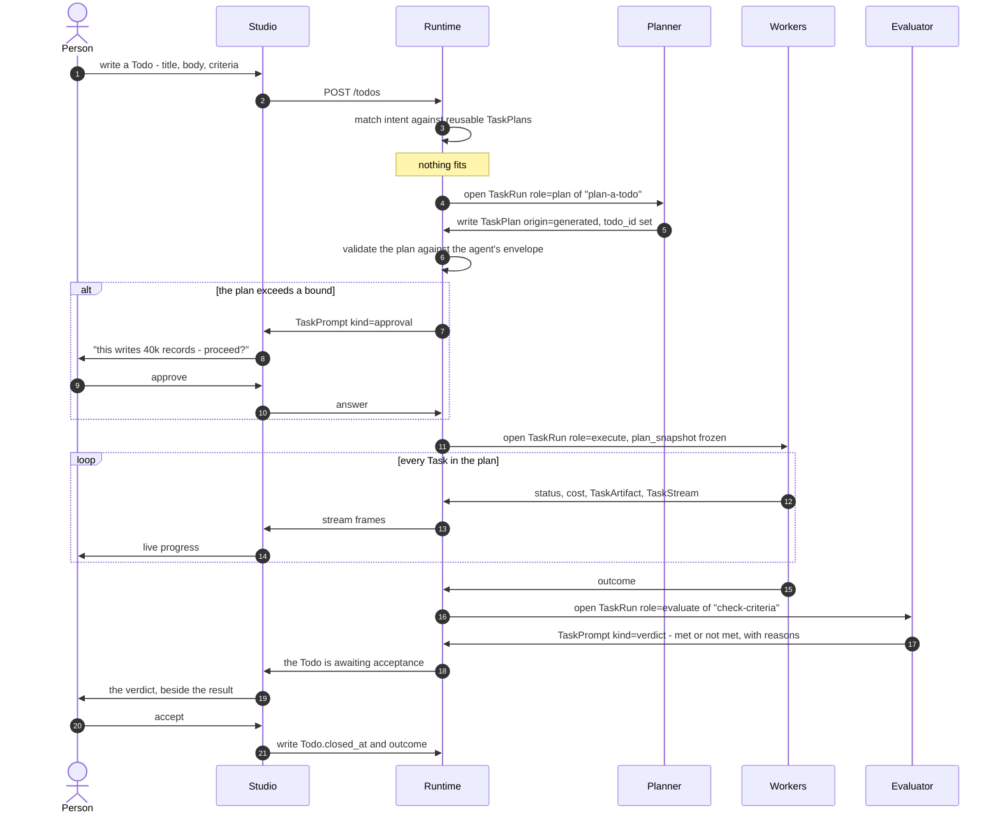
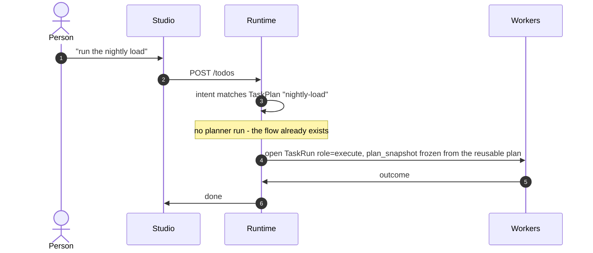
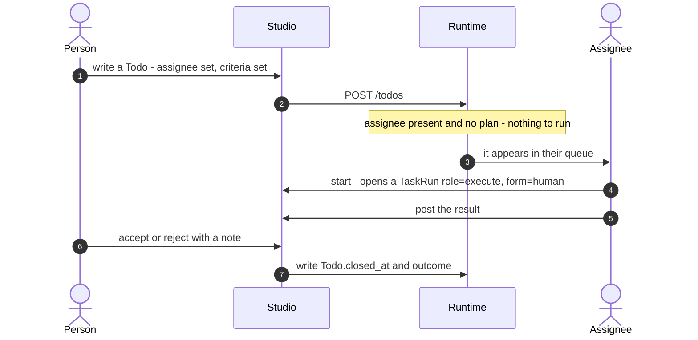
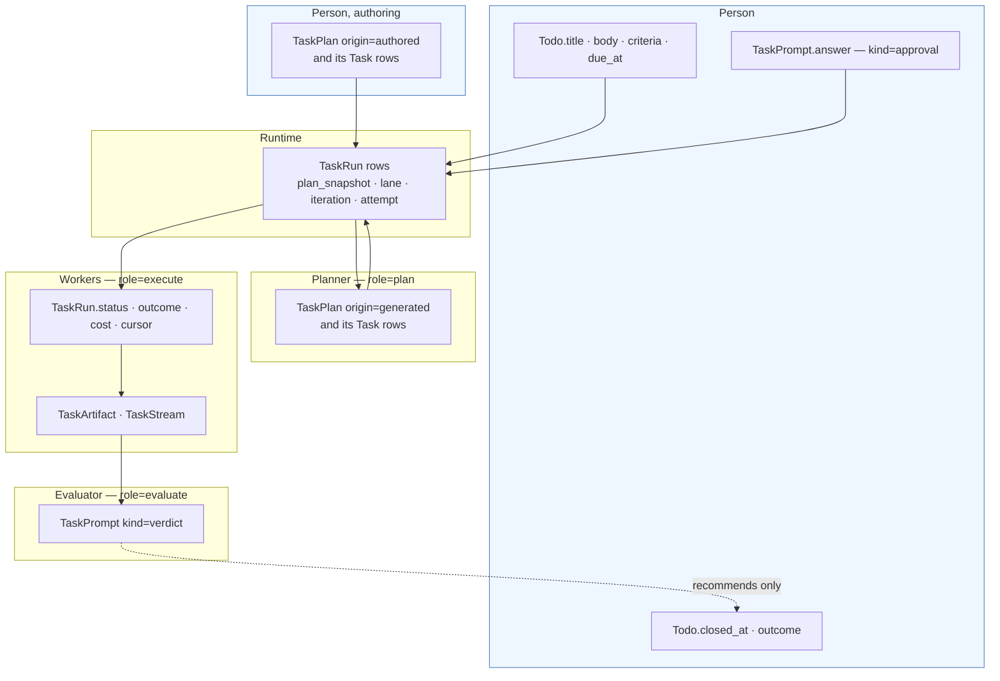
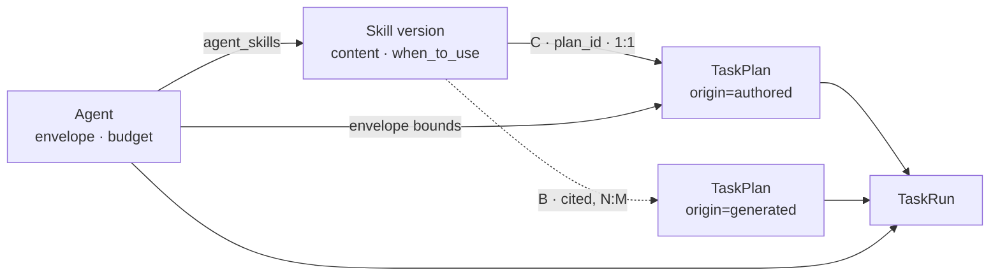
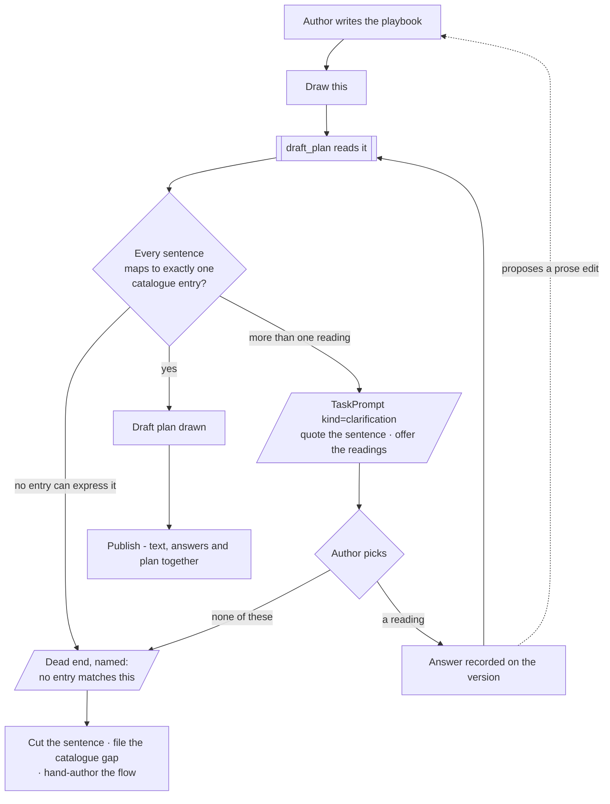

# Orchestration — the whole model, in one read

**Three records, one line.** A **Todo** is what a person wrote; a **TaskPlan** — authored, generated
or reused — is the flow of **Task**s that carries it out; a **TaskRun** is one execution of it.
**Nothing a user authors is ever a `Task`.**

> ⚠ **This document is ahead of the rest of `for-developers/`.** It states the model the product is
> moving to. The feature files under [modules/](modules/) still describe the older split — Thought ·
> Thinking · Step · Workflow · Project as five separate concepts — and none of them has been rewritten
> yet. Where the two disagree, this file is the intent and they are the present tense. §11 is the map
> between them.
>
> ⚠ **§0 is the current shape.** §1–§3 state the previous iteration — two nouns, with *project* and
> *workflow* as roles of `Task` — and have not been rewritten yet. Where §0 and §1–§3 disagree, §0
> is right.

---

## Contents

| § | | What it settles |
|---|---|---|
| **0** | **[The records](#0-the-records)** | **Todo · TaskPlan · Task · TaskRun · Artifact · Stream · Prompt — the ER diagram** |
| 0.4 | [Where a TaskPlan comes from](#04-where-a-taskplan-comes-from) | matched · authored · generated · none — and why the planner does not regress |
| 0.5 | [Swimlanes](#05-swimlanes--who-does-what-in-order) | the generated · matched · human paths, and who may write each field |
| 0.6 | [The catalogue](#06-the-catalogue--what-a-plan-may-name) | the closed set of callables, grouped by bound — and where to cut granularity |
| 0.7 | [Agents, skills and plans](#07-agents-skills-and-plans--three-things-composed-at-run-time) | why a skill is not a plan, the two links that are real, and where a DeepAgent fits |
| 0.8 | [A skill drawn as a flow](#08-a-skill-drawn-as-a-flow) | drafted automatically, published deliberately — and why staleness cannot happen |
| 0.9 | [Grounding a run — the lens](#09-grounding-a-run--the-lens) | what a run may **see**: model versions and stitches, pinned and frozen |
| 0.10 | [Budget](#010-budget--the-ceiling-that-pauses-instead-of-failing) | what a run may **spend** — and why the ceiling pauses and asks rather than failing |
| 0.11 | [Replan](#011-replan--changing-the-plan-under-a-live-run) | the plan can change mid-run — the frozen boundary is the **frontier**, not the plan |
| 1 | [The two nouns](#1-the-two-nouns) | Task · TaskRun, and why step · workflow · project are roles |
| 2 | [Task](#2-task) | the definition — `form`, `kind`, the tree, no status |
| 3 | [TaskRun](#3-taskrun) | the execution — the frozen plan, lane · iteration · attempt |
| 4 | [One example, all the way down](#4-one-example-all-the-way-down) | project → workflow → step → lane, in one vocabulary |
| 4.1 | [What is a Task — and what is not](#41-what-is-a-task--and-what-is-not) | the three-question test; what stays ordinary state |
| 4.2 | [A session is not a Task](#42-a-session-is-not-a-task) | chat, rethink, and predefined vs dynamic plans |
| 4.3 | [Every flow in the product, placed](#43-every-flow-in-the-product-placed) | import · bundle · bulk · stitch · model · ask · enrich · delegation |
| 4.4 | [Ingestion is not special](#44-ingestion-is-not-special) | no grammar, no table, no runtime of its own |
| 5 | [The plan is data](#5-the-plan-is-data) | the full grammar, `id` scoping, rows vs YAML |
| 5.1 | [What the runtime is, and what it is not](#51-what-the-runtime-is-and-what-it-is-not) | plan interpreter · policy engine; why not Airflow |
| 6 | [Three kinds of repetition](#6-three-kinds-of-repetition-and-they-nest) | lane · iteration · attempt, and the four cycle mechanisms |
| 7 | [Three kinds of pause](#7-three-kinds-of-pause) | clarification · approval · verdict, plus acceptance |
| **8** | **[Worked examples](#8-worked-examples)** | **nine full configs, one per kind — see below** |
| 9 | [Starting a run](#9-starting-a-run) | six triggers; run in place, never cloned |
| 10 | [Bounds](#10-bounds--every-ceiling-has-an-owner) | every ceiling and its owner; pools and backpressure |
| 11 | [What you can answer afterwards](#11-what-you-can-answer-afterwards) | six outputs, one consumer each |
| 12 | [What is actually built](#12-what-is-actually-built) | shipped vs designed vs waiting — **read this before planning work** |
| 13 | [What this replaces](#13-what-this-replaces) | eight tables → two; the retired words |
| 14 | [Where each decision lives](#14-where-each-decision-lives) | § → feature file → decision ids |
| 15 | [What is not decided](#15-what-is-not-decided) | the open questions, stated |
| — | [Not building](#not-building) | |

### The use cases

Nine configs in [§8](#8-worked-examples), one per shape — **every `kind` a Task can have**.

| § | Kind | Use case | Mechanisms it exercises |
|---|---|---|---|
| [8.1](#81-market-brief--research-until-good-then-ask-a-person) | `ask` | **Market brief** — a reusable plan | `loop` + `until` · `loop` + `verdict` · `replan` · `approval` · `accumulate` · `retry` |
| [8.2](#82-a-chat-ask--one-off-and-generated) | `ask` | **A chat ask** — one-off, generated | generated plan · clarification · `back()` · rethink · promotion |
| [8.3](#83-nightly-load--repair-what-you-can-escalate-what-you-cannot) | `import` | **Nightly load** — a data bundle | two failure branches · converging `depends_on` · conditional approval · `back()` · `stop` |
| [8.4](#84-bulk-load--the-degenerate-case) | `bulk` | **Bulk load** — unvalidated CSV | one callable, no children — the smallest legal Task |
| [8.5](#85-stitch-apply--staged-until-someone-commits) | `stitch` | **Stitch apply** — declare rules | a lane per rule · staged by default · a separately gated commit |
| [8.6](#86-model-upgrade--conditional-approval) | `model` | **Model upgrade** — the schema | `approval: {when: …}` · a capability halt · acceptance on the announce |
| [8.7](#87-supplier-sweep--fan-out-with-a-loop-inside-every-lane) | `enrich` | **Supplier sweep** — 200 lanes | `map_over` · **loop inside each lane** · `ref` in a fan-out · `pool` · composite child |
| [8.8](#88-enrichment--prove-it-on-a-sample-before-paying-for-the-rest) | `enrich` | **Sampled enrichment** — cost control | verdict gating cost · threshold `approval` · two `map_over`s |
| [8.9](#89-a-human-task--no-steps-at-all) | `work` | **A quarterly audit** — a person | no steps, no callables, no plan · `criteria` · acceptance |

| Looking for | Go to |
|---|---|
| A loop that stops on a **number** | [8.1](#81-market-brief--research-until-good-then-ask-a-person) `research` · [8.7](#87-supplier-sweep--fan-out-with-a-loop-inside-every-lane) `assess` |
| A loop that stops on a **person** | [8.1](#81-market-brief--research-until-good-then-ask-a-person) `draft` · [8.8](#88-enrichment--prove-it-on-a-sample-before-paying-for-the-rest) `judge_sample` |
| **Approval** before a write | [8.1](#81-market-brief--research-until-good-then-ask-a-person) `publish` · [8.5](#85-stitch-apply--staged-until-someone-commits) `commit` · [8.7](#87-supplier-sweep--fan-out-with-a-loop-inside-every-lane) `write_scores` |
| **Conditional** approval | [8.6](#86-model-upgrade--conditional-approval) `write_version` |
| **Clarification** — asking the user back | [8.2](#82-a-chat-ask--one-off-and-generated) `understand` |
| **Replanning** | [8.1](#81-market-brief--research-until-good-then-ask-a-person) `verify` · [8.2](#82-a-chat-ask--one-off-and-generated) `verify` |
| **Repair** — going back a step | [8.2](#82-a-chat-ask--one-off-and-generated) `validate` · [8.3](#83-nightly-load--repair-what-you-can-escalate-what-you-cannot) `verify_counts` |
| A **generated** plan, and promoting it | [8.2](#82-a-chat-ask--one-off-and-generated) |
| Raising work for a **person** | [8.1](#81-market-brief--research-until-good-then-ask-a-person) `file_gap` · [8.3](#83-nightly-load--repair-what-you-can-escalate-what-you-cannot) `triage` · [8.6](#86-model-upgrade--conditional-approval) `announce` · [8.7](#87-supplier-sweep--fan-out-with-a-loop-inside-every-lane) `notify_owner` |
| **Stopping** deliberately | [8.3](#83-nightly-load--repair-what-you-can-escalate-what-you-cannot) `halt` · [8.6](#86-model-upgrade--conditional-approval) `halt_unsupported` |
| A **staged** run with a separate commit | [8.5](#85-stitch-apply--staged-until-someone-commits) |
| All three repetitions **nesting** | [8.7](#87-supplier-sweep--fan-out-with-a-loop-inside-every-lane) `assess` |
| The **simplest possible** Task | [8.4](#84-bulk-load--the-degenerate-case) one callable · [8.9](#89-a-human-task--no-steps-at-all) no callable at all |

---

## 0. The records

**Nothing a user authors is ever a `Task`.** A person writes a **Todo**; a **TaskPlan** — authored,
generated or reused — is the flow of **Task**s that carries it out; a **TaskRun** is one execution.



### 0.1 Reading the dependencies

| Edge | Cardinality | Why |
|---|---|---|
| `Project → Todo` | 0..1 → many | A Todo needs no Project — the Graph's "No project" bucket ([work/spec.md](modules/work/spec.md)) |
| `Todo → TaskPlan` | 1 → 0..1 | **Optional both ways.** A Todo assigned to a person never gets a plan ([§8.9](#89-a-human-task--no-steps-at-all)); a reusable TaskPlan belongs to no Todo |
| `TaskPlan → Task` | 1 → many | The plan is the unit that is authored, versioned-by-freezing and reused. A Task has no life outside one |
| `Task → Task` | self | Nesting is inside the plan, never in the filing cabinet |
| `Todo → TaskRun` | 1 → many | Set on **root** runs only. Many runs per Todo: one to plan it, one to execute, one to evaluate |
| `Task → TaskRun` | 1 → many | Set on **child** runs. A `map_over` of 200 makes 200 runs of one Task |
| `TaskRun → TaskRun` | self | The only execution record there is — no separate step table |
| `TaskRun → Artifact · Stream · Prompt` | 1 → many | The three things a run emits that the run row must not hold |

### 0.2 Three rules the diagram encodes

| Rule | In the diagram |
|---|---|
| **A user authors Todos, never Tasks** | `TASK.task_plan_id` is `NOT NULL` — a Task cannot exist outside a plan, and a user never writes a plan node by hand |
| **Evaluation is a TaskPlan, not a property** | `TASKRUN.role = evaluate` — the evaluator is the same machinery, and `TASKPROMPT.kind = verdict` is what it produces. **It recommends; a person writes `TODO.closed_at`** |
| **History is never rewritten** | `TASKPLAN` is mutable and editing it touches no run; a **replan** appends a revision to `TASKRUN.plan_snapshot` and may never alter a settled node ([§0.11](#011-replan--changing-the-plan-under-a-live-run)). This is why `TaskPlan` needs no version table |

### 0.3 The names this pins

| Was | Is | Because |
|---|---|---|
| `TaskRun.plan` | `TaskRun.plan_snapshot` | `plan` otherwise names four things: the record, the frozen column, the planning **role**, and the `plan` callable in the ask flow ([§4.3](#43-every-flow-in-the-product-placed)) |
| `step_key: plan` | `step_key: plan_queries` | same collision, other end — the ask flow's step plans **queries**, and never emits a `TaskPlan` row ([§0.4](#04-where-a-taskplan-comes-from)) |
| `kind = work` | *(retired)* | Human-vs-machine is now Todo-vs-Task, a type. `kind` is subject only, on the TaskPlan |
| `thought_stream` | `TaskStream` | |
| `prompt_answers` | `TaskPrompt` | |

**Not tables:** a **log line** goes to OTel correlated by `run_id`, not to `task_logs` — it would be
the only one of [§11](#11-what-you-can-answer-afterwards)'s six outputs stored twice, and the
fastest-growing. An **event** stays `core/events`: a fact about a write with its principal, not
task-shaped. A **metric** is telemetry.

### 0.4 Where a TaskPlan comes from

**A reusable TaskPlan is what this product has been calling a workflow** — `workflows` and
`workflow_versions` collapse into it ([§13](#13-what-this-replaces)).

A Todo reaches a flow four ways, and **only one of them runs a planner**:

| Path | `TaskPlan.origin` | A `role=plan` run? |
|---|---|---|
| **Matched** — a reusable TaskPlan's `intent` fits the Todo | `authored` — reused as-is | no |
| **Authored** — the user drew the flow themselves | `authored` | no |
| **Generated** — nothing fit, so one is drafted | `generated`, `todo_id` set | **yes, one** |
| **None** — a person simply does it ([§8.9](#89-a-human-task--no-steps-at-all)) | — | no |

**Planning is a `role` on the run, never a `kind` on the plan.** `kind` is the *subject* — `import`,
`ask`, `enrich` — and planning is not a subject; making it one would put the planner in every
journal filter the subject is supposed to narrow.

```
Todo  "Which suppliers are at risk?"
 |
 +-- TaskRun  role=plan      of TaskPlan "plan-a-todo"      <- system, origin=authored
 |              writes a new TaskPlan  origin=generated  todo_id=<this Todo>
 +-- TaskRun  role=execute   of that generated TaskPlan
 +-- TaskRun  role=evaluate  of TaskPlan "check-criteria"   <- system, origin=authored
```

**The planner is an ordinary TaskPlan.** The only unusual thing about it is what its run writes: a
`TaskPlan` row rather than graph records. There is no planner service, and no runtime of its own.

| Rule | |
|---|---|
| **A generated plan always comes from an authored one** | `plan-a-todo` and `check-criteria` ship with the product as `origin: authored`. They are never themselves generated |
| **So the chain is one level deep, always** | authored → generated. Never generated → generated, which is what would regress |
| **The evaluator recommends; a person accepts** | A `role=evaluate` run writes a `TaskPrompt` of `kind = verdict`. Only a person writes `Todo.closed_at` ([§7](#7-three-kinds-of-pause)) |
| **Promotion closes the loop** | A generated plan that served is promoted — `origin: promoted`, `reusable: true`, `todo_id` cleared. The next matching Todo takes the *matched* path and never plans again |
| **A builtin is seeded, never registered** | The four plans Invana ships enter the library the same way any other does — as `task_plans` + `tasks` rows, `origin: authored`, published and read-only. **The runtime resolves every plan from rows**, so a builtin has no privileged path and the *matched* row above is the only one it ever takes ([the-library LB12–LB14](modules/workflows/features/the-library.md#decisions)) |

**Three things called plan, kept apart:**

| Name | Is | Emits |
|---|---|---|
| `TaskPlan` | the record | — |
| `TaskRun.role = plan` | a run whose job is drafting a flow | a `TaskPlan` row |
| `step_key: plan_queries` | a callable inside the **ask** plan | a query strategy — never a `TaskPlan` |

---

### 0.5 Swimlanes — who does what, in order

Five actors touch a Todo. Only one of them is a person, and **what a person alone may write is the
whole point of the last diagram.**

| Lane | Is |
|---|---|
| **Person** | the author of intent and the only acceptor |
| **Runtime** | the plan interpreter and policy engine ([§5.1](#51-what-the-runtime-is-and-what-it-is-not)) — it opens runs, freezes snapshots, enforces the envelope |
| **Planner** | a `TaskRun` with `role = plan` |
| **Workers** | `TaskRun`s with `role = execute` — agents and callables |
| **Evaluator** | a `TaskRun` with `role = evaluate` |

#### A. The generated path — nothing reusable fit



#### B. The matched path — a reusable TaskPlan fit

The planner lane never opens. This is the difference between *predefined* and *dynamic*
([§4.2](#42-a-session-is-not-a-task)), and it needs no new machinery.



#### C. The human path — no plan at all

[§8.9](#89-a-human-task--no-steps-at-all)'s test. Three lanes never open, and the Todo uses no field
it does not need.



#### D. Write authority — the lane that may write each field



**The dotted arrow is the seam.** An evaluator writes a verdict and stops there; `Todo.closed_at` has
exactly one writer. If that arrow ever becomes solid, an agent is accepting its own work
([§7](#7-three-kinds-of-pause)).

| Field | Written by | Never by |
|---|---|---|
| `Todo.title · body · criteria` | a person | anything else — this is the definition of a Todo |
| `TaskPlan` rows | a person *(authored)* or the Planner *(generated)* | a worker mid-run |
| `TaskRun.plan_snapshot` | the Runtime, at open | anyone, afterwards |
| `TaskPrompt.answer` where `kind = approval` | **a person** | an agent |
| `TaskPrompt.answer` where `kind = verdict` | an agent **or** a person | — |
| `Todo.closed_at · outcome` | **a person** | an agent, ever |

---

### 0.6 The catalogue — what a plan may name

**Yes: dynamic planning needs a vocabulary, and the vocabulary is the catalogue.** A generated plan
may only name `step_key`s that already exist — which is exactly what makes an envelope a real bound
rather than a suggestion ([§5.1](#51-what-the-runtime-is-and-what-it-is-not)). A planner that could
invent a callable could escape any ceiling.

But a closed catalogue and expressive plans are not in tension, because **the vocabulary has two
tiers and only the lower one is closed.**

| Tier | Is | Closed? | Named by |
|---|---|---|---|
| **Callable** | one act, one bound, one failure mode | **yes** — ships with the engine | `step_key: run_query` |
| **TaskPlan** | a composition of callables, already proven | **no** — grows by promotion ([§0.4](#04-where-a-taskplan-comes-from)) | `ref: task:nightly-load` |

**This is the answer to "how do plans get richer without the catalogue getting huge".** They don't
compose bigger callables; they compose plans. Every generated plan that served is promoted, and the
planner's vocabulary grows by one — while the set of things that can touch a database, a network or a
token budget stays exactly where it started.

#### What earns a catalogue entry

| Test | |
|---|---|
| It passes [§4.1](#41-what-is-a-task--and-what-is-not)'s three questions | observable steps · can fail halfway · worth a trace |
| It **declares typed outputs** | `when`, `until` and `${steps.x.y}` write against them. Undeclared outputs are an undocumented API |
| It consumes **exactly one bound** | the envelope check is per-callable; an entry spanning two bounds cannot be ceilinged |
| It is **not control flow** | `if` · `loop` · `map` · `retry` · `stop` are plan grammar ([§5](#5-the-plan-is-data)), never catalogue entries |

A declaration, which is also what closes [§15](#15-what-is-not-decided)'s *which outputs a callable exposes*:

```yaml
run_query:
  bound:    graph_read
  requires: [validate_query]          # a plan naming this must already order that before it
  args:
    query:  {type: str, required: true}
    params: {type: obj, default: {}}
  outputs:
    rows:      list                   # concatenated across lanes
    count:     int                    # summed across lanes
    truncated: bool                   # not exposed on a fan-out - bind it per lane
```

**The declaration does four jobs, which is why it is one artifact:**

| Read by | For |
|---|---|
| the **planner** | what may I name, and what must I order before it. This is a DeepAgent's tool description — the thing it plans against |
| the **validator** | is this plan legal, before anything is dispatched |
| the **interpreter** | how lane outputs roll up ([§5.1b](#51b-what-a-fanned-out-node-exposes)) |
| `when` / `until` / `${steps.x.y}` | what there is to bind |

**`requires` is declared here, not enforced elsewhere.** Putting it only in the envelope check would
make the planner draft blind, get refused and redraft — a retry loop paid for in tokens. Declared on
the entry, the planner reads it while drafting and writes the `depends_on` edge itself; the validator
enforces the same line.

#### The catalogue, grouped by the bound it spends

Grouping is not cosmetic — **the group is the thing the envelope ceilings.**

| Bound | Entries |
|---|---|
| *none* — pure data | `emit_table` · `read_artefact` |
| `network` | `fetch_source` · `test_connection` |
| `graph_read` | `run_query` · `introspect_schema` |
| `graph_write` | `write_records` · `write_properties` · `bulk_write` · `apply_stitches` · `commit_stitches` |
| `schema_write` | `diff_models` · `check_capabilities` · `publish_model_version` · `snapshot_model` |
| `ingest` | `check_bundle` · `import_dataset` · `validate_records` · `import_report` · `read_stitches` · `resolve_stitch_rule` |
| `llm` | `understand` · `plan_queries` · `translate` · `summarise` · `enrich_properties` · `judge` |
| `plan_write` | `draft_plan` — the only entry that writes a `TaskPlan` row |
| `work_write` | `spawn_agent` · `delegate` · `create_task` — an agent making a child, or work for a person |

Roughly twenty-five entries, and the count is meant to stay near it. Growth belongs in tier two.

**`work_write` is the bound delegation spends.** Making a child agent, opening a run under it and
filing a Todo for a person are the three acts that create work nobody has yet paid for, and they are
the ones [§0.10](#010-budget--the-ceiling-that-pauses-instead-of-failing)'s ceiling has to see. Left
unbounded they are the way a plan escapes its own budget by spending someone else's.

#### On granularity — where to cut

**Cut at the bound and the failure mode, not at the function call.** Your `download_file` and
`read_from_url` are one act — fetch bytes from somewhere, produce a `TaskArtifact`, fail on
network — so they are one entry, `fetch_source`, parameterised by scheme.

| Too fine | Too coarse | The grain |
|---|---|---|
| `open_connection` · `send_query` · `read_cursor` | `do_the_import` | `run_query` |
| `download_file` · `read_from_url` · `read_s3` | `ingest_everything` | `fetch_source` |
| `tokenize` · `call_llm` · `parse_json` | `answer_the_question` | `understand` |

Too fine and every generated plan re-authors the import flow, with a new way to get it wrong each
time. Too coarse and the envelope has nothing to ceiling, because one entry spends every bound.

#### Your example, placed

| You wrote | Is | Why |
|---|---|---|
| `download_file` · `read_from_url` | one entry — `fetch_source` | same bound, same failure mode |
| `execute_cypher_query` | `run_query` | dialect is a connector concern, not a catalogue one — Gremlin must not need a second entry |
| `understand_user_prompt` | `understand` | already in [§8.2](#82-a-chat-ask--one-off-and-generated); outputs `intent` · `entities` · `clarification_needed` |

#### And the planner itself

`role = plan` is a property of the **run**, never a `kind` on the plan ([§0.4](#04-where-a-taskplan-comes-from)).
The planner is an ordinary TaskPlan naming ordinary callables:

```yaml
key: plan-a-todo
origin: authored          # ships with the engine - never itself generated
kind: ask

steps:
  - id: understand   step_key: understand      # the Todo's prose in, intent out
  - id: draft        step_key: draft_plan      # bound: plan_write
                     depends_on: [understand]
```

The Runtime validates what `draft_plan` wrote against the envelope before opening any `role=execute`
run. **Validation is the Runtime's job, not a catalogue entry** — a callable that could approve its
own plan is the same hole as an agent accepting its own work.

---

### 0.7 Agents, skills and plans — three things, composed at run time

**A skill must not become a TaskPlan.** The whole Skills module rests on one axis — *offered, not
obeyed* ([skills/spec.md § 2](modules/skills/spec.md)) — and the gap between **offered** and
**applied** is the signal a person acts on. A TaskPlan has no such gap: the Runtime dispatches its
Tasks, and "the agent chose not to follow the plan" is not a state that exists. Merging them deletes
the distinction the module was built for.

But the intuition behind the question is right: **a skill's README often *is* a flow**, and writing it
twice — once as prose for the model, once as a plan for the Runtime — is a second source of truth.
The fix is a link, not a merge.

| | **Agent** | **Skill** | **TaskPlan** |
|---|---|---|---|
| Is | the **principal** that runs work | a **playbook**, offered | a **flow**, executed |
| Authored by | a person | a person | a person, or the planner |
| At run time | carries the envelope and the budget | enters the context, with an id | is frozen onto the run and dispatched |
| Can be ignored | — | **yes, and that is the point** | no |
| On the run | `TaskRun.agent_id` | *offered / applied*, per step | `TaskRun.plan_snapshot` |

#### The two real links

| | Link | Shape |
|---|---|---|
| **B** | A skill is **cited as a source** by a Todo's plan | `draft_plan` reads the bound skill versions; the generated plan records which. **Many skills → one plan** |
| **C** | A skill **is itself drawn as** a plan | **One version ↔ exactly one TaskPlan.** Binding the skill to an agent grants it |



**B and C compose.** A skill that ships a plan is matched, not planned; a skill without one is prose
the planner reads. Both stay offered — an agent given a skill with a plan may still answer without
running it.

#### The columns

| Column | On | Means |
|---|---|---|
| `plan_id` | `skill_versions` | **NOT NULL, UNIQUE — exactly one plan per version.** On the version, not the skill: a skill is versioned because what was *offered* must be reconstructible, and the plan is part of what was offered |
| `source_skill_version_ids[]` | `TaskPlan` | which playbooks the planner read when `origin = generated`. Provenance, not a dependency |
| `agent_skills` | *(unchanged)* | binding a skill grants the plan its current version is drawn as |

| Rule | |
|---|---|
| **A binding is refused if the plan escapes the envelope** | Binding a skill whose plan names a `step_key` the agent may not call fails **at bind time, with the bound named** — never silently at run time ([agents/spec.md § 2](modules/agents/spec.md), *bounds nest*) |
| **A drawn plan is still only offered** | Every version has a plan; having one does not make the agent run it |
| **Promotion is the only way a generated plan becomes reusable** | Otherwise N skills × M phrasings produces a drawer of near-identical generated plans ([§0.4](#04-where-a-taskplan-comes-from)) |

#### A new, sharper offered-vs-applied signal

Today the gap is self-reported: a step says it applied a skill. With **B**, there is a second reading —
did the plan the planner drafted from that skill actually name the steps the skill describes? A skill
whose playbook is never reflected in a plan is a skill that needs rewriting, and nothing had to
self-report for you to see it.

#### Where the agent sits — it is the principal, not the orchestrator

**The Runtime interprets plans; the agent does not**
([§5.1](#51-what-the-runtime-is-and-what-it-is-not)). An agent supplies four things and no loop:

| The agent supplies | Bounds |
|---|---|
| provider + model | which endpoint an `llm` callable spends against |
| **envelope** | which `step_key`s a plan may name, and which reusable TaskPlans it may `ref` |
| budget | what a run may spend, and what happens at the ceiling |
| bindings + instructions | what enters the context |

**The envelope is the bridge.** A generated plan is checked against it before any `role=execute` run
opens, which is precisely why the catalogue is closed ([§0.6](#06-the-catalogue--what-a-plan-may-name)).

#### Where a DeepAgent fits

A DeepAgent-shaped agent is **an agent whose plans are always generated rather than matched**. It is
not a second mechanism — every primitive of that pattern already has a home here:

| DeepAgent primitive | Here | What changes |
|---|---|---|
| a `write_todos` planning tool | `draft_plan` → a **TaskPlan** row | durable, queryable and envelope-checked — not an in-context list that dies with the window |
| spawning sub-agents | **delegation** — a child TaskRun with bounds ⊆ its parent's | the child cannot widen what the parent was given |
| a virtual filesystem / scratchpad | **TaskArtifact** | addressable by digest, and it survives the run |
| the system prompt | **Skill** (offered) + `Agent.instructions` | versioned, so a trace can say what was offered |
| the agent loop | **the Runtime** | — |

**The one real difference, and it is the whole design:** in the DeepAgent pattern the loop lives
*inside* the model — it decides, acts and re-decides in context. Here the loop lives *outside* it: the
model proposes a plan, and the Runtime executes it.

| Loop inside the model | Loop outside it |
|---|---|
| The todo list is context — it cannot be ceilinged | The plan is a row — it is validated before anything runs |
| The trace is the transcript | The trace is `TaskRun` · `TaskArtifact` · `TaskStream` |
| "Stop after 40k writes" is a prompt | It is an envelope bound that refuses |
| A good run cannot be reused | It is promoted ([§0.4](#04-where-a-taskplan-comes-from)) |

That is the trade: the model gives up the freedom to improvise mid-flight, and the product gets a
bound that holds and a run it can replay. An agent that must improvise still can — its plan is
regenerated per run ([§8.2](#82-a-chat-ask--one-off-and-generated)) and `replan` exists — but the
improvisation produces a plan, and the plan is checked.

---

### 0.8 A skill drawn as a flow

**Draft it automatically; publish it deliberately.** When a playbook is edited, a `role=plan` run
redraws it — debounced, into a draft. The picture is worth having for a reason that is not
decoration: **the drawn flow is a comprehension check on the prose.** If the flow reads wrong, the
prose was ambiguous, and you found out before an agent did.

What must not happen is the other half: a plan that goes live because someone fixed a typo.

| | |
|---|---|
| Drafted | on every edit, automatically, into the **unpublished** version |
| Published | with the skill version — **one act, not two** |
| Runnable | only once published |

#### Staleness is impossible by construction

The question *"if the instructions change, do we regenerate the plan?"* has a shape that makes it
disappear. **The plan hangs off the `skill_version`, not the `skill`** — and a published version is
immutable ([skills/spec.md](modules/skills/spec.md)).

| Naive shape | This shape |
|---|---|
| plan on `skills`; prose mutable | plan on `skill_versions`; prose frozen at publish |
| needs a `stale` flag | cannot be stale — the prose it was drawn from is still sitting there |
| needs a reconciliation job | change the prose → new version → new plan |
| "which runs while stale?" | v1 runs v1's plan, forever |

| Rule | |
|---|---|
| **A hand-edit flips `origin` to `authored`** | Redrawing from prose afterwards is offered, never automatic, and names what it will discard |
| **Exactly one plan per version — never zero** | `skill_versions.plan_id` is `NOT NULL`. There is no *does this skill have a flow?* branch to write, in the engine or in any surface |
| **`form: human` is the universal fallback** | This is what makes *never zero* safe. Anything the catalogue cannot express, a person can — *email the supplier* becomes a `human` Task. A catalogue gap therefore never blocks publishing a playbook |
| **A shipped plan is still offered** | Drawing a playbook does not make an agent run it ([§0.7](#07-agents-skills-and-plans--three-things-composed-at-run-time)) |

#### Not `SkillPlan` — `TaskPlan`

The temptation is to name it for where it came from. Don't:

| | |
|---|---|
| It is the same record | same columns, same Runtime, same `plan_snapshot`, same envelope check |
| A second type would have to stay in sync forever | and the first time a `SkillPlan` needed `map_over`, it would grow one |
| And the name runs out | what is a plan promoted from a chat ask, or drawn from a bundle manifest? |

**Provenance is a column, not a type** — `TaskPlan.source_skill_version_ids[]` already says where it
came from. This is the same argument that keeps *Project* a record and *step* a role
([§0.2](#02-three-rules-the-diagram-encodes)).

#### One version, one plan — and what that sharpens

**A skill version is drawn as exactly one TaskPlan.** Not *may have*: `plan_id` is `NOT NULL`, so the
Flow tab is always there and no surface branches on its absence. The draft plan exists from the first
draw, beside the draft version, and the two publish together.

This lands a boundary the Skills module already drew but could not enforce
([skills/spec.md § 2](modules/skills/spec.md)):

| | Skill | Rule |
|---|---|---|
| Is | a **playbook** — how to approach something | one **statement** — what is true |
| Has steps | yes, and now that is checkable | no |
| Drawn as a plan | **always** | never |

**If it cannot be drawn as a flow, it is not a skill — it is a rule.** *"Prefer supplier names over
ids"* has no steps and never did; it was always a `rules` row. The 1:1 turns a distinction that relied
on the author's judgement into one the product can hold.

| The two skill↔plan relationships, kept apart | |
|---|---|
| `skill_versions.plan_id` — **1:1, owned** | this playbook, as a flow |
| `TaskPlan.source_skill_version_ids[]` — **N:M, cited** | the playbooks a *Todo's* generated plan was drafted against ([§0.7](#07-agents-skills-and-plans--three-things-composed-at-run-time)) |

#### It reuses the plan canvas

The drawing is a `TaskPlan`, so it is drawn by the surface that already draws one — screen 34
`WorkflowStepHiFi` ([the-screens.md](the-screens.md)), as a **Flow tab** on the skill panel. A bespoke
editor for skills would be a second thing that draws plans, and it would drift.

#### The loop is the bug — ambiguity stops and asks

The journey has a cycle in it — *the flow reads wrong, so rewrite the prose* — and that cycle is not
something to make faster. **It is something to not enter.**

The loop only exists because the planner guessed. It read an ambiguous sentence, picked a reading,
drew it, and left a person to notice. That is the wrong division of labour: **the planner knows it was
ambiguous, and the author does not know which sentence caused what.** Drawing a guess moves a question
the planner could ask into a picture a person has to decode.

So `draft_plan` does not resolve ambiguity. **It pauses.**

| | |
|---|---|
| Mechanism | a `TaskPrompt` of `kind = clarification` — the first of [§7](#7-three-kinds-of-pause)'s three pauses |
| State | the `role=plan` run sits in *awaiting a person*; **no plan is written yet** |
| Surface | the question is asked against the sentence, in the editor, not in a separate queue |



#### What makes the question worth answering

A clarification that says *"this is ambiguous"* is no better than a wrong picture. Three rules:

| Rule | |
|---|---|
| **Quote the span, never the playbook** | The question names one sentence. `Task.source_span` is what makes that possible |
| **Offer the readings, not an open box** | Two or three concrete readings, each naming the `step_key` it would produce — plus *none of these*, which is how a dead end gets reported |
| **Ask at most a few per draft** | A planner that asks twenty questions has failed as surely as one that guessed. Past the cap it is a dead end, and hand-authoring is offered |

**Ambiguity is a declared condition, not a feeling.** The planner asks when a span matches **more than
one** catalogue entry, or **none**. Both are checkable, which is what keeps this from becoming a model
that asks whenever it is unsure ([§0.6](#06-the-catalogue--what-a-plan-may-name)).

#### The answer repairs the playbook, not just this draft

An answered clarification is recorded on the version — so a redraw never re-asks — **and it proposes
the prose edit that would have avoided the question.** The author can take it or leave it.

Without that, the prose stays ambiguous forever: every new version re-asks, and the playbook never
learns. With it, the loop the author was going to run by hand happens once, with the planner naming
the exact sentence and offering the words.

#### When a plan was drawn and is still wrong

Ambiguity is the common case; a confident misreading is the rest. Two properties catch it without a
guessing loop:

| # | Property | Without it |
|---|---|---|
| **1** | **Every step names the prose it came from** — `Task.source_span` | *"the flow is wrong"* is the only diagnosis, and the author edits by guessing |
| **2** | **A redraw is a revision, not a fresh draft** — the previous plan goes back to `draft_plan`, and the result is shown as a diff ([the-library](modules/workflows/features/the-library.md)) | Non-determinism reads as a bug: the same edit twice draws two pictures, and neither is wrong |

With spans, the canvas answers the question the author actually has:

| What the canvas shows | Means | The fix |
|---|---|---|
| A sentence with **no step** | the planner could not act on it | a wish, not an instruction — or a catalogue gap |
| A step with **no sentence** | the planner invented it | the prose is under-specified |
| A sentence mapped to the **wrong step** | it was read differently than meant | rewrite *that sentence* |

| Not building | Because |
|---|---|
| Generating **prose from a hand-edited flow** | two generators pointing at each other is a drift machine, and neither side stays authoritative |
| Redrawing on every keystroke | half a sentence is not an instruction; a flow drawn from one is misleading feedback, not live feedback |
| A free-text answer to a clarification | it is a second way to write the playbook, in a box that is not the playbook |

The authoring journey, its seams and decisions **SK5–SK8** live where the feature does:
[skills/features/authoring-a-skill.md](modules/skills/features/authoring-a-skill.md).

---

### 0.9 Grounding a run — the lens

**Three bounds, three questions.** Two of them already exist; the third is what grounds a run in a
particular shape of the world.

| Bound | Answers | Owned by |
|---|---|---|
| **Envelope** | what it may **do** — which `step_key`s, which pinned arguments | [Agents](modules/agents/spec.md) |
| **Budget** | what it may **spend** | [Agents](modules/agents/spec.md) |
| **Lens** | what it may **see**, **use** and **send** — across five layers | [Govern](modules/govern/spec.md) |

A **lens** narrows **five layers**, not one: `graph data` · `llm` · `third party` · `cache` ·
`human` ([govern/spec.md](modules/govern/spec.md)). Its `graph data` rules are what this section
originally described alone — a narrowing of the [global model](terminology.md), the read-time union
of every published model plus its links — pinned for one run.

```
Lens
├── kind        guardrail | world          -- one record, two jobs (GV1)
├── key         null = private to its run  -- naming it shares it (GV2)
├── rules[]     { match, allow, properties, select, egress }
│                over addresses: graph_data/model/… · llm/<provider>/<model>
│                · third_party/{api,app,db,agent}/… · cache/… · human/…
├── cast        role -> model address      -- innermost wins, then checked
└── as_of?      transaction time           -- valid time is select.time
```

#### What each layer's rules narrow

The grammar is one shape over every layer — a rule matches an **address** and allows or denies it —
so there is one mechanism to learn, not five ([GV4](modules/govern/spec.md)).

| Layer | A rule names | And may also carry |
|---|---|---|
| `graph data` | a model version, a declared stitch, a dataset | `properties.exclude[]` (structural, per property) · `select` (extensional: `time` · `geo` · `dims`) |
| `llm` | a configured provider, or one model under it | `egress.may_send[]` — a hosted model is a boundary crossing |
| `third party` | an `api` · `app` · `db` · `agent` | `egress.may_send[]`. **No selector** — we do not slice what we did not curate ([GV13](modules/govern/spec.md)) |
| `cache` | one of the four caches | `max_age_s`. Denying them all forces the flow to be walked |
| `human` | a person or a role | `may_ask` · `max_rounds` — a 3am run should not park waiting for someone asleep |

**The `agent` band is not a layer.** It is the spine — the runtime doing the participating. It is
already bounded by the envelope and the budget, and a third bound on one thing is what
[§2 of govern](modules/govern/spec.md) refuses.

#### Three grains, enforced in three places

Narrowing `graph data` is not one act:

| Grain | Removes | Enforced by | *Cannot answer* reads |
|---|---|---|---|
| **type** | a model, a type, a relationship | the schema handed to the generating model, and the validator | *this world has no Publisher* |
| **property** | one property of a type | the same, **plus the connector rewriting a whole-node return** into the permitted projection | *this world does not carry revenue* |
| **records** | rows | the connector **composing the predicate** into the query it executes | *outside the slice — H1 2026 only* |

**Nothing is honoured by filtering afterwards.** Rows that come back and are dropped leave the
counts, the aggregates and the schema the model saw all outside the slice — a display filter wearing
a bound's name.

#### Reading a thing and sending it are different permissions

They come apart, and the case where they do is the interesting one: a query may filter on
`Deal.revenue` — so the graph reads it, ranks by it, returns the winners — while the number itself
never enters a prompt. Used to **compute**, not to **reason**.

| Question | Governed by | Denying it means |
|---|---|---|
| What may this run **read**? | allow/deny · `properties.exclude` · `select` | the field does not exist in this world |
| What may this run **send**, and to whom? | `egress.may_send`, **on the rule that matched the destination** | the field is usable inside the deployment; it just never crosses |

`egress` is per destination because the answer differs by receiver — an enrichment API may get an
entity name, a local model everything, a hosted model the schema's shape and the question. A
run-wide setting would have to be the strictest of the three. **An unmatched crossing sends
nothing.**

#### Why this is not optional

**The global model is derived at read time, so it moves.** Replay a run from last month today and it
resolves against models published since and stitches declared since — a different world, silently.

That breaks the product's second promise. *Every answer is grounded in the knowledge graph and
traceable through LLM → query → record → dataset* is only true if **the graph it was grounded in is
recoverable**. A pinned lens is what makes the trace survive the next publish — and with five layers
it also recovers *which model decided it* and *what left the building*.

| | Frozen on the run | Why |
|---|---|---|
| `plan_snapshot` | the flow that ran | editing a TaskPlan must not rewrite fifty past runs |
| **`lens_snapshot`** | **the world it ran against** | publishing a model version must not rewrite what an answer meant |

Same rule, same reason, one sentence apart. A named `Lens` row is the definition; the snapshot on the
run is what actually applied — exactly the `TaskPlan` / `plan_snapshot` split
([§0.2](#02-three-rules-the-diagram-encodes)).

**Declared is half of it.** The lens says what *may* participate; the **touch record** says what did,
refusals included, and the difference between them is what a person reads when they retune
([§6 of govern](modules/govern/spec.md)).

#### Two `graph data` cases, and a collision the lens makes load-bearing

| You want | The rule |
|---|---|
| **Run without stitching** | deny `graph_data/stitch/*` — the models are in view, the cross-model edges between them are not. Every query is generated against single-model types, and a question needing a link is *cannot answer*, not a wrong answer |
| **Include certain stitches** | allow `graph_data/stitch/publisher_sponsor_anchor` and `…/article_mentions_drug`; every other declared stitch does not resolve |

**And the word `stitch` means two things here.** [§4.3](#43-every-flow-in-the-product-placed) already
flags the collision; a lens makes it load-bearing:

| | Is | A lens can exclude it? |
|---|---|---|
| A **declared stitch** — anchor, relationship link | read-time, **writes nothing** ([terminology](terminology.md)) | **yes** — it simply does not resolve |
| The `stitch` **step inside an import** | writes edges onto the graph | **no** — those are records now. Narrowing them is a `dataset` rule, not a `stitch` one |

Excluding a declared stitch changes what a query may traverse. It does not un-write an edge, and no
lens should be described as if it could.

#### Bounds narrow, never widen

A lens may be set on the Agent, the TaskPlan or the Todo. Two operations compose them, and both
narrow:

```
effective.allow  = ∩ allow      every level must permit it
effective.deny   = ∪ deny       any level may forbid it    (deny wins at any specificity)
effective.select = the intersection of the slices, per model
effective.cast   = innermost wins, then checked against effective allow / deny
```

| Rule | |
|---|---|
| **A Todo cannot widen its agent's lens** | Asking for a model the agent may not see is refused **with the bound named** — the same contract as every other ceiling ([agents/spec.md](modules/agents/spec.md), *bounds nest*) |
| **The default is the widest** | The whole global model, every configured provider, every third party the agent is credentialed for. Nothing changes for a Graph that never sets one, and no surface grows a required field |
| **A model version is pinned, never named** | `Observations@v2`, not `Observations`. A lens naming a moving target is not a lens |
| **`cast` is a resolution, not a bound** | It does not intersect. The rules are what narrow; the cast picks within them ([GV6](modules/govern/spec.md)) |
| **A delegated child inherits ⊆ its parent's lens** | including `third party` — a child cannot call a system its parent could not, nor widen a slice its parent narrowed |

#### Outside the lens is not the same as not in the graph

[*Cannot answer*](terminology.md) is a real product state. A lens splits it, and the difference is
the whole value:

| The answer needs | The user is told | Recoverable by |
|---|---|---|
| Something **outside the lens** | *this run was grounded in Observations@v2, H1 2026, with no stitches; the answer needs the Publisher link* | widening the lens and re-running |
| Something **not in the graph** | *the graph does not hold it* | bringing data in |

Collapsing these would be the worst outcome of adding a lens: a user told *"cannot answer"* about
something sitting right there, excluded by a setting nobody surfaced. With five layers it splits
further — *the model that could judge this is denied*, *that service may not be called* — and each
one names the rule that refused it.

---

### 0.10 Budget — the ceiling that pauses instead of failing

**A budget is a third bound alongside the envelope and the lens, and it is the only one that stops a
run without ending it.** At the ceiling the run raises an **approval** and waits. Nothing is
discarded, nothing is rolled back, and it stays parked until a person decides.

| Bound | Answers | At the limit |
|---|---|---|
| Envelope | what it may **do** | refuses **before** dispatch — nothing was spent |
| Lens | what it may **see** | *outside the lens*, which the user can widen ([§0.9](#09-grounding-a-run--the-lens)) |
| **Budget** | what it may **spend** | **pauses and asks** — the work so far is kept |

#### Why it is an approval, not a fourth pause

It has an approval's exact shape ([§7](#7-three-kinds-of-pause)): asked **before dispatch** of the
next node, answered with a **decision**, and **free to refuse** — declining spends nothing and settles
the run where it stands.

| | An authored approval | A budget approval |
|---|---|---|
| Declared | `approval: required` on a node | not declared — the **Runtime** raises it when a ceiling is reached |
| Asks | *may this node proceed* | *may this run spend more* |
| Shape | `TaskPrompt` · `kind = approval` | the same row, naming the bound that was hit |
| Status | `awaiting_approval` | `awaiting_approval` |

So there is no new pause kind, no new status and no new table. What is new is a **raiser**: a bound,
rather than a line in the plan.

#### It stops dispatch, not execution

**In-flight work finishes.** A `map_over` with eight lanes running when the ceiling is reached
completes those eight and dispatches no ninth. Killing work already paid for would waste exactly the
thing the budget exists to protect.

| Consequence, stated rather than discovered | |
|---|---|
| **The final cost overshoots the ceiling** | by at most the in-flight set. A budget is a *dispatch* gate, not a hard stop |
| A separate `hard_ceiling` may sit above it | reached only if the overshoot is itself unreasonable. It **cancels**, and it is the only cost bound that does |
| Suspending **releases the pool slot** | a parked run holds no capacity. Resuming re-acquires one, and waits for it like any other ([§10](#10-bounds--every-ceiling-has-an-owner)) |
| Partial writes stay written | the run resumes from its cursor. Nothing is rolled back, because a run is not a transaction |

#### Where a budget is set, and which one paused you

Budgets narrow, like every other bound — **the effective ceiling is the smallest of them**:

```
effective = min(agent.budget, plan.budget, todo.budget)
```

**Which bound was hit decides who may lift it, and where** — and this is the part that keeps the
ceiling from being theatre:

| Hit | Lifted by | Where |
|---|---|---|
| the **run's** allowance | anyone who can act in the Graph | at the pause — a one-time extension, recorded on the run |
| the **plan's** budget | the same | at the pause, and optionally written back to the plan |
| the **agent's** ceiling | **a separate act**, on the agent | its envelope surface, with its own audit trail |

| Rule | |
|---|---|
| **An extension at the pause may never exceed the agent's ceiling** | Otherwise the agent's bound is advisory, and *bounds nest* ([agents/spec.md](modules/agents/spec.md)) stops being true |
| **An agent may not raise its own budget** | The same seam as *an agent never accepts its own work*. `spend_more` is not a catalogue entry |
| **The prompt names the number** | what was spent, what the ceiling was, which bound it belongs to, and what the next node is estimated to cost. *"Budget exhausted"* with no figure is not a decision anyone can make |

#### It waits, and it does not expire

This is the one pause with **no deadline by default**, deliberately:

| Every other pause | A budget approval |
|---|---|
| expires, and an expired deadline **fails** the run ([§7](#7-three-kinds-of-pause)) | **parks indefinitely** |
| because a person not answering means the work is unwanted | because a person not answering means *not yet* — the work is done and paid for, and failing it would throw away what the ceiling was protecting |

A parked run costs a row and no capacity. Setting `deadline_s` on it is allowed and never the default.

#### What this is for

**This is the answer to a runaway agent, and it only works because the loop is outside the model**
([§0.7](#07-agents-skills-and-plans--three-things-composed-at-run-time)). The ceiling is checked
between node dispatches, by the Runtime. An agent looping inside its own context cannot be stopped
this way — there is no moment between its steps for anyone else to hold.

| | Loop inside the model | Loop outside it |
|---|---|---|
| "Stop at $40" | a sentence in a prompt | a check the dispatcher runs, every node |
| At the limit | the model decides what to do | a person does, and the run waits |

---

### 0.11 Replan — changing the plan under a live run

**A run's plan can change while it is running.** `verify` can decide the plan did not serve, and a
person at a pause can decide it should go differently. Neither is a new run: the work already done is
kept, and the cursor does not move back.

This has to be said carefully, because [§0.2](#02-three-rules-the-diagram-encodes) says the plan is
frozen on the run. Both are true, and the rule that reconciles them is one line:

> **The frozen boundary is the frontier, not the plan.** Everything behind the cursor is history and
> cannot be touched. Everything ahead of it is editable.

#### What a replan may and may not do

| Node state | May a replan touch it | Why |
|---|---|---|
| **settled** — succeeded, failed, skipped | **no** | its result is a fact, and a run that could edit its own past has no trace worth keeping |
| **in flight** | **no** — wait for it, or cancel it, which is its own decision | editing a node mid-dispatch means two definitions ran |
| **queued** or not yet reached | **yes** — change it, remove it, add beside it | nothing has been spent on it |

| So | |
|---|---|
| **Adding a node is always legal** | a new node naming a settled predecessor is simply ready at once |
| **Inserting *between* two settled nodes is not** | that would mean editing the later one's `depends_on`, and nothing can be made to have waited retroactively |
| **A cycle check runs over the whole graph**, settled nodes included | a replan is the easiest way to close a loop by accident |

#### Revisions, not mutations

A replan **appends a revision** to the run; it never overwrites one.

| Column | On | Is |
|---|---|---|
| `plan_snapshot` | the **root** run | the sequence of revisions — each one the whole graph, with what caused it and when |
| `plan_revision` | **every** run | which revision it was dispatched under |

So *what ran* stays answerable per node, not per run. **The full graph is stored per revision rather
than a diff** — plans are small, and reconstructing a graph from a diff log is code that can be wrong
about history, which is the one thing this record exists to be right about.

| The two "frozen" claims, side by side | |
|---|---|
| Editing the **`TaskPlan`** never touches a run | a definition and an execution are different records ([§0.2](#02-three-rules-the-diagram-encodes)) |
| A **replan** never alters a settled node | a run may change its future, never its past |

One principle, stated twice: **history is not rewritten.**

#### Every revision is validated like the first

**A replan is not an escape hatch, and this is the rule that decides whether the model holds.**

| Re-checked on every revision | |
|---|---|
| The **envelope** | the whole new graph, not the delta. Otherwise a replan is how an agent names a `step_key` it was never allowed |
| **Cycles** | over settled nodes too |
| The **budget** | re-estimated. A replan whose projected cost exceeds what remains raises the budget approval ([§0.10](#010-budget--the-ceiling-that-pauses-instead-of-failing)) before dispatching anything |
| `requires` | a new node still needs what its catalogue entry declares ([§0.6](#06-the-catalogue--what-a-plan-may-name)) |

| Rule | |
|---|---|
| **A replan may change the plan, never the lens** | Widening what a run can see mid-flight makes its grounding incoherent — half an answer from one world, half from another. A different lens is a different run ([§0.9](#09-grounding-a-run--the-lens)) |
| **Replanning is bounded** | `max_replans` on the envelope. Without it a `verify → replan` cycle is an unbounded loop that happens to cost money |
| **An ambiguous replan asks** | the same rule as drafting: the planner does not guess, it raises a clarification ([§0.8](#08-a-skill-drawn-as-a-flow)) |
| **A replan is not an acceptance** | it may extend the work; it may never close a Todo |

#### Replan is not `back()`

Two repairs that read alike and are not:

| | `back(step)` | **replan** |
|---|---|---|
| Changes | nothing — the same node runs again | the graph ahead of the cursor |
| Produces | a new **attempt** | a new **revision** |
| Re-validated | no — the plan is unchanged | **yes, in full** |
| For | a transient failure, a repairable input | the plan was wrong about what to do |

Reaching for `replan` where `back()` would do rewrites a graph to fix a retry, and costs a full
envelope check to do it.

#### Where a replan comes from

| Trigger | Raised by |
|---|---|
| `verify` finds the plan did not serve | the plan itself, as a signal ([§8.1](#81-market-brief--research-until-good-then-ask-a-person)) |
| a person edits the plan at a pause | the pause it is parked on — **most naturally a budget approval**, where *spend more* and *do it differently* are the two real answers |
| a clarification answer changes the shape | the planner, on resume |

---

## 1. The two nouns

| | **Task** | **TaskRun** |
|---|---|---|
| Is | what you want done — the **definition** | one **execution** of it |
| Nests | a child Task is a *step* of its parent | a child run hangs off its parent's |
| Lifetime | mutable; edited like any record | immutable once settled |
| Multiplicity | one | many — a re-run is a new row, never a mutation |

**Everything else is a role, not a type.**

| Word | Means | Is |
|---|---|---|
| **Step** | a Task in the role of a child | a Task |
| **Workflow** | a Task marked `reusable`, started on its own | a Task |
| **Project** | a top-level Task with children and no `depends_on` | a Task |
| **Lane · iteration · attempt** | three kinds of repetition | columns on a TaskRun |

Because *step*, *workflow* and *project* are roles, a sentence like *"this workflow's third step"* and
*"this project's second task"* describe the same shape at different altitudes — which is what makes the
model worth having.

---

## 2. Task

```
Task
├── id                                   UUID, the row
├── key                                  the authored name — unique among siblings
├── graph_id · parent_id · ordinal       the tree
├── form        composite | callable | human
├── kind        ask · import · bulk · stitch · model · enrich · work
├── step_key    callable only — which catalogue entry
├── title · body · args
├── assignee_kind/id                     optional
├── reusable · intent                    may be started on its own; matched by intent
├── criteria[]                           what "done" means, when it needs one
└── the plan grammar, on the node:
    depends_on[] · when · map_over · loop · approval · timeout_s · retry · pool
```

| `form` | Executes by | Example |
|---|---|---|
| `composite` | running its children, per their `depends_on` edges | *Nightly load* · *Supply chain Q3* |
| `callable` | dispatching one catalogue entry | `validate_records` · `translate` · `write_graph` |
| `human` | a person doing it, then posting a result | *Audit the top 20 suppliers* |

| Rule | |
|---|---|
| **A Task has no status** | Its state is derived from its latest run: *never run · running · blocked · awaiting a person · succeeded · failed*. A definition has no progress; a run does |
| **Users compose; they never invent callables** | A `callable` Task names a `step_key` from the closed catalogue. The catalogue stays closed, which is what makes the envelope a real bound |
| **`form` and `kind` are different questions** | `form` is *how it executes*; `kind` is *what it is about*, and it is what the journal filters on. A child inherits its root's `kind` unless it sets one |
| Depth is bounded | By the envelope, checked when a run is opened — not by a fixed constant |

---

## 3. TaskRun

```
TaskRun
├── id · task_id · parent_run_id         the tree
├── plan                                 the frozen subtree that actually ran
├── plan_origin  task:<id> | generated | promoted:<id>
├── agent_id · agent_version
├── triggered_by  user · schedule · task · delegation · automation
├── lane · iteration · attempt           the three repetitions
├── status · outcome · cursor · cost
└── idem_key                             a repeat submission returns this run
```

| Rule | |
|---|---|
| **The plan is frozen on the run** | Edit a Task that has run fifty times and the fifty replay unchanged. That is why Tasks need no version table |
| A re-run is a **new run** | Never a mutated one. A failed attempt is never overwritten by the one that succeeded |
| A composite's run **spawns child runs** | One per child Task. `TaskRun` is the only execution record there is — there is no separate step table |
| Repetition is **rows on the run**, not Tasks | A `map_over` of 200 makes 200 runs of *one* Task, each with its own `lane`. Definitions never multiply |

---

## 4. One example, all the way down

```
Task  "Supply chain Q3"              form=composite · kind=work        ← a project
 ├── Task  "Audit top 20 suppliers"  form=human · assignee=Ravi
 │                                   criteria: [each supplier has a risk score]
 └── Task  "Nightly load"            form=composite · kind=import · reusable=true
      ├── Task  check                form=callable · step_key=check_bundle
      ├── Task  load                 form=callable · step_key=import_dataset
      │                              depends_on=[check] · map_over=${check.datasets}
      │                              max_parallel=4 · on_lane_failure=continue
      ├── Task  stitch               form=callable · depends_on=[load]
      └── Task  triage               form=human
                                     depends_on=[{step: load, on: failure}]
```

The same subtree, as it would be authored — *Nightly load* on its own:

```yaml
id: nightly-load
kind: import
reusable: true
intent: "load the airways bundle and stitch it"

steps:
  - id: check        step_key: check_bundle
  - id: load         step_key: import_dataset
                     depends_on: [check]
                     map_over: ${steps.check.datasets}    # one lane per dataset
                     max_parallel: 4
                     on_lane_failure: continue            # one bad source ≠ a failed load
                     pool: graphdb
  - id: stitch       step_key: apply_stitches
                     depends_on: [load]                        # once, over everything that landed
  - id: report       step_key: import_report
                     depends_on: [stitch]
  - id: triage       assignee: {kind: user}               # form: human
                     depends_on: [{step: load, on: failure}]
                     title: "A source broke its model"
```

One run of *Nightly load*:

```
TaskRun  Nightly load                 2026-09-16 02:00 · triggered_by=schedule
 ├── TaskRun  check                   ✓
 ├── TaskRun  load  lane=0            ✓  air-routes     12,401 written
 ├── TaskRun  load  lane=1            ✓  news-articles   8,900 written
 ├── TaskRun  load  lane=2            ✗  twitter         endpoint_types
 ├── TaskRun  stitch                  ✓  ran over what landed
 └── TaskRun  triage                  → raised a Task for whoever owns the twitter feed
```

The same words describe the project, the workflow, the step and the lane. Nothing had to be
translated between altitudes.

### 4.1 What is a Task — and what is not

**Everything that executes is a Task. Everything that is merely recorded is not.** The line is not
duration and not importance — it is whether the act *runs*: whether it spends a bound, can be
refused by an envelope, and produces something a person may later have to answer for. Configuration
stays ordinary state; execution goes through the runtime, always, so that it is **audited and
governed by construction** rather than by remembering to log it (§4.1a).

| Is a Task | Is not |
|---|---|
| A data import · a bundle load · a bulk load | A Graph, membership, a saved view — configuration and records |
| Applying stitches to a Graph | Declaring a stitch rule — a record |
| Importing or upgrading a model package | Authoring a model draft and committing it — CRUD with a staging area, edited live on a canvas |
| Answering a question — **every ask in a session** (§4.2) | **A chat session itself** — a conversation, not an execution |
| Enriching the graph | An agent, a skill, a provider **definition** |
| **Testing a provider connection** — it spends `network`, it can fail, and *who proved this worked, when* is an audit question | The provider row it proves |
| **Expanding a node on the canvas** — it spends `graph_read` and reads records a person then reasons from (§4.1b) | Panning, zooming, selecting — drawing, not reading |
| A person's piece of work with a definition of done | A Todo's title, criteria or assignee — fields on a record |

The three questions below no longer decide **whether** something runs through the runtime — §4.1a
does, and its answer is *everything that executes*. They decide something narrower and still useful:
**how coarse a Task should be**. An act that answers *no* to all three is a candidate for being one
callable inside a plan rather than a plan of its own:

| | |
|---|---|
| Does it take **steps** that can be observed as they happen? | |
| Can it **fail halfway**, leaving something written? | |
| Would you want a **trace** of it afterwards? | |

A model draft fails all three: editing it is immediate, there is no halfway, and its history is
version records rather than a run. A model *import* passes all three.

#### 4.1a Nothing executes outside the runtime

**One dispatcher, one trace, one place a refusal can happen.** Every act that spends a bound is
dispatched by the interpreter as a Task inside a TaskPlan — an import, an ask in a chat, a stitch
commit, a model publish, a provider ping, a canvas expansion. No feature package opens its own
execution path, writes its own progress rows, or calls a provider directly.

| Why | |
|---|---|
| **Audit** | *what ran, on whose behalf, against which world* is answerable by query, because there is one table it could be in ([§11](#11-what-you-can-answer-afterwards)) |
| **Governance** | an envelope can only ceiling what it sees. A second write path is a bound that does not apply, discovered in production |
| **One failure vocabulary** | retry, back, replan, clarification, approval and cancel are written once and behave the same everywhere |
| **Cost** | every token and every query is attributed to a run and a budget, including the ones spent by a ping or an expand |

The cost is real: a click that used to be a request is now a row. [§4.1b](#41b-interactive-runs)
says how the journal stays readable anyway.

#### 4.1b Interactive runs

A canvas expansion and a provider ping are runs, and there are thousands of them. They are the same
record as every other run and are **not** shown in the journal by default: `trigger = canvas` and
`trigger = system` are off in Runs' default filter, and their retention is separate
([O6](modules/operate/spec.md)). *Show interactive runs* turns them on — which is exactly what an
audit does, and exactly what nobody wants while reading what the nightly load did.

**They are still full runs.** A plan (`expand_neighbours` · `test_connection` as a one-callable
plan — [§8.4](#84-bulk-load--the-degenerate-case) is the shape), an envelope check, a `result.json`,
an event. Nothing is written down a shortcut because the volume is high; the volume is handled by
**filtering and retention**, which are read-side problems, not by a second write path.

### 4.2 A session is not a Task

A **session** is a conversation. It never runs, has no outcome, and its children arrive unplanned —
there is no `depends_on` graph over the messages in a thread. It **references** Tasks; it is not one.

**But everything a session *does* is a Task.** A message that asks for something opens a TaskRun
against a TaskPlan — matched, authored or generated ([§0.4](#04-where-a-taskplan-comes-from)) — and
nothing in a chat reaches a provider, a database or the graph except through it. The session is the
thread; the plans are the work.

```
Session  "Q3 supply review"                    a conversation, not a Task
│
├── message (user)  "which suppliers are at risk?"
│    └── Task  (one-off · kind=ask)            no reusable Task matched
│         ├── TaskRun #1   → failed
│         └── TaskRun #2   → answered           ← rethink: same Task, second run
│
├── message (assistant)  the answer
│
└── message (user)  "now run the nightly load"
     └── TaskRun  of Task "Nightly load"        ← reusable Task, no new Task created
```

**That last line is the whole predefined-versus-dynamic distinction**, and it needs no new machinery:

| In a chat | What happens |
|---|---|
| **An expert plan fits** | The message resolves to a `reusable` TaskPlan matched by intent — including one **authored deliberately for chat**, to serve an edge case or a case worth doing better than a generated plan would. A new TaskRun against it; **no plan is created** |
| **Nothing fits** | A one-off plan is generated for the ask, `plan_origin = generated`, validated against the envelope before anything is dispatched |
| **The generated plan served** | Promote it — the frozen plan becomes reusable with an `intent`, and the next matching question selects it instead |
| **Either way** | The run is the same record, the same trace, the same budget. *Which plan served this answer* is a column, not an implementation detail |

**Expert plans are how a chat gets better without the planner getting cleverer.** A question that
keeps being answered badly is answered once, properly, as an authored plan with an `intent`
([7.7](modules/workflows/features/draft-a-plan.md)) — and from then on selection picks it. That is
the whole mechanism; there is no per-session prompt to tune.

So a session accumulates *asks*; each ask is a Task; each attempt is a run. Selection and generation
are the same two paths §5 already describes — a chat is just where most asks come from.

### 4.3 Every flow in the product, placed

| Flow | As a Task | Today |
|---|---|---|
| **Data import** | composite → `validate_records · write_graph · stitch · snapshot_model` | a run, but its rows are written by hand rather than dispatched |
| **Bundle import** | composite → `check · load (map_over) · stitch · report · triage` | designed, not built |
| **Bulk load** | one `callable` — `bulk_write` | **not a run at all** |
| **Apply stitches** | composite, one lane per rule, with a staged/commit gate | **not a run** — though `Applied` already carries per-rule outcomes, a dry run and exit codes. It is run-shaped and unrecorded |
| **Import / upgrade a model** | `kind: model` — composite → read package · diff · check capabilities · write version ([8.6](#86-model-upgrade--conditional-approval)) | **not a run** — and it changes the schema everything else validates against |
| **Introspect a database** | one `callable` producing a draft | not a run; borderline — it is a single act that either works or does not |
| **Ask a question** | composite → `understand · plan · translate · validate · execute · project · verify` | a run ✅ |
| **Enrich** | composite, usually with `map_over` | designed |
| **Delegation** | a child Task, run with bounds ⊆ its parent's | a run ✅ |

**Only four places in the engine open a run today** — three in `runtime/services.py` and one in
`apps/datasets/run.py`. Everything else in that table executes with no record that it ran.

**Two different things are called *stitch*, and they should not share a name:**

| | Is |
|---|---|
| `stitch` **inside an import** | a child Task that resolves edges over the records this load just wrote |
| `stitches apply` | a run that declares rules against a Graph, staged until committed |

One writes edges; the other writes rules. Under this model both are Tasks, which is fine — but they
need two `step_key`s and two names.

### 4.4 Ingestion is not special

**A multi-stage load needs no grammar, no table and no runtime of its own.** It is a Task, and its
stages are child Tasks — the `nightly-load` definition in §4 is the whole of it.

| Part | Why it is that part |
|---|---|
| `map_over` the manifest | `stitches.json` already declares which datasets belong together. Asking for a second list would be a second source of truth |
| `on_lane_failure: continue` | one broken source does not discard two good loads. Failures are reported with their lane and reason |
| `stitch` **after** the fan-out | the reason a bundle exists. Three per-dataset stitches resolve over three partial graphs; one stitch after the fan-out resolves over everything that landed |
| `ref:` rather than copied children | the single-dataset load has one definition, so a bundle load and a single load cannot drift |
| a `human` child on the failure edge | a person owns the broken source. **Nobody owns the load** — which is why no other stage is assigned |

The same argument holds for every flow in §4.3. Ingestion, stitching, model import and answering a
question differ in *which callables they name*, and in nothing else.

---

## 5. The plan is data

A Task's shape **is** the plan: a graph of child Tasks with declared `depends_on` edges, held as records
rather than code. That is what lets a plan be **generated at runtime and still validated against an
agent's envelope before anything executes**.

**A Task is stored as rows and authored as YAML.** The rows are the truth; the YAML is how a subtree
is written, exported, diffed and reviewed in a pull request — never a second source of truth.

Because a *step* is just a Task in the role of a child (§1), the authoring format calls children
`steps:` and the grammar reads exactly as it always has:

```yaml
id: publisher-digest                   # the root is a Task like any other
kind: ask
reusable: true
intent: "summarise this week's coverage and publish it"

steps:                                 # its children — each one a Task
  - id: understand
  - id: plan         depends_on: [understand]
  - id: execute_a    depends_on: [plan]                       # these two
  - id: execute_b    depends_on: [plan]                       # run in parallel
  - id: merge        depends_on: [execute_a, execute_b]
  - id: enrich       depends_on: [merge]
                     map_over: ${steps.merge.rows}       # one lane per element
                     max_parallel: 8
                     on_lane_failure: continue
                     pool: llm
  - id: report       depends_on: [enrich]
                     ref: task:publisher-report          # another reusable Task, in place
  - id: recover      depends_on: [{step: execute_a, on: failure}]
  - id: publish      depends_on: [report]
                     when: ${steps.enrich.written} > 0
                     approval: required
                     timeout_s: 120
```

**Every node has an `id`, root included** — that is the point of one type. A file's root is a Task, its
children are Tasks, and nothing about the shape changes with depth:

```yaml
id: publisher-digest
steps:
  - id: gather                       # a callable
  - id: report                       # a composite — same shape, one level down
    depends_on: [gather]
    steps:
      - id: fetch
      - id: render   depends_on: [fetch]
      - id: publish  depends_on: [render]
                     approval: required
```

| About `id` | |
|---|---|
| It is **unique among siblings**, not globally | So `depends_on: [gather]` resolves inside its own parent, and two Tasks may both have a child called `validate` |
| It is the **authored** name | The stored row also carries a UUID primary key. That never appears in a file — you write `id: gather`, the database keeps both |
| A deep reference is a **path** | `nightly-load/load` where one is ever needed. Inside a parent, the bare id is enough |
| It is stable | Renaming an `id` is renaming the node. Past runs replay from their frozen plan and are unaffected |

| Shorthand | Means |
|---|---|
| `- id: understand` with no `step_key` | `form: callable`, and the `id` names the catalogue entry |
| `steps:` nested under a child | `form: composite` — that child has children of its own |
| `ref: task:<id>` | this child **is** another reusable Task, expanded in place. The only thing that changed from the old grammar, because `uses: workflow:…` no longer names a separate entity |
| `assignee:` on a child | `form: human` — a person does this one |

| Field | Does |
|---|---|
| `depends_on` | **upstream** edges among siblings — a node names its own predecessors, never its successors. A bare reference means `on: success`; also `failure` · `any_outcome` |
| `when` | a predicate over prior outputs. False ⇒ **skipped**, and skipping propagates |
| `map_over` | fan out — one **lane** per element |
| `loop` | repeat until a predicate holds — one **iteration** per pass (§6) |
| `approval` | may not be dispatched without a person (§7) |
| `timeout_s` · `retry` · `pool` | this node's deadline, its retry policy, the capacity it draws from |

#### 5.1a When a node is ready

Three rules, and the third is the one conditional branches make necessary.

| Rule | |
|---|---|
| **A node names its predecessors, never its successors** | Read one node and you know when it may run. Successors are derived by inverting the edge list — storing them would put a node's runnability in *other* rows, and adding a node would mean editing its parents |
| **The condition lives on the edge, not the node** | Two edges into one node may carry different conditions, which is why there is no `on_success:` / `on_failure:` key. `depends_on: [a, {step: b, on: failure}]` is one list with one join rule |
| **Ready means: every *reachable* predecessor has settled, and at least one edge is satisfied** | A branch that was never taken does not block. In [§8.3](#83-nightly-load--repair-what-you-can-escalate-what-you-cannot), `load` names both `check` and `approve_upgrade` — exactly one of them can ever be satisfied, because a clean `check` means the repair branch was skipped |

**`when` skips; it does not fail.** The difference matters more than it looks, because *"only proceed
if something landed"* is written four different ways depending on what should happen when nothing did:

| You mean | Write |
|---|---|
| don't do the next thing; the run is still fine | `when: ${steps.load.written} > 0` |
| the run **failed** | a `stop` node on the inverse, with `outcome: cannot_proceed` |
| a person should look | a `human` Task on that branch |
| **it is not *done*** until records landed | a **criterion** on the Todo — checked at acceptance, not in the plan |

The last row is the one reached for by accident. A criterion is *what done means*; `when` is *what runs*.

#### 5.1b What a fanned-out node exposes

A `map_over` node runs N lanes, so `${steps.load.written}` has to mean something definite across them.
**It follows from the output's declared type** ([§0.6](#06-the-catalogue--what-a-plan-may-name)), so
there is no fourth place to keep in sync:

| On a node with `map_over` | Is |
|---|---|
| `.lanes` · `.succeeded` · `.failed` | counts — on every fanned-out node, whatever the callable |
| `.failed_lanes` | the lane keys that failed, with reasons |
| a declared `int` / `float` output | **summed** over succeeded lanes |
| a declared `list` output | **concatenated** |
| any other declared output | **not exposed** — bind it per lane, or have the entry declare an aggregate |

So *"did at least one record land"* is three different questions, and they are written differently:

| Question | Expression |
|---|---|
| anything at all, across the whole load | `${steps.load.written} > 0` |
| **every** dataset wrote something | `${steps.load.failed_lanes} == 0` |
| **this** dataset wrote something | a `when` inside the lane, on the child node |

A fourth check is usually the one wanted: a load can write 12,000 records and reject 40,000.
`written > 0` is true and the import is a disaster — the real gate is on `validate_records`' own
outputs, not on how many rows survived.

| Rule | |
|---|---|
| **Declared cycles are rejected** at validation, naming the loop | this bans cyclic *edges*, not repetition — see §6 |
| A subtree expands **before** validation | so composing Tasks can never smuggle a step past the envelope |
| Arguments are schema-checked at validation | a bad plan costs nothing; it is refused before dispatch |
| A generated plan obeys the same grammar | an LLM emits this structure and it is checked identically. Nothing skips the check for where it came from |

**Generated plans do not create Tasks.** When no reusable Task matches an intent, the agent generates
a subtree and it lives only in `TaskRun.plan_snapshot`, as `plan_origin = generated`. **Promoting** it turns it
into a real reusable Task — which is the only authoring path there is.

**The cursor is a frontier, not an index.** Every ready child dispatches, up to the parallelism
ceiling:

```json
{"done": ["check"], "running": ["load"],
 "lanes": {"load": {"done": 2, "failed": 1, "total": 3}}}
```

### 5.1 What the runtime is, and what it is not

| It is | It is not |
|---|---|
| A **plan interpreter** — it walks a validated Task tree, holds a frontier, honours the signals runs return | A job scheduler. It does not backfill or distribute across machines |
| Closed to the **step catalogue** | A plugin host. Nothing third-party registers a callable |
| A **policy engine** — its abstractions exist to refuse, not to permit | A framework. There is no second implementation of anything |

**Why not an external orchestrator.** Every one of them takes a plan **written ahead of time, as
code**. This runtime takes a plan **generated at runtime, as data, validated against an agent's
envelope before anything executes**. Handing that to a general executor means putting this interpreter
inside one of its tasks — full infrastructure cost, nothing back.

---

## 6. Three kinds of repetition, and they nest

*For each of 200 entities (**lane**), research until confident (**iteration**), retrying on 429
(**attempt**)* is one real flow. Each pass is its own run row.

| | Is | Bounded by |
|---|---|---|
| **Lane** | parallel repetition — `map_over` | `max_parallel`, the pool, the fan-out ceiling |
| **Iteration** | serial repetition — `loop` | `max_iterations` |
| **Attempt** | a retry of a failure | `retry.max_attempts` |

### The plan is acyclic. The execution is not.

**A declared back-edge has no termination argument of its own; a bounded repetition does.** So cycles
are allowed exactly where a counter can bound them — on a **node** or in a **signal**, never on an
edge.

| Mechanism | Repeats because | Bound |
|---|---|---|
| `repeat` | a transient failure | `retry.max_attempts` |
| `back(id)` | a later sibling can name a fix for an earlier one | repair budget — **once** |
| `replan` | verification says the plan did not serve | `replans` |
| `loop` | **deliberate iteration on success** | `max_iterations` |

```yaml
# on a Task
loop:
  until: ${self.confidence} >= 0.8
  max_iterations: 5
  on_exhausted: continue
  accumulate: rows
```

**The model influences termination; the interpreter decides it.** A run returns a *value*; `until` is a
predicate over it, in the same expression language as `when`. `max_iterations` is required and
envelope-capped, so a model that never says *done* costs you the bound, not your budget.

---

## 7. Three kinds of pause

Each stops a run for a person, for a different reason, at a different moment, with a different bound.

| | **Clarification** | **Approval** | **Verdict** |
|---|---|---|---|
| Means | *I do not know something* | *I know, and may not proceed alone* | *I made something and may not judge it* |
| Comes from | inside a run | **before** dispatch | **after** a pass produced output |
| Its answer is a | **answer** | **decision** — approve · reject | **verdict** — accept · revise |
| Spent so far | the run is mid-flight | **nothing** | **the pass is already paid for** |
| On resume | it runs again with the answer | the gated child runs, once | the loop iterates with the note, or settles |
| Bounded by | `clarifications` | a deadline | **both** — `max_iterations` *and* a deadline |

**That "spent so far" row is why there are three and not two.** An approval is asked before dispatch
precisely so refusing is free. A verdict can only be asked once the work exists, so each *revise* buys
another pass: it needs a deadline **and** a ceiling.

### A loop may wait for a person

```yaml
loop:
  until: ${self.verdict} == 'accepted'
  max_iterations: 5
  on_exhausted: fail
  verdict:
    ask: "Good enough to publish?"
    options: [accepted, revise]
    deadline_s: 86400
```

| Rule | |
|---|---|
| **The note is an input, not a comment** | A verdict carries a choice *and a note*, bound as `${self.feedback}`. Without it the agent redoes identical work — a retry wearing a refinement's name |
| **Exhaustion fails by default** | Five *revise* verdicts means nobody accepted. `on_exhausted: continue` is an explicit *take the best of five* |
| **No pause ever auto-resolves** | An expired deadline fails the run, naming who was asked. The output is kept as an artifact — never accepted, never discarded |
| **Only a person decides or judges** | An agent judging output is an ordinary `callable` with an `until` predicate — mechanical, free, no queue |
| One ask per iteration, not per lane | A fanned-out body asks once and states the lane count |
| A suspended run **releases its slot** | Waiting overnight on a person holds no concurrency |

### Acceptance — the fourth thing a person does

A Task with `criteria` ends its run in **awaiting acceptance**: the criteria are shown with their
evidence, and a person accepts or rejects with a note.

**An agent never accepts its own work.** That is the governance seam, and under one Task type it is
carried by *having criteria* rather than by being a different kind of record — so a Task that must be
accepted is a Task that declares what "done" means. A Task with no criteria settles on its own.

**Review is the one queue** for all of it: clarifications, approvals and verdicts block a run;
acceptances and proposals wait.

---

## 8. Worked examples

Nine configs, one per shape, ordered by `kind`. Together they cover every kind a Task can have.

| § | Kind | Use case | What only this one shows |
|---|---|---|---|
| [8.1](#81-market-brief--research-until-good-then-ask-a-person) | `ask` | Market brief — reusable | two loops with different bounds; `replan` |
| [8.2](#82-a-chat-ask--one-off-and-generated) | `ask` | A question in a chat | a Task nobody authored; a **generated** plan; clarification; rethink |
| [8.3](#83-nightly-load--repair-what-you-can-escalate-what-you-cannot) | `import` | Nightly bundle load | converging `depends_on` edges; `back()` repair |
| [8.4](#84-bulk-load--the-degenerate-case) | `bulk` | Bulk CSV load | the smallest legal Task — one callable, no children |
| [8.5](#85-stitch-apply--staged-until-someone-commits) | `stitch` | Apply stitch rules | staged by default; a commit gated separately |
| [8.6](#86-model-upgrade--conditional-approval) | `model` | Upgrade a domain model | **conditional** approval; a capability check that halts |
| [8.7](#87-supplier-sweep--fan-out-with-a-loop-inside-every-lane) | `enrich` | Supplier risk sweep | lane × iteration × attempt nesting |
| [8.8](#88-enrichment--prove-it-on-a-sample-before-paying-for-the-rest) | `enrich` | Sampled enrichment | a verdict that gates cost |
| [8.9](#89-a-human-task--no-steps-at-all) | `work` | A quarterly audit | no steps, no callables — the model degenerating to plain task management |

**Bindings** available in `when`, `until`, `map_over` and `args`:

| Binding | Is |
|---|---|
| `${args.<name>}` | an argument declared on this Task |
| `${steps.<id>.<key>}` | an output of a sibling |
| `${self.previous}` | what the last iteration of this node produced |
| `${self.feedback}` | the note from a `revise` verdict — the input to the next pass |
| `${self.verdict}` · `${self.confidence}` | this node's own last returned values |

---

### 8.1 Market brief — research until good, then ask a person

*Iterate on evidence until confident, then iterate on the draft until a person accepts it, then get a
sign-off before anything leaves the building.*

```yaml
id: market-brief
kind: ask
reusable: true
intent: "research a market question and publish a brief once it is good enough"

args:
  question:   {type: string, required: true}
  confidence: {type: number, default: 0.8}

steps:
  - id: understand
    timeout_s: 60

  - id: research
    depends_on: [understand]
    ref: task:evidence-gather              # a reusable subtree, expanded in place
    pool: llm
    retry: {max_attempts: 3, on: [transient, rate_limited]}
    loop:
      until: ${self.confidence} >= ${args.confidence}
      max_iterations: 5
      on_exhausted: continue               # take the best we got, and say so
      accumulate: rows                     # every pass contributes evidence

  - id: draft
    depends_on: [research]
    args: {evidence: "${steps.research.rows}"}
    loop:
      until: ${self.verdict} == 'accepted'
      max_iterations: 3
      on_exhausted: fail                   # nobody accepted it, so nothing publishes
      verdict:
        ask: "Is this brief ready to publish?"
        options: [accepted, revise]
        deadline_s: 86400
      # a `revise` note arrives in the next pass as ${self.feedback}

  - id: verify
    depends_on: [draft]
    # may return `replan` when the brief does not answer the question that was
    # asked — bounded by the envelope's replan budget, not by this file

  - id: publish
    depends_on: [verify]
    when: ${steps.draft.word_count} > 0
    approval: required                     # an external write always asks
    timeout_s: 120

  - id: file_gap
    depends_on: [{step: research, on: failure}]
    assignee: {kind: user}
    title: "Evidence gathering failed for: ${args.question}"
```

**Two loops, two different bounds.** `research` stops when a *number* clears a threshold, and
exhausting it is fine — `continue` takes the best pass. `draft` stops when a *person* says so, and
exhausting it is a failure, because three rejections mean nobody approved publishing.

---

### 8.2 A chat ask — one-off and generated

*Most Tasks are never authored.* A question in a session creates one, and when nothing in the library
matches its intent the plan is generated rather than selected.

```yaml
# Not written by anyone. Created by the composer when the message arrived.
id: ask-7f3c9a
kind: ask
reusable: false                    # a one-off — never selected by intent, never promoted as-is
session_id: sess_41b2
message_id: msg_00193
body: "Which APAC suppliers depend on a single logistics provider?"

steps:                             # plan_origin: generated — no template matched
  - id: understand
    run: understand_intent
    loop:                          # understanding is a LOOP, not one question
      until: ${steps.understand.understood}
      max_iterations: 3            # the envelope's `max_clarifications` caps this
    # each iteration may return `ask` — a TaskPrompt kind=clarification.
    # The run parks, the question appears in the thread and in Review,
    # and answering resumes THE SAME RUN at the next iteration, carrying
    # every earlier answer forward. Three rounds, one run, one trace.
  - id: plan        depends_on: [understand]
  - id: translate   depends_on: [plan]
  - id: validate    depends_on: [translate]
    # may return `back(translate)` when it can name the fix — one repair pass
  - id: execute     depends_on: [validate]
    pool: graphdb
    retry: {max_attempts: 2, on: [transient]}
  - id: project     depends_on: [execute]
  - id: verify      depends_on: [project]
    # may return `replan`, bounded by the envelope's replan budget
```

| What happens | Because |
|---|---|
| **A reusable Task *does* match** | No Task is created at all. The message opens a run against the existing one — [8.1](#81-market-brief--research-until-good-then-ask-a-person) is what that looks like |
| **Rethink** | A second TaskRun against this same `ask-7f3c9a`. The question, the session and the message are stored once; the attempts are separate rows |
| **The generated plan served** | Promote it: the frozen subtree becomes a `reusable` Task with an `intent`, and the next matching question selects it instead of regenerating |
| **The session is not a Task** | It is a conversation that *references* this one ([§4.2](#42-a-session-is-not-a-task)). It never runs and has no outcome |

---

### 8.3 Nightly load — repair what you can, escalate what you cannot

*Two failure branches, two paths converging on one node, a schema change that stops for a person, and
a verify that can send the load back once.*

```yaml
id: nightly-bundle-load
kind: import
reusable: true
intent: "load the bundle nightly, repair what it can, escalate what it cannot"

args:
  bundle: {type: string, required: true}

steps:
  - id: check
    step_key: check_bundle
    args: {path: "${args.bundle}"}
    timeout_s: 300

  - id: schema_drift
    depends_on: [{step: check, on: failure}]
    step_key: diff_models
    # did the bundle fail only because the model moved underneath it?

  - id: approve_upgrade
    depends_on: [schema_drift]
    when: ${steps.schema_drift.breaking} == false
    step_key: upgrade_model
    approval: required                     # a schema change is never automatic
    timeout_s: 3600

  - id: halt
    depends_on: [schema_drift]
    when: ${steps.schema_drift.breaking} == true
    step_key: stop
    args:
      outcome: cannot_proceed
      reason: "breaking model change — needs an authored migration"

  - id: load
    after:
      - check                              # the clean path
      - {step: approve_upgrade, on: success}   # or the repaired one
    ref: task:dataset-import
    map_over: ${steps.check.datasets}
    max_parallel: 4
    on_lane_failure: continue
    pool: graphdb
    retry: {max_attempts: 2, on: [transient]}

  - id: stitch
    depends_on: [load]
    step_key: apply_stitches
    when: ${steps.load.written} > 0

  - id: verify_counts
    depends_on: [stitch]
    step_key: run_query
    # returns `back(load)` when a lane wrote nothing it should have.
    # One repair pass, bounded by the envelope — never a declared edge

  - id: report
    depends_on: [verify_counts]
    step_key: import_report

  - id: triage
    depends_on: [{step: load, on: failure}]
    assignee: {kind: user}
    title: "A source broke its model"
    body: "Failed lanes: ${steps.load.failed_lanes}"
    criteria:
      - "the upstream owner has been told"
      - "the dataset validates, or the bundle no longer names it"
```

**`load` has two upstream edges and runs once.** A node is ready when *every* satisfied edge agrees —
the clean path satisfies `check`, the repaired path satisfies `approve_upgrade`, and a skipped branch
leaves its `on: success` edge unsatisfied rather than blocking forever.

**`back(load)` is not in this file, and that is the point.** A repair is a *signal a step returns*,
bounded by a counter on the envelope. Writing it as an edge would create a cycle with no termination
argument of its own (§6).

---

### 8.4 Bulk load — the degenerate case

*The smallest legal Task.* One callable, no children, no branch — and still a run, because *what
changed my graph* has one answer.

```yaml
id: bulk-load
kind: bulk
reusable: true
intent: "load CSV straight through the connector, unvalidated"

args:
  path:  {type: string, required: true}
  graph: {type: string, required: true}

steps:
  - id: bulk_write
    pool: graphdb
    timeout_s: 3600
    retry: {max_attempts: 2, on: [transient]}
```

**No per-record validation and no provenance are properties of `bulk_write`** — not of the run. That
is the whole reason this is a Task rather than an exception: it appears in the journal beside
[8.3](#83-nightly-load--repair-what-you-can-escalate-what-you-cannot) with counts, a log and who ran
it, and its `kind` is what stops it reading like a validated import.

---

### 8.5 Stitch apply — staged until someone commits

*Declaring that two models meet.* Every rule is resolved and reported; nothing changes the global
model until a separate, gated node says so.

```yaml
id: stitch-apply
kind: stitch
reusable: true
intent: "declare a bundle's stitch rules against this Graph"

args:
  manifest: {type: string, required: true}
  commit:   {type: boolean, default: false}     # the --commit flag

steps:
  - id: read_manifest
    step_key: read_stitches
    args: {path: "${args.manifest}"}

  - id: check_connection
    depends_on: [read_manifest]
    step_key: test_connection
    # resolved before anything is declared, so a commit that cannot write
    # fails before it has flipped a single row

  - id: resolve
    depends_on: [check_connection]
    step_key: resolve_stitch_rule
    map_over: ${steps.read_manifest.rules}      # one lane per rule
    max_parallel: 4
    on_lane_failure: continue                   # report every rule, not just the first bad one
    pool: graphdb

  - id: report
    depends_on: [resolve]
    step_key: emit_table
    # per rule: resolved keys, row count, and whether it was declared `partial`

  - id: commit
    depends_on: [report]
    when: ${args.commit} == true
    step_key: commit_stitches
    approval: required                          # the global model changes for everyone
    pool: graphdb
```

| | |
|---|---|
| **Staged is the default** | Without `--commit` the `commit` node is **skipped**, the run succeeds, and the report is the whole output. A dry run is not a special mode — it is `when` being false |
| **A lane per rule, not per file** | `on_lane_failure: continue` is what makes the report complete. Failing on the first bad rule would hide the other nine |
| **This is not the `stitch` inside an import** | That one resolves *edges* over records a load just wrote. This one declares *rules*. Two acts, two `step_key`s ([§4.3](#43-every-flow-in-the-product-placed)) |

---

### 8.6 Model upgrade — conditional approval

*Changing the schema everything else validates against.* A safe upgrade proceeds; a breaking one stops
for a person; one the server cannot hold stops for nobody.

```yaml
id: model-upgrade
kind: model
reusable: true
intent: "upgrade a domain model to a newer package version"

args:
  name:    {type: string, required: true}
  package: {type: string, required: true}

steps:
  - id: read_package
    step_key: read_artefact
    args: {path: "${args.package}"}

  - id: diff
    depends_on: [read_package]
    step_key: diff_models

  - id: check_capabilities
    depends_on: [diff]
    step_key: check_capabilities
    # can the connected server version actually hold what this model declares?

  - id: halt_unsupported
    depends_on: [check_capabilities]
    when: ${steps.check_capabilities.unsupported} > 0
    step_key: stop
    args:
      outcome: cannot_proceed
      reason: "the connected server cannot hold this model: ${steps.check_capabilities.missing}"

  - id: write_version
    depends_on: [check_capabilities]
    when: ${steps.check_capabilities.unsupported} == 0
    step_key: publish_model_version
    approval:
      when: ${steps.diff.breaking} == true       # only a breaking change asks
      deadline_s: 86400
    pool: graphdb

  - id: verify
    depends_on: [write_version]
    step_key: run_query
    # the published version is the one the graph now validates against

  - id: announce
    depends_on: [verify]
    when: ${steps.diff.breaking} == true
    assignee: {kind: user}
    title: "Breaking model change published: ${args.name}"
    criteria:
      - "every dataset that loads against this model has been re-checked"
```

| | |
|---|---|
| **`approval: {when: …}`** | A gate that only fires on a breaking change. This is the *threshold* approval source expressed in the plan rather than in the envelope — same mechanism, stated where the condition is known |
| **Two ways to not proceed** | `halt_unsupported` stops because it *cannot* work; the approval stops because someone *may not decide yet*. One is a diagnosis, the other is a pause |
| **The announce is work, not a notification** | It has `criteria`, so it ends in acceptance. A breaking change nobody re-checked is not done |

---

### 8.7 Supplier sweep — fan-out with a loop inside every lane

*For each of ~200 suppliers, research until confident, retrying on rate limits.* All three
repetitions, nested, in one node.

```yaml
id: supplier-risk-sweep
kind: enrich
reusable: true
intent: "score every supplier's risk and escalate the severe ones"

args:
  tier: {type: string, default: strategic}

steps:
  - id: select_suppliers
    step_key: run_query
    args:
      query: "MATCH (s:Supplier {tier: $tier}) RETURN s.id AS id, s.name AS name"
      params: {tier: "${args.tier}"}

  - id: assess
    depends_on: [select_suppliers]
    ref: task:assess-one-supplier
    map_over: ${steps.select_suppliers.rows}     # ~200 lanes
    max_parallel: 8
    on_lane_failure: continue                    # one supplier failing is not the sweep failing
    pool: llm
    timeout_s: 300
    retry: {max_attempts: 3, on: [transient, rate_limited]}
    loop:                                        # inside each lane
      until: ${self.confidence} >= 0.75
      max_iterations: 3
      on_exhausted: continue

  - id: write_scores
    depends_on: [assess]
    step_key: write_properties
    args: {rows: "${steps.assess.rows}"}
    when: ${steps.assess.succeeded} > 0
    approval: required                           # 200 property writes asks once
    pool: graphdb

  - id: escalate
    depends_on: [write_scores]
    when: ${steps.assess.severe_count} > 0
    steps:                                       # a composite child — same shape, one level down
      - id: rank
        step_key: run_query
      - id: notify_owner
        depends_on: [rank]
        assignee: {kind: user}
        title: "${steps.assess.severe_count} suppliers scored severe"
        criteria:
          - "each severe supplier has a named owner"
          - "each has a mitigation, or an accepted-risk note"

  - id: report_failures
    depends_on: [{step: assess, on: any_outcome}]
    when: ${steps.assess.failed} > 0
    step_key: emit_table
```

**What the run rows look like:** `assess` produces `200 lanes × up to 3 iterations × up to 3
attempts`. Lane 37's rate-limit retry does not re-run lane 36, and lane 12 settling on iteration 1
does not hold up lane 13. The approval on `write_scores` is asked **once**, stating the lane count —
not 200 times.

---

### 8.8 Enrichment — prove it on a sample before paying for the rest

*The cheapest way to not spend £4,000 on a bad prompt.*

```yaml
id: entity-enrichment
kind: enrich
reusable: true
intent: "enrich entities with an LLM, proven on a sample before the full run"

args:
  label:       {type: string, required: true}
  sample_size: {type: number, default: 20}

steps:
  - id: count
    step_key: run_query
    args: {query: "MATCH (n:${args.label}) RETURN count(n) AS total"}

  - id: sample
    depends_on: [count]
    step_key: run_query
    args: {limit: "${args.sample_size}"}

  - id: enrich_sample
    depends_on: [sample]
    ref: task:enrich-one
    map_over: ${steps.sample.rows}
    max_parallel: 4
    pool: llm

  - id: judge_sample
    depends_on: [enrich_sample]
    loop:
      until: ${self.verdict} == 'accepted'
      max_iterations: 3
      on_exhausted: fail                   # no yes, no full run — ever
      verdict:
        ask: "Good enough to run on all ${steps.count.total} entities?"
        options: [accepted, revise]
        deadline_s: 172800
      # a `revise` note tunes the prompt, and the sample is enriched again

  - id: enrich_all
    depends_on: [judge_sample]
    when: ${steps.count.total} > ${args.sample_size}
    ref: task:enrich-one
    map_over: ${steps.count.rows}
    max_parallel: 8
    on_lane_failure: continue
    pool: llm
    approval: required                     # threshold: over 10,000 writes
    timeout_s: 21600

  - id: write
    depends_on: [enrich_all]
    step_key: write_properties
    pool: graphdb
```

**Two gates, deliberately different.** `judge_sample` is a **verdict** — the sample already exists and
the question is whether to make more like it. `enrich_all` is an **approval** — nothing has been spent
and the question is whether it may proceed at all. Collapsing them would lose the distinction that
makes the cost bound work (§7).

---

### 8.9 A human task — no steps at all

*The Work module, as one Task.* No children, no callables, no plan — and the model still holds.

```yaml
id: quarterly-supplier-audit
kind: work
assignee: {kind: user, id: usr_ravi}
title: "Audit the top 20 strategic suppliers"
body: |
  Confirm each supplier's risk score against the contract file,
  and note anything the graph does not already know.
due_at: 2026-10-01
criteria:
  - "every strategic supplier has a reviewed risk score"
  - "each disagreement with the graph is recorded as a note"
```

| | |
|---|---|
| `form: human` | Inferred from `assignee` with no `steps` and no `step_key` |
| **A run opens when someone starts it** | Not when it is created. *Open* and *assigned* are simply *no run yet* — which is why a Task carries no status of its own ([§2](#2-task)) |
| **It ends in acceptance, not success** | Because it declares `criteria`. A person accepts or rejects with a note, and **an agent never accepts its own work** ([§7](#7-three-kinds-of-pause)) |
| **Sub-tasks are just children** | Adding `steps:` with more `human` children makes it composite. Nothing else changes — no new type, no depth limit beyond the envelope's |

This is the test the unified model has to pass: a plain to-do, with no orchestration in it at all,
should not need a single field it does not use. It needs five.

---

## 9. Starting a run

| Trigger | `triggered_by` | Opened by |
|---|---|---|
| A person asks a question | `user` | the composer — the question becomes a one-off Task |
| A person runs a Task | `user` | arguments, preview, dry run |
| A Task is assigned | `task` | the assignment |
| A schedule fires | `schedule` | a cron naming a Task |
| An automation fires | `automation` | an event match |
| A parent delegates | `delegation` | a `delegate` child |

| Rule | |
|---|---|
| **Everything that runs has a Task** | An ad-hoc question is a one-off Task, so *rethink* is a second run of it and the record shows one question with three attempts |
| **A reusable Task is run in place, never cloned** | Each start is a new run against the same Task. Improving the definition reaches every future run; past runs replay from their frozen plan |
| **One kind of schedule** | A schedule names a Task and opens a run. Whether that creates work a person accepts is a property of the Task, not of the schedule |
| **Starting by hand is not an exemption** | The envelope check is identical. A person choosing the Task widens no bound |
| `idem_key` makes a repeated start return the existing run | A double-clicked button, a retried CLI call and a re-delivered event all mean once |

**Delegation and `create_task` are the same act.** Both make a child Task and may run it; they differ
only in who is assigned and whether the parent awaits. One mechanism, two uses.

---

## 10. Bounds — every ceiling has an owner

| Bound | Set on | At the limit |
|---|---|---|
| Timeout `timeout_s` | the Task | cancelled, settles `failed`, classified `timeout` |
| Run deadline | the envelope | fails, naming what was still running |
| Approval · verdict deadline | the envelope | fails; **never an auto-decision** |
| `max_iterations` | the Task, envelope-capped | `on_exhausted` — `fail` by default for a verdict loop |
| Parallelism | the run, `max_parallel` per Task | ready children stay `queued`; the lower ceiling wins |
| Graph concurrency | Graph settings | queue or refuse, per policy |
| Agent concurrency | the **envelope** | the agent's next child queues |
| **Pool** | named capacity | the run waits for a slot, holding none |
| **Budget** | the agent · the plan · the Todo — `min()` of them | **pauses and asks**, as an `approval`. In-flight work finishes; no ninth lane is dispatched. The only ceiling that does not fail ([§0.10](#010-budget--the-ceiling-that-pauses-instead-of-failing)) |
| `hard_ceiling` | above the budget | **cancels** — the one cost bound that does |

**Capacity is bounded on the contended resource, not on the thing producing demand.** Fifty Tasks each
capped at ten still exhaust the same provider — so a **pool** is named capacity, a Task declares which
pool it draws from and how many slots it takes, and slots are granted **fair-share across runs**. One
run fanning out to 200 lanes can never take every slot.

```yaml
# Graph-scoped, sized to the deployment
pools:
  llm:      {slots: 20}     # every provider call in the Graph
  graphdb:  {slots: 50}     # connection-bound work
  heavy:    {slots: 4}      # graph algorithms — CPU and memory bound

# on a Task
  - id: enrich       map_over: ${steps.merge.rows}
                     max_parallel: 8
                     pool: llm                            # each lane takes one slot
  - id: centrality   pool: heavy
                     pool_slots: 2                        # this one is worth two
```

**A lane takes a slot, not the Task.** A fan-out of 200 against a 20-slot pool runs 20 at a time,
whatever `max_parallel` says — the lower ceiling always wins. A Task needing more slots than its pool
*has* is refused at validation, naming the pool and its size, never queued forever.

Provider rate limits are **backpressure before dispatch**, not failure: a run that would exceed the
bucket waits, `queued`, holding nothing, and the row says which provider is throttling.

---

## 11. What you can answer afterwards

One moment produces **six outputs**, each with exactly one consumer. Conflating any two is how
observability rots.

| Output | Is | For |
|---|---|---|
| **Run row** | what it *did* — status, timings, tokens, lane, iteration, attempt | the product |
| **Event** | a fact about a write, with its principal | audit |
| **Stream frame** | what the reader sees, in order | the reader |
| **Log line** | what it *saw* | whoever is debugging |
| **Metric** | a number to aggregate | whoever operates the server |
| **Artifact** | the raw payload behind a digest | evidence |

A log line carries no number the metrics need; a metric carries no id the log has; **the run row is
the only one the product reads**. Every operational number is derivable from the record — where the
two disagree, the record is right.

Lanes, iterations and attempts are **rows**, keyed
`UNIQUE(task_id, parent_run_id, lane, iteration, attempt)`. So *which branch was not taken and why*,
*which lane failed out of how many*, *who approved this and did they change it* are answerable **by
query, not by inference**.

---

## 12. What is actually built

**The model in this document is not built.** What follows is the shipped engine, stated in its own
terms, so nobody mistakes the design for the state.

| | State |
|---|---|
| Plan as data · envelope validation before dispatch | ✅ shipped |
| `understand · plan · verify` · `replan` · retries · clarification | ✅ shipped |
| A **linear** pipeline — seven callables, no branch, no fan-out | ✅ shipped — **this is the real limit today** |
| Five separate concepts — Thought · Thinking · Step · Workflow · Project | ✅ shipped. §13 is what replaces them |
| Import writing its own rows instead of being dispatched | ❌ the largest correctness item — **M11** |
| Bulk load · stitch apply · model import leaving **no record they ran** | ❌ four flows currently invisible — bulk and stitch in **M11**, model in **M14** |
| The runtime resolving a plan from a **dict**, not from the library | ❌ `plan_workflow → select_template → template_for` never touches `task_plans`. *A plan is its rows* is true for reading and false for running until **M11** |
| Frontier · lanes · `ref` composition · `loop` · verdict | 🔵 designed, triggers fired, not built |
| Approvals · artifacts · run logs | 🔵 designed, additive |
| Pools · automations · provider cache | 🔵 designed, **still waiting for a trigger** |
| **Task / TaskRun as one type** | 🔵 **this document, and nothing else** |

**Order it lands in:** rename `task_key` → `step_key` → split the god-files → signals enum → timeouts
and cancellation → approvals → artifacts and logs → fold the import path in → frontier and lanes →
`loop` and verdict → pools. The collapse to one Task type is a coordinated engine + Studio migration
and is not scheduled.

---

## 13. What this replaces

| Today | Becomes |
|---|---|
| `tasks` · `task_dependencies` | `Task` · `Task.depends_on[]` |
| `projects` · `project_assignments` | a top-level composite `Task` and its assignees |
| `workflows` · `workflow_versions` | `Task` where `reusable = true`; versions are unneeded — the run freezes its plan |
| `thoughts` | `Task` (a one-off, for an ad-hoc ask) |
| `thinkings` | `TaskRun` |
| `thinking_steps` | `TaskRun` (child) |
| `thought_stream` | `task_run_stream` |
| `schedules.kind` (`question \| task \| workflow`) | one kind — a schedule names a Task |
| `delegate` and `create_task` as separate catalogue entries | one act: make a child Task, optionally run it |

**Eight tables become two. Five nouns become two.**

| Word retired | Because |
|---|---|
| Thought · Thinking | a load is not a thought, and the run is the thing that happens |
| Workflow (as an entity) | a reusable Task is a Task |
| Project (as an entity) | a folder of Tasks is a Task with children |
| Step (as an entity) | a child Task, in a role |
| Job · run job · task run *(as loose synonyms)* | **TaskRun** is the word, and it is now literal |

---

## 14. Where each decision lives

This file is the model. The feature file is the contract — capabilities, journeys, surfaces, engine
shapes and seams. **Every file below still states the older five-noun split**, so read them for the
decision and its reasoning, not for the vocabulary.

| § | Owned by |
|---|---|
| 1 · the two nouns | [terminology.md](terminology.md) · [work/spec](modules/work/spec.md) W6 · W8 · W9 |
| 2–3 · Task and TaskRun | [13.8 §3](modules/platform/features/runtime.md) RP29 · [bring-data-in](modules/bring-data-in/spec.md) BD12–BD15 |
| 4.1–4.3 · what runs | [13.8 §3.1](modules/platform/features/runtime.md) · [see-what-ran](modules/operate/features/see-what-ran.md) |
| 4.4 · ingestion | [2.3 Load a bundle](modules/bring-data-in/features/load-a-bundle.md) BU1–BU10 |
| 5 · the plan grammar | [13.8 §4–5](modules/platform/features/runtime.md) RP2 · RP3 · RP6 · RP7 |
| 5.1 · what the runtime is | [13.8 §1](modules/platform/features/runtime.md) RP1 |
| 6 · repetition | [13.8 §4.1 · §6](modules/platform/features/runtime.md) RP2a–RP2c · RP5 · RP8 |
| 7 · the three pauses | [13.8 §10–11](modules/platform/features/runtime.md) RP11–RP16 · RP2d–RP2g · [review](modules/work/features/review.md) RV1 · RV6–RV8 |
| 9 · starting a run | [7.5 Run a workflow](modules/workflows/features/run-a-workflow.md) RW1–RW11 · [schedules](modules/operate/features/schedules.md) SC6–SC8 |
| 10 · bounds | [13.8 §8](modules/platform/features/runtime.md) RP21a–RP21e · [concurrency](modules/agents/features/concurrency-and-contention.md) |
| 11 · observability and audit | [13.8 §15–17](modules/platform/features/runtime.md) RP23 · RP24–RP26 |
| 12 · what is built | [13.8 §21](modules/platform/features/runtime.md) · [building-engine §17](building-engine/migration-plan.md) |

---

## 15. What is not decided

Stated so nobody mistakes this document for finished.

| Open | The question |
|---|---|
| **`form` and `kind` on one record** | Two fields both called a kind of kind. They answer different questions (*how it executes* · *what it is about*) and the names should say so |
| **The granularity risk** | One table holds *"Migrate the billing system"* and *"translate NL to Cypher"*. Every human-facing query needs a `kind`/`form` filter, and a mis-filtered one shows a person thousands of interpreter callables |
| **The seam becomes a property** | *An agent never accepts its own work* is now carried by *having criteria* rather than by being a different type. Properties get forgotten in a way types do not |
| **Migration cost** | The largest in the codebase: merging eight tables and the `/tasks`, `/workflows` and `/thinkings` route families, which Studio is built against. It is explicitly a coordinated engine + Studio migration |
| **`args` is declared but unspecified** | §8 uses `args: {name: {type, required, default}}` and `${args.x}` throughout. The shape is implied by the examples, not defined anywhere — it needs a schema and a validation rule like every other field |
| ~~Which outputs a callable exposes~~ | **Settled in [§0.6](#06-the-catalogue--what-a-plan-may-name)** — every entry declares typed `outputs`, and `${steps.x.y}` resolves against them |
| **`model` is a seventh kind** | §8.6 introduces it. A model package changes the schema everything else validates against, which is not what `import` means — but the enum was closed before this document, and the journal's filters assume six |
| **`approval: {when: …}`** | §8.6 gates a node conditionally. It is the *threshold* approval source stated in the plan rather than in the envelope — consistent, but `required` and `{when: …}` are two spellings that need one rule |
| ~~`stop` as a callable~~ | **Settled in [§0.6](#06-the-catalogue--what-a-plan-may-name)** — `stop` is plan grammar, not a catalogue entry. Control flow is never a callable |
| **Ad-hoc asks become Task rows** | Every question ever asked is a row in `tasks`. Cheap, but it makes the table's growth rate the question volume |
| **Where `stitch` splits** | The child Task inside an import and the standalone `stitches apply` are different acts sharing one word (§4.3). Both need naming before either is built |
| **Is introspection a run?** | It is one act that either works or does not, with no partial state. Making it a Task buys a trace; leaving it alone keeps the model honest about what a run is (§4.1) |
| **Every feature file still says the old model** | None of [modules/](modules/) has been rewritten. Until they are, this file and they disagree — deliberately, and only in this direction |

## Not building

| Not built | Because |
|---|---|
| A visual Task-graph authoring UI | a plan is data validated against an envelope. Promotion from a run that served is the authoring path |
| Versioned Tasks | the run freezes the subtree that ran. A version table would record the same fact twice |
| Cloning a reusable Task on use | definitions would drift, and *which copy is right* becomes a real question |
| A plugin-registerable catalogue | the closed set *is* the policy. Users compose Tasks; they never invent callables |
| Auto-approval · auto-acceptance | a rule that decides on the agent's behalf is the switch these pauses exist to replace |
| Backfill · catchup · polling sensors | a missed firing is recorded as missed. A run waits on a person or an event, never on a spin loop |
| Distributed workers · per-step CPU limits | the runtime is in-process; a pool is how a heavy Task is rationed |
