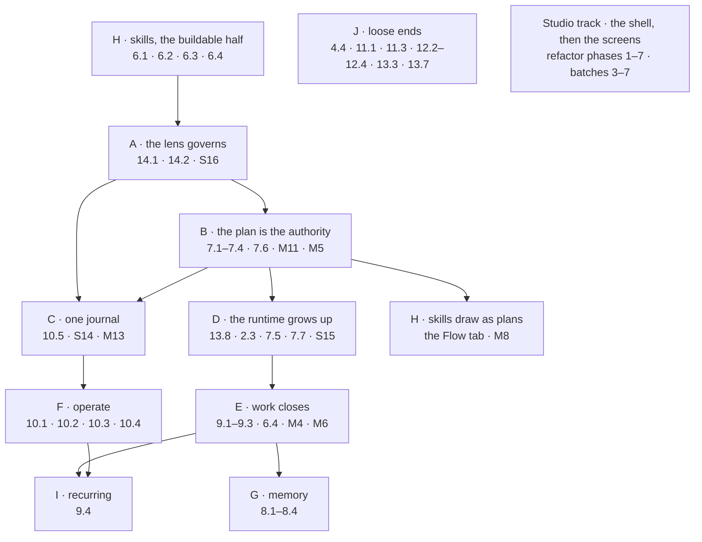

# The sequence — what gets built next, feature by feature

**Sibling to [README.md](README.md) and [the-screens.md](the-screens.md).** That one is the
authoritative index of *features*; that one of *screens*; this one is the authoritative **order**.
It invents no scope and settles no decision: every row points at a feature already in the index and
at the document that governs it.

| | |
|---|---|
| Scope | Everything in [README.md](README.md) that is not ✅ on every column it needs |
| Slices | The `Slice` column in the index is the **ship gate** and does not move. This file orders the work *inside* and *between* the remaining slices, and names what gates what |
| Records | [building-engine/task-model-migration.md](building-engine/task-model-migration.md) — M1–M14. A block that needs one names it |
| The lens | [building-engine/lens-migration.md](building-engine/lens-migration.md) — P0–P6, the block in flight |
| Studio | [building-studio/refactor-plan.md](building-studio/refactor-plan.md) phases 1–7 · [the-screens.md](the-screens.md) batches 1–7 |
| Words | [terminology.md](terminology.md) |

---

## 1. Where the line is today

| | |
|---|---|
| Closed modules | 1 Connect and model · 3 Ask · 4 Explore (bar 4.4) · 5 Agents |
| In flight | **S16 · the lens.** P1 is done — the connector composes, projects and rejects. P0 is next |
| Records landed | M1 (the catalogue declares `bound · args · outputs · requires`) · M2 (`task_plans` + `tasks`) · M3 (`task_runs`) · boards (`canvases` → `boards`, migration 43) |
| Records open | M4 partly (`todos` exists and carries `closed_at`, but still a `status` column and `TaskStatus`) · M5 · M6 · M7 · M8 · M9 · M10 · M11 · M12 · M13 · M14 |
| Still the dispatch authority | `runtime/workflows.py`'s `WORKFLOWS` dict — three hardcoded plans. M11 is what ends that |
| Studio | 18 of 42 screens built, 0 on the shell contract |

---

## 1a. Skills leads — decided 2026-09-19

**The order below starts at H, not A.** Skills is the block whose engine is furthest ahead of its
Studio: 6.1, 6.2 and 6.3 all have `API ✅` and `Studio 🟡`, so three features can close against
endpoints that already ship, and the whole stack is drawn
([Govern, Agents and Skills](https://claude.ai/artifact/VrdrR5iKGfqsjhCouQDTbc), pages *Skills · Bindings · Usage · Rules*).

| Part of Skills | Gated on | Do now? |
|---|---|---|
| The panel, the drilled-in detail, `Playbook` · `Bindings` · `Usage` tabs, versions | the engine gap is smaller than `API ✅` suggests — [skills-pass.md § 1](building-engine/skills-pass.md) | **yes** |
| [6.4 Rules](modules/skills/features/rules.md) — `rules` · `rule_versions`, the drawer | nothing — it is new engine work with no dependency | **yes** |
| The **`Flow` tab** — `skill_versions.plan_id NOT NULL`, the layer view | **M8**, which needs `draft_plan` (**M5**) | no — the tab renders `EmptyState` naming what unlocks it ([DS15](modules/platform/features/design-system.md)) |
| The clarification that pauses instead of guessing | **M5** · the `ask` signal | no |

**The engine plan is [building-engine/skills-pass.md](building-engine/skills-pass.md)** — five slices, and the two forks to settle before the first migration.

**What this costs.** [B · the plan is the authority](#b--the-plan-is-the-authority--m11--m5) still has
to land before a skill draws as a plan, so Skills closes in two passes rather than one. That is the
trade the decision accepts: three features shipped now against a fourth finished later, instead of
four features waiting on M5 and M11.

---

## 2. Three rules the order encodes

| Rule | Consequence |
|---|---|
| **Enforcement before the surface that declares it** | a panel that writes a bound nothing enforces is a display filter wearing a bound's name. P1 before P5, M11 before 7.7 |
| **Records before the features that read them** | a feature built on a column about to be dropped is built twice. M4 before 9.x, M7 before 14.x, M11 before 7.x |
| **The kit before the screen** | [13.1](modules/platform/features/design-system.md) blocks most Studio columns; a missing component is added upstream in `design-kit`, never worked around in `studio/` |

---

## 3. The chain

**J and the Studio track are not downstream of anything.** They are the parallel work — J because
every row in it is a leftover with no dependents, the Studio track because
[the screen-first pass](README.md#the-screen-first-pass) builds a screen ahead of its engine as 🖼.

---

## 4. Block by block

### A · The lens governs — S16

| | |
|---|---|
| Ships | [14.1 Worlds](modules/govern/features/worlds.md) · [14.2 Guardrails](modules/govern/features/guardrails.md) · the touch-record half of [10.5](modules/operate/features/see-what-ran.md) |
| Order | P0 axes → **P2** the `Lens` record (**this is M7**) → P3 interpreter enforcement → P5 Studio · Govern → P4 the touch record → P6 the run dashboard and the rail |
| Records | M7 |
| Detail | [lens-migration.md](building-engine/lens-migration.md) |
| Done when | the same question in two worlds gives two answers whose difference is a diff of what each touched, and `Deal.revenue` narrowed out means no query returns it, no aggregate reveals it and no prompt carries it |

**To settle before P0's migration:** does `axes` validate against the version's declared properties
**at publish time**? The answer belongs in
[domain-models.md](modules/connect-and-model/features/domain-models.md) as a decision, not in this
file.

### B · The plan is the authority — M11 · M5

| | |
|---|---|
| Ships | [7.1](modules/workflows/features/the-library.md) · [7.2](modules/workflows/features/plan-selection.md) · [7.3](modules/workflows/features/envelope-validation.md) · [7.4](modules/workflows/features/promote-a-plan.md) · [7.6](modules/workflows/features/the-catalogue.md) out of 🟡 |
| Records | **M11** — `resolve_plan` reads `task_plans` + `tasks` rows, every builtin is seeded, `WORKFLOWS` stops being the dispatch authority · **M5** — `draft_plan` and envelope validation of a generated plan |
| Why here | five of Workflows' seven features are 🟡 for the same reason: the library is a list of rows nothing dispatches from |
| Done when | `nl-single@1` answers end to end with `template_for` deleted from the run path, and a generated plan is validated before it runs |

### C · One journal — S14 · M13

| | |
|---|---|
| Ships | [10.5 See what ran](modules/operate/features/see-what-ran.md) · [2.2](modules/bring-data-in/features/inspect-what-landed.md) as a filter of it |
| Records | **M13** — interactive runs (`test_connection`, `expand_neighbours`) are ordinary TaskRuns, excluded from the journal's default page |
| Needs | A for the layer strip and `touches[]`; B so an import is dispatched like every other run |
| Done when | every run in the Graph reads from one journal, children nest under their parent, and Imports is a filter rather than a second implementation |

### D · The runtime grows up — S15

| | |
|---|---|
| Ships | [13.8 The runtime](modules/platform/features/runtime.md) · [2.3 Load a bundle](modules/bring-data-in/features/load-a-bundle.md) · [7.5 Run a workflow](modules/workflows/features/run-a-workflow.md) · [7.7 Draft a plan](modules/workflows/features/draft-a-plan.md) |
| Records | **M9** the budget pause · **M10** replan |
| Detail | [the-runtime-package.md](building-engine/the-runtime-package.md) |
| Done when | a plan is a graph, the cursor is a frontier, a step fans out into lanes, a pool stops one workflow starving the rest, and a person is asked before a gated step runs — proven by a bundle load that branches, fans out and inlines the single-dataset plan |

### E · Work closes — M4 · M6

| | |
|---|---|
| Ships | [9.1](modules/work/features/projects-and-tasks.md) · [9.2](modules/work/features/objectives-and-criteria.md) · [9.3](modules/work/features/review.md) · [6.4 Rules](modules/skills/features/rules.md) |
| Records | **M4** — drop `TaskStatus`, add `outcome`, the Work surfaces read a derived state. **Studio ships in the same release** · **M6** — `check-criteria` as a shipped plan, verdicts as `task_prompts` |
| Needs | D — a criterion checked by an evaluator run is a plan the runtime walks |
| Done when | nothing writes a status column, accept and reject are the only closers, and an evaluator writes a verdict and cannot write `closed_at` |

### F · Operate — S9.5 · S10 · S11

| | |
|---|---|
| Ships | [10.1 Schedules](modules/operate/features/schedules.md) · [10.2 Audit](modules/operate/features/audit-and-activity.md) out of 🟡 · [10.3 Observability](modules/operate/features/observability.md) · [10.4 External-agent API](modules/operate/features/external-agent-api.md) |
| Needs | C — the journal is what a schedule's firings stack into, and 10.3 groups spend **by layer then by participant**, which is A's touch record |
| Done when | a question on a cron leaves a diffable timeline, spend reads by layer, and an external agent retrieves with provenance under a scoped token |

### G · Memory — 8.1–8.4

| | |
|---|---|
| Ships | [8.1 Evidence](modules/memory/features/evidence.md) · [8.2 Recall by query](modules/memory/features/recall-by-query.md) · [8.3 Proposals](modules/memory/features/proposals.md) · [8.4 Consolidation](modules/memory/features/consolidation.md) |
| Needs | E — a proposal is accepted, edited or rejected **in Review**, and its effect is measured against criteria |
| Done when | the system proposes a versioned change citing its evidence, and the accept is measured |

### H · Skills — in two passes

**H0, first (see [§1a](#1a--skills-leads--decided-2026-09-19)):** [6.1](modules/skills/features/authoring-a-skill.md) ·
[6.2](modules/skills/features/bindings.md) · [6.3](modules/skills/features/usage.md) out of 🟡 against
the shipped API, and [6.4 Rules](modules/skills/features/rules.md) from nothing. The `Flow` tab ships
as an `EmptyState` naming M8.

**H1, after B:** the tab is wired.

| | |
|---|---|
| Ships | the `Flow` tab — the plan drawn in six layers ([SK16](modules/skills/features/authoring-a-skill.md)) |
| Records | **M8** — `plan_id NOT NULL` on `skill_versions`, clarifications recorded, the **Flow** tab reusing the plan canvas |
| Needs | B — a skill draws as a plan only once a plan is the thing that dispatches |
| Done when | publishing a skill version publishes its plan as one act, and a catalogue gap becomes a `form: human` step rather than a block |

### I · Recurring — 9.4

| | |
|---|---|
| Ships | [9.4 Recurring tasks and conditions](modules/work/features/recurring-tasks-and-conditions.md) |
| Needs | E (the Todo it raises) and F (the cron it fires on) |

### J · Loose ends — parallel, no dependents

| Row | What is left | Slice it belongs to |
|---|---|---|
| [4.4 The console](modules/explore/features/the-console.md) | the Studio surface; closes with Studio refactor **phase 5** | S12f |
| [11.1 Accounts](modules/identity-and-access/features/accounts.md) · [11.3 Sessions](modules/identity-and-access/features/sessions.md) | sole-superuser and owns-a-Graph refusals, the profile tabs | S1 |
| [12.2 Languages](modules/graph-connectors/features/languages.md) | the Studio half | S2 |
| [12.3 Capabilities](modules/graph-connectors/features/capabilities.md) | capability resolution surfaced at authoring | S3 |
| [12.4 Vector search](modules/graph-connectors/features/vector-search.md) | the mixin, per database that has an index | S7 |
| [13.3 Command line](modules/platform/features/command-line.md) | `start · migrate · version` as documented | — |
| [13.7 Setup](modules/platform/features/setup.md) | locks on Explorer, Model and Imports; the four artboards | S13 |

### The Studio track — the shell, then the screens

| Phase | What | Gate |
|---|---|---|
| 1 · Sweep | done — the 26 `tsc` errors are fixed ([§1.1](building-studio/refactor-plan.md#11-the-26-and-what-each-turned-out-to-be--all-fixed)) | `build` · `check-types` · `lint` · both e2e green |
| 2 · Substitute · 3 · Move · 4 · Route | the tree is already feature modules under `pages/graphs-detail/features/` with one router; what is left of each is [refactor-plan §5](building-studio/refactor-plan.md#5-done-per-phase)'s own checklist | no Studio component shadows a kit export; no cross-module deep import; a reload lands on the same screen |
| **5 · Shell** | every screen drives `AppLayoutV2`'s regions; the 8 shadowing Studio components go ([the-screens](the-screens.md) records **0 of 42** on the shell) | closes 4.4 and S12f |
| 6 · Kit gaps | `@invana/tables` and `@invana/editor` installed; no `!` override | batches 3–7 are mostly `DataTable` |
| 7 · Screens | batches 3–7 — Agents · Work · Review and memory · Skills, rules, workflows · Operate | every artboard has a route and is ✅ or 🖼 in [the-screens.md](the-screens.md) |

**🖼 is the whole point of running this in parallel.** A screen whose engine has not landed stops at
the layout and its `EmptyState`, and the block that owns its engine does the wiring.

---

## 5. Is it drawn? — design readiness per block

The module pass ([README › *How a module gets built*](README.md#how-a-module-gets-built)) puts two
gates before a block's code: the artboards **pulled**, and the artboards **reconciled** into the
module's own documents. Pulled is cheap and mostly done; reconciled is the one that is open nearly
everywhere.

| Block | Artboards | Where they live | Reconciled into the module's docs |
|---|---|---|---|
| **A · Govern** | ✅ 7 — `GovWorlds` · `GovWorld` · `GovGuardrails` · `GovCompare` · `RunLens` · `AgentsRoster` · `AgentsLlms`, every one composed on the shell contract, **plus `RowShapes` for P6's G40** | canvas `8591piJHezfLsUoSZXn3z8` · [The Undrawn Features](https://claude.ai/artifact/26QSEwgdJh6xiHr3xJJ4Wn) | ❌ `govern/spec.md` has no **The drawn states** section |
| **B · Workflows** | ✅ — `WorkflowsHiFi` · `WorkflowStepHiFi` · `PlanDetail` · `PlanDash` · `PlanStepParams` · `CatalogueList` · `Library` | canvas `9sAby5rPvkjMLb9BcdCom4` + `7c565h2z9irbFBwu1S1ebH`, cached in `.design/canvas-tasks-panel/` | ❌ `workflows/spec.md` has no drawn states |
| **C · The journal** | ✅ — `RunDetail` · `DrawerRunsList` · `DrawerRunLive` · `DrawerRunAll` · `DrawerRunDebug` · `RunDash` · `StepImport` · `StepQuery` · `StepLlm` | `.design/canvas-tasks-panel/` | ❌ `operate/spec.md` has no drawn states |
| **D · The runtime** | ✅ 7.5 `RunWorkflowHiFi` · 7.7 `PlanDraftCanvas` · `PlanDraftYaml` · `PlanRetire`, and now **2.3 `Main` (BundleLoad)** · **13.8 `Lanes` · `Approval`** | `.design/canvas-features/` · [The Undrawn Features](https://claude.ai/artifact/26QSEwgdJh6xiHr3xJJ4Wn) | ❌ reconcile open |
| **E · Work** | ✅ — `ProjectsHiFi` · `SwingProjectHiFi` · `ProjectPlanHiFi` · `NewTaskHiFi` · `TaskHiFi` · `JournalTaskHiFi` · `ReviewHiFi` · `TaskReviewHiFi` · `VerdictReviewHiFi` · `RulesHiFi` | `hi-fi-finance` | ❌ `work/spec.md` · `skills/spec.md` have no drawn states |
| **F · Operate** | ✅ 10.1 `SchedulesHiFi` · 10.3 `AgentStatsHiFi`, and now **10.2 `Events`** · **10.4 `Tokens`** | `hi-fi-finance` · [The Undrawn Features](https://claude.ai/artifact/26QSEwgdJh6xiHr3xJJ4Wn) | ❌ reconcile open |
| **G · Memory** | ✅ 8.3 · 8.4 share `ReviewProposalHiFi`, and now **8.1 `Evidence`** · **8.2 `Recall`** | `hi-fi-finance` · [The Undrawn Features](https://claude.ai/artifact/26QSEwgdJh6xiHr3xJJ4Wn) | ❌ `memory/spec.md` has no drawn states |
| **H · Skills** | ✅ — `Main` (SkillsPanel) · `SkillFlow` · `SkillAuthor` · `SkillBindings`, all on the shell contract | canvas `7c565h2z9irbFBwu1S1ebH`, cached in `.design/canvas-govern/` | ❌ |
| **I · Recurring** | ✅ `RecurringTaskHiFi` | `hi-fi-finance` | ❌ |
| **J · Loose ends** | ⚠️ **4.4 `Console`** · **12.3 `Capabilities`** · **12.4 `Vector`** are drawn now. Module 11 and 13.3 stay deliberately undrawn; 13.7's four `Setup*HiFi` are still **owed** — those screens shipped before their drawings | [The Undrawn Features](https://claude.ai/artifact/26QSEwgdJh6xiHr3xJJ4Wn) | ❌ reconcile open |

| Reading | |
|---|---|
| **The drawings are not the blocker; the reconcile is.** | 9 of 14 module specs have no **The drawn states** section, and every one of those is a module the sequence still has to build. That is module-pass step 2, and step 2 gates step 3 |
| Only 10 screens in the product were composed on the shell contract | the governance and skills canvases. Every artboard in `hi-fi-finance` predates it, which is what the Studio track's phase 5 exists to close |
| **Every feature a block needs is drawn now** | The nine that had no artboard — 2.3 · 4.4 · 8.1 · 8.2 · 10.2 · 10.4 · 12.3 · 12.4 · 13.8 — plus G40, are the eleven artboards of [The Undrawn Features](https://claude.ai/artifact/26QSEwgdJh6xiHr3xJJ4Wn), generated from `.design/canvas-features/`. What is left before code is the **reconcile**, not a drawing |
| `.design/` holds six canvases' worth of cache | `hi-fi-finance` · `canvas-govern` · `canvas-tasks-panel` · `canvas-modeller-stitch` · `canvas-onboarding` · `canvas-features`. It is gitignored, and **the generators exist only on this machine** — the canvases are the source |

---

## 6. Reconcile before the next block starts

Documents that lag the code. Each is a flip, not a decision — and an unflipped row is a plan built
from a wrong map.

| Where | Says | Is |
|---|---|---|
| Six module specs the sequence has to build | — | no **The drawn states** section although their artboards exist: `govern` · `workflows` · `operate` · `work` · `skills` · `memory`. **This is the gate on those blocks' step 3** ([§5](#5-is-it-drawn--design-readiness-per-block)). `agents` · `graph-connectors` · `identity-and-access` also lack one, and for them it is correct — they have no artboards |
| [task-model-migration.md](building-engine/task-model-migration.md) slice table | only M3 is ✅ | M1 and M2 have landed (the catalogue declares its four fields; `task_plans` and `tasks` are rows, migration 38) |
| [task-model-migration.md](building-engine/task-model-migration.md) M11 | `import_jobs` is deleted **by** M11 | the table is already gone (migration 41). What M11 still owns is the plan source and the seeded builtins |
| [code-shape.md §5.2](building-studio/code-shape.md) | the query string wins — then, four lines later, *"the rail switches routes, not a param"* | one of the two. **Settle before the Studio track's phase 7** |
| [the-screens.md](the-screens.md) *every feature and the screen that draws it* | 10.5 and 6.2 were listed as **not drawn** while `RunDetail`, the `DrawerRun*` set, the `Step*` set and `SkillBindings` draw them; 2.3 · 3.11 · 7.6 · 7.7 · 14.1 · 14.2 had no row at all; the console was `4.5` | **fixed in this pass** |

---

## Not sequenced

| Row | Because |
|---|---|
| [3.11 Act as](modules/ask/features/act-as.md) | `S-TBD` in the index — a stance needs the touch record to have a ledger to hang on, so it is sequenced when A closes, not before |
| Simulation · parameter sweeps · game theory | post-1.0, and [not built](README.md#not-building) |
| The engine band migration | [migration-plan.md](building-engine/migration-plan.md) is orthogonal to every block here — it moves files and changes no contract, so it interleaves rather than sequences |
