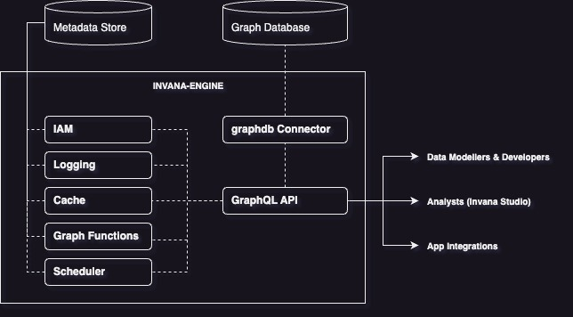

# Invana Documentation

Unified Object Graph Mapper (OGM) for modelling, creating and and querying graph data with any graph database. 

- Unified Python API for graph databases.
- Model your schema once, switch between graph database backend without changing code.
- Familiar django style model definitions.
- Powerful graph search APIs.
- Easy to extend support for new graph database.
<!-- - ~~pre/post save and delete hooks.(wip)~~ -->
<!-- - Full transaction support. -->
<!-- Thread safe. -->


## Requirements

1. Python 3.6+
2. Graph database (Refer supported graph databases)

## Supported databases

<!-- 1. GremlinConnector  -->
1. [Janusgraph](https://janusgraph.org) 
2. [Azure Cosmos DB](https://cosmos.azure.com)
3. [Amazon Neptune](https://aws.amazon.com/neptune/)

<!-- ## Architect

 -->


##  Installation 

Install from github

```
pip install git+https://github.com/invana/invana.git#egg=invana
```

## Contents

1. Get started
    - Architecture
    - Connecting 
    - Graph backends
1. Connecting 
2. Modeling
    - 2.1 Defining Nodes & Relationships
    2.2 Defining properties (property types)
        2.2.1 
    2.3 Defining Relationships 
        2.3.1 Cardinality
        2.3.2 Relationship Uniqueness
        2.3.3 Defining Traversals
        2.3.4
    2.2 Contraints
        2.2.1 Creating contraints
        2.3.2 Removing contraints
        2.4.3 Checking status of contraints
        2.5.4 Reading contraints
    2.3 Indexes
        2.3.1 Creating indexes
        2.3.2 Removing indexes
        2.3.3 Checking status of indexes
        2.3.4 Reading indexes
3.  

