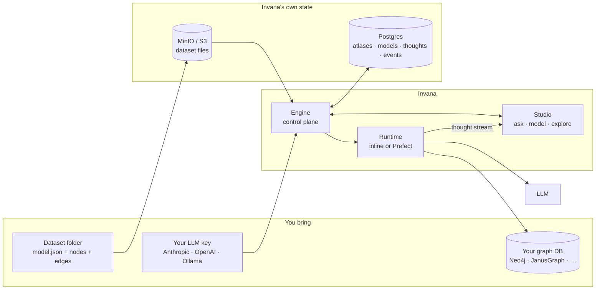

# Invana — MVP

**Invana turns a graph database into a bounded knowledge domain that agents can reason over — and
that answers in plain language, with its work shown.**

You point Invana at your graph database, describe the shape of your data, load it, and then ask
questions in English. It writes the query, runs it, paints the result, and keeps a record of exactly
how it got there — every prompt, every generated query, every record. When the graph can't answer, it
says so instead of inventing one.

The unit of all of this is an **Atlas**: one bounded knowledge domain, with one database connection,
its own model, data, skills, instructions and agents.

| Reading for | Go to |
|---|---|
| What the user does, and what they see | [`mvp/studio.md`](mvp/studio.md) — journeys, screens, flows |
| How it's built — architecture, data model, guards, config | [`mvp/engine.md`](mvp/engine.md) |
| What ships, and in what order | **this file** — § Delivery |

---

## The five things Invana should do

Everything in the MVP serves one of these. If a proposed feature doesn't, it isn't MVP.

| # | Promise | What it means concretely | Detail |
|---|---|---|---|
| **1** | **Bind a domain** | Connect one graph database, define the model, load data into it. One Atlas = one bounded, curated context — not "all your data". | Journeys [3](mvp/studio.md#3-creating--configuring-an-atlas) · [4](mvp/studio.md#4-designing-the-model) · [5](mvp/studio.md#5-bringing-data-in) |
| **2** | **Answer in plain language** | Ask in English. Invana translates to Cypher or Gremlin, runs it, and returns an answer — a subgraph, a table, a number, a chart, or prose. | Journey [6](mvp/studio.md#6-asking-questions) |
| **3** | **Show its work** | Every answer ran a **workflow** — understand → validate → execute → project — and you watch it run, step by step. Open any answer to see the prompt, the rationale, the generated query, the records, the timings. No answer is a black box. | Journey [6](mvp/studio.md#6-asking-questions) |
| **4** | **Refuse to hallucinate** | Answers are grounded in the Atlas's graph. Nothing else. If the graph can't answer, Invana says "I can't answer that" — visibly styled as *not* an answer. **When something breaks it explains why and what to do**, grounded in the same way: a diagnosis is never guessed. | Journey [6](mvp/studio.md#6-asking-questions) |
| **5** | **Keep working without you** | Put a question you trust on a **schedule** — it re-asks itself as the graph moves, and the answers stack into a timeline you can diff. External agents read the Atlas through a scoped API, with provenance in every response. | Journeys [7](mvp/studio.md#7-schedules) · [8](mvp/studio.md#8-operating) |

---

## How it works



**The loop.** You ask a question → the engine records it as a **Thought** and opens a **Thinking** on
it → a runtime executes the thinking as a sequence of tasks (translate → validate → execute → shape)
→ each task emits into a **thought stream** → Studio subscribes and paints as results arrive. Nothing
analytical happens inside a web request, so a long answer streams instead of blocking.

### What Invana plugs into

| Layer | What it is | Options in MVP |
|---|---|---|
| **Graph database** | Where *your* data lives. Invana never hosts it — you bring the connection. | **Cypher:** Neo4j · Memgraph · ArcadeDB · **Gremlin:** JanusGraph · Amazon Neptune · TinkerGraph · ArcadeDB |
| **LLM provider** | Translates questions to queries and shapes answers. Per-Atlas, key encrypted at rest. | Anthropic · OpenAI · Ollama / local |
| **Task runtime** | Executes thinkings. Swappable behind one protocol. | `inline` (bundled, zero infra) · **Prefect** (separate `invana-prefect` package, for retries/scale/observability) |
| **App state** | Invana's own database — atlases, models, thoughts, canvases, audit events. | Postgres (prod) · SQLite (dev) |
| **Object storage** | Uploaded dataset files. | MinIO (dev) · any S3-compatible (AWS S3 · GCS · R2) |

Every graph database is a separate pip package (`invana-neo4j`, `invana-janusgraph`, …) discovered
through an entry point. Prefect is registered the exact same way. **Nothing is bundled that you
haven't asked for** — `invana start` runs with no orchestrator and no object store.

### The stack

| Side | Built with |
|---|---|
| **Engine** | Python 3.14 · FastAPI · SQLAlchemy (async) · Alembic · Pydantic v2 · uv |
| **Studio** | React 19 · TypeScript · Vite · TailwindCSS 4 · TanStack Query · Zustand · CodeMirror 6 |
| **UI** | `@invana/design-kit` — the shared component library, used for every surface |
| **Graph rendering** | `@invana/canvas` — PixiJS 8 on WebGPU/WebGL, 100K+ nodes at 60fps |
| **Distribution** | `pip install invana` + a package per database · Docker images `invana/engine`, `invana/studio` |

Full dependency and configuration tables: [`mvp/engine.md`](mvp/engine.md) § 6.

---

## Features

Product-level capabilities. **Status** is the state of the whole feature — a row is `[x]` only when
engine *and* Studio are both done. **Design** links the record where the decision was made.

`[x]` done · `[~]` in progress · `[ ]` not started · `[-]` deferred post-1.0

| Capability | Status | Design | Notes |
|---|---|---|---|
| Connect to a graph database | `[x]` | [017](../rfcs/017-graph-as-primary-container.md) · [001](../rfcs/001-graph-connectors.md) | 1 Atlas ↔ 1 connection. Test before save. Credentials encrypted at rest. |
| Introspect an existing database | `[x]` | [001](../rfcs/001-graph-connectors.md) · [021](mvp/rfc-021-model-authoring.md) | Seeds a draft model from what's already there. |
| Design a graph model | `[~]` | [019](mvp/rfc-019-multi-model-perspectives.md) · [021](mvp/rfc-021-model-authoring.md) · [022](mvp/rfc-022-property-type-capabilities.md) | Engine `[x]`; Studio authoring `[~]`. Backend-gated property types not started. |
| Visual model editor | `[~]` | [027](mvp/rfc-027-interactive-modeller-canvas.md) · [029](mvp/rfc-029-modeller-staged-commit.md) · [031](mvp/rfc-031-modeller-generative-sessions.md) | Canvas authoring works on drafts; read-only versions stay pan/zoom/select. |
| Load data | `[ ]` | [020](mvp/rfc-020-dataset-ingestion.md) · [016](../rfcs/016-pluggable-executor.md) | Dataset folders validated record-by-record, with a failure report. **CLI only** — `invana datasets import`. |
| Inspect what landed | `[ ]` | [020](mvp/rfc-020-dataset-ingestion.md) | Studio shows every dataset read-only: live import logs, files, derived model, paginated records, validation report. |
| Stitch data into the graph | `[ ]` | [020](mvp/rfc-020-dataset-ingestion.md) | Map dataset types onto model concepts; every materialised node carries its source record. |
| Ask in natural language | `[~]` | [030](mvp/rfc-030-llm-translation.md) · [032](mvp/rfc-032-llm-runtime.md) · [036](mvp/rfc-036-nl-conversation-context.md) · [038](mvp/rfc-038-query-understanding.md) | Cypher and Gremlin. Translation exists; the grounded runtime does not. |
| Write queries directly | `[~]` | [024](mvp/rfc-024-query-sessions.md) | CodeMirror editor with the Atlas's schema in scope. |
| Streaming answers | `[ ]` | [048](mvp/rfc-048-agent-runtime-on-prefect.md) | Results paint as they arrive, not all at the end. |
| Multi-modal answers | `[ ]` | [033](mvp/rfc-033-explorer-results-in-thread.md) · [048](mvp/rfc-048-agent-runtime-on-prefect.md) | Subgraph · table · metric · chart · prose — in one answer. |
| Interactive graph canvas | `[~]` | [035](mvp/rfc-035-explorer-node-expand.md) · [043](mvp/rfc-043-explorer-canvases.md) · [045](mvp/rfc-045-session-canvas-enhancements.md) | Pan, zoom, select, hover, style layers all ship `[x]`. **Node expand** (context menu, fine-tune panel, dedupe-merge) is `[ ]`. |
| Save and revisit canvases | `[~]` | [043](mvp/rfc-043-explorer-canvases.md) · [047](mvp/rfc-047-canvas-version-history.md) | Tabs, autosave and the canvases rail ship; version-history timeline does not. |
| Visible workflow per answer | `[ ]` | [051](mvp/rfc-051-workflows.md) · [048](mvp/rfc-048-agent-runtime-on-prefect.md) | Every answer names its workflow and shows steps live — `understand · validate · execute · project` — with per-step timings. |
| Full reasoning trace | `[ ]` | [048](mvp/rfc-048-agent-runtime-on-prefect.md) · [026](mvp/rfc-026-studio-session-tracing.md) | Prompt → rationale → generated query → records → timings. Clickable provenance. |
| "Cannot answer" | `[ ]` | [052](mvp/rfc-052-failure-handling.md) | A deliberately non-answer-shaped response — and distinct again from a *failure*. |
| Automatic retries | `[ ]` | [052](mvp/rfc-052-failure-handling.md) | Transient faults retry with backoff and jitter. Visible while it happens — `retrying 2/3`, never a silent pause. |
| Self-repair | `[ ]` | [052](mvp/rfc-052-failure-handling.md) | An invalid generated query goes back to the model **once**, with the validation error attached. |
| Failure diagnosis + next steps | `[ ]` | [052](mvp/rfc-052-failure-handling.md) | A failure explains itself in your terms, with clickable actions. Derived from real evidence, never invented. |
| Clarifying questions | `[~]` | [038](mvp/rfc-038-query-understanding.md) · [052](mvp/rfc-052-failure-handling.md) | UI exists; not wired to a thinking. Options come from your schema; capped at 2 rounds. |
| Schedule a question | `[ ]` | [051](mvp/rfc-051-workflows.md) | Put a thought on a cron; each firing re-asks it unattended and the answers stack into a diffable timeline. |
| Agent skills & instructions | `[x]` | [040](mvp/rfc-040-consolidate-graph-instructions.md) | Per-Atlas prose that grounds every thinking. |
| External-agent API | `[ ]` | — | Scoped tokens; retrieval endpoints with provenance. |
| Audit trail | `[x]` | [018](mvp/rfc-018-domain-audit-events.md) | Every write emits a domain event; live tail in the UI. |
| Themes / light + dark | `[x]` | [044](mvp/rfc-044-rich-theming.md) | |
| Design system (`@invana/design-kit`) | `[~]` | [050](mvp/rfc-050-design-kit-component-plan.md) | Studio pins 7 releases behind; the answer-surface components do not exist yet. |
| Source connectors (PDF, CSV, Git, MySQL…) | `[-]` | [020](mvp/rfc-020-dataset-ingestion.md) | Datasets are produced externally in MVP — that's the contract. |
| Dataset import from the UI | `[-]` | [engine.md § 1.8](mvp/engine.md) | Import is an operator action against a bound database, so it lives with `migrate` and `init` in the CLI. |
| Authoring your own workflow | `[-]` | [051 § 3](mvp/rfc-051-workflows.md) | MVP ships one built-in workflow and makes it visible. Authoring is an execution surface needing its own threat model. |
| Orchestrating thoughts — *a chain of thoughts* | `[-]` | [051 § 7](mvp/rfc-051-workflows.md) | One step's answer feeding the next. **Deliberately kept reachable** — six invariants in [`engine.md`](mvp/engine.md) § 2.1 hold the door open. |
| Event triggers (fire on data change) | `[-]` | [051 § 6](mvp/rfc-051-workflows.md) | Cron only in MVP. |
| Notifications on completion | `[-]` | [052 § 6](mvp/rfc-052-failure-handling.md) | A delivery channel, not a workflow feature. Blocks schedule auto-pause. |
| Vector / semantic search | `[-]` | [037](mvp/rfc-037-memory.md) | Mixin exists for capable backends; not wired in MVP. |
| Teams / orgs / roles | `[-]` | [023](mvp/rfc-023-remove-roles-invitations.md) | Binary membership only. |
| Multi-database Atlases | `[-]` | [017](../rfcs/017-graph-as-primary-container.md) | Atlas ↔ Connection stays 1:1. |
| Simulation (game theory, parameter sweeps) | `[-]` | — | |
| Soft deletes / trash / undo | `[-]` | — | |

Full deferred list: [`mvp/studio.md`](mvp/studio.md) and [`mvp/engine.md`](mvp/engine.md), marked `[-]`.

---

## Delivery

Backend and frontend ship **together per slice** — a feature is not done when the backend lands.
Each row's outcome is a thing a person can do from a clean checkout; if it can't be demoed in 30
seconds, the slice isn't done.

| Slice | What the user can do afterwards | Status |
|---|---|---|
| **S0** Foundations | — (migrations reset, typed API client generated) | `[ ]` |
| **S1** Auth | Log in; land on an empty atlas list | `[ ]` |
| **S1.5** Atlas container | Everything lives under `/u/:username/:atlasSlug/...` | `[x]` |
| **S2** Atlas shell + setup wizard | Create an Atlas, connect Neo4j, watch Modeller and Explorer unlock | `[x]` |
| **S3** Model authoring | Create a model, add node + edge types with properties, publish it | `[~]` |
| **S4** LLM provider | Register an LLM key, test it, set a default | `[x]` |
| **S5** Skills + instructions | Author the prose that grounds every answer | `[x]` |
| **S5.5** Audit events | See every change land in a live event tail within a second | `[x]` |
| **S6** Dataset import | Import a dataset folder from the CLI and watch validation stream into Studio's read-only browser | `[ ]` |
| **S7** Stitcher | Map dataset types onto model concepts; see nodes in Explorer with their source records | `[ ]` |
| **S9** Thoughts & thinking | Ask a question, watch the answer build as it streams, open the trace behind it | `[ ]` |
| **S9.5** Schedules | Put an answer you trust on a daily cron; find a fresh one waiting the next morning | `[ ]` |
| **S10** External-agent API | Issue a scoped token and read the Atlas from an outside agent | `[ ]` |
| **S11** Atlas lifecycle | Archive an Atlas; every mutating route goes read-only | `[ ]` |

```
S0 → S1 → S1.5 → S2 ─┬─→ S3
                     ├─→ S4
                     ├─→ S5
                     ├─→ S11
                     └─→ S6 → S7 → S9 → S9.5
                                    └→ S10
```

**A schedule is a trigger, not a second execution route** — a firing re-asks a Thought through
exactly the path a rethink uses, so it needs no pipeline machinery. That is why S9.5 sits after S9:
the asking path has to exist first.

### Sequencing rules

| Rule | Why |
|---|---|
| One moving target at a time | S6/S7/S9 are the genuinely new platform. Don't start S6 until S4+S5 are stable. |
| Hold the line on "no source connectors" | Every "but PDFs would be easy" is a slope back into building a connector framework. Users producing JSON externally is the contract. |
| The generated TS client is the contract | Hand-typed frontend shapes drift from the backend. There is no second source of truth. |
| Studio's UI comes from design-kit | Studio must not grow a parallel component layer — gap analysis and build order in [`mvp/studio.md`](mvp/studio.md) § 10. |

Per-slice engineering detail — what each slice touches, its risks, and its backend scope — lives in
[`mvp/engine.md`](mvp/engine.md) § 5 and § 7. Frontend task tables live in
[`mvp/studio.md`](mvp/studio.md), organised by journey.
