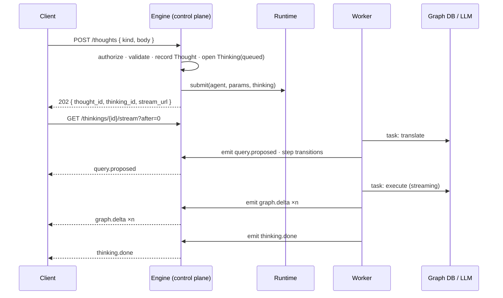
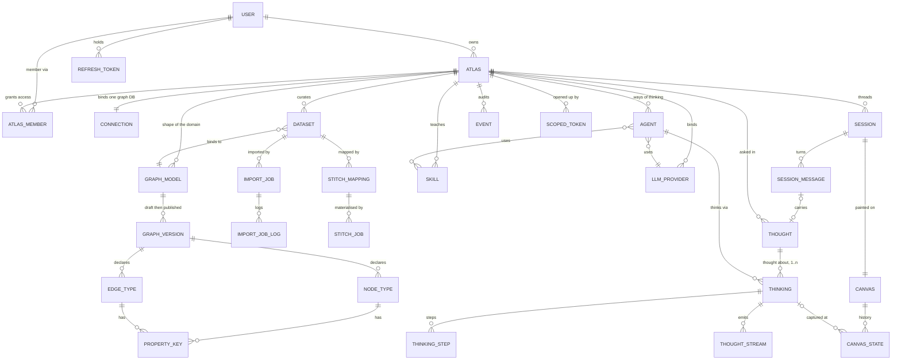
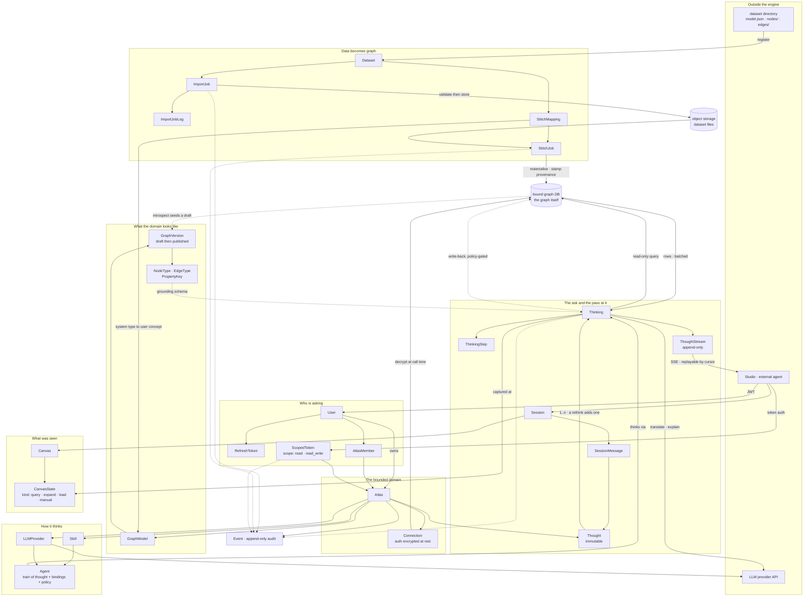

# Engine — MVP backend scope (architecture, data, APIs)

The backend half of [`../mvp.md`](../mvp.md). This describes the **target system on its own terms** —
what the data looks like, what the endpoints are, and how a request becomes work. The frontend
counterpart is [`studio.md`](studio.md); slice sequencing stays in [`../mvp.md`](../mvp.md).

Legend: `[ ]` not started · `[~]` in progress · `[x]` done · `[-]` deferred post-1.0

---

## 1. Architecture

### 1.1 The container model

> **An Atlas is a bounded knowledge graph your agents can reason over.** (RFC-049)


| Concept | Owns | Cardinality |
|---|---|---|
| **User** | identity, credentials, username | — |
| **Atlas** | the bounded knowledge domain: connection, models, datasets, skills, instructions, LLM bindings, agents, canvases, thoughts | `User` owns many |
| **Connection** | the live database binding | `1:1` with Atlas |
| **AtlasMember** | binary access (member or not — no roles) | `Atlas` has many |

There is no Workspace and no Mission. Every Atlas-scoped URL is namespaced
`/api/v1/u/{username}/{atlasSlug}/...`; `users.username` is globally unique and `atlases.slug` is
unique per owner.

### 1.2 The engine is a control plane

The engine **decides what to run and records what happened**. It does not do analytical work inside a
request. A query is a **Thought**; executing it is a **Thinking**; the client subscribes to the
resulting **thought stream**.

Layering is one-way and lint-enforced (`TID251`):

| Layer | Contains | May import | Must not import |
|---|---|---|---|
| `core/` | models · stores · schemas · db · settings · llm client · events · errors | — | `fastapi`, `starlette`, `prefect`, `invana.api` |
| `tasks/` | typed units of work; deps via `TaskContext` | `core` | same |
| `agents/` | train-of-thought specs + interpreter | `core`, `tasks` | same |
| `runtime/` | `Runtime` protocol + bundled `inline` adapter | `core`, `agents` | `prefect` |
| `api/` | FastAPI: routes, services, deps, SSE, admin | everything below | `prefect` |
| `worker/` | task host entrypoint | everything below | `prefect` |
| `graph/` | connector SPI (public API — imported by `invana-{db}` packages) | `core` | `invana.api` |

Two distributions: **`invana`** and **`invana-prefect`** (the orchestrator adapter, in
`integrations/`, discovered through the `invana.runtimes` entry point like a graph connector).

Design detail: [`rfc-048-agent-runtime-on-prefect.md`](rfc-048-agent-runtime-on-prefect.md) ·
[`agent-runtime-code-structure.md`](agent-runtime-code-structure.md).

### 1.3 The thinking lifecycle



### 1.4 The task contract

A task is a typed callable whose dependencies arrive in a context, so the same code runs in the API
process or a worker:

```python
async def translate_thought(ctx: TaskContext, p: TranslateIn) -> TranslateOut: ...
```

| Member | Type | Purpose |
|---|---|---|
| `ctx.thinking` | `ThinkingRef` | `thinking_id` · `thought_id` · `agent_id` · `atlas_id` · `actor_id` |
| `ctx.resources.db` | `AsyncSession` | app DB, **task**-scoped |
| `ctx.resources.atlas` | `Atlas` | the resolved container |
| `ctx.resources.connector()` | `→ BaseConnector` | live graph connection |
| `ctx.resources.llm(purpose=)` | `→ LLMCall` | provider resolved, credential already applied |
| `ctx.resources.schema()` | `→ GraphVersion \| None` | grounding context |
| `ctx.resources.record(action, **d)` | `→ None` | domain audit event |
| `ctx.emit(emission)` | `→ None` | append to the thought stream |

Rules: typed JSON-serialisable in/out (so a task can be cached, retried, moved across a process
boundary); **user-facing output goes through `emit`, the return value is for the next task**; a task may
run twice, so emissions carry an idempotency key; no `settings` reads and no connection construction
inside a task.

### 1.5 Cross-cutting contracts

**Auth & guards**

| Guard | Applies to | Effect |
|---|---|---|
| `get_current_user` | every user-level route | HS256 access JWT (15m) |
| `require_superuser` | `/admin`, account provisioning, platform events | `users.is_superuser` |
| `require_atlas_member` | every `/u/{username}/{atlasSlug}/...` route | binary membership |
| `require_atlas_setup_complete` | analytical routes (thoughts, schema, introspect) | setup wizard finished |
| thinking-scoped token | `/internal/thinkings/{id}/...` | authenticates a **thinking**, not a user; single `thinking_id`, short-lived |

**Error model.** Code below the API layer raises a domain error; the API maps it. One mapping, so the
same failure means the same status everywhere.

| Domain error | Status | Meaning |
|---|---|---|
| `NotFound` | 404 | absent, or not visible in this scope |
| `Invalid` | 422 | well-formed but semantically unacceptable |
| `Conflict` | 409 | collides with existing state (uniqueness, lifecycle) |
| `Forbidden` | 403 | known actor, not permitted |
| `Unavailable` | 503 | a needed dependency (graph DB, LLM, orchestrator) is down |

Body: `{"detail": {"error": "<code>", ...context}}`.

---

## 2. Concept net

Every concept, and how it hangs together. Column detail is deliberately **not** here — this is the map,
not the schema.



### 2.1 The relationships that matter

| Relationship | Why it's shaped that way |
|---|---|
| `Atlas 1:1 Connection` | one Atlas, one graph database — the boundary is unambiguous |
| `Thought 1:n Thinking` | a **rethink** adds a thinking, never mutates the thought. Two agents' attempts sit side by side |
| `Session 1:1 Canvas` | the canvas is self-contained (own snapshot + query), so a member opens it without reading a private thread |
| `Thinking → ThoughtStream` | append-only with a cursor, so it is simultaneously the live feed, the reload replay, and the provenance chain |

### 2.2 What a thinking emits — the projection contract

**An answer is multi-modal.** One thinking may emit a subgraph *and* a ranked table *and* a headline
number *and* a written explanation — "which suppliers are single-sourced?" wants all four. Because the
stream is a sequence of typed items rather than one response body, this needs no "response type"
decision up front: each emission declares its own surface, and **the `kind` *is* the projection.**

| Emission `kind` | Payload | Projects to |
|---|---|---|
| `graph.delta` | `{nodes[], edges[], removed[]}` — batched ~500 | **canvas** — append path |
| `table.page` | `columns[]` · `rows[]` · `page` · `total` | **thread** — table, pages append |
| `metric` | `label` · `value` · `unit` · `delta?` | **thread** — inline stat / KPI |
| `chart.spec` | `type` (bar\|line\|pie\|scatter) · `data` · `encoding` | **thread** — chart |
| `text.delta` | markdown chunk | **thread** — streamed markdown |
| `query.proposed` | query · language · rationale · confidence | thread — query chip · trace |
| `plan.step` | chosen task · rationale | thread — reasoning line (LLM-planned agents only) |
| `clarification.requested` | question · options · `options_query` | thread — resume form |
| `log` · `error` | level · message / code · message | trace / thread |
| `thinking.done` | counts · timings | card footer · canvas history |

Two surfaces, split by data shape rather than preference: **canvas** takes `graph.delta` (spatial, and
the renderer already appends incrementally); **thread** takes everything else (read top-to-bottom next
to the ask that produced it).

Which kinds appear is decided by the tasks in the train of thought — `execute` emits `graph.delta` **or**
`table.page` depending on what the query returned; `explain` emits `text.delta`, `metric`, `chart.spec`.
A deterministic train of thought therefore has a predictable output shape, which is what keeps the
thread layout stable.

### 2.3 Storage & retention

| Concern | Rule |
|---|---|
| Encryption at rest | one Fernet key for `connections.auth_encrypted` + `llm_providers.api_key_encrypted` |
| Deletes | hard, cascading downward through ownership only. No `deleted_at` |
| Owner deletion | blocked while the user owns any Atlas (RESTRICT) |
| Thought stream | newest `INVANA_THINKING_HISTORY_LIMIT` thinkings per Atlas (500); payloads dropped after `INVANA_THOUGHT_STREAM_TTL_DAYS` (30) while thinkings + steps survive |
| Canvas history | newest `INVANA_CANVAS_HISTORY_LIMIT` states per canvas (30) |
| Events | retained forever — audit is immutable |
| Dataset files | object storage, `atlases/<atlas_id>/datasets/<dataset_id>/…`; deletion cascades to objects |

### 2.4 Dataset format (the external contract)

Prepared outside Invana and consumed as-is:

```
<dataset_dir>/
├── model.json              # node/edge types + property constraints
├── nodes/<NodeType>.json   # array of records; type implicit from filename
└── edges/<EdgeType>.json
```

| Record | Shape |
|---|---|
| node | `{ "id": "doc-001", "properties": { … } }` |
| edge | `{ "id": "e-001", "from": "doc-001", "to": "person-42", "properties": { … } }` |

| Property type | Constraints |
|---|---|
| `string` | `min_length` · `max_length` · `pattern` |
| `integer` · `float` | `min` · `max` |
| `enum` | `values[]` (non-empty) |
| `boolean` · `datetime` · `uuid` · `json` | — |

All support `required` and `default`. Validation produces structured rows — `file` · `record_index` ·
`record_id` · `field` · `rule_violated` · `message` — collect-all by default, capped ~1000 before
aborting. Errors: missing required, wrong type, out of bounds, length/pattern, enum miss, unresolved
edge endpoint, duplicate node id per type. Warning (error in strict mode): unknown property key.

---

## 3. Data flow

§2 is structure — what relates to what. This is **movement**: where data enters, where it comes to
rest, and what carries it between the two. Every entity in §2 appears here, positioned by the job it
does in the flow rather than by who owns it.



### 3.1 Where data rests

Four stores, and the boundary between them is the thing to keep straight:

| Store | Holds | Notes |
|---|---|---|
| **App DB** (Postgres / SQLite dev) | every entity in §2 — the control-plane record | Never holds graph data itself, only what produced it |
| **Bound graph DB** | the graph: nodes, edges, properties | The user's database. One per Atlas via `Connection`. The engine reads it, and writes only through `StitchJob` or policy-gated write-back |
| **Object storage** | dataset files, `atlases/<atlas_id>/datasets/<dataset_id>/…` | Deleting a dataset cascades to its objects |
| **Outside** | the prepared dataset directory, the LLM provider | Neither is durable engine state; credentials for the latter live encrypted in `llm_providers` |

### 3.2 The four flows

| Flow | Chain | Ends in |
|---|---|---|
| **Authoring** | `User → Atlas → Connection` · `GraphModel → GraphVersion → NodeType/EdgeType/PropertyKey` | a published version — the grounding schema every thinking reads |
| **Ingestion** | `dataset dir → Dataset → ImportJob → ImportJobLog + object storage` then `StitchMapping → StitchJob` | rows in the bound graph DB, provenance-stamped |
| **Asking** | `Session → SessionMessage → Thought → Thinking` (via `Agent` + `LLMProvider` + `Skill`) `→ ThinkingStep + ThoughtStream` | emissions the client subscribes to; optionally a `CanvasState` |
| **Trust** | every mutating surface → `Event`; external entry via `ScopedToken` | an audit trail retained forever, and a provenance chain from answer back to source record |

Two properties of the shape are load-bearing:

- **Nothing analytical crosses a request boundary.** A `Thought` is recorded and a `Thinking` is
  opened; the work happens elsewhere and reports back through `ThoughtStream`. The API never holds a
  graph query open.
- **The flow is one-way into the graph DB.** Reads are unrestricted; writes arrive only via
  `StitchJob` or write-back, both of which stamp what produced them — which is what makes the
  provenance chain in §4.8 answerable at all.

---

## 4. API surface

All atlas-scoped paths are prefixed `/api/v1/u/{username}/{atlasSlug}`; guards per §1.5.

### 4.1 Auth

| Method | Path | Purpose |
|---|---|---|
| `POST` | `/api/v1/auth/register` | **superuser-only** provisioning |
| `POST` | `/api/v1/auth/login` | |
| `POST` | `/api/v1/auth/refresh` | rotates the refresh token |
| `POST` | `/api/v1/auth/logout` | |
| `GET` | `/api/v1/auth/me` | |
| `PATCH` | `/api/v1/auth/me` | first/last name · username (rate-limited) |
| `POST` | `/api/v1/auth/me/password` | verifies current; revokes all refresh tokens |
| `DELETE` | `/api/v1/auth/me` | 409 if sole superuser or owns any Atlas |
| `GET` | `/api/v1/auth/username-available?username=` | unauthenticated → `{available, reason?}` |

### 4.2 Atlas & settings

| Method | Path | Purpose |
|---|---|---|
| `GET` `POST` | `/api/v1/atlases` | list · create |
| `GET` `PATCH` `DELETE` | `…/{atlasSlug}` (via `/u/{username}/{atlasSlug}`) | hard delete cascades downward |
| `POST` | `…/setup/{section}` | wizard progress |
| `POST` | `…/archive` · `…/unarchive` | lifecycle |
| `GET` `PUT` `DELETE` | `…/connection` | PUT is full-replace; empty `auth` keeps stored creds |
| `POST` | `…/connection/test` · `/ping` · `/introspect` | |
| `POST` | `…/connection/acknowledge-version` | clears the untested-version read-only lock |
| `GET` `POST` `PATCH` `DELETE` | `…/skills[/{id}]` | 409 on duplicate name |
| `GET` `POST` `PATCH` `DELETE` | `…/llm[/{id}]` | |
| `POST` | `…/llm/{id}/ping` · `…/llm/{id}/set-default` | |
| `GET` `POST` `PATCH` `DELETE` | `…/agents[/{key}]` | train of thought + bindings + policy |
| `GET` | `…/members` | binary membership |
| `GET` | `…/events` · `…/events/stream` | keyset list · SSE tail (`?token=` fallback) |
| `GET` | `/api/v1/events` · `/api/v1/events/stream` | superuser, all Atlases |

### 4.3 Model

| Method | Path | Purpose |
|---|---|---|
| `GET` `POST` `PATCH` `DELETE` | `…/models[/{id}]` | model CRUD |
| `GET` `POST` | `…/models/{id}/versions` | create a draft |
| `POST` | `…/models/{id}/versions/{vid}/activate` | publish (also the "commit" for generative sessions) |
| `GET` | `…/schema/active-version` | the grounding schema |
| `POST` `PATCH` `DELETE` | `…/versions/{vid}/node-types[/{id}]` | draft-only → 409 |
| `POST` `PATCH` `DELETE` | `…/versions/{vid}/edge-types[/{id}]` | draft-only → 409 |
| `POST` `PATCH` `DELETE` | `…/property-keys[/{id}]` | type enforcement → 422 |

### 4.4 Datasets

| Method | Path | Purpose |
|---|---|---|
| `GET` `POST` | `…/datasets` | list · register (starts an import job) |
| `GET` `DELETE` | `…/datasets/{dsid}` | detail (model + counts + last job) · hard delete incl. objects |
| `GET` | `…/datasets/{dsid}/jobs[/{jid}]` | job list · detail (status, progress, counts) |
| `GET` | `…/datasets/{dsid}/jobs/{jid}/logs` | paginated |
| `GET` | `…/datasets/{dsid}/jobs/{jid}/logs/stream` | SSE |
| `GET` | `…/datasets/{dsid}/files[/{path}]` | object tree · fetch (signed or proxied) |
| `GET` | `…/datasets/{dsid}/records?type=&page=&page_size=` | paginated, scoped to one type |

**Python API** (for externally-prepared data): `invana.datasets.import_dataset(atlas, name, path, *,
refresh=False, strict=False)` → `ImportJob` handle with `.wait()` / `.stream_logs()`; `atlas` accepts a
handle or `"username/slug"`. CLI shim: `invana datasets import --atlas <u/s> --name <n> --path <dir>
[--refresh] [--strict]`.

### 4.5 Stitching

| Method | Path | Purpose |
|---|---|---|
| `GET` `POST` `PATCH` `DELETE` | `…/mappings[/{id}]` | system type → user concept |
| `POST` | `…/stitch` | materialise into the bound connection |
| `GET` | `…/stitch-jobs[/{id}]` | status · progress · logs (SSE like imports) |
| `GET` | `…/provenance/{node_or_edge_id}` | source dataset · record · job |

### 4.6 Sessions & canvases

| Method | Path | Purpose |
|---|---|---|
| `GET` `POST` | `…/sessions` | `?surface=` filter |
| `GET` `PATCH` `DELETE` | `…/sessions/{id}` | |
| `GET` `POST` | `…/sessions/{id}/messages` | append a turn |
| `GET` `POST` `PATCH` `DELETE` | `…/canvases[/{id}]` | paginated · `?include_archived` · shared atlas-wide |
| `GET` `POST` | `…/canvases/{id}/states` | version list (summary) · capture |
| `GET` | `…/canvases/{id}/states/{sid}` | full snapshot + thumbnail |

### 4.7 Thoughts & thinking

| Method | Path | Purpose |
|---|---|---|
| `POST` | `…/thoughts` | pose a thought → opens a thinking → `202 {thought_id, thinking_id, stream_url}` |
| `GET` | `…/thoughts?session_id=` | list, each with its newest thinking |
| `GET` | `…/thoughts/{id}` | the ask + all its thinkings |
| `POST` | `…/thoughts/{id}/rethink` | new thinking over the same thought (`{agent?}`) |
| `GET` | `…/thinkings/{id}` | thinking + steps |
| `GET` | `…/thinkings/{id}/stream?after=` | **SSE** live tail |
| `GET` | `…/thinkings/{id}/trace?after=&limit=` | thought-stream replay page |
| `POST` | `…/thinkings/{id}/resume` | answer a clarification, carry on |
| `POST` | `…/thinkings/{id}/cancel` | stop thinking |

**Internal surface** — authenticates a *thinking*, not a user:

| Method | Path | Purpose |
|---|---|---|
| `POST` | `/internal/thinkings/{id}/stream` | worker → engine emission ingest |
| `POST` | `/internal/thinkings/{id}/steps` | step transitions |
| `GET` | `/internal/thinkings/{id}/resources` | exchange the thinking token for short-lived scoped credentials |
| `POST` | `/internal/thinkings/{id}/state` | orchestrator automation: terminal state backstop |

### 4.8 Retrieval & external access

| Method | Path | Purpose |
|---|---|---|
| `POST` | `…/search?type=semantic` | vector retrieval, similarity-scored |
| `POST` | `…/explorer/expand/{neighbors,by-edge-type,by-node-type}` | read-only neighbour reads → `{data, total, offset, limit, returned, has_more}` |
| `POST` `GET` `DELETE` | `…/tokens[/{id}]` | issue (returned exactly once) · list · revoke |

Every retrieval response carries provenance: `nodes[]` · `edges[]` · `records[]` (with `dataset_id` +
`record_id`) · `import_job_id`.

---

## 5. Scope by area

| Area | Status | Backend work |
|---|---|---|
| **Auth** (§4.1) | `[~]` | User + username · bcrypt · JWT access/refresh · superuser-provisioned register · `get_current_user` · account self-service with sole-superuser / owns-graph guards |
| **CLI bootstrap** | `[~]` | `invana init` (username required, idempotent, `--non-interactive`); creates no graph |
| **Admin** | `[x]` | starlette-admin at `/admin`, `SuperuserAuthProvider` (session cookie, re-checked per request) · model views for every table with sensitive columns excluded |
| **Atlas + wizard + connection** | `[x]` | CRUD · `setup_state` + gating dep · 1:1 connection with test/ping/introspect · immutable `connector_class` |
| **Skills · LLM providers · Instructions** | `[x]` | atlas-scoped CRUD · Fernet at rest · partial unique default provider · single `Atlas.instructions` field |
| **Audit events** | `[x]` | append-only table · `emit_event` with redaction · keyset reads · `pg_notify` + per-worker `LISTEN` + broadcaster · wired across every write surface |
| **Atlas lifecycle + deletes** | `[ ]` | `status` enum · archived-graph write block · cascade matrix + ownership check |
| **Backend capabilities (RFC-022)** | `[ ]` | version-resolved `CapabilityProfile` per connector · `server_version` detect + cache · `CompatibilityStatus` + effective read-only · acknowledge route · property-type enforcement (422) |
| **Model authoring** | `[x]` | full model/version/type/property CRUD · draft-only 409s · publish/activate · introspect seeds a draft |
| **Generative model sessions** | `[x]` | modeller-surface branch: ensure model+draft → forced-tool propose → referential validate → reconcile into draft · commit reuses activate |
| **Datasets** (§4.4) | `[ ]` | entities · model + record validators · object storage · job lifecycle + structured logs + SSE · Python API + CLI |
| **Stitcher** (§4.5) | `[ ]` | mappings · identity resolution + conflict report · materialisation job · provenance stamping |
| **Agents · thoughts · thinking** (§4.7) | `[ ]` | `tasks/` library + `TaskContext` · `agents/` interpreter · `runtime/` protocol + `inline` adapter + entry-point discovery · thought/thinking/step/stream tables + retention · thought & thinking API + SSE + internal surface |
| **LLM runtime** | `[ ]` | provider-agnostic client: dispatch by provider, lazy SDK import, decrypt at call time, sync SDKs in `asyncio.to_thread` · structured output via forced tool-use with a JSON-schema fallback for Ollama/local · one repair round-trip · per-call timeout · normalised `LLMError` |
| **Grounding** | `[ ]` | prompt assembly (instructions + skills + retrieved context) · refuse to call with empty context for grounded ops · prompt caching where supported |
| **Groundedness / cannot-answer** | `[ ]` | detect empty context · explicit `cannot_answer` payload distinct from an empty answer · log as a defect-class event |
| **Write-back** | `[ ]` | validate proposed nodes/edges against the user model · stamp `thinking_id` + `created_by=agent` · auto-commit vs review per policy |
| **Success scoring** | `[ ]` | each criterion is a graph query returning pass/fail · on-demand + scheduled re-eval |
| **Semantic retrieval** | `[ ]` | vector-index mixin for capable backends · embedding pipeline |
| **External-agent API** | `[ ]` | scoped tokens · token-auth dep parallel to JWT · archived-graph read-only freeze |
| **CLI** | `[ ]` | `start` · `migrate` · `version` · `worker` · `datasets import`. Does **not** register users |

---

## 6. Dependencies & configuration

### 6.1 Python (`engine/pyproject.toml`)

| Area | Packages |
|---|---|
| Web / API | `fastapi` · `uvicorn` · `sse-starlette` |
| DB | `sqlalchemy[asyncio]` · `alembic` · `asyncpg` · `aiosqlite` (dev) |
| Auth / crypto | `passlib[bcrypt]` · `bcrypt<5` (passlib wrap-bug guard) · `PyJWT` · `cryptography` |
| Validation | `pydantic v2` |
| Object storage | `aioboto3` · `boto3-stubs[s3]` |
| LLM SDKs (lazy) | `anthropic` · `openai` · Ollama/local over `httpx` |
| Graph DB drivers | `neo4j` · `gremlinpython` · per-driver libs in `integrations/invana-{db}/` |
| Admin | `starlette-admin` · `itsdangerous` |
| Telemetry | `opentelemetry-*` (optional extra) |
| CLI | `click` · `rich` |
| Identity resolution | `rapidfuzz` *(spike before committing)* |

**Not an engine dependency:** `prefect`. It lives only in `integrations/invana-prefect/`, registered
through the `invana.runtimes` entry point. The bundled `inline` runtime means `invana start` needs no
orchestrator.

### 6.2 Environment

| Variable | Purpose |
|---|---|
| `INVANA_DATABASE_URL` | Postgres in prod, SQLite in dev |
| `INVANA_SECRET_KEY` | JWT signing (32+ bytes) |
| `INVANA_ENCRYPTION_KEY` | Fernet, for connection auth + LLM keys |
| `INVANA_S3_ENDPOINT` / `_ACCESS_KEY` / `_SECRET_KEY` / `_BUCKET` / `_REGION` | dataset object storage |
| `INVANA_CORS_ALLOWED_ORIGINS` | prod only |
| `INVANA_RUNTIME` | `inline` (default) \| `prefect` |
| `INVANA_THINKING_HISTORY_LIMIT` | thinkings kept per graph (500) |
| `INVANA_THOUGHT_STREAM_TTL_DAYS` | stream payload retention (30) |
| `INVANA_THINKING_STALE_AFTER` | reconciler threshold for stuck thinkings |
| `INVANA_CANVAS_HISTORY_LIMIT` | canvas states kept per canvas (30) |
| `INVANA_TELEMETRY_ENABLED` | OTel providers on/off |

LLM credentials are **per `llm_providers` row, encrypted** — never environment variables.

### 6.3 Infrastructure (dev — `docker-compose-infra.yml`)

Postgres (app state) · MinIO (S3-compatible object storage) · optional graph DB containers per
supported backend · optional Prefect server profile (only for `INVANA_RUNTIME=prefect`).
