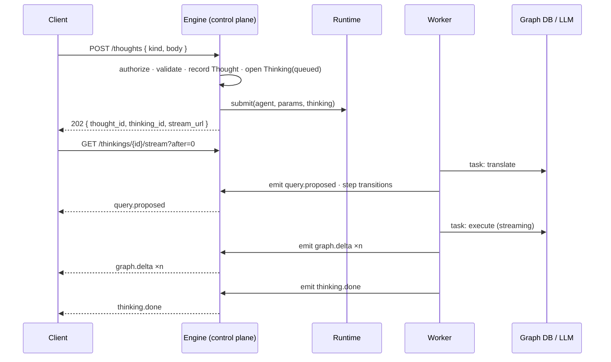
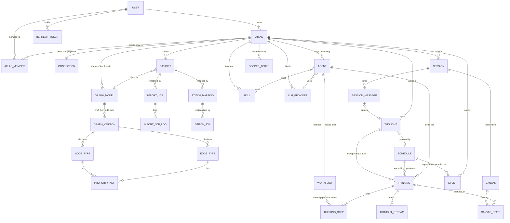
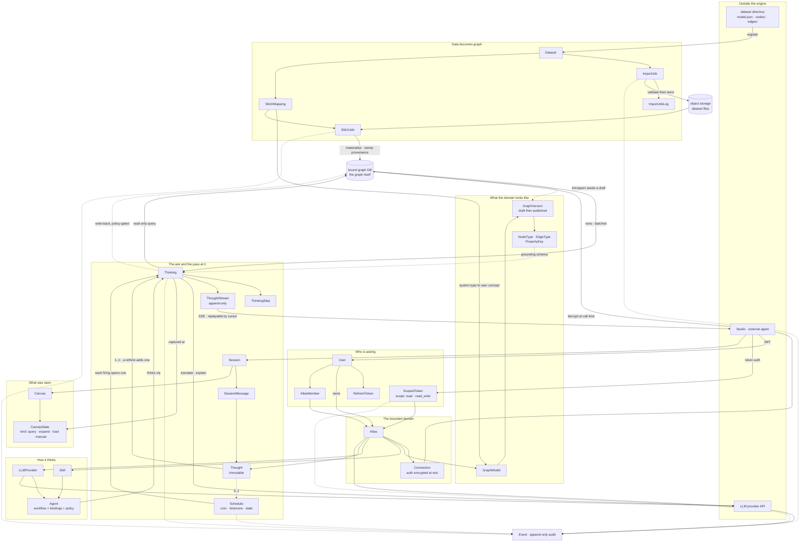
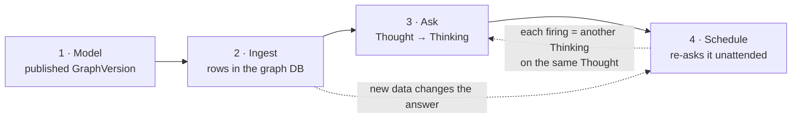

# Engine — MVP backend scope (architecture, data, guards)

The backend half of [`../mvp.md`](../mvp.md). This describes the **target system on its own terms** —
what the data looks like, how a request becomes work, and what guards it. The endpoints themselves
live in [`api.md`](api.md). The frontend counterpart is [`studio.md`](studio.md); slice sequencing
stays in [`../mvp.md`](../mvp.md).

Legend: `[ ]` not started · `[~]` in progress · `[x]` done · `[-]` deferred post-1.0

---

## 1. Architecture

### 1.1 The container model

> **An Atlas is a bounded knowledge graph your agents can reason over.** (RFC-049)


| Concept | Owns | Cardinality |
|---|---|---|
| **User** | identity, credentials, username | — |
| **Atlas** | the bounded knowledge domain: connection, models, datasets, skills, instructions, LLM bindings, agents, canvases, thoughts | `User` owns many |
| **Connection** | the live database binding | `1:1` with Atlas |
| **AtlasMember** | binary access (member or not — no roles) | `Atlas` has many |

There is no Workspace and no Mission. Every Atlas-scoped URL is namespaced
`/api/v1/u/{username}/{atlasSlug}/...`; `users.username` is globally unique and `atlases.slug` is
unique per owner.

### 1.2 The engine is a control plane

The engine **decides what to run and records what happened**. It does not do analytical work inside a
request. A query is a **Thought**; executing it is a **Thinking**; the client subscribes to the
resulting **thought stream**.

Layering is one-way and lint-enforced (`TID251`):

| Layer | Contains | May import | Must not import |
|---|---|---|---|
| `core/` | models · stores · schemas · db · settings · llm client · events · errors | — | `fastapi`, `starlette`, `prefect`, `invana.api` |
| `tasks/` | typed units of work; deps via `TaskContext` | `core` | same |
| `agents/` | **workflow** specs + interpreter | `core`, `tasks` | same |
| `runtime/` | `Runtime` protocol + bundled `inline` adapter | `core`, `agents` | `prefect` |
| `api/` | FastAPI: routes, services, deps, SSE, admin | everything below | `prefect` |
| `worker/` | task host entrypoint | everything below | `prefect` |
| `graph/` | connector SPI (public API — imported by `invana-{db}` packages) | `core` | `invana.api` |

Two distributions: **`invana`** and **`invana-prefect`** (the orchestrator adapter, in
`integrations/`, discovered through the `invana.runtimes` entry point like a graph connector).

Design detail: [`rfc-048-agent-runtime-on-prefect.md`](rfc-048-agent-runtime-on-prefect.md) ·
[`agent-runtime-code-structure.md`](agent-runtime-code-structure.md).

### 1.3 The thinking lifecycle



### 1.4 The task contract

A task is a typed callable whose dependencies arrive in a context, so the same code runs in the API
process or a worker:

```python
async def translate_thought(ctx: TaskContext, p: TranslateIn) -> TranslateOut: ...
```

| Member | Type | Purpose |
|---|---|---|
| `ctx.thinking` | `ThinkingRef` | `thinking_id` · `thought_id` · `agent_id` · `atlas_id` · `actor_id` |
| `ctx.resources.db` | `AsyncSession` | app DB, **task**-scoped |
| `ctx.resources.atlas` | `Atlas` | the resolved container |
| `ctx.resources.connector()` | `→ BaseConnector` | live graph connection |
| `ctx.resources.llm(purpose=)` | `→ LLMCall` | provider resolved, credential already applied |
| `ctx.resources.schema()` | `→ GraphVersion \| None` | grounding context |
| `ctx.resources.record(action, **d)` | `→ None` | domain audit event |
| `ctx.emit(emission)` | `→ None` | append to the thought stream |

Rules: typed JSON-serialisable in/out (so a task can be cached, retried, moved across a process
boundary); **user-facing output goes through `emit`, the return value is for the next task**; a task may
run twice, so emissions carry an idempotency key; no `settings` reads and no connection construction
inside a task.

### 1.5 Cross-cutting contracts

**Auth & guards**

| Guard | Applies to | Effect |
|---|---|---|
| `get_current_user` | every user-level route | HS256 access JWT (15m) |
| `require_superuser` | `/admin`, account provisioning, platform events | `users.is_superuser` |
| `require_atlas_member` | every `/u/{username}/{atlasSlug}/...` route | binary membership |
| `require_atlas_setup_complete` | analytical routes (thoughts, schema, introspect) | setup wizard finished |
| thinking-scoped token | `/internal/thinkings/{id}/...` | authenticates a **thinking**, not a user; single `thinking_id`, short-lived |

**Error model.** Code below the API layer raises a domain error; the API maps it. One mapping, so the
same failure means the same status everywhere.

| Domain error | Status | Meaning |
|---|---|---|
| `NotFound` | 404 | absent, or not visible in this scope |
| `Invalid` | 422 | well-formed but semantically unacceptable |
| `Conflict` | 409 | collides with existing state (uniqueness, lifecycle) |
| `Forbidden` | 403 | known actor, not permitted |
| `Unavailable` | 503 | a needed dependency (graph DB, LLM, orchestrator) is down |

Body: `{"detail": {"error": "<code>", ...context}}`.

---

## 2. Concept net

Every concept, and how it hangs together. Column detail is deliberately **not** here — this is the map,
not the schema.



**One box is not a table.** `WORKFLOW` is `agents.workflow_spec_jsonb` — a spec document embedded in
its agent and versioned with it. It appears on the map because it is a first-class *concept* (it is
what the user watches run) even though it is not a first-class *row*. Everything else here is a table.

### 2.1 The relationships that matter

| Relationship | Why it's shaped that way |
|---|---|
| `Atlas 1:1 Connection` | one Atlas, one graph database — the boundary is unambiguous |
| `Agent 1:1 Workflow` | **the workflow belongs to the agent, not the thought.** That is what lets the same thought be re-thought by a different agent — the whole point of multi-model perspectives. A thought carries only the ask; how to answer it is the agent's |
| `Thought 1:n Thinking` | a **rethink** adds a thinking, never mutates the thought. Two agents' attempts sit side by side |
| `Thinking 1:n ThinkingStep` | one step per task the workflow ran, so the card's step chips and the trace are the same data at two resolutions |
| `Session 1:1 Canvas` | the canvas is self-contained (own snapshot + query), so a member opens it without reading a private thread |
| `Thinking → ThoughtStream` | append-only with a cursor, so it is simultaneously the live feed, the reload replay, and the provenance chain |
| `Thought 0:1 Schedule` | a Schedule re-asks **the same immutable ask**, so every firing is another thinking under one thought — which is what makes "what changed since yesterday?" a diff of two thinkings rather than a join across sibling thoughts |
| `Schedule → Thinking` **has no FK** | `thinkings` *is* the run log. A firing's thinking is found by `thought_id` + `triggered_by='schedule'`, which is unambiguous because a thought has at most one schedule. There is deliberately no `schedule_runs` table — see below |
| `Schedule → Event` | a firing that opens **no** thinking (skipped on overlap, halted on an archived Atlas) is the one thing `thinkings` cannot record, so it goes to `events` — already append-only and already the record of things that happened |

> **Definition → run is `Thought → Thinking`, without exception.** Scheduled firings are not a second
> kind of run; they are ordinary thinkings with a different trigger. That invariant is why the
> schedule needs no run table of its own, and why an unattended 09:00 answer is byte-for-byte the
> same shape as one a user asked for.

#### Invariants that keep chains of thoughts reachable

Orchestrating several Thoughts — **a chain of thoughts**, one step's answer feeding the next — is
post-1.0, but the MVP is shaped so that building it is *additive*: four new tables or nullable
columns, plus one mechanical migration. Design rationale and the full seam analysis:
[`rfc-051-workflows.md`](rfc-051-workflows.md) § 7.

These six rules are what buy that. Breaking one turns a later addition into a rewrite.

| # | Rule | Breaks if violated |
|---|---|---|
| **R1** | Definition → run is always `Thought → Thinking` — never a second run concept per trigger | "open any step" becomes three different lookups |
| **R2** | Anything a later step could need is **`emit`ted**, not just returned. A return value is visible only to the next task *in the same workflow* | a downstream thought can't see it; the task needs rewriting |
| **R3** | Every thinking stays self-contained and openable on its own — own stream, own trace, own provenance | a step that renders only inside its chain can't be debugged or retried |
| **R4** | No API shape hardcodes "one schedule → one thought"; responses tolerate a step list | scheduling a chain becomes a breaking API change |
| **R5** | Chain membership will be **explicit** (a column), never inferred from timestamps or session | inferred grouping is wrong under concurrency, retries and skipped firings |
| **R6** | A task never depends on which thought invoked it — `TaskContext` + typed params, nothing more | hidden coupling makes the task unusable when chained |

The load-bearing one is **R2**. Because every user-facing output is already a typed emission on an
append-only stream addressable by `(thinking_id, seq, kind)`, thought B can consume thought A's answer
without either knowing the other exists — the hard part of chaining, already paid for.

### 2.2 What a thinking emits — the projection contract

**An answer is multi-modal.** One thinking may emit a subgraph *and* a ranked table *and* a headline
number *and* a written explanation — "which suppliers are single-sourced?" wants all four. Because the
stream is a sequence of typed items rather than one response body, this needs no "response type"
decision up front: each emission declares its own surface, and **the `kind` *is* the projection.**

| Emission `kind` | Payload | Projects to |
|---|---|---|
| `graph.delta` | `{nodes[], edges[], removed[]}` — batched ~500 | **canvas** — append path |
| `table.page` | `columns[]` · `rows[]` · `page` · `total` | **thread** — table, pages append |
| `metric` | `label` · `value` · `unit` · `delta?` | **thread** — inline stat / KPI |
| `chart.spec` | `type` (bar\|line\|pie\|scatter) · `data` · `encoding` | **thread** — chart |
| `text.delta` | markdown chunk | **thread** — streamed markdown |
| `query.proposed` | query · language · rationale · confidence | thread — query chip · trace |
| `plan.step` | chosen task · rationale | thread — reasoning line (LLM-planned agents only) |
| `clarification.requested` | question · options · `options_query` | thread — resume form |
| `log` · `error` | level · message / code · message | trace / thread |
| `thinking.done` | counts · timings | card footer · canvas history |

Two surfaces, split by data shape rather than preference: **canvas** takes `graph.delta` (spatial, and
the renderer already appends incrementally); **thread** takes everything else (read top-to-bottom next
to the ask that produced it).

Which kinds appear is decided by the tasks in the workflow — `execute` emits `graph.delta` **or**
`table.page` depending on what the query returned; `explain` emits `text.delta`, `metric`, `chart.spec`.
A deterministic workflow therefore has a predictable output shape, which is what keeps the thread
layout stable.

### 2.3 Storage & retention

| Concern | Rule |
|---|---|
| Encryption at rest | one Fernet key for `connections.auth_encrypted` + `llm_providers.api_key_encrypted` |
| Deletes | hard, cascading downward through ownership only. No `deleted_at` |
| Owner deletion | blocked while the user owns any Atlas (RESTRICT) |
| Thought stream | newest `INVANA_THINKING_HISTORY_LIMIT` thinkings per Atlas (500); payloads dropped after `INVANA_THOUGHT_STREAM_TTL_DAYS` (30) while thinkings + steps survive |
| Canvas history | newest `INVANA_CANVAS_HISTORY_LIMIT` states per canvas (30) |
| Scheduled thinkings | count against the same per-Atlas thinking limit; a Schedule with no surviving thinkings keeps firing regardless |
| Events | retained forever — audit is immutable |
| Dataset files | object storage, `atlases/<atlas_id>/datasets/<dataset_id>/…`; deletion cascades to objects |

### 2.4 Dataset format (the external contract)

Prepared outside Invana and consumed as-is:

```
<dataset_dir>/
├── model.json              # node/edge types + property constraints
├── nodes/<NodeType>.json   # array of records; type implicit from filename
└── edges/<EdgeType>.json
```

| Record | Shape |
|---|---|
| node | `{ "id": "doc-001", "properties": { … } }` |
| edge | `{ "id": "e-001", "from": "doc-001", "to": "person-42", "properties": { … } }` |

| Property type | Constraints |
|---|---|
| `string` | `min_length` · `max_length` · `pattern` |
| `integer` · `float` | `min` · `max` |
| `enum` | `values[]` (non-empty) |
| `boolean` · `datetime` · `uuid` · `json` | — |

All support `required` and `default`. Validation produces structured rows — `file` · `record_index` ·
`record_id` · `field` · `rule_violated` · `message` — collect-all by default, capped ~1000 before
aborting. Errors: missing required, wrong type, out of bounds, length/pattern, enum miss, unresolved
edge endpoint, duplicate node id per type. Warning (error in strict mode): unknown property key.

---

## 3. Data flow

§2 is structure — what relates to what. This is **movement**: where data enters, where it comes to
rest, and what carries it between the two. Every entity in §2 appears here, positioned by the job it
does in the flow rather than by who owns it.



### 3.1 Where data rests

Four stores, and the boundary between them is the thing to keep straight:

| Store | Holds | Notes |
|---|---|---|
| **App DB** (Postgres / SQLite dev) | every entity in §2 — the control-plane record | Never holds graph data itself, only what produced it |
| **Bound graph DB** | the graph: nodes, edges, properties | The user's database. One per Atlas via `Connection`. The engine reads it, and writes only through `StitchJob` or policy-gated write-back |
| **Object storage** | dataset files, `atlases/<atlas_id>/datasets/<dataset_id>/…` | Deleting a dataset cascades to its objects |
| **Outside** | the prepared dataset directory, the LLM provider | Neither is durable engine state; credentials for the latter live encrypted in `llm_providers` |

### 3.2 The four flows

Four things a user does with an Atlas, in the order they do them. Each one ends somewhere concrete.

| # | Flow | Chain | Ends in |
|---|---|---|---|
| 1 | **Modelling the graph** | `User → Atlas → Connection` · `GraphModel → GraphVersion → NodeType/EdgeType/PropertyKey` | a published version — the grounding schema every thinking reads |
| 2 | **Ingesting data into the graph** | `dataset dir → Dataset → ImportJob → ImportJobLog + object storage` then `StitchMapping → StitchJob` | rows in the bound graph DB, provenance-stamped |
| 3 | **Asking** | `Session → SessionMessage → Thought → Thinking` (via `Agent` + `LLMProvider` + `Skill`) `→ ThinkingStep + ThoughtStream` | emissions the client subscribes to; optionally a `CanvasState` |
| 4 | **Schedules** | `Thought → Schedule` → (each firing) `Thinking → ThinkingStep + ThoughtStream` | a time series of thinkings under one unchanged ask — the same question, answered again as the graph moves |

Flow 4 is flow 3 with the human taken out of the trigger. It reuses the entire asking path unchanged:
a firing does exactly what a **rethink** does, so an answer that arrived at 09:00 unattended is
indistinguishable in shape, provenance and replayability from one a user asked for.



Three properties of the shape are load-bearing:

- **Nothing analytical crosses a request boundary.** A `Thought` is recorded and a `Thinking` is
  opened; the work happens elsewhere and reports back through `ThoughtStream`. The API never holds a
  graph query open. This is also why scheduling is cheap — the firing path and the interactive path
  are the same path.
- **The flow is one-way into the graph DB.** Reads are unrestricted; writes arrive only via
  `StitchJob` or write-back, both of which stamp what produced them — which is what makes the
  provenance chain in [`api.md`](api.md) §9 answerable at all.
- **Trust is not a fifth flow, it is a stamp on the other four.** Every mutating surface writes an
  `Event`; external entry arrives via `ScopedToken`; every materialised node carries its source
  record. There is no path into the system that opts out of it.

---

## 4. API surface

Moved to its own document: [`api.md`](api.md) — every endpoint, grouped by area, plus the internal
thinking surface and the Python/CLI dataset API.

| Area | See |
|---|---|
| Auth | [`api.md`](api.md) §1 |
| Atlas & settings | [`api.md`](api.md) §2 |
| Model | [`api.md`](api.md) §3 |
| Datasets | [`api.md`](api.md) §4 |
| Stitching | [`api.md`](api.md) §5 |
| Sessions & canvases | [`api.md`](api.md) §6 |
| Thoughts & thinking (+ internal surface) | [`api.md`](api.md) §7 |
| Schedules | [`api.md`](api.md) §8 |
| Retrieval & external access | [`api.md`](api.md) §9 |

---

## 5. Scope by area

| Area | Status | Backend work |
|---|---|---|
| **Auth** ([`api.md`](api.md) §1) | `[~]` | User + username · bcrypt · JWT access/refresh · superuser-provisioned register · `get_current_user` · account self-service with sole-superuser / owns-graph guards |
| **CLI bootstrap** | `[~]` | `invana init` (username required, idempotent, `--non-interactive`); creates no graph |
| **Admin** | `[x]` | starlette-admin at `/admin`, `SuperuserAuthProvider` (session cookie, re-checked per request) · model views for every table with sensitive columns excluded |
| **Atlas + wizard + connection** | `[x]` | CRUD · `setup_state` + gating dep · 1:1 connection with test/ping/introspect · immutable `connector_class` |
| **Skills · LLM providers · Instructions** | `[x]` | atlas-scoped CRUD · Fernet at rest · partial unique default provider · single `Atlas.instructions` field |
| **Audit events** | `[x]` | append-only table · `emit_event` with redaction · keyset reads · `pg_notify` + per-worker `LISTEN` + broadcaster · wired across every write surface |
| **Atlas lifecycle + deletes** | `[ ]` | `status` enum · archived-graph write block · cascade matrix + ownership check |
| **Backend capabilities (RFC-022)** | `[ ]` | version-resolved `CapabilityProfile` per connector · `server_version` detect + cache · `CompatibilityStatus` + effective read-only · acknowledge route · property-type enforcement (422) |
| **Model authoring** | `[x]` | full model/version/type/property CRUD · draft-only 409s · publish/activate · introspect seeds a draft |
| **Generative model sessions** | `[x]` | modeller-surface branch: ensure model+draft → forced-tool propose → referential validate → reconcile into draft · commit reuses activate |
| **Datasets** ([`api.md`](api.md) §4) | `[ ]` | entities · model + record validators · object storage · job lifecycle + structured logs + SSE · Python API + CLI |
| **Stitcher** ([`api.md`](api.md) §5) | `[ ]` | mappings · identity resolution + conflict report · materialisation job · provenance stamping |
| **Agents · thoughts · thinking** ([`api.md`](api.md) §7) | `[ ]` | `tasks/` library + `TaskContext` · `agents/` interpreter · `runtime/` protocol + `inline` adapter + entry-point discovery · thought/thinking/step/stream tables + retention · thought & thinking API + SSE + internal surface |
| **Schedules** ([`api.md`](api.md) §8) | `[ ]` | `schedules` table (no run table — `thinkings` is the run log; skips are events) · cron parse/validate in an IANA timezone · due-scan tick that opens a thinking per firing (skip-on-overlap, no backfill) · pause/resume/run-now · `triggered_by=schedule` attribution · firings stop on archived / read-only Atlas. Design: [`rfc-051-workflows.md`](rfc-051-workflows.md) |
| **LLM runtime** | `[ ]` | provider-agnostic client: dispatch by provider, lazy SDK import, decrypt at call time, sync SDKs in `asyncio.to_thread` · structured output via forced tool-use with a JSON-schema fallback for Ollama/local · one repair round-trip · per-call timeout · normalised `LLMError` |
| **Grounding** | `[ ]` | prompt assembly (instructions + skills + retrieved context) · refuse to call with empty context for grounded ops · prompt caching where supported |
| **Groundedness / cannot-answer** | `[ ]` | detect empty context · explicit `cannot_answer` payload distinct from an empty answer · log as a defect-class event |
| **Write-back** | `[ ]` | validate proposed nodes/edges against the user model · stamp `thinking_id` + `created_by=agent` · auto-commit vs review per policy |
| **Success scoring** | `[ ]` | each criterion is a graph query returning pass/fail · on-demand + scheduled re-eval |
| **Semantic retrieval** | `[ ]` | vector-index mixin for capable backends · embedding pipeline |
| **External-agent API** | `[ ]` | scoped tokens · token-auth dep parallel to JWT · archived-graph read-only freeze |
| **CLI** | `[ ]` | `start` · `migrate` · `version` · `worker` · `datasets import`. Does **not** register users |

---

## 6. Dependencies & configuration

### 6.1 Python (`engine/pyproject.toml`)

| Area | Packages |
|---|---|
| Web / API | `fastapi` · `uvicorn` · `sse-starlette` |
| DB | `sqlalchemy[asyncio]` · `alembic` · `asyncpg` · `aiosqlite` (dev) |
| Auth / crypto | `passlib[bcrypt]` · `bcrypt<5` (passlib wrap-bug guard) · `PyJWT` · `cryptography` |
| Validation | `pydantic v2` |
| Object storage | `aioboto3` · `boto3-stubs[s3]` |
| LLM SDKs (lazy) | `anthropic` · `openai` · Ollama/local over `httpx` |
| Graph DB drivers | `neo4j` · `gremlinpython` · per-driver libs in `integrations/invana-{db}/` |
| Admin | `starlette-admin` · `itsdangerous` |
| Telemetry | `opentelemetry-*` (optional extra) |
| CLI | `click` · `rich` |
| Identity resolution | `rapidfuzz` *(spike before committing)* |

**Not an engine dependency:** `prefect`. It lives only in `integrations/invana-prefect/`, registered
through the `invana.runtimes` entry point. The bundled `inline` runtime means `invana start` needs no
orchestrator.

### 6.2 Environment

| Variable | Purpose |
|---|---|
| `INVANA_DATABASE_URL` | Postgres in prod, SQLite in dev |
| `INVANA_SECRET_KEY` | JWT signing (32+ bytes) |
| `INVANA_ENCRYPTION_KEY` | Fernet, for connection auth + LLM keys |
| `INVANA_S3_ENDPOINT` / `_ACCESS_KEY` / `_SECRET_KEY` / `_BUCKET` / `_REGION` | dataset object storage |
| `INVANA_CORS_ALLOWED_ORIGINS` | prod only |
| `INVANA_RUNTIME` | `inline` (default) \| `prefect` |
| `INVANA_THINKING_HISTORY_LIMIT` | thinkings kept per graph (500) |
| `INVANA_THOUGHT_STREAM_TTL_DAYS` | stream payload retention (30) |
| `INVANA_THINKING_STALE_AFTER` | reconciler threshold for stuck thinkings |
| `INVANA_CANVAS_HISTORY_LIMIT` | canvas states kept per canvas (30) |
| `INVANA_SCHEDULE_MIN_INTERVAL_MINUTES` | floor on schedule frequency (15) |
| `INVANA_SCHEDULE_TICK_SECONDS` | due-scan interval (60) |
| `INVANA_TELEMETRY_ENABLED` | OTel providers on/off |

LLM credentials are **per `llm_providers` row, encrypted** — never environment variables.

### 6.3 Infrastructure (dev — `docker-compose-infra.yml`)

Postgres (app state) · MinIO (S3-compatible object storage) · optional graph DB containers per
supported backend · optional Prefect server profile (only for `INVANA_RUNTIME=prefect`).

---

## 7. Delivery slices — engineering detail

Slice *ordering* and the user-facing outcome of each slice live in [`../mvp.md`](../mvp.md) § Delivery.
This section is what each slice actually touches on the backend, and where it can hurt.

### 7.1 Cross-cutting, not owned by any one slice

| Item | Detail | Status |
|---|---|---|
| Encryption at rest | Fernet (`INVANA_ENCRYPTION_KEY`) for `connections.auth_encrypted` + `llm_providers.api_key_encrypted` | `[ ]` |
| Object storage | MinIO in dev; S3-compatible client so prod swaps to S3 / GCS / R2. Dataset files only. | `[ ]` |
| Logging | Structured; correlation id carried request → task → thinking | `[ ]` |
| Telemetry | Engine traces/metrics/logs + Studio end-to-end query→render tracing, stitched FE→BE | `[ ]` |
| CORS | Permissive in dev, `INVANA_CORS_ALLOWED_ORIGINS` in prod | `[ ]` |
| Alembic | Reset on `arch/redesign`; one new initial migration covers the full redesigned schema | `[ ]` |
| Runtime seam | Orchestration behind one protocol; bundled `inline` needs no infra, `invana-prefect` ships separately | `[ ]` |
| Changesets | Every user-facing change carries one (CLAUDE.md #8) | `[ ]` |
| Docker | Multi-target Dockerfile → `invana/engine`, `invana/studio` | `[ ]` |
| Docs | MkDocs Material auto-built from `docs/` | `[ ]` |

### 7.2 Per-slice backend scope

| Slice | Backend work | Status |
|---|---|---|
| **S0** | Alembic reset · `secret_key` + `INVANA_ENCRYPTION_KEY` wired · empty `auth/` + `atlases/` modules mounted · OpenAPI → TS client generator in `studio/scripts/` | `[ ]` |
| **S1** | User (incl. username) · bcrypt · JWT access+refresh · `/auth/*` · `invana init` CLI (creates no Atlas) · `get_current_user` dep | `[ ]` |
| **S1.5** | Container renamed to the top-level entity (+ member join; the old `Graph` model became the connection child) · `users.username` · `intent` + `setup_state` · routes re-prefixed · Alembic regenerated | `[x]` |
| **S2** | Atlas CRUD · Connection sub-resource (GET/PUT/DELETE + test/ping/introspect) · `setup_state` + `require_atlas_setup_complete` · `query` + `schemas` routers re-prefixed · legacy `/api/v1/connections/*`, `/api/v1/atlases/{cid}/query`, `/api/v1/schemas/{sid}/active-version` shims deleted | `[x]` |
| **S3** | Multi-model atlas-scoped `/models` — full CRUD + draft→publish + node/edge/property-key authoring, draft-only and 409-guarded | `[x]` |
| **S3** (capabilities) | Version-resolved `CapabilityProfile` per connector · `server_version` detect + cache · `CompatibilityStatus` + effective read-only · acknowledge route · property-type enforcement (422) | `[ ]` |
| **S4** | `LLMProvider` entity + Fernet · CRUD + ping + set-default under `/llm/...` · partial unique on `is_default` | `[x]` |
| **S5** | Skill CRUD under `/skills/...`, unique `(atlas_id, name)`. The separate Instructions table shipped here and was later removed — folded into the single `Atlas.instructions` field. | `[x]` |
| **S5.5** | `events` append-only table + indexes + Alembic `00000000000d` · `emit_event` + sensitive-field redaction · keyset reads + SSE · `pg_notify` trigger + per-worker `LISTEN events` daemon + in-process broadcaster · superuser/member gates · admin view. Wired across every write surface (atlas, connection, llm, skills, instructions, members, auth, `query.execute`, system). | `[x]` |
| **S6a** | Dataset + ImportJob entities · `graph_model` JSONB · `atlas_id` FK · Pydantic schema for `model.json` + property constraints (string/int/float/bool/enum/datetime/uuid/json with required/min/max/length/pattern/enum.values) · model-driven record validator producing a structured report (file, record_index, record_id, field, rule, message) · referential integrity + node-id uniqueness | `[ ]` |
| **S6b** | MinIO in compose · `INVANA_S3_*` · async S3 client · bucket layout `atlases/<atlas_id>/datasets/<dsid>/...` · streamed + multipart uploads · file tree + fetch endpoints | `[ ]` |
| **S6c** | Executor interface + LocalExecutor · ImportJob stages (upload → validate model → validate records → derive system graph model → persist → done) · `import_job_logs` structured rows · SSE log stream | `[ ]` |
| **S6d** | `invana.datasets.import_dataset(atlas, name, path, *, refresh=False, strict=False)` → `ImportJob` handle with `.wait()` / `.stream_logs()` · CLI `invana datasets import --atlas <username/slug> --name <name> --path <dir>` | `[ ]` |
| **S7** | Mappings · identity resolution + conflict report · materialisation job · provenance stamping (`dataset_id` + `record_id` + `stitch_job_id` on every materialised node) | `[ ]` |
| **S9a** | Layered packages (`core/ tasks/ agents/ runtime/ api/ worker/`) + import-direction lint · `translate` · `validate` · `execute` · `shape` as typed tasks with `TaskContext`. No behaviour change. | `[ ]` |
| **S9b** | `thoughts` · `thinkings` · `thinking_steps` · `thought_stream` · `Runtime` protocol + bundled `inline` adapter · thought/thinking API + SSE · seeded deterministic `nl-query` workflow | `[ ]` |
| **S9c** | `integrations/invana-prefect` + `invana worker` + Prefect compose profile · state sync + stale reconciler · `clarify` suspend/resume | `[ ]` |
| **S9d** | `plan` task drives the bounded-agency loop over the allow-list, reading Atlas instructions + bound skills | `[ ]` |
| **S9e** | Write-back with `thinking_id` provenance · success-criteria scoring | `[ ]` |
| **S9.5a** | `schedules` table · cron + IANA-timezone validation · min-interval guard (422) | `[ ]` |
| **S9.5b** | Due-scan tick opens a thinking per firing · skip-on-overlap → `schedule.run_skipped` event · no backfill · `triggered_by=schedule` attribution · archived Atlas → `halted` | `[ ]` |
| **S9.5c** | Pause · resume · run-now · Atlas-wide `…/schedules` list with `next_run_at` + last outcome | `[ ]` |
| **S10** | Scoped tokens · token-auth dep parallel to JWT · retrieval endpoints (query / semantic / skill-mediated) · provenance in every response · archived-Atlas read-only freeze | `[ ]` |
| **S11** | `status` enum · archived-Atlas write block on every mutating route · cascade matrix + ownership check | `[ ]` |

### 7.3 Where it hurts

| Risk | Mitigation |
|---|---|
| **S9a touches every import.** Mechanical but wide — same class as the S1.5 rename. | Land the import-direction lint rules *first* so they point at the work. One package per commit, suite green each time, no feature work interleaved. |
| **S9b/S9c trade interactive latency for uniformity** — everything becomes a thinking, including a fast query. | Watch `submit → first emission`, not total duration. If p95 can't be held with warm workers, the fix is a per-agent fast path — a config change on the existing seam, not a redesign. **Don't pre-build it.** |
| **S6 looks bigger than it is.** No connector framework in MVP — it's JSON validation plus storage. | Ship it small and fast. The executor boundary is what matters; Celery / Ray / K8s drop in later with no UI change. |
| **Renames touch everywhere.** S1.5 proved it. | Land them before dependent slices start, so no new code is written against old names. |
| **`connections.atlas_id` is nullable** — artefact of the deleted standalone connection surface. | Tighten to `NOT NULL` in a future migration once orphan rows are cleared. |
| **Canvas integration is closed.** Studio renders exclusively through `@invana/canvas-react`, never `@invana/canvas` directly. `ExplorerCanvas` is the read/query visualiser; `SchemaCanvas` is the interactive schema editor. The old `@invana/canvas-core` + `@invana/layouts-d3-force` packages are gone. | Reopening this is a design decision, not a refactor. |

### 7.4 Working pattern

| Day | Work |
|---|---|
| 1 | Define Pydantic schemas + OpenAPI in the engine; regenerate the TS client; Studio stubs the page against the typed client |
| 2–N | Engine implements; Studio wires real calls; both on one feature branch |
| Gate | The slice's "Done when" sentence in [`../mvp.md`](../mvp.md) is reproducible from a clean checkout **by someone else** |
