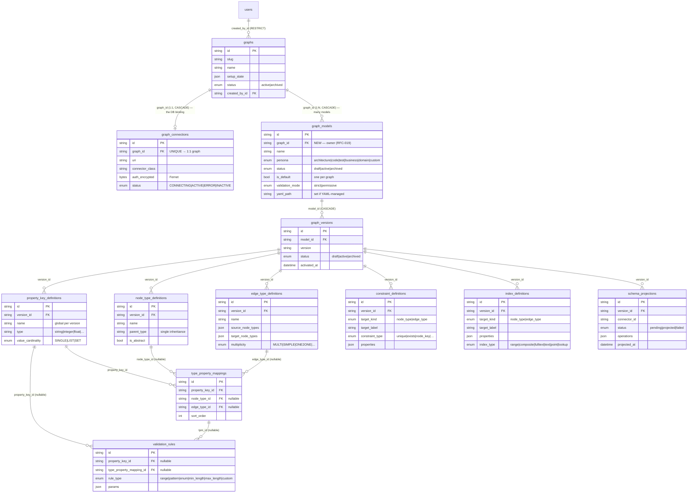
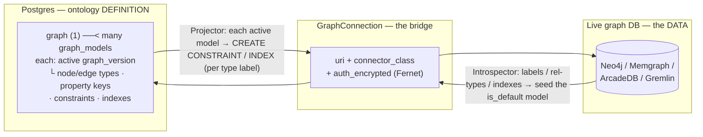

# Modeller data model — how the ontology is stored in Postgres

This shows the **RFC-019 target**: a `Graph` owns **many `GraphModel`s** (persona-scoped), each a logical
schema/subgraph over the one bound physical DB, each with its own versioned type tree.

> **Shipped today vs. target.** The current code is still *single-model* — one `graph_models` row
> linked from `graph_connections.model_id` (1:1). RFC-019 moves ownership to `graph_models.graph_id`
> (a Graph → many models) and deprecates the connection pointer. **Everything under `graph_versions`
> (the type tree) is identical in both.** The diagram below is the target.

Two sides:
- **Postgres (app state)** holds the ontology *definition* + version history.
- **The live graph DB** (Neo4j / Memgraph / …), reached through `GraphConnection`, holds the actual
  *data* and the *enforced* constraints/indexes. The Modeller's Projector/Introspector is the bridge.

**Model membership is derived from the type, not stamped on the node.** A node belongs to whichever
model's active schema declares its type label (`:Service` → the model(s) that define `Service`). So
disjoint type sets give disjoint models, and a shared type name simply means a shared node — no
per-node `subgraph_label` is needed.

## ER diagram — Postgres tables

*(Inter-model stitching — `anchor_mappings` binding `modelA.Type ≡ modelB.Type` — is a separate RFC-019
concern and is omitted here to keep this focused on how one model's ontology is stored.)*

## The bridge — Postgres definition ⇄ live graph DB

One physical DB holds the union of all the Graph's models. The Projector iterates the Graph's **active**
models and composes their DDL (constraints/indexes, per type label) onto that one DB.

## Worked example — the `Architecture` model

One of possibly several models on the Graph: `Architecture` (persona `architecture`) with
`Service {name:string UNIQUE, tier:enum}`, `Component {name:string}`,
`DependsOn(Service→Service)` decomposes into:

| table | rows |
|---|---|
| `graph_models` | `Architecture` (graph_id=…, persona=architecture, is_default=false) |
| `graph_versions` | `v1` (active) under that model |
| `property_key_definitions` | `name:string`, `tier:enum` — **global keys for this version** |
| `node_type_definitions` | `Service`, `Component` |
| `edge_type_definitions` | `DependsOn` (source `[Service]`, target `[Service]`) |
| `type_property_mappings` | name→Service, tier→Service, name→Component |
| `constraint_definitions` | `unique` on (`Service`, `[name]`) |
| `index_definitions` | `range` on (`Service`, `[tier]`) |
| `schema_projections` | one row recording `CREATE CONSTRAINT`/`INDEX` pushed to Neo4j (on `:Service`) |

A `Test` model on the **same** Graph would be another `graph_models` row (persona `test`) with its own
`Bug` / `Regression` / `TestSuite` types and its own version tree — projected onto the same Neo4j
alongside the architecture types. Because membership is type-derived, a `:Bug` node belongs to the test
model and a `:Service` node to the architecture model with no extra tagging.

**Key ideas:**
- **Many models, one DB.** `graph_models` rows are owned by the Graph (`graph_id`); they share the one
  bound `GraphConnection`. A node's model is whichever model declares its type — no per-node label.
- **Property keys are global per version**; types reference them via `type_property_mappings`. So
  `name:string` is defined once and reused — preventing `name` being a string on one type and an int on
  another. Constraints/indexes are first-class rows, so "`name` unique for `Service` but not `Component`"
  is expressible.
