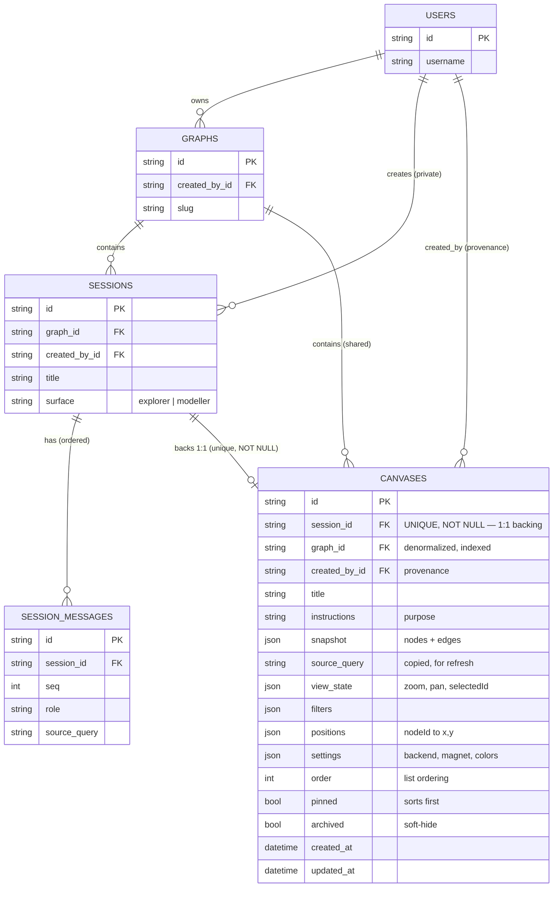

# RFC-043: Explorer Canvases — saved, session-backed views

**Status**: Accepted
**Author**: Invana Team
**Date**: 2026-07-06
**Related**:
- **RFC-024** (Query Sessions) — the entity this one is **1:1 session-backed** against. RFC-024
  Decision 3 deliberately persists *message metadata, not result payloads* and repaints the canvas
  by re-running `source_query`. This RFC **reverses that stance for the Canvas entity** (Decision 4):
  a canvas is a durable, shareable artifact and stores a snapshot. RFC-024 Decision 6 makes sessions
  **private to their creator** — the source of the central tension resolved in Decision 3 below.
- **RFC-011** (Studio Explorer) — canvases render on the Explorer surface (`ExplorerPage` /
  `ExplorerCanvas`); the tab bar lives in the Explorer main area.
- **RFC-017** (Graph as primary container) — canvases are graph-scoped (`graph_id` FK + cascade),
  URL-namespaced under `/api/v1/u/{username}/{graphSlug}/...`.
- **RFC-018** (Domain audit events) — adds `canvas.*` actions and a `canvas` target kind.
- **RFC-023** (binary membership) — access is "member of the graph or not"; canvas routes gate on
  `require_graph_member`.
- **RFC-027** (Interactive Modeller Canvas) — **disambiguation:** RFC-027 is the *Modeller schema*
  canvas (node/edge *types*, ephemeral positions). This RFC is the *Explorer data* canvas (query
  results, persisted positions). Different surfaces, different lifecycles.
- **RFC-028** (Backend-owned action messages) — canvas mutations return the action envelope.
- **MVP** — canvas persistence is **not currently in `mvp.md`**, and `mvp.md` line 304 explicitly
  defers `[-] persisted canvas layout positions`. Adopting this RFC requires a scope line and an
  amendment to that deferral (see *Scope & MVP impact*).

---

## Problem / intent

The Explorer paints a graph from a query, and today that painted state is **ephemeral**: node
positions, viewport, selection and any filters live only in the `@invana/canvas` store and vanish on
reload, navigation, or a canvas remount. Sessions (RFC-024) persist the *conversation* that produced
a view (query text + result metadata) and repaint by re-running `source_query`, but they do **not**
save the arranged, laid-out, filtered picture a user actually wants to come back to — and they are
private to one user.

Users want to **save a canvas** — the graph data, the viewport, filters, node positions, and all
visualization settings — give it a **title** and a written **purpose (instructions)**, keep several
of them, and switch between them as **tabs**. Clicking a tab header edits its title and instructions.

**Intent:** introduce a `Canvas` entity (model → store → services → schemas → routes), graph-scoped
and **shared across graph members**, each backed **1:1 by a Session**, storing a self-contained
snapshot plus the source reference; register it in the admin; and (deferred build) surface canvases
as an Explorer tab bar with an edit dialog.

---

## Decisions

1. **New graph-scoped module `invana.canvases`, mirroring `invana.sessions`.** Files
   `models.py` / `store.py` / `services.py` / `schemas.py` / `routes.py`. `Canvas` imports `Base`
   from `invana.modeller.models` like every other table. Routes are graph-scoped and gate on
   `require_graph_member` + `resolve_graph_by_username_slug`; mutations return the RFC-028 action
   envelope.

2. **`Canvas` is 1:1 session-backed.** `canvas.session_id` is `String(36)`, **`unique=True`,
   NOT NULL**, `ForeignKey("sessions.id", ondelete="CASCADE")` — every canvas is backed by exactly
   one session, and each new session yields at most one canvas. `graph_id` is **denormalized** onto
   the canvas (`ForeignKey("graphs.id", ondelete="CASCADE")`, indexed) so the shared list query
   scopes by graph without joining through `sessions` (whose visibility is per-creator). A canvas is
   created from an existing session (Decision 5); it is not created standalone.

3. **Shared graph-wide — and reconciled with the private backing session.** List / get / patch /
   delete are gated by `require_graph_member` **only**; they are **not** filtered by `created_by_id`
   (the opposite of RFC-024 Decision 6). This creates a real tension: a **shared** canvas is backed
   1:1 by a **private** session. It is resolved by making the canvas **self-contained** — the canvas
   carries its own `snapshot`, copied `source_query`, `title`, `instructions`, `view_state`,
   `filters`, `positions` and `settings`, so **any graph member renders a canvas without reading the
   backing session's private thread**. The `session_id` link is *provenance* plus the creator's own
   editing thread; it is never dereferenced to render for another member.
   - **Accepted consequence / open risk:** because the backing is 1:1, NOT NULL, and `ON DELETE
     CASCADE`, **deleting your private session deletes the shared canvas** that others may rely on.
     This is called out, not hidden. Mitigation is deferred, not designed-for: a future "detach /
     promote to a standalone canvas" action would migrate the constraint (drop NOT NULL / relink),
     not something this schema leaves a partial seam for. Alternatives (SET NULL, optional backing)
     were rejected per the 1:1 decision — see [Alternatives](#alternatives-considered).

4. **Persist both a snapshot and the source reference — reversing RFC-024 Decision 3.** RFC-024
   deliberately avoids snapshotting graph state into the app DB *for session messages*, because a
   message is an ephemeral turn and its result can be large and go stale. A **canvas is the opposite
   kind of object**: a deliberate, named, shared, stale-tolerant artifact whose whole point is to
   reopen instantly to the exact arranged picture — including for members who cannot re-run the
   private session. So the canvas stores a `snapshot` (`{nodes, edges}`) **and** a copied
   `source_query` for an explicit user-triggered "refresh from DB". The two are complementary, not
   redundant: snapshot = instant, offline-safe reopen; source = opt-in freshness.

5. **Creation, update, ordering.** `POST .../canvases` takes a `session_id` and seeds the canvas
   from that session's latest run (title defaults from the session title; `source_query` copied from
   the latest `source_query`-bearing message; `snapshot`/`positions`/`view_state` supplied by the
   client at save time). `PATCH .../canvases/{id}` updates any of `title`, `instructions`,
   `snapshot`, `source_query`, `view_state`, `filters`, `positions`, `settings`, `order`
   (`exclude_unset`). `order` (Integer) drives tab ordering. No re-execution endpoint is defined here
   — "refresh from DB" re-runs the backing session's `source_query` through the existing sessions
   path and PATCHes the returned data onto the canvas.

6. **Register in the admin.** A `CanvasView` `ModelView` is added to
   `engine/src/invana/server/admin/views.py` and registered (grouped under a "Canvases" `DropDown`,
   or alongside "Sessions"). No sensitive columns exist to exclude, but large JSON blobs
   (`snapshot`, `positions`) may be omitted from the list `fields` for readability.

7. **Events + delete semantics.** Emit `canvas.create` / `canvas.update` / `canvas.delete`
   (RFC-018) with a new `canvas` target kind. Hard delete, **downward cascade only**:
   `Graph → Session → Canvas` (and `Graph → Canvas` directly via the denormalized `graph_id`).
   Deleting a canvas never touches its session or graph.

8. **Titles + instructions.** `title` defaults from the backing session's title, user-editable via
   the edit dialog. `instructions` (the "purpose") is free Text, empty by default, edited in the same
   dialog.

9. **Archive (soft-hide) + pin, mirroring sessions.** `archived` and `pinned` boolean columns (both
   default `False`), matching `Session` (`engine/src/invana/sessions/models.py`). Archiving is a
   **soft hide, not a delete** — an archived canvas is excluded from the default list and revealed on
   demand. The list route filters archived out unless `?include_archived=true` (parallels
   `graphsApi.list(includeArchived)` and the sessions list); `pinned` sorts first. Both toggle via the
   existing `PATCH .../canvases/{id}` (`archived` / `pinned` in the body) — no dedicated endpoint.
   Delete remains the hard, cascading removal (Decision 7); archive is the reversible everyday action.

10. **Left-rail panel + main-section tab bar.** Canvases are surfaced two ways: a **native left-rail
    panel** (like Sessions/Model) — a **paginated list** (`limit`/`offset`) with per-row **edit**
    (title + instructions dialog), **delete**, **archive**, and **click-to-open**; and a **tab bar in
    the main-section header** where each open canvas is a tab (the canvas toolbar stays in the app
    header directly above it — `HeaderToolbarItems` reads the live camera and only initialises
    correctly there; in the tab strip the camera reads null and it throws). Because a
    canvas is 1:1 with a session, the tab bar unifies the two: a **"+"** starts a *blank* canvas
    (creates a fresh session + canvas), and **selecting a tab switches the active query session** to
    that canvas's backing session — so new composer queries belong to the active canvas. The
    unification is **bidirectional**: **starting a session also starts a canvas** — when a composer
    query creates a new session (no session was active), a canvas is auto-created for it, opened as
    the active tab, and the result is painted onto it. Opening an existing canvas hydrates it from its
    saved `snapshot` + `positions` (the restore effect is suppressed so the snapshot is not
    overwritten by a re-run); switching or closing a tab **autosaves** the view.

---

## Design

### Data model changes

This RFC adds **exactly one new table** and changes **no existing table**. The relationship to
`sessions` is expressed by an FK held on the *new* side, so `sessions`, `session_messages`,
`graphs` and `users` are untouched (no columns added, no constraints altered).

| Change | Object | Detail |
| --- | --- | --- |
| **New table** | `canvases` | Columns per the model below. |
| **New FK** | `canvases.session_id → sessions.id` | `UNIQUE`, `NOT NULL`, `ON DELETE CASCADE` — enforces the hard 1:1 backing (Decision 2). |
| **New FK** | `canvases.graph_id → graphs.id` | `NOT NULL`, indexed, `ON DELETE CASCADE` — denormalized for shared graph-scoped listing (Decision 2). |
| **New FK** | `canvases.created_by_id → users.id` | `NOT NULL`, indexed, `ON DELETE CASCADE` — provenance only; the canvas stays shared (Decision 3). |
| **New index** | `ix_canvases_graph_id` | Backs the shared list query (`WHERE graph_id = ?`). |
| **New unique** | `uq_canvases_session_id` | The 1:1 guarantee (one session → at most one canvas). |
| **New Alembic revision** | — | Creates `canvases` + its FKs/indexes; `downgrade` drops the table. Depends on the `sessions` (RFC-024) revision. |
| **No change** | `sessions`, `session_messages`, `graphs`, `users` | Untouched — the coupling lives entirely on `canvases`. |

**Cascade paths (all downward, hard delete):**

- Delete `Graph` → its `Sessions` and its `Canvases` both cascade (two independent paths via
  `graph_id`, plus `Session → Canvas` via `session_id`).
- Delete `Session` → its one `Canvas` cascades (**Decision 3 open risk**: this removes a *shared*
  canvas backed by a *private* session).
- Delete `User` → their `Sessions` (and thus backed `Canvases`) and any `Canvases` they created
  cascade.
- Delete `Canvas` → nothing else is touched (leaf).

### ER diagram



Read the crow's-feet: `SESSIONS ||--o| CANVASES` is **one-to-zero-or-one** — a session backs at
most one canvas (unique `session_id`); the canvas always has a session (`NOT NULL`). `GRAPHS` and
`USERS` fan out to many canvases; `SESSION_MESSAGES` remain the session's own ordered turns
(unchanged by this RFC).

### Data Model

```python
# invana/canvases/models.py
class Canvas(Base):
    __tablename__ = "canvases"

    id            : str       # uuid, pk
    session_id    : str       # FK sessions.id  ON DELETE CASCADE, UNIQUE, NOT NULL  (Decision 2)
    graph_id      : str       # FK graphs.id    ON DELETE CASCADE, indexed (denormalized, Decision 2)
    created_by_id : str       # FK users.id     ON DELETE CASCADE, indexed (provenance; canvas stays shared)

    title         : str       # String(255); defaults from session title (Decision 8)
    instructions  : str       # Text; the "purpose", default "" (Decision 8)

    # Self-contained render state (Decisions 3 + 4)
    snapshot      : dict      # JSON {nodes: [...], edges: [...]}
    source_query  : str | None # Text; copied for "refresh from DB"
    view_state    : dict      # JSON {zoom, pan: {x, y}, selectedId}
    filters       : dict      # JSON {nodeTypes: [...], edgeTypes: [...], ...}
    positions     : dict      # JSON {nodeId: {x, y}}
    settings      : dict      # JSON {backend, magnet, labels, colors, ...}

    order         : int = 0   # list / tab ordering (Decision 5)
    pinned        : bool = False  # sorts first in the list (Decision 9)
    archived      : bool = False  # soft-hide; excluded from default list (Decision 9)
    created_at    : datetime
    updated_at    : datetime  # onupdate
```

### Routes

```
GET    /api/v1/u/{username}/{graphSlug}/canvases            → list (paginated; ?limit&offset&include_archived&sort)
POST   /api/v1/u/{username}/{graphSlug}/canvases            → create from {session_id}  (action envelope)
GET    /api/v1/u/{username}/{graphSlug}/canvases/{id}       → get one
PATCH  /api/v1/u/{username}/{graphSlug}/canvases/{id}       → update incl. archived/pinned (action envelope)
DELETE /api/v1/u/{username}/{graphSlug}/canvases/{id}       → hard delete (action envelope)
```

The list returns `{items, total}` (like `SessionListResponse`): `pinned` first, then `order` /
`updated_at`; `archived` excluded unless `?include_archived=true`.

### Frontend (design — build deferred)

**First cut: a native left-rail panel in the Explorer** (like Sessions / Model — *not* a tab bar).

- **Rail wiring:** add `"canvases"` to `SettingsSection` + `KNOWN_SECTIONS`
  (`studio/src/components/settings/useSettingsPanel.ts`) and to `NATIVE_SECTIONS.explorer` +
  `ALL_NATIVE_SECTIONS` (`studio/src/pages/graphs/components/GraphDetail.tsx`, today
  `explorer: ["sessions", "model"]`), plus a rail icon in `useGraphLeftNav`. It becomes one more
  single-open accordion section — no new layout surface.
- **`CanvasesPanel`** (modeled on `studio/src/pages/graphs/explorer/components/SessionsPanel.tsx`): a
  **paginated list** of canvases (title + purpose snippet + node/edge/updated meta). Per row:
  **edit** → `CanvasFormDialog` (title + instructions, modeled on
  `studio/src/pages/graphs/modeller/components/ModelFormDialog.tsx`), **delete** (confirm),
  **archive** toggle, and **click-to-open**. An archived filter/toggle reveals archived rows
  (`?include_archived=true`). "New canvas" creates one from the active session.
- **Open in the canvas:** clicking a row sets `?canvas=<id>` and hydrates `ExplorerCanvas` from the
  row's `snapshot` + `positions` + `view_state` + `filters`; a "refresh from DB" re-runs the backing
  session's `source_query` and PATCHes the fresh data back. Saving captures positions from
  `canvas.layers.get<GraphLayer>("graph").store` + viewport → PATCH.
- **API + hooks:** `studio/src/services/api/canvases.ts` and
  `studio/src/hooks/queries/useCanvases.ts` (`useCanvasesQuery` + create/update/delete/archive
  mutations with invalidation), mirroring `useGraphs.ts` / `useSessions.ts`. Optional thin
  `stores/canvases.store.ts` for `activeCanvasId`.
- **Integrations:** none new — reuse `@invana/ui` (`Dialog`, list primitives), `@tanstack/react-query`,
  `@invana/canvas-react` store APIs. (`TabbedPanel` is only needed for the deferred tab-bar phase.)

---

## Alternatives considered

- **Canvas == Session (1:1 fold onto `sessions`).** Add view/filters/positions/snapshot/instructions
  columns to `Session` and make sessions the tabs. **Rejected:** forces sessions to become
  shared (breaking RFC-024 Decision 6) and reverses metadata-only *on the session itself* — a much
  larger blast radius on an already-shipped design. Keeping a separate table isolates the reversal to
  the new entity.
- **Separate Canvas with optional `session_id` (SET NULL, standalone-creatable).** A canvas could
  outlive its session. **Rejected** per the chosen hard 1:1 backing — every canvas originates from,
  and is owned by the lifetime of, exactly one session. (This remains the natural migration target
  should the "detach" mitigation in Decision 3 ever be needed.)
- **Source-reference only, no snapshot (pure RFC-024 style).** Store only `source_query` + positions
  and re-run on open. **Rejected:** a shared canvas must render for members who cannot execute the
  private backing session, and "reopen instantly to the exact picture" is the feature's core value.
  Snapshot is required; source is retained for opt-in refresh.

---

## Scope & MVP impact

This feature is **not in `mvp.md`** today, and `mvp.md` line 304 defers
`[-] persisted canvas layout positions`. Adopting this RFC requires two edits to `mvp.md`:

1. Add **`### 5.8 Explorer canvases — saved views (RFC-043)`** after §5.7b with the
   Backend / Frontend / Integrations triplet, status `[ ]` (design accepted, build sequenced after
   the current S3 slice).
2. Amend line 304's `[-] persisted canvas layout positions` to reference RFC-043, so the two
   documents no longer contradict on canvas persistence.

**Build plan (deferred to a post-acceptance turn):**
- Engine: `invana.canvases` module (model/store/services/schemas/routes); Alembic revision for the
  `canvases` table; `CanvasView` in `server/admin/views.py`; `canvas.*` events + target kind.
- Studio: `canvases` API + hooks; the `"canvases"` native left-rail section (rail icon +
  `SettingsSection`/`NATIVE_SECTIONS.explorer` wiring); `CanvasesPanel` (paginated list +
  edit/delete/archive/open); `CanvasFormDialog`; canvas hydrate/save wiring against the
  `@invana/canvas-react` store.
- Tests: a few positive + negative (create-from-session, shared list visible to a second member,
  cascade on session delete, archive hides from default list, patch title/instructions) against a
  real DB — no mocking.
- A **changeset** (user-facing change).

## Out of scope / non-goals

- **Standalone canvases** (no backing session) — see the SET NULL alternative; a future migration.
- **Detach / promote** a canvas off its session — the mitigation for the CASCADE risk (Decision 3),
  deliberately deferred.
- **Real-time collaborative editing** of a shared canvas (last-write-wins PATCH is the MVP).
- **Auto-refresh / TTL** of the snapshot — refresh is user-triggered only.
