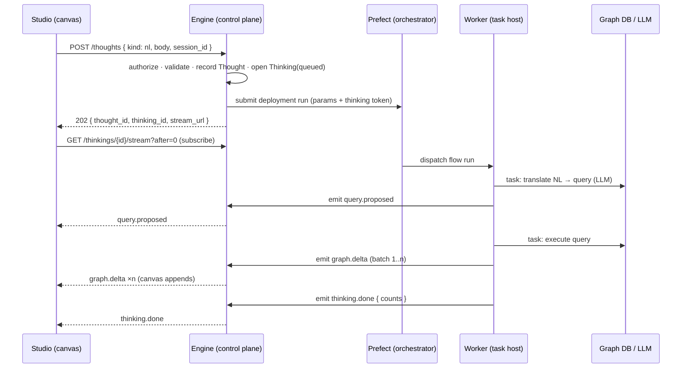

# RFC-048 — Agent runtime: engine as control plane, Prefect as executor, canvas as subscriber

| | |
|---|---|
| **Status** | Design accepted — decisions D1–D11 taken (see *Decisions*). Not implemented. |
| **Scope** | The engine's package layout, the thought/thinking domain, and the Studio ↔ engine contract. |
| **Code layout** | [`agent-runtime-code-structure.md`](agent-runtime-code-structure.md) |
| **Scope docs** | [`engine.md`](engine.md) (data + APIs) · [`studio.md`](studio.md) (journeys) · slices in [`../mvp.md`](../mvp.md) → S9 |
| **Supersedes** | RFC-016's `Executor` protocol (see *Reconciliation*) |
| **Interacts with** | RFC-024 sessions · RFC-030/032 LLM translate + runtime · RFC-038 query understanding · RFC-043/046/047 canvases · RFC-018 events/LISTEN-NOTIFY |

---

## Problem

Today's analytical work is shaped as **synchronous request/response inside the FastAPI process**.
A user types natural language; one HTTP handler translates it with an LLM, executes the resulting
query against the graph DB, and returns rows in the response body; the canvas paints whatever came
back. Every unit of intelligence is a service method behind a route.

That shape has four structural limits, and they compound as the product grows past "one query, one
answer":

1. **Work is bounded by the request.** Anything that takes longer than a browser is willing to wait
   (ingestion, stitching, multi-hop expansion, a plan that runs five queries) either can't be
   expressed or gets bolted on as a bespoke background mechanism. There is no retry, no resume, no
   backfill, no concurrency control, no queue — because there is no runtime.
2. **Multi-step reasoning has nowhere to live.** An agent that plans → asks a clarifying question →
   queries → re-plans → writes back is not a request. It is a durable, pausable, resumable
   execution with intermediate state. Modelling that inside a request handler means hand-rolling a
   state machine over session rows.
3. **Results are terminal, so the canvas can only render at the end.** A query that returns 40k
   nodes is one payload; the user stares at a spinner and then gets everything at once. There is no
   way to stream the first 500 nodes, then the next, then the edges — even though the renderer is
   perfectly capable of incremental append.
4. **Intelligence and transport are fused.** Translation, validation, execution and shaping are
   entangled with FastAPI dependencies, request-scoped DB sessions, and HTTP error codes. They can't
   be composed, reused in a different order, unit-tested in isolation, cached, or run anywhere other
   than inside the web process.

Orchestration is a solved problem. What is *not* solved — and is Invana's actual differentiation —
is the **contract**: what a task is, what it emits, how a thinking stays explainable, and how the canvas
consumes a thinking's output as it happens.

## Goal

Restructure the system into three layers with one-way dependencies:

- **Engine = control plane.** Owns identity, graphs, agents, thoughts, thinkings, and the thought stream. Submits work;
  never does the work. Contains zero orchestrator imports.
- **Prefect = executor.** Owns scheduling, retries, concurrency, pause/resume, worker lifecycle,
  and its own observability. Owns none of Invana's semantics.
- **Canvas = subscriber.** Subscribes to a thinking and applies typed deltas as they arrive. Never
  polls for a terminal blob, never talks to Prefect.

Concretely, this RFC aims to define:

1. A **Task** contract: a small, typed, orchestrator-agnostic Python callable.
2. An **Agent** as a train of thought plus bindings — a *way of thinking* a user can pick.
3. A **Thought** (the ask) and a **Thinking** (one pass at it) as first-class, durable, observable
   entities in the engine.
4. A **thought stream** — the append-only, replayable, typed stream a thinking produces, which is
   simultaneously the canvas feed *and* the groundedness/provenance chain.
5. A **runtime seam** thin enough that the same agent thinks in-process on a laptop and on Prefect in
   production, unchanged.

**Non-goals for this RFC:** the connector/ingestion task family, the stitcher, agent write-back
semantics, scheduled/autonomous agent firing, cross-atlas agents, and a Studio train-of-thought
authoring UI. The LLM-driven `plan` task is deferred to last — seeded trains of thought are
deterministic and need none of it.

---

## Design

### The flow, end to end



The user-visible latency budget shifts: the *first* emission matters, not the last.

### Vocabulary — a query is a Thought; machines do the Thinking

The product framing is not "the user runs a job". **A query is a thought**, and the machine thinks it
through on the user's behalf. The domain nouns follow from that, and they are the nouns used in the
API, the tables, and the UI — not a marketing skin over `job`/`run`:

| Term | Definition | Notes |
|---|---|---|
| **Thought** | The user's ask, as asked. NL prompt or QL text, bound to a graph and a session. Immutable once posed. | Replaces "query"/"prompt" as the entity. A thought can be thought about many times. |
| **Thinking** | One pass of machines thinking a thought through. Durable, addressable, subscribable, resumable. | Replaces "Run". A thought has 1..n thinkings — a **rethink** is a new thinking over the same thought, not a mutation. |
| **Thought stream** | The ordered, replayable trace a thinking emits as it thinks: `query.proposed`, `graph.delta`, `plan.step`, `log`, `error`, `thinking.done`. | Replaces the generic "emission log". What the canvas subscribes to, and what makes thinking explainable. |
| **Train of thought** | The persisted spec for *how* to think: task allow-list, entry, `require`, `max_steps` (D2). Data, not code. | Replaces "workflow". One interpreter runs every train of thought. |
| **Agent** | A train of thought **bound** to a graph, an LLM config, skills, and a policy — a *way of thinking* the user can pick. | Extends the Agent entity — see below. |
| **Task** | A typed Python callable, `(ctx, InModel) -> OutModel` — one move within a thinking. | Deliberately *not* renamed: it maps 1:1 onto a Prefect task, and keeping the word makes the adapter boundary obvious. |
| **Deployment** | The interpreter materialized on the orchestrator (Prefect deployment + work pool + limits). | Infrastructure, not domain. |

Why this earns its keep beyond aesthetics — the vocabulary makes the hard parts self-describing:

- **Rethink** is the natural name for re-running (`POST /thoughts/{id}/rethink`), and it explains why
  history is append-only: you never edit a thought, you think it again. The 1:n shape falls out.
- **"Show me how it thought"** is the explainability feature, and the thought stream *is* the answer —
  prompt → proposed query → executed query → records → what got painted, in order.
- **Thinking is a state**, so a paused clarification is legible: the machine is thinking, and it
  needs something from you (`awaiting_input`) before it can carry on. Not "job suspended".
- **Trains of thought are comparable.** Two agents thinking the same thought differently is a first-class
  thing to expose, which is exactly what RFC-019 (multi-model perspectives) wants.

Naming risks, recorded so nobody re-litigates them later: "thinking" collides with the industry's
chain-of-thought / reasoning-tokens usage (we mean the *whole* pass, LLM calls and graph queries
alike); and the plural `thinkings` reads oddly in SQL. Both were accepted — the alternative
(`thinking_passes`) is clumsier at every call site, and `thinkings` throws away the framing.

> **Agent = train of thought + bindings + policy.** The bindings half (skills · llm config · policy) is
> what a user picks; the train of thought is what makes it executable. Entity shape:
> [`engine.md`](engine.md) §2.4.

### Task contract

A task is deliberately boring. Two rules make it orchestrator-agnostic:

**Rule 1 — typed, JSON-serialisable in and out.** So the orchestrator can hash inputs for caching,
persist outputs, retry, and move a task across a process boundary.

**Rule 2 — user-facing output goes through `ctx.emit`, never the return value.** The return value
is for the *next task*. The thought stream is for the *user*. This single inversion is what makes
streaming, replay, and provenance fall out for free.

```python
class TaskContext(Protocol):
    thinking: ThinkingRef      # thinking_id, thought_id, agent_id, atlas_id, actor_id
    emit: Emitter          # async def (Emission) -> None   — appends to the thought stream
    resources: Resources   # graph connection · llm client · app db · object store
    logger: Logger

@task(key="translate_thought", retries=2, timeout=60, cacheable=True)
async def translate_thought(ctx: TaskContext, p: TranslateIn) -> TranslateOut:
    ...
```

- **`resources` is injected, never imported.** A task never constructs a graph connection or reads
  settings; it asks the context. This is what lets the same task run inside the API process (inline
  runtime) and inside a Prefect worker.
- **Task metadata is declarative** (`retries`, `timeout`, `cacheable`, `concurrency_tag`). The
  runtime adapter maps it onto Prefect task options, or onto inline equivalents. Tasks never import
  `prefect`.
- **Retry-safety is a task-author obligation**, stated in the contract: a task may run twice.
  Emissions carry an idempotency key so a retried task's duplicate emissions collapse.

Starter task library — the two tasks from the original ask, plus what they immediately imply:

| Task | In → Out | Notes |
|---|---|---|
| `translate_thought` | prompt + graph schema + context → query + confidence + rationale | Emits `query.proposed`. LLM call. |
| `clarify` | ambiguity → question set | Suspends the thinking awaiting user input (see below). |
| `validate_query` | query → verdict | Read-only enforcement moves **into a task**, not the API. |
| `execute_graph_query` | query → row batches | Emits `graph.delta` per batch; streaming, not buffered. |
| `shape_for_canvas` | rows → nodes/edges + style hints | Keeps render shaping out of the DB layer. |
| `expand_node` | node id + depth → deltas | RFC-035's expand becomes a train of thought, not a route. |

### Trains of thought — hybrid bounded agency (**D2: decided**)

A train of thought is a **persisted spec document**, not code. The spec names an **allow-list of tasks**, an
entry step, and a step budget; a `plan` task lets the LLM choose which allowed task runs next.
Agents are therefore *data* — versioned in Postgres, diffable, authorable from Studio — and agency
is bounded by construction: the LLM can only ever pick from the allow-list, and only `max_steps`
times.

```jsonc
// agents.workflow_spec
{
  "params":    { "prompt": {"type": "string", "required": true} },
  "entry":     "plan",
  "allow":     ["translate_thought", "clarify", "validate_query",
                "execute_graph_query", "shape_for_canvas", "expand_node"],
  "max_steps": 8,
  "require":   ["validate_query"],        // must run before execute_graph_query
  "on_error":  "emit_and_stop"

  // NOT a key yet: per-task model selection. The agent's single `llm_config_id`
  // applies to every LLM-calling task in the spec. Option space: D12 (open).
}
```

One **interpreter** executes every spec: load agent → run `entry` → the `plan` task returns
`{next_task, params}` → interpreter checks the allow-list, budget, and `require` preconditions →
dispatch → repeat until a task returns `done` or the budget is exhausted. Because there is exactly
one interpreter, there is exactly one flow to deploy per runtime, and adding an agent is an INSERT,
not a deploy.

Design consequences:

- **The interpreter, not the LLM, enforces safety.** Allow-list, `require` (a query is never executed
  without `validate_query` having passed), and `max_steps` are checked in Python before dispatch. A
  hallucinated task name is a validation error, not an execution.
- **Every planning decision is an emission** (`plan.step` carrying the chosen task + the model's
  rationale), so a thinking's reasoning is inspectable after the fact — this is what keeps an agentic loop
  compatible with the groundedness promise.
- **Deterministic specs are the degenerate case.** A spec with a linear `require` chain and no `plan`
  entry is a plain DAG; `nl-query` ships as exactly that, and the LLM-planned variant is opt-in per
  agent. Bounded agency is available, not mandatory.
- **Workflow-as-code was rejected** for user-authored agents (it is remote code execution, and it
  freezes the agent set at deploy time). Built-in task *implementations* remain code, of course —
  only the composition is data.

Rejected alternatives, for the record: **workflow-as-code** (Python `@flow` per agent — full
expressivity, but RCE and no Studio authoring) and **pure declarative DAG** (safe and simple, but no
room for the plan/re-plan loop that Layer 6 needs). The hybrid is the pure DAG plus one task, so
nothing is lost by starting here.

### Per-task LLM binding (**D12: open**)

An agent binds **one** LLM: `agents.llm_config_id` is a single FK → `llm_providers`
([`engine.md`](engine.md) §2.4). So every LLM-calling task in a train of thought thinks with the same
model. The question this leaves open is whether a *single* thinking should be able to use more than
one — a cheap model to `plan`, a stronger one to `translate_thought`, a long-context one to
summarise — and if so, where that mapping lives.

**Why this is not a worker concern.** The instinct is to split the worker fleet per model. Under
**D8** that inverts the design: a worker holds no credentials and no model identity — it exchanges a
thinking-scoped token at `/internal/thinkings/{id}/resources` and receives a client already resolved
from *that thinking's* bindings. One fleet therefore already serves N models, and model choice is a
lookup, not a topology. Splitting hosts is only warranted when the capability is a property of the
*machine* rather than of config — local weights on a GPU, an air-gapped or VPC-pinned endpoint, heavy
optional deps. That case is served by Prefect **work queues** and the existing declarative
`concurrency_tag`, with no change to `worker/` and no new abstraction; it is a deployment axis, not a
domain one. The axis in question here is which model a *task* asks for, which is data.

The option space:

| Option | Shape | For | Against |
|---|---|---|---|
| **A — status quo** | one `llm_config_id` per agent; per-task variation is achieved by defining more agents | Nothing to build. Keeps *agent = a way of thinking* honest: two models is arguably two ways | Cannot vary within one pass. Forces agent proliferation for what is a cost/latency knob, and the variants diverge on more than the model |
| **B — per-task override in the spec** | `workflow_spec.llm = { "default": <id>, "<task_key>": <id> }`; the interpreter resolves per dispatch | Local, explicit, diffable with the rest of the spec; agent count unchanged | Spec now carries provider UUIDs — brittle across Atlas export/import, and a spec stops being portable between Atlases |
| **C — named roles + Atlas-level map** | spec references roles (`"fast"`, `"reasoning"`, `"long_context"`); the Atlas maps role → provider | Specs stay portable and provider-agnostic; one place to re-point every agent when a model is swapped; composes with RFC-019, where the point *is* the same train of thought under different models | Two objects to author instead of one; needs a role vocabulary defined up front, and an unmapped role is a new failure mode to validate at submit |
| **D — planner-chosen model** | the `plan` task selects the model alongside the next task | Adapts to observed difficulty | Gives the LLM authority over cost, which is the opposite of bounded agency; cost becomes unpredictable per thinking. Out of step with D2 |

Constraints any option has to respect:

- **Resolution happens engine-side, at submit or at dispatch — never in the worker.** Whatever the
  mapping, it is read where the credentials are (D8), so the worker still receives a ready client.
- **`plan.step` emissions must carry the model actually used**, or the thought stream stops being a
  faithful account of how it thought — the groundedness promise (Layer 2) covers which model spoke,
  not only which query ran.
- **Cost and token accounting is per task, not per thinking**, once more than one model can appear in
  a pass.
- **Validation at submit, not at step 6.** An agent naming an unreachable provider or an unmapped
  role should fail when it is asked, not halfway through thinking.

What would settle it: whether role indirection is worth its second object depends on how often a
model gets re-pointed across many agents (favouring C) versus how often a single agent genuinely
needs two models (which B already covers). Both are answerable from S9b/S9d usage rather than by
argument, so this stays open until there are agents in the wild. Until then **A holds**, and neither
B nor C is scaffolded for.

### Pause / resume: clarification as a first-class state

The chosen next step for NL querying is **interactive clarification** (RFC-038 option B). Under the
current synchronous shape that requires hand-rolled multi-turn state. Under this design it is
native: the `clarify` task **suspends the thinking** with an input schema; the engine flips the thinking to
`awaiting_input` and emits `clarification.requested`; the user answers via
`POST /thinkings/{id}/resume`; the orchestrator resumes the flow with the supplied input.

This is one of the strongest arguments for an orchestrator with durable pause semantics, so
`suspend`/`resume` is a **hard requirement on the `Runtime` protocol**, not an optional nicety
(**D6: decided**). The `prefect` adapter delegates to `pause_flow_run(wait_for_input=…)` and its
resume API. The `inline` adapter implements the same contract by persisting `awaiting_input` plus the
interpreter's step cursor and re-entering the interpreter on resume — which is the whole reason the
interpreter's state lives in `thinkings`/`thinking_steps` rather than in a Python closure.

### The thought stream — one structure, three jobs

```
thought_stream(id, thinking_id, seq, kind, payload_gz, idem_key, created_at)   -- append-only
```

The same log serves:

1. **The live canvas feed** — subscribers tail it.
2. **Rehydration** — a page reload replays from `seq=0`; a late subscriber catches up. There is no
   "you missed it" state.
3. **Groundedness** (§5 of system-design) — `prompt → query.proposed → query.executed → rows →
   rendered elements` is literally the log, in order, with task attribution.

Design consequences worth stating explicitly:

- **It is a log with a cursor, not a pub/sub firehose.** Persist first, then broadcast. Every
  subscription API takes `after=<seq>`.
- **Batch, don't drip.** `graph.delta` carries up to N elements (500 as a starting point), gzipped.
  Per-row emissions would make the log the bottleneck.
- **Deltas are additive by construction** — `{nodes: [...], edges: [...], removed: [...]}`. The
  canvas applies them via the store's append path (`store.addData`), never by reassigning the
  layer's `data` prop, which is destructive and re-seeds the renderer.
- **Retention is bounded** (`INVANA_THINKING_HISTORY_LIMIT` thinkings per Atlas, plus `INVANA_THOUGHT_STREAM_TTL_DAYS`). Thinkings are
  cheap to create; the log must not grow unbounded. This overlaps RFC-046 (operation log) and
  RFC-047 (canvas states) — see *Collisions*.

### Result delivery (**D3, D4: decided**)

**Fan-in is engine-mediated over Postgres `LISTEN/NOTIFY`.** Workers `POST
/internal/thinkings/{id}/stream` with a thinking-scoped token; the engine persists the row, and the existing
RFC-018 notify trigger fans it out to every subscriber queue in every API replica. This reuses a
substrate already running in production, adds no infra, keeps one authorization model, and leaves the
orchestrator completely invisible to the browser. The cost accepted: one extra hop, and workers must
be able to reach the engine.

The broadcaster sits behind a narrow interface (`subscribe(thinking_id, after) -> AsyncIterator`), so
swapping in Redis Streams or NATS later is a single adapter — the decision to defer that is about
infra cost, not architecture. **Direct-to-Prefect subscription was rejected**: it leaks the
orchestrator into the client, has no per-atlas authorization story, and Prefect's events are not
typed graph deltas.

**Browser transport is SSE + `Last-Event-ID`**, with control actions (cancel, resume, answer) as
ordinary POSTs. The traffic is overwhelmingly one-directional, SSE gives replay-on-reconnect
essentially for free, and the pattern is already in the codebase for the events tail. WebSockets buy
one connection for many concurrent thinkings, which is not yet a real problem; revisit if a session
routinely tails several thinkings at once.

### Data model

```
agents          (id, atlas_id, key, version, workflow_spec_jsonb, params_schema_jsonb,
                 llm_config_id, skill_ids[], policy_jsonb, created_by, timestamps)
                 -- llm_config_id is ONE model for the whole train of thought (D12 open)
thoughts        (id, atlas_id, session_id?, message_id?, author_id, kind, body,
                 params_jsonb, created_at)              -- the ask, as asked. immutable.
thinkings       (id, thought_id, agent_id, agent_version, atlas_id, actor_id, status,
                 runtime, external_thinking_id, queued_at, started_at, finished_at,
                 error_jsonb, stream_seq)               -- one pass at the thought
thinking_steps  (id, thinking_id, seq, task_key, attempt, status, started_at, finished_at,
                 input_digest, output_digest, tokens?, cost?, error?)  -- provenance + timing
thought_stream  (id, thinking_id, seq, kind, payload_gz, idem_key, created_at)
```

`thoughts` is the entity the vocabulary buys us. The ask is written down once (`kind` = `nl` | `ql`,
`body` = the prompt or query text) and never edited; a **rethink** inserts another `thinkings` row
against the same `thought_id`. That makes "the same question, thought about twice — by two agents, or
after the graph changed" a query rather than a feature, and it gives RFC-019's multi-model
perspectives a natural key. Graph/session scoping lives on the thought; the thinking carries only
execution state.

`thinkings.status`: `queued · thinking · awaiting_input · succeeded · failed · cancelled`.
Prefect flow-run states map onto it (`SCHEDULED/PENDING→queued`, `RUNNING→thinking`,
`PAUSED/SUSPENDED→awaiting_input`, `COMPLETED→succeeded`, `FAILED/CRASHED→failed`,
`CANCELLED→cancelled`).

**State sync (D5: decided) — worker-pushed, with two backstops.** Step transitions are pushed by the
worker (`POST /internal/thinkings/{id}/steps`), because only the worker knows task-level detail and the
engine wants it live. A crashed worker pushes nothing, so: (1) a Prefect automation posts terminal
flow-run states to `/internal/thinkings/{id}/state`, and (2) a reconciler sweep — same idiom as the
existing `sessions/reconcile.py` — fails thinkings stuck in `thinking`/`queued` past
`INVANA_THINKING_STALE_AFTER` and emits a terminal `error`, so no thinking is subscribable forever.

**A thought attaches to a session message (D10: decided)** — `thoughts.session_id` +
`thoughts.message_id`, both nullable. RFC-024's sessions model is untouched; a message gains an
optional thought, and the thread renders live step state by following that thought's newest thinking.
Message-as-a-view-over-thinking is cleaner in the abstract but would rewrite the sessions model
mid-restructure; deferred, and cheap to revisit because the FK already points the right way.

**Retention (D11: decided).** `thought_stream` is the heavy table. Each graph keeps its newest
`INVANA_THINKING_HISTORY_LIMIT` thinkings (default **500**), pruned on insert; emission payloads are dropped
from thinkings older than `INVANA_THOUGHT_STREAM_TTL_DAYS` (default **30**) while the `thinkings` + `thinking_steps` rows
survive, so provenance and metrics outlive the replayable canvas feed. Payloads are gzipped
(`pack_json`/`unpack_json`, the RFC-047 idiom). Retention for RFC-046's operation log and RFC-047's
canvas states is unchanged by this RFC and revisited when the operation log becomes derived (Phase 3).

`thinking_steps` is what makes a thinking explainable without reading Prefect's UI, and is the natural home
for token/cost accounting (RFC-041).

### API surface

Posing a thought starts a thinking — one call, because a thought nobody thinks about is not a
use case. The thinking is then addressable in its own right:

```
POST   /u/{u}/{g}/thoughts                      → 202 { thought_id, thinking_id, stream_url }
                                                  body: { kind: nl|ql, body, agent?, session_id?, params? }
GET    /u/{u}/{g}/thoughts?session_id=          → list (each with its newest thinking)
GET    /u/{u}/{g}/thoughts/{id}                 → thought + all its thinkings
POST   /u/{u}/{g}/thoughts/{id}/rethink         → 202 new thinking over the same thought
                                                  body: { agent? }  — re-ask with a different mind

GET    /u/{u}/{g}/thinkings/{id}                → thinking + steps
GET    /u/{u}/{g}/thinkings/{id}/stream?after=  → live tail (SSE)
GET    /u/{u}/{g}/thinkings/{id}/trace?after=&limit=  → thought-stream replay page
POST   /u/{u}/{g}/thinkings/{id}/resume         → answer a clarification, carry on thinking
POST   /u/{u}/{g}/thinkings/{id}/cancel         → stop thinking

POST   /internal/thinkings/{id}/stream          → worker → engine ingest (thinking-scoped token)
POST   /internal/thinkings/{id}/steps           → worker → engine step transitions
GET    /internal/thinkings/{id}/resources       → worker exchanges thinking token for scoped creds (D8)
POST   /internal/thinkings/{id}/state           → orchestrator automation: terminal state (D5 backstop)
```

All atlas-scoped routes keep `require_atlas_member`. The `/internal/` surface authenticates a
**thinking**, not a user: a short-lived token minted at submit time, scoped to one `thinking_id`, so a worker
cannot write into another thinking's stream.

### Package restructure (**decided: two distributions**)

The point of the restructure is a **one-way dependency graph**, so the orchestrator sits behind
exactly one seam:

```
core  →  tasks  →  agents  →  runtime  →  api | worker
```

Two distributions: **`invana`** (the layers above, in one wheel) and **`invana-prefect`** (the adapter,
in `integrations/`, registered through the `invana.runtimes` entry point exactly like a graph
connector). Three lint-enforced rules: `core`/`tasks`/`agents` never import `fastapi`/`starlette`;
nothing under `invana` imports `prefect`; nothing below `api` imports `invana.api`.

**The full target tree, the per-module move map, and the migration gate live in
[`agent-runtime-code-structure.md`](agent-runtime-code-structure.md)** — kept in one place so the two
documents cannot drift. The decision-relevant part is only this: one distribution rather than six,
because at ~25k LOC the boundary that matters is import *direction*, which a lint rule enforces as
well as a package boundary would, without six `pyproject.toml`s and six venvs to maintain through a
restructure. Prefect is the one dependency worth genuinely isolating — heavy, optional, and it must
not be importable from the API — so it, and only it, gets its own distribution.

```python
class Runtime(Protocol):
    name: str
    async def submit(self, agent: Agent, params: dict, thinking: ThinkingRef) -> ExternalThinkingRef: ...
    async def cancel(self, ref: ExternalThinkingRef) -> None: ...
    async def resume(self, ref: ExternalThinkingRef, payload: dict) -> None: ...
    async def describe(self, ref: ExternalThinkingRef) -> RuntimeStatus: ...
    async def sync_deployments(self, agents: Sequence[Agent]) -> None: ...
```

Two adapters ship, and neither is a temporary scaffold:

- **`inline`** (bundled in `invana`) — asyncio, in the API process, **same interpreter, same task
  code, same thought stream**, no Prefect and no broker. This is what `pip install invana &&
  invana start` gets: the full thinking/stream/subscription experience with zero infra (repo rule 3, and
  RFC-016's "open it and go" goal). It also makes tests real rather than mocked (repo rule 7) — the
  actual tasks against an actual graph DB, just without an orchestrator.
- **`prefect`** (from `invana-prefect`) — Prefect 3 deployments on a work pool; the worker image is
  the engine image with a different entrypoint. Selected by `INVANA_RUNTIME=prefect`; the engine
  refuses to start if the runtime is selected but its entry point isn't installed.

**"Everything is a thinking" (D1: decided).** There is no fast path. Every analytical action — an NL
query, a node expand, an ingest — is submitted as a thinking, gets a `thinking_id`, streams emissions, and
appears in the Thinking view. One code path, one observability story, one provenance chain. The accepted
cost is submit→pickup latency on interactive queries under `INVANA_RUNTIME=prefect`; see *Performance*
for the levers that pay it back. The `inline` runtime is not an escape hatch from this rule — it is
the same rule executed in-process.

### Deployment topology (Prefect)

- Prefect server (or Cloud) + its Postgres, added to `docker-compose-infra.yml` as an optional
  profile so `make dev` stays light.
- **One work pool** (`invana-default`) with per-atlas **concurrency-limit tags** (**D9: decided**).
  Pool-per-atlas is deferred — it multiplies worker processes per tenant for an isolation guarantee
  that tags plus thinking-scoped credentials already provide at this scale.
- Because there is one interpreter (D2), there is **one deployment per runtime**, not one per agent.
  `sync_deployments` reconciles it at engine startup, so the orchestrator's view is derived state and
  is never hand-maintained.
- **Concurrency:** Prefect global concurrency limits keyed by the graph tag, plus API-level per-user
  rate limits. A single user must not be able to starve a shared work pool.
- **Worker credentials (D8: decided) — workers hold nothing.** No graph-DB DSNs, no LLM keys, no
  Prefect secret blocks. A worker exchanges its thinking-scoped token at
  `GET /internal/thinkings/{id}/resources` for short-lived, thinking-scoped credentials, which is also where
  the graph-membership check is re-applied. Secret material therefore never enters the orchestrator's
  storage or its UI, and revoking a thinking revokes its access.

### The user experience of thinking

Today the experience is: type, spinner, everything at once. `session_messages.status` goes
`running → ok|error` and that single bit is all the UI can show. The thought stream turns that opaque
gap into the product's most legible moment — the machine thinking in the open.

Most of the surfaces this needs **already exist**; they get wired to a stream instead of a response.

**1. The thinking card replaces the spinner.** The assistant turn becomes a live card whose step chips
come from `thinking_steps` as they transition:

```
▸ Understanding your question          0.9s   ✓     ← translate  (emits query.proposed)
▸ Checking the query is read-only      0.0s   ✓     ← validate
▸ Asking the graph                     1.4s   ●     ← execute    (graph.delta ×n)
  └ 1,240 nodes · 3,900 edges so far
```

The wait stops being dead time: the user learns *where* time goes (translation vs graph), which is also
the honest answer to why a thinking is slow. The counts tick because the deltas are already arriving.

**2. The canvas paints while it thinks.** `graph.delta` appends through the canvas store's append path
(never the destructive `data` prop). A 40k-node answer currently shows nothing until it shows
everything; now the first batch lands in the first second. This is what makes "everything is a
thinking" survive D1's latency cost — the perceived start gets *earlier*, not later.

**3. Clarification stops being a dead end.** The clarification UI is already shipped (§5.7b — option
buttons plus "let me type"). What changes is the semantics: today the clarify turn *ends* the exchange
and the user's answer starts a fresh translation, so the connection between question and answer is
only visual. Now the thinking is genuinely `awaiting_input` and the answer **resumes it** — same
thought, same thinking, one continuous trace. The card reads "needs something from you", not "failed".

**4. "Show me how it thought."** The `via` model label, `rationale`, and "view generated query"
disclosure already exist; the trace view is that disclosure grown up — prompt → rationale → proposed
query → validation verdict → batches → counts, in order, each attributable to a task. This is the
groundedness promise made visible rather than asserted, and it is the same rows that back §6.4
observability. No separate build.

**5. Rethink, as a first-class gesture.** Any past thought offers *think again* — same agent, or a
different one. Because thoughts are immutable and thinkings are append-only, the two results sit side
by side with their traces, which is exactly the comparison RFC-019 (multi-model perspectives) wants.
Today's "re-run" overwrites and forgets.

**6. Stop thinking.** A long query currently cannot be cancelled — the request is in flight and the
user waits or reloads. `POST …/cancel` makes stopping normal.

**7. Nothing is lost on reload.** The stream is a log with a cursor, so reopening a session replays
from `seq=0` and the card rebuilds — including a thinking still in progress. There is no "you had to be
watching" state.

Feedback (👍/👎, already shipped) attaches to the thinking rather than the message, so a downvote points
at a specific attempt and its trace.

**The UX budget this design must hold.** Step chips make waiting legible, but only if the *first* chip
appears fast. If `submit → first emission` exceeds a few hundred milliseconds, the card feels slower
than today's spinner even while finishing sooner — the wait becomes visible instead of hidden. That is
why *Performance* lever 4 instruments first-emission rather than total duration, and why the honest
sequencing is to ship on `inline` (in-process, no pickup latency) before turning on Prefect.

**Studio work:**

- `useThinkingStream(thinkingId)` — SSE tail with an `after` cursor, dispatching emissions to handlers,
  surviving reconnect by replaying from the last applied `seq`.
- Composer: POST a thought → subscribe → render as deltas land.
- `graph.delta` → canvas store append · `query.proposed` → the existing query chip ·
  `clarification.requested` → the existing options UI, now POSTing `/resume` · `plan.step` → a
  reasoning line in the card when an agent is LLM-planned.
- A **Thoughts** list per graph, each row expandable to its thinkings — arriving as a side
  effect of the data model rather than a separate feature.

---

## Reconciliation with existing design

**RFC-016 (pluggable executor)** already established the "Invana owns the contract, not the
scheduling mechanics" principle, with an `Executor` protocol, a bundled `LocalExecutor`, and
`invana-prefect` as a future adapter. This RFC is the same principle generalized: `Executor` (a
submitter of connector tasks producing Datasets) becomes `Runtime` (a submitter of trains of thought
producing emissions, of which a Dataset write is one kind). RFC-016's `Task → Dataset` write-session
contract survives unchanged as the ingestion task family's output rule. **D7: decided — this RFC
supersedes RFC-016's `Executor` protocol section.** `Runtime` replaces `Executor`, the bundled
`inline` adapter replaces `LocalExecutor`, and RFC-016's dataset write-session and cancellation
semantics are retained verbatim as task-level rules. RFC-016's `invana-prefect` package prediction is
fulfilled here, one layer up.

**Collisions to resolve before implementation** (each is additive today and would become
double-bookkeeping):

- **RFC-046 operation log** records session turns; **`thought_stream`** records intra-thinking events. One
  is a coarse projection of the other. Likely resolution: operation log rows become derived from
  thinkings rather than separately written.
- **RFC-047 canvas states** snapshot rendered canvas state client-side per turn; a thinking's delta log
  is the server-side story of *how* the canvas got there. They are complementary (image vs
  derivation) but their retention policies should be decided together.
- **RFC-024 sessions / messages** — resolved by D10: the thought attaches to the message. The sessions
  model is untouched; only the `nl` branch's *execution* moves.
- **RFC-030/032 LLM translate + runtime** — `translate.py` / `propose.py` become tasks. Mostly a
  move, and it is the natural Phase 0.

---

## Alternatives considered

| Alternative | Pros | Cons | Assessment |
|---|---|---|---|
| **Status quo (sync services)** | Lowest latency; simplest mental model; no infra | No durability, no multi-step agents, no streaming, no retries; every long job is bespoke | Blocks Layers 3, 4, 6 |
| **Own job runner (asyncio + DB queue)** | No external infra; full control | Reinvents the bottom 30% of Prefect — retries, pause/resume, backfills, worker health, UI — badly | This is the `inline` runtime's scope *only*; not the production answer |
| **Celery / RQ / Arq** | Mature, small | Task queue, not a workflow engine: no DAG, no durable pause/resume, no thinking-level observability | Doesn't cover the clarification loop |
| **Temporal** | Best-in-class durable execution; genuine workflow-as-code | Heavier ops; Python SDK's determinism constraints leak into task authorship | Real contender; the `Runtime` seam keeps it reachable |
| **Prefect (this RFC)** | Python-native, cheap to adopt, durable pause/resume, deployments/work pools, decent UI | Submit→start latency; another service to operate; multi-tenancy is convention (tags), not a primitive | Chosen, behind the seam |
| **LLM framework orchestration (LangGraph et al.)** | Purpose-built for agent loops | Owns the loop *and* the process; no work pools, weak operational story; couples the platform to an LLM framework | Reject — a train of thought could use one, as a task |

---

## Performance considerations

**The honest cost of this restructure is interactive latency.** A submit → schedule → worker-pickup
path adds hundreds of milliseconds to seconds versus an in-process call. For "type a question, see
nodes", that is a real regression and cannot be hand-waved.

D1 chose uniformity over a fast path, which means the latency must be paid down rather than routed
around. The levers, in order of leverage:

1. **Optimise for first emission, not last.** `execute_graph_query` streams batches, so the canvas
   paints as soon as batch 1 lands. Against today's buffer-everything response this can *win* on
   perceived latency even with a slower start — a 40k-node result currently shows nothing until it
   shows everything. This is the lever that makes "everything is a thinking" defensible.
2. **Warm, pre-provisioned workers** — long-lived processes holding prepared graph-DB pools and LLM
   clients, with the pool sized so an interactive submit finds an idle slot rather than queueing.
   Pickup latency, not cold start, must be the floor.
3. **Batch + compress emissions**; keep the log write off the hot path of row iteration.
4. **Measure it, with a budget.** Instrument `submit → first emission` (not just total duration) as a
   first-class metric under RFC-041, with an explicit target. If interactive p95 can't be held under
   it with warm workers, that is the trigger to revisit D1 — the `Runtime` seam and per-agent policy
   field make reintroducing a fast path a configuration change, not a redesign.

Scale notes: emission volume, not thinking count, is the load driver — a 100k-node result at 500/batch is
200 log rows, fine; naive per-element emission would be 100k rows, not fine. Subscription fan-out
must be per-thinking filtered at the broadcaster, not per-client-scans-everything.

## Security considerations

- **Thinkings are only created through the engine**, which stamps `actor_id` + `atlas_id` after a
  membership check and validates params against the agent's schema. The orchestrator is never
  directly addressable by clients.
- **Thinking-scoped tokens** for the `/internal/` ingest surface: short-lived, single-`thinking_id`,
  emission/step-write only. A compromised worker cannot read or write other thinkings.
- **No user-authored code, by construction (D2).** A train of thought is a spec constrained to a task
  allow-list, so authoring an agent can never introduce executable code. The interpreter validates
  every task name, `require` precondition, and the step budget in Python before dispatch; an LLM's
  hallucinated task name is a validation error, not an execution.
- **Query safety inside the task.** `validate_query` runs in the worker, immediately before
  execution — the guarantee travels with the work rather than living in a route that a new caller
  can bypass.
- **Secret placement (D8)** — engine-issued, thinking-scoped, short-lived credentials. No graph-DB DSN or
  LLM key is ever stored in an orchestrator secret block, so Prefect's storage and UI are not a
  secret-material surface.
- **Prefect's own surface** (UI + API) is an admin plane: not internet-exposed, not shared with
  end users, and its access does not imply atlas membership.

---

## Decisions

The design space was mapped first and decided second; this is the record. **D1** and **D2** shape
everything downstream.

| # | Decision | Chosen | Rejected alternative(s) |
|---|---|---|---|
| **D1** | Interactive query routing | **Everything is a thinking** — no fast path; uniform thinking/stream/observability for every action | Inline fast path for single-step interactive agents |
| **D2** | Train-of-thought definition | **Hybrid bounded agency** — persisted spec with task allow-list + `plan` task + `max_steps`; one interpreter | Workflow-as-code (RCE, no Studio authoring); pure declarative DAG (no re-plan loop) |
| **D3** | Emission fan-in | **Engine-mediated over Postgres `LISTEN/NOTIFY`** (reuses RFC-018), behind a swappable broadcaster interface | Redis/NATS broker (deferred, not rejected); direct-to-Prefect (rejected) |
| **D4** | Browser transport | **SSE + `Last-Event-ID`** replay, control actions as POSTs | WebSocket |
| **D5** | Thinking-state sync | **Worker-pushed steps** + orchestrator automation for terminal states + reconciler sweep for stale thinkings | Poll-only; webhook-only |
| **D6** | Clarification pause | **`suspend`/`resume` is part of the `Runtime` protocol** — Prefect delegates to `pause_flow_run`; inline persists the step cursor | Engine-side awaiting-input state; modelling the answer as a new thinking |
| **D7** | Relationship to RFC-016 | **Supersedes its `Executor` protocol** — `Runtime` replaces `Executor`, `inline` replaces `LocalExecutor`; dataset-write + cancellation semantics retained | Keep both abstractions |
| **D8** | Worker credentials | **Workers hold nothing** — exchange thinking-scoped token for short-lived creds at `/internal/thinkings/{id}/resources` | Prefect secret blocks holding graph-DB / LLM credentials |
| **D9** | Orchestrator tenancy | **One work pool + per-atlas concurrency tags** | Pool-per-atlas |
| **D10** | Thought ↔ session message | **Thought attaches to a message** (`thoughts.session_id`, `thoughts.message_id`, nullable) — RFC-024 untouched | Message as a view over a thinking (deferred) |
| **D11** | Retention | **Newest `INVANA_THINKING_HISTORY_LIMIT` thinkings/graph (500)**; emission payloads dropped after `INVANA_THOUGHT_STREAM_TTL_DAYS` (30) while thinkings/steps survive | Keep-all; drop whole thinkings on TTL |
| **D12** | Per-task LLM binding | **Open** — one model per agent (A) holds; options B (spec override) / C (named roles + Atlas map) mapped above, decided from S9b/S9d usage | Planner-chosen model (D) — hands cost authority to the LLM; splitting the worker fleet per model — contradicts D8 |
| **Pkg** | Distribution shape | **Two distributions** — `invana` (layered subpackages, lint-enforced) + `integrations/invana-prefect` via the `invana.runtimes` entry point | One dist with prefect as an extra; six separate packages |

Deliberately left open, to be settled by implementation rather than by RFC: exact emission payload
schemas per `kind`, the `plan` task's prompt shape, the interactive `submit → first emission` target
value (set it from the first real measurement, per *Performance* lever 4), and whether RFC-046's
operation log becomes derived from thinkings in Phase 3.

---

## Build order

Each step leaves a working system; nothing depends on a later step.

| # | Step | Delivers |
|---|---|---|
| 1 | Layered packages + import-direction lint rules | the seam exists and cannot rot |
| 2 | `TaskContext` · `Resources` · `Emitter` + `@task` registry | tasks can be written at all |
| 3 | `translate` · `clarify` · `validate` · `execute` · `shape` · `expand` as typed tasks | the moves a thinking is made of |
| 4 | `thoughts` · `thinkings` · `thinking_steps` · `thought_stream` + retention | the record, and the subscribable log |
| 5 | `Runtime` protocol + entry-point discovery + bundled `inline` adapter | thinkings execute, with zero infra |
| 6 | Train-of-thought spec + interpreter + seeded deterministic `nl-query` | an agent can be asked |
| 7 | Thought & thinking API + SSE tail + `/internal` ingest (thinking-scoped tokens) | pose · subscribe · resume · cancel |
| 8 | Streaming `execute_graph_query` emitting batched `graph.delta` | **first user-visible win: results stream** |
| 9 | Studio: `useThinkingStream`, composer posts a thought, canvas appends, thinking card | the thinking becomes legible |
| 10 | `integrations/invana-prefect` + `invana worker` + compose profile + state sync + stale reconciler | production orchestration |
| 11 | `clarify` suspend/resume wired end to end | the clarification loop |
| 12 | Thoughts list + thinking detail (trace) | "show me how it thought" |
| 13 | `submit → first emission` metric with a recorded p95 | the latency budget gets a number |

Later, once two or three deterministic trains of thought exist: the LLM-driven `plan` task, and Studio
authoring for trains of thought.

Obligations: decisions land in docs (root CLAUDE.md rule 0); changeset for the user-visible streaming
behaviour; tests per repo rules 5 and 7 — few positive and negative cases against a real graph DB and a
real local Ollama, no mocks.

## References

- RFC-016 (pluggable executor) · RFC-018 (events + `LISTEN/NOTIFY`) · RFC-024 (sessions) ·
  RFC-030 / RFC-032 (LLM translate + runtime) · RFC-035 (node expand) · RFC-038 (query
  understanding / clarification) · RFC-041 (query + LLM metrics) · RFC-043 / RFC-046 / RFC-047
  (canvases, operation log, canvas states).
- `docs/system-design.md` §2 (Task, Pipeline, Dataset), §4.6, §5 (groundedness).
- Prior art: Prefect 3 (deployments, work pools, `pause_flow_run(wait_for_input=…)`), Temporal
  (durable execution), Dagster (assets), Inngest / Hatchet (durable steps + events).
