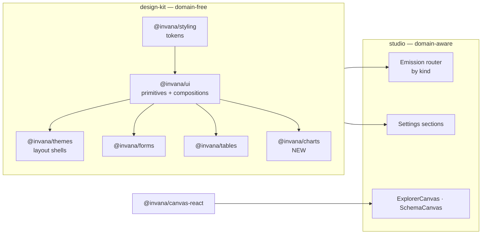
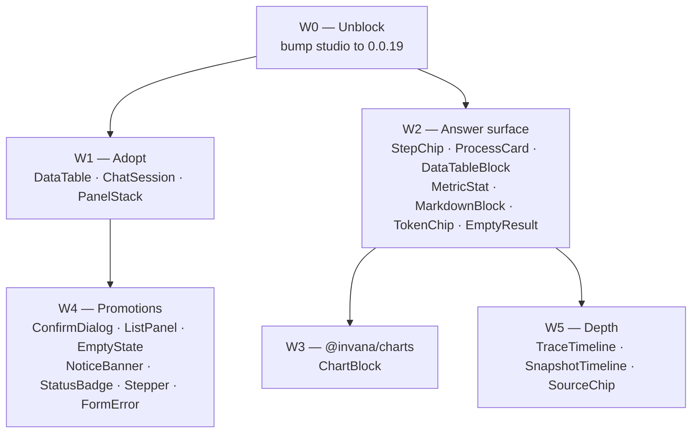

# RFC-050 — Design-kit component plan for Studio MVP

**Status:** Draft
**Scope:** Which components `@invana/design-kit` must ship so Studio can complete the MVP journeys in
[`studio.md`](studio.md), and in what order they get built.
**Companion docs:** [`studio.md`](studio.md) (journeys) · [`../mvp.md`](../mvp.md) (slice order)

> **Scope discipline.** Every net-new component below is anchored to a `studio.md` task ID. A
> component with no anchor is out of scope — see [§7 Non-goals](#7-non-goals).

---

## 1. Where things stand

`design-kit` is a separate repo (`github.com/invana/design-kit`, checked out at
`../design-kit`) — pnpm + Turborepo, published to npm as five packages.

| Package | Contains | Studio uses it? |
|---|---|---|
| `@invana/styling` | Tailwind v4 tokens, theme variants, `applyTheme` | ✅ |
| `@invana/ui` | 35 shadcn/Radix primitives + 17 extended compositions + typography | ✅ (66 import sites) |
| `@invana/forms` | `Form*`, `Field*`, typed field kinds (`InputField`, `SelectField`, `ObjectField`…) | ✅ (17 sites) |
| `@invana/themes` | `AppLayoutBase / V1 / V2`, `ThemeProvider`, `ThemeSelector` | ✅ (9 sites) |
| `@invana/tables` | `DataTable` (TanStack Table 8 + dnd-kit), pagination, toolbar, editable cell | ❌ **never imported** |

Visual surface = the Storybook app (`apps/storybook`, `pnpm --filter @invana/stoybook dev`, port
6009). ~200 stories exist. **Storybook is the design surface** — there is no Figma file, and no
design-system artifact is maintained outside this repo.

### 1.1 Three problems the audit found

| # | Problem | Evidence |
|---|---|---|
| P1 | **Version drift** — Studio is 7 releases behind | `studio/package.json` pins `^0.0.12`; design-kit `main` is at `0.0.19`. `ChatSession*` and `PanelStack` exist upstream but are absent from the `.d.ts` Studio compiles against. |
| P2 | **`@invana/tables` is dead weight** | Studio hand-rolls 5 tables (`ResultsTable`, `ConstraintTable`, `IndexTable`, `PropertyKeyTable`, `PropertyMappingTable`) on raw `<Table>` primitives. `DataTable` — with sorting, pagination, column visibility, pinning — ships unused. |
| P3 | **The §6 answer surface has no components at all** | `studio.md` §6 defines eight emission kinds (`graph.delta`, `table.page`, `metric`, `chart.spec`, `text.delta`, `query.proposed`, `clarification.requested`, `error`). design-kit has **no** chart primitive, **no** markdown renderer, **no** stat/KPI component. All of §6.5–6.14 are `[ ]`. |

---

## 2. Decision

| Decision | Rationale |
|---|---|
| **D1** — Storybook is the single design surface. No Figma, no parallel design-system artifact. | The rendered component *is* the design. A second artifact drifts. |
| **D2** — A component enters design-kit when it is **domain-free**: no Atlas, graph, schema, or session type in its props. | Keeps design-kit reusable and keeps graph semantics in Studio. This is the sorting rule for every row in §3 and §4. |
| **D3** — Emission renderers ship as **presentational** components in design-kit; the `kind` router stays in Studio. | design-kit renders a table/metric/chart; it must not know what a thought stream is. |
| **D4** — Studio tracks design-kit `latest` and bumps every release. No long-lived pin. | P1 is the cost of not doing this. |
| **D5** — Charting library is **Recharts**, added to a new `@invana/charts` package. | Only §6.7c needs it; isolating it keeps `@invana/ui`'s bundle free of a charting dep for consumers that don't chart. |

---

## 3. Net-new components design-kit must ship

Every row is anchored to a `studio.md` task. All are domain-free per **D2**.

### 3.1 The answer surface (`studio.md` §6) — highest priority, nothing exists today

| Component | Package | Renders | Anchors | Notes |
|---|---|---|---|---|
| `StepChip` / `StepChipGroup` | `ui` | Named step + state (`pending · running · retrying · repairing · done · failed`) + elapsed | 6.5, 6.14a, 6.14b | States drive colour; `running` animates. `retrying` carries an attempt counter and reason — a silent pause reads as hung ([RFC-052](rfc-052-failure-handling.md) § 3.3). First chip must paint immediately — see §6 UX budget. |
| `ProcessCard` | `ui` | Header + step chips + live counts + footer actions (stop / retry) | 6.5, 6.10 | Studio composes `ThinkingCard` from this. Card is domain-free: it knows "steps", not "thinkings". |
| `DataTableBlock` | `tables` | Paginated table, columns derived from row payload, pages **append** | 6.7a | Thin preset over existing `DataTable` — column inference + append-page mode. Replaces `ResultsTable`. |
| `MetricStat` | `ui` | Single KPI: value, label, optional delta + unit | 6.7b | Also reusable by RFC-042 analytics dashboard. |
| `ChartBlock` | `charts` **(new pkg)** | `bar · line · pie · scatter` from a declarative spec | 6.7c | See **D5**. Spec shape mirrors the `chart.spec` emission payload but stays a plain prop type. |
| `MarkdownBlock` | `ui` | Streamed markdown, appended token-wise without reflow thrash | 6.7d | Needs a markdown dep in `ui`; must not re-parse the whole buffer per token. |
| `TokenChip` | `ui` | Inline code/label chip with a `via` sub-label + click action | 6.7 | Studio's query chip = `TokenChip` + query text. |
| `SourceChip` | `ui` | Citation chip → click-through | 6.13 | |
| `EmptyResult` | `ui` | Distinct "cannot answer" block — visually *not* an answer | 6.14 | Deliberately unlike `Alert`; the point is it must never read as a result. |
| `DiagnosisBlock` | `ui` | Failure explanation: summary · evidence disclosure · suggestion buttons | 6.14c, 6.14d | Three visually distinct states now exist and must not be confused: **answer** · **can't answer** (`EmptyResult`) · **blocked** (`DiagnosisBlock`). See [RFC-052](rfc-052-failure-handling.md). |
| `TraceTimeline` | `ui` | Vertical timeline: label → disclosure → payload, per step | 6.11 | |
| `SnapshotTimeline` | `ui` | Horizontal lazy-thumbnail strip + per-item action | 6.24 | Thumbnails lazy-load; Studio supplies the images. |

### 3.2 Promotions — Studio already built it, it's domain-free, move it up

| Studio file | Becomes | Package | Anchors | Why promote |
|---|---|---|---|---|
| `ConfirmDialog.tsx` | `ConfirmDialog` | `ui` | 2.8, 3 (delete/archive), 4 | Generic destructive-action confirm with cascade preview slot. Used in ≥4 places. |
| `ListPanel.tsx` (`ListPanelChrome`, `ListRow`, `ListFilterMenu`) | `ListPanel` | `ui` | 6.20, 6.21, 3 | Rail-panel chrome — header, filter menu, rows, MORE expander. Already used by sessions *and* canvases. |
| `GraphStatusBadge.tsx` | `StatusBadge` | `ui` | 3, 5 | Status→variant mapping is generic; the status *vocabulary* stays in Studio. |
| `SetupWizard.tsx` (chrome only) | `Stepper` / `WizardCard` | `ui` | 3.x | Section list + done-state + unlock gating. The section *contents* stay in Studio. |
| `NoSelectionPlaceholder.tsx` | `EmptyState` | `ui` | 4, 6 | Icon + title + description + optional action. Currently duplicated inline in several panels. |
| `CompatibilityBanner` · `RendererCapabilityBanner` · `SetupRequiredBanner` | `NoticeBanner` | `ui` | 3, 4 | Three near-identical banners → one component with `severity` + action slot. |
| `forms/FormError.tsx` | `FormError` | `forms` | all forms | Belongs beside `FormMessage`. |

### 3.3 Adoption — it already exists upstream, Studio just isn't using it

| Existing design-kit export | Studio replaces | Anchors | Saving |
|---|---|---|---|
| `DataTable` (`@invana/tables`) | `ConstraintTable`, `IndexTable`, `PropertyKeyTable`, `PropertyMappingTable`, `ResultsTable` | 4, 6.7a | 5 hand-rolled tables; gains sorting, pagination, column visibility for free |
| `ChatSession*` (0.0.13+) | large parts of `SessionsPanel` (1134 ln) + `SessionComposer` (594 ln) | 6.1, 6.4 | Thread chrome, message roles/status, composer, message actions |
| `PanelStack` (0.0.19) | ad-hoc panel stacking in `ExplorerPage` (1635 ln) | 6 | Collapsible resizable stack |
| `Tour` | `SessionTutorialModal` | 6 | |

---

## 4. Stays in Studio — do not promote

Domain-bound per **D2**. Listing them so the boundary is explicit and nobody "helpfully" moves them.

| Studio component | Why it stays |
|---|---|
| `ExplorerCanvas`, `LayersPanel`, `StylingPanel`, `InspectorPanel` | Bound to `@invana/canvas-react` + graph element types |
| `SchemaCanvas`, `SchemaNav`, `SchemaBrowser`, `SchemaOverview` | Bound to the graph model / schema version types |
| `NodeTypeDetail`, `EdgeTypeDetail`, `PropertyEditor`, `*FormDialog` | Bound to modeller entities (RFC-021) |
| `ConnectionSection`, `LLMsSection`, `DatasetsSection`, `SkillsSection`, `EventsSection` | Bound to Atlas settings API shapes |
| `ExpandFineTunePanel` | Bound to the expand API (RFC-035) |
| `CanvasesPanel`, `CanvasTabsBar`, `CanvasHistoryPanel` | Bound to canvas entities (RFC-043/047) — but each *composes* §3 components |
| Emission router (`useThinkingStream`) | Knows the stream contract; renders design-kit blocks by `kind` (**D3**) |

---

## 5. Build order

Sequenced against `../mvp.md` slices. Each step is releasable on its own.

| Step | Work | Gates | Done when |
|---|---|---|---|
| **W0** | Bump `studio/package.json` to design-kit `0.0.19`; fix breaks; add `@invana/tables` | everything | `pnpm build` + `check-types` clean in Studio; no pinned-below-latest `@invana/*` |
| **W1** | Adopt what exists: `DataTable` for the 5 tables, `ChatSession*` under `SessionsPanel`, `PanelStack` in `ExplorerPage` | 6.1, 6.3, 4 | 5 hand-rolled tables deleted; `SessionsPanel` under 400 ln |
| **W2** | Build §3.1 answer-surface components in design-kit **with stories per state** | S9 / §6.5–6.14 | Every emission kind except `chart.spec` has a design-kit renderer + story covering empty / loading / streaming / error |
| **W3** | New `@invana/charts` package (Recharts), `ChartBlock` | 6.7c | Four chart kinds render from a spec; package builds via Turbo, publishes |
| **W4** | Promote §3.2 out of Studio; delete the Studio originals | 2.8, 3, 4 | No duplicated banner/confirm/empty-state code left in Studio |
| **W5** | `TraceTimeline`, `SnapshotTimeline`, `SourceChip` | 6.11, 6.13, 6.24 | Trace + history + citations render from design-kit |

**W0 is a hard gate.** Building `ThinkingCard` against `0.0.12` means building it without
`ChatSession` — that is exactly how `SessionsPanel` reached 1134 lines.

---

## 6. Working rules

| Rule | Detail |
|---|---|
| Story per state, not per prop | Each component ships stories for its real states: empty · loading · streaming · error · dense. Not one story per boolean. |
| No domain types in design-kit props | If a prop type has to import from Studio, the component is in the wrong repo (**D2**). |
| Release before consume | design-kit change → release → Studio bumps. No `file:` or `link:` in committed `package.json`; use `pnpm link` locally only. |
| Changeset both sides | design-kit change = design-kit changeset; the Studio bump that exposes it = Studio changeset (CLAUDE.md #8). |
| Themeable by default | Every new component works in both `light` and `dark` and under all `@invana/styling` theme variants — verified in the Storybook theme toolbar (RFC-044). |

---

## 7. Non-goals

| Not doing | Why |
|---|---|
| A Figma file or any design artifact outside the repo | **D1** — Storybook is the surface |
| Rebuilding `@invana/ui` primitives | shadcn/Radix coverage is adequate; no gap found |
| A design-kit `GraphCanvas` | `@invana/canvas` owns graph rendering (CLAUDE.md #10) |
| Promoting settings/modeller sections | Domain-bound — §4 |
| Component-level visual regression testing | Post-1.0 |
| Anything for `mvp.md` `[-]` deferred items | Out of MVP scope |

---

## 8. Open questions

| # | Question | Blocks |
|---|---|---|
| Q1 | Markdown dep for `MarkdownBlock` — `react-markdown` (heavier, plugin ecosystem) vs `marked` + sanitizer (lighter, manual)? Streaming append behaviour differs. | W2 |
| Q2 | Does `@invana/charts` warrant its own package, or fold into `ui` behind a subpath export (`@invana/ui/charts`)? **D5** assumes a package. | W3 |
| Q3 | Is `ChatSession*` (451 ln upstream) rich enough to carry the thread, or does adopting it mean extending it first? Needs a read of the 0.0.19 source before W1 is estimated. | W1 |
