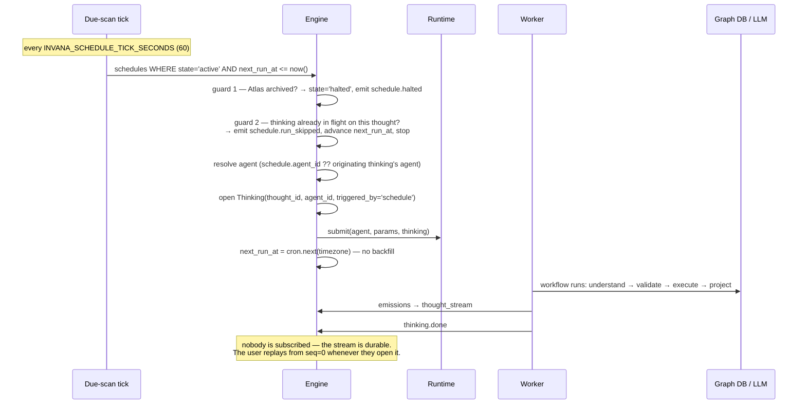
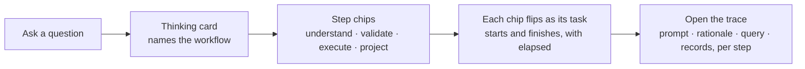
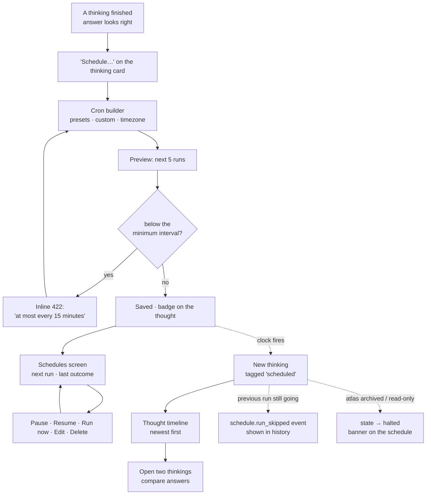
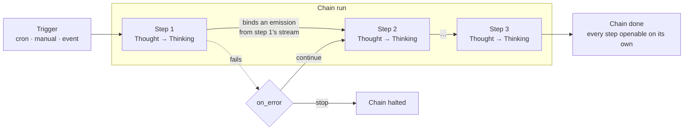

# RFC-051 — Workflows and Schedules

**Status:** Draft
**Supersedes:** in [RFC-048](rfc-048-agent-runtime-on-prefect.md) — the "Train of thought" vocabulary row, and the `workflow_spec` shape (§ 3.1 adds per-step `args`) · `mvp.md` S8 "Scheduled thoughts"
**Depends on:** [RFC-048](rfc-048-agent-runtime-on-prefect.md) (thoughts · thinkings · the runtime seam)

---

## 1. Two things, named for what they are

RFC-048 built a workflow engine and then declined to call it one — the spec that drives a thinking
was named *train of thought*, and the word "workflow" was left unused. This RFC assigns it to the
thing that earns it, and names the trigger honestly.

| Concept | Is | Lives on | User sees it |
|---|---|---|---|
| **Workflow** | the ordered spec of tasks that turns a question into an answer: `understand → validate → execute → project` | `agents.workflow_spec_jsonb` | as step chips on the thinking card, and in the trace |
| **Schedule** | `thought_id` + cron + timezone + state | `schedules` | on the Schedules screen, as a badge on the thought |

**A Thought has no workflow.** The workflow belongs to the **Agent** — which is what lets the same
thought be re-thought by a different agent, the whole point of RFC-019's multi-model perspectives.

| Entity | Role |
|---|---|
| **Thought** | the ask — immutable, carries `params_jsonb`. No workflow. |
| **Agent** | Workflow + bindings (LLM config · skills · policy). A *way of thinking* the user picks. |
| **Thinking** | one run of a Workflow over a Thought |
| **ThinkingStep** | one task within that run |
| **Schedule** | a trigger that opens a Thinking on a Thought, unattended |

## 2. Why the word moves

"Workflow" pointed at a cron row in the first draft of this RFC. That put the word on the thinner
concept while the substantial one — the thing that actually runs, has steps, has timings, and is
already rendered in the UI — kept a name nobody outside the codebase would guess.

Naming it correctly gives a product claim that is both stronger and true:

> **Every answer ran a workflow, and you can watch it run.**

```
Thinking card
┌─ Workflow: nl-query ─────────────┐
│ ✓ understand    412ms            │
│ ✓ validate       31ms            │
│ ▶ execute      1.2s              │
│ ○ project                        │
└──────────────────────────────────┘
   ⏱ Schedule: daily 09:00
```

That surface already exists — `studio.md` § 6.5 specifies the thinking card with step chips. This
RFC labels it.

### 2.1 "Train of thought" is retired

Two names for one concept is the confusion being removed, so the term goes rather than becoming an
alias. RFC-048's vocabulary table gains a correction: **Workflow** replaces *train of thought*, and
`agents.workflow_spec_jsonb` — flagged as a stale leftover in this RFC's first draft — turns out to
have been right all along. No column rename.

RFC-048 chose "train of thought" to keep the thought/thinking framing intact. That framing survives
where it matters: a **Thought** is still asked, a **Thinking** is still a pass at it. Only the spec
is renamed.

### 2.2 Names considered — the decision record

Recorded so nobody re-litigates this. The spec is called a **Workflow**; every other candidate was
weighed and rejected for a stated reason.

| Candidate | Verdict | Reason |
|---|---|---|
| **Workflow** | ✅ **adopted** | Says exactly what it is — an ordered spec of tasks. Understood by every user without a glossary. Already the column name (`agents.workflow_spec_jsonb`). Survives the deterministic case *and* the `plan`-driven agentic case. |
| *Train of thought* | ❌ retired | RFC-048's original. Poetic, but needs explaining, and it left the obvious word unused while the concept it named was the one thing users actually watch run. |
| *Chain of thought* | ❌ rejected | **Two collisions — see below.** |
| *Pipeline* | ❌ rejected | Implies data flowing through stages, which is not what this is, and collides with the deferred dataset pipeline concept (`mvp.md` → post-1.0). |
| *Taskflow* | ❌ rejected | Solves nothing "Workflow" doesn't, and invents a word the user has to learn. |
| *Recipe* · *Playbook* | ❌ rejected | Both imply user authoring, which RFC-048 **D2** rules out for MVP. A name should not promise a feature that doesn't exist. |

#### Why not "chain of thought"

It is the most tempting candidate — it fits the Thought/Thinking family and sounds native to the
product. It fails on two counts, and the second is decisive.

**1. It means something else in the industry.** Chain-of-thought is the LLM's step-by-step *reasoning
tokens*. Ours is not that: a workflow spans an LLM call **and** a graph query **and** a projection,
and its deterministic form involves no reasoning tokens at all. RFC-048 already recorded this
collision as a live risk for the word *thinking*:

> "'thinking' collides with the industry's chain-of-thought / reasoning-tokens usage (we mean the
> *whole* pass, LLM calls and graph queries alike)"
> — RFC-048, *Vocabulary*

That collision was accepted once, reluctantly. Adopting the industry's exact phrase for a second,
different concept compounds a known problem rather than containing it.

**2. It already means something else *here* — and it is a feature we deliberately deferred.**
`Thought` is a first-class entity in this system. A "chain of thoughts" therefore reads, correctly,
as *several Thoughts chained together* — which is precisely the multi-step composition listed under
[§ 6 Non-goals](#6-non-goals) as post-1.0. The name would describe the thing we are **not** building,
while the thing we **are** building went unnamed.

**Consequence: the phrase is reserved, not discarded.** If multi-step schedules are ever built, *a
chain of thoughts* is the right name for them — one Thought's answer feeding the next. Spending the
phrase on a single workflow now would leave that future feature with nothing to be called.

| Phrase | Refers to | Status |
|---|---|---|
| **Workflow** | the ordered tasks that answer **one** Thought | ✅ MVP |
| *Chain of thoughts* | several Thoughts chained, one feeding the next | 🔒 reserved for post-1.0 |

### 2.3 How to say it

The vocabulary only pays off if the sentences are said the same way twice. These are the canonical
ones — for docs, UI copy, commit messages and code comments alike.

| ✅ Say | ❌ Not |
|---|---|
| A **Thinking** runs an **Agent's Workflow** over a **Thought** | ~~A Thought executes a workflow~~ |
| The **Agent** carries the workflow | ~~The Thought carries the workflow~~ |
| A **rethink** opens another Thinking on the same Thought | ~~Re-running the thought~~ |
| A **Schedule** fires, opening a Thinking | ~~A workflow fires~~ |
| A **ThinkingStep** is one task of the workflow | ~~A workflow step is a thought~~ |
| A **chain of thoughts** links several Thoughts, one's answer feeding the next | ~~A workflow is a chain of thoughts~~ |

Three mistakes account for nearly all of it:

| Mistake | Why it is wrong |
|---|---|
| **"A Thought executes…"** | A Thought is the *ask* — immutable data. It executes nothing. The **Thinking** is the execution. This is the `definition → run` split the whole model rests on (§ 4.1, R1). |
| **"The Thought's workflow"** | The workflow belongs to the **Agent**. If it hung off the Thought, the same thought could not be answered two ways — and re-thinking one question through different agents is a first-class feature. |
| **"A workflow, i.e. a chain of thoughts"** | Different levels. A workflow answers **one** Thought. A chain of thoughts is **several** Thoughts — and it is made *of* thinkings, each running a workflow of its own. Collapsing them leaves the post-1.0 feature with no name (§ 2.2). |

> **Loose product copy is allowed to be loose.** "Ask a question and it runs a workflow" is fine in
> marketing prose — asking *does* trigger a workflow run. The precision above is for anything that
> describes the system: docs, schemas, APIs, and code.

## 3. Workflows in the MVP

The MVP ships **one built-in workflow**, `nl-query`, as a linear DAG — RFC-048 D2's deterministic
degenerate case, no `plan` entry:

| Step | Task | Does |
|---|---|---|
| understand | `translate_thought` | NL → Cypher / Gremlin |
| validate | `validate_query` | `require`d before execute — a query is never run unvalidated |
| execute | `execute_graph_query` | runs it against the bound connection |
| project | `shape_for_canvas` | shapes emissions for the canvas and thread |

| In MVP | Not in MVP |
|---|---|
| The workflow is **visible** — named on the card, steps as chips, per-step timings, full trace | **Authoring** one. Reversing RFC-048 **D2** (no user-authored specs) needs its own threat model — a spec drives task dispatch. |
| Built-in workflows are data (INSERT, not deploy) | A workflow builder UI |
| `plan`-driven bounded agency exists in the interpreter (S9d) | Branch / conditional authoring |

### 3.1 Spec shape — step arguments

**Supersedes** the `workflow_spec` sketch in RFC-048 § *Trains of thought*, which had no place to put
per-step arguments. `allow` was a flat list of task keys; a step could not be configured.

```jsonc
// agents.workflow_spec_jsonb
{
  "params": {                                  // the workflow's own inputs
    "prompt": { "type": "string", "required": true }
  },

  "entry": "translate_thought",
  "allow": ["translate_thought", "validate_query",
            "execute_graph_query", "shape_for_canvas"],

  "steps": {                                   // per-step configuration
    "translate_thought": {
      "label": "Understand",                     // shown on the thinking card
      "args": {
        "prompt":  "${params.prompt}",
        "dialect": "${atlas.query_language}"
      }
    },
    "execute_graph_query": {
      "label": "Execute",
      "args": {
        "query":      "${steps.translate_thought.query}",
        "page_size":  500,
        "timeout_ms": 30000,
        "read_only":  true                     // pinned — the planner cannot unset it
      }
    },
    "shape_for_canvas": {
      "label": "Project",
      "args": { "batch_size": 500 }
    }
  },

  "require":  { "execute_graph_query": ["validate_query"] },
  "max_steps": 8,
  "on_error": "emit_and_stop"
}
```

#### Named only — there are no positional args

A task's signature is `(ctx: TaskContext, p: InModel)`. There is exactly one params object, so
`args` is **a mapping keyed by the task's input-model field names** — never an `args` list plus a
`kwargs` map.

This is not a style preference. RFC-048's task contract requires typed, JSON-serialisable in and out
so a task can be cached, retried, or moved across a process boundary. Positional arguments do not
survive that: they cannot be validated against a schema, cannot be partially bound, and silently
break when a field is inserted.

#### Steps name themselves

Each step carries a **`label`** — the human word shown on the thinking card ("Understand", not
`translate_thought`). It lives in the spec rather than in a Studio lookup table so that a workflow
Studio has never seen still renders properly: when workflows become authorable post-1.0, a custom
workflow's steps name themselves. Labels are validated as present at save time.

#### Where a value comes from

| Source | Form | Resolved from |
|---|---|---|
| Literal | `500` · `true` · `"cypher"` | the spec itself |
| Workflow param | `${params.prompt}` | the caller's params, validated against the `params` block |
| Earlier step's output | `${steps.<task_key>.<field>}` | that step's typed **return** value |
| Atlas context | `${atlas.query_language}` · `${atlas.id}` | the resolved container |
| The ask | `${thought.body}` · `${thought.kind}` | the Thought |

#### The grammar is path lookup, and nothing else

`${...}` resolves a **dotted path into a fixed namespace**. No arithmetic, no function calls, no
conditionals, no string interpolation into code, no `eval`. An unresolvable path is a validation
error, never an empty string.

That restriction is load-bearing, not conservatism: a spec drives task dispatch, so any expression
language in it is an execution surface — precisely what RFC-048 **D2** exists to prevent. Bounded
agency survives only while a spec stays inert data.

#### Validated when the agent is saved, not when it runs

Because tasks are typed, a spec can be checked completely at authoring time. All of these are a 422
on save, not a 3am failure:

| Check | Rejects |
|---|---|
| Every key in `steps` is in `allow` | configuring a task the workflow can't dispatch |
| Every step has a `label` | a step that would render as a raw task key |
| Every `args` key is a field on that task's input model | typos, renamed fields, stale specs |
| Every literal matches the field's type | `"page_size": "many"` |
| Every `${steps.X.y}` — `X` provably runs before this step | forward references and cycles |
| …and `y` is a field on `X`'s **output** model | binding to something a task never returns |
| Required input fields are bound or defaulted | a task that cannot start |

#### Pinned args beat the planner

When a `plan` task is choosing the next step (S9d), it may supply arguments **only for fields the
spec left unbound**. Anything pinned in `steps.<task>.args` is authoritative and cannot be overridden.

That turns the args map into a safety control, not just configuration: pin `"read_only": true` and no
planning decision can unset it, whatever the model returns.

#### YAML is a surface form, JSON is the storage

Built-in workflows are seeded from YAML in the repo because it is diffable and commentable; the
stored column is JSONB. **One schema, two encodings** — the YAML is parsed to exactly this shape and
validated by the same code path. No YAML-only features (anchors, tags, multi-doc) are honoured.

#### This grammar is the seam for chains

`${steps.X.y}` binds one step's output to the next *within* a workflow. Binding one **Thought's**
answer to the next — a chain of thoughts (§ 7) — is the same idea one level up, over emissions rather
than return values. Keeping one grammar for both is why § 7.3 lists binding expressions as a new
column rather than a new language.

## 4. Schedules

Everything specified in [`studio.md`](studio.md) § 7 carries over: cron builder, next-5-runs preview,
min-interval 422, skip-on-overlap, run history, archived-Atlas halt.

### 4.1 One table, not two

The first draft gave schedules a `schedule_runs` table. It doesn't earn one: **`thinkings` is the run
table**. A firing that opens a thinking is already a row there, tagged `triggered_by=schedule`.

The only thing a run table would record that `thinkings` doesn't is a firing that produced *no*
thinking — skipped on overlap, or halted on an archived Atlas. That belongs in `events`, the
append-only record of things that happened (shipped in S5.5).

| | Rejected | Adopted |
|---|---|---|
| Definition | `schedules` | `schedules` |
| Run | `schedule_runs` → `thinkings` | **`thinkings`**, filtered `triggered_by=schedule` |
| Skip / halt | `schedule_runs` row, null `thinking_id` | `schedule.run_skipped` · `schedule.halted` events |

This keeps **definition → run = thought → thinking** true without exception, and drops a table.

Cost, recorded: a schedule's history is now a filtered `thinkings` query unioned with its events,
rather than one table scan. Acceptable — the Schedules screen shows *next run* and *last outcome*,
both of which come off the newest thinking.

### 4.2 Shape

```
schedules  (id, atlas_id, thought_id, agent_id?, cron, timezone, state,
            next_run_at, last_thinking_id?, created_by, timestamps)
```

| Field | Rule |
|---|---|
| `thought_id` | immutable — a Schedule never changes which question it asks |
| `agent_id` | nullable; null inherits the originating thinking's agent (Q2) |
| `cron` + `timezone` | validated together; IANA zone required |
| `state` | `active` · `paused` · `halted` |
| min interval | `INVANA_SCHEDULE_MIN_INTERVAL_MINUTES` (15) → 422 below it |
| overlap | skip, emit `schedule.run_skipped`; never queue |
| backfill | none — a missed window is missed |
| archived Atlas | `state → halted`, emit `schedule.halted`; definition preserved |
| thought deleted | schedule cascades — surfaced in the delete dialog |
| **DST — skipped hour** | a wall-clock time that does not exist that day fires at the **next valid instant** (`02:30` → `03:30`) |
| **DST — repeated hour** | a wall-clock time that occurs twice fires **once**, on the first occurrence; the second is suppressed |
| **Repeated failure** | the schedule **never auto-pauses** — see § 4.4 |

### 4.3 How a firing works

The mechanism, end to end. The short version: **the Schedule decides *when*; the Agent decides
*how*. They never touch each other.**

| Concept | Decides |
|---|---|
| **Thought** | *what* is asked — fixed, immutable |
| **Agent → Workflow** | *how* it gets answered — the task allow-list |
| **Schedule** | *when*, and *whether* this window fires at all |
| **Runtime** | *where* the tasks run — `inline` or Prefect |
| **Thinking** | the record of one firing |



**Guards run before a Thinking is opened, never after.** A skipped window must not leave a
half-created run behind — that is what keeps `thinkings` clean enough to be the run log (§ 4.1).

| Step | Detail |
|---|---|
| The clock | One due-scan tick is the only timer. There is no per-schedule timer, no in-process cron, nothing to lose on restart — `next_run_at` is state in Postgres |
| Overlap | If the previous firing is still thinking, the window is **skipped, never queued**. Queueing lets a slow thought pile up firings until the Atlas is saturated |
| Backfill | None. A missed window (engine down, Atlas archived) is missed — a stale answer computed late is worth less than the next fresh one |
| Drift | `next_run_at` is computed from the cron expression, not from `last_run + interval`, so firings do not drift |
| Attribution | `triggered_by='schedule'` on the thinking; the audit event names the schedule, not a user |
| Submission | **`Runtime.submit(agent, params, thinking)` — byte-for-byte the interactive call.** A firing is a rethink with a clock instead of a click |

**The schedule never reads the workflow.** It resolves an *agent* and hands it to the runtime; the
agent carries the workflow. That is why changing an agent's workflow changes every future firing with
no schedule migration, and why a schedule can be repointed to a different agent without touching the
thought.

### 4.4 A failing schedule keeps firing

**Decision: consecutive failures never pause a schedule.** It fires on cadence regardless of how many
times in a row it has failed.

| | Chosen — never pause | Rejected — pause after N |
|---|---|---|
| Graph DB down for three mornings | fires again the moment it is back; the user does nothing | schedule is paused; the user must notice and resume |
| Permanently broken schedule | keeps consuming graph DB and LLM budget | stops cleanly |
| Requires the user to act | no | **yes — and nothing can tell them** |

The deciding factor is that **notifications are post-1.0** (§ 6). A pause that nobody is told about
converts a transient outage into a silently dead report — the failure mode is worse than the load it
saves, because the user believes a schedule is running when it is not. Self-healing is the safer
default while there is no channel to say "your schedule stopped."

Accepted cost, recorded honestly: a permanently broken schedule retries forever. Three existing
mechanisms bound the damage —

| Bound | Effect |
|---|---|
| `INVANA_SCHEDULE_MIN_INTERVAL_MINUTES` (15) | caps firing frequency |
| Skip-on-overlap (§ 4.3) | a slow or hanging thinking cannot pile up firings |
| Per-step retry caps ([RFC-052](rfc-052-failure-handling.md) § 3) | bounds the work inside one firing |

**Make it loud instead of stopping it.** Since the system will not act, the UI must: the Schedules
screen shows a consecutive-failure count on the row (`failed 12 times in a row`), not just the last
outcome. That gives the user everything needed to pause it themselves — which stays a manual action.

**Revisit when notifications land.** Auto-pause becomes the better default the moment there is a way
to tell someone it happened.

## 5. Journeys

### 5.1 Seeing the workflow (every answer, no setup)



### 5.2 Scheduling one (opt-in, from an answer you trust)



**A Schedule is created from an answer, never from a blank form.** The Schedules screen's empty state
points back at the Explorer. You are promoting a question you have seen work, not filling in a
builder.

## 6. Non-goals

| Not in MVP | Why | Growth path |
|---|---|---|
| User-authored workflows | Reverses RFC-048 **D2** — a spec drives task dispatch, so authoring is an execution surface | post-1.0, own threat model |
| Multi-step *schedules* — **a chain of thoughts** (§ 2.2) | Needs step state and partial-failure semantics | post-1.0 — and **deliberately kept reachable**: see § 7 for the seams, the invariants, and the one migration it costs |
| Fan-out across thoughts | Same, plus per-Atlas concurrency limits | post-1.0 |
| Dataset import / stitch as scheduled steps | The ingestion path (S6/S7) isn't trigger-driven | post-1.0 |
| Event triggers (fire on data change) | Needs change detection in the graph | post-1.0 — cron only in MVP |
| Notifications on completion | A delivery channel, not a workflow feature | post-1.0 |

## 7. Designed for chains of thoughts

**Commitment.** Orchestrating multiple Thoughts — *a chain of thoughts* (§ 2.2) — must be an
**additive** change. Nothing decided in this RFC or RFC-048 may need to be undone to build it. This
section states what carries that weight, what still has to be added, and — most importantly — the
rules the MVP must not break in the meantime.

### 7.1 The target shape



A chain step **is** a Thought answered by a Thinking. It is not a new kind of execution — that is the
whole point, and it is why § 4.1 refused a second run table.

### 7.2 What already carries the weight

Every one of these exists in the MVP and needs no change:

| Seam | What a chain gets from it |
|---|---|
| `Thought` is immutable and addressable | a step's ask is a first-class row, not a config blob |
| `Thinking` is the unit of execution — durable, addressable, subscribable, resumable | a step maps **1:1** onto a thinking. No new run concept is invented |
| `thought_stream` is typed and addressable by `(thinking_id, seq, kind)` | **this is the interchange format between steps.** Step 2 binds to step 1's `metric` or `table.page` emission. No separate "result object" has to be designed |
| `Runtime` protocol (`inline` \| `prefect`) | already the orchestration seam. A chain is the same seam one level up — Prefect nests flows natively; `inline` runs steps in sequence |
| `TaskContext` — typed, JSON-serialisable in and out | composable by construction; a task can already be cached, retried, or moved across a process boundary |
| `thoughts.params_jsonb` | a step's ask can be parameterised by upstream output |
| workflow spec's `require` preconditions | dependency semantics already exist at *task* level. The same grammar lifts to *thought* level — a chain is the workflow interpreter's idea applied one layer up |
| `events` | chain-level skips, halts and failures already have a home |

**The load-bearing observation:** because every user-facing output is already a typed emission on an
append-only stream, thought B can consume thought A's answer without either of them knowing the other
exists. That is the hard part of chaining, and the MVP gets it for free.

### 7.3 What still has to be added

| Addition | Shape | Cost |
|---|---|---|
| Group thinkings into one chain run | nullable `thinkings.chain_run_id` + index | **additive column** — no rewrite, no backfill (null = not part of a chain) |
| `triggered_by` learns a third value | `user` · `schedule` · `chain` | this is exactly why § 10 Q1 asks whether to make it an enum now rather than a boolean |
| The chain itself | `chain_runs` + `chain_steps` tables | **new tables** — nothing existing is altered |
| Binding expressions | per-step: which upstream emission feeds this step's params | new column on `chain_steps`; needs a small expression grammar |
| Scheduling a chain | `schedules.thought_id` migrates into `schedule_steps` step 1 | **the only real migration** — one table, mechanical, and today's rows convert 1:1 |

Four of the five are additive. The fifth is a single mechanical migration that was already named in
§ 6 as the growth path.

### 7.4 The rules that keep it possible

These are invariants, not preferences. Breaking any one of them turns chains from an addition into a
rewrite.

| # | Rule | What breaks without it |
|---|---|---|
| **R1** | **Definition → run is always `Thought → Thinking`.** Never invent a second run concept for a second trigger. | If schedules had their own run table, chains would need a third, and "open any step" would mean three different lookups. This is § 4.1's second and stronger justification. |
| **R2** | **Anything a later step could need must be `emit`ted, not just returned.** A task's return value is visible only to the next task *in the same workflow*. | A value that never reaches the stream is invisible to a downstream thought — it would need re-computing, or the task rewriting. |
| **R3** | **Every thinking stays self-contained and openable on its own** — its own stream, its own trace, its own provenance. | A step that only renders inside its chain can't be debugged, retried, or shown in the thought timeline. |
| **R4** | **No API shape may hardcode "one schedule → one thought."** Responses should tolerate a step list even while MVP enforces exactly one. | A single `thought_id` baked into the schedule response is a breaking API change the day a chain is scheduled. |
| **R5** | **Chain membership is explicit, never inferred.** A column, not a heuristic over timestamps or session ids. | Inferred grouping is wrong under concurrency, retries, and skipped firings — exactly when it matters. |
| **R6** | **A workflow task must not depend on which thought invoked it.** Tasks take `TaskContext` + typed params, nothing more. | Hidden coupling makes a task unusable in a chained context, which is the whole point of reusing them. |

### 7.5 The asymmetry to know about now

An MVP schedule re-asks **one fixed, immutable Thought**. A chain step's ask depends on upstream
output, so it cannot be fixed. The two are not the same mechanism, and assuming they are is the most
likely modelling mistake later.

| Option | Shape | Trade |
|---|---|---|
| **A — a new Thought per firing** *(recommended)* | the step holds a template plus a binding; each run inserts a `Thought` with resolved params | preserves "the ask, as asked, immutable" exactly. Thought count grows — cheap rows, and retention already prunes by thinking |
| **B — one Thought, per-run params** | the `Thought` persists; `params_jsonb` is bound per run | fewer rows, but two runs with different inputs become "the same thought", which weakens immutability and makes the timeline diff meaningless |

Recorded as § 10 Q4. Nothing in the MVP forecloses either.

### 7.6 What would break this

Listed so a future change that looks harmless can be recognised:

- Giving schedules their own run table (rejected in § 4.1 — R1)
- Letting a task hand a result to the next task **without** emitting it (R2)
- Deriving chain membership from timestamps, session, or thought ordering (R5)
- Hardcoding a single `thought_id` into the schedules API response body (R4)
- Making a thinking renderable only in the context of its parent (R3)

## 8. Cost

| Item | Cost |
|---|---|
| Engineering | **~zero** — S9.5 is unbuilt; this names things before code exists |
| DB migration | none — no tables created yet |
| `agents.workflow_spec_jsonb` | **no rename** — the name was already correct |
| Tables | **−1** vs. the first draft (no `schedule_runs`) |
| Future chains | **kept additive** — 4 of the 5 changes a chain of thoughts needs are new tables or nullable columns; 1 is a mechanical migration (§ 7.3) |
| Doc churn | `mvp.md` · `studio.md` §§ 6–7 · `engine.md` · `api.md` § 8 · RFC-048 vocabulary row |
| Expectation risk | **lower** than the first draft — "Workflow" now labels something with visible steps, so it does not promise multi-step composition it can't deliver |

Nothing is dropped from MVP to pay for this.

## 9. Slice S9.5

S8 is renumbered **S9.5** — a Schedule re-asks a Thought, so the asking path must exist first, and
the number should say so.

| Slice | Engine | Studio |
|---|---|---|
| **S9a** | workflow spec validator — `steps.args` binding, `${...}` path resolution, save-time type checks against task input/output models (§ 3.1) | none |
| **S9.5a** | `schedules` table · cron + IANA-timezone validation · min-interval guard (422) | "Schedule…" action on a thinking → cron builder with next-5-runs preview |
| **S9.5b** | due-scan tick opens a thinking per firing · skip-on-overlap → `schedule.run_skipped` event · no backfill · `triggered_by=schedule` · archived Atlas → `halted` | thought detail lists thinkings as a timeline, newest first, each tagged **asked** or **scheduled** |
| **S9.5c** | pause · resume · run-now · Atlas-wide `…/schedules` list with `next_run_at` + last outcome | Schedules screen: every schedule in the Atlas, next run, last outcome, pause/run-now inline |

Workflow *visibility* is not a S9.5 task — it is S9b's thinking card, relabelled.

**Done when:** a user asks "which suppliers are single-sourced?", clicks **Schedule → daily 09:00**,
and the next morning the same thought carries a second thinking — produced with no one logged in,
diffable against yesterday's, and stamped `triggered_by=schedule` in the audit trail.

## 10. Open questions

| # | Question | Blocks |
|---|---|---|
| Q1 | Does `triggered_by` become an enum (`user` · `schedule` · `api` · `chain`) now, or stay two-valued until S10's external-agent API needs a third? § 7.3 argues for the enum — a chain is a fourth value. | S9.5b |
| Q2 | Can a Schedule override the agent per firing, or always inherit the originating thinking's agent? Interacts with RFC-048 § D12. | S9.5a |
| Q4 | Chain steps (§ 7.5): a **new Thought per firing** with resolved params, or **one Thought** with per-run params? Recommendation is the former — it preserves immutability. Decide before chains are built, not before MVP ships. | post-1.0 |
| Q7 | Should `${steps.X.y}` reach into a step's **emissions** as well as its return value? Emissions are the chain-of-thoughts substrate (§ 7.2), so one grammar for both is tempting — but it couples a workflow to what a task chose to emit. | S9a |
