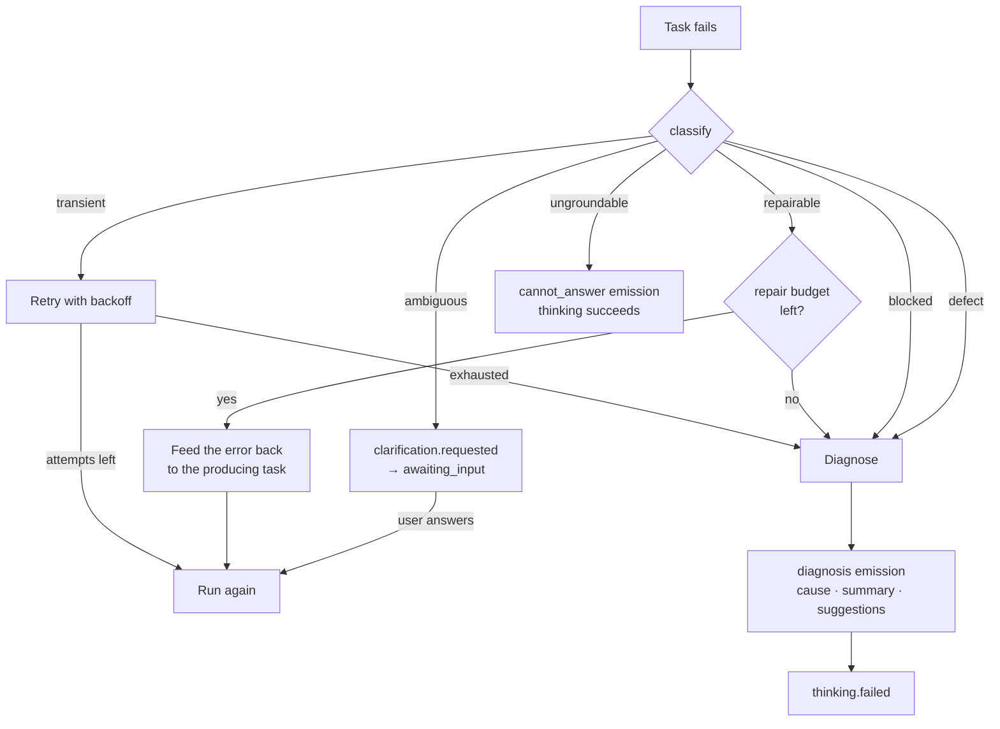
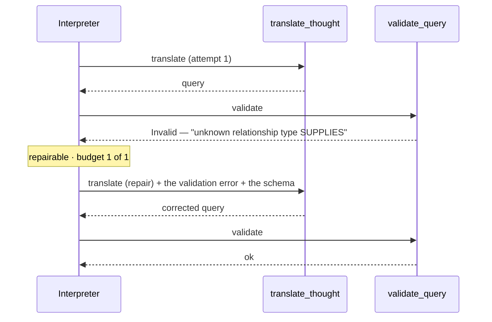

# RFC-052 — Failures: classify, retry, repair, explain, ask

**Status:** Draft
**Extends:** [RFC-048](rfc-048-agent-runtime-on-prefect.md) (thinking lifecycle · `on_error`) · [RFC-051](rfc-051-workflows.md) § 3.1 (workflow spec)
**Scope change:** adds failure classification, retry policy, repair and diagnosis to MVP. Clarification already existed — this RFC unifies when it fires.

---

## 1. The problem

A thinking today has two outcomes: it works, or it emits `error` and stops (`on_error:
emit_and_stop`). That is too blunt for a system whose headline promise is explainability.

| What actually happens | What the user currently gets |
|---|---|
| Graph DB times out under load | a failure — though retrying once would have worked |
| The LLM generates invalid Cypher | a failure — though the validation error is exactly what a second attempt needs |
| The question is ambiguous | a guess, or a failure |
| The model has no `Supplier` type | "no results" — indistinguishable from a true empty answer |
| The Atlas has no LLM provider | a raw 422 |

Four of the five are recoverable or explainable. Treating them all as "failed" makes the product feel
brittle, and — worse — makes a *wrong* answer and a *blocked* answer look the same.

**Principle:** a failure is information. The system should know what kind it is, fix what it can, and
explain the rest in the user's terms.

## 2. Failure classes

Everything starts here: **the class decides the response.** One classifier, applied to every task
failure, mapping onto RFC-048's existing domain errors.

| Class | Domain error | Examples | Response |
|---|---|---|---|
| `transient` | `Unavailable` | graph DB timeout, LLM 429/503, worker crash, network reset | **retry** with backoff |
| `repairable` | `Invalid` | generated query is syntactically invalid, fails schema validation, wrong shape | **repair** — one bounded round-trip |
| `ambiguous` | — | the ask has several defensible readings; a needed parameter is unstated | **ask the user** |
| `ungroundable` | — | the model/graph genuinely cannot answer this | **cannot answer** — an outcome, not an error |
| `blocked` | `Forbidden` · `Conflict` | archived Atlas, no LLM provider configured, setup incomplete | **stop and route** — the fix is an action elsewhere |
| `defect` | anything unclassified | a bug | **stop, emit, log as a defect-class event** |

`ungroundable` is deliberately **not** a failure. It is a legitimate answer to a question the Atlas
cannot support, and it already has its own emission (§ 5.3). Conflating it with `defect` is what
produces confident nonsense — the exact thing promise #4 forbids.

### 2.1 Who decides something is ungroundable

**Both code and model, with the model's claim always validated.**

| Path | Trigger | Result |
|---|---|---|
| **Code** | no schema types match the ask · grounding context is empty · a *valid* query returned zero rows | `ungroundable` — decided, no model involvement |
| **Model** | context existed and was non-empty, but the answer is not derivable from it | the model asserts `ungroundable` **and must name what is missing** |
| **Validation** | the named concept is checked against the live schema | unnamed or unverifiable → reclassified **`defect`**, not `ungroundable` |

Code alone is not enough: an ask that is genuinely unanswerable often produces a syntactically fine
query over real context, and reporting that as "no results" is indistinguishable from a true empty
answer. The model is the only thing that can tell those apart.

But an unchecked assertion lets an LLM end a thinking by claiming ignorance — which would also let a
repairable bug hide behind "I can't answer that" forever. Requiring it to name the missing concept,
and verifying that name against the schema, keeps the useful half and closes the escape hatch.

> A model that says "I can't answer" without saying **what is missing** has not diagnosed anything.
> That is a defect, and it is recorded as one.



## 3. Retries

### 3.1 Policy lives in the spec, execution lives in the runtime

Extends RFC-051 § 3.1's `steps` block:

```jsonc
"execute_graph_query": {
  "args":  { "query": "${steps.translate_thought.query}", "read_only": true },
  "retry": {
    "max_attempts": 3,
    "on":           ["transient"],        // classes, never raw exception types
    "backoff":      "exponential",        // fixed | linear | exponential
    "initial_ms":   500,
    "max_ms":       10000,
    "jitter":       true
  }
}
```

| Rule | Why |
|---|---|
| `on` names **classes**, not exception types | a spec is inert data (RFC-051 § 3.1); it must not encode Python internals |
| Default is `{max_attempts: 3, on: ["transient"]}` for read tasks, **`max_attempts: 1` for write tasks** | a retried write without idempotency double-writes |
| The **spec declares, the runtime executes** | `inline` implements backoff itself; the Prefect adapter maps the same policy onto its native `retries=` |
| **Declared in exactly one place** | if both the spec and the Prefect decorator carried retries, every failure would retry `n × m` times |
| Jitter is on by default | N schedules firing at 09:00 against one graph DB otherwise retry in lockstep |
| Failures **never pause a schedule** | decided in [RFC-051](rfc-051-workflows.md) § 4.4 — with no notification channel in MVP, a silent pause is worse than wasted retries. Per-step caps bound the damage inside one firing |

### 3.2 Every attempt is a row

`thinking_steps.attempt` already exists. One row **per attempt**, not a counter on one row — so the
trace shows that attempt 1 timed out and attempt 2 succeeded, which is exactly what someone
debugging a slow Atlas needs.

Emission idempotency keys (RFC-048) already assume a task may run twice, so a retried task cannot
double-emit into the thought stream. **That assumption is what makes retries safe, and it must not
be relaxed.**

### 3.3 Retries are visible

A step chip that sits on "executing" for 20 seconds reads as hung. Retrying must show:

```
▶ execute        retrying 2/3 · graph DB timeout      4.1s
```

Silence during a retry is worse than the original error.

## 4. Repair — one bounded round-trip

A `repairable` failure carries the thing needed to fix it: the validation error. Repair feeds it back
to the task that produced the bad output.



| Rule | Value |
|---|---|
| Repair budget | **1** per producing task, per thinking |
| Counts against `max_steps` | yes — repair cannot buy extra agency |
| Repair is a step, not a hidden retry | it appears in the trace with its own chip and the error that triggered it |
| Failed repair | escalates to diagnosis (§ 5) — never to a silent empty answer |

One round-trip, not a loop. A second failure of the same kind means the model cannot fix it from the
information available, and more attempts spend tokens and wall-clock to reach the same place.

## 5. Explaining a failure

### 5.1 The `diagnosis` emission

A terminal failure emits a **diagnosis**, not a stack trace. New emission kind:

| Field | Contents |
|---|---|
| `cause` | machine code — `schema_mismatch` · `db_unreachable` · `no_llm_provider` · `query_invalid` · `timeout` · `internal` |
| `summary` | one sentence, in the user's terms, no jargon |
| `evidence` | the structured facts it was derived from — the error, the generated query, the schema fragment |
| `suggestions` | 0..n actionable next steps, each with a label and either an in-app route or a re-ask |
| `retryable` | whether "try again" is worth offering |

```jsonc
{ "kind": "diagnosis",
  "cause": "schema_mismatch",
  "summary": "This Atlas has no 'Supplier' node type, so the question can't be answered against its model.",
  "evidence": { "unknown_types": ["Supplier"],
                "available_types": ["Vendor", "Company", "Contract"],
                "generated_query": "MATCH (s:Supplier)..." },
  "suggestions": [
    { "label": "Ask about 'Vendor' instead", "action": {"rethink_with": "which vendors are single-sourced?"} },
    { "label": "Add a Supplier type",        "route": "/modeller"} ],
  "retryable": false }
```

### 5.2 A diagnosis is grounded, like everything else

**The LLM may phrase a diagnosis. It may not invent one.** `cause` and `evidence` are derived by
code from the actual error, the generated query and the live schema; the model's only job is turning
them into a sentence and proposing suggestions drawn from that evidence.

Anything else would be a hallucinated explanation of a failure — which is strictly worse than a
hallucinated answer, because it also misdirects the fix. Promise #4 applies to failures.

### 5.3 "Cannot answer" is not a diagnosis

Two different outcomes, deliberately kept apart:

| | `cannot_answer` | `diagnosis` |
|---|---|---|
| Means | the Atlas genuinely does not hold this | something went wrong |
| Thinking status | `succeeded` | `failed` |
| Rendering | a legitimate, non-answer-shaped result | an error state with next steps |
| The fix | load more data, or ask something else | usually an action, sometimes a retry |

## 6. Asking the user

Clarification already exists (RFC-048: `clarify` task · `awaiting_input` · `clarification.requested`
· resume). This RFC states **when** it fires — one mechanism, three triggers:

| Trigger | When | Example |
|---|---|---|
| **Upfront** | translation finds several defensible readings | "single-sourced by contract, or by delivery history?" |
| **Mid-thinking** | a task needs a choice it cannot infer | "which of these 3 date fields is the order date?" |
| **After a failure** | a diagnosis's best suggestion is a question | "no 'Supplier' type — did you mean 'Vendor'?" |

| Rule | Why |
|---|---|
| All three emit `clarification.requested` and set `awaiting_input` | one resume path, one UI, one replay behaviour |
| Options are **grounded** — drawn from the schema or the data, never invented | an invented option is a hallucination with a click target |
| "Let me type it" is always offered | the options are frequently all wrong |
| Max **2** clarification rounds per thinking | more is an interrogation, and usually means the workflow should have failed with a diagnosis |
| A clarification is a step in the trace | "why did it ask me that?" must be answerable |

**Schedules never clarify.** An unattended firing has nobody to ask: a `clarification.requested` on a
`triggered_by='schedule'` thinking resolves to a diagnosis instead (`cause: needs_clarification`),
recorded in the timeline. Otherwise a schedule would silently hang in `awaiting_input` forever.

## 7. Studio surfaces

| # | Surface | Behaviour |
|---|---|---|
| F1 | Step chip — retrying | `retrying 2/3 · <reason>` with elapsed; never a silent pause |
| F2 | Step chip — repairing | a distinct "repairing" state, with the error that triggered it on hover |
| F3 | Diagnosis block in the thread | summary · evidence disclosure · suggestion buttons. Styled as a **blocked** state, unlike `cannot_answer` and unlike an answer |
| F4 | Suggestion actions | one click either re-asks with new wording or routes into the app (Modeller, Settings → LLMs, Datasets) |
| F5 | Retry action | offered only when `retryable: true`; re-thinks the same thought |
| F6 | Clarification form | unchanged from RFC-048 — options plus "let me type" |
| F7 | Schedule timeline | a failed firing shows its diagnosis inline; a needs-clarification firing is visibly distinct from a crash |

## 8. Scope impact

This is **new MVP scope**. Stated plainly rather than folded in quietly.

| Area | Status before | After |
|---|---|---|
| Clarification | ✅ existed | unchanged mechanism, triggers specified |
| `thinking_steps.attempt` | ✅ column existed | now populated, one row per attempt |
| `on_error: emit_and_stop` | ✅ existed | joined by classification-driven handling |
| Failure classification | ❌ | **new** |
| Retry policy in the spec | ❌ | **new** — extends RFC-051 § 3.1 |
| Repair round-trip | ❌ | **new** |
| `diagnosis` emission + suggestions | ❌ | **new** |
| Retry/repair visibility in Studio | ❌ | **new** |

| Cost | Estimate |
|---|---|
| Engine | classifier + retry executor in `inline` + repair loop in the interpreter + diagnosis builder. Bounded — the spec validator and step table already exist |
| Prefect adapter | map the same policy onto native retries; assert it is declared once |
| Studio | 4 new states (retrying · repairing · diagnosis · suggestion actions) |
| Slices | **S9a** +retry-policy validation · **S9b** +classifier, retries, `diagnosis` · **S9d** +repair · new **S9f** for diagnosis quality + suggestions |

**Nothing is dropped to pay for it.** The honest read: S9 gets meaningfully wider, and S9b is no
longer the smallest useful slice it was.

## 9. Open questions

| # | Question | Blocks |
|---|---|---|
| Q2 | Do `suggestions` re-ask automatically on click, or pre-fill the composer for the user to confirm? Auto is faster; pre-fill keeps the human in the loop | S9f |
| Q4 | Retry budget per **thinking**, on top of per-step limits? Four steps × 3 attempts is 12 graph-DB round-trips from one question | S9b |
