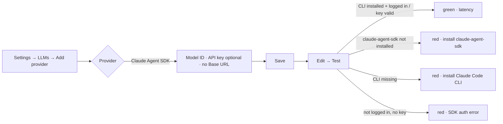

# RFC-053: `claude_agent_sdk` LLM provider — Claude via the Claude Agent SDK

**Status**: Accepted
**Author**: Invana Team
**Date**: 2026-09-03
**Related**:
- **RFC-032** (LLM runtime) — this RFC adds one row to its per-provider dispatch matrix and **revises
  Decision 2** (the "no subscription credential" rule) for exactly one, first-party, supported path.
- **MVP § 2.6** (LLM providers) — one new `LLMProviderKind` value; the same per-graph config row.
- **RFC-030 / RFC-031 / RFC-036** — consumers of `complete_tool`; unchanged, they gain a provider.

---

## Problem / intent

RFC-032 Decision 2 ruled out using a Claude Pro/Max (Claude Code) login as Invana's credential because
the `anthropic` SDK only accepts an API key and there was no supported third-party path. Since then
Anthropic ships the **Claude Agent SDK** (`pip install claude-agent-sdk`): a Python library that drives
the locally installed Claude Code CLI as a subprocess and resolves credentials the way the CLI does —
`ANTHROPIC_API_KEY` when present, otherwise the CLI's own login. It also exposes structured output
(`output_format = {"type": "json_schema", ...}` → `ResultMessage.structured_output`), which is the one
capability `complete_tool` needs.

**Intent:** add a `claude_agent_sdk` provider kind so an operator who already has Claude Code installed
and logged in can point a graph at Claude with no API key, and so an API-key operator can run Claude
through the Agent SDK harness instead of the raw Messages API. Nothing else about the runtime changes:
same `complete_tool`, same `LLMError`, same one-repair policy, same encrypted-key storage.

---

## Decisions

1. **One new enum value, `claude_agent_sdk`, on the existing `LLMProvider` row.** No new table, no
   new column. `model_id` stays required (it is passed straight to the SDK as `model`).
   `api_key` is **optional** for this kind: when set it is decrypted at call time and handed to the
   subprocess as `ANTHROPIC_API_KEY`; when unset the SDK falls through to whatever the local Claude Code
   CLI is logged in with. `base_url` is unused and not shown for this kind.

2. **Credentials are the SDK's business, not Invana's.** Invana never reads, stores, or forwards a
   Claude Code OAuth token. The only thing the engine does is *not* inject an API key. Which
   credentials the CLI holds, and whether a given subscription may be used for a given workload, is
   between the operator and Anthropic's terms — the RFC-032 stance ("Invana will not reverse-engineer
   the subscription") stands; this is the supported front door, not a back door.

3. **Generation-only harness: no tools, no filesystem settings.** `complete_tool` is a
   single-shot structured completion, so the SDK is invoked with `tools=[]`, `setting_sources=[]`
   (ignore `~/.claude` and any project `CLAUDE.md`), `permission_mode="dontAsk"`, a plain-string
   `system_prompt` (not the `claude_code` preset), and `output_format` set to the caller's schema.
   The engine's own `cwd` is passed so the CLI never picks up a stray project directory.

4. **History is flattened into one prompt.** The SDK's `query()` takes a single prompt string (its
   streaming form models *live* turns, not a replayed assistant history). A single user message is
   passed as-is; a multi-message history (RFC-036) is rendered as a `User:` / `Assistant:` transcript
   ending with the final user turn. Consumers do not change.

5. **Errors map onto `LLMError` like every other provider.** `CLINotFoundError` → "Claude Code CLI is
   not installed"; a missing `claude_agent_sdk` package → "install claude-agent-sdk";
   `ResultMessage.is_error` → the SDK's own message; everything else falls through `_invoke`'s generic
   normalisation. Wall-clock bound via `asyncio.wait_for(timeout_s)` plus `API_TIMEOUT_MS` in the
   subprocess env.

6. **Ping is a real one-turn call.** The credential probe runs the same harness with `max_turns=1` and a
   one-character prompt; success is a non-error `ResultMessage`. This is the cheapest thing the SDK
   exposes (there is no `/models`-style probe through the CLI).

7. **Optional dependency, lazy-imported.** `claude-agent-sdk` is not added to `[project].dependencies`
   (same treatment as `anthropic` / `openai`). Requires the Claude Code CLI on `PATH`.

8. **Default advisory model: `claude-opus-5`.** Used only when a row's `model_id` is blank; Studio's
   placeholder shows the same.

---

## Design

### Dispatch row (extends RFC-032 § Per-provider dispatch)

| Provider | Transport | Structured output | Key? | Default model |
|---|---|---|---|---|
| `claude_agent_sdk` | `claude-agent-sdk` → Claude Code CLI subprocess | `output_format` json_schema → `ResultMessage.structured_output` | **optional** (API key, else CLI login) | `claude-opus-5` |

### Engine

| Surface | Change |
|---|---|
| `llm_providers/models.py` | `LLMProviderKind.claude_agent_sdk = "claude_agent_sdk"` |
| migration `000000000027` | Postgres: `ALTER TYPE llm_provider_kind ADD VALUE IF NOT EXISTS 'claude_agent_sdk'` in an autocommit block. SQLite: no-op (column is a plain VARCHAR there). Downgrade is a no-op — Postgres cannot drop an enum value. |
| `llm/providers/claude_agent_sdk.py` | `call(...)` with the RFC-032 keyword signature; builds `ClaudeAgentOptions`, iterates `query()`, returns `(structured_output, TokenUsage)` |
| `llm/client.py` | `_DISPATCH[LLMProviderKind.claude_agent_sdk] = claude_agent_sdk_provider.call` |
| `llm/defaults.py` | `claude_agent_sdk → "claude-opus-5"` |
| `llm_providers/services.py` | `needs_key` excludes `claude_agent_sdk`; `_dispatch_ping` runs the one-turn probe |

### Studio

| Surface | Change |
|---|---|
| `types/llm.ts` | `LLMProviderKind` gains `"claude_agent_sdk"`; `LLM_PROVIDER_OPTIONS` gains `{ label: "Claude Agent SDK", requiresApiKey: false, apiKeyOptional: true, usesBaseUrl: false, exampleModelId: "claude-opus-5" }` |
| `LLMsSection.tsx` | The API-key field renders when `requiresApiKey || apiKeyOptional`; for the optional case the label reads "(optional — uses your Claude Code login if blank)" and the form stays valid with it empty |

### Journey (extends studio.md § 3.5)

As a **graph owner** who already runs Claude Code locally, I want to add Claude as this graph's LLM
**without pasting an API key**, so that I can develop against Claude on my existing login.

Seams: the row shows `Claude Agent SDK · <model_id>`; a saved row with no key shows no key badge (same
as Ollama). Nothing survives reload beyond the row itself.

---

## Alternatives Considered

| Alternative | Pros | Cons | Why rejected |
|---|---|---|---|
| **Reuse the `anthropic` kind with an "auth mode" switch** | no new enum value | Two transports behind one label; `anthropic` requires a key today and the ping path is SDK-specific; muddles the RFC-032 matrix | Rejected — a provider kind *is* a transport in this codebase (Decision 1). |
| **Pass history as the SDK's streaming-message form** | no flattening | The stream models live user turns; assistant turns cannot be replayed, so history would be lost anyway | Rejected — flatten (Decision 4). |
| **Use the `claude_code` system-prompt preset + built-in tools** | "smarter" agent | Not what `complete_tool` promises; exposes the engine host's filesystem to a generation call; non-deterministic turn count | Rejected — generation-only harness (Decision 3). |
| **Add `claude-agent-sdk` as a hard dependency** | zero install friction | Pulls a CLI-dependent package into every engine install, including keyless Ollama/CI | Rejected — lazy optional like the other SDKs (Decision 7). |

---

## Security Considerations

- **No new secret class.** The only stored secret is still `api_key_encrypted` (Fernet). When absent,
  the engine holds nothing — the CLI subprocess reads its own keychain/config, and only on the host
  the engine runs on.
- **Subprocess surface.** The SDK spawns `claude` with `tools=[]`, `setting_sources=[]`, and
  `permission_mode="dontAsk"`, so the model has no tool access and no filesystem hooks or project
  settings are loaded. `cwd` is the engine's own working directory.
- **Egress.** As with `anthropic`, the assembled prompt leaves to Anthropic. Same consumer-defined
  payload as RFC-030/031.
- **Multi-tenant hosts.** A shared engine host with a logged-in CLI would let every graph on that host
  use that login. Operators who do not want that should set an API key on the row (which shadows the
  login) or not log the CLI in on the server. Called out in the operator guide, not enforced.

## Performance Considerations

- Each call spawns a CLI subprocess (hundreds of ms of overhead on top of inference). Acceptable for
  the request/response consumers; the L6 agent loop, if it adopts this kind, should use
  `ClaudeSDKClient` for a persistent session — out of scope here.
- `query()` is natively async; no `asyncio.to_thread` needed.

## Open Questions

- [ ] Whether `guardrails.max_budget_usd` should map onto the SDK's `max_budget_usd` — deferred until
  `guardrails` has a schema.

## Implementation Plan

1. [x] Enum value + migration.
2. [x] `llm/providers/claude_agent_sdk.py` + dispatch + default model.
3. [x] `needs_key` + ping in `llm_providers/services.py`.
4. [x] Studio option + optional-key form state.
5. [x] Tests: flattening (deterministic); a real-SDK positive path gated on `INVANA_TEST_CLAUDE_AGENT_SDK=1`.
6. [x] Docs: RFC-032 Decision 2 pointer, `mvp.md` § options, `engine.md` SDK row, `studio.md` § 3.5.
7. [x] Changeset.

## Scope & MVP impact

Additive to shipped **§ 2.6** and **RFC-032**; no new slice. The keyless dev default remains Ollama —
this adds a second keyless option for operators who have Claude Code, it does not replace the first.

## References

- Claude Agent SDK, Python reference — `https://code.claude.com/docs/en/agent-sdk/python`
- `engine/src/invana/llm/providers/anthropic.py` — the sibling this module mirrors.
