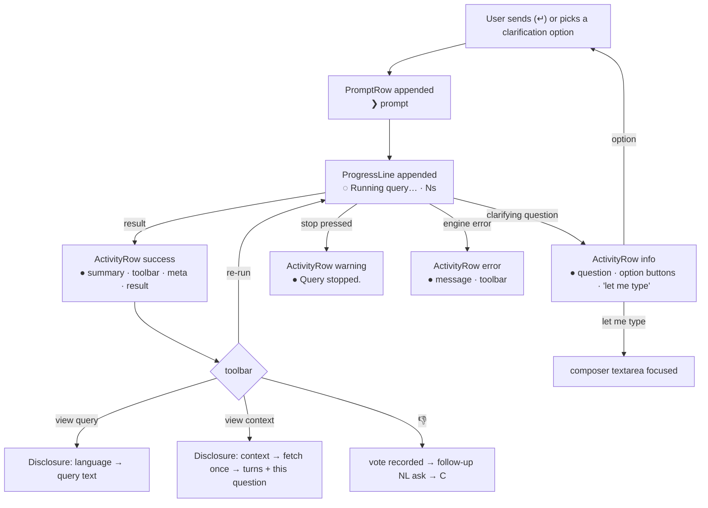

# RFC-054: Sessions panel as a console transcript — adopting `ChatSession*`

**Status**: Accepted
**Author**: Invana Team
**Date**: 2026-09-03
**Related**:
- **RFC-050** (design-kit component plan) — this RFC is the `ChatSession*` half of **W1** and answers
  its open question **Q3**.
- **RFC-024 / 030 / 033 / 036 / 038 / 040 / 045 / 046** — the session behaviours this RFC re-skins;
  none of their contracts change.
- **MVP § 6.1** (sessions panel) and **§ 10.7** (adopt design-kit `ChatSession*`).
- Reference design: design-kit Storybook `UI / UI Extended / ChatSession / Agent Console`
  (`apps/storybook/stories/ui/ui-extended/chat-session/agent-console.stories.tsx`, design-kit 0.0.20).

---

## 1. Problem / intent

`SessionsPanel.tsx` grew to 1 134 lines because it was built before design-kit shipped a chat surface:
it hand-rolls the scroll-to-latest logic, the user bubble, the assistant block, the running dots, the
action toolbar, the query `<pre>`, and the context card. `SessionComposer.tsx` (594 lines) hand-rolls
the bordered composer card as well. Design-kit 0.0.20 ships all of that as `ChatSession*`, and its
**Agent Console** story establishes the visual grammar the platform is converging on: a console
transcript where every event — prompt, answer, question back, interruption, failure — is one row on a
shared left edge, with a gutter glyph carrying its meaning.

**Intent:** rebuild the Sessions panel's thread and composer on `ChatSession*` in the Agent Console
grammar, keep every existing behaviour, and split the panel into files that each do one thing. No
engine change; no new API; no change to the panel's props, so `ExplorerPage` and `ModellerPage` are
untouched.

---

## 2. Decisions

| # | Decision | Why |
|---|---|---|
| D1 | **Console grammar, not bubbles.** The thread uses `ChatSessionPromptRow` / `ChatSessionActivityRow` / `ChatSessionProgressLine`, not `ChatSessionMessage`. | Agent Console is the reference. A session is a log of what the user asked and what the system did — a transcript reads better than a chat, and it extends naturally to the agent-runtime events RFC-048 will emit (tool calls, sub-agents) as more activity rows. |
| D2 | **Status lives in the gutter dot.** `success` = answer · `info` = clarifying question back (RFC-038) · `warning` = stopped by the user · `error` = failed. Running is a `ProgressLine` with a live elapsed counter. | One vocabulary for all outcomes; the dot colours are the `@invana/styling` status tokens, so they theme. |
| D3 | **Canvas operations stay prompt rows** (RFC-046) with the operation glyph (expand / load) in the caret slot. | They are still user actions; the glyph is the only cue they came from the canvas. Same rule as before, new slot. |
| D4 | **Disclosures, not inline blocks.** "View query" opens a `ChatSessionDisclosure` labelled with the language; "View context" opens one labelled `context` whose header meta counts the turns. Both are controlled by the toolbar toggle (the toggle shows `active`), and closing from the disclosure header clears the toggle. | Matches the Agent Console nested-detail grammar. The context fetch moves into the disclosure component and happens once per open. |
| D5 | **The composer is `ChatSessionComposer` for NL; the QL editor gets a local card in the same chrome.** Studio supplies only the toolbar controls (mode / model / language / timeout / attach), the attachment chips, and the send/stop icons. | The design-kit composer has no input slot for a CodeMirror editor (its docs say to build a custom layout for one). Rather than hide an editor inside it, QL mode renders the same card classes with the editor in the input position and reuses the toolbar nodes. |
| D6 | **The QL editor mounts only while QL is selected**; its text is kept in a ref across mode switches. | Follows from D5. Undo history does not survive a switch; the query text does. |
| D7 | **`↑`/`↓` prompt history and "focus the input" are done through a wrapper** around the design-kit composer (bubbling `keydown`, `querySelector("textarea")`). | The composer exposes neither a textarea ref nor a keydown hook. Listed as a design-kit follow-up (§6); the wrapper is removed when it lands. |
| D8 | **A `ChatSessionStatusBar` sits under the composer** in both views: left = what the session holds (session count on the list; nodes · relationships, or "Running…", in a thread; prompt count on the modeller), right = the key bindings. | The reference has one; it gives the key bindings (`↵` / `⇧↵` / `↑↓`) a home instead of leaving them undiscoverable. |
| D9 | **The QL editor theme reads design-kit tokens** (`--color-foreground`, `--color-primary`) instead of a hard-coded dark palette. | RFC-044 shipped light and preset themes; the editor was the one dark-only surface in the panel. |
| D10 | **The list view stays on `ListPanelChrome` / `ListRow`**; only the status dot moves to the same tokens as D2. | `ListPanel` is promoted upstream in RFC-050 **W4**, not here. |
| D11 | **Studio registers the status colour tokens** (`success` / `warning` / `info` + foregrounds) in its Tailwind `@theme inline` block. | Design-kit's own CSS is precompiled, so its rows already colour; Studio markup (the active 👍 vote, the list dot) needs the utilities generated locally. |
| D12 | **No task strip, no Tasks view.** | The Agent Console's pinned task rows and dashboard model background agents; the MVP has none (RFC-048 is not in scope). `ChatSessionTaskRow` / `TaskGroup` are not used. |

---

## 3. Mapping — Studio state → design-kit primitive

| Session state | Before | After | Gutter |
|---|---|---|---|
| User prompt (typed) | right-aligned bubble | `ChatSessionPromptRow` | `❯` |
| User prompt (canvas expand / load, RFC-046) | bubble + inline icon | `ChatSessionPromptRow caret={<Waypoints/> \| <Network/>}` | glyph |
| Reply running | text + bouncing dots | `ChatSessionProgressLine elapsed="Ns"` | ring spinner |
| Reply ok | plain paragraph | `ChatSessionActivityRow status="success"` | ● success |
| Reply is a clarifying question (RFC-038) | paragraph + option buttons | `ActivityRow status="info"` + option buttons in `footer` | ● info |
| Reply stopped by user | italic muted note | `ActivityRow status="warning"` | ● warning |
| Reply failed | red paragraph | `ActivityRow status="error"` | ● destructive |
| Re-run · view query · copy · context · 👍 · 👎 | hand-rolled `Tooltip`+`Button` row | `ChatSessionMessageOptions` (`align:"end"` for votes; `activeClassName` `text-success` / `text-destructive`) | — |
| Meta (`via · rows · LLM · query`) | `` | `ActivityRow meta` | — |
| Query text | `<pre>` | `ChatSessionDisclosure label={language}` (controlled) | — |
| Context (RFC-040) | bordered card | `SessionContextDisclosure` → `ChatSessionDisclosure label="context" meta="N earlier turns + this question"` | — |
| Inline result (RFC-033) | `ResultBlock` | `ResultBlock` in `ActivityRow footer` (unchanged) | — |
| Thread scroll / stick-to-latest | `ScrollArea` + `scrollIntoView` effect | `ChatSession autoScrollKey={session.id:messages.length}` (ResizeObserver follows in-place growth) | — |
| Empty thread | `SessionThreadWelcome` | unchanged, rendered outside `ChatSession` (it owns its own centring scroll box) | — |
| Composer (NL) | hand-rolled card | `ChatSessionComposer` + Studio toolbar slots | — |
| Composer (QL) | same card, CodeMirror in place of textarea | local card with the composer's chrome classes, shared toolbar nodes | — |
| Attachment chips | inline row | `ChatSessionComposer attachments` | — |
| Under the composer | nothing | `ChatSessionStatusBar` | — |
| Session list | `ListRow` | unchanged (`SessionList.tsx`) | dot → status tokens |

---

## 4. Journey — one turn in the transcript

Seams: a run that outlives a panel resize keeps its elapsed counter (it ticks off the message's
`createdAt`, not a mounted timer); scrolling up to read history is not yanked back while a reply
grows; reopening a session restores the composer's mode / model / timeout exactly as before (RFC-030).

---

## 5. File layout

| File | Lines | Owns |
|---|---|---|
| `SessionsPanel.tsx` | 381 | Panel chrome (tab breadcrumb, filter menu), prompt history, clarification / vote glue, modeller Commit bar, status bar, footer. **Unchanged public props.** |
| `SessionList.tsx` | 273 | List view, row, banner (moved verbatim; dot → tokens). |
| `SessionThread.tsx` | 84 | `ChatSession` surface, one row per message. |
| `SessionTurn.tsx` | 278 | `PromptTurn`, `AssistantTurn` (running / stopped / settled), action list, disclosures. |
| `SessionContextDisclosure.tsx` | 167 | Context fetch-on-open + rendering. |
| `SessionComposer.tsx` | 662 | NL on `ChatSessionComposer`; QL card with CodeMirror; shared toolbar; history; `deriveComposerConfig` (the reopen-restore rule, RFC-030). |

RFC-050 W1's "done when" asked for `SessionsPanel` under 400 lines; it is.

---

## 6. Design-kit follow-ups (not blocking)

| Gap | Studio workaround today | Ask |
|---|---|---|
| `ChatSessionComposer` has no textarea ref / `onKeyDown` | wrapper `
` + `querySelector("textarea")` | add `textareaRef` and `onKeyDown` props |
| `ChatSessionComposer` has no input slot | QL mode duplicates the card chrome locally | add an `input` render slot (or export the card + toolbar as sub-components) |
| `ChatSessionDisclosure` header is a `<button>`, so no header actions | the context "Copy" sits inside the content | optional `actions` slot rendered beside the header |
| Status tokens not in Studio's Tailwind theme | D11 | none — Studio-side |

---

## 7. Non-goals

| Not doing | Why |
|---|---|
| Task strip / Tasks view (`ChatSessionTaskRow`, `TaskGroup`) | No background tasks in MVP (D12). |
| Streaming replies | Sessions are request/response until § 6.4 (thoughts) lands. |
| `ListPanel` → design-kit | RFC-050 W4. |
| Timestamps on prompt rows | The reference has none; relative time stays on the list row. |
| Tests | Studio has no unit-test runner wired yet (§ 10.x); verified by `check-types`, `lint`, `build`. |

---

## 8. Done when

- [x] `pnpm check-types`, `pnpm lint` and `vite build` clean in `studio/`. (`tsc -b`, the first half of `pnpm build`, reports 10 errors in modeller/settings files that are identical on a clean checkout — pre-existing, not touched here.)
- [x] `SessionsPanel.tsx` < 400 lines; no `ScrollArea` / scroll effect / bubble markup left in the thread.
- [x] Every behaviour in § 3 is reachable: re-run, view query, copy, context, votes + downvote refinement, clarification options + "let me type", results + load to canvas, stop, prompt history, attachments, mode/model/timeout restore, pin/archive, modeller Commit.
- [ ] Visual pass against the Agent Console story in both light and dark (needs a running Studio; not done in this change).
