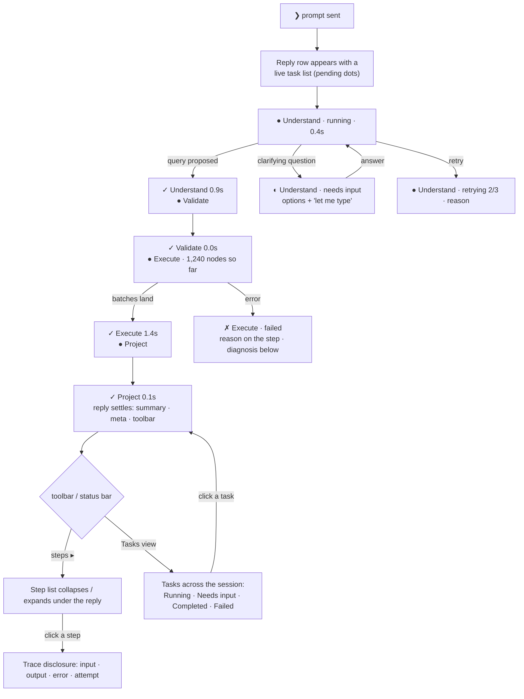

# RFC-055: Session task trace — the tasks behind every reply, in the transcript

**Status**: Implemented (engine + Studio, 2026-09-03) — inline runtime; see § 10 for what shipped and what is left
**Mock**: https://claude.ai/code/artifact/65019f97-c27b-4023-a026-8fc188003d14 — the Sessions rail, live:
send a question or Play each state (send · understand · validate · execute · settle · needs input ·
retry · stop · trace · Tasks view).
**Author**: Invana Team
**Date**: 2026-09-03
**Related**:
- **RFC-048** (agent runtime) — defines the entities this RFC renders: Thought · Thinking ·
  ThinkingStep · thought stream, and "the user experience of thinking" (step chips, trace).
- **RFC-051** (workflows) — the built-in `nl-query` workflow: `understand → validate → execute → project`,
  each step carrying a `label`.
- **RFC-052** (failure handling) — one `thinking_steps` row per attempt; retry / repair states.
- **RFC-054** (sessions console transcript) — the surface this RFC extends; it left the Agent Console's
  task rows out (**D12**) because there was no task data. This RFC is the data plus the rows.
- **MVP** `studio.md` § 6.5 (thinking card), § 6.11 (trace view), § 6.14a/b (retry / repair on the chip);
  `engine.md` S9b (`thinking_steps`).

---

## 1. The ask

A single reply in a session is the outcome of several tasks. For a natural-language ask today:

| # | Task | What it does | Recorded today (`session_messages`) |
|---|---|---|---|
| 1 | **Understand** | prompt + schema + prior turns → LLM provider → graph query (or a clarifying question) | `via`, `llm_time_ms`, `source_query`, `clarification_options` |
| 2 | **Execute** | run the query against the bound connection | `execution_time_ms`, `row_count`, `status` |
| 3 | **Project** | rows → graph / table / summary / clarification options for the user | `content`, `node_count`, `edge_count` |

The user sees one row: the summary, a meta line of aggregate timings, and disclosures for the query and
the context. The tasks themselves are invisible — there is no way to see *which* task ran, in what
order, how long each took, whether one retried, or which one failed. The ask is to make that flow
visible in the transcript the way an agent console shows its background tasks — a live list while the
reply is being produced, a settled list afterwards, and a Tasks view across the session — so every
answer is auditable: **this is the plan that ran, and this is what each step did.**

This is exactly what MVP S9 calls the **thinking card** (§ 6.5) and the **trace** (§ 6.11). The
engine half of it — `thoughts · thinkings · thinking_steps · thought_stream` — is S9b and is `[ ]`.
The question this RFC settles is how much of the surface can be built on what the engine records
now, and how it converges on S9b without a rewrite.

---

## 2. Vocabulary — the user's three tasks are RFC-051's four steps

| User's task | `nl-query` step (RFC-051 § 3) | Task key (RFC-048) | Emits |
|---|---|---|---|
| 1. Get the graph query from the LLM | **understand** | `translate_thought` | `query.proposed` · or `clarification.requested` |
| — | **validate** | `validate_query` | verdict (read-only enforcement) |
| 2. Execute the graph query | **execute** | `execute_graph_query` | `graph.delta` × n / `table.page` |
| 3. Translate the response to options / result set | **project** | `shape_for_canvas` | counts · summary · `metric` / `text.delta` |

Two states the user's list implies but doesn't name: **clarify** (understand ends by asking back — the
thinking is `awaiting_input`, the Tasks view shows it under *Needs input*) and **validate** (a query is
never run unvalidated; it is a step because it can fail, and a failed validation is an auditable event).
A query-language ask skips understand and starts at validate. A rerun is a new thinking over the same
thought (RFC-048 "rethink") — its steps are its own.

---

## 3. Journey

As an *analyst*, I want to see the tasks a reply ran — while it runs and afterwards — so that I can
tell where time went, why an answer is what it is, and which step to blame when it isn't.



Seams:

| Seam | Behaviour |
|---|---|
| While waiting | The step list *is* the progress indicator — the `ProgressLine` of RFC-054 is replaced by the first pending step. The first chip must appear within a few hundred ms (§ 6 UX budget), or the list feels slower than a spinner. |
| Reload mid-run | The list rebuilds from the record (S9: replay the stream from `seq=0`; bridge: the message is still `running` with no steps → progress line, steps appear when it settles). |
| Scrolled up | Auto-follow rules of RFC-054 apply; a growing step list doesn't yank the view. |
| Stopped | The running step becomes `warning · stopped`; later steps stay `pending` (hollow). |
| No access | Steps are part of the message; whoever can read the session can read its steps. |

---

## 3.1 Use cases

Each use case is one state of the mock. *Actor* is an Explorer analyst unless stated; *acceptance* is
what has to be true in Studio against a live engine.

| # | Use case | Trigger | What the user sees | Acceptance |
|---|---|---|---|---|
| UC1 | **See the plan before anything runs** | send a prompt | prompt as a `❯` band; reply row with the workflow's steps as queued rows (hollow dots) | first step row visible < 300 ms after send, before any LLM call returns |
| UC2 | **Watch Understand think** | understand starts | step pulses; description names the model and how many prior turns it reads; the model's rationale appears as a `└` line under the step | rationale visible under the step until the reply settles; then only in the trace |
| UC3 | **See the query being proposed** | understand finishes | description → `proposed Cypher · N lines · confidence 0.86`; duration on the right; toolbar "view query" works from this moment, not only at the end | `query.proposed` lands before execute starts |
| UC4 | **Know a query was checked** | validate | a row with `read-only ✓ · labels used`; a refused query is a red row with the reason and the reply is a failure, not an answer | a mutating query never reaches execute; the refusal is on the record |
| UC5 | **Watch rows arrive** | execute | description counts rows per batch (`412 rows so far · batch 2`); the running step is pinned above the composer; the canvas paints when the result lands | pinned strip shows only while something runs or waits; click jumps to the turn |
| UC6 | **Get the answer and keep the receipt** | project finishes | answer text, meta line, toolbar; step list collapses to `✻ Thought for 2.4s · 4 of 4 steps` | reopening an old session shows the same steps with the same timings |
| UC7 | **Answer a question back without starting over** | understand needs input | step amber `needs input · which "Frankfurt"?`; reply is a question with option buttons + "let me type"; strip and status bar say *needs input* | picking an option or typing **resumes the same thinking**: same step list continues, one trace |
| UC8 | **See a retry instead of a hang** | a step fails a transient way | `retrying 2/3 · timeout after 30s` with its own elapsed; if all attempts fail, red step + reply explains the cause + suggested actions | one `thinking_steps` row per attempt; the pause is never silent |
| UC9 | **Stop** | `esc` or the stop button | running step → `stopped` with elapsed; later steps stay queued; reply reads *Stopped by you* with a `└ Interrupted · …` hint | cancel reaches the engine; no further emissions after `thinking.cancelled` |
| UC10 | **Open a step's trace** | click a step | disclosure: input (prompt, schema version, context, model / query digest, connection, limits) · output (query + rationale / verdict / rows / canvas counts) · attempt · tokens | every step of every settled reply has a trace; digests, never raw payloads |
| UC11 | **Audit the whole session** | status bar → Tasks | every step of every reply grouped by turn, newest first; running / waiting turns float to the top; row click jumps to the reply | counts in the switch (`Tasks (12)`) match the rows |
| UC12 | **Survive a reload mid-run** | reopen the session while a thinking runs | the step list rebuilds from the record and continues live | replay from `seq=0`, then tail |
| UC13 | **Modeller: same receipt for a generated model** | modeller session prompt | steps `understand → propose → validate` with modeller labels; Commit bar unchanged | same components, labels from the modeller workflow |

## 4. Surfaces — the Agent Console primitives RFC-054 left unused

| Surface | Primitive (design-kit 0.0.20) | Content |
|---|---|---|
| Live / settled step list under a reply | `ChatSessionTaskRow` per step inside the reply's `ActivityRow footer` (`status`: `running` pulses · `success` · `error` · `needs-input` · `queued` hollow) | `name` = step label · `description` = one-liner (`local · qwen`, `1,240 nodes · 3,900 edges`, `read-only ✓`, `retrying 2/3 · timeout`) · `meta` = duration |
| Collapse / expand the list | reply toolbar action "Steps" (`ChatSessionMessageOptions`, `active` when open) | default: open while running, collapsed once settled (the summary is the answer; steps are the audit) |
| Per-step trace | `ChatSessionDisclosure` under the step (`label` = task key, `meta` = attempt · duration) | input digest / output digest / error / tokens — RFC-048 `thinking_steps` columns; this is § 6.11 at step resolution |
| Pinned strip while running | rows for the running step under the transcript, above the composer (the Agent Console's task strip) | only while something runs; click → scroll to the turn |
| Tasks view | `ChatSessionStatusBar` gains a **Chat / Tasks** switch; `ChatSessionTaskGroup` per status | every step of every reply in the session, grouped *Running · Needs input · Failed · Completed*; row click → the turn |
| Session list row | status dot (already tokenised in RFC-054) | unchanged; `lastStatus` gains `awaiting_input` |

Details taken from the reference console (Claude Code's transcript, 2026-08-30 screenshot) and the
Agent Console story, confirmed on the mock:

| Detail | Behaviour |
|---|---|
| **Reasoning line** | While *understand* runs, the model's rationale streams word by word as a `└` subline under the step — the "thinking back to the user" moment. It folds into the step's trace when the step settles (RFC-048 `plan.step` / `query.proposed.rationale`). |
| **Settled summary line** | A collapsed reply shows one line in the progress-line slot: `✻ Thought for 2.4s · 4 of 4 steps` (`Failed after …`, `Stopped after …`). Click reopens the list. Steps are open by default while running, collapsed once settled. |
| **Stop** | `esc` anywhere, or the composer's stop button. The running step becomes `stopped` with its elapsed; later steps stay `queued`; the reply reads *Stopped by you* with a `└ Interrupted · …` hint. |
| **Pinned strip** | While a turn runs or waits, its live step is pinned above the composer with duration and token meta (`↑ 1.2k tokens`); click jumps to the turn. Hidden otherwise. |
| **Status bar** | Left: Chat / Tasks (n) switch and `1 running` / `1 needs input` in the primary / warning colour. Right: key hints that change with state — `↵ send · ⇧↵ newline · ↑↓ history` at rest, `esc stop · ↓ tasks` while running. |
| **Tasks view** (Q3: decided) | Grouped **by turn, newest first**; running and waiting turns float to the top; heading = the prompt + time + `running` / `waiting on you` / total duration. |
| **Modeller** (Q2: decided) | Same rows, same shape; the generative session's steps are `understand → propose → validate` with modeller labels from its workflow spec. |

Design-kit gaps: none — every row above exists. Studio's `ThinkingCard` in § 6.5 becomes *composition*
of these rows, not a new component (RFC-050 D2).

---

## 5. Data — two ways to feed the rows

Both produce the same TypeScript shape in Studio, so the surface in § 4 is written once.

```ts
interface SessionStep {
  seq: number;
  taskKey: string;                 // "translate_thought" | "validate_query" | …
  label: string;                   // "Understand" — from the workflow spec (RFC-051 § 3.1)
  attempt: number;                 // 1..n — one row per attempt (RFC-052)
  status: "queued" | "running" | "needs-input" | "success" | "error" | "stopped";
  startedAt?: Date; finishedAt?: Date;
  detail?: string;                 // the one-liner
  error?: { category: string; message: string };
  trace?: { inputDigest?: string; outputDigest?: string; tokens?: number };
}
```

| | **Option A — bridge on the session message** | **Option B — build on S9b** |
|---|---|---|
| Engine change | `session_messages.steps_jsonb` — the send path records one `SessionStep` per task it ran (understand / validate / execute / project, clarify as `needs-input`), written **when the reply settles**. `rerun_message` records its own list. | RFC-048 build-order steps 1–9: `thoughts · thinkings · thinking_steps · thought_stream`, the `Runtime` protocol + `inline` adapter, the seeded `nl-query` workflow, thought API + SSE. `session_messages` gains `thought_id`. |
| Studio change | § 4 surfaces, fed from the message. Live state is **not** available: while running the reply shows the progress line; the step list appears when the reply settles. | § 4 surfaces, fed from `useThinkingStream` — live transitions, live counts, retry / repair visible as they happen, reload replays. |
| What the user gets | Auditability: the plan that ran, per-step timings, which step failed and why, a Tasks view. Not the live "watch it think". | Everything, including live. |
| Size | Engine: one column + migration + ~40 lines in `_send_message_impl` / `rerun_message`; Studio: ~300 lines. No new packages. | The S9b slice — several thousand lines across engine and studio; the largest remaining MVP slice. |
| Convergence | `SessionStep` is shaped on `thinking_steps` columns. When S9b lands, the mapper reads `thinking_steps` instead of `steps_jsonb`, the column is dropped, and the surface is unchanged. Risk: a second place that knows the workflow's step list until then. | None — it *is* S9b. |
| Scope status | Not in `mvp.md`; needs a `studio.md` 6.5a / `engine.md` row added (**CLAUDE.md rule 5: re-scope in the doc first**). | S9 as written; sequenced after S6 → S7. |

The two are not exclusive: A is the surface built early against a stand-in record; B replaces the
record. What A must **not** do is grow its own live channel (polling, a second SSE) — that would be a
parallel S9b.

---

## 6. Constraints carried from the platform RFCs

| Constraint | Source |
|---|---|
| Step labels come from the workflow spec, not a Studio lookup table | RFC-051 § 3.1 "steps name themselves" |
| One row per attempt; retry and repair are visible states, never a silent pause | RFC-052; `studio.md` 6.14a/b |
| Clarification is `needs-input` on the understand step, not a failure and not the end of the thinking | RFC-048 "clarification stops being a dead end" |
| User-facing output goes through emissions; the step row shows *that* a task ran and its timing, the trace shows its digests — never raw payloads | RFC-048 task contract rule 2 |
| First chip within a few hundred ms | `studio.md` § 6 UX budget |
| Retention: steps outlive stream payloads | RFC-048 D11 |

---

## 7. Decision needed

| # | Question | Blocks |
|---|---|---|
| ~~Q1~~ | **Decided 2026-09-03: Option B — build on S9b**, pulled ahead of S6/S7 in `mvp.md`. Scope is the *inline* runtime only: no package restructure (S9a), no Prefect (S9c). Implementation plan in § 9. | — |
| ~~Q2~~ | Modeller gets the same rows — **decided yes** (§ 4). | — |
| ~~Q3~~ | Tasks view grouping — **decided: by turn, newest first** (§ 4). | — |

---

## 8. Non-goals

| Not doing | Why |
|---|---|
| Authoring or editing the workflow | RFC-051 § 3: not in MVP |
| A second live channel for the bridge | § 5 — it would be a parallel S9b |
| Per-step cost / tokens beyond what `thinking_steps` records | RFC-041 owns accounting |
| Background tasks that outlive the reply (agents, schedules) | S9c / S9.5 |

---

## 9. Implementation plan (S9b, inline runtime) — pseudo-code

Surgical scope: the four RFC-048 tables, an **in-process** runtime (an `asyncio` task per thinking),
an in-process broadcaster behind the RFC-048 `subscribe(thinking_id, after)` interface, SSE, resume,
cancel. No package restructure, no Prefect, no `LISTEN/NOTIFY` (single API process in MVP; the
broadcaster interface is the seam for it later). The sessions API keeps its routes; sending becomes
asynchronous (`202`) and the reply is finalised by the runtime.

### 9.1 Engine — data

```
thoughts        (id, graph_id, session_id, message_id→user msg, author_id,
                 kind: nl|ql, body, params_json, created_at)          -- the ask, immutable
thinkings       (id, thought_id, graph_id, workflow_key, status,
                 assistant_message_id, queued_at, started_at, finished_at,
                 error_json, stream_seq, cursor_json)                 -- one run; cursor = resume point
thinking_steps  (id, thinking_id, seq, task_key, label, attempt, status,
                 started_at, finished_at, detail, input_json, output_json,
                 error_json, tokens_in, tokens_out)                     -- one row per attempt
thought_stream  (id, thinking_id, seq, kind, payload_json, idem_key, created_at)  -- append-only log

session_messages + thinking_id (assistant rows)                       -- RFC-048 D10, pointing the other way
                                                                      -- so a settled reply finds its steps

thinkings.status       queued · thinking · awaiting_input · succeeded · failed · cancelled
thinking_steps.status  queued · running · needs_input · succeeded · failed · stopped
```

Workflows are data, seeded in code (RFC-051 § 3.1 shape, trimmed):

```python
NL_QUERY = Workflow(key="nl-query", steps=[
    Step("translate_thought",   label="Understand", timeout_s=params.timeout, retry=Retry(1)),
    Step("validate_query",      label="Validate",   retry=Retry(1)),
    Step("execute_graph_query", label="Execute",    timeout_s=30, retry=Retry(3, on={"transient"}, backoff="exponential", initial_ms=500, max_ms=10_000, jitter=True)),
    Step("shape_for_canvas",    label="Project"),
])
QL_QUERY          = Workflow("ql-query",          steps=[validate, execute, project])   # a typed query, and every re-run
MODELLER_GENERATE = Workflow("modeller-generate", steps=[
    Step("understand_ask",  label="Understand"), Step("propose_model", label="Propose"), Step("validate_proposal", label="Validate")])
```

### 9.2 Engine — the runtime loop

```python
# invana/thinking/runtime.py
class InlineRuntime:
    def submit(self, thinking_id, resume_input=None):
        task = asyncio.create_task(self._run(thinking_id, resume_input))
        self.tasks[thinking_id] = task                        # cancel() finds it here

    async def _run(self, thinking_id, resume_input):
        async with session_factory() as db:                   # own DB session — no request scope
            th   = await load_thinking(db, thinking_id)
            wf   = WORKFLOWS[th.workflow_key]
            ctx  = TaskContext(db, th, emit=Emitter(db, th, broadcaster), resources=Resources.for_graph(th.graph_id))
            state = th.cursor_json or {"i": 0, "vars": initial_vars(th)}
            if resume_input is not None:
                state["vars"]["answer"] = resume_input            # UC7: the clarification answer
            await set_status(th, "thinking"); await ctx.emit("thinking.started", {})

            for i in range(state["i"], len(wf.steps)):
                step, attempt = wf.steps[i], 1
                while True:
                    row = await steps.start(ctx, seq=i, step=step, attempt=attempt)   # emits step.started
                    try:
                        out = await asyncio.wait_for(TASKS[step.key](ctx, state["vars"], row), step.timeout_s)
                    except asyncio.CancelledError:                                     # UC9
                        await steps.stop(ctx, row); await finish(ctx, "cancelled", note="Stopped by you."); return
                    except NeedsInput as ni:                                           # UC7
                        await steps.needs_input(ctx, row, ni.detail)
                        th.cursor_json = {"i": i, "vars": state["vars"]}               # resume re-enters here
                        await set_status(th, "awaiting_input")
                        await ctx.emit("clarification.requested", {"question": ni.question, "options": ni.options})
                        await finalize_reply(th, content=ni.question, options=ni.options, status="ok")
                        return
                    except TaskFailure as e:                                           # UC8
                        cls = classify(e)                                              # RFC-052 § 2
                        if cls == "transient" and attempt < step.retry.max_attempts:
                            await steps.fail(ctx, row, e, will_retry=True)
                            await ctx.emit("step.retrying", {"seq": i, "attempt": attempt + 1, "reason": e.short})
                            await asyncio.sleep(backoff(step.retry, attempt)); attempt += 1; continue
                        await steps.fail(ctx, row, e)
                        await ctx.emit("diagnosis", diagnose(e, state["vars"], ctx))   # RFC-052 § 5.1
                        await finish(ctx, "failed", error=e); return
                    await steps.succeed(ctx, row, detail=out.detail, output=out.digest, tokens=out.tokens)
                    state["vars"].update(out.vars); break

            await finish(ctx, "succeeded")                     # writes the assistant row, emits thinking.done

    async def cancel(self, thinking_id):  self.tasks[thinking_id].cancel()
    async def resume(self, thinking_id, answer):  self.submit(thinking_id, resume_input=answer)
```

Tasks are the existing service functions, wrapped:

```python
async def translate_thought(ctx, v, row):                      # today's nl_to_query, inside _send_message_impl
    row.detail = f"{v.provider.provider} · {v.provider.model_id} · reading {len(v.history)} prior turns"
    await ctx.progress(row)                                    # UC2 description
    gen = await nl_to_query(prompt=v.prompt, history=v.history, provider=v.provider, grounding=v.grounding, timeout=v.timeout)
    if isinstance(gen, Clarification):
        options = await options_for(gen, ctx.resources.graph) # today's options_query path
        raise NeedsInput(question=gen.question, options=options, detail=gen.short)
    await ctx.emit("reasoning", {"text": gen.rationale})       # UC2 rationale line (streams if the provider streams; else lands here)
    await ctx.emit("query.proposed", {"query": gen.query, "language": gen.language, "rationale": gen.rationale})
    return Out(vars={"query": gen.query, "via": v.provider.label, "llm_ms": gen.duration_ms},
               detail=f"proposed {gen.language.title()} · {gen.query.count(chr(10))+1} lines",   # no confidence: GeneratedQuery has none
               digest={"prompt": v.prompt, "schema": v.grounding.version, "context": len(v.history), "model": v.provider.label,
                       "query": gen.query, "rationale": gen.rationale}, tokens=gen.tokens)

async def validate_query(ctx, v, row):                         # today's `_looks_read_only` (llm/translate.py), now a step for QL asks too
    if not _looks_read_only(v.query, v.language):
        raise TaskFailure(cls="blocked", short="query is not read-only")
    labels = labels_in(v.query)                                # best-effort label scan for the description
    return Out(vars={}, detail="read-only ✓" + (f" · {', '.join(labels)}" if labels else ""), digest={"verdict": "read-only", "labels": labels})

async def execute_graph_query(ctx, v, row):                    # today's execute_query; batches when the driver streams
    try:    result = await execute_query(ctx.resources.graph, v.query, v.language, timeout=v.timeout)
    except QueryExecutionError as e: raise TaskFailure(cls=classify_query_error(e), short=e.short, error=e)
    await ctx.emit("result", {"result": result.model_dump()})  # one emission today; graph.delta batches when execute streams (RFC-048 build step 8)
    return Out(vars={"result": result, "rows": result.row_count, "exec_ms": result.execution_time_ms},
               detail=f"{result.row_count} rows", digest={"query": sha(v.query), "connection": ctx.resources.graph.label, "rows": result.row_count})

async def shape_for_canvas(ctx, v, row):                       # today's _summary + counts
    nodes, edges = counts(v.result)
    return Out(vars={"summary": _summary(v.result, nodes, edges), "nodes": nodes, "edges": edges},
               detail=f"{nodes} nodes · {edges} relationships → canvas", digest={"nodes": nodes, "edges": edges})
```

`finish()` writes what `_send_message_impl` writes today onto the assistant row (`content`, `status`,
`source_query`, `via`, `row_count`, `execution_time_ms`, `llm_time_ms`, counts, totals) so the list,
the composer restore (RFC-030) and the context (RFC-036) keep working unchanged, then emits
`thinking.done {status}`.

### 9.3 Engine — stream and API

```python
# invana/thinking/broadcaster.py — the RFC-048 seam; in-process today, LISTEN/NOTIFY later
class Broadcaster:
    subs: dict[thinking_id, set[asyncio.Queue]]
    async def publish(self, thinking_id, row):   for q in subs[thinking_id]: q.put_nowait(row)
    async def subscribe(self, db, thinking_id, after) -> AsyncIterator[row]:
        q = Queue(); subs[thinking_id].add(q)
        try:
            for row in await replay(db, thinking_id, after): yield row; after = row.seq     # UC12 replay
            while True:
                row = await q.get()
                if row.seq > after: yield row; after = row.seq
                if row.kind in TERMINAL: return                                           # done · cancelled
        finally: subs[thinking_id].discard(q)

# Emitter: persist first, then broadcast (RFC-048 "a log with a cursor")
async def emit(kind, payload):
    seq = ++thinking.stream_seq; row = ThoughtStream(thinking_id, seq, kind, payload, idem_key); db.add(row); await db.commit()
    await broadcaster.publish(thinking_id, row)
```

```
POST /u/{u}/{g}/sessions/{id}/messages        202 { user_message, assistant_message(status=running, thinking_id), thinking_id, stream_url }
                                              → records Thought + Thinking(queued) + step rows(queued) → runtime.submit()
                                              → if the session's newest thinking is awaiting_input: RESUME it instead (UC7 "let me type")
POST /u/{u}/{g}/sessions/{id}/messages/{m}/run  202 { thinking_id, stream_url }   — a new thinking (ql-query) on the same thought
GET  /u/{u}/{g}/thinkings/{id}                thinking + steps            (UC6, UC10, UC12)
GET  /u/{u}/{g}/thinkings/{id}/stream?after=  SSE: id=seq · event=kind · data=payload; auth as the events tail
POST /u/{u}/{g}/thinkings/{id}/resume         { answer }  202              (UC7 option click)
POST /u/{u}/{g}/thinkings/{id}/cancel         202                          (UC9)
GET  /u/{u}/{g}/sessions/{id}                 assistant messages carry thinking_id + steps[]   (settled replies render without a stream)
```

Reconciler: `sessions/reconcile.py` gains a sweep — thinkings in `queued|thinking` older than
`INVANA_THINKING_STALE_AFTER` → `failed`, steps `running` → `failed`, one terminal `diagnosis`
(`cause=internal`, "the engine restarted while this was running"), so nothing is subscribable forever.

### 9.4 Studio

```ts
// types/thinking.ts
type StepStatus = "queued" | "running" | "needs_input" | "succeeded" | "failed" | "stopped";
interface ThinkingStep { id; seq; taskKey; label; attempt; status: StepStatus; startedAt?; finishedAt?; detail?; input?; output?; error?; tokensIn?; tokensOut? }
interface ThinkingView { id; status; steps: ThinkingStep[]; reasoning?: string; query?: QueryProposed; clarification?; result?: QueryResponse; diagnosis?; seq: number }
type Emission = { seq; kind: "thinking.started" | "step.started" | "step.progress" | "step.retrying" | "step.needs_input" | "step.finished"
                | "reasoning" | "query.proposed" | "clarification.requested" | "result" | "diagnosis" | "thinking.done" | "thinking.cancelled"; payload }

// stores/thinking.store.ts (zustand) — one reducer, the only place emissions are interpreted
apply(thinkingId, e): switch (e.kind) {
  case "step.started":   upsert step (status running, startedAt, attempt)
  case "step.progress":  step.detail = e.detail                          // "412 rows so far · batch 2"
  case "step.retrying":  step.status = running; step.attempt = e.attempt; step.retryReason = e.reason
  case "step.needs_input": step.status = needs_input; step.detail = e.detail
  case "step.finished":  step.status = e.status; step.detail; step.finishedAt; step.output; step.tokens
  case "reasoning":      view.reasoning = e.text                         // under the running step; folds into the trace on settle
  case "query.proposed": view.query = e                                  // "view query" works from here
  case "clarification.requested": view.clarification = e; view.status = awaiting_input
  case "result":         view.result = e.result                          // page paints the canvas
  case "diagnosis":      view.diagnosis = e
  case "thinking.done" | "thinking.cancelled": view.status = e.status
}

// hooks/useThinkingStream(thinkingId): fetch-streamed SSE with Authorization (EventSource can't send headers),
// after = store.seq on (re)connect, exponential reconnect, stops on a terminal kind. On terminal:
//   invalidate ["session", u, g, id] + list; onResult?.(result) for the canvas.

// hooks/useSessions.send():  POST → 202 → patch optimistic pair (assistant.thinkingId) → the panel subscribes.
//   If session.newestThinking.status === "awaiting_input": thinkingsApi.resume(id, text) instead of POST messages.
//   stop() → thinkingsApi.cancel(activeThinkingId).  rerun() → POST …/run → subscribe to the returned thinking.

// components: AssistantTurn reads live view (store) ?? settled steps (message.steps)
//   running/awaiting → <StepList> open · reasoning subline · pinned strip entry · progress line replaced by the first step
//   settled            → <StepsSummary> "✻ Thought for 2.4s · 4 of 4 steps" (click → <StepList>); toolbar "Steps" toggle
//   <StepList>         → ChatSessionTaskRow per step (status → dot; detail; duration ticking while running) · click → <StepTrace> (ChatSessionDisclosure: input · output · attempt · tokens)
//   needs_input        → option buttons → resume ; "let me type" → focus composer (send resumes)
//   failed             → ChatSessionActivityRow error + <DiagnosisBlock> (summary · suggestions · Try again if retryable)
//   stopped            → warning row "Stopped by you." + subline "└ Interrupted · ask again, or narrow the question"
// SessionsPanel: pinned strip (live steps of running/awaiting turns) · status bar Chat/Tasks(n) + "1 running" + state-aware key hints · Escape → stop
// SessionTasksView: groups by turn newest-first, running/awaiting first; row click → scroll to turn
// ExplorerPage: on view.result → existing paint path (resultsByMessageId + canvas append). ModellerPage: modeller workflow; on done → invalidate models.
```

### 9.5 Seam facts (from the engine + Studio mapping, 2026-09-03)

| Seam | Fact | Consequence |
|---|---|---|
| DB sessions | `get_session` is request-scoped; services `flush()`, routes `commit()` | the runtime takes `app.state.db_session_factory` (as `GraphConnectionManager` does), opens **short sessions per step write**, commits itself; one session is held only across `execute_query` (it audits) |
| Lifespan | `server/app.py` lifespan starts the graph manager and the events broadcaster | `ThinkingRuntime` is created there after the broadcaster, stopped before the manager; route tests stub `app.state.thinking_runtime` like they stub the manager |
| SSE | hand-rolled `StreamingResponse` (`events/routes.py::_sse_response`, `notify.py::iter_frames`), 25 s keepalive; **no** `sse-starlette`; auth `?token=` fallback already in `get_current_user` | copy the frame writer; a plain in-process `asyncio.Queue` registry keyed by `thinking_id` (producer and consumer share the process) — the LISTEN/NOTIFY broadcaster is not needed |
| LLM | `nl_to_query` → `GeneratedQuery(query, language, read_only, rationale, usage, duration_ms)` or `Clarification(question, options, options_query, usage, duration_ms)`; **no streaming, no confidence** | reasoning lands as one `reasoning` emission when Understand completes; the step description shows `proposed Cypher · N lines` |
| Read-only check | `_looks_read_only(query, language)` in `llm/translate.py`; today only NL is checked | Validate runs it for QL asks and re-runs too |
| Migrations | next revision `000000000028`, `sa.JSON()` never JSONB, `String(36)` ids, `server_default` on non-nullables, enums `create_type=False` | four tables + `session_messages.thinking_id` in one migration |
| Models | `Base` from `invana.modeller.models`; `_utcnow/_new_id` copied per module | new `invana/thinking/models.py` follows the sessions module |
| Audit | `emit_event(..., actor_type=ActorType.system, actor_id=None)` for background work; actions in `events/actions.py` | `thinking.started / finished / cancelled` actions |
| Telemetry | `_message_span` idiom (lazy tracer, `nullcontext` fallback); `record_session_message(mode, surface, duration_ms, status)` | the runtime's `finish()` records the metric the route used to |
| Lint | `PLC0415` (in-function imports) is not allowed in new modules; line length 120 | top-level imports only |
| Tests | `tests/sessions/conftest.py` builds a per-test Postgres schema with `create_all` from imported models; no graph DB; the explorer suite's `connector` fixture **wipes the live Neo4j** | import the new models in that conftest; test the interpreter with a stub workflow and the API with the NL-without-provider path; no live-graph tests unless asked |
| Studio SSE | `useEventStream` uses native `EventSource` + `?token=`; `client.ts` is axios and toasts `{message, data}` envelopes | `POST /messages` stays a bare DTO (no toast); the stream hook keeps frames in local state instead of invalidating |
| Studio state | sessions live in TanStack Query + `useState`; zustand stores are tiny, no immer | one small `thinking.store.ts` keyed by `thinking_id` for live views; settled steps come from the session detail |

### 9.5 Order of work

| # | Slice | Done when |
|---|---|---|
| 1 | Tables + migration + models + `thinking_id` on messages | `invana migrate` clean on SQLite and Postgres |
| 2 | Workflows as data · `TaskContext` · `Emitter` · `Broadcaster` · `InlineRuntime` with the loop above | a thinking runs end to end for a QL ask in a test (steps + stream rows written) |
| 3 | Tasks wrapping today's services (translate · validate · execute · project · modeller trio) · classifier · diagnosis | NL ask, clarification, execute timeout → retry, mutating query refused — each leaves the right rows |
| 4 | API: `202` on send/rerun · thinkings GET · SSE · resume · cancel · steps on session detail · reconciler sweep | curl can tail a thinking; cancel stops it; resume continues it |
| 5 | Studio: types · API client · store · `useThinkingStream` · `useSessions` rewire | a sent prompt's steps move live in the panel |
| 6 | Studio: `StepList` · `StepTrace` · summary · diagnosis · strip · status bar · Tasks view · Escape | every UC in § 3.1 reproducible against the local engine |
| 7 | Docs: `studio.md` 6.3–6.5, 6.8–6.11; `engine.md` S9b row; changesets (engine + studio) | rows flipped, changesets present |

---

## 10. What shipped (2026-09-03)

| Layer | Shipped | File(s) |
|---|---|---|
| Engine · record | `thoughts` · `thinkings` · `thinking_steps` · `thought_stream`; `session_messages.thinking_id`; `session_message_status` gains `stopped`; migration `000000000028` | `invana/thinking/models.py` |
| Engine · workflows | `nl-query` · `ql-query` · `modeller-generate` as data, with per-step retry policy | `invana/thinking/workflows.py` |
| Engine · tasks | translate · validate · execute · project · understand_ask · propose · validate_proposal, wrapping the former `_send_message_impl` / `_send_modeller_message` bodies; failure classes; grounded diagnosis | `invana/thinking/tasks.py`, `diagnosis.py` |
| Engine · runtime | `ThinkingRuntime`: one asyncio task per thinking, one DB session per run, retry with backoff, needs-input suspend, cancel, crash + stale settlement, metrics | `invana/thinking/runtime.py` |
| Engine · stream | `Emitter` (persist then broadcast), in-process `Broadcaster`, SSE `subscribe(after)` with replay and keepalive | `invana/thinking/stream.py` |
| Engine · API | `POST …/messages` → **202** (opens, or resumes a waiting thinking); `POST …/messages/{m}/run` → 202; `GET /thinkings/{id}`; `GET /thinkings/{id}/stream`; `POST /thinkings/{id}/resume`; `POST /thinkings/{id}/cancel`; session detail carries `thinking_id` + `steps[]` | `invana/thinking/routes.py`, `sessions/routes.py` |
| Engine · tests | stream replay/tail; interpreter happy path, retry rows, needs-input + resume, cancel; route: 202 + trace + replayed stream, write refused at Validate | `tests/thinking/*`, `tests/sessions/test_routes.py` |
| Studio · data | `types/thinking.ts`, `services/api/thinkings.ts` (EventSource + `?token=`), `stores/thinking.store.ts` (the one reducer), `useSessions` rewire (202 → subscribe; resume-by-send; cancel; live `isRunning`) | |
| Studio · UI | `SessionSteps.tsx` (`StepList` · `StepTrace` · `StepsSummary` · `DiagnosisBlock`), `SessionTasksView.tsx`, `SessionTurn.tsx` (live plan · reasoning · needs input · stopped · settled summary), `SessionsPanel.tsx` (pinned strip · Chat/Tasks · counts · `esc`) | |
| Studio · pages | Explorer paints from the stream's `result`; Modeller refreshes the draft on settle | `ExplorerPage.tsx`, `ModellerPage.tsx` |

**Known gaps (follow-ups, not blockers)**

| Gap | Why | Where it goes |
|---|---|---|
| Reasoning lands when Understand completes, not word by word | the LLM runtime has no streaming | RFC-048 build step 8 / LLM streaming |
| `result` is one emission, not `graph.delta` batches | connectors don't stream rows yet | RFC-048 build step 8 |
| Diagnosis / reasoning are not persisted on the reply | they ride the stream; the step trace keeps the error | S9c trace view (§ 6.11) |
| No live-graph end-to-end test | the explorer harness wipes the local Neo4j | run manually against `invana start` |
| Visual pass against the mock | needs a running engine; the Studio at :8300 is up but the engine at :8200 was not | first thing after `uv run invana start` |
