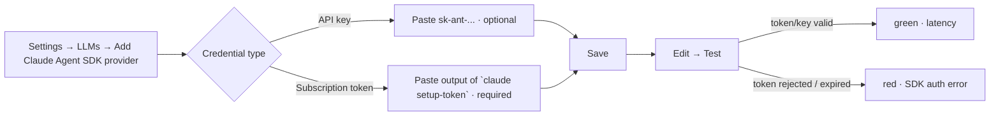

# RFC-056: Per-row credential kind for the `claude_agent_sdk` provider

**Status**: Accepted
**Author**: Invana Team
**Date**: 2026-09-03
**Related**:
- **RFC-053** (`claude_agent_sdk` provider) — this RFC extends Decision 1 (API key is optional) with a
  second, explicit credential kind on the same row. Everything else in RFC-053 is unchanged.
- **RFC-032** (LLM runtime) — unchanged; still one dispatch call per provider kind.

---

## Problem / intent

RFC-053 shipped `claude_agent_sdk` with exactly one stored-secret shape: an optional API key, injected
as `ANTHROPIC_API_KEY`. When absent, the SDK falls through to whatever the Claude Code CLI on the
engine's host is logged into — fine for a single engine process with one login, but that breaks down in
two situations this project now actually has:

1. **The engine runs in a container** (Docker Compose dev environment). A host login lives in the
   macOS Keychain or `~/.claude/.credentials.json`; a container can't see either, so the CLI-login
   fallback never has anything to fall back to. An interim fix passed a container-wide
   `CLAUDE_CODE_OAUTH_TOKEN` env var through `docker-compose.yml` — this RFC replaces that (Decision 5);
   the engine's own process environment is never a credential source for this provider.
2. **Multiple `claude_agent_sdk` rows want different Claude subscriptions.** A single container-wide
   env var is one credential for the whole engine process — every graph's `claude_agent_sdk` row shares
   it. There is no way, today, for two rows to each authenticate as a different Claude account.

**Intent:** let an operator paste a `claude setup-token` output directly onto an `LLMProvider` row, the
same way they'd paste an API key — Fernet-encrypted at rest, decrypted per call, never touching a shared
process-wide credential. Multiple rows, multiple subscriptions.

---

## Decisions

1. **One new nullable enum column, `credential_kind`, on the existing `llm_providers` table.** No new
   table, no new secret-storage column — the pasted string still goes through the same
   `api_key_encrypted` Fernet column RFC-053 already has (structurally it's just an opaque secret
   either way; only the *env var it's injected as* differs). Values: `api_key` (default/legacy) and
   `oauth_token`. Meaningful only when `provider = claude_agent_sdk`; every other provider kind leaves
   it `NULL` and the column is ignored.

2. **Explicit selector in the UI, not prefix auto-detection.** A `claude setup-token` output and a
   `sk-ant-...` API key are not distinguishable by a documented, stable format — sniffing one would risk
   silently misclassifying a credential and producing a confusing downstream auth failure instead of a
   clear validation error. Studio shows a two-option control ("API key" / "Subscription token") next to
   the credential field for `claude_agent_sdk` only; the choice is sent as `credential_kind` alongside
   the secret.

3. **`oauth_token` is a committed choice, not a fallback.** Selecting "API key" keeps RFC-053's existing
   behavior exactly: blank means "use the CLI's own login" (now effectively "use whatever
   `CLAUDE_CODE_OAUTH_TOKEN` the container inherits," see Decision 5). Selecting "Subscription token"
   requires a value — there is no sensible fallback for "I chose subscription-token mode but pasted
   nothing."

4. **Injection is a one-line branch in `_build_options`.** `claude_agent_sdk.call`/`.ping` already
   accept `api_key` and build a per-call `env` dict handed to `ClaudeAgentOptions` (RFC-053 Decision 1);
   this RFC adds a `credential_kind` parameter next to it. `oauth_token` → `env["CLAUDE_CODE_OAUTH_TOKEN"]
   = api_key`; anything else → the existing `env["ANTHROPIC_API_KEY"] = api_key`. No other provider's
   `call()` signature behavior changes — `credential_kind` is accepted-and-ignored by the others, the
   same way `claude_agent_sdk.call` already accepts-and-ignores `base_url`/`tool_name` (RFC-032's shared
   dispatch signature).

5. **The interim `CLAUDE_CODE_OAUTH_TOKEN` container env var is removed, not layered underneath this.**
   `docker-compose.yml` and `.env.example` no longer pass it through — a `claude_agent_sdk` row's
   subscription token comes from the `LLMProvider` row alone (`credential_kind = oauth_token` +
   `api_key_encrypted`), never from the engine's ambient process environment. This is a deliberate
   product decision, not just tidiness: an env var is one credential shared by every row on the engine
   process, which directly defeats the multi-subscription goal this RFC exists for, and an ambient
   fallback would make it non-obvious which credential a given row is actually running under. The Agent
   SDK does still merge the full inherited process environment under `options.env` per call (verified
   against `claude_agent_sdk/_internal/transport/subprocess_cli.py` —
   `process_env = {**inherited_env, ..., **self._options.env, ...}`) — Invana simply never sets
   `CLAUDE_CODE_OAUTH_TOKEN` in that inherited environment, so there is nothing to fall back to. An
   operator who sets it in their own shell/host outside Invana's control is on their own; not a
   supported path.

---

## Design

### Schema

| Table | Change |
|---|---|
| `llm_providers` | + `credential_kind` — nullable `llm_credential_kind` enum (`api_key`, `oauth_token`), `NULL` default. New Postgres enum type; SQLite stores it as a plain column (no CHECK), same pattern as `llm_provider_kind`. |

Migration `000000000029` (revises `000000000028`): create the Postgres enum (guarded `DO $$ ... EXCEPTION
WHEN duplicate_object$$`, mirroring `00000000000b`), add the nullable column on both dialects. No
backfill — every existing row (all provider kinds) has `credential_kind = NULL`, which is exactly the
"api_key semantics" default. Downgrade drops the column and, on Postgres, the enum type.

### Engine

| Surface | Change |
|---|---|
| `llm_providers/models.py` | `LLMCredentialKind(StrEnum)`: `api_key`, `oauth_token`. `LLMProvider.credential_kind: LLMCredentialKind \| None` |
| `llm_providers/schemas.py` | `LLMProviderCreate`/`Update` gain `credential_kind: LLMCredentialKind \| None = None` |
| `llm_providers/services.py` | `create_provider`/`update_provider`: reject `credential_kind` set on any non-`claude_agent_sdk` row (422); when `credential_kind == oauth_token`, `api_key` is required on create (same "requires a credential" 422 RFC-053 uses for `needs_key` providers). `_dispatch_ping` passes `provider.credential_kind` through. |
| `llm/providers/claude_agent_sdk.py` | `_build_options`, `call`, `ping` gain a `credential_kind: str \| None` parameter; branches the env var per Decision 4 |
| `llm/client.py` | `_invoke`/`complete_tool` read `provider.credential_kind` and pass it to every dispatched `call()` (accepted-and-ignored by non-`claude_agent_sdk` providers) |

### Studio

| Surface | Change |
|---|---|
| `types/llm.ts` | `LLMCredentialKind = "api_key" \| "oauth_token"`; `LLMProvider`/`Create`/`Update` gain `credential_kind?: LLMCredentialKind \| null` |
| `LLMsSection.tsx` | For `claude_agent_sdk` only: a `Select` ("API key" / "Subscription token") above the credential field, defaulting to the row's existing value or `"api_key"`. Selecting "Subscription token" makes the field required (mirrors the existing `requiresKey` required/optional logic) and swaps the label/placeholder to reference `claude setup-token`; the credential field itself is unchanged (still a masked text input — same encrypted storage column either way) |

### Journey (extends RFC-053's)

Multiple rows, each `claude_agent_sdk` with `credential_kind = oauth_token` and its own pasted token,
each authenticate as a different Claude subscription — that's the scenario this RFC exists for.

---

## Alternatives Considered

| Alternative | Pros | Cons | Why rejected |
|---|---|---|---|
| **Auto-detect credential kind by string prefix** | one field, no new column | No documented, stable prefix distinction between an API key and a `setup-token` output; a misdetection fails with a confusing downstream auth error instead of a validation error | Rejected — explicit selector (Decision 2). |
| **New dedicated `oauth_token_encrypted` column** | fully separate from `api_key_encrypted` | Two secret columns to encrypt/rotate/redact for what is, structurally, the same "one opaque secret per row" shape RFC-053 already has | Rejected — reuse `api_key_encrypted`, disambiguate with a small enum column (Decision 1). |
| **Keep it env-var-only, one token per engine process** | zero schema change | Doesn't solve the actual ask — can't run two `claude_agent_sdk` rows against two different subscriptions | Rejected — this is the problem the RFC exists to fix. |

---

## Security Considerations

- **No new secret class, same encryption path.** `credential_kind` is a plaintext enum column (not a
  secret); the token/key itself still goes through the existing Fernet `api_key_encrypted` column and
  `graphs.encryption` helpers RFC-053 already uses.
- **Blast radius is per-call, not process-wide.** Because the SDK spawns one subprocess per call with
  its own `env`, a row's token is only ever exposed to that row's own subprocess invocations — it does
  not leak into the container's ambient environment or other rows' calls.
- **A `claude setup-token` token is a long-lived (one-year), subscription-scoped bearer credential.**
  Anyone who can read a graph's `llm_providers` row's decrypted secret (i.e., anyone with
  `INVANA_ENCRYPTION_KEY` and DB access — the same operator-trust boundary RFC-053 already assumes for
  API keys) can use it to make model requests against that subscription until it's revoked. This is not
  a new trust boundary; it's the same one RFC-053 §Security already draws around `api_key_encrypted`.

## Open Questions

- [ ] Whether `ping_provider` should surface a distinct message for "token expired" vs. "token invalid"
  — today both come back as whatever string the SDK's `ResultMessage.result` contains, same as RFC-053.

## Implementation Plan

1. [x] `LLMCredentialKind` enum + `credential_kind` column + migration `000000000029`.
2. [x] Schemas + service-layer validation (`credential_kind` only on `claude_agent_sdk`; required when
   `oauth_token`).
3. [x] `claude_agent_sdk.py` env branch; thread `credential_kind` through `llm/client.py` dispatch.
4. [x] Studio: credential-kind selector, required/optional + label logic, payload wiring.
5. [x] Changeset.

## Scope & MVP impact

Additive to shipped **RFC-053**; no new slice, no new table. The keyless dev default remains Ollama;
the API-key-optional CLI-login fallback on `claude_agent_sdk` is unchanged.

## References

- `docs/internal/mvp/rfc-053-claude-agent-sdk-provider.md`
- Claude Code docs, Authentication → "Generate a long-lived token" (`claude setup-token`,
  `CLAUDE_CODE_OAUTH_TOKEN`) — `https://code.claude.com/docs/en/authentication`
