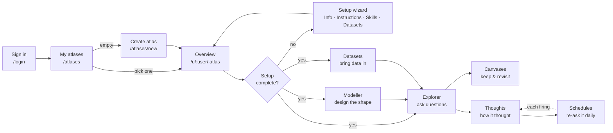
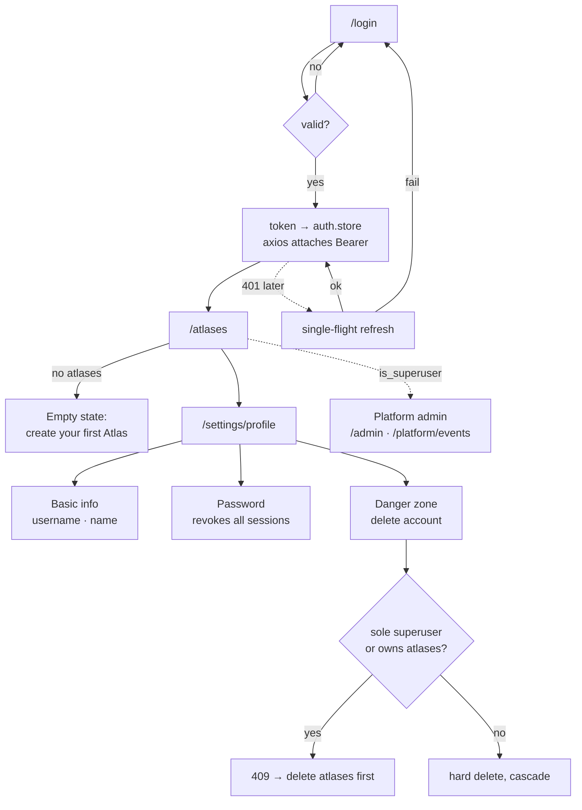
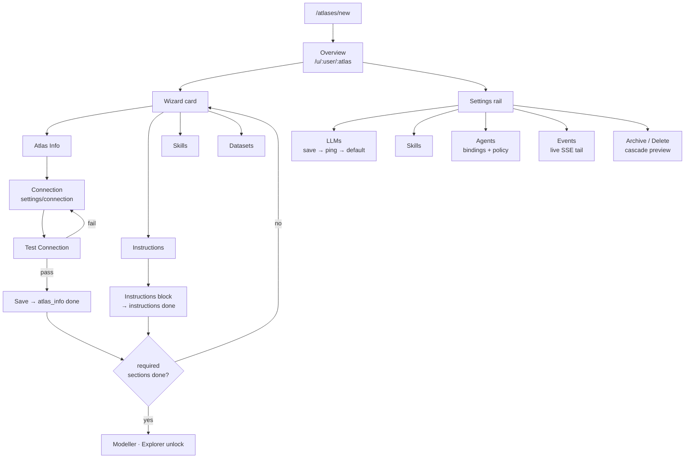
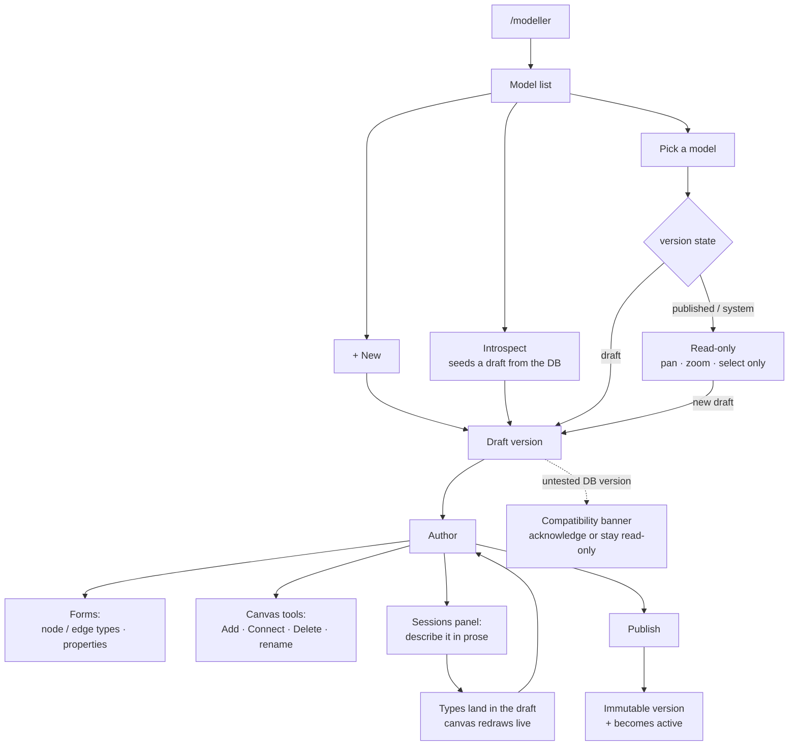
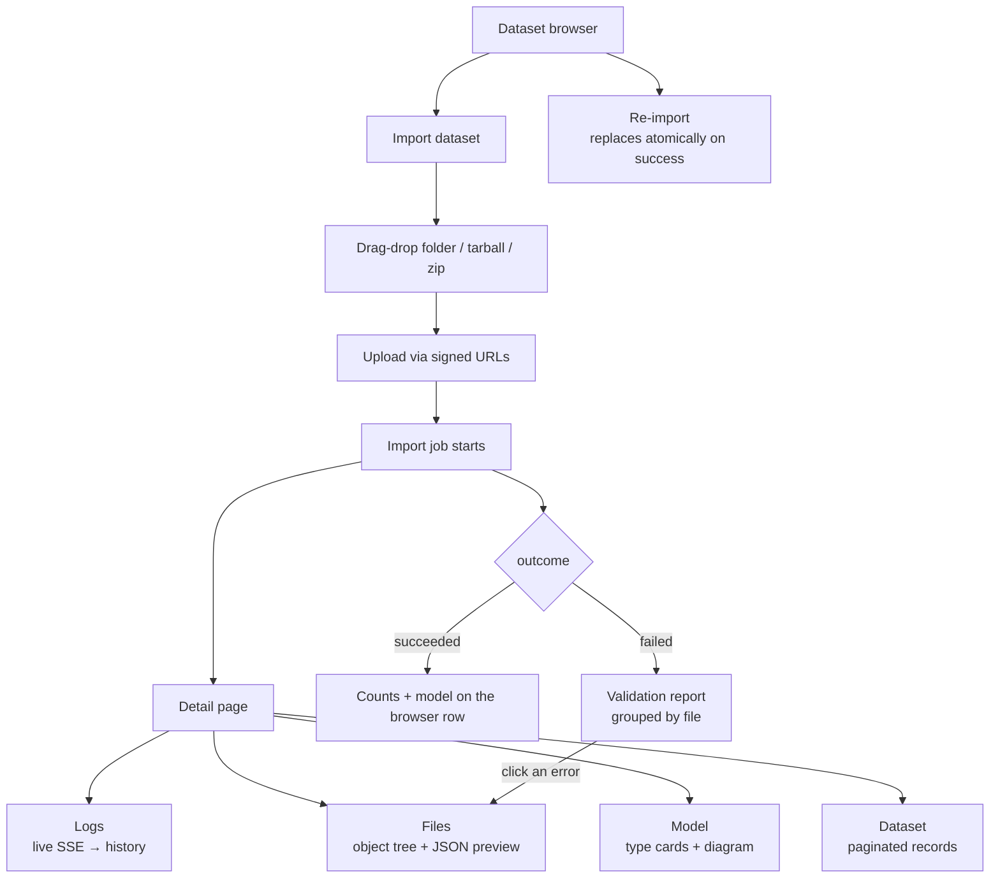
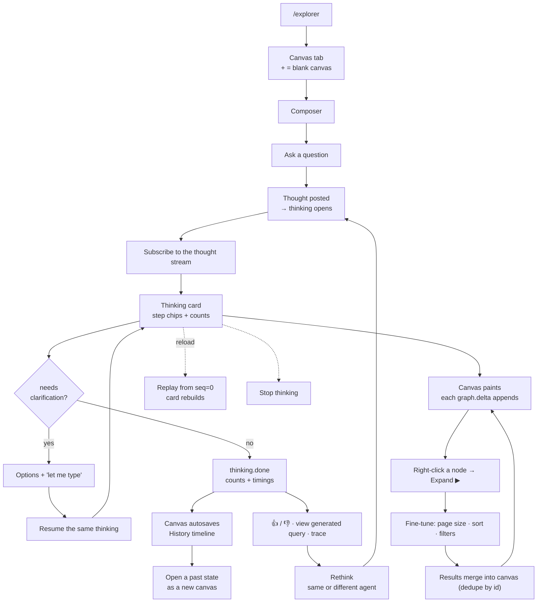
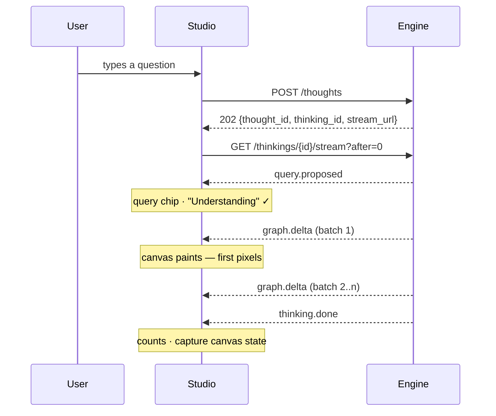
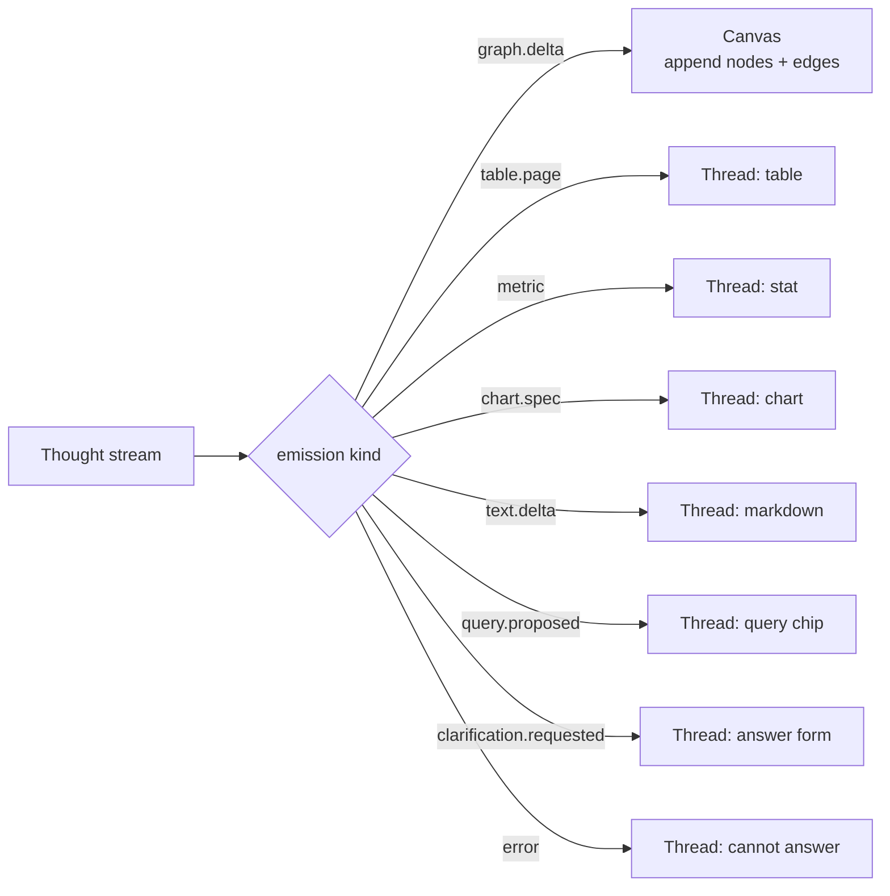
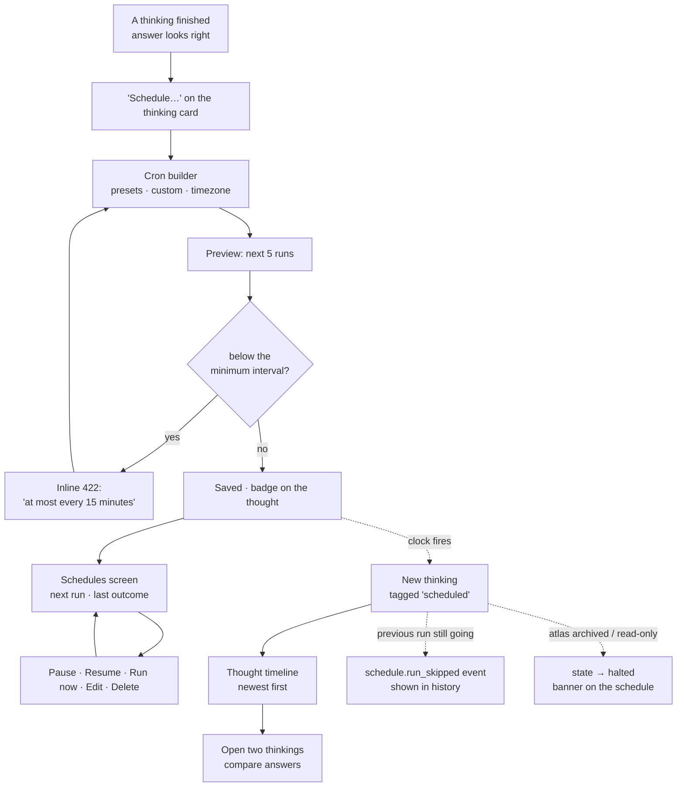
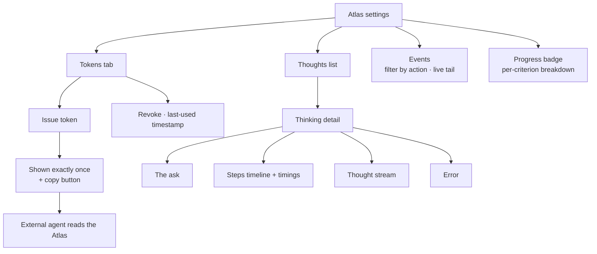

# Studio — MVP frontend scope (journeys + implementation tasks)

Frontend half of [`../mvp.md`](../mvp.md). **Journeys as diagrams, work as tables.** Backend
counterpart: [`engine.md`](engine.md).

Status: `[ ]` not started · `[~]` in progress · `[x]` done · `[-]` deferred post-1.0

> **An Atlas is a bounded knowledge graph your agents can reason over.** (RFC-049)
> The word "graph" is reserved for the data structure — the graph database, the graph model, the
> rendered graph. Copy in the product should follow that split.

| Ground rule | Source |
|---|---|
| All UI from `@invana/design-kit` / `@invana/ui` — don't rebuild what exists | CLAUDE.md #9 |
| All graph rendering via `@invana/canvas-react` — never import `@invana/canvas`, no PixiJS in studio | CLAUDE.md #10 |
| Server state = TanStack Query · client state = Zustand · no hand-typed API shapes | generated TS client is the contract |
| Atlas-scoped routes are `/u/:username/:atlasSlug/...` | param is `atlasSlug`, field is `Atlas.slug` |

---

## 1. The whole journey

| Journey | Goal | Entry |
|---|---|---|
| [2](#2-getting-in) | Get in and manage my account | `/login` · `/settings/profile` |
| [3](#3-creating--configuring-an-atlas) | Create an Atlas and make it usable | `/atlases` · `/u/:user/:atlas/settings/*` |
| [4](#4-designing-the-model) | Design the shape of my data | `/u/:user/:atlas/modeller` |
| [5](#5-bringing-data-in) | Load data and verify it landed | `settings/datasets` |
| [6](#6-asking-questions) | Ask, watch it think, keep the answer | `/u/:user/:atlas/explorer` |
| [7](#7-schedules) | Have a question re-asked unattended, on a cron | `/explorer` · `settings/schedules` |
| [8](#8-operating) | Tokens, thinkings, events, progress | `settings/*` · `/platform/events` |

---

## 2. Getting in

| # | Task | Surface | Consumes | Status |
|---|---|---|---|---|
| 2.1 | Login page | `LoginPage` | `POST /auth/login` | `[~]` |
| 2.2 | Auth store, persisted | `stores/auth.store.ts` (Zustand) | — | `[~]` |
| 2.3 | Axios interceptor: attach Bearer, single-flight refresh on 401 | `services/api/client.ts` | `POST /auth/refresh` | `[~]` |
| 2.4 | `useAuth` — `displayName`, `activeMembership`, `membershipForAtlas` (binary) | `hooks/useAuth` | `GET /auth/me` | `[~]` |
| 2.5 | Protected route shell | `ProtectedRoute` | — | `[~]` |
| 2.6 | Profile: Basic info tab (email read-only · username with cooldown · names) | `ProfileSettingsPage` | `PATCH /auth/me`, `GET /auth/username-available` | `[~]` |
| 2.7 | Profile: Password tab | same | `POST /auth/me/password` | `[~]` |
| 2.8 | Profile: Danger zone + cascade preview dialog; render 409 reasons as actions | same | `DELETE /auth/me` | `[~]` |
| 2.9 | Superuser-only "Platform admin" link (direct `is_superuser` check) | app shell dropdown | — | `[x]` |
| 2.10 | Platform events page, superuser-only | `PlatformEventsPage` `/platform/events` | `GET /events`, `/events/stream` | `[x]` |
| — | Public sign-up removed (`RegisterPage`, `/register`) | — | — | `[x]` |
| — | Roles removed — no `RoleGate`, `isAdmin`, `isBuilder` | — | — | `[x]` |
| — | HttpOnly cookie token storage | — | — | `[-]` |

---

## 3. Creating & configuring an Atlas

| # | Task | Surface | Consumes | Status |
|---|---|---|---|---|
| 3.1 | Atlas list + create + overview | `/atlases`, `/atlases/new`, `/u/:user/:atlas` | `GET POST /atlases` | `[x]` |
| 3.2 | Setup wizard card — per-section done/skipped/todo; locks explain themselves and link to the unblocking section | overview | `POST …/setup/{section}` | `[x]` |
| 3.3 | Connection form; Test gates Save; `connector_class` read-only after first save; blank `auth` ≠ clear | `ConnectionForm` `settings/connection` | `GET PUT DELETE …/connection`, `POST …/connection/test` | `[x]` |
| 3.4 | Settings rail shell — `?settings=<section>` drives `leftSection` → `SettingsPanel` in a `TabbedPanel`; same rail across Overview/Explorer/Modeller; per-section full-page route | `useAtlasLeftNav` | — | `[x]` |
| 3.5 | LLM providers — provider-driven form, masked key, **save-first → ping → green/red**, set-default, row actions | `settings/llms` | `…/llm*`, `POST …/llm/{id}/ping`, `/set-default` | `[x]` |
| 3.6 | Instructions — single custom-instructions block | `InstructionsSection` | `PATCH` atlas | `[x]` |
| 3.7 | Skills — list + form (name/description/content/when_to_use), 409 on duplicate | `settings/skills` | `…/skills*` | `[x]` |
| 3.8 | Events section — filter by action prefix, keyset infinite scroll, live-tail head refresh | `EventsSection` | `…/events`, `…/events/stream` | `[x]` |
| 3.9 | Agents — list + editor, skill picker, LLM picker, policy form | `settings/agents` | `…/agents*` | `[ ]` |
| 3.10 | Archive toggle + read-only banner on every Atlas page + mutating actions disabled | General settings | `POST …/archive`, `…/unarchive` | `[ ]` |
| 3.11 | Delete confirmation with cascade preview (child counts) | dialog | `DELETE` atlas | `[ ]` |
| 3.12 | Atlas switcher in app shell | app shell | `GET /atlases` | `[-]` |
| — | Train-of-thought authoring UI | — | — | `[-]` |

---

## 4. Designing the model

| # | Task | Surface | Consumes | Status |
|---|---|---|---|---|
| 4.1 | Model list — +New / rename / delete / introspect | `ModellerPage` | `…/models*`, `POST …/connection/introspect` | `[~]` |
| 4.2 | Draft → Publish lifecycle | same | `POST …/versions`, `…/activate` | `[~]` |
| 4.3 | Node/edge type forms + per-type property add/edit/delete + editable Property Keys | same | `…/node-types*`, `…/edge-types*`, `…/property-keys*` | `[~]` |
| 4.4 | Interactive canvas on a draft — Add / Connect / Delete tools, Select inline-rename; positions ephemeral (force layout) | `SchemaCanvas` | same | `[~]` |
| 4.5 | Read-only versions: tool palette **shows** unavailability, not just rejects clicks | same | — | `[~]` |
| 4.6 | Generative sessions panel (`surface=modeller`, NL only) — change summary, Commit → activate, `model_id` syncs canvas, invalidate `["models",u,g]` | `SessionsPanel` + `SessionComposer` | `POST …/sessions/{id}/messages` | `[x]` |
| 4.7 | Property-type dropdowns driven by `supported_property_types` | forms | `GET …/connection` | `[ ]` |
| 4.8 | Compatibility banner — untested → acknowledge; unknown → declare version; read-only until then | modeller header | `POST …/connection/acknowledge-version` | `[ ]` |
| — | Constraint/index authoring · YAML round-trip | — | — | `[-]` |

---

## 5. Bringing data in

| # | Task | Surface | Consumes | Status |
|---|---|---|---|---|
| 5.1 | Dataset browser — model summary, record counts, last job status | `settings/datasets` | `GET …/datasets` | `[ ]` |
| 5.2 | Import form — drag-drop folder/tarball/zip, signed-URL upload | dialog | `POST …/datasets` | `[ ]` |
| 5.3 | Job status badge (queued/running/succeeded/failed) on browser + detail | both | `GET …/jobs/{jid}` | `[ ]` |
| 5.4 | **Logs** tab — live SSE during a run, full history after, filter by stage/level, copyable | detail tab | `…/logs`, `…/logs/stream` | `[ ]` |
| 5.5 | **Files** tab — object tree + JSON preview (truncated for large files) | detail tab | `…/files`, `…/files/{path}` | `[ ]` |
| 5.6 | **Model** tab — type cards (properties + constraints), edges as `from → to`; form view **and** small diagram | detail tab | `GET …/datasets/{dsid}` | `[ ]` |
| 5.7 | **Dataset** tab — paginated record table, sortable, type selector; **columns derived from the model** | detail tab | `…/records?type=&page=` | `[ ]` |
| 5.8 | Validation report — grouped by file, expandable, each error links to the record in Files. Render the structured rows as a table, not a log dump | panel | job detail | `[ ]` |
| 5.9 | Provenance panel in Explorer — click a node/edge → source dataset + record + job | inspector | `GET …/provenance/{id}` | `[ ]` |
| 5.10 | Stitcher mapping UI — dataset system types (left) ↔ user concepts (right), drag-to-map, per-property form | `settings/mappings` | `…/mappings*` | `[ ]` |
| 5.11 | Identity-resolution rule editor + conflict review (accept/reject possible-same pairs) | same | `…/mappings*` | `[ ]` |
| 5.12 | Materialize action + job progress + stats + log viewer (reuses 5.4) | overview | `POST …/stitch`, `…/stitch-jobs` | `[ ]` |
| — | Source-connector configuration UI | — | — | `[-]` |

---

## 6. Asking questions

**A query is a Thought; machines do the Thinking.**

### What an answer looks like

An answer is **multi-modal**: one thinking can return a subgraph, a ranked table, a headline number,
and a written explanation. Each emission declares its own surface — the frontend routes by `kind`, it
never guesses.

| Emission | Renders as | Where |
|---|---|---|
| `graph.delta` | nodes + edges, appended | **Canvas** |
| `table.page` | paginated table, columns from the payload | **Thread** |
| `metric` | inline stat / KPI | **Thread** |
| `chart.spec` | bar · line · pie · scatter | **Thread** |
| `text.delta` | streamed markdown | **Thread** |
| `query.proposed` | query chip + `via` label | **Thread** |
| `clarification.requested` | options + "let me type" | **Thread** |
| `error` | distinct "cannot answer" styling | **Thread** |

| # | Task | Surface | Consumes | Status |
|---|---|---|---|---|
| 6.1 | Explorer page — sessions panel (threaded ask/answer), status bar, inspector | `ExplorerPage` | `…/sessions*` | `[~]` |
| 6.2 | Canvas rendering — pan/drag/zoom/hover/select, header toolbar, inspector | `ExplorerCanvas` | — | `[x]` |
| 6.3 | Sessions on TanStack Query (`useSessionsQuery`/`useSessionQuery`/`useSendMessage`) | `hooks/queries/useSessions` | `…/sessions*` | `[ ]` |
| 6.4 | Composer posts a **thought**, then subscribes | `SessionComposer` | `POST …/thoughts` | `[ ]` |
| 6.5 | **Thinking card** — names the **workflow** that is running, step chips from `thinking_steps` (`understand · validate · execute · project`), live counts, elapsed per step | `ThinkingCard` | stream + `GET …/thinkings/{id}` | `[ ]` |
| 6.6 | `graph.delta` → **append** into the canvas store (never reassign `data`: destructive, re-seeds the renderer) | canvas store | stream | `[ ]` |
| 6.7 | `query.proposed` → query chip + `via` model label + "view generated query" | thread | stream | `[ ]` |
| 6.7a | `table.page` renderer — paginated table, columns from payload, pages append | thread | stream | `[ ]` |
| 6.7b | `metric` renderer — inline stat / KPI | thread | stream | `[ ]` |
| 6.7c | `chart.spec` renderer — bar · line · pie · scatter | thread | stream | `[ ]` |
| 6.7d | `text.delta` renderer — streamed markdown, appended token-wise | thread | stream | `[ ]` |
| 6.7e | Emission router — dispatch by `kind`; an unknown kind is ignored, never fatal | `useThinkingStream` | stream | `[ ]` |
| 6.8 | Clarification → resume the **same** thinking (options + "let me type"); card reads "needs something from you" | existing options UI | `POST …/thinkings/{id}/resume` | `[x]` UI / `[ ]` rewire |
| 6.9 | 👍/👎 with downvote-refine, attached to the thinking | thread | feedback route | `[x]` UI / `[ ]` rewire |
| 6.10 | **Stop thinking** | card action | `POST …/thinkings/{id}/cancel` | `[ ]` |
| 6.11 | **Trace view** — prompt → rationale → proposed query → verdict → batches → counts, per step | disclosure → panel | `GET …/thinkings/{id}/trace` | `[ ]` |
| 6.12 | **Rethink** on any past thought (same or different agent) | thread action | `POST …/thoughts/{id}/rethink` | `[ ]` |
| 6.13 | Citation chips → click through to the source record | thread | provenance | `[ ]` |
| 6.14 | "Cannot answer" rendered distinctly — never styled like an answer | thread | stream `error` | `[ ]` |
| 6.15 | 422 (no LLM provider) routes to Settings → LLMs instead of a raw error | composer | — | `[ ]` |
| 6.16 | Expand ▶ context menu — by node type / incoming / outgoing, schema-driven | `ExplorerCanvas` menu | `POST …/explorer/expand/*` | `[ ]` |
| 6.17 | `ExpandFineTunePanel` — page size · sort · filters · "Load next page" · "Showing X of N" · per-node pagination | panel | same | `[ ]` |
| 6.18 | Expand results **merge** into the canvas, deduped by id | canvas store | — | `[ ]` |
| 6.19 | Read-only schema browser in the Explorer rail (`?settings=model`) | `ModelSection` | `GET …/schema/active-version` | `[x]` |
| 6.20 | Canvases rail panel (paginated · edit/delete/archive/open) | `CanvasesPanel` | `…/canvases*` | `[x]` |
| 6.21 | Canvas tab bar — tabs + "+" blank canvas; tab switch switches the active session | `CanvasTabsBar` | same | `[x]` |
| 6.22 | Canvas hydrate + autosave | `ExplorerPage` | `PATCH …/canvases/{id}` | `[x]` |
| 6.23 | Live banner — 10s throttled autosave refreshes the list preview while open (not only on blur) | `ExplorerPage` | same | `[ ]` |
| 6.24 | **History** timeline — lazy thumbnails per captured turn, "Open as new canvas" fork via `importState` | canvas header | `…/canvases/{id}/states*` | `[ ]` |
| 6.25 | Semantic search box + similarity-scored results | Explorer | `POST …/search?type=semantic` | `[ ]` |

**UX budget.** Step chips only help if the *first* chip appears fast. Past a few hundred ms the card
feels slower than a spinner even when it finishes sooner — the wait becomes visible instead of hidden.

---

## 7. Schedules

**As an analyst, I want a question I care about re-asked on its own, so that I find out the answer
changed without remembering to check.**

> **A Schedule is a trigger on a Thought.** The *workflow* is what runs when it fires — see § 6.5
> and [`rfc-051-workflows.md`](rfc-051-workflows.md).

A Schedule is created from a **thought I already asked** — never composed from a blank form. That
keeps the mental model small: you only schedule questions you've seen work, and every firing lands
under the same ask so the answers stack into a timeline you can compare.

| Surface | Route | What it shows |
|---|---|---|
| **Schedule…** | on the thinking card, `/explorer` | opens the cron builder for that thought |
| **Cron builder** | dialog | presets (hourly · daily 09:00 · weekly Mon · monthly 1st) · custom cron · timezone · agent override · next-5-runs preview |
| **Schedule badge** | thought row + thinking card | `⏱ daily 09:00` · dimmed when paused |
| **Thought timeline** | `/thoughts/:id` | every thinking under the ask, newest first, each tagged **asked** or **scheduled** |
| **Schedules screen** | `settings/schedules` | Atlas-wide list — thought, cadence, next run, last outcome, inline pause / run-now |

| Seam | What the user sees |
|---|---|
| While a scheduled run is in flight | the thought row shows a live spinner; opening it tails the stream like any thinking |
| On reload mid-run | replay from `seq=0` — no difference from an interactive thinking |
| Run skipped (overlap) | a muted row in the schedule's history, sourced from the `schedule.run_skipped` event |
| Run failed | the timeline entry is red; the error is the thinking's own `error` emission |
| Atlas archived or read-only | schedules move to `halted` and say so; definitions are preserved, nothing is deleted |
| Member without access | never sees the Atlas, so never sees its schedules |
| Thought deleted | the schedule goes with it — confirmed in the delete dialog |

**Empty state:** the Schedules screen with none set up points back at the Explorer — "schedule a
question you've already asked" — rather than offering a create-from-blank form.

## 8. Operating

| # | Task | Surface | Consumes | Status |
|---|---|---|---|---|
| 7.1 | Tokens tab — issue (shown **exactly once** + copy), revoke, last-used | `settings/tokens` | `…/tokens*` | `[ ]` |
| 7.2 | Thoughts list per Atlas, rows expand to their thinkings | `ThoughtsPage` | `GET …/thoughts` | `[ ]` |
| 7.3 | Thinking detail — ask · steps timeline · thought stream · error tabs | same | `GET …/thinkings/{id}` | `[ ]` |
| 7.4 | Success-criteria progress badge + per-criterion breakdown | overview | scoring route | `[ ]` |
| 7.5 | Write-back review panel — diff of proposed writes, accept/reject per node/edge | panel | write-back routes | `[ ]` |

---

## 9. Streaming (backend supports SSE — the frontend has to consume it)

Every long-running surface streams. One hook pattern, three consumers.

| # | Task | Applies to | Endpoint | Status |
|---|---|---|---|---|
| 8.1 | `useEventStream` — SSE + TanStack cache invalidation, `?token=` fallback | audit events | `…/events/stream` | `[x]` |
| 8.2 | `useThinkingStream(thinkingId)` — SSE tail with `after` cursor, typed emission dispatch, **replay from last applied `seq` on reconnect** | thinking card, canvas | `…/thinkings/{id}/stream` | `[ ]` |
| 8.3 | `useJobLogStream(jobId)` — live import/stitch logs, switches to history on completion | dataset + stitch logs | `…/logs/stream` | `[ ]` |
| 8.4 | Reconnect + backoff + "reconnecting" affordance shared by all three | shared hook | — | `[ ]` |
| 8.5 | Cursor persistence so a reload replays instead of losing the run | thinking card | `?after=` | `[ ]` |
| 8.6 | Batched-delta application — coalesce per animation frame so a 40k-node stream doesn't thrash the renderer | canvas store | — | `[ ]` |
| 8.7 | Native `EventSource` only — no streaming dependency | all | — | `[x]` |

---

## 10. Telemetry & observability (studio side)

| # | Task | Detail | Status |
|---|---|---|---|
| 9.1 | Browser OTel spans forwarded through the engine's proxy route (RFC-025) | no direct collector exposure from the browser | `[x]` |
| 9.2 | End-to-end query→render tracing | one trace spans composer → engine → canvas paint | `[x]` |
| 9.3 | Session/message trace correlation + FE→BE span stitching (RFC-026) | parent/child context propagated on requests | `[x]` |
| 9.4 | `submit → first emission` timing on the thinking card | the metric that governs the §6 UX budget | `[ ]` |
| 9.5 | Canvas render timings (nodes painted, frame cost) per delta batch | feeds 8.6 tuning | `[ ]` |
| 9.6 | Trace id surfaced in error states for support | copyable on failure | `[ ]` |

---

## 11. Foundations

| # | Task | Detail | Status |
|---|---|---|---|
| 10.1 | App shell — sidebar, header, atlas-scoped routing | all routes under `/u/:username/:atlasSlug/...` | `[ ]` |
| 10.2 | OpenAPI → TS client generation in `studio/scripts/` | `openapi-typescript` or `orval`; the client is the contract | `[ ]` |
| 10.3 | Markdown editor reused across Skills + Instructions | CodeMirror 6 | `[ ]` |
| 10.4 | Theming | `@invana/themes` `AppLayoutV2` slots | `[x]` |
| 10.5 | Studio served as static assets in single-image Docker mode | engine serves `/static/*` | `[ ]` |
| 10.6 | Track design-kit `latest` — Studio pins `0.0.12`, upstream is `0.0.19` (`ChatSession*`, `PanelStack`, `@invana/tables` unreachable) | [RFC-050](rfc-050-design-kit-component-plan.md) W0 — gates §6 | `[ ]` |
| 10.7 | Adopt what design-kit already ships: `DataTable` (5 hand-rolled tables), `ChatSession*`, `PanelStack` | [RFC-050](rfc-050-design-kit-component-plan.md) W1 | `[ ]` |
| 10.8 | Answer-surface components built in design-kit, not Studio — `StepChip` · `ProcessCard` · `DataTableBlock` · `MetricStat` · `ChartBlock` · `MarkdownBlock` · `TokenChip` · `EmptyResult` | [RFC-050](rfc-050-design-kit-component-plan.md) W2–W3 — gates 6.5, 6.7a–d, 6.14 | `[ ]` |
| 10.9 | Promote domain-free Studio components upstream — `ConfirmDialog` · `ListPanel` · `EmptyState` · `NoticeBanner` · `StatusBadge` · `Stepper` · `FormError` | [RFC-050](rfc-050-design-kit-component-plan.md) W4 | `[ ]` |

### Dependencies (`studio/package.json`)

| Area | Packages |
|---|---|
| Framework | `react@19` · `react-dom@19` · `vite` |
| Routing / state / data | `react-router-dom` · `zustand` · `@tanstack/react-query` |
| HTTP | `axios` (auth interceptor) |
| UI (design-kit) | `@invana/ui` · `@invana/forms` · `@invana/themes` · `@invana/styling` · `@invana/tables` · `@invana/charts` (new, [RFC-050](rfc-050-design-kit-component-plan.md) W3) · `tailwindcss@4` |
| Graph rendering | `@invana/canvas-react` (over `@invana/canvas` → `pixi.js@8`) |
| Editor | `codemirror@6` (markdown + Cypher/Gremlin) |
| Streaming | native `EventSource` — no dependency |
| Lint / test | `biome` · `vitest` · `@testing-library/react` · `playwright` |

### Deferred (post-1.0)

`[-]` HttpOnly cookie tokens · Atlas switcher in app shell · markdown *rendering* for skills/instructions ·
modeller constraint/index authoring · workflow authoring UI · source-connector config UI ·
soft deletes / trash / undo · username-change redirects (old usernames 404).
