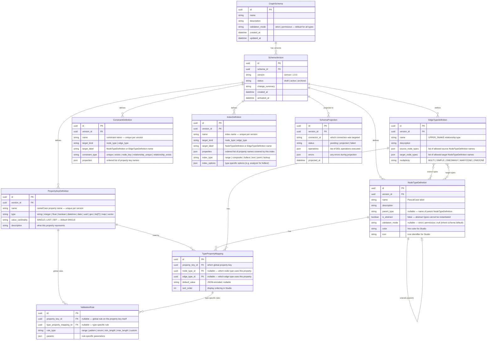
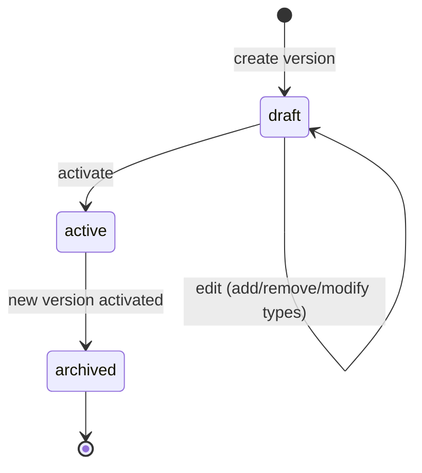
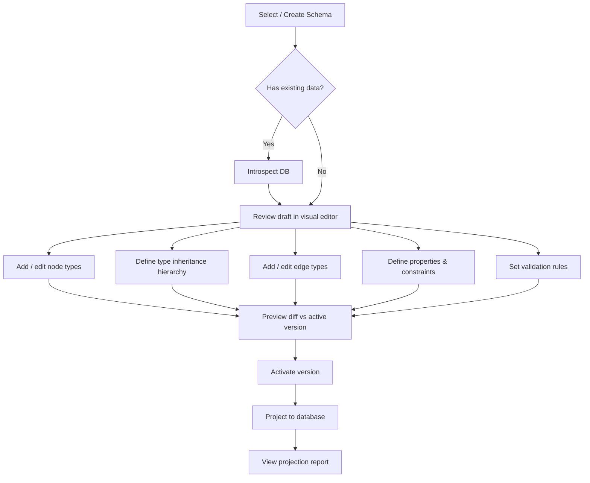

# RFC-002: Graph Modeller

> **Status**: Draft
> **Author**: Ravi Merugu
> **Created**: 2026-04-09
> **Updated**: 2026-04-09
> **Depends on**: RFC-001 (Graph Connectors)

## Summary

The Graph Modeller is an engine module that owns the canonical definition of a graph's structure — node types, edge types, properties, constraints, validation rules, and type inheritance — with full version history, diffing, and bidirectional synchronization with graph databases via the connector layer. It is the source of truth that Studio's visual modelling editor, the data validation pipeline, and the schema export/import system all build on.

A future RFC-003 (Ontology & Semantics Layer) will add semantic capabilities on top: namespaces, URIs, multi-language annotations, relationship semantics (inverse, transitive, symmetric), and OWL/SHACL/JSON-LD export/import.

## Motivation

- **Connector schema is too low-level.** `schema_reader`/`schema_writer` deal in indexes and constraints — raw DDL. Studio's modelling editor needs rich types with descriptions, colors, icons, cardinality, validation rules, and source/target restrictions. That model must live above the connector.
- **Graph databases are schema-flexible.** Most graph DBs allow any property on any node. Without an application-level schema, data quality degrades over time. The schema provides guardrails the database doesn't.
- **Versioning is an application concern.** Databases don't version their schema. The modeller tracks every change, supports diffing between versions, and enables rollback without data loss.
- **If we don't do this.** Studio's modelling UI has no backend to persist schema definitions. Data validation has no schema to validate against. There's no bridge between high-level modelling and low-level database constraints.

## Design

### Three-Layer Architecture

```
┌──────────────────────────────────────────────────────────┐
│  Studio Modelling UI                                     │  ← visual editor
├──────────────────────────────────────────────────────────┤
│  API Layer (FastAPI)                                     │  ← REST endpoints
├──────────────────────────────────────────────────────────┤
│  Graph Modeller (engine module)                          │  ← THIS RFC
│                                                          │
│  ┌──────────────┐  ┌───────────┐  ┌───────────────────┐ │
│  │  SchemaStore  │  │ Versioner │  │    Projector      │ │
│  │ (app state DB)│  │ (diffing) │  │ (→ connector DDL) │ │
│  └──────────────┘  └───────────┘  └───────────────────┘ │
│  ┌───────────────┐  ┌───────────┐  ┌─────────────────┐  │
│  │ Introspector  │  │ Validator │  │  JSON Export /   │  │
│  │ (← connector) │  │ (runtime) │  │     Import       │  │
│  └───────────────┘  └───────────┘  └─────────────────┘  │
│  ┌────────────────────────────────────────────────────┐  │
│  │ SchemaReconciler (startup sync check)              │  │
│  └────────────────────────────────────────────────────┘  │
├──────────────────────────────────────────────────────────┤
│  Connector schema_reader / schema_writer (RFC-001)       │  ← DB-level DDL
├──────────────────────────────────────────────────────────┤
│  Graph Database                                          │
└──────────────────────────────────────────────────────────┘
```

The graph modeller sits between the API/Studio layer and the connector layer. It stores the canonical schema in the engine's app state database (SQLite dev / PostgreSQL prod via SQLAlchemy async). It uses the connector's `schema_writer` to push constraints and indexes to the graph DB, and `schema_reader` to introspect existing databases.

### Data Model

Stored in the engine's app state database via SQLAlchemy async models.

#### Design Principle: Global Property Keys

In graph databases, a property key is a **global concept** — it defines a name and data type that is shared across all vertex and edge labels:

- **JanusGraph**: `mgmt.makePropertyKey("name").dataType(String.class).make()` — the property key is global; once defined, its type cannot change.
- **Neo4j**: Properties are ad-hoc, but best practice (and Neo4j 5 type constraints) treats property types as consistent across labels.
- **Ontologies (future RFC-003)**: RDF properties like `schema:name` are global — defined once, used by many classes with different constraints per class.

**Constraints** (uniqueness, existence) and **indexes** are **not** properties of the property key itself — they are scoped to a specific **(label, property)** pair. For example, `name` might be unique for `Person` but not for `Company`. This matches how every graph database actually enforces constraints:

- Neo4j: `CREATE CONSTRAINT FOR (p:Person) REQUIRE p.name IS UNIQUE`
- JanusGraph: `mgmt.buildIndex("personByName", Vertex.class).addKey(name).indexOnly(person).unique().buildCompositeIndex()`

The data model below reflects this separation.



#### Key Design Decisions

1. **`PropertyKeyDefinition` is global per version.** A property named `"name"` of type `"string"` is defined once. If `Person`, `Company`, and `Movie` all have a `name` property, they all reference the same `PropertyKeyDefinition`. This enforces type consistency — `name` cannot be a string for `Person` and an integer for `Company`.

2. **`TypePropertyMapping` links property keys to types.** Each mapping says "this type uses this property key" and adds type-specific configuration: display order and default value. This is where `required` and `unique` used to live, but those are now proper constraints.

3. **`ConstraintDefinition` is first-class.** Constraints like uniqueness, existence, and composite keys are explicit entities scoped to a (label, properties) pair — not flags on a property definition. This enables:
   - `name` unique for `Person` but not for `Company`
   - Composite uniqueness: `(firstName, lastName)` unique together for `Person`
   - `node_key` constraints (multiple properties that together uniquely identify a node)

4. **`IndexDefinition` no longer has `is_unique`.** Unique indexes are expressed as `ConstraintDefinition(constraint_type="unique")`. The Projector translates constraints to the appropriate DB DDL (which might be a unique index under the hood, as in Neo4j).

5. **`ValidationRule` supports two scopes.** A rule on `PropertyKeyDefinition` applies everywhere that property is used (e.g., `age >= 0`). A rule on `TypePropertyMapping` applies only to that type's usage (e.g., `Person.age max 150`, `Building.age max 1000`).

6. **`EdgeTypeDefinition.allowed_properties` is removed.** It was a Gremlin-specific workaround. The correct model is: an edge type only has the properties explicitly mapped to it via `TypePropertyMapping`. If a property isn't mapped, it's not allowed (in strict mode).

### Type Inheritance

Node types support single inheritance via `parent_type`. A child type inherits all property mappings and validation rules from its parent.

```json
{
  "property_keys": [
    {"name": "name", "type": "string"},
    {"name": "email", "type": "string"},
    {"name": "born", "type": "datetime"},
    {"name": "employeeId", "type": "string"},
    {"name": "department", "type": "string"}
  ],
  "node_types": [
    {
      "name": "Person",
      "property_mappings": [
        {"property_key": "name", "sort_order": 0},
        {"property_key": "email", "sort_order": 1},
        {"property_key": "born", "sort_order": 2}
      ]
    },
    {
      "name": "Employee",
      "parent_type": "Person",
      "description": "A person employed by a company",
      "property_mappings": [
        {"property_key": "employeeId", "sort_order": 0},
        {"property_key": "department", "sort_order": 1}
      ]
    }
  ],
  "constraints": [
    {"name": "person_email_unique", "target_label": "Person", "constraint_type": "unique", "properties": ["email"]},
    {"name": "employee_id_unique", "target_label": "Employee", "constraint_type": "unique", "properties": ["employeeId"]},
    {"name": "employee_id_exists", "target_label": "Employee", "constraint_type": "exists", "properties": ["employeeId"]}
  ]
}
```

`Employee` inherits `name`, `born`, `email` property mappings and all their validation rules from `Person`, plus adds its own properties. Note how `email` uniqueness is scoped to `Person` (and inherited by `Employee`) via `ConstraintDefinition`, not via a flag on the property key itself.

Inheritance rules:

| Rule | Behaviour |
|---|---|
| Property inheritance | Child inherits all parent properties. Child can add new properties but **cannot** remove or change type of inherited ones. |
| Constraint inheritance | All parent validation rules apply to child instances. Child can add stricter rules but **cannot** relax inherited ones. |
| Edge compatibility | An edge that accepts `Person` as source/target also accepts `Employee` (Liskov substitution). |
| Depth limit | Inheritance chains are limited to 5 levels to prevent complexity. |
| Abstract types | Types with `is_abstract=True` cannot be directly instantiated — they exist only to be extended. Useful for shared base types like `Entity` or `Agent`. |
| Multiple inheritance | **Not supported.** Use composition (shared property groups) instead. |

Inheritance in Studio is visualized as a tree hierarchy in the modelling sidebar, and child types show inherited properties in a distinct style (e.g., greyed out with a "↑ inherited" badge).

### Edge Multiplicity

Every edge type has a `multiplicity` that constrains how many edges of that label may exist between any pair of vertices. This aligns with the JanusGraph/TinkerPop model and maps cleanly to Neo4j relationship semantics.

| Multiplicity | Meaning | Engine enforced | DB enforced |
|---|---|---|---|
| `MULTI` | Unlimited parallel edges between any vertex pair (default) | No constraint | No constraint |
| `SIMPLE` | At most **one edge per direction** between the same vertex pair | ✅ pre-check | Only if DB supports it |
| `ONE2MANY` | At most one **outgoing** edge per source vertex (any target) | ✅ pre-check | Engine only |
| `MANY2ONE` | At most one **incoming** edge per target vertex (any source) | ✅ pre-check | Engine only |
| `ONE2ONE` | At most one outgoing and one incoming edge on each vertex for this label | ✅ pre-check | Engine only |

The default is `MULTI` (no restriction). The Validator enforces non-`MULTI` multiplicities by querying the existing edge count before writing. The Projector maps `SIMPLE` to a DB-level unique constraint on (source, label, target) where the database supports it (e.g., `CREATE CONSTRAINT ... IS UNIQUE` on Neo4j relationship pairs).

```json
{
  "name": "MOTHER_OF",
  "source_node_types": ["Person"],
  "target_node_types": ["Person"],
  "multiplicity": "MANY2ONE"
}
```

### Multiple Source/Target Types

Edge types support multiple source and target node types.

```json
{
  "name": "REVIEWED",
  "source_node_types": ["Person", "Organization"],
  "target_node_types": ["Movie", "Book"],
  "multiplicity": "MULTI"
}
```

This means `REVIEWED` edges can connect any `Person` or `Organization` to any `Movie` or `Book`. Combined with inheritance, if `Employee` extends `Person`, then `Employee` is also a valid source.

### Property Value Cardinality

In Gremlin-based databases (JanusGraph, TinkerGraph, Neptune), a single property key on a vertex can hold multiple values. `value_cardinality` controls this:

| Value | Meaning | DB support |
|---|---|---|
| `SINGLE` | One value per vertex/edge (default) | All databases |
| `LIST` | Ordered list of values; duplicates allowed | JanusGraph, TinkerGraph, Neptune |
| `SET` | Unordered set of values; no duplicates | JanusGraph, TinkerGraph, Neptune |

For Cypher-based databases (Neo4j, Memgraph, ArcadeDB), only `SINGLE` is meaningful at the property level — multi-values are modelled as a `list[T]` property type instead. The Projector skips `LIST`/`SET` cardinality DDL for connectors that don't have the `PROPERTY_CARDINALITY` capability.

```json
{
  "name": "nickname",
  "type": "string",
  "value_cardinality": "SET"
}
```

### Index Definitions

Indexes are first-class entities in the schema, separate from `PropertyDefinition`. A single `IndexDefinition` covers one or more properties on a label. This supports both single-property and composite indexes.

#### Index Types

| `index_type` | Supports | DB examples | Use cases |
|---|---|---|---|
| `range` | Equality, range (`>`, `<`, `BETWEEN`) | Neo4j (B-tree), JanusGraph composite | Default — numeric ranges, date ranges |
| `composite` | Exact multi-property lookup | Neo4j composite, JanusGraph composite | `WHERE label=X AND prop1=Y AND prop2=Z` |
| `fulltext` | Text search (`CONTAINS`, `STARTS WITH`, tokenized) | Neo4j fulltext, JanusGraph mixed (Lucene/ES/Solr) | Product name search, description search |
| `text` | Substring and regex | Neo4j text index (5.x) | Case-insensitive lookup, `STARTS WITH` |
| `point` | Spatial point queries (distance, bounding box) | Neo4j point index | Geolocation queries |
| `lookup` | Label/type scan (existence, no value filtering) | Neo4j lookup index | `MATCH (n:Person)` without property filter |

Vector indexes are **not** defined via `IndexDefinition` — they are declared by setting `PropertyDefinition.type = "vector"` and are handled separately by the Projector as a distinct DDL path.

#### Index Examples

```json
[
  {
    "name": "person_name_range",
    "target_kind": "node_type",
    "target_label": "Person",
    "properties": ["name"],
    "index_type": "range"
  },
  {
    "name": "person_name_email_composite",
    "target_kind": "node_type",
    "target_label": "Person",
    "properties": ["name", "email"],
    "index_type": "composite",
    "is_unique": true
  },
  {
    "name": "movie_description_ft",
    "target_kind": "node_type",
    "target_label": "Movie",
    "properties": ["description"],
    "index_type": "fulltext",
    "index_options": {"analyzer": "standard"}
  },
  {
    "name": "acted_in_year_range",
    "target_kind": "edge_type",
    "target_label": "ACTED_IN",
    "properties": ["year"],
    "index_type": "range"
  }
]
```

Edge/relationship property indexes are modelled the same way — the `target_kind: "edge_type"` field tells the Projector to generate relationship property index DDL.

#### Capability Gating

Not all databases support all index types. The Projector gates creation by capability:

| `index_type` | Required connector capability |
|---|---|
| `range` | Always available (all DBs have basic indexing) |
| `composite` | `COMPOSITE_INDEX` |
| `fulltext` | `FULLTEXT_INDEX` |
| `text` | `TEXT_INDEX` |
| `point` | `POINT_INDEX` |
| `lookup` | `LOOKUP_INDEX` |

If a requested index type is not supported by the connected DB, the Projector records a warning in `SchemaProjection.errors` rather than failing the whole projection.

### Validation Rule Params

| `rule_type` | `params` shape | Example | Applies to types |
|---|---|---|---|
| `range` | `{"min": number, "max": number}` | `{"min": 0, "max": 150}` | `integer`, `float` |
| `pattern` | `{"regex": string}` | `{"regex": "^[\\w.-]+@[\\w.-]+\\.\\w+$"}` | `string` |
| `enum` | `{"values": list}` | `{"values": ["active", "inactive", "pending"]}` | `string`, `integer` |
| `min_length` | `{"min": int}` | `{"min": 1}` | `string`, `list[T]` |
| `max_length` | `{"max": int}` | `{"max": 255}` | `string`, `list[T]` |
| `custom` | `{"expression": string}` | `{"expression": "value > 0 and value != parent.other_prop"}` | any |

### Connector Integration

#### Projector: Schema → Database

The Projector reads an activated `SchemaVersion` and translates it into connector `schema_writer` calls. It only pushes what the database can enforce natively — everything else is enforced at the engine level by the Validator.

| Schema concept | Connector call | Condition |
|---|---|---|
| `ConstraintDefinition(constraint_type="unique")` | `schema_writer.create_constraint(label, props, constraint_type="unique")` | Always |
| `ConstraintDefinition(constraint_type="exists")` | `schema_writer.create_constraint(label, props, constraint_type="exists")` | Only if `SCHEMA_ENFORCEMENT` capability |
| `ConstraintDefinition(constraint_type="node_key")` | `schema_writer.create_constraint(label, props, constraint_type="node_key")` | Only if `SCHEMA_ENFORCEMENT` capability |
| `ConstraintDefinition(constraint_type="relationship_unique")` | `schema_writer.create_constraint(label, props, constraint_type="relationship_unique")` | Only if `RELATIONSHIP_PROPERTY_CONSTRAINTS` capability |
| `ConstraintDefinition(constraint_type="relationship_exists")` | `schema_writer.create_constraint(label, props, constraint_type="relationship_exists")` | Only if `RELATIONSHIP_PROPERTY_CONSTRAINTS` capability |
| `IndexDefinition(index_type="range")` | `schema_writer.create_index(label, props, index_type="range")` | Always |
| `IndexDefinition(index_type="composite")` | `schema_writer.create_index(label, props, index_type="composite")` | Only if `COMPOSITE_INDEX` capability |
| `IndexDefinition(index_type="fulltext")` | `schema_writer.create_index(label, props, index_type="fulltext", options=...)` | Only if `FULLTEXT_INDEX` capability |
| `IndexDefinition(index_type="text")` | `schema_writer.create_index(label, props, index_type="text")` | Only if `TEXT_INDEX` capability |
| `IndexDefinition(index_type="point")` | `schema_writer.create_index(label, props, index_type="point")` | Only if `POINT_INDEX` capability |
| `PropertyKeyDefinition(type="vector")` | `vector.create_vector_index(label, prop, dimensions=...)` | Only if `VECTOR_SEARCH` capability |
| `EdgeTypeDefinition(multiplicity=SIMPLE)` | `schema_writer.create_constraint(label, ..., constraint_type="relationship_uniqueness")` | Only if `RELATIONSHIP_UNIQUENESS` capability; engine-enforced otherwise |
| `EdgeTypeDefinition(multiplicity=*)` other than MULTI | **Enforced at engine level** (pre-write count check) | DB limitation |
| `PropertyKeyDefinition(value_cardinality=LIST\|SET)` | `schema_writer.create_property_key(name, cardinality=...)` | Only if `PROPERTY_CARDINALITY` capability (Gremlin DBs) |
| `ValidationRule(rule_type=*)` | **Not projected** — enforced at engine level | DB limitation |
| `EdgeTypeDefinition(source, target)` | **Not projected** — enforced at engine level | Most DBs don't restrict edge endpoints |
| `NodeTypeDefinition(parent_type)` | **Not projected** — inheritance is application-level | DBs have no type hierarchy concept |

The Projector is **idempotent** — running it twice on the same version produces no duplicate DDL. It compares the target state (the schema) against the current state (`schema_reader.get_indexes()` / `get_constraints()`) and only creates or drops what's needed.

Projection is **recorded** in the `SchemaProjection` table with the list of operations executed and any errors, so the operator knows what was pushed and what failed.

```python
# Pseudocode
class Projector:
    async def project(
        self,
        version: SchemaVersion,
        connector: BaseConnector,
    ) -> SchemaProjection:
        current_indexes = await connector.schema_reader.get_indexes()
        current_constraints = await connector.schema_reader.get_constraints()
        desired_indexes = self._compute_desired_indexes(version)
        desired_constraints = self._compute_desired_constraints(version, connector.capabilities())

        to_create_indexes = desired_indexes - current_indexes
        to_drop_indexes = current_indexes - desired_indexes  # only schema-managed ones
        to_create_constraints = desired_constraints - current_constraints
        to_drop_constraints = current_constraints - desired_constraints

        operations = []
        errors = []
        for idx in to_create_indexes:
            try:
                await connector.schema_writer.create_index(...)
                operations.append({"action": "create_index", ...})
            except ConnectorError as e:
                errors.append({"action": "create_index", "error": str(e), ...})

        # ... same for drops and constraints

        return SchemaProjection(
            version_id=version.id,
            status="projected" if not errors else "failed",
            operations=operations,
            errors=errors,
        )
```

#### Introspector: Database → Schema Draft

For connecting to an existing database with data already in it, the Introspector reverse-engineers a schema draft from the live database.

| Step | Connector call | Schema output |
|---|---|---|
| 1. Discover node labels | `schema_reader.get_node_labels()` | Create `NodeTypeDefinition` per label |
| 2. Discover edge labels | `schema_reader.get_edge_labels()` | Create `EdgeTypeDefinition` per label |
| 3. Discover properties | `schema_reader.get_property_keys(label)` | Create `PropertyKeyDefinition` per unique key; create `TypePropertyMapping` per (type, key) pair |
| 4. Infer property types | **New:** `schema_reader.get_property_schema(label)` | Set `PropertyKeyDefinition.type` |
| 5. Infer edge endpoints | **New:** `schema_reader.get_edge_schema(label)` | Set `EdgeTypeDefinition.source/target` |
| 6. Discover indexes | `schema_reader.get_indexes()` | Create `IndexDefinition` per index; infer `index_type` from index metadata |
| 7. Discover constraints | `schema_reader.get_constraints()` | Create `ConstraintDefinition` per constraint (unique, exists, node_key, etc.) |
| 7a. Discover multiplicity | **New:** `schema_reader.get_edge_multiplicity(label)` | Set `EdgeTypeDefinition.multiplicity` (Gremlin DBs) |
| 7b. Discover value cardinality | **New:** `schema_reader.get_property_cardinality(label, key)` | Set `PropertyKeyDefinition.value_cardinality` (Gremlin DBs) |
| 8. Get counts | `data_reader.count_vertices(label)` / `count_edges(label)` | Metadata for Studio display |

The result is a `SchemaVersion` in `draft` status that the user can review and refine in Studio before activating.

### Connector Schema Reader Extensions

Two new methods are needed on `BaseSchemaReaderQuerySet` to support introspection:

#### `get_property_schema(label)`

Returns property names with inferred types based on sample data.

```python
class PropertyInfo(BaseModel):
    """Inferred property schema from existing data."""
    name: str
    inferred_type: str  # "string", "integer", "float", "boolean", "datetime", "list", "map"
    sample_values: list[Any] = []  # up to 5 sample values
    null_count: int = 0  # how many nodes/edges have this property as null
    total_count: int = 0  # total nodes/edges sampled

class BaseSchemaReaderQuerySet(BaseQuerySet, ABC):
    # ... existing methods ...

    @abstractmethod
    async def get_property_schema(
        self,
        label: str,
        *,
        sample_size: int = 100,
    ) -> list[PropertyInfo]:
        """Infer property types from existing data by sampling."""
```

**Cypher implementation** (in `OpenCypherSchemaReaderQuerySet`):

```cypher
MATCH (n:`{label}`)
WITH n LIMIT $sample_size
UNWIND keys(n) AS key
WITH key, collect(n[key])[..5] AS samples, count(*) AS cnt
RETURN key, samples, cnt
```

Type inference logic: examine `samples` — if all are integers → `"integer"`, if all are strings → `"string"`, mixed → `"string"` (safest fallback).

**Neo4j override** (in `Neo4jSchemaReaderQuerySet`): Can use `CALL apoc.meta.schema()` if APOC is available for more accurate results, falling back to the sampling approach.

#### `get_edge_schema(label)`

Returns the source and target node labels an edge type connects.

```python
class EdgeSchemaInfo(BaseModel):
    """Inferred edge endpoint schema from existing data."""
    name: str
    source_labels: list[str]  # distinct source node labels
    target_labels: list[str]  # distinct target node labels
    property_keys: list[str]

class BaseSchemaReaderQuerySet(BaseQuerySet, ABC):
    # ... existing methods ...

    @abstractmethod
    async def get_edge_schema(
        self,
        label: str,
        *,
        sample_size: int = 100,
    ) -> EdgeSchemaInfo:
        """Infer edge endpoint patterns and property keys from existing data."""
```

**Cypher implementation**:

```cypher
MATCH (s)-[r:`{label}`]->(t)
WITH labels(s) AS src, labels(t) AS tgt, keys(r) AS ks
LIMIT $sample_size
RETURN collect(DISTINCT src[0]) AS source_labels,
       collect(DISTINCT tgt[0]) AS target_labels,
       collect(DISTINCT ks) AS all_keys
```

### Versioning

#### Version Lifecycle



- **`draft`** — Mutable. Types and properties can be added, removed, or modified. Only one draft per schema at a time.
- **`active`** — Immutable. The live version used for data validation and Studio display. Activating a version triggers projection to the database. Only one active version per schema at a time.
- **`archived`** — Immutable. Previous active versions. Kept for history, diffing, and rollback.

#### Version Numbering

Versions follow [SemVer](https://semver.org/). When activating a draft, the versioner auto-classifies the change:

| Change type | SemVer bump | Examples |
|---|---|---|
| Breaking | Major | Removed a node type, removed a required property, changed a property type |
| Additive | Minor | Added a node type, added an optional property, added an edge type |
| Metadata | Patch | Changed a description, changed a color/icon, reordered properties |

The auto-classification is a **recommendation** — the user can override the version number when activating.

#### Diffing

```python
class SchemaDiff(BaseModel):
    """Diff between two schema versions."""
    added_property_keys: list[str]
    removed_property_keys: list[str]
    modified_property_keys: list[PropertyKeyDiff]
    added_node_types: list[str]
    removed_node_types: list[str]
    modified_node_types: list[NodeTypeDiff]
    added_edge_types: list[str]
    removed_edge_types: list[str]
    modified_edge_types: list[EdgeTypeDiff]
    added_constraints: list[str]
    removed_constraints: list[str]
    added_indexes: list[str]
    removed_indexes: list[str]
    classification: Literal["major", "minor", "patch"]

class PropertyKeyDiff(BaseModel):
    name: str
    changes: dict[str, tuple[Any, Any]]  # field: (old, new)

class NodeTypeDiff(BaseModel):
    name: str
    added_property_mappings: list[str]     # property key names added to this type
    removed_property_mappings: list[str]   # property key names removed from this type
    metadata_changes: dict[str, tuple[Any, Any]]  # field: (old, new)

class PropertyDiff(BaseModel):
    name: str
    changes: dict[str, tuple[Any, Any]]  # field: (old, new)
```

### Validator

The Validator is called by the engine's data-writing pipeline (before the connector's `data_writer`) to enforce schema rules that databases can't enforce natively.

```python
class SchemaValidator:
    """Validates data operations against the active schema version."""

    async def validate_vertex_create(
        self,
        label: str,
        properties: dict,
        *,
        schema_version: SchemaVersion,
    ) -> list[ValidationError]:
        """Validate a vertex creation request against the schema."""

    async def validate_edge_create(
        self,
        label: str,
        source_vertex: Vertex,
        target_vertex: Vertex,
        properties: dict | None,
        *,
        schema_version: SchemaVersion,
    ) -> list[ValidationError]:
        """Validate an edge creation. Checks source/target types and cardinality."""

    async def validate_vertex_update(
        self,
        vertex: Vertex,
        properties: dict,
        *,
        schema_version: SchemaVersion,
    ) -> list[ValidationError]:
        """Validate a vertex property update."""
```

Validations performed:

| Check | Applies to | Error if |
|---|---|---|
| Label exists in schema | Vertex create, Edge create | Label not defined in active version |
| Abstract type check | Vertex create | Cannot create instances of `is_abstract=True` node types |
| Required properties present | Vertex create | Missing a property that has an `exists` constraint on this label |
| Property type matches | Vertex/Edge create/update | Value doesn't match `PropertyKeyDefinition.type` (own + inherited) |
| Value cardinality | Vertex/Edge create/update | Multiple values provided for a `SINGLE` cardinality property; duplicate values in a `SET` property |
| Unique constraint (pre-check) | Vertex create/update | Duplicate detected for a property with a `unique` constraint on this label (best-effort; DB constraint is the real enforcer) |
| Range validation | Vertex/Edge create/update | Value outside `ValidationRule(rule_type="range")` bounds |
| Pattern validation | Vertex/Edge create/update | Value doesn't match `ValidationRule(rule_type="pattern")` regex |
| Enum validation | Vertex/Edge create/update | Value not in `ValidationRule(rule_type="enum")` allowed list |
| Length validation | Vertex/Edge create/update | String/list length outside `min_length`/`max_length` bounds |
| Edge source type | Edge create | Source vertex label not in `EdgeTypeDefinition.source_node_types` (including subtypes via inheritance) |
| Edge target type | Edge create | Target vertex label not in `EdgeTypeDefinition.target_node_types` (including subtypes via inheritance) |
| Multiplicity: SIMPLE | Edge create | An edge with this label already exists between this exact source→target pair |
| Multiplicity: ONE2MANY | Edge create | This source vertex already has an outgoing edge of this label |
| Multiplicity: MANY2ONE | Edge create | This target vertex already has an incoming edge of this label |
| Multiplicity: ONE2ONE | Edge create | Either vertex already has any edge of this label |
| Unmapped property (strict mode) | Vertex/Edge create/update | Property key not mapped to this type via `TypePropertyMapping` |
| Inherited rule compliance | Vertex/Edge create/update | Child type data must satisfy all parent type validation rules |

Validation can be **strict** (reject on any error) or **permissive** (warn but allow). Controlled at two levels:

1. **Schema-level default** — set on the `GraphSchema`. Default: strict for `required`/`type`, permissive for everything else.
2. **Per-node-type override** — `NodeTypeDefinition.validation_mode` overrides the schema default when set. This allows strict validation on core types (e.g., `Person`) while keeping permissive mode on auxiliary types (e.g., `AuditLog`).

Edge type validation mode is determined by the **source** node type's mode.

### Startup Schema Reconciliation

#### Purpose

When the server starts (and whenever a new database connection is registered), the `SchemaReconciler` checks whether the live database schema matches the active application schema version. If they are out of sync, it takes action based on the configured reconciliation mode. This prevents the application from silently running against a database whose schema has drifted from what the app expects.

#### Three-State Comparison

The reconciler compares three sources:

| Source | What it represents | Where stored |
|---|---|---|
| **Active app version** | What the application *intends* the DB schema to be | `schema_versions` (app state DB) |
| **Last successful projection** | What the Projector last pushed to the DB | `schema_projections` (app state DB) |
| **Live DB schema** | What the DB *actually* has right now | `schema_reader.get_indexes()` + `get_constraints()` |

The three sources produce four outcomes:

| Condition | Meaning |
|---|---|
| Live DB == last projection == active version | **In sync** — no action needed |
| Live DB is *missing* items from last projection | **App ahead** — projection wasn't run, or DB was reset or restored |
| Live DB has *extra* items not in last projection | **DB ahead** — something was added directly in the DB outside the app |
| Both sides changed relative to last projection | **Conflict** — always raise error; requires manual reconciliation in Studio |

If no active schema version exists for the connection, that is treated as a special case (see mode table below).

#### Reconciliation Modes

Configured via the `SCHEMA_RECONCILE_MODE` environment variable (default: `strict`):

| Mode | App ahead (DB missing projected items) | DB ahead (DB has extras) | No active schema configured |
|---|---|---|---|
| `strict` | Raise `SchemaOutOfSyncError`, block startup | Raise `SchemaOutOfSyncError`, block startup | Raise `SchemaNotConfiguredError`, block startup |
| `auto_project` | Re-project automatically, log info | Raise `SchemaOutOfSyncError`, block startup | Raise `SchemaNotConfiguredError`, block startup |
| `auto_introspect` | Re-project automatically, log info | Create new draft version, log warning, continue | Introspect DB and create initial draft, log warning, continue |
| `warn` | Log warning, continue | Log warning, continue | Log warning, continue |

In `auto_introspect` mode, when the DB is ahead, the reconciler creates a new `draft` schema version from full introspection of the live DB. It does **not** auto-activate the draft — that requires human review in Studio. Studio surfaces the new draft with a banner: *"Your database schema has changed since the last projection. Review draft version X.Y.Z before activating."*

#### SchemaReconciler

```python
class ReconcileMode(str, Enum):
    STRICT = "strict"
    AUTO_PROJECT = "auto_project"
    AUTO_INTROSPECT = "auto_introspect"
    WARN = "warn"


class ReconcileStatus(str, Enum):
    IN_SYNC = "in_sync"
    PROJECTED = "projected"          # app was ahead, auto re-projected
    DRAFT_CREATED = "draft_created"  # DB was ahead, new draft version created
    DRIFTED = "drifted"              # drift detected; warn mode — not blocked
    ERROR = "error"                  # conflict or missing schema; startup blocked


class ReconcileResult(BaseModel):
    connector_id: str
    schema_id: str | None
    active_version: str | None
    status: ReconcileStatus
    drift: SchemaDrift | None = None
    new_draft_version_id: str | None = None   # populated when draft_created
    projection: SchemaProjection | None = None  # populated when projected
    message: str


class SchemaReconciler:
    """Validates and reconciles the live DB schema against the active app schema version."""

    async def reconcile(
        self,
        connector: BaseConnector,
        *,
        schema_id: str | None = None,
        mode: ReconcileMode,
    ) -> ReconcileResult:
        """
        Run a single reconciliation for one connection.
        If schema_id is None, looks up the active schema for this connector_id.
        """

    async def reconcile_all(
        self,
        *,
        mode: ReconcileMode,
    ) -> list[ReconcileResult]:
        """Run reconcile() for every registered connection at startup."""
```

#### FastAPI Startup Hook

```python
# engine/src/invana/app.py

@app.on_event("startup")
async def startup_schema_reconciliation():
    mode = ReconcileMode(settings.SCHEMA_RECONCILE_MODE)  # default: strict
    reconciler = SchemaReconciler(
        store=schema_store,
        projector=projector,
        introspector=introspector,
    )
    results = await reconciler.reconcile_all(mode=mode)
    for result in results:
        if result.status == ReconcileStatus.IN_SYNC:
            logger.info("Schema in sync: connector=%s version=%s", result.connector_id, result.active_version)
        elif result.status == ReconcileStatus.PROJECTED:
            logger.info("Schema auto-projected: connector=%s", result.connector_id)
        elif result.status == ReconcileStatus.DRAFT_CREATED:
            logger.warning(
                "DB schema has changed outside the app. New draft created: %s. "
                "Review in Studio before activating. connector=%s",
                result.new_draft_version_id,
                result.connector_id,
            )
        elif result.status == ReconcileStatus.DRIFTED:
            logger.warning("Schema drift detected (warn mode): connector=%s drift=%s", result.connector_id, result.drift)
        # ReconcileStatus.ERROR is raised as an exception (never reaches here in strict/auto_project mode)
```

Errors from `strict` and `auto_project` modes propagate as exceptions that abort the FastAPI startup sequence — the server will not accept traffic until the schema is reconciled.

### API Surface

All endpoints are under `/api/v1/schemas`. Requires authentication (JWT).

#### Schema CRUD

```
POST   /api/v1/schemas
  Request:  { "name": "Movie Graph", "description": "..." }
  Response: { "id": "uuid", "name": "Movie Graph", ... }

GET    /api/v1/schemas
  Response: [{ "id": "uuid", "name": "Movie Graph", "active_version": "1.0.0", ... }]

GET    /api/v1/schemas/{schema_id}
  Response: { "id": "uuid", "name": "...", "active_version": { ... }, "versions": [...] }

PUT    /api/v1/schemas/{schema_id}
  Request:  { "name": "Updated Name", "description": "..." }

DELETE /api/v1/schemas/{schema_id}
```

#### Version Management

```
POST   /api/v1/schemas/{schema_id}/versions
  Request:  { "based_on": "1.0.0" }  (optional — clone from existing version)
  Response: { "id": "uuid", "version": null, "status": "draft", ... }

GET    /api/v1/schemas/{schema_id}/versions
  Response: [{ "id": "uuid", "version": "1.0.0", "status": "active", ... }]

GET    /api/v1/schemas/{schema_id}/versions/{version_id}
  Response: { full version with node_types, edge_types, properties, rules }

POST   /api/v1/schemas/{schema_id}/versions/{version_id}/activate
  Request:  { "version": "1.1.0" }  (optional override, otherwise auto-classified)
  Response: { "version": "1.1.0", "status": "active", "classification": "minor", "diff": { ... } }

GET    /api/v1/schemas/{schema_id}/versions/diff?from={v1}&to={v2}
  Response: { "added_node_types": [...], "removed_node_types": [...], ... }
```

#### Node Type Management (on draft versions only)

```
POST   /api/v1/schemas/{schema_id}/versions/{version_id}/node-types
  Request:  {
    "name": "Person",
    "description": "A human individual",
    "color": "#4A90D9",
    "icon": "user",
    "properties": [
      { "name": "name", "type": "string", "required": true },
      { "name": "email", "type": "string", "unique": true, "validation_rules": [
        { "rule_type": "pattern", "params": { "regex": "^[\\w.-]+@[\\w.-]+\\.\\w+$" } }
      ]},
      { "name": "age", "type": "integer", "validation_rules": [
        { "rule_type": "range", "params": { "min": 0, "max": 150 } }
      ]}
    ]
  }

POST   /api/v1/schemas/{schema_id}/versions/{version_id}/node-types
  (with inheritance)
  Request:  {
    "name": "Employee",
    "parent_type": "Person",
    "description": "A person employed by a company",
    "color": "#6EC1E4",
    "icon": "briefcase",
    "properties": [
      { "name": "employeeId", "type": "string", "required": true, "unique": true },
      { "name": "department", "type": "string" }
    ]
  }
  Response includes inherited properties marked with "inherited": true

POST   /api/v1/schemas/{schema_id}/versions/{version_id}/node-types
  (abstract base type)
  Request:  {
    "name": "Agent",
    "is_abstract": true,
    "description": "Any entity that can perform actions",
    "properties": [
      { "name": "name", "type": "string", "required": true }
    ]
  }

GET    /api/v1/schemas/{schema_id}/versions/{version_id}/node-types
  Response includes "effective_properties" (own + inherited) and "hierarchy" (parent chain)
GET    /api/v1/schemas/{schema_id}/versions/{version_id}/node-types/{node_type_id}
PUT    /api/v1/schemas/{schema_id}/versions/{version_id}/node-types/{node_type_id}
DELETE /api/v1/schemas/{schema_id}/versions/{version_id}/node-types/{node_type_id}
```

#### Edge Type Management (on draft versions only)

```
POST   /api/v1/schemas/{schema_id}/versions/{version_id}/edge-types
  Request:  {
    "name": "ACTED_IN",
    "description": "A person acted in a movie",
    "source_node_types": ["Person"],
    "target_node_types": ["Movie"],
    "multiplicity": "MULTI",
    "properties": [
      { "name": "roles", "type": "list[string]" },
      { "name": "year", "type": "integer", "required": true }
    ]
  }

GET    /api/v1/schemas/{schema_id}/versions/{version_id}/edge-types
PUT    /api/v1/schemas/{schema_id}/versions/{version_id}/edge-types/{edge_type_id}
DELETE /api/v1/schemas/{schema_id}/versions/{version_id}/edge-types/{edge_type_id}
```

#### Index Management (on draft versions only)

```
POST   /api/v1/schemas/{schema_id}/versions/{version_id}/indexes
  Request:  {
    "name": "person_name_email_composite",
    "target_kind": "node_type",
    "target_label": "Person",
    "properties": ["name", "email"],
    "index_type": "composite",
    "is_unique": true
  }
  Response: { "id": "uuid", "name": "...", "index_type": "composite", ... }

POST   /api/v1/schemas/{schema_id}/versions/{version_id}/indexes
  (edge property fulltext index)
  Request:  {
    "name": "acted_in_notes_ft",
    "target_kind": "edge_type",
    "target_label": "ACTED_IN",
    "properties": ["notes"],
    "index_type": "fulltext",
    "index_options": { "analyzer": "standard" }
  }

GET    /api/v1/schemas/{schema_id}/versions/{version_id}/indexes
  Response: [ list of all IndexDefinitions for this version ]

PUT    /api/v1/schemas/{schema_id}/versions/{version_id}/indexes/{index_id}
DELETE /api/v1/schemas/{schema_id}/versions/{version_id}/indexes/{index_id}
```

#### Projection & Introspection

```
POST   /api/v1/schemas/{schema_id}/versions/{version_id}/project
  Request:  { "connector_id": "uuid" }
  Response: {
    "status": "projected",
    "operations": [
      { "action": "create_constraint", "label": "Person", "properties": ["email"], "type": "unique" },
      { "action": "create_index", "label": "Person", "properties": ["name"] }
    ],
    "errors": []
  }

GET    /api/v1/schemas/{schema_id}/versions/{version_id}/project
  Response: { latest projection status }

POST   /api/v1/schemas/{schema_id}/introspect
  Request:  { "connector_id": "uuid" }
  Response: { "version_id": "uuid", "status": "draft",
              "discovered": { "node_types": 5, "edge_types": 8, "properties": 42 } }

POST   /api/v1/schemas/{schema_id}/versions/{version_id}/drift-check
  Request:  { "connector_id": "uuid" }
  Response: {
    "status": "drifted",
    "drift": {
      "missing_indexes": [{ "label": "Person", "properties": ["name"] }],
      "extra_indexes": [{ "label": "Movie", "properties": ["rating"] }],
      "missing_constraints": [],
      "extra_constraints": [{ "label": "Person", "properties": ["ssn"], "type": "unique" }],
      "unknown_labels": ["TempNode"]
    }
  }
```

#### Reconciliation

```
GET    /api/v1/schemas/{schema_id}/reconcile
  Query: connector_id (required)
  Response: {
    "status": "in_sync" | "drifted" | "projected" | "draft_created" | "error",
    "active_version": "1.2.0",
    "drift": { ... } | null,
    "new_draft_version_id": "uuid" | null,
    "last_checked_at": "2026-04-09T10:00:00Z"
  }
  (Returns cached result of the most recent reconciliation — does not re-run it)

POST   /api/v1/schemas/{schema_id}/reconcile
  Request:  { "connector_id": "uuid", "mode": "auto_project" }
  Response: {
    "status": "projected",
    "drift": { ... },
    "projection": { "operations": [...], "errors": [] },
    "message": "Schema was out of sync. Re-projected successfully."
  }
  (Manually trigger reconciliation — used by Studio's \"Fix drift\" action)
```

#### Export & Import

```
POST   /api/v1/schemas/{schema_id}/versions/{version_id}/export
  Request:  { "format": "json" }
  Response: file download

POST   /api/v1/schemas/import
  Request:  multipart/form-data with file
  Response: { "schema_id": "uuid", "version_id": "uuid", "status": "draft" }
```

### Studio UI Workflow



The visual editor in Studio renders node types as colored cards with property lists. Inherited properties are shown in a distinct style (greyed, with an "↑ inherited" badge). Edge types are shown as connections between cards. The sidebar shows the type inheritance tree. The canvas (`@invana/canvas`) may optionally render a live preview of the schema as a graph where node types are nodes and edge types are edges.

### Storage

- **Schema metadata** — Engine's app state database (SQLAlchemy async, SQLite dev / PostgreSQL prod).
- **Version snapshots** — Same DB. Activated versions are immutable rows.
- **Projection history** — Same DB. `SchemaProjection` records what DDL was executed on which connector.
- **Migrations** — Alembic (via SQLAlchemy). New tables: `graph_schemas`, `schema_versions`, `node_type_definitions`, `edge_type_definitions`, `property_definitions`, `validation_rules`, `schema_projections`.

### Module Structure

```
engine/src/invana/modeller/
├── __init__.py            ← Public API exports
├── database.py            ← Async SQLAlchemy engine & session factory setup
├── models.py              ← SQLAlchemy async models (includes IndexDefinition)
├── schemas.py             ← Pydantic request/response schemas
├── store.py               ← SchemaStore — CRUD on app state DB
├── versioner.py           ← Version lifecycle, diffing, auto-classification
├── projector.py           ← Schema → connector schema_writer DDL
├── introspector.py        ← connector schema_reader → Schema draft
├── validator.py           ← Runtime data validation against active schema
├── reconciler.py          ← Startup sync check: app schema vs live DB
├── inheritance.py         ← Single-inheritance property resolution & hierarchy validation
└── json_io.py             ← Export/import schema to/from JSON
```

### Dependencies

**Engine core** (new):

- `alembic` — schema migrations (likely already needed for app state DB)
- No new external dependencies

### Connector Layer Changes

| Change | File | Type |
|---|---|---|
| Add `PropertyInfo` model | `base/data_types/schema_elements.py` | New Pydantic model |
| Add `EdgeSchemaInfo` model | `base/data_types/schema_elements.py` | New Pydantic model |
| Add `get_property_schema(label, sample_size)` | `base/querysets/schema_reader.py` | New abstract method |
| Add `get_edge_schema(label, sample_size)` | `base/querysets/schema_reader.py` | New abstract method |
| Add `get_edge_multiplicity(label)` | `base/querysets/schema_reader.py` | New abstract method — returns `"MULTI"` by default; Gremlin implementations query management API |
| Add `get_property_cardinality(label, key)` | `base/querysets/schema_reader.py` | New abstract method — returns `"SINGLE"` by default; Gremlin implementations query management API |
| Add capabilities: `COMPOSITE_INDEX`, `FULLTEXT_INDEX`, `TEXT_INDEX`, `POINT_INDEX`, `LOOKUP_INDEX`, `PROPERTY_CARDINALITY`, `RELATIONSHIP_PROPERTY_CONSTRAINTS`, `RELATIONSHIP_UNIQUENESS` | `base/capabilities.py` | New `Capability` enum values |
| Update `create_index(label, props, index_type, options)` signature | `base/querysets/schema_writer.py` | Add `index_type` and `options` params |
| Implement for Cypher | `cypher/querysets/schema_reader.py` | Sampling-based Cypher queries |
| Implement for Gremlin | `gremlin/querysets/schema_reader.py` | Sampling-based Gremlin traversals + management API for multiplicity/cardinality |
| Neo4j override | `invana-neo4j/.../schema_reader.py` | `apoc.meta.schema()` when available, fallback to sampling; capabilities: all index types |
| JanusGraph override | `invana-janusgraph/.../schema_reader.py` | Gremlin management API for multiplicity and value cardinality; mixed index types |
| Export from `connectors/__init__.py` | `connectors/__init__.py` | Add new models and capabilities to `__all__` |

## Alternatives Considered

| Alternative | Pros | Cons | Why rejected |
|---|---|---|---|
| Store schema in the graph DB itself (meta-nodes) | Single source of truth, no app state DB | Couples schema to a specific connection; versioning is hard in graph form; circular dependency (need schema to validate schema) | App state DB is the right place for application metadata |
| Use JSON files on disk | Simple, version-controllable in git | No multi-user support, no API, no concurrent access | Doesn't work for a web application |
| Schema-on-read only (no enforcement) | Zero friction | Data quality degrades; Studio can't provide good UX without knowing the schema | Defeats the purpose of schema modelling |
| Full DB-level enforcement only | DB handles validation | Most graph DBs lack rich validation (range, pattern, cardinality); Gremlin DBs have almost no schema DDL | Can't provide a unified experience across databases |
| Multiple inheritance for node types | More expressive modelling | Diamond problem; complex resolution order; harder to reason about | Single inheritance + composition covers 95% of use cases |

## Security Considerations

- **Authorization**: Schema management requires appropriate permissions. Roles: `schema:read`, `schema:write`, `schema:admin` (can activate/archive versions and project to DB). Read access may be broader (any authenticated user can view the active schema).
- **Projection safety**: Projecting to a database executes DDL (CREATE INDEX, CREATE CONSTRAINT, DROP). This must be gated behind `schema:admin` and should show a confirmation in Studio with the list of operations before executing.
- **Validation bypass**: The Validator should not be bypassable from the API layer. Raw `connector.execute()` is internal only. If a user needs to bypass validation (e.g., data migration), they must use a dedicated migration endpoint with appropriate permissions.
- **Input validation**: All schema names, property names, and labels must be validated against injection patterns. Names should be alphanumeric + underscores only; the Projector must use parameterized queries / backtick-escaping when generating DDL.

## Performance Considerations

- **Validation overhead**: The Validator runs on every write operation. It must be fast — in-memory lookup against the active schema version (cached). Target: < 1ms per validation. Inheritance resolution (computing effective properties) is done once at cache load time, not per-validation.
- **Schema caching**: The active schema version — including resolved inheritance trees — should be cached in memory and invalidated only when a new version is activated. No DB round-trip per write.
- **Introspection**: Sampling-based introspection (`get_property_schema`, `get_edge_schema`) uses `LIMIT` to avoid scanning the entire database. Default sample size: 100 records.
- **Projection**: DDL operations (index/constraint creation) can be slow on large databases. Projection should report progress and allow async execution for large schemas.

## Resolved Questions

- [x] **Multiple source/target types on edges** — Yes. Edge types use `source_node_types: list[str]` / `target_node_types: list[str]`.
- [x] **Multiple inheritance** — Rejected. Single inheritance only — simpler resolution, no diamond problem.
- [x] **Multiple schemas per connection** — One active schema per connection. Multiple schema definitions can exist (for different use cases or drafts), but only one can be active per graph database connection at a time.
- [x] **Per-node-type validation config** — Yes. Validation mode (strict/permissive) is configurable per node type, defaulting to the schema-level setting.
- [x] **Introspector infer validation rules** — No for v1. The Introspector infers types and structure only. Users add rules manually after reviewing the introspected draft.
- [x] **Schema drift handling** — Two mechanisms: (1) On-demand `POST /reconcile` or drift-check in Studio. (2) Automatic startup reconciliation via `SchemaReconciler`. Behaviour on drift is governed by `SCHEMA_RECONCILE_MODE` (`strict` / `auto_project` / `auto_introspect` / `warn`). Default is `strict` — any drift blocks server startup.
- [x] **Introspector detect inheritance** — No for v1. Users define inheritance manually in the draft after introspection.
- [x] **Edge cardinality naming** — Renamed from `cardinality` (one-to-one/many) to `multiplicity` using the MULTI/SIMPLE/ONE2MANY/MANY2ONE/ONE2ONE enum, aligned with JanusGraph and TinkerPop standards. Neo4j cardinality (many-to-many etc.) maps to MULTI by default.
- [x] **Property `indexed` flag** — Removed. Replaced by first-class `IndexDefinition` model that supports range, composite, fulltext, text, point, and lookup index types with capability gating per DB.
- [x] **Property value cardinality (LIST/SET)** — Added `value_cardinality: SINGLE | LIST | SET` to `PropertyDefinition`. Projected only for DBs with `PROPERTY_CARDINALITY` capability (Gremlin DBs). Cypher DBs use `type: list[T]` instead.

## Deferred to RFC-003 (Ontology & Semantics Layer)

The following features are intentionally excluded from this RFC and will be addressed in a separate RFC that builds on the graph modeller:

- **Namespaces & URIs** — Globally unique identifiers for types and properties (e.g., `schema:Person`)
- **Annotations** — Multi-language labels and descriptions (BCP-47 language tags)
- **Relationship semantics** — `inverse_of`, `is_transitive`, `is_symmetric` on edge types
- **OWL/SHACL/JSON-LD export/import** — Standards-based interoperability (`rdflib`, `pyshacl`)
- **Reasoning / inference** — Runtime inference based on semantic declarations

## Open Questions

All questions resolved.

## Implementation Plan

1. [ ] **Connector extensions** — Add `PropertyInfo`, `EdgeSchemaInfo` models; add `get_property_schema()`, `get_edge_schema()`, `get_edge_multiplicity()`, `get_property_cardinality()` to base, Cypher, Gremlin querysets; add new capability enum values; update `schema_writer.create_index()` signature
2. [ ] **Neo4j override** — `get_property_schema()` and `get_edge_schema()` with APOC fallback; declare `COMPOSITE_INDEX`, `FULLTEXT_INDEX`, `TEXT_INDEX`, `POINT_INDEX`, `RELATIONSHIP_PROPERTY_CONSTRAINTS` capabilities
3. [ ] **JanusGraph override** — `get_edge_multiplicity()` and `get_property_cardinality()` via Gremlin management API; declare `PROPERTY_CARDINALITY`, `COMPOSITE_INDEX`, `FULLTEXT_INDEX` capabilities
4. [ ] **SQLAlchemy models** — `modeller/models.py` with all tables: graph_schema, schema_version, node_type (with parent_type, is_abstract, validation_mode), edge_type (with multiplicity, allowed_properties), property (with value_cardinality, remove `indexed` flag), validation_rule, **index_definition**, schema_projection
5. [ ] **Alembic migration** — Initial migration creating schema tables including `index_definitions`
6. [ ] **Pydantic schemas** — `modeller/schemas.py` request/response models including inheritance resolution, `IndexDefinition`, edge multiplicity, property value cardinality
7. [ ] **SchemaStore** — CRUD for schemas, versions, node types, edge types, properties, indexes, rules
8. [ ] **Inheritance resolver** — Compute effective properties and validation rules for child types; enforce single-inheritance rules and depth limit
9. [ ] **Versioner** — Draft/active/archived lifecycle, diffing, auto-classification (include `IndexDefinition` in diff)
10. [ ] **Projector** — Translate active schema → connector schema_writer calls (idempotent); handle all index types with capability gating; edge multiplicity projection; value cardinality projection; relationship property constraints
11. [ ] **Introspector** — connector schema_reader → schema draft; infer `IndexDefinition` from discovered indexes; infer `multiplicity` and `value_cardinality` for Gremlin DBs
12. [ ] **Validator** — Runtime data validation including: multiplicity pre-checks (SIMPLE/ONE2MANY/MANY2ONE/ONE2ONE), value cardinality enforcement, allowed_properties check on edges, all existing checks
12. [ ] **SchemaReconciler** — Startup sync check: compare active version vs last projection vs live DB; implement all four reconciliation modes; hook into FastAPI `startup` event; expose `GET`/`POST /reconcile` endpoints
13. [ ] **FastAPI endpoints** — All routes defined in API Surface above
14. [ ] **JSON exporter/importer** — Native schema format
15. [ ] **Tests** — Unit tests for store, versioner, inheritance resolver, projector, introspector, validator, reconciler; integration tests against Neo4j
16. [ ] **Studio integration** — Visual modelling editor: inheritance tree view, colored node type cards, edge connections, property lists, validation rule editor; startup drift banner for `draft_created` reconciliation results

## References

- [RFC-001: Graph Connectors](001-graph-connectors.md)
- [Neo4j Schema Constraints](https://neo4j.com/docs/cypher-manual/current/constraints/)
- [Neo4j APOC meta.schema](https://neo4j.com/labs/apoc/4.4/overview/apoc.meta/apoc.meta.schema/)
- [SemVer 2.0.0](https://semver.org/)
