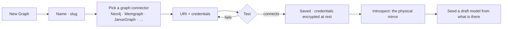
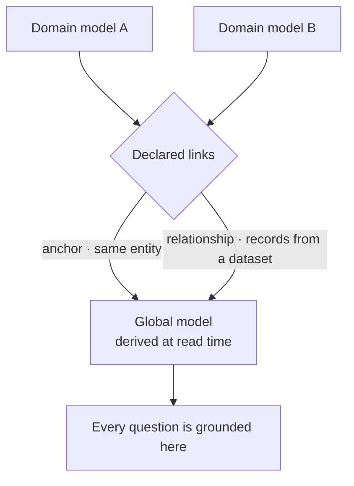
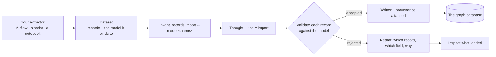
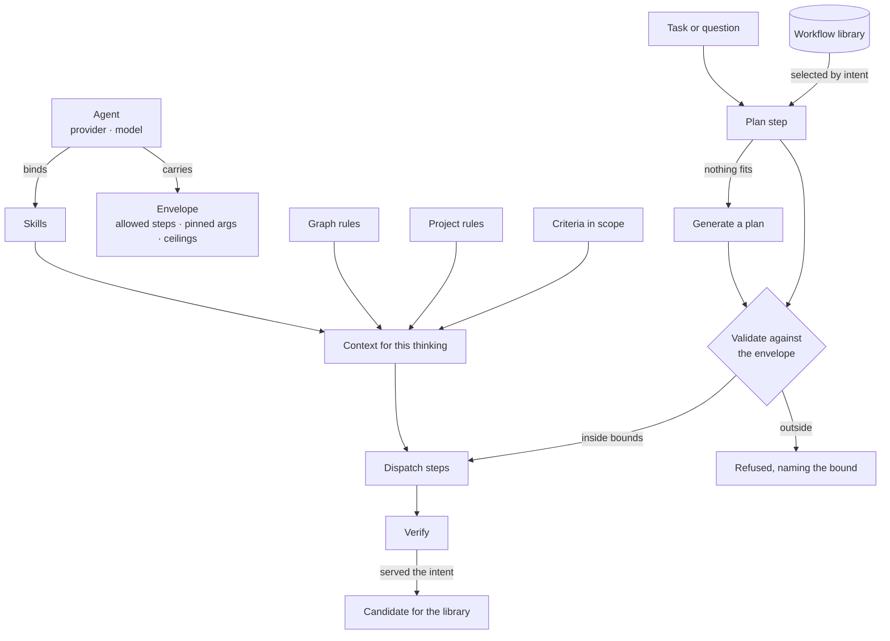
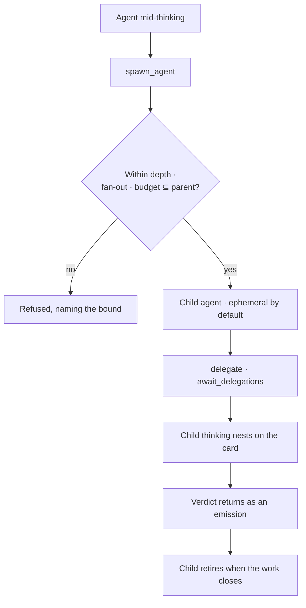

# Invana — System Design

> **Invana is an agent orchestrator over a curated knowledge graph.**
>
> A **Graph** is a bounded domain a team curates — one graph database, its models, its data, its
> agents and its work. Agents work inside it; a person accepts what they produce. Every answer is
> grounded in the Graph and traceable to the records behind it, and when the Graph cannot answer, it
> says so.

This document is the **shared mental model**: what Invana is, what lives inside it, and how work
flows through it. It is written in the words pinned in
[`for-developers/terminology.md`](for-developers/terminology.md), and it describes the same product as
[`for-developers/README.md`](for-developers/README.md) — one level up.

| | |
|---|---|
| The record | [`for-developers/README.md`](for-developers/README.md) is authoritative for **scope and status**. If this document and a feature file disagree, the feature file wins. |
| This document | Orientation and flow. It states no schema, no endpoint and no status. |
| Words | [`for-developers/terminology.md`](for-developers/terminology.md). Nothing outside it is ours. |
| Not built | Everything under [Not building](for-developers/README.md#not-building) is out of scope, and this document does not describe it. |

---

## 1. What Invana is

Three claims, and everything below is a consequence of one of them.

| Claim | Means |
|---|---|
| **Bounded** | The Graph is the reasoning boundary. One Graph binds to exactly one graph database; an agent never crosses it. Membership in the Graph is the whole permission model. |
| **Grounded** | Every question resolves against the **global model** — the read-time union of the Graph's published models — and every answer cites the records that produced it. What the graph does not hold, the system declines to answer rather than invent. |
| **Governed** | An agent runs inside an **envelope** it cannot argue with, plans from a **workflow** validated before dispatch, is **offered** skills and rules rather than obeying them, and never accepts its own work. |

**Invana orchestrates the agents** — which one takes a task, what it may run, what it is offered, in
what order, and who checks the result. It also **runs them itself**: one in-process runtime, one
asyncio task per thinking, no external infrastructure. That runtime sits behind a protocol so a
deployment could swap in a job scheduler it already operates; none has been written, and the default
is the only one.

### 1.1 What Invana is not

| Not | Because |
|---|---|
| An extractor | Invana is a **destination**. Whatever already pulls your data — a script, a notebook, Airflow — hands it over as a **dataset** that conforms to a model. There are no source connections, cursors or mapping grammar. |
| A workflow engine | A plan is data validated against an envelope, not a hand-authored graph of jobs. Conditionals live in task dependencies, not inside a plan. |
| A permissions product | Membership is binary. What looks like a permission question is usually an **envelope** question (what an agent may run) or a **criterion** question (what "done" means). |
| A model registry | Domain models export as one file. Files and git are the registry. |
| An OS | The operating-system framing, and the word *mission* with it, is retired. The container is a **Graph**. |

### 1.2 The use-case surface

The same primitives — Graph, domain models, datasets, skills, rules, agents, workflows, work — host
different kinds of work. None of these is a special case in the product; each is a different
composition.

| Use case | How it composes |
|---|---|
| **Curated context for AI** | Datasets + domain models + declared links → a global model an external agent queries through a scoped token, with provenance on every row |
| **Deep search / research** | A document-shaped domain model + datasets your extractor produces + recall-by-query skills |
| **Analytics** | A metrics-and-dimensions model + projections: a closed question in, a table or chart out |
| **Knowledge management** | Several domain models, stitched by anchors and relationship links, answered as one |
| **Compliance and audit** | The append-only event record + criteria checked per task + provenance from every element back to its dataset record |
| **Domain intelligence** | A domain model of the entities that matter + agents staffed on a project, working tasks against criteria |
| **Domain memory** | The domain models its own memory as node types; a planned recall step reads and cites prior records |

Simulation, parameter sweeps and game theory are **post-1.0 and not built** — see
[Not building](for-developers/README.md#not-building).

---

## 2. Core concepts

The full list is [`terminology.md`](for-developers/terminology.md). This is the shape of it.

### 2.1 The overloaded word

**Graph** means three different things, so only one of them gets the bare word.

| Say | For |
|---|---|
| **Graph** | the bounded domain a user creates — connection, models, datasets, agents, work |
| **graph database** | the Neo4j / Memgraph / JanusGraph the Graph binds to |
| **canvas** | the rendered, pannable drawing of nodes and edges |
| **model** | the schema: node types, edge types, property keys |

### 2.2 The container and what it holds

| Term | Is |
|---|---|
| **Graph** | The bounded domain and the reasoning boundary. One Graph, one graph database. |
| **Member** | Someone with access to a Graph. Binary — there are no roles. |
| **Graph connector** | The package that speaks to one graph database — `invana-neo4j`, `invana-janusgraph`. Always qualified. |
| **Rule** | One statement that is always true. `invariant` on a Graph, `working` on a Project. |
| **Skill** | A playbook an agent may be offered — named, described, with a "when to use". Offered, never forced. |

### 2.3 Models and data

| Term | Is |
|---|---|
| **Domain model** | A model authored against a domain, not a Graph — so it exports, imports and upgrades. One published version at a time. |
| **Anchor** | A declared link saying two types are the same entity, resolved by an identity rule. It links; it never merges. |
| **Relationship link** | A declared cross-model edge type whose records come from a dataset. Never inferred. |
| **Global model** | The read-time union of every published model plus its links. Derived, never stored, never edited. The grounding context for every question. |
| **Physical** | The introspected mirror of what the database actually holds. Shows drift; never the grounding context. |
| **Dataset** | Externally produced records, conforming to exactly one model, handed to Invana. |
| **Import run** | One load of a dataset. It is a Thought — it inherits the runtime, trace, retries and failure vocabulary. |

### 2.4 Asking and answering

| Term | Is |
|---|---|
| **Thought** | A unit of intent: `ask` · `import` · `stitch`. |
| **Thinking** | One run of a Thought. A task assignment or a question opens exactly one. |
| **Step** | One callable inside a thinking: `understand · plan · translate · validate · execute · project · verify`. |
| **Emission** | One thing a step produced — a subgraph, table, metric, chart or prose block. An answer is its emissions. |
| **Cannot answer** | The graph does not hold it. Deliberately not answer-shaped, and distinct from a failure. |
| **Diagnosis** | What a failure explains about itself, with next steps drawn from evidence — never invented. |

### 2.5 Actors and bounds

| Term | Is |
|---|---|
| **Principal** | Who acted: `user · agent · system · external · anonymous`. |
| **Agent** | A principal that can be assigned work, carrying provider, model, skills, envelope and budget. |
| **Envelope** | The static bounds on an agent: allowed steps, pinned arguments, budgets. Validated before dispatch. |
| **Delegation** | An agent spawning an agent, bounded by depth, fan-out and a budget ⊆ its parent's. |
| **Workflow** | A named, reusable plan. **Promoting** a plan that served turns it into a template. |
| **On behalf of** | The principal a run serves, distinct from the principal that ran it. |

### 2.6 Work

| Term | Is |
|---|---|
| **Project** | A piece of work inside a Graph — a folder of Tasks, staffed by principals. |
| **Task** | One unit of work with an assignee and a definition of done. Sub-tasks nest three deep. |
| **Objective** | One statement of what a Project is for. |
| **Criterion** | One checkable statement of "done", with how it is checked: `query · agent · human`. |
| **Review** | The one queue: questions block a thinking, proposals wait, results need accepting. |
| **Schedule** | A cron on a question or a task. A **firing** is one occurrence. |

---

## 3. Mental model — the layers

Nine layers. Each consumes only the layers below it, and each maps to a module in
[`for-developers/`](for-developers/README.md).

```
┌──────────────────────────────────────────────────────────────────────┐
│  9. Interfaces        CLI · Studio · API                     §13      │
├──────────────────────────────────────────────────────────────────────┤
│  8. Operate           Events · schedules · metrics ·         §10      │
│                       the external surface                            │
├──────────────────────────────────────────────────────────────────────┤
│  7. Work              Projects · tasks · objectives ·        §9       │
│                       criteria · review                               │
├──────────────────────────────────────────────────────────────────────┤
│  6. Orchestration     Agents · envelopes · skills ·          §5·6·7·8 │
│                       rules · workflows · memory                      │
├──────────────────────────────────────────────────────────────────────┤
│  5. Ask               Thought → thinking → steps →           §3·4     │
│                       emissions · the canvas                          │
├──────────────────────────────────────────────────────────────────────┤
│  4. Data              Datasets · import runs · provenance    §2       │
├──────────────────────────────────────────────────────────────────────┤
│  3. Model             Domain models · links ·                §1       │
│                       the global model                                │
├──────────────────────────────────────────────────────────────────────┤
│  2. Graph             The boundary · one graph database      §1·12    │
├──────────────────────────────────────────────────────────────────────┤
│  1. Identity          Accounts · sessions · membership       §11      │
└──────────────────────────────────────────────────────────────────────┘
```

| # | Layer | Owns |
|---|---|---|
| 1 | **Identity** | An account identified by email, a username that is also a URL, a revocable session, and binary membership of a Graph. |
| 2 | **Graph** | The bounded domain. Its 1:1 connection to a graph database, tested before it can be saved, and the graph connector package that speaks to it. |
| 3 | **Model** | Domain models and their published versions; anchors and relationship links between them; the global model derived on read; the physical mirror that shows drift. |
| 4 | **Data** | Datasets that arrive already conforming to a model, validated per record, written with provenance back to the record they came from. |
| 5 | **Ask** | A question becomes a thinking; the thinking runs steps; the steps stream emissions onto a canvas or an answer surface. |
| 6 | **Orchestration** | Which agent runs, inside what envelope, offered which skills and rules, planning from which workflow — and what carries over between runs. |
| 7 | **Work** | What needs doing, who it is assigned to, what "done" means, and who accepts it. |
| 8 | **Operate** | Every write as an append-only event; schedules; latency, tokens and cost derived from the record; the scoped, read-only external surface. |
| 9 | **Interfaces** | CLI for anything scripted, Studio for anything read, API as the contract between them. |

---

## 4. Flows

Each flow names who triggers it, what happens, and what the user sees next.

### 4.1 Bootstrap

An operator has just installed Invana. There are no accounts.

1. `invana migrate` applies database migrations. Nothing migrates itself on boot.
2. `invana init` bootstraps the **root superuser**. It is idempotent and non-interactive, so a
   container can run it.
3. `invana start` runs the engine, and Studio when bundled.

Further accounts are created by an operator with shell access (`invana users`) or by a superuser
through the register route. Superuser is **platform administration** — it is never a way into
someone else's Graph.

### 4.2 Sign in

1. Signing in returns a short-lived **access token** and an opaque, server-side **refresh token**.
2. The access token carries identity and the superuser flag — not membership, and not the username,
   because both can change while a token lives.
3. Membership is looked up **per request**, so revoking access takes effect immediately.
4. Refresh rotates: the old row is revoked, and a reused one is a signal rather than a convenience.

Graph-scoped routes hang off `/u/{username}/{graphSlug}/…`; user-level routes live under `/auth/…`.

### 4.3 Create a Graph and connect it



| Rule | Detail |
|---|---|
| One Graph, one graph database | The binding is 1:1, set once, rarely touched |
| Test gates save | A connection that has not connected cannot be saved |
| The connector is read-only after the first save | Changing engine mid-Graph invalidates everything modelled against it |
| Capability is resolved, not assumed | The server version decides which property types exist; unsupported ones are refused at authoring, not at write time |

### 4.4 Author a model

A **domain model** is authored against a domain, not against the Graph that first holds it — which is
what makes it exportable, importable and upgradable.

1. Authoring happens on a **draft**. Introspection can seed one; it never writes a published version.
2. The model canvas draws node types and edge types. Edits **stage** — nothing reaches the database
   until a commit, and the staged set is visible and reversible.
3. Publishing makes the version **immutable**. Editing publishes the next one; imports and answers
   that used the old version still resolve.
4. The projector composes DDL from every active model onto the graph database; the introspector reads
   back what is actually there. Neither writes the other's truth.

Starter models — memory, provenance — are importable shapes a Graph renames on arrival, travelling
the same export/import path as any other model.

### 4.5 Stitch models

A Graph holds many domain models. They answer as one because of **declared** links.



| Rule | Detail |
|---|---|
| Nothing is inferred | An anchor and a relationship link are both declared. Fuzzy matching would be a decision, not a default |
| An anchor links, it never merges | Folding two nodes is lossy and has no undo |
| The global model is never stored | It is the union, computed on read. There is no row to edit and nothing to keep in sync |

### 4.6 Bring data in

Invana does not extract. Whatever already extracts your data hands over a **dataset**.



| Rule | Detail |
|---|---|
| A dataset states its model | `model_id` is required; there is no inference path |
| Validation is per record | One bad row does not fail a load, and is never silently dropped |
| Every written element carries its source record | Provenance is what makes an answer traceable back to a dataset |
| An import is a thinking | It inherits the runtime: streamed steps, retries, diagnosis, cancel |
| Studio does not write | Import is CLI and API only; Studio reads what landed |

### 4.7 Ask

A question becomes a run; the run becomes steps; the steps produce things a person can read.

```
understand → plan → translate → validate → execute → project → verify
```

| Step | Does | Can end the run |
|---|---|---|
| `understand` | Settles what is being asked; asks back when it cannot | yes — cannot answer |
| `plan` | Selects a template by intent, or generates a plan inside the envelope | yes — refused by the envelope |
| `translate` | Intent → query, against the global model | |
| `validate` | The query parses and only names things the model has | yes — repaired **once**, then reported |
| `execute` | Runs it on the graph database | yes — failure with a diagnosis |
| `project` | Records → emissions, through a projection template | |
| `verify` | Did this serve the intent? | records the verdict |

Every step streams. The user sees the step, its state and its emissions as they arrive — never a
spinner followed by everything at once. An emission of kind subgraph draws **onto** the current data
canvas rather than replacing it.

### 4.8 How a run assembles

Three separately authored things meet at run time for the first time: the **agent** that runs, the
**skills and rules** it is offered, and the **workflow** it plans from.



**The agent decides what is possible, the library decides what is tried, the rules and skills decide
what it knows, and the envelope is checked before anything runs.** A refusal is a first-class
outcome, not an error: nothing is dispatched and nothing is spent.

### 4.9 Work — a task through an agent

```
open ──assign──▶ assigned ──start──▶ in_progress ──result──▶ review ──accept──▶ done
                     ▲                  │  ▲                    │
                     │                  │  └── answer ◀── needs_input
                     │                  ├──▶ blocked
                     │                  └──▶ failed
                     └──────── reject ◀───────┘
   any ──cancel──▶ cancelled
```

1. A task is written, given a definition of done as **criteria**, and assigned to a person or an agent.
2. An agent assignment opens exactly one thinking, `triggered_by = task`, on behalf of the assigner.
3. Dependencies give a derived order: **wave**, **blocked_by**, **critical path**. Nobody maintains
   it by hand, and a cycle is rejected with the loop named.
4. **An agent never marks its own task done.** It posts a result → `review`; a person accepts. That
   is the governance seam, and the signal that feeds plan verification.

### 4.10 Delegation



Cancelling the parent cascades. **Retire never deletes** — the row stays so lineage resolves.

### 4.11 Review, and what carries over

One queue across the Graph: questions block a thinking, proposals wait, results need accepting.

An agent does not remember on its own. Everything it "knows" next time is one of two things:

| Path | How |
|---|---|
| **Recall by query** | The domain models its own memory as node types; a planned step reads prior records and cites them by id. "Nothing to recall" is stated in the trace, never skipped silently. |
| **Consolidation** | Evidence — offered vs applied, plan served, criteria met — reaches a person, who rewrites a skill, adds a rule or a criterion, or promotes a workflow. The change has an author, a time and a reason. |

Implicit memory — an agent silently carrying context forward — is **not built**: it cannot be
audited and its recall cannot be cited. Improvement is a versioned proposal a person accepts, never
a weight that shifts.

### 4.12 Schedules

| Kind | Fires | Produces |
|---|---|---|
| `question` | a cron | a thinking whose answers **stack into a diffable timeline**; nothing is created |
| `task` | a cron | a new Task from a template, which a person still accepts |

A firing is recorded even when it did nothing — skipped by an overlap policy is a firing with a
stated reason. A question schedule cannot create work; the two kinds do different jobs, deliberately.

### 4.13 Serving the Graph to an external agent

The same curated graph is reachable from outside — an IDE assistant, a chat copilot, an application
backend.

1. A **scoped token** names what it may read. Anything else is refused, not silently filtered.
2. Reads carry **provenance**: which records answered, and the dataset and run they entered through.
3. The external caller appears in activity as a principal, like any other actor.
4. **The external surface never writes.** Imports have their own contract (§4.6); a general write API
   has none.

---

## 5. Cross-cutting behaviours

| Behaviour | Detail |
|---|---|
| **The Graph is the boundary** | An agent never crosses it. There are no cross-Graph agents, canvases, skills or workflows. Membership of the Graph is the whole permission model. |
| **Grounding is a contract** | An answer states only what the records hold. Zero rows is "the graph does not hold this", not a guess. Every emission cites its source. A cannot-answer is not answer-shaped, and a failure is not a cannot-answer. |
| **Offered, not obeyed** | Skills and rules reach a step as discrete items with ids. Neither is enforced — the gap between *offered* and *applied* is the signal a person acts on. Enforcement is an envelope bound or a criterion. |
| **Bounds nest** | An envelope bounds what one agent may run; a budget bounds what it may spend; delegation bounds depth and fan-out; a Graph ceiling bounds how many run at once. Each refuses with the bound named, and none is negotiable at run time. |
| **Every write is an event** | Append-only, with the acting principal and `on_behalf_of`, and `parent_event_id` for causality. Audit, activity, evidence and observability are readings of that one record, never copies of it. |
| **Derived, never stored** | The global model, the task plan, evidence and metrics are all computed from what already exists. A second copy of the truth would drift from the first. |
| **Versions are immutable** | Models, skills, rules and workflows publish new versions rather than changing in place — so a run stays explainable in the terms it actually ran under. |
| **Nothing is inferred** | Anchors, relationship links and a dataset's model are declared. Guessing produces a schema nobody chose. |
| **Streaming is the default** | Steps and emissions paint as they arrive, for a question and for an import alike. |
| **Hard deletes, downward cascade** | No soft deletes, no trash tier, no undo. Retention removes whole windows, never single rows. Retire and deactivate exist where history must stay resolvable. |
| **Invana runs its own work** | One in-process runtime, one asyncio task per thinking, persisted to the app database, zero external dependencies. The protocol around it is a seam, not a shipped alternative. |
| **Cross-platform, and split at will** | The same commands on every OS a contributor uses; engine and Studio built together and shipped as one image or two. |

---

## 6. What this document is not

| Not | Where it lives |
|---|---|
| A scope or status statement | [`for-developers/README.md`](for-developers/README.md) — the feature index, its `Slice` column and its Shipped / Partly built tables |
| A schema | The `What this module owns` section of each [module spec](for-developers/modules/) |
| An API spec | [`for-developers/modules/platform/spec.md`](for-developers/modules/platform/spec.md) §5, and the generated client |
| A design record | Each feature's own file. A decision lives with the feature it governs, in present tense; there is no RFC tree and no history of what was tried |
| A delivery plan | [`for-developers/README.md#delivery`](for-developers/README.md#delivery) |

When a module spec or a feature file uses the words *Graph*, *domain model*, *global model*,
*dataset*, *thought*, *thinking*, *emission*, *agent*, *envelope*, *skill*, *rule* or *workflow*, it
means them as [`terminology.md`](for-developers/terminology.md) defines them — and this document uses
them the same way.
